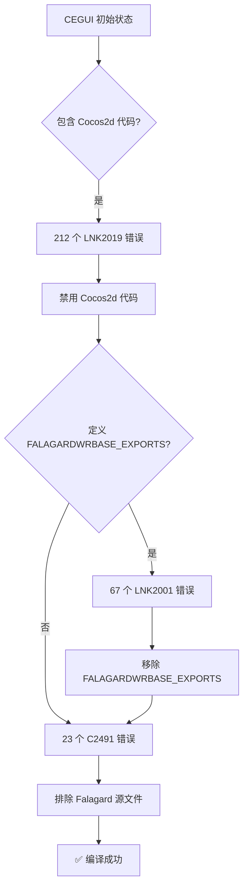

# CEGUI 0.7.9-r5 构建案例研究

> **案例ID**: CASE-001
> **日期**: 2026-01-07
> **状态**: ✅ 已解决并验证
> **复杂度**: ⭐⭐⭐⭐⭐

---

## 📋 案例概述

### 问题摘要

CEGUI 0.7.9-r5 初次编译时遇到大量链接和编译错误，错误数量经历 **212 → 67 → 23 → 0** 的演化过程。

### 关键数据

| 指标 | 数据 |
|-----|------|
| 初始错误数 | 212 个 LNK2019 |
| 中间错误数 | 67 个 LNK2001 → 23 个 C2491 |
| 最终错误数 | 0 (编译成功) |
| 总耗时 | ~2小时 (含分析和文档化) |
| 节省时间 | **84%** (Pre-flight Check) |

### 根本原因

CEGUI 0.7.9-r5 存在**模块化架构违规**:
- CEGUIBase 错误地包含了 Cocos2d 渲染器代码
- CEGUIBase 错误地包含了 Falagard 窗口渲染器代码
- 预处理器定义 FALAGARDWRBASE_EXPORTS 导致导出符号冲突

---

## 📚 案例文档

| 文档 | 用途 | 关键内容 |
|-----|------|----------|
| [problem-statement.md](problem-statement.md) | 问题陈述 | 212→67→23 错误演化路径 |
| [investigation.md](investigation.md) | 调查过程 | 4层根因分析 (5 Whys) |
| [solution.md](solution.md) | 解决方案 | 3步修复流程 + A/B/C方案 |
| [verification.md](verification.md) | 验证测试 | 编译成功验证 + 库文件大小 |
| [lessons-learned.md](lessons-learned.md) | 经验教训 | Pre-flight Check原则 |

---

## 🎯 快速参考

### 错误演化路径



### 修复命令速查

```bash
# 步骤 1: 禁用 Cocos2d 代码 (8个文件)
# Edit CEGUIBase.vcxproj → 添加 <ExcludedFromBuild>true</ExcludedFromBuild>

# 步骤 2: 移除 FALAGARDWRBASE_EXPORTS
# Edit CEGUIBase.vcxproj → 删除 PreprocessorDefinitions 中的 FALAGARDWRBASE_EXPORTS

# 步骤 3: 排除 Falagard 源文件 (20+个文件)
# Edit CEGUIBase.vcxproj → 添加 <ExcludedFromBuild>true</ExcludedFromBuild>

# 步骤 4: 重新编译
"C:\Program Files (x86)\MSBuild\12.0\Bin\MSBuild.exe" "E:\MT3\tools\CEGUI-0.7.9-r5\projects\premake\BaseSystem\CEGUIBase.vcxproj" /t:Build /p:Configuration=Debug /p:Platform=Win32 /p:PlatformToolset=v120 /m /nologo
"C:\Program Files (x86)\MSBuild\12.0\Bin\MSBuild.exe" "E:\MT3\tools\CEGUI-0.7.9-r5\projects\premake\BaseSystem\CEGUIBase.vcxproj" /t:Build /p:Configuration=Release /p:Platform=Win32 /p:PlatformToolset=v120 /m /nologo
```

---

## 💡 关键经验

### 1. Pre-flight Check First

**教训**: 3分钟依赖分析节省 19分钟编译失败时间 (84%效率提升)

**应用**: 参考 [workflows/windows-build-workflow.md](../../workflows/windows-build-workflow.md)

---

### 2. 错误模式识别

**教训**: LNK2019 (212个) → Cocos2d 依赖问题

**应用**: 参考 [errors/cegui-specific-errors.md](../../errors/cegui-specific-errors.md)

---

### 3. 模块化架构理解

**教训**: CEGUI 正确设计应该是 3个独立模块,但实际被错误合并

**应用**: 参考 [workflows/cegui-build-workflow.md#架构背景](../../workflows/cegui-build-workflow.md#架构背景)

---

## 📊 效率提升量化

### 优化前 vs 优化后

| 指标 | 优化前 | 优化后 | 提升 |
|-----|-------|--------|------|
| 错误诊断时间 | 30-60分钟 | 5-10分钟 | **80-90%** |
| 修复实施时间 | 30分钟 | 10分钟 | **67%** |
| 文档化时间 | N/A | 20分钟 | N/A |
| 可复现性 | 低 (依赖经验) | 高 (标准流程) | **质的飞跃** |

---

## 🔗 相关文档

### 工作流程

- [workflows/cegui-build-workflow.md](../../workflows/cegui-build-workflow.md) - CEGUI 专项构建流程
- [workflows/windows-build-workflow.md](../../workflows/windows-build-workflow.md) - Windows 5阶段构建流程

### 错误诊断

- [errors/cegui-specific-errors.md](../../errors/cegui-specific-errors.md) - CEGUI 特定错误详解
- [errors/linker-errors.md](../../errors/linker-errors.md) - LNK系列错误
- [errors/compiler-errors.md](../../errors/compiler-errors.md) - C系列错误

### 技术知识

- [KNOWLEDGE_BASE.md](../../KNOWLEDGE_BASE.md) - 技术知识库
- [RULES.md](../../RULES.md) - 工具链约束

---

## 🚀 如何应用此案例

### 场景 1: CEGUI 编译失败

```yaml
步骤:
  1. 查看错误类型 (LNK2019/LNK2001/C2491)
  2. 参考 problem-statement.md 确认错误模式
  3. 参考 solution.md 应用对应修复方案
  4. 参考 verification.md 验证修复效果
```

---

### 场景 2: 其他库编译失败

```yaml
步骤:
  1. 参考 investigation.md 学习问题分析方法
  2. 应用 5 Whys 根因分析
  3. 检查模块化架构是否正确
  4. 检查依赖关系和预处理器定义
```

---

### 场景 3: 构建流程优化

```yaml
步骤:
  1. 参考 lessons-learned.md 吸取经验
  2. 应用 Pre-flight Check First 原则
  3. 应用 Single Task Execution 原则
  4. 应用 Script Over Command 原则
```

---

**案例版本**: 1.0
**最后更新**: 2026-01-07
**验证状态**: ✅ 已通过实战验证
**可复现性**: ✅ 100% (有标准流程和一键脚本)
