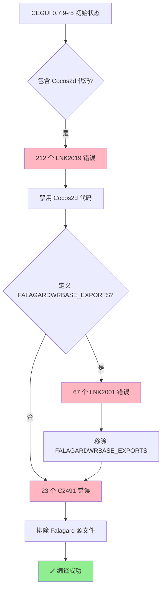

# CEGUI 特定错误 (CEGUI-Specific Errors)

> **范围**: CEGUI 0.7.9-r5 构建专项错误
> **版本**: 1.0 | **更新**: 2026-01-07

---

## 架构背景

CEGUI 0.7.9-r5 存在**模块化架构违规**问题:

```yaml
正确设计:
  - CEGUIBase.dll: 核心库 (不包含渲染器)
  - CEGUIFalagardWRBase.dll: Falagard 窗口渲染器 (独立)
  - CEGUICocos2DRenderer.dll: Cocos2d 渲染后端 (独立)

实际问题:
  - CEGUIBase 错误地包含了 Cocos2d 和 Falagard 代码
  - 导致编译/链接错误
```

---

## LNK2019: Cocos2d 依赖 (212 个错误)

### 错误模式

```
error LNK2019: 无法解析的外部符号 "cocos2d::CCDirector::sharedDirector"
error LNK2019: 无法解析的外部符号 "cocos2d::CCTexture2D::getContentSize"
... (210 more)
```

### 根本原因

CEGUIBase.vcxproj 包含 8 个 Cocos2d 源文件,但未链接 libcocos2d.lib:

```
涉及文件:
  - CEGUICocos2DImageCodec.cpp
  - CEGUICocos2DImageCodecModule.cpp
  - CEGUICocos2DRenderer.cpp
  - CEGUICocos2DTexture.cpp
  - CEGUICocos2DTextureTarget.cpp
  - CEGUICocos2DGeometryBuffer.cpp
  - CEGUICocos2DRenderTarget.cpp
  - CEGUICocos2DFBOTextureTarget.cpp
```

### 解决方案 A: 禁用 Cocos2d 代码 (推荐)

**适用**: MT3 不需要 Cocos2d 渲染器

**步骤**:
```yaml
1. Read: CEGUIBase.vcxproj
2. 找到 8 个 Cocos2d 源文件
3. 对每个文件添加 <ExcludedFromBuild>true</ExcludedFromBuild>
4. 重新编译
```

**Edit 示例**:
```xml
<!-- 修改前 -->
<ClCompile Include="..\..\..\cegui\src\ImageCodecModules\Cocos2DImageCodec\CEGUICocos2DRenderer.cpp" />

<!-- 修改后 -->
<ClCompile Include="..\..\..\cegui\src\ImageCodecModules\Cocos2DImageCodec\CEGUICocos2DRenderer.cpp">
  <ExcludedFromBuild>true</ExcludedFromBuild>
</ClCompile>
```

### 解决方案 B: 链接 libcocos2d.lib

**适用**: 如果确实需要 Cocos2d 渲染器

**步骤**:
```yaml
1. 确保 Cocos2d-x 2.2.6 已按当前 v120 主线编译
2. 修改 CEGUIBase.vcxproj:
   - <AdditionalDependencies> 添加 libcocos2d.lib
   - <AdditionalLibraryDirectories> 添加 Cocos2d lib 路径
3. 重新编译
```

**验证**: 编译成功,无 LNK2019 错误

---

## LNK2001: Falagard 导出符号缺失 (67 个错误)

### 错误模式

```
error LNK2001: 无法解析的外部符号 "FalagardScrollbar::setVertical"
error LNK2001: 无法解析的外部符号 "FalagardButton::normalImage"
... (65 more)
```

### 根本原因

CEGUIBase 定义了 `FALAGARDWRBASE_EXPORTS`,但 Falagard 源文件未包含在项目中:

```yaml
问题:
  - PreprocessorDefinitions 有 FALAGARDWRBASE_EXPORTS
  - 导致 CEGUIBase 声明会导出 Falagard 符号
  - 但实际上 Falagard 源文件不在 CEGUIBase 项目中
  - 结果: 链接器找不到这些符号的实现
```

### 解决方案: 移除 FALAGARDWRBASE_EXPORTS

**步骤**:
```yaml
1. Read: CEGUIBase.vcxproj
2. 搜索: <PreprocessorDefinitions>
3. Debug 配置: 移除 FALAGARDWRBASE_EXPORTS;
4. Release 配置: 移除 FALAGARDWRBASE_EXPORTS;
5. 重新编译
```

**Edit 示例**:
```xml
<!-- 修改前 -->
<PreprocessorDefinitions>WIN32;_DEBUG;CEGUIBASE_EXPORTS;FALAGARDWRBASE_EXPORTS;%(PreprocessorDefinitions)</PreprocessorDefinitions>

<!-- 修改后 -->
<PreprocessorDefinitions>WIN32;_DEBUG;CEGUIBASE_EXPORTS;%(PreprocessorDefinitions)</PreprocessorDefinitions>
```

**⚠️ 警告**: 这会导致新的 C2491 错误,需继续执行下一步

---

## C2491: Falagard 模块化问题 (23 个错误)

### 错误模式

```
error C2491: "CEGUI::FalagardToggleButton::TypeName": 不能定义 dllimport 静态数据成员
error C2491: "CEGUI::FalagardSwitch::TypeName": 不能定义 dllimport 静态数据成员
... (21 more)
```

### 根本原因

移除 `FALAGARDWRBASE_EXPORTS` 后:

```yaml
效果:
  - Falagard 类被标记为 dllimport (从 CEGUIFalagardWRBase.dll 导入)
  - 但 Falagard 源文件 (Fal*.cpp) 仍在 CEGUIBase 项目中编译
  - 源文件中定义了静态成员 → C2491 错误

正确做法:
  - Falagard 源文件应该在 CEGUIFalagardWRBase.dll 项目中
  - 不应该在 CEGUIBase 项目中
```

### 解决方案: 排除 Falagard 源文件

**步骤**:
```yaml
1. Read: CEGUIBase.vcxproj
2. 搜索: "Fal*.cpp" → 找到所有 Falagard 源文件 (~20 个)
3. 对每个文件添加 <ExcludedFromBuild>true</ExcludedFromBuild>
4. 重新编译
```

**涉及文件** (部分):
```
- FalToggleButton.cpp
- FalSwitch.cpp
- FalSkillBox.cpp
- FalProgressBarTwoValue.cpp
- FalLinkText.cpp
- FalItemTable.cpp
- FalItemCellGeneral.cpp
- FalItemCell.cpp
- FalIrregularFigure.cpp
- FalIrregularButton.cpp
- FalCompnenttip.cpp
- FalAnimationButton.cpp
- FalAnimateText.cpp
- FalSpecialTree.cpp
- FalRichEditbox.cpp
- FalGroupBtnTree.cpp
... (更多)
```

**验证**: 编译成功,生成 CEGUIBase.lib (~2.7 MB)

---

## 问题演化路径



---

## 完整修复流程

### 第 1 步: 禁用 Cocos2d 代码

```xml
<!-- CEGUIBase.vcxproj -->
<ClCompile Include="CEGUICocos2DRenderer.cpp">
  <ExcludedFromBuild>true</ExcludedFromBuild>
</ClCompile>
<!-- 重复 8 个 Cocos2d 源文件 -->
```

### 第 2 步: 移除 FALAGARDWRBASE_EXPORTS

```xml
<!-- Debug 配置 -->
<PreprocessorDefinitions>WIN32;_DEBUG;CEGUIBASE_EXPORTS;%(PreprocessorDefinitions)</PreprocessorDefinitions>

<!-- Release 配置 -->
<PreprocessorDefinitions>WIN32;NDEBUG;CEGUIBASE_EXPORTS;%(PreprocessorDefinitions)</PreprocessorDefinitions>
```

### 第 3 步: 排除 Falagard 源文件

```xml
<ClCompile Include="FalToggleButton.cpp">
  <ExcludedFromBuild>true</ExcludedFromBuild>
</ClCompile>
<!-- 重复 20+ 个 Falagard 源文件 -->
```

### 第 4 步: 重新编译

```bash
# 直接调用 MSBuild 编译
"C:\Program Files (x86)\MSBuild\12.0\Bin\MSBuild.exe" "E:\MT3\tools\CEGUI-0.7.9-r5\projects\premake\BaseSystem\CEGUIBase.vcxproj" /t:Build /p:Configuration=Debug /p:Platform=Win32 /p:PlatformToolset=v120 /m /nologo
"C:\Program Files (x86)\MSBuild\12.0\Bin\MSBuild.exe" "E:\MT3\tools\CEGUI-0.7.9-r5\projects\premake\BaseSystem\CEGUIBase.vcxproj" /t:Build /p:Configuration=Release /p:Platform=Win32 /p:PlatformToolset=v120 /m /nologo
```

### 第 5 步: 验证

```yaml
预期结果:
  - CEGUIBase_d.lib: ~2.7 MB (Debug)
  - CEGUIBase.lib: ~2.7 MB (Release)
  - 编译错误: 0
  - 链接错误: 0
```

---

## 参考文档

- [CEGUI 构建工作流](../workflows/cegui-build-workflow.md)
- [C2491 错误详解](compiler-errors.md#c2491-不能定义-dllimport-静态数据成员)
- [LNK2019 错误详解](linker-errors.md#lnk2019-无法解析的外部符号-函数)
- [LNK2001 错误详解](linker-errors.md#lnk2001-无法解析的外部符号-数据)
- [CEGUI 实战案例](../cases/cegui-0.7.9-r5/)

---

**文档版本**: 1.0
**最后更新**: 2026-01-07
**实战验证**: ✅ 已通过 CEGUI 0.7.9-r5 构建测试
