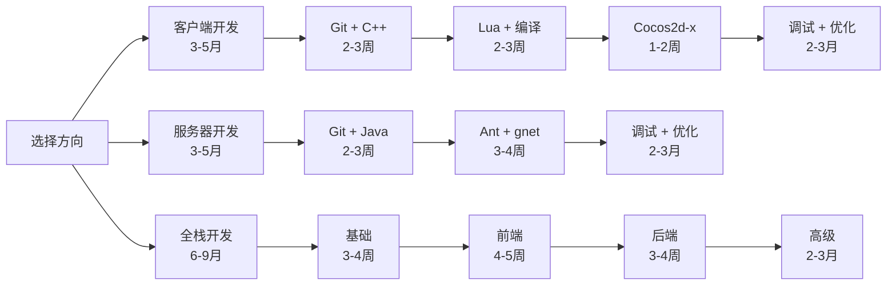

# MT3 项目技能知识体系 (Skills Knowledge Base)

**版本**: v2.7.0
**更新日期**: 2026-03-04
**维护者**: 技术委员会
**适用范围**: MT3 项目（客户端 + 服务器端）

> 📊 **快速导航**: [技术知识库](../KNOWLEDGE_BASE.md) | [技能依赖关系图](dependency-graph.md) | [学习路径推荐](#-学习路径推荐)

> Canonical Source: Skill 元数据（模块分组、依赖、参数标准）以  
> `.claude/config/skills.manifest.json` 为准。

---

## 📋 目录结构

```
skills/
├── README.md                         # 本文件 - 技能体系总览
├── dependency-graph.md               # 技能依赖关系图 & 学习路径
│
├── client/                           # 客户端技能 (9个)
│   ├── cpp-development.md            # ✅ C++ 开发技能 (⭐⭐⭐ 中级, 🔴 必需)
│   ├── lua-scripting.md              # ✅ Lua 脚本技能 (⭐⭐ 初级, 🔴 必需)
│   ├── cocos2dx-usage.md             # ✅ Cocos2d-x 使用 (⭐⭐⭐ 中级, 🟡 重要)
│   ├── cegui-usage.md                # ✅ CEGUI UI 框架 (⭐⭐⭐ 中级, 🔴 必需)
│   ├── tolua-binding.md              # ✅ tolua++ 绑定开发 (⭐⭐⭐ 中级, 🔴 必需)
│   ├── nuclear-engine.md             # ✅ Nuclear 引擎开发 (⭐⭐⭐ 高级, 🔴 必需)
│   ├── fireclient-framework.md        # ✅ FireClient 框架开发 (⭐⭐⭐ 高级, 🔴 必需)
│   ├── windows-build.md              # ✅ Windows 编译 (⭐⭐ 初级, 🔴 必需)
│   └── android-build.md              # ✅ Android 编译 (⭐⭐⭐ 中级, 🔴 必需)
│
├── server/                           # 服务器端技能 (5个)
│   ├── java-development.md           # ✅ Java 开发技能 (⭐⭐⭐ 中级, 🔴 必需)
│   ├── ant-build.md                  # ✅ Ant 构建 (⭐⭐ 初级, 🔴 必需)
│   ├── gnet-framework.md             # ✅ gnet 网络框架 (⭐⭐⭐ 中级, 🔴 必需)
│   ├── xbean-system.md               # ✅ xbean 数据系统 (⭐⭐⭐ 中级, 🔴 必需)
│   └── distributed-arch.md           # ✅ 分布式架构 (⭐⭐⭐⭐ 高级, 🟡 重要)
│
└── common/                           # 通用技能 (8个)
    ├── git-workflow.md               # ✅ Git 工作流 (⭐⭐ 初级, 🔴 必需)
    ├── debugging.md                  # ✅ 调试技巧 (⭐⭐⭐ 中级, 🔴 必需)
    ├── performance-optimization.md   # ✅ 性能优化 (⭐⭐⭐⭐ 高级, 🟡 重要)
    ├── dependency-management.md      # ✅ 依赖管理 (⭐⭐⭐ 中级, 🟡 重要)
    ├── protocol-design.md            # 🆕 协议设计 (⭐⭐⭐ 中级, 🟡 重要)
    ├── build-troubleshooting.md      # ✅ 构建问题排查 (⭐⭐⭐ 中级, 🔴 必需)
    ├── project-context.md            # ✅ 项目上下文 (⭐⭐ 初级, 🟢 参考)
    └── engine-tools-build.md         # ✅ 引擎工具编译 (⭐⭐⭐ 中级, 🟡 重要)

图例: ✅ 已完成 | 🆕 新增 (2026-01-10) | 🔧 修复 (2026-01-27)
```

---

## 🎯 技能等级定义

### 初级 (Junior)
- ✅ 能够理解基本概念
- ✅ 能够在指导下完成简单任务
- ✅ 熟悉基本工具和命令
- 📅 预计时间：1-2周

### 中级 (Intermediate)
- ✅ 能够独立完成常见任务
- ✅ 理解核心架构和设计模式
- ✅ 能够排查常见问题
- 📅 预计时间：1-2月

### 高级 (Advanced)
- ✅ 能够设计和优化架构
- ✅ 能够解决复杂技术问题
- ✅ 能够指导他人
- 📅 预计时间：3-6月

---

## 🗺️ 学习路径推荐

> 📊 **完整学习路径和技能依赖关系详见**: [dependency-graph.md](dependency-graph.md)

### 快速路径选择



### 1️⃣ 客户端开发路线 (3-5月)

```
阶段1: 基础入门 (2-3周)
├─ Git 工作流 → common/git-workflow.md (⭐⭐ 初级, 1周)
└─ C++ 开发 → client/cpp-development.md (⭐⭐⭐ 中级, 2周)

阶段2: 核心技能 (3-4周)
├─ Lua 脚本 → client/lua-scripting.md (⭐⭐ 初级, 1-2周)
├─ Windows 编译 → client/windows-build.md (⭐⭐ 初级, 1周)
└─ Cocos2d-x 使用 → client/cocos2dx-usage.md (⭐⭐⭐ 中级, 1-2周)

阶段3: 高级进阶 (2-3月)
├─ 调试技巧 → common/debugging.md (⭐⭐⭐ 中级, 1月)
└─ 性能优化 → common/performance-optimization.md (⭐⭐⭐⭐ 高级, 2月)
```

### 2️⃣ 服务器开发路线 (3-5月)

```
阶段1: 基础入门 (2-3周)
├─ Git 工作流 → common/git-workflow.md (⭐⭐ 初级, 1周)
└─ Java 开发 → server/java-development.md (⭐⭐⭐ 中级, 2周)

阶段2: 核心技能 (3-4周)
├─ Ant 构建 → server/ant-build.md (⭐⭐ 初级, 1周)
└─ gnet 框架 → server/gnet-framework.md (⭐⭐⭐ 中级, 2-3周)

阶段3: 高级进阶 (2-3月)
├─ 调试技巧 → common/debugging.md (⭐⭐⭐ 中级, 1月)
└─ 性能优化 → common/performance-optimization.md (⭐⭐⭐⭐ 高级, 2月)
```

### 3️⃣ 全栈开发路线 (6-9月)

**完整路径详见**: [dependency-graph.md - 全栈开发路径](dependency-graph.md#-学习路径推荐)

---

## 🔍 快速技能索引

### 📊 技能统计概览

| 分类 | 已完成 | 规划中 | 总计 | 完成度 |
|-----|--------|--------|------|--------|
| **客户端** | 9 | 0 | 9 | 100% |
| **服务器** | 5 | 0 | 5 | 100% |
| **通用** | 8 | 0 | 8 | 100% |
| **总计** | **22** | **0** | **22** | **100%** |

### 按技术栈查找

| 技术栈 | 技能文档 | 难度 | 优先级 | 状态 |
|--------|---------|------|--------|------|
| **C++** | [cpp-development.md](client/cpp-development.md) | ⭐⭐⭐ 中级 | 🔴 必需 | ✅ v1.1 |
| **Lua** | [lua-scripting.md](client/lua-scripting.md) | ⭐⭐ 初级 | 🔴 必需 | ✅ v1.1 |
| **Cocos2d-x** | [cocos2dx-usage.md](client/cocos2dx-usage.md) | ⭐⭐⭐ 中级 | 🟡 重要 | 🆕 v1.0 |
| **Nuclear引擎** | [nuclear-engine.md](client/nuclear-engine.md) | ⭐⭐⭐ 高级 | 🔴 必需 | 🆕 v1.0 |
| **FireClient框架** | [fireclient-framework.md](client/fireclient-framework.md) | ⭐⭐⭐ 高级 | 🔴 必需 | 🆕 v1.0 |
| **Windows编译** | [windows-build.md](client/windows-build.md) | ⭐⭐ 初级 | 🔴 必需 | ✅ v1.4 |
| **Android编译** | [android-build.md](client/android-build.md) | ⭐⭐⭐ 中级 | 🔴 必需 | ✅ v2.1 |
| **Java** | [java-development.md](server/java-development.md) | ⭐⭐⭐ 中级 | 🔴 必需 | ✅ v1.1 |
| **Ant构建** | [ant-build.md](server/ant-build.md) | ⭐⭐ 初级 | 🔴 必需 | 🆕 v1.0 |
| **gnet框架** | [gnet-framework.md](server/gnet-framework.md) | ⭐⭐⭐ 中级 | 🔴 必需 | 🆕 v1.0 |
| **xbean系统** | [xbean-system.md](server/xbean-system.md) | ⭐⭐⭐ 中级 | 🔴 必需 | ✅ v1.0 |
| **分布式架构** | [distributed-arch.md](server/distributed-arch.md) | ⭐⭐⭐⭐ 高级 | 🟡 重要 | ✅ v1.0 |
| **Git** | [git-workflow.md](common/git-workflow.md) | ⭐⭐ 初级 | 🔴 必需 | ✅ v1.1 |
| **调试** | [debugging.md](common/debugging.md) | ⭐⭐⭐ 中级 | 🔴 必需 | 🆕 v1.0 |
| **性能优化** | [performance-optimization.md](common/performance-optimization.md) | ⭐⭐⭐⭐ 高级 | 🟡 重要 | 🆕 v1.0 |
| **依赖管理** | [dependency-management.md](common/dependency-management.md) | ⭐⭐⭐ 中级 | 🟡 重要 | ✅ v1.0 |

### 按角色查找

#### 客户端开发者
1. [C++ 开发](client/cpp-development.md) - 必需
2. [Lua 脚本](client/lua-scripting.md) - 必需
3. [Cocos2d-x 使用](client/cocos2dx-usage.md) - 必需
4. [Nuclear 引擎开发](client/nuclear-engine.md) - 必需
5. [FireClient 框架开发](client/fireclient-framework.md) - 必需
6. [Windows 编译](client/windows-build.md) - 必需
7. [Android 编译](client/android-build.md) - 必需
8. [Git 工作流](common/git-workflow.md) - 必需

#### 服务器开发者
1. [Java 开发](server/java-development.md) - 必需
2. [Ant 构建](server/ant-build.md) - 必需
3. [gnet 框架](server/gnet-framework.md) - 必需
4. [xbean 系统](server/xbean-system.md) - 必需
5. [分布式架构](server/distributed-arch.md) - 重要
6. [Git 工作流](common/git-workflow.md) - 必需

#### 全栈开发者
- **客户端技能** + **服务器端技能** + **通用技能**
- 建议学习路径：先专精一端，再扩展到另一端

---

## 🎓 学习建议

### 新人入职 (第1周)
```
必读文档：
1. 项目规则: ../RULES.md
2. 项目概览: docs/02-项目概述.md
3. 快速启动: docs/01-快速启动指南.md

必学技能：
1. Git 工作流: skills/common/git-workflow.md
2. 根据岗位选择客户端或服务器端基础技能
```

### 初级开发者 (第2-4周)
```
客户端：
- C++ 开发基础
- Lua 脚本基础
- Windows 编译环境搭建

服务器端：
- Java 开发基础
- Ant 构建系统
- 服务器架构理解
```

### 中级开发者 (第2-3月)
```
客户端：
- Cocos2d-x 深入理解
- Nuclear 引擎掌握
- Android 编译和调试 → client/android-build.md (⭐⭐⭐ 中级, 1-2周)

服务器端：
- gnet 框架深入
- 协议开发
- 服务间通信
```

### 高级开发者 (第4-6月)
```
全栈：
- 架构设计能力
- 性能优化能力
- 跨模块重构能力
- 技术方案设计
```

---

## 📊 技能掌握度自测

### 客户端技能自测

```
C++ 开发：
[ ] 理解五层架构
[ ] 能够编写新的类和模块
[ ] 理解预编译头机制
[ ] 熟悉 SOLID 原则

Lua 脚本：
[ ] 能够阅读现有脚本
[ ] 能够修改游戏逻辑
[ ] 理解 tolua++ 绑定
[ ] 能够优化脚本性能

Cocos2d-x：
[ ] 理解 CCNode 层级结构
[ ] 能够使用精灵和动画
[ ] 理解动作系统
[ ] 能够优化渲染性能
```

### 服务器端技能自测

```
Java 开发：
[ ] 理解分布式架构
[ ] 能够编写新的服务模块
[ ] 理解 xbean 数据管理
[ ] 熟悉并发编程

gnet 框架：
[ ] 理解 RPC 机制
[ ] 能够定义新协议
[ ] 能够实现协议处理器
[ ] 理解网络优化

分布式架构：
[ ] 理解各服务器模块职责
[ ] 能够设计服务间通信
[ ] 理解负载均衡
[ ] 能够排查分布式问题
```

---

## 🔗 相关资源

### 项目文档
- [技术知识库](../KNOWLEDGE_BASE.md) - AI专用技术速查 (架构图、代码模式、错误修复)
- [项目规则](../RULES.md) - 核心开发规则
- [目录索引](../INDEX.md) - .claude目录导航
- [技术体系总结](../../docs/02-技术架构/01-技术体系总览.md) - 深度技术分析

### 外部资源
- **Cocos2d-x 2.0**: https://docs.cocos.com/cocos2d-x/v2/
- **Lua 5.1**: https://www.lua.org/manual/5.1/
- **Java SE 8**: https://docs.oracle.com/javase/8/docs/
- **Apache Ant**: https://ant.apache.org/manual/

---

## 💡 使用建议

1. **按需学习**: 根据实际工作任务选择技能文档
2. **循序渐进**: 遵循技能路线图，不要跳跃式学习
3. **实践为主**: 理论结合实践，在项目中应用所学
4. **定期复习**: 定期回顾技能文档，巩固知识
5. **持续更新**: 项目演进时，技能文档也需要更新

---

## 📝 最近更新 (v2.7.0 - 2026-03-04)

### 🎉 v2.7.0 更新内容 (2026-03-04)
1. **升级 Windows 编译技能文档** ([windows-build.md](client/windows-build.md) v1.4)
   - 新增 Launcher（登录器）独立构建流程（Debug/Release Rebuild）
   - 补充 PowerShell 调用 `vcvarsall` 的稳定写法（避免 `x86` 误解析）
   - 补充 Launcher 实际产物路径校验规则：`Debug -> client/Launcher/Debug`、`Release -> client/resource`
   - 补充“手动启动验证，不做短时自动探测”的执行约束
   - 补充与 `05/16` 开发文档联动入口，降低构建知识漂移风险

### 🎉 v2.6.0 更新内容 (2026-03-04)
1. **升级 Android 编译技能文档** ([android-build.md](client/android-build.md) v2.1)
   - 对齐当前仓库真实入口：`mt3_build.bat + mt3_apk.bat + build/build.xml`
   - 补充环境修复 SOP（管理员权限、Machine/User 变量、PATH 清理）
   - 补充 ant-contrib 安装与验收标准命令（where/java/ant/aapt/adb）
   - 增加 Locojoy 点卡服 JDK1.7 特例说明与阻塞点矩阵
   - 增加“编译问题 vs 热更新配置问题”边界说明
### 🎉 v2.2.0 更新内容
1. **完成分布式架构技能文档** ([distributed-arch.md](server/distributed-arch.md) v1.0)
   - 四层架构概览（客户端→网关→主控→逻辑→数据）
   - 10 个核心服务器详解（jmxc, gateway, gdelivery 等）
   - 服务间 RPC 通信机制
   - 服务器启动顺序与脚本
   - 负载均衡策略（场景分线、水平扩展）
   - 容错与故障恢复
   - 监控与运维指南

2. **新增依赖管理技能文档** ([dependency-management.md](common/dependency-management.md) v1.0)
   - 依赖架构概览（客户端/服务器依赖分类）
   - v120 工具集约束详解
   - CRT 运行时库约束
   - 客户端依赖矩阵（20+ 依赖）
   - 依赖配置方法（vcxproj, props, DLL）
   - 版本确认方法
   - 常见问题与解决（LNK2001, LNK2038 等）
   - 添加新依赖流程

3. **技能体系完成度达 100%**
    - 22 个技能文档全部完成
    - 客户端: 9/9 (100%)
    - 服务器: 5/5 (100%)
    - 通用: 8/8 (100%)

### 📋 v2.1.0 更新内容 (2026-01-01)
1. **完成 Android 编译技能文档** ([android-build.md](client/android-build.md) v2.0)
   - 环境要求（NDK r16 clang + JDK 1.8 + Ant）
   - 详细安装步骤（Windows/Linux/macOS）
   - 项目结构说明和配置文件详解
   - 编译流程和工作流图
   - 7 种常见错误解决方案
   - 编译优化技巧（时间对比）
   - 多渠道编译和批处理脚本
   - 调试和签名配置
   - 实践项目（初级/中级/高级）

2. **客户端技能完成度达 100%**
    - 7 个客户端技能文档全部完成
    - 总体完成度提升至 100%（20/20）

### 📋 v2.0.0 更新内容 (2025-11-24)
1. **新增 6 个核心技能文档** (Phase 1 完成)
   - [调试技巧](common/debugging.md) (~850行)
   - [Windows 编译](client/windows-build.md) (~550行)
   - [Ant 构建](server/ant-build.md) (~600行)
   - [性能优化](common/performance-optimization.md) (~650行)
   - [Cocos2d-x 使用](client/cocos2dx-usage.md) (~700行)
   - [gnet 框架](server/gnet-framework.md) (~750行)

2. **优化现有 4 个文档** (添加版本控制)
   - 所有文档统一添加版本号、更新日期、维护者信息
   - 添加更新日志章节，追踪文档变更历史
   - 版本号统一为 v1.1.0

3. **创建技能依赖关系图** ([dependency-graph.md](dependency-graph.md))
   - 完整的技能依赖可视化（Mermaid 图）
   - 3 条详细学习路径（客户端、服务器、全栈）
   - 技能矩阵和依赖关系详解
   - 学习建议和进度追踪表

4. **升级 README.md** (本文档)
   - 更新目录结构和技能统计
   - 添加快速路径选择可视化
   - 优化技能索引和学习建议
   - 添加版本控制信息

### 📊 完成度追踪
- **Phase 1**: ✅ 完成 (6个新文档 + 4个文档优化)
- **Phase 2**: ✅ 完成 (技能依赖图 + README 升级)
- **Phase 3**: ⏳ 规划中 (知识图谱 + 模板库 + 自动化脚本)

### 🎯 下一步计划
详见 [dependency-graph.md](dependency-graph.md) - Phase 3

---

## 📞 联系与反馈

**文档维护**: 技术委员会（每季度审查）
**问题反馈**:
- 直接修改文档并提交 PR
- 在技能文档中添加 Issue 标记
- 联系维护者讨论改进建议

**版本历史**:
- **v2.7.0** (2026-03-04): 升级 Windows 编译技能文档至 v1.4（Launcher 构建流程实操对齐）
- **v2.6.0** (2026-03-04): 升级 Android 编译技能文档至 v2.1（实操对齐）
- **v2.5.0** (2026-01-27): 创建Nuclear引擎和FireClient框架技能文档，更新技能统计为22/22
- **v2.4.0** (2026-01-27): 修复cegui-usage.md和tolua-binding.md的YAML头部，更新技能统计为20/20
- **v2.3.0** (2026-01-05): 添加技术知识库引用，优化文档结构
- **v2.2.0** (2026-01-01): 完成分布式架构 + 依赖管理文档，技能体系完成度达 100%
- **v2.1.0** (2026-01-01): 完成 Android 编译技能文档 (android-build.md v2.0)，客户端技能完成度达 100%
- **v2.0.0** (2025-11-24): 完成 Phase 1-2，新增 6 个文档
- **v1.0.0** (2025-11-20): 初始版本，4 个基础文档

**下次审查**: 2026-04-04
