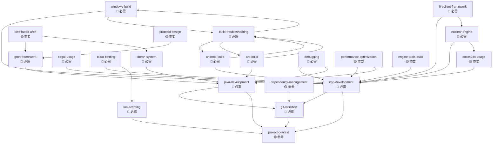

# Skills 依赖关系图

> **版本**: 2.0.0 | **更新**: 2026-02-28

---

## 📊 依赖关系图



---

## 📋 技能依赖列表

### 无依赖 (基础技能)
- `project-context` - 项目上下文理解
- `git-workflow` - Git 工作流

### 客户端技能依赖

| 技能 | 前置技能 | 说明 |
|-----|---------|------|
| **cpp-development** | git-workflow, project-context | 需要基础开发环境 |
| **lua-scripting** | project-context | 需要项目上下文 |
| **windows-build** | cpp-development, build-troubleshooting | 需要C++基础 |
| **android-build** | cpp-development, build-troubleshooting | 需要C++基础 |
| **cocos2dx-usage** | cpp-development | 需要C++基础 |
| **cegui-usage** | cpp-development | 需要C++基础 |
| **tolua-binding** | cpp-development, lua-scripting | 需要C++和Lua基础 |
| **nuclear-engine** | cpp-development, cocos2dx-usage | 需要C++和Cocos2d-x基础 |
| **fireclient-framework** | cpp-development, nuclear-engine | 需要C++和Nuclear引擎基础 |

### 服务器技能依赖

| 技能 | 前置技能 | 说明 |
|-----|---------|------|
| **java-development** | git-workflow, project-context | 需要基础开发环境 |
| **ant-build** | java-development, build-troubleshooting | 需要Java基础 |
| **gnet-framework** | java-development | 需要Java基础 |
| **xbean-system** | java-development | 需要Java基础 |
| **distributed-arch** | gnet, xbean | 需要gnet和xbean基础 |

### 通用技能依赖

| 技能 | 前置技能 | 说明 |
|-----|---------|------|
| **debugging** | cpp-development, java-development | 需要编程基础 |
| **performance-optimization** | cpp-development, java-development | 需要编程基础 |
| **dependency-management** | git-workflow | 需要Git基础 |
| **protocol-design** | gnet-framework | 需要gnet基础 |
| **build-troubleshooting** | windows-build, android-build, ant-build | 需要构建基础 |
| **engine-tools-build** | cpp-development | 需要C++基础 |

---

## 🎯 学习路径

### 客户端开发路径
```
第1周: project-context, git-workflow
第2-3周: cpp-development
第4-5周: lua-scripting, windows-build
第6-7周: cocos2dx-usage, cegui-usage
第8-9周: tolua-binding, debugging
第10-12周: nuclear-engine, fireclient-framework
第13-16周: performance-optimization, android-build
```

### 服务器开发路径
```
第1周: project-context, git-workflow
第2-3周: java-development
第4-5周: ant-build, build-troubleshooting
第6-9周: gnet-framework, xbean-system
第10-12周: debugging, protocol-design
第13-16周: distributed-arch, performance-optimization
```

### 全栈开发路径
```
第1周: project-context, git-workflow
第2-3周: cpp-development, java-development
第4-5周: lua-scripting, ant-build
第6-7周: windows-build, android-build, build-troubleshooting
第8-9周: cocos2dx-usage, gnet-framework, xbean-system
第10-12周: cegui-usage, tolua-binding, debugging
第13-16周: nuclear-engine, fireclient-framework, protocol-design
第17-20周: performance-optimization, distributed-arch
```

---

## 📊 依赖统计

### 按依赖层级
```
层级 0 (无依赖):     2  (project-context, git-workflow)
层级 1 (1个依赖):    7  (cpp-dev, lua-script, java-dev, dep-mgmt)
层级 2 (2个依赖):    7  (win-build, and-build, cocos2dx, cegui, ant-build, gnet, xbean)
层级 3 (3个依赖):    3  (tolua, nuclear, debug, perf, build-troubleshoot, protocol, engine-tools)
层级 4 (4个依赖):    2  (fireclient, distributed)
```

### 按依赖数量
```
0 依赖:  2  (project-context, git-workflow)
1 依赖:  7  (cpp-dev, lua-script, java-dev, dep-mgmt)
2 依赖:  7  (win-build, and-build, cocos2dx, cegui, ant-build, gnet, xbean)
3 依赖:  3  (tolua, nuclear, debug, perf, build-troubleshoot, protocol, engine-tools)
4 依赖:  2  (fireclient, distributed)
```

---

## 📝 版本历史

### 2.0.0 (2026-02-28)
- 添加完整的依赖关系图
- 添加学习路径推荐
- 添加依赖统计

### 1.0.0 (2026-01-27)
- 初始化依赖关系图

---

**维护者**: MT3 技术团队
**更新周期**: 按需更新
