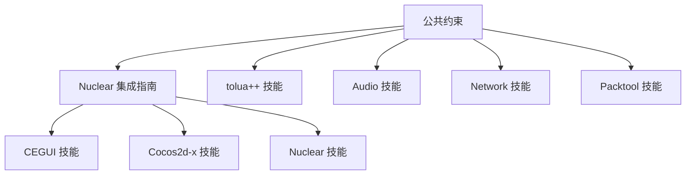

# 技能索引

> MT3 项目 AI 辅助开发技能文档索引
>
> **schema_version**: 2.1.0 | **updated**: 2026-04-11
>
> 共享规则已提取到 `ai-shared-rules/` 单一事实源，各技能通过 `shared_rules_refs` 引用而非复制内容。

## 技能文档

| 技能 | 描述 | 文档 | 状态 |
|------|------|------|------|
| CEGUI | UI 开发技能 | [SKILL.md](skills/cegui/SKILL.md) | ✅ |
| Cocos2d-x | 场景/精灵开发技能 | [SKILL.md](skills/cocos2dx/SKILL.md) | ✅ |
| Nuclear | Nuclear 引擎开发技能 | [SKILL.md](skills/nuclear/SKILL.md) | ✅ |
| FireClient | FireClient 客户端框架技能 | [SKILL.md](skills/fireclient/SKILL.md) | ✅ |
| tolua++ | C++/Lua 绑定技能 | [SKILL.md](skills/tolua/SKILL.md) | ✅ |
| Audio | 音频系统开发技能 | [SKILL.md](skills/audio/SKILL.md) | ✅ |
| Network | 网络通信开发技能 | [SKILL.md](skills/network/SKILL.md) | ✅ |
| Packtool | 资源打包技能 | [SKILL.md](skills/packtool/SKILL.md) | ✅ |
| Testing | 测试框架技能 | [SKILL.md](skills/testing/SKILL.md) | ✅ |
| Platform-Win32 | Win32 平台技能 | [SKILL.md](skills/platform-win32/SKILL.md) | ✅ |
| Platform-Android | Android 平台技能 | [SKILL.md](skills/platform-android/SKILL.md) | ✅ |
| Platform-iOS | iOS 平台技能 | [SKILL.md](skills/platform-ios/SKILL.md) | ✅ |

## 技能分类

### UI 开发
- [CEGUI 技能](skills/cegui/SKILL.md) - CEGUI UI 框架开发

### 游戏引擎
- [Cocos2d-x 技能](skills/cocos2dx/SKILL.md) - Cocos2d-x 2.0 引擎开发
- [Nuclear 技能](skills/nuclear/SKILL.md) - Nuclear 自研引擎开发

### 客户端框架
- [FireClient 技能](skills/fireclient/SKILL.md) - FireClient 客户端框架开发

### 脚本绑定
- [tolua++ 技能](skills/tolua/SKILL.md) - C++/Lua 绑定

### 系统功能
- [Audio 技能](skills/audio/SKILL.md) - 音频系统开发
- [Network 技能](skills/network/SKILL.md) - 网络通信开发

### 工具使用
- [Packtool 技能](skills/packtool/SKILL.md) - 资源打包工具使用

### 测试
- [Testing 技能](skills/testing/SKILL.md) - 测试框架

### 平台
- [Platform-Win32 技能](skills/platform-win32/SKILL.md) - Win32 平台开发
- [Platform-Android 技能](skills/platform-android/SKILL.md) - Android 平台开发
- [Platform-iOS 技能](skills/platform-ios/SKILL.md) - iOS 平台开发

## 技能依赖关系

## 技能使用场景

| 场景 | 推荐技能 |
|------|----------|
| 创建 UI 界面 | [CEGUI 技能](skills/cegui/SKILL.md) |
| 创建游戏场景 | [Cocos2d-x 技能](skills/cocos2dx/SKILL.md) |
| 集成 Nuclear 引擎 | [Nuclear 技能](skills/nuclear/SKILL.md) |
| C++/Lua 绑定 | [tolua++ 技能](skills/tolua/SKILL.md) |
| 音频播放 | [Audio 技能](skills/audio/SKILL.md) |
| 网络请求 | [Network 技能](skills/network/SKILL.md) |
| 资源打包 | [Packtool 技能](skills/packtool/SKILL.md) |

## 学习路径

### 路径 1: UI 开发
1. [公共约束](references/common-constraints.md)
2. [Nuclear 集成指南](references/nuclear-integration.md)
3. [CEGUI 技能](skills/cegui/SKILL.md)

### 路径 2: 游戏引擎开发
1. [公共约束](references/common-constraints.md)
2. [Nuclear 集成指南](references/nuclear-integration.md)
3. [Cocos2d-x 技能](skills/cocos2dx/SKILL.md)

### 路径 3: 脚本绑定
1. [公共约束](references/common-constraints.md)
2. [tolua++ 技能](skills/tolua/SKILL.md)

### 路径 4: 系统功能开发
1. [公共约束](references/common-constraints.md)
2. [Audio 技能](skills/audio/SKILL.md) 或 [Network 技能](skills/network/SKILL.md)

## 技能状态说明

- ✅ 已完成 - 技能文档已编写完成
- 🚧 规划中 - 技能文档正在规划
- ⏳ 开发中 - 技能文档正在编写

## 快速链接

- [返回首页](README.md)
- [快速入门](QUICKSTART.md)
- [参考文档](references/)

## 版本历史

- v2.1.0 (2026-04-11) - 提取共享规则到 ai-shared-rules/ 单一事实源，补全技能清单和依赖声明
- v2.0.0 (2026-01-27) - 第二轮深度审计后更新
- v1.0.0 (2025-01-27) - 初始版本

## 共享规则引用

| 规则域 | 共享规则源 | 消费者 |
|--------|-----------|--------|
| 工具链约束 | `ai-shared-rules/toolchain-constraints.json` | 全部技能 |
| 文件编码 | `ai-shared-rules/encoding-rules.json` | CEGUI/Cocos2d-x/tolua/Platform-Win32 |
| 生成代码边界 | `ai-shared-rules/generated-code-boundaries.json` | tolua/FireClient/Packtool |
| 架构分层 | `ai-shared-rules/architecture-layers.json` | Nuclear/FireClient/Testing |
| 内存管理 | `ai-shared-rules/memory-management.json` | Cocos2d-x/Nuclear/Audio |
| 命令守卫 | `ai-shared-rules/command-guardrails.json` | Network/Packtool |
