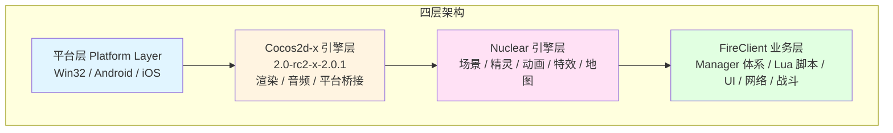
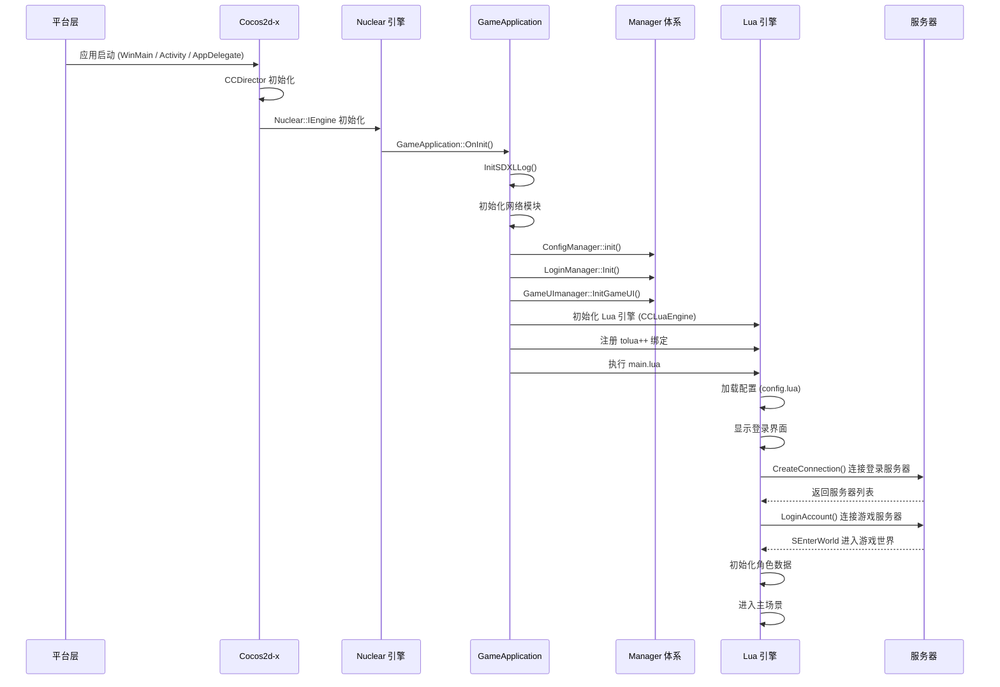
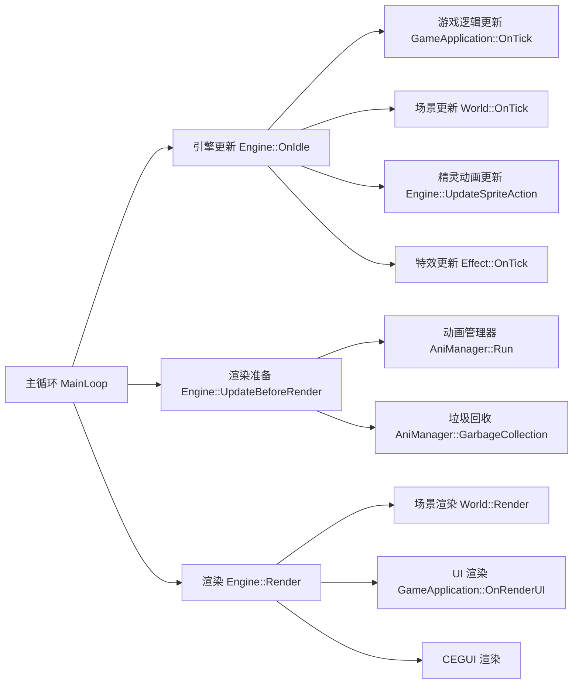
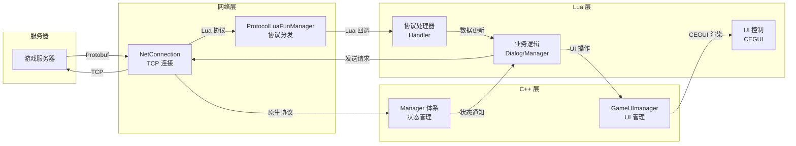

# MT3 游戏客户端技术文档

> **梦幻西游 MG 版本** - 客户端工程完整技术文档
>
> 本文档提供客户端工程的完整架构说明、项目结构、构建指南和开发规范

---

## 文档目录

- [1. 项目概述](#1-项目概述)
- [2. 快速开始](#2-快速开始)
- [3. 技术架构](#3-技术架构)
- [4. 核心特性](#4-核心特性)
- [5. 项目结构](#5-项目结构)
- [6. 支持平台](#6-支持平台)
- [7. 开发指南](#7-开发指南)
- [8. 相关文档](#8-相关文档)

---

## 1. 项目概述

### 1.1 项目简介

MT3（梦幻西游 MG 版本）是一款基于 **Cocos2d-x 2.0-rc2-x-2.0.1** 游戏引擎与 **Nuclear 自研引擎**联合驱动的跨平台 2D MMORPG 客户端，采用 **Lua 5.1 (LuaJIT 2.0.3)** 作为主要业务脚本语言，通过 **tolua++ 1.0.93** 实现 C++/Lua 双向绑定，支持 Windows、Android 和 iOS 多平台发布。

### 1.2 技术栈

| 技术组件 | 版本 | 用途 |
|---------|------|------|
| **Cocos2d-x** | 2.0-rc2-x-2.0.1 | 游戏引擎核心（渲染、音频、平台桥接） |
| **Nuclear** | 自研 | 场景管理、精灵系统、特效系统、动画系统 |
| **LuaJIT** | 2.0.3 | Lua 脚本引擎（兼容 Lua 5.1） |
| **tolua++** | 1.0.93 | C++ 与 Lua 双向绑定工具 |
| **CEGUI** | 0.x | UI 框架（静态链接，启用 CEGUI_STATIC 宏） |
| **CocosDenshion** | 2.0.x | 音频引擎 |
| **FireNet** | 自研 | 网络通信框架（TCP + Protobuf） |

### 1.3 网络协议

- **传输协议**: TCP
- **数据格式**: 自研 Protobuf 二进制协议（通过 rpcgen 生成）
- **加密方式**: ARCFOUR 流加密
- **协议分发**: C++ 层分发原生协议，Lua 层分发 Lua 协议（ProtocolLuaFunManager）

### 1.4 项目规模

```
代码规模（全仓库估算）:
  C++ 代码:       ~66,000 行
  Lua 脚本代码:   ~355,000 行（2,519 个文件）
  Java 代码:      ~1,845,000 行（13,983 个文件）
  工具代码:       ~2,841,000 行（11,327 个文件）

客户端核心代码:
  FireClient C++: ~20,000+ 行（Manager + Framework + Battle + SceneObj + GameUI + GameTable）
  Nuclear 引擎:   ~30,000+ 行
  Lua 业务脚本:   ~300,000+ 行

资源规模:
  纹理图片: ~10,000+ 张
  音效音乐: ~500+ 个
  地图数据: ~200+ 张
  APK 大小: ~396 MB (mt3_locojoy.apk)
```

---

## 2. 快速开始

### 2.1 环境要求

#### Windows 开发环境

```yaml
必需工具:
  - Visual Studio 2013 (PlatformToolset v120)
  - MSBuild 12.0
  - Windows SDK 8.1

可选工具:
  - Python 2.7
  - LuaJIT 2.0
```

#### Android 开发环境

```yaml
必需工具:
  - Android SDK (API Level 19+)
  - Android NDK r10e
  - Apache Ant 1.9+
  - JDK 1.7/1.8

注意:
  - 禁止使用 Gradle 或新版 NDK
  - 固定走 NDK r10e + Ant 构建链路
```

#### iOS 开发环境

```yaml
必需工具:
  - macOS 10.10+
  - Xcode 7.0+
  - iOS SDK 8.0+
```

### 2.2 构建项目

#### Windows 平台

```powershell
# 使用已验证的构建脚本
powershell -ExecutionPolicy Bypass -File ..\tools\scripts\Build-MT3-Exe-Canonical.ps1 -Configuration Release

# 验证构建产物
Get-Item .\resource\bin\Release\MT3.exe | Select-Object FullName, Length, LastWriteTime
```

#### Android 平台

```bash
# 使用已验证的构建脚本
powershell -ExecutionPolicy Bypass -File Build-Android-Locojoy-WithGate.ps1
```

---

## 3. 技术架构

### 3.1 四层架构总览

MT3 客户端采用四层架构设计，自底向上为：



| 层级 | 职责 | 关键组件 |
|-----|------|---------|
| **平台层** | 屏蔽操作系统差异 | Win32 OpenGL 2.0 / Android OpenGL ES / iOS OpenGL ES |
| **Cocos2d-x 层** | 渲染管线、音频、输入、资源加载 | CCDirector / CCSprite / CocosDenshion |
| **Nuclear 层** | 场景管理、精灵系统、特效、动画 | IEngine / IWorld / ISprite / IEffect |
| **FireClient 层** | 游戏业务逻辑、Manager 体系、Lua 脚本 | GameApplication / 各 Manager / LuaEngine |

### 3.2 启动流程



### 3.3 渲染流程



### 3.4 数据流向



---

## 4. 核心特性

| 特性 | 说明 |
|-----|------|
| **多平台** | 一套代码，多平台发布（Windows/Android/iOS） |
| **跨渠道** | 支持多渠道 SDK 集成（Locojoy、易接、百度等） |
| **热更新** | Lua 脚本热更新，无需重新发布 |
| **UI 分离** | CEGUI XML 布局，美术资源与代码解耦 |
| **协议绑定** | tolua++ 自动生成 C++ 与 Lua 绑定 |
| **Manager 体系** | 单例 Manager 管理各子系统，初始化/清理顺序明确 |
| **回合制战斗** | 支持自动战斗、手动操作、战斗回放、观战 |
| **双协议分发** | C++ 原生协议 + Lua 协议双通道分发 |

---

## 5. 项目结构

### 5.1 客户端核心目录结构

```
client/                              # 客户端根目录
├── FireClient/                      # 客户端主项目
│   └── Application/                 # 业务源码核心
│       ├── Amr/                     # AMR 音频编解码
│       ├── Battle/                  # 战斗系统
│       │   ├── BattleManager.h      # 战斗管理器（单例）
│       │   ├── BattleManager_*.cpp  # 战斗管理器分文件实现
│       │   ├── Battler.cpp/h        # 战斗者
│       │   ├── Skill.cpp/h          # 技能系统
│       │   └── SkillBuilder.cpp/h   # 技能构建器
│       ├── Common/                  # 公共定义
│       │   ├── GameCommon.h         # 游戏通用定义（枚举、颜色等）
│       │   ├── BattleCommon.h       # 战斗通用定义
│       │   ├── MessageCommon.h      # 消息通用定义
│       │   └── UICommonHeader.h     # UI 通用头文件
│       ├── Framework/               # 框架核心
│       │   ├── GameApplication.h/cpp # 游戏应用主类
│       │   ├── GameScene.h/cpp      # 游戏场景
│       │   ├── NetConnection.h/cpp  # 网络连接
│       │   ├── LuaFireClient.h/cpp  # Lua 绑定入口
│       │   ├── LuaEngine*.cpp       # Lua 引擎适配
│       │   ├── LuaTickerRegister.*  # Lua 定时器注册
│       │   ├── LuaMessageTask.*     # Lua 消息任务
│       │   ├── 3rdplatform/         # 第三方 SDK 集成
│       │   └── WinWebBrowser/       # Win32 内嵌浏览器
│       ├── GameTable/               # 配置表系统
│       │   ├── TableDataManager.*   # 配置表数据管理器
│       │   ├── TableBase.h          # 配置表基类
│       │   ├── battle/              # 战斗配置表
│       │   ├── buff/                # Buff 配置表
│       │   ├── npc/                 # NPC 配置表
│       │   └── skill/               # 技能配置表
│       ├── GameUI/                  # UI 基础组件
│       │   ├── Dialog.h/cpp         # 对话框基类
│       │   ├── SingletonDialog.h    # 单例对话框
│       │   ├── UISprite.*           # UI 精灵
│       │   ├── UISpineSprite.*      # UI Spine 动画精灵
│       │   └── CEGUIIMEDelegate.*   # 输入法代理
│       ├── Manager/                 # Manager 体系（单例管理器）
│       │   ├── GameStateManager.*   # 游戏状态管理器
│       │   ├── LoginManager.*       # 登录管理器
│       │   ├── GameUIManager.*      # UI 管理器（类名为 GameUImanager）
│       │   ├── BattleReplayManager.*# 战斗回放管理器
│       │   ├── ConfigManager.*      # 配置管理器
│       │   ├── MessageManager.*     # 消息管理器
│       │   ├── SpaceManager.*       # 空间管理器
│       │   ├── VoiceManager.*       # 语音管理器
│       │   ├── EmotionManager.*     # 表情管理器
│       │   ├── IconManager.*        # 图标管理器
│       │   ├── DownloadManager.*    # 下载管理器
│       │   ├── MainRoleDataManager.*# 主角数据管理器
│       │   ├── NewRoleGuideManager.*# 新手引导管理器
│       │   ├── RoleItemManager.*    # 角色物品管理器
│       │   ├── SceneMovieManager.*  # 场景电影管理器
│       │   ├── ArtTextManager.*     # 艺术文本管理器
│       │   ├── TaskOnOffEffectManager.* # 任务特效管理器
│       │   ├── ProtocolLuaFunManager.* # Lua 协议管理器
│       │   └── MusicSoundVolumeMixer.* # 音量混合器
│       ├── ProtoDef/                # 协议定义（生成物）
│       │   ├── fire/pb/             # 业务协议
│       │   └── rpcgen/              # RPC 生成协议
│       └── SceneObj/                # 场景对象
│           ├── SceneObject.h/cpp    # 场景对象基类
│           ├── MainCharacter.*      # 主角
│           ├── Character.*          # 角色
│           ├── Npc.*                 # NPC
│           ├── Pet.*                 # 宠物
│           └── SceneNpc.*           # 场景 NPC
│
├── MT3Win32App/                     # Win32 启动层/壳层
│   ├── mt3.win32.vcxproj            # 主项目文件
│   ├── FireClient.win32.vcxproj     # FireClient 库项目
│   ├── main.cpp                     # 程序入口
│   ├── mt3.cpp/h                    # 游戏主逻辑
│   └── CrashDump.*                  # 崩溃转储
│
├── android/                         # Android 平台项目
│   └── LocojoyProject/              # 主渠道项目
│
├── resource/                        # 游戏核心资源
│   ├── res/                         # 游戏资源
│   │   ├── script/                  # Lua 脚本
│   │   │   ├── main.lua             # 脚本入口
│   │   │   ├── config.lua           # 配置
│   │   │   ├── mainticker.lua       # 主定时器
│   │   │   ├── logic/               # 业务逻辑模块
│   │   │   └── utils/               # 工具模块
│   │   ├── ui/                      # UI 资源
│   │   │   ├── layouts/             # CEGUI 布局文件
│   │   │   ├── imagesets/           # 图片集
│   │   │   └── fonts/               # 字体
│   │   ├── sound/                   # 音效
│   │   ├── map/                     # 地图数据
│   │   ├── model/                   # 模型资源
│   │   └── cfg/                     # 配置文件
│   └── tools/                       # 资源处理工具
│
├── res_android/                     # Android 平台打包资源
├── res_ios/                         # iOS 平台打包资源
├── res_win/                         # Windows 平台打包资源
├── Launcher/                        # Windows 启动器
└── docs/                            # 客户端技术文档
```

### 5.2 关键目录说明

| 目录 | 用途 | 重要性 |
|-----|------|--------|
| `FireClient/Application/` | 客户端主业务源码区 | 核心 |
| `MT3Win32App/` | Win32 壳层与启动入口 | 核心 |
| `resource/res/script/` | Lua 脚本源码（游戏核心逻辑） | 核心 |
| `android/LocojoyProject/` | Android 主渠道项目 | 核心 |
| `resource/res/ui/` | CEGUI UI 资源（布局、图片集、字体） | 重要 |
| `Launcher/` | Windows 启动器（热更新支持） | 重要 |

---

## 6. 支持平台

| 平台 | 状态 | 渲染 API | 项目位置 | 构建工具 |
|-----|------|---------|---------|---------|
| **Windows (Win32)** | 主要平台 | 原生 OpenGL 2.0 | `MT3Win32App/` | VS2013 (v120) |
| **Android** | 主要平台 | OpenGL ES | `android/LocojoyProject/` | NDK r10e + Ant |
| **iOS** | 主要平台 | OpenGL ES | `FireClient/` | Xcode 7+ |
| **WinRT/WP8** | 历史支持 | OpenGL ES + ANGLE | `FireClient/` | VS2012 |

---

## 7. 开发指南

### 7.1 编码规范

#### C++ 编码规范

```cpp
// 类名: PascalCase
class GamePlayer {};

// 方法/变量: camelCase
void updatePosition();
int m_position;

// 常量: 全大写下划线
#define MAX_PLAYERS 100

// 编码: UTF-8 with BOM
// 缩进: 4 空格
// 花括号: 行尾
```

#### Lua 编码规范

```lua
-- 模块定义
local ModuleName = {}

function ModuleName:new()
    local obj = {}
    setmetatable(obj, self)
    self.__index = self
    return obj
end

function ModuleName:method()
    -- 方法实现
end

return ModuleName
```

### 7.2 Manager 体系规范

- 所有 Manager 继承自 `CSingleton<T>` 单例模板
- Manager 不是线程安全的，所有操作必须在主线程执行
- Manager 必须按正确顺序初始化，按相反顺序清理
- 初始化顺序：ConfigManager -> LoginManager -> GameUImanager -> BattleManager -> ...

### 7.3 生成代码边界

以下路径为生成物，修改应回到源定义：

- `client/FireClient/Application/ProtoDef/**` - 协议生成物
- `client/**/tolua++/*.cpp` - tolua++ 绑定生成物

### 7.4 ABI 敏感变更

修改 `.h` 文件若影响 ABI（类布局、虚表、成员偏移、模板实例、内联实现或宏分支），必须执行整链重编：

```
Rebuild FireClient -> Build MT3
```

---

## 8. 相关文档

- [架构设计文档](02-ARCHITECTURE-架构设计.md) - 详细的系统架构设计
- [环境搭建指南](03-SETUP-环境搭建.md) - 开发环境配置步骤
- [核心模块详解](04-MODULES-核心模块详解.md) - 各模块功能说明
- [API 接口文档](05-API-接口文档.md) - 网络协议和 API 说明
- [部署运维手册](06-DEPLOYMENT-部署运维手册.md) - 部署和运维指南

---

## 文档维护信息

| 项目 | 信息 |
|-----|------|
| **项目名称** | MT3 梦幻西游 MG 版本客户端 |
| **引擎版本** | Cocos2d-x 2.0-rc2-x-2.0.1 + Nuclear |
| **脚本语言** | Lua 5.1 (LuaJIT) |
| **支持平台** | Windows, Android, iOS |
| **文档版本** | v2.0 |
| **最后更新** | 2026-04-19 |
| **维护者** | MT3 客户端开发团队 |
