# MT3 游戏客户端架构设计文档

> **架构版本**: v2.0
>
> **最后更新**: 2026-04-26
>
> 本文档详细描述 MT3 客户端的系统架构、设计模式、数据流向和模块交互

---

## 文档目录

- [1. 架构概述](#1-架构概述)
- [2. 四层架构详解](#2-四层架构详解)
- [3. 核心模块架构](#3-核心模块架构)
- [4. 数据流向](#4-数据流向)
- [5. 设计模式](#5-设计模式)
- [6. 内存管理](#6-内存管理)
- [7. 线程模型](#7-线程模型)
- [8. 架构评估与改进建议](#8-架构评估与改进建议)

---

## 1. 架构概述

### 1.1 四层架构总览

MT3 客户端采用自底向上的四层架构设计：

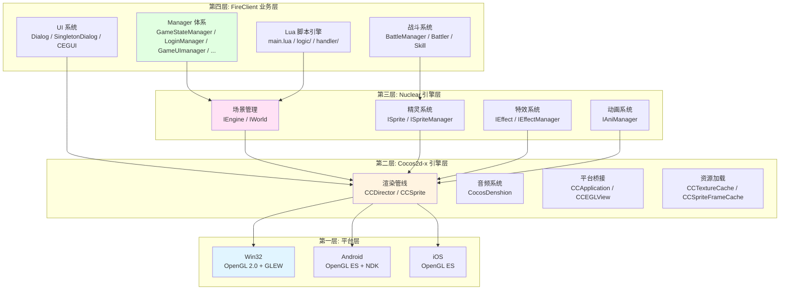

### 1.2 层级职责

| 层级 | 名称 | 职责 | 关键组件 |
|-----|------|------|---------|
| 第一层 | 平台层 | 屏蔽操作系统差异，提供统一图形 API | Win32 OpenGL 2.0 / Android OpenGL ES / iOS OpenGL ES |
| 第二层 | Cocos2d-x 层 | 渲染管线、音频、输入、资源加载 | CCDirector / CCSprite / CocosDenshion / CCTextureCache |
| 第三层 | Nuclear 层 | 场景管理、精灵系统、特效、动画 | IEngine / IWorld / ISprite / IEffect / IAniManager |
| 第四层 | FireClient 层 | 游戏业务逻辑、Manager 体系、Lua 脚本 | GameApplication / 各 Manager / LuaEngine / BattleManager |

### 1.3 跨层调用规则

- **严格自上而下调用**：上层可调用下层接口，下层禁止调用上层接口
- **FireClient 层**可直接调用 Nuclear 层和 Cocos2d-x 层
- **Nuclear 层**只调用 Cocos2d-x 层
- **Cocos2d-x 层**只调用平台层
- **Lua 脚本**通过 tolua++ 绑定调用 C++ 层接口

---

## 2. 四层架构详解

### 2.1 平台层 (Platform Layer)

平台层负责屏蔽不同操作系统的差异，提供统一的图形和输入接口。

| 平台 | 渲染 API | 链接库 | 入口文件 |
|-----|---------|--------|---------|
| Win32 | 原生 OpenGL 2.0 | opengl32.lib + glew32.lib | `MT3Win32App/main.cpp` |
| Android | OpenGL ES | 系统提供 | `android/LocojoyProject/jni/` |
| iOS | OpenGL ES | 系统提供 | `FireClient/AppDelegate.mm` |
| WinRT/WP8 | OpenGL ES + ANGLE | libEGL.lib + libGLESv2.lib | 条件编译分支 |

**平台差异处理**：通过预处理器宏区分平台：

```cpp
#if (CC_TARGET_PLATFORM == CC_PLATFORM_WIN32)
    // Win32 特有代码
#elif (CC_TARGET_PLATFORM == CC_PLATFORM_ANDROID)
    // Android 特有代码
#elif (CC_TARGET_PLATFORM == CC_PLATFORM_IOS)
    // iOS 特有代码
#endif
```

### 2.2 Cocos2d-x 引擎层

基于 Cocos2d-x 2.0-rc2-x-2.0.1，提供游戏开发的基础功能。

| 组件 | 功能 | 关键类 |
|-----|------|--------|
| 渲染管线 | 2D 渲染、场景图遍历 | CCDirector, CCSprite, CCNode |
| 音频系统 | 背景音乐、音效播放 | CocosDenshion::SimpleAudioEngine |
| 平台桥接 | 窗口创建、输入事件 | CCApplication, CCEGLView, CCTouchDispatcher |
| 资源加载 | 纹理缓存、精灵帧缓存 | CCTextureCache, CCSpriteFrameCache |
| 脚本支持 | Lua 引擎集成 | CCLuaEngine, CCScriptSupport |

### 2.3 Nuclear 引擎层

Nuclear 是 MT3 项目的自研引擎层，构建在 Cocos2d-x 之上，提供场景管理、精灵系统、特效和动画等高级功能。

| 模块 | 功能 | 关键接口 |
|-----|------|---------|
| 引擎核心 | 引擎初始化、主循环 | IEngine, IEngineApp |
| 场景管理 | 场景加载、切换、地图渲染 | IWorld, IMap |
| 精灵系统 | 角色精灵、NPC 精灵、特效精灵 | ISprite, ISpriteManager |
| 特效系统 | 战斗特效、环境特效 | IEffect, IEffectManager |
| 动画系统 | 帧动画、骨骼动画管理 | IAniManager |
| 资源管理 | 资源加载、缓存、卸载 | IResourceManager |

**Nuclear 与 Cocos2d-x 的关系**：

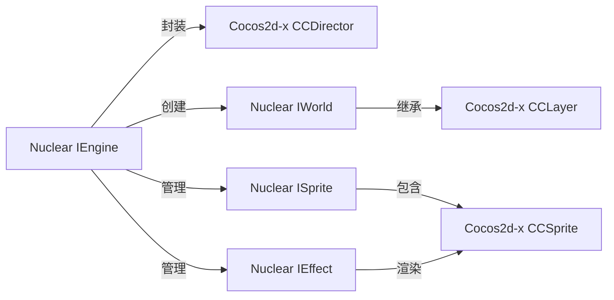

### 2.4 FireClient 业务层

FireClient 是客户端的业务逻辑层，包含 Manager 体系、Lua 脚本引擎、战斗系统、UI 系统等核心业务模块。

#### 目录结构

```
FireClient/Application/
├── Framework/          # 框架核心
│   ├── GameApplication # 游戏应用主类
│   ├── GameScene       # 游戏场景
│   ├── NetConnection   # 网络连接
│   ├── LuaFireClient   # Lua 绑定入口
│   └── Event           # 事件系统
├── Manager/            # Manager 体系
├── Battle/             # 战斗系统
├── GameUI/             # UI 基础组件
├── GameTable/          # 配置表系统
├── SceneObj/           # 场景对象
├── Common/             # 公共定义
└── ProtoDef/           # 协议定义（生成物）
```

---

## 3. 核心模块架构

### 3.1 GameApplication - 游戏应用主类

GameApplication 是客户端的核心控制类，负责初始化所有子系统并管理游戏生命周期。

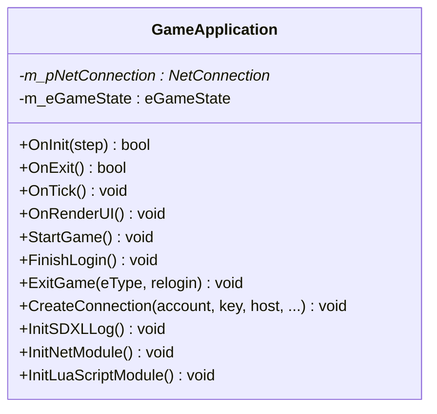

**初始化顺序**：

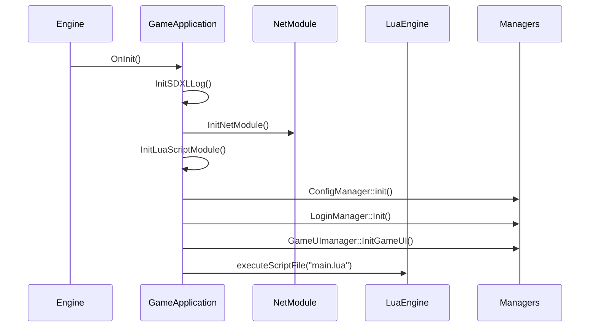

### 3.2 Manager 体系

Manager 体系是 FireClient 层的核心设计，采用单例模式管理各子系统。

```mermaid
graph TB
    GA[GameApplication] --> GSM[GameStateManager<br/>游戏状态]
    GA --> LM[LoginManager<br/>登录流程]
    GA --> GUIM[GameUImanager<br/>UI 管理]
    GA --> BM[BattleManager<br/>战斗系统]
    GA --> CM[ConfigManager<br/>配置管理]
    GA --> MM[MessageManager<br/>消息管理]
    GA --> SPM[SpaceManager<br/>空间管理]
    GA --> VM[VoiceManager<br/>语音管理]
    GA --> EM[EmotionManager<br/>表情管理]
    GA --> IM[IconManager<br/>图标管理]
    GA --> DM[DownloadManager<br/>下载管理]
    GA --> MRDM[MainRoleDataManager<br/>主角数据]
    GA --> NRGM[NewRoleGuideManager<br/>新手引导]
    GA --> RIM[RoleItemManager<br/>角色物品]
    GA --> PLFM[ProtocolLuaFunManager<br/>Lua 协议]
    GA --> MSVM[MusicSoundVolumeMixer<br/>音量混合]

    style GA fill:#ffcccc
    style GSM fill:#e1ffe1
    style LM fill:#e1ffe1
    style GUIM fill:#e1ffe1
    style BM fill:#e1ffe1
```

**Manager 基类**：所有 Manager 继承自 `CSingleton<T>` 单例模板：

```cpp
template<typename T>
class CSingleton {
public:
    static T* GetInstance() {
        static T instance;
        return &instance;
    }
protected:
    CSingleton() {}
    virtual ~CSingleton() {}
private:
    CSingleton(const CSingleton&);
    CSingleton& operator=(const CSingleton&);
};
```

**全局访问函数**：每个 Manager 提供全局快捷访问函数：

```cpp
inline GameStateManager* gGetStateManager() {
    return GameStateManager::GetInstance();
}
inline LoginManager* gGetLoginManager() {
    return LoginManager::GetInstance();
}
```

### 3.3 网络通信模块

#### 网络架构

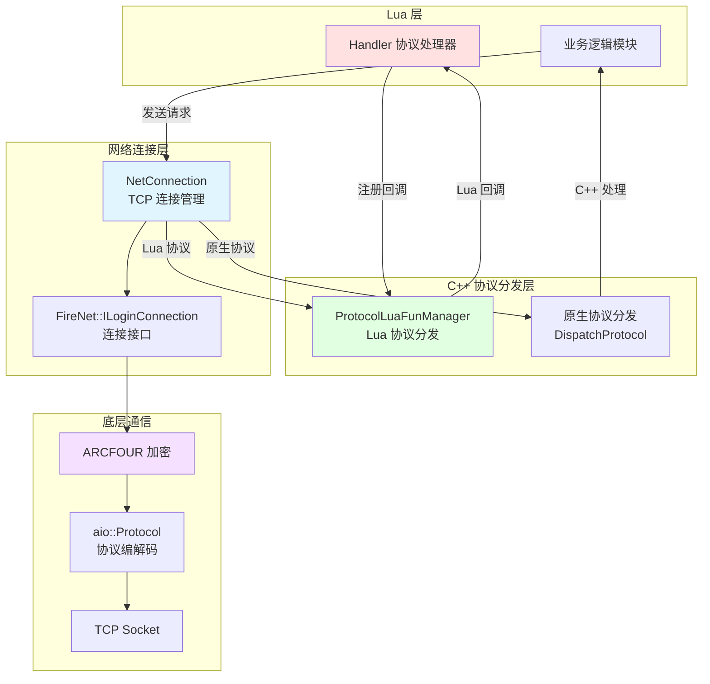

#### 双协议分发机制

NetConnection 实现了双通道协议分发：

1. **原生协议通道**：`DispatchProtocol()` 分发 C++ 原生 Protobuf 协议
2. **Lua 协议通道**：`DispatchLuaProtocol()` 通过 ProtocolLuaFunManager 分发 Lua 协议

```cpp
// NetConnection 协议分发
void NetConnection::DispatchProtocol(aio::Manager* manager,
    FireNet::NetSessionID mSID, aio::Protocol* p) {
    // C++ 原生协议处理
}

void NetConnection::DispatchLuaProtocol(aio::Manager* manager,
    FireNet::NetSessionID mSID, aio::LuaProtocol* p) {
    // Lua 协议通过 ProtocolLuaFunManager 分发
}
```

#### 连接建立流程

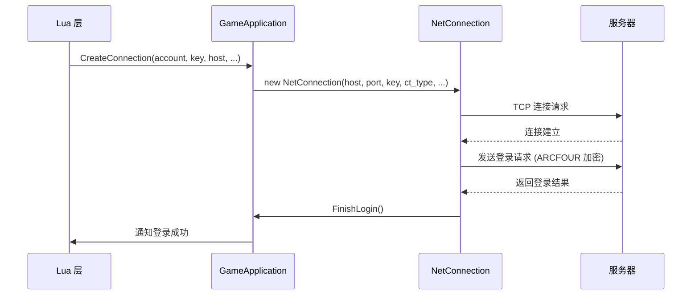

### 3.4 战斗系统

#### 战斗模块架构

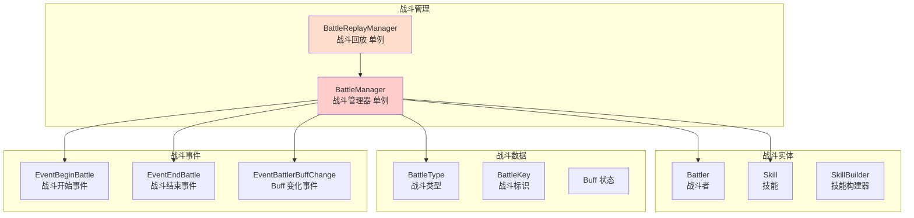

#### 战斗流程

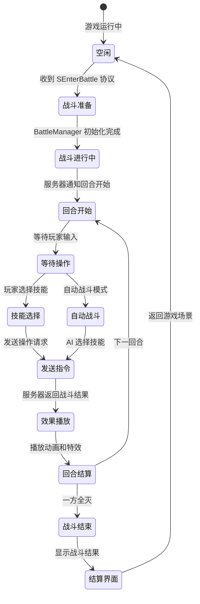

#### 战斗回放

BattleReplayManager 支持战斗回放功能，用于观战和战斗回顾：

- 记录战斗中所有操作指令
- 按时间轴回放战斗过程
- 支持观战模式实时回放

### 3.5 事件系统

FireClient 实现了基于 CBroadcastEvent 和 CEvent 的事件通知系统：

```cpp
// 无参数事件
CBroadcastEvent<NoParam> EventBeginBattle;
CBroadcastEvent<NoParam> EventEndBattle;

// 带参数事件
CEvent<int> EventBattlerBuffChange;

// 订阅事件
EventBeginBattle += [](NoParam) {
    // 处理战斗开始
};

// 触发事件
EventBeginBattle();
EventBattlerBuffChange(battlerId);
```

### 3.6 场景对象系统

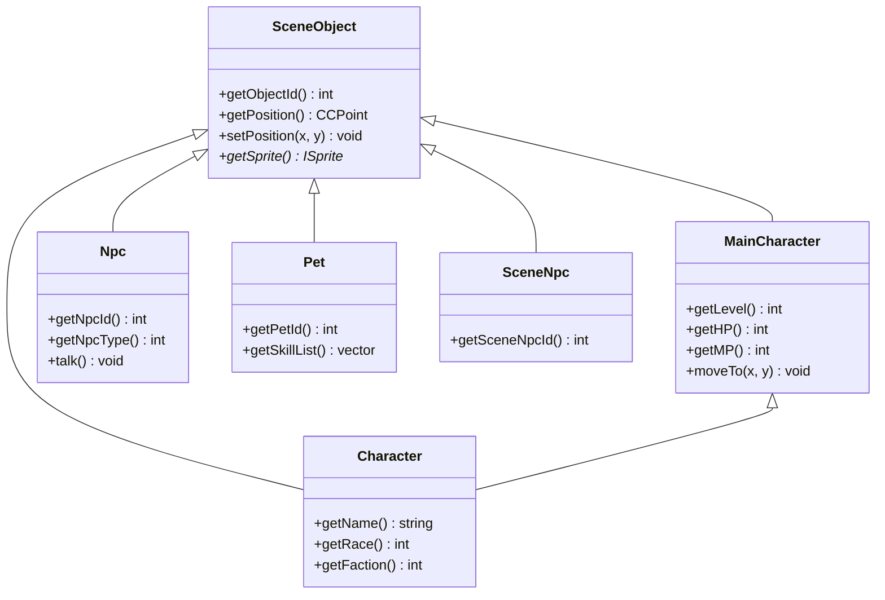

### 3.7 配置表系统

GameTable 模块负责管理所有游戏配置数据：

| 配置表类型 | 目录 | 用途 |
|----------|------|------|
| 战斗配置 | `GameTable/battle/` | 战斗参数、回合配置 |
| Buff 配置 | `GameTable/buff/` | Buff 效果、叠加规则 |
| NPC 配置 | `GameTable/npc/` | NPC 属性、对话 |
| 技能配置 | `GameTable/skill/` | 技能参数、伤害公式 |

TableDataManager 统一管理所有配置表的加载和查询。

### 3.8 Lua 脚本引擎

#### C++/Lua 绑定架构

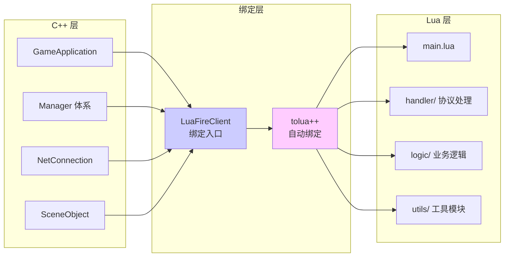

#### Lua 脚本目录结构

```
resource/res/script/
├── main.lua                    # 脚本入口
├── config.lua                  # 全局配置
├── dofile_main.lua             # 模块加载器
├── mainticker.lua              # 主循环 Ticker
├── globalfunctionsforcpp.lua   # C++ 调用 Lua 的全局函数
├── handler/                    # 协议处理器
│   ├── fire_pb.lua             # 业务协议处理
│   ├── fire_pb_battle.lua      # 战斗协议处理
│   └── fire_pb_item.lua        # 道具协议处理
├── logic/                      # 游戏逻辑模块
│   ├── login/                  # 登录模块
│   ├── battle/                 # 战斗模块
│   ├── task/                   # 任务模块
│   ├── item/                   # 道具模块
│   ├── pet/                    # 宠物模块
│   ├── huodong/                # 活动模块
│   ├── rank/                   # 排行榜模块
│   ├── team/                   # 组队模块
│   └── ...                     # 其他业务模块
├── utils/                      # 工具类
└── protodef/                   # 协议定义
```

---

## 4. 数据流向

### 4.1 登录流程数据流

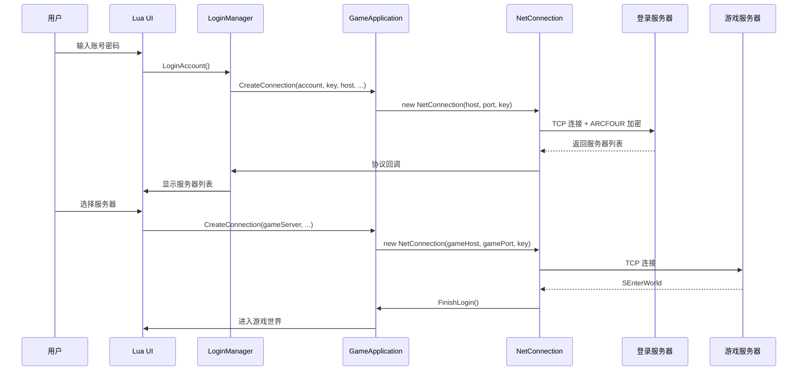

### 4.2 战斗数据流

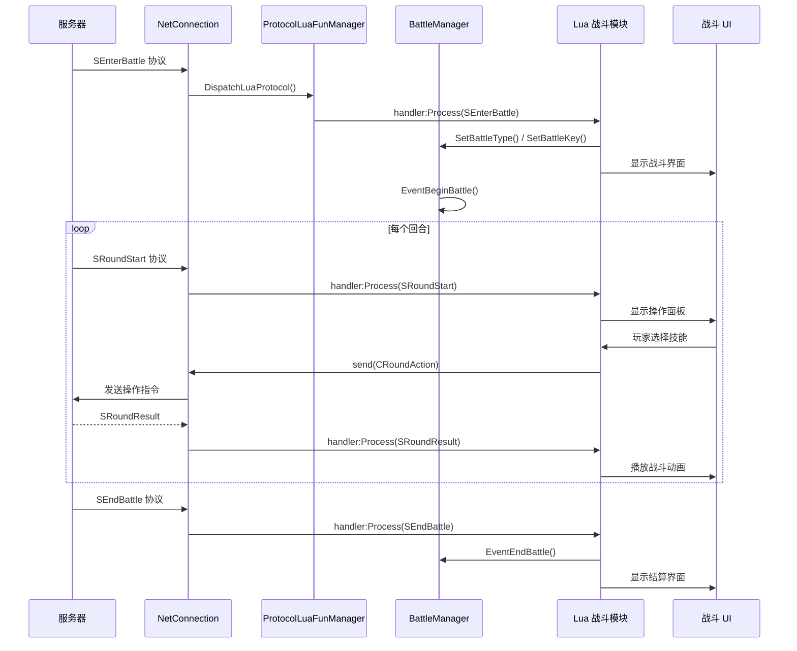

### 4.3 UI 数据流

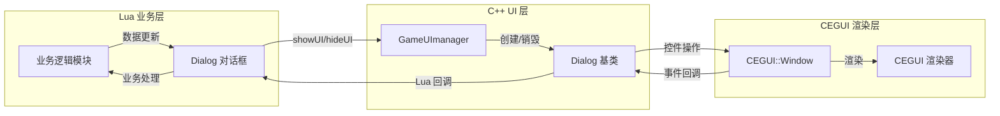

---

## 5. 设计模式

### 5.1 单例模式 (Singleton)

C++ Manager 体系使用 `CSingleton<T>` 模板实现单例：

```cpp
class GameStateManager : public CSingleton<GameStateManager> {
private:
    eGameState m_eGameState;
public:
    GameStateManager();
    ~GameStateManager();
    void setGameState(eGameState state);
    eGameState getGameState();
    bool isGameState(eGameState state);
};

// 全局快捷访问
inline GameStateManager* gGetStateManager() {
    return GameStateManager::GetInstance();
}
```

### 5.2 观察者模式 (Observer)

事件系统使用 `CBroadcastEvent` 和 `CEvent` 实现观察者模式：

```cpp
// 事件声明（在 Manager 类中）
CBroadcastEvent<NoParam> EventBeginBattle;
CBroadcastEvent<NoParam> EventEndBattle;
CEvent<int> EventBattlerBuffChange;

// 事件订阅
battleManager->EventBeginBattle += [](NoParam) {
    // 处理战斗开始
};

// 事件触发
EventBeginBattle();
```

### 5.3 工厂模式 (Factory)

场景对象通过工厂方法创建，由 SpaceManager 统一管理：

```cpp
// 场景对象创建
MainCharacter* mc = new MainCharacter();
Npc* npc = new Npc(npcId);
Pet* pet = new Pet(petId);
```

### 5.4 状态模式 (State)

GameStateManager 使用枚举管理游戏状态：

```cpp
enum eGameState {
    eGameState_Login,
    eGameState_SelectServer,
    eGameState_SelectRole,
    eGameState_Playing,
    eGameState_Battle,
    // ...
};

class GameStateManager : public CSingleton<GameStateManager> {
    void setGameState(eGameState state);
    eGameState getGameState();
    bool isGameState(eGameState state);
};
```

---

## 6. 内存管理

### 6.1 C++ 内存管理

- **Cocos2d-x 对象**：使用引用计数（CCObject::retain/release/autorelease）
- **Nuclear 对象**：通过 IEngine 接口管理生命周期
- **Manager 对象**：单例生命周期，随进程退出释放
- **场景对象**：由 SpaceManager 统一管理创建和销毁

> **`delete this;` 模式说明**：代码中多处使用 `delete this;`（如 `GameUImanager`、`GameScene`、`ArtTextManager`、`TaskOnOffEffectManager` 中的效果回调类）。这是 Nuclear 引擎 IEffectNotify 回调的设计约定：引擎在调用 `OnEnd()` / `OnDelete()` 后立即丢弃指针，对象通过 `delete this;` 自行销毁。**此模式仅在引擎回调上下文中安全，不可在业务代码中模仿使用。**

### 6.2 Lua 内存管理

- LuaJIT 使用自身垃圾回收器管理 Lua 对象
- C++ 对象通过 tolua++ 绑定到 Lua，引用计数由 C++ 侧管理
- tolua++ 绑定对象在 Lua 侧 GC 时自动调用 C++ 侧 release

### 6.3 资源生命周期

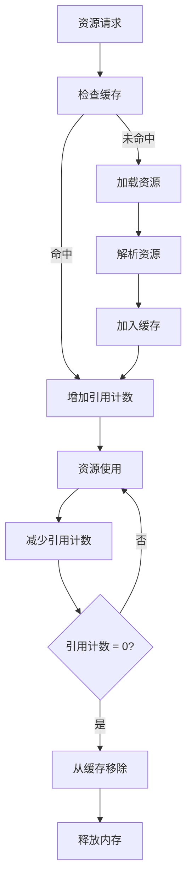

---

## 7. 线程模型

### 7.1 线程架构

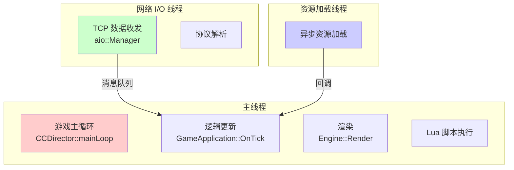

### 7.2 线程安全注意事项

- **Manager 不是线程安全的**：所有 Manager 操作必须在主线程执行
- **网络协议回调**：从网络线程通过消息队列投递到主线程处理
- **Lua 执行**：所有 Lua 代码在主线程执行，无需加锁
- **资源加载**：异步加载完成后通过回调通知主线程

> **已知线程安全隐患**（2026-04 审计）：
>
> - `CSingleton<T>::NewInstance()` 无同步保护，当前所有调用在主线程上，可接受
> - `GameApplication::s_bIsGameInBackground` 由平台回调线程写入，主线程读取，存在数据竞争风险
> - `WavRecorder::s_bRecording` 在 Android JNI 回调线程与主线程之间共享，存在竞争风险

---

## 8. 架构评估与改进建议

### 8.1 架构优势

| 优势 | 说明 |
|-----|------|
| **分层清晰** | 四层架构职责明确，跨层调用规则严格 |
| **Manager 体系** | 单例模式简化了全局状态管理，初始化/清理顺序明确 |
| **Lua 热更新** | 业务逻辑用 Lua 实现，支持热更新无需重新发布 |
| **双协议分发** | C++ 原生协议 + Lua 协议双通道，灵活性高 |
| **事件驱动** | CBroadcastEvent/CEvent 实现松耦合通信 |

### 8.2 可维护性问题

| 问题 | 说明 | 建议 |
|-----|------|------|
| **单例过多** | Manager 全部为单例，隐式依赖关系 | 考虑引入依赖注入或服务定位器模式 |
| **Manager 初始化顺序** | 初始化顺序硬编码，依赖关系不明确 | 建议引入初始化依赖图，自动排序 |
| **BattleManager 文件过大** | 分多个 BattleManager_*.cpp 文件实现 | 考虑按功能域进一步拆分 |
| **Lua 全局变量** | 部分 Lua 模块使用全局变量 | 建议逐步收敛为模块局部变量 |
| **ProtoDef 生成物混入源码** | 协议生成物与手写代码同目录 | 建议将生成物隔离到独立目录 |
| **缓冲区安全** | 历史代码使用 `sprintf`/`strcpy` | 已全部替换为 `snprintf`/`memcpy`（2026-04） |
| **线程安全静态变量** | 部分静态 `bool` 跨线程访问 | 建议逐步改为 `std::atomic<bool>` |

### 8.3 改进优先级

1. **高优先级**：Manager 初始化顺序文档化，防止隐式依赖导致崩溃
2. **中优先级**：Lua 全局变量收敛，减少命名冲突风险
3. **低优先级**：单例模式重构，影响范围大，需谨慎评估

---

## 附录

### A. 关键文件索引

| 功能模块 | 关键文件 |
|---------|---------|
| **游戏启动** | `MT3Win32App/main.cpp`, `FireClient/Application/Framework/GameApplication.cpp` |
| **网络通信** | `FireClient/Application/Framework/NetConnection.cpp` |
| **Lua 绑定** | `FireClient/Application/Framework/LuaFireClient.cpp` |
| **游戏场景** | `FireClient/Application/Framework/GameScene.cpp` |
| **战斗系统** | `FireClient/Application/Battle/BattleManager.h` |
| **UI 管理** | `FireClient/Application/Manager/GameUIManager.cpp`（类名为 `GameUImanager`） |
| **登录流程** | `FireClient/Application/Manager/LoginManager.cpp` |
| **协议分发** | `FireClient/Application/Manager/ProtocolLuaFunManager.cpp` |
| **Lua 入口** | `resource/res/script/main.lua` |
| **事件系统** | `FireClient/Application/Event.h` |

### B. 构建依赖关系

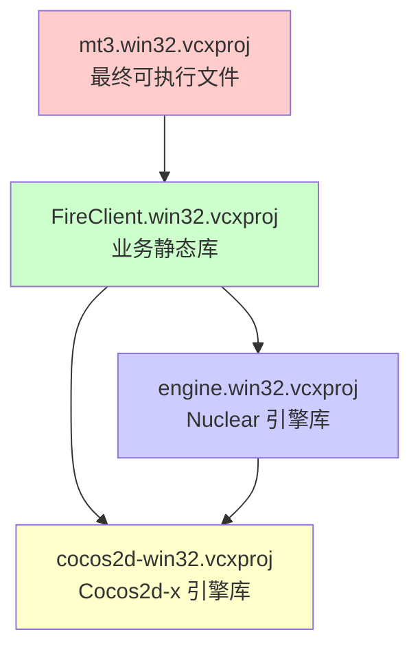

---

**文档结束** | **Document End**
