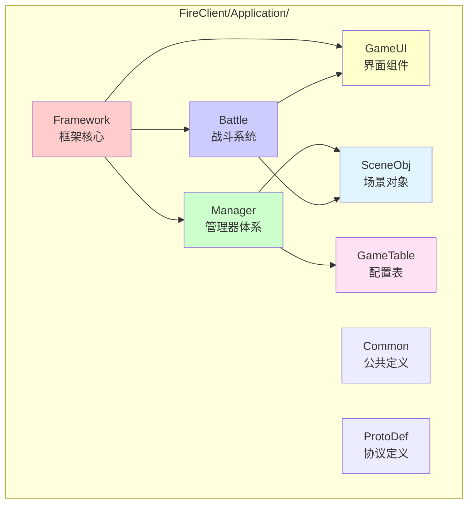
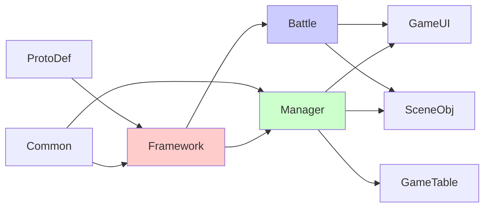
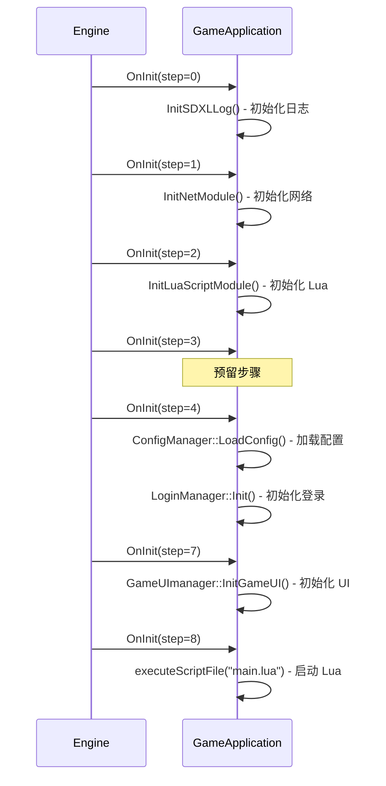
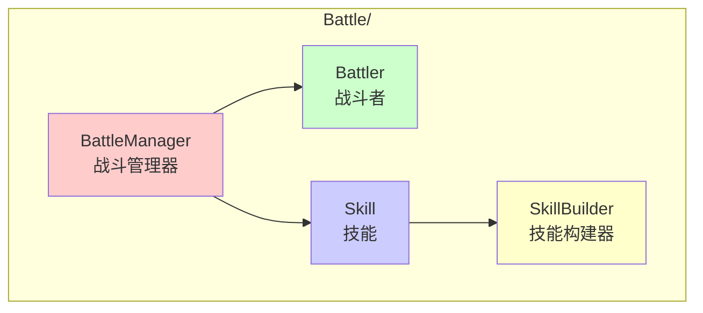
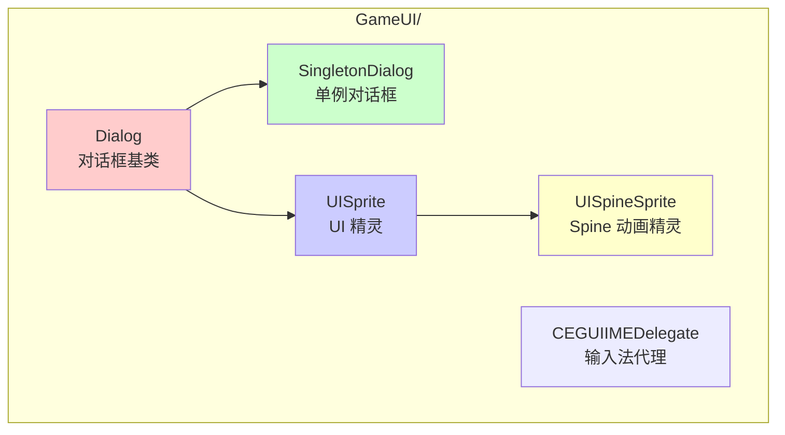
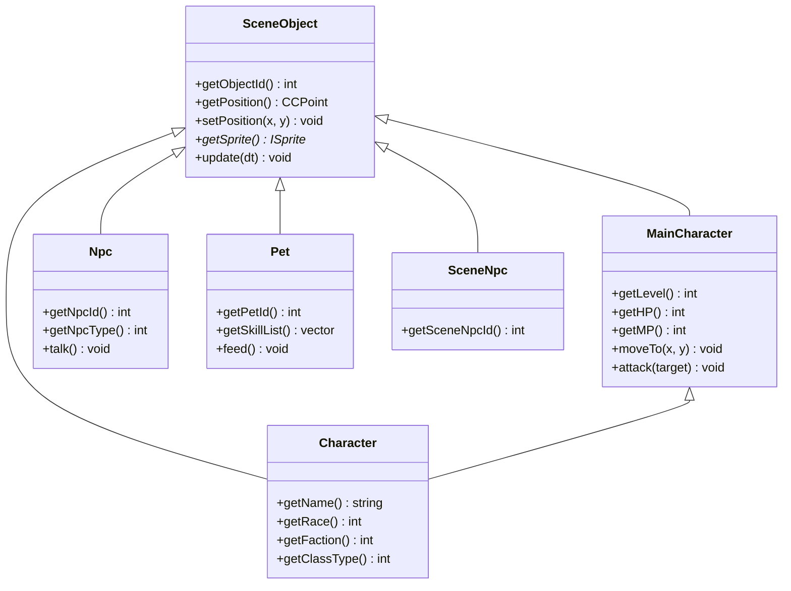
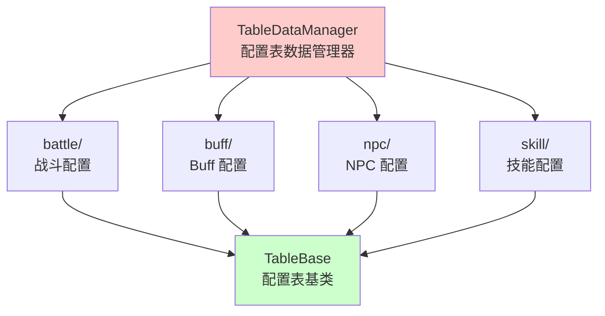

# MT3 游戏客户端核心模块详解

> **版本**: v2.0
>
> **最后更新**: 2026-04-26
>
> 本文档详细描述 MT3 客户端各核心模块的功能、接口和实现细节

---

## 文档目录

- [1. 模块概述](#1-模块概述)
- [2. Framework 框架模块](#2-framework-框架模块)
- [3. Manager 管理器模块](#3-manager-管理器模块)
- [4. Battle 战斗模块](#4-battle-战斗模块)
- [5. GameUI 界面模块](#5-gameui-界面模块)
- [6. SceneObj 场景对象模块](#6-sceneobj-场景对象模块)
- [7. GameTable 配置表模块](#7-gametable-配置表模块)
- [8. Lua 脚本模块](#8-lua-脚本模块)

---

## 1. 模块概述

### 1.1 模块架构图



### 1.2 模块依赖关系



---

## 2. Framework 框架模块

### 2.1 GameApplication - 游戏应用主类

**文件位置**: `FireClient/Application/Framework/GameApplication.h/cpp`

**职责**: 客户端核心控制类，管理游戏生命周期和子系统初始化

**关键接口**:

| 方法 | 说明 |
|-----|------|
| `OnInit(int step)` | 分步初始化游戏子系统 |
| `OnExit()` | 游戏退出清理 |
| `OnTick()` | 每帧逻辑更新 |
| `OnRenderUI()` | UI 渲染回调 |
| `StartGame()` | 开始游戏 |
| `FinishLogin()` | 登录完成通知 |
| `ExitGame(eExitType, int)` | 退出游戏（支持切换账号） |
| `CreateConnection(...)` | 创建服务器连接 |

**初始化流程**:



### 2.2 GameScene - 游戏场景

**文件位置**: `FireClient/Application/Framework/GameScene.h/cpp`

**职责**: 管理 Cocos2d-x 场景和 Nuclear 世界

**关键接口**:

| 方法 | 说明 |
|-----|------|
| `onEnter()` | 场景进入回调 |
| `onExit()` | 场景退出回调 |
| `onTick(float dt)` | 场景逻辑更新 |

### 2.3 NetConnection - 网络连接

**文件位置**: `FireClient/Application/Framework/NetConnection.h/cpp`

**职责**: TCP 连接管理、协议分发、加密通信

**关键接口**:

| 方法 | 说明 |
|-----|------|
| `DispatchProtocol()` | 分发 C++ 原生协议 |
| `DispatchLuaProtocol()` | 分发 Lua 协议 |
| `send(const Protocol&)` | 发送协议 |
| `luasend(const Octets&)` | 发送 Lua 协议 |
| `close()` | 断开连接 |

**继承关系**: `NetConnection : public FireNet::ILoginConnection`

### 2.4 LuaFireClient - Lua 绑定入口

**文件位置**: `FireClient/Application/Framework/LuaFireClient.h/cpp`

**职责**: 注册 C++ 类到 Lua 环境，提供 tolua++ 绑定入口

**绑定内容**:
- GameApplication 方法
- 各 Manager 的访问接口
- NetConnection 网络接口
- SceneObject 场景对象接口
- GameTable 配置表查询接口

### 2.5 Event - 事件系统

**文件位置**: `FireClient/Application/Event.h`

**职责**: 实现观察者模式的事件通知机制

**事件类型**:

| 事件类 | 模板参数 | 用途 |
|--------|---------|------|
| `CBroadcastEvent<NoParam>` | 无参数 | 通知类事件（战斗开始/结束） |
| `CEvent<int>` | int 参数 | 带整型参数的事件（Buff 变化） |

---

## 3. Manager 管理器模块

### 3.1 Manager 体系总览

所有 Manager 继承自 `CSingleton<T>` 单例模板，提供全局访问点。

| Manager | 文件 | 职责 |
|---------|------|------|
| GameStateManager | `Manager/GameStateManager.*` | 游戏状态管理 |
| LoginManager | `Manager/LoginManager.*` | 登录流程管理 |
| GameUImanager | `Manager/GameUIManager.*` | UI 系统管理 |
| BattleManager | `Battle/BattleManager.*` | 战斗系统管理 |
| BattleReplayManager | `Manager/BattleReplayManager.*` | 战斗回放管理 |
| ConfigManager | `Manager/ConfigManager.*` | 配置管理 |
| MessageManager | `Manager/MessageManager.*` | 消息管理 |
| SpaceManager | `Manager/SpaceManager.*` | 空间管理 |
| VoiceManager | `Manager/VoiceManager.*` | 语音管理 |
| EmotionManager | `Manager/EmotionManager.*` | 表情管理 |
| IconManager | `Manager/IconManager.*` | 图标管理 |
| DownloadManager | `Manager/DownloadManager.*` | 下载管理 |
| MainRoleDataManager | `Manager/MainRoleDataManager.*` | 主角数据管理 |
| NewRoleGuideManager | `Manager/NewRoleGuideManager.*` | 新手引导管理 |
| RoleItemManager | `Manager/RoleItemManager.*` | 角色物品管理 |
| SceneMovieManager | `Manager/SceneMovieManager.*` | 场景电影管理 |
| ArtTextManager | `Manager/ArtTextManager.*` | 艺术文本管理 |
| TaskOnOffEffectManager | `Manager/TaskOnOffEffectManager.*` | 任务特效管理 |
| ProtocolLuaFunManager | `Manager/ProtocolLuaFunManager.*` | Lua 协议分发 |
| MusicSoundVolumeMixer | `Manager/MusicSoundVolumeMixer.*` | 音量混合管理 |

### 3.2 GameStateManager - 游戏状态管理器

**职责**: 管理游戏全局状态切换

**状态枚举**:

```cpp
enum eGameState {
    eGameState_Login,        // 登录界面
    eGameState_SelectServer, // 服务器选择
    eGameState_SelectRole,   // 角色选择
    eGameState_Playing,      // 游戏中
    eGameState_Battle,       // 战斗中
    // ...
};
```

**关键接口**:

| 方法 | 说明 |
|-----|------|
| `setGameState(eGameState)` | 设置游戏状态 |
| `getGameState()` | 获取当前状态 |
| `isGameState(eGameState)` | 判断是否处于指定状态 |

**全局访问**: `gGetStateManager()`

### 3.3 LoginManager - 登录管理器

**职责**: 管理登录流程、账号验证、服务器选择

**关键接口**:

| 方法 | 说明 |
|-----|------|
| `Init()` | 初始化登录系统 |
| `LoginAccount(...)` | 登录账号 |
| `SelectServer(...)` | 选择服务器 |
| `EnterWorld()` | 进入游戏世界 |

**全局访问**: `gGetLoginManager()`

### 3.4 GameUImanager - UI 管理器

**类名**: `GameUImanager`（注意：小写 m，继承自 `CSingleton<GameUImanager>`）

**职责**: 管理所有 UI 元素的创建、显示、隐藏和销毁，处理消息提示、CEGUI 布局加载、特效渲染

**关键接口**:

| 方法 | 说明 |
|-----|------|
| `InitGameUI()` | 初始化 UI 系统 |
| `InitGameUIPostInit()` | UI 后初始化 |
| `Draw()` | UI 渲染回调 |
| `Run(int now, int delta)` | UI 帧更新 |
| `HandleEsc()` | 处理返回键 |
| `OnExitGameApp()` | 退出游戏 UI 清理 |
| `OnExitGameToLogin(int relogin)` | 退出到登录界面 |
| `OnExitGameToSelectRole()` | 退出到角色选择 |
| `AddMessageTip(const wstring&)` | 添加消息提示 |
| `AddSystemBoard(const wstring&)` | 添加系统公告 |
| `AddMessageTipById(int id)` | 按 ID 添加消息提示 |
| `QuickCommand(...)` | Lua→C++ 数据交互接口 |
| `QuickCommandToLua(...)` | C++→Lua 数据交互接口 |
| `AddWndToRootWindow(CEGUI::Window*)` | 添加窗口到根节点 |
| `asyncLoadWindowLayout(...)` | 异步加载 UI 布局 |
| `UnInitGameUI()` | 反初始化 UI 系统 |

**全局访问**: `gGetGameUIManager()`

### 3.5 ProtocolLuaFunManager - Lua 协议管理器

**职责**: 管理 Lua 协议的注册和分发

**工作原理**:
1. Lua 层注册协议处理回调
2. NetConnection 收到 Lua 协议后调用 DispatchLuaProtocol
3. ProtocolLuaFunManager 查找注册的回调并执行

### 3.6 ConfigManager - 配置管理器

**职责**: 加载和管理游戏配置

**关键接口**:

| 方法 | 说明 |
|-----|------|
| `LoadConfig()` | 加载配置文件 |
| `LoadDefaultConfig()` | 加载默认配置 |
| `SaveConfig()` | 保存配置到文件 |
| `GetConfigValue(const wstring&)` | 获取配置整数值 |
| `SetConfigValue(wstring&, int)` | 设置配置值 |
| `ApplyConfig()` | 应用当前配置 |

### 3.7 SpaceManager - 空间管理器

**职责**: 管理场景中的空间数据，包括场景对象的位置、碰撞检测等

### 3.8 BattleReplayManager - 战斗回放管理器

**职责**: 管理战斗回放功能

**关键功能**:
- 记录战斗操作指令序列
- 按时间轴回放战斗过程
- 支持观战模式实时回放

---

## 4. Battle 战斗模块

### 4.1 模块架构



### 4.2 BattleManager - 战斗管理器

**文件位置**: `FireClient/Application/Battle/BattleManager.h`

**职责**: 管理战斗生命周期、战斗状态、战斗事件

**关键接口**:

| 方法 | 说明 |
|-----|------|
| `GetBattleType()` | 获取战斗类型 |
| `SetBattleType(int)` | 设置战斗类型 |
| `GetBattleKey()` | 获取战斗标识 |
| `SetBattleKey(int64_t)` | 设置战斗标识 |
| `IsEscapeForbiddenBattle()` | 是否禁止逃跑 |

**战斗事件**:

| 事件 | 类型 | 说明 |
|-----|------|------|
| `EventBeginBattle` | CBroadcastEvent | 战斗开始 |
| `EventEndBattle` | CBroadcastEvent | 战斗结束 |
| `EventBattlerBuffChange` | CEvent<int> | Battler Buff 变化 |

**实现文件拆分**: BattleManager 的实现按功能拆分为多个文件：
- `BattleManager.cpp` - 核心逻辑
- `BattleManager_Battle.cpp` - 战斗流程
- `BattleManager_Skill.cpp` - 技能相关
- `BattleManager_Buff.cpp` - Buff 相关

### 4.3 Battler - 战斗者

**文件位置**: `FireClient/Application/Battle/Battler.h/cpp`

**职责**: 表示战斗中的一个单位（玩家、宠物、NPC、怪物）

**关键属性**:
- 战斗者 ID
- 阵营（己方/敌方）
- 当前 HP/MP
- Buff 列表
- 位置索引

### 4.4 Skill - 技能系统

**文件位置**: `FireClient/Application/Battle/Skill.h/cpp`

**职责**: 管理技能数据和技能释放逻辑

### 4.5 SkillBuilder - 技能构建器

**文件位置**: `FireClient/Application/Battle/SkillBuilder.h/cpp`

**职责**: 根据配置表构建技能实例

---

## 5. GameUI 界面模块

### 5.1 模块架构



### 5.2 Dialog - 对话框基类

**文件位置**: `FireClient/Application/GameUI/Dialog.h/cpp`

**职责**: 所有 UI 对话框的基类，提供显示/隐藏/关闭等基础功能

**关键接口**:

| 方法 | 说明 |
|-----|------|
| `show()` | 显示对话框 |
| `hide()` | 隐藏对话框 |
| `close()` | 关闭并销毁对话框 |
| `isVisible()` | 是否可见 |
| `getRootWindow()` | 获取 CEGUI 根窗口 |

### 5.3 SingletonDialog - 单例对话框

**文件位置**: `FireClient/Application/GameUI/SingletonDialog.h`

**职责**: 保证同一类型的对话框只存在一个实例

### 5.4 UISprite - UI 精灵

**文件位置**: `FireClient/Application/GameUI/UISprite.h/cpp`

**职责**: 在 UI 层显示精灵图像

### 5.5 UISpineSprite - Spine 动画精灵

**文件位置**: `FireClient/Application/GameUI/UISpineSprite.h/cpp`

**职责**: 在 UI 层显示 Spine 骨骼动画

### 5.6 CEGUIIMEDelegate - 输入法代理

**文件位置**: `FireClient/Application/GameUI/CEGUIIMEDelegate.h/cpp`

**职责**: 处理输入法与 CEGUI 文本框的交互

---

## 6. SceneObj 场景对象模块

### 6.1 模块架构



### 6.2 SceneObject - 场景对象基类

**文件位置**: `FireClient/Application/SceneObj/SceneObject.h/cpp`

**职责**: 所有场景对象的基类，管理位置、精灵、更新逻辑

### 6.3 MainCharacter - 主角

**文件位置**: `FireClient/Application/SceneObj/MainCharacter.h/cpp`

**职责**: 玩家控制的主角，包含等级、HP、MP 等核心数据

### 6.4 Character - 角色

**文件位置**: `FireClient/Application/SceneObj/Character.h/cpp`

**职责**: 其他玩家角色

### 6.5 Npc - NPC

**文件位置**: `FireClient/Application/SceneObj/Npc.h/cpp`

**职责**: 游戏中的 NPC

### 6.6 Pet - 宠物

**文件位置**: `FireClient/Application/SceneObj/Pet.h/cpp`

**职责**: 玩家宠物

---

## 7. GameTable 配置表模块

### 7.1 模块架构



### 7.2 TableDataManager - 配置表数据管理器

**文件位置**: `FireClient/Application/GameTable/TableDataManager.h/cpp`

**职责**: 统一管理所有配置表的加载、查询和卸载

### 7.3 TableBase - 配置表基类

**文件位置**: `FireClient/Application/GameTable/TableBase.h`

**职责**: 所有配置表的基类，提供通用的加载和查询接口

### 7.4 配置表分类

| 配置表目录 | 用途 | 加载时机 |
|----------|------|---------|
| `battle/` | 战斗参数、回合配置 | 进入战斗前 |
| `buff/` | Buff 效果、叠加规则 | 游戏初始化 |
| `npc/` | NPC 属性、对话配置 | 游戏初始化 |
| `skill/` | 技能参数、伤害公式 | 游戏初始化 |

---

## 8. Lua 脚本模块

### 8.1 脚本入口

**文件位置**: `resource/res/script/main.lua`

**职责**: Lua 脚本入口，加载所有模块并启动游戏逻辑

### 8.2 协议处理器 (handler/)

**目录位置**: `resource/res/script/handler/`

**职责**: 处理服务器下发的协议消息

| 文件 | 处理的协议 |
|-----|----------|
| `fire_pb.lua` | 通用业务协议 |
| `fire_pb_battle.lua` | 战斗相关协议 |
| `fire_pb_item.lua` | 道具相关协议 |

### 8.3 业务逻辑模块 (logic/)

**目录位置**: `resource/res/script/logic/`

**职责**: 实现各游戏系统的业务逻辑

| 子目录 | 功能 |
|--------|------|
| `login/` | 登录流程 |
| `battle/` | 战斗逻辑 |
| `task/` | 任务系统 |
| `item/` | 道具系统 |
| `pet/` | 宠物系统 |
| `huodong/` | 活动系统 |
| `rank/` | 排行榜 |
| `team/` | 组队系统 |
| `characterinfo/` | 角色信息 |
| `bingfengwangzuo/` | 冰封王座 |
| `shengsizhan/` | 生死战 |
| `qiandaosongli/` | 签到送礼 |
| `workshop/` | 工坊系统 |
| `tips/` | 提示系统 |
| `createroledialog/` | 创建角色 |

### 8.4 工具模块 (utils/)

**目录位置**: `resource/res/script/utils/`

**职责**: 提供通用的工具函数

### 8.5 C++ 调用 Lua 的接口

**文件位置**: `resource/res/script/globalfunctionsforcpp.lua`

**职责**: 定义 C++ 层调用的 Lua 全局函数

### 8.6 主定时器

**文件位置**: `resource/res/script/mainticker.lua`

**职责**: 管理游戏主循环的定时器回调

---

## 附录

### A. 模块文件索引

| 模块 | 目录 | 关键文件数 |
|------|------|-----------|
| Framework | `FireClient/Application/Framework/` | ~20 |
| Manager | `FireClient/Application/Manager/` | ~40 |
| Battle | `FireClient/Application/Battle/` | ~15 |
| GameUI | `FireClient/Application/GameUI/` | ~10 |
| SceneObj | `FireClient/Application/SceneObj/` | ~15 |
| GameTable | `FireClient/Application/GameTable/` | ~20 |
| Common | `FireClient/Application/Common/` | ~5 |
| ProtoDef | `FireClient/Application/ProtoDef/` | 生成物 |
| Lua 脚本 | `resource/res/script/` | ~2,500 |

### B. Manager 初始化顺序

```
1. ConfigManager::LoadConfig()    - 配置管理器最先初始化
2. LoginManager::Init()           - 登录管理器
3. GameUImanager::InitGameUI()    - UI 管理器
4. BattleManager                  - 战斗管理器（延迟初始化）
5. 其他 Manager                   - 按需初始化
```

---

**文档结束** | **Document End**
