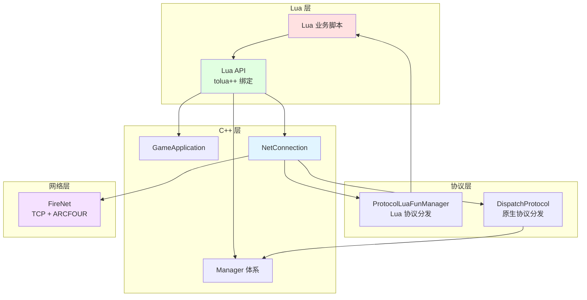

# MT3 游戏客户端 API 接口文档

> **版本**: v2.0
>
> **最后更新**: 2026-04-26
>
> 本文档详细描述 MT3 客户端的网络协议、Lua API 和 C++ API 接口

---

## 文档目录

- [1. API 概述](#1-api-概述)
- [2. 网络协议接口](#2-网络协议接口)
- [3. C++ API](#3-c-api)
- [4. Lua API](#4-lua-api)
- [5. 协议定义](#5-协议定义)

---

## 1. API 概述

### 1.1 API 架构图



### 1.2 双协议分发机制

MT3 客户端采用双协议分发机制：

| 通道 | 入口方法 | 处理方式 | 适用场景 |
|-----|---------|---------|---------|
| 原生协议通道 | `NetConnection::DispatchProtocol()` | C++ 直接处理 | 底层协议、性能敏感协议 |
| Lua 协议通道 | `NetConnection::DispatchLuaProtocol()` | ProtocolLuaFunManager 分发到 Lua | 业务协议、UI 更新协议 |

---

## 2. 网络协议接口

### 2.1 连接管理

#### 创建连接

```cpp
// C++ 接口
void GameApplication::CreateConnection(
    const char* account,           // 账号名
    const char* key,               // 加密密钥
    const std::wstring& host,      // 服务器地址
    const std::wstring& sever,     // 服务器标识
    bool bforcelogin,              // 是否强制登录
    const std::wstring& serverName,// 服务器名称
    const std::wstring& areaName,  // 区服名称
    const int serverid = 0,        // 服务器 ID
    const char* channelId = "",    // 渠道 ID
    int type = AUTH_TYPE_AUANY,    // 认证类型
    const std::string& account_suffix = "", // 账号后缀
    int ct_type = CONNECT_TYPE_NORMAL,      // 连接类型
    const std::string& gip = "",           // 网关 IP
    const std::string& gport = ""          // 网关端口
);
```

#### 发送协议

```cpp
// 发送 C++ 原生协议
void NetConnection::send(const aio::Protocol& protocol);

// 发送 Lua 协议
void NetConnection::luasend(const FireNet::Octets& luaprotocol);
```

#### 断开连接

```cpp
void NetConnection::close();
```

### 2.2 协议分发

#### 原生协议分发

```cpp
// NetConnection 收到原生协议时调用
virtual void NetConnection::DispatchProtocol(
    aio::Manager* manager,         // 异步 IO 管理器
    FireNet::NetSessionID mSID,    // 网络会话 ID
    aio::Protocol* p               // 协议对象
);
```

#### Lua 协议分发

```cpp
// NetConnection 收到 Lua 协议时调用
virtual void NetConnection::DispatchLuaProtocol(
    aio::Manager* manager,         // 异步 IO 管理器
    FireNet::NetSessionID mSID,    // 网络会话 ID
    aio::LuaProtocol* p            // Lua 协议对象
);
```

### 2.3 认证类型

| 认证类型 | 常量 | 说明 |
|---------|------|------|
| AUANY 认证 | `AUTH_TYPE_AUANY` | 默认认证方式 |
| 其他认证 | 按渠道定义 | 第三方 SDK 认证 |

### 2.4 连接类型

| 连接类型 | 常量 | 说明 |
|---------|------|------|
| 普通连接 | `CONNECT_TYPE_NORMAL` | 正常登录 |
| 强制登录 | `CONNECT_TYPE_FORCE` | 踢掉已在线角色 |
| 重连 | `CONNECT_TYPE_RECONNECT` | 断线重连 |

---

## 3. C++ API

### 3.1 GameApplication 接口

| 方法 | 参数 | 返回值 | 说明 |
|-----|------|--------|------|
| `OnInit(int step)` | 初始化步骤 | bool | 分步初始化游戏子系统 |
| `OnExit()` | 无 | bool | 游戏退出清理 |
| `StartGame()` | 无 | void | 开始游戏 |
| `FinishLogin()` | 无 | void | 登录完成通知 |
| `ExitGame(eExitType, int)` | 退出类型、重登标识 | void | 退出游戏 |
| `CreateConnection(...)` | 见 2.1 | void | 创建服务器连接 |

**退出类型枚举**:

| 枚举值 | 说明 |
|--------|------|
| `eExitToLoginType_ChangeLogin` | 切换账号（返回登录界面） |
| `eExitToLoginType_Quit` | 完全退出游戏 |

### 3.2 GameStateManager 接口

| 方法 | 参数 | 返回值 | 说明 |
|-----|------|--------|------|
| `setGameState(eGameState)` | 目标状态 | void | 设置游戏状态 |
| `getGameState()` | 无 | eGameState | 获取当前状态 |
| `isGameState(eGameState)` | 目标状态 | bool | 判断是否处于指定状态 |

**全局访问**: `gGetStateManager()`

### 3.3 LoginManager 接口

| 方法 | 参数 | 返回值 | 说明 |
|-----|------|--------|------|
| `Init()` | 无 | void | 初始化登录系统 |
| `LoginAccount(...)` | 账号信息 | void | 登录账号 |

**全局访问**: `gGetLoginManager()`

### 3.4 GameUImanager 接口

**自动摘要**: 完整 public 方法与 tolua 绑定对照由 `tools/scripts/Export-ClientApiSummary.ps1` 生成，见 [generated/client-api-summary.md](generated/client-api-summary.md)。

| 方法 | 参数 | 返回值 | 说明 |
|-----|------|--------|------|
| `InitGameUI()` | 无 | bool | 初始化 UI 系统 |
| `InitGameUIPostInit()` | 无 | bool | UI 后初始化 |
| `Draw()` | 无 | void | UI 渲染回调 |
| `Run(int, int)` | 当前时间, 帧间隔 | void | UI 帧更新 |
| `HandleEsc()` | 无 | void | 处理返回键 |
| `OnExitGameApp()` | 无 | void | 退出游戏 UI 清理 |
| `OnExitGameToLogin(int)` | 重登录类型 | void | 退出到登录界面 |
| `AddMessageTip(const wstring&)` | 消息文本 | void | 添加消息提示 |
| `AddSystemBoard(const wstring&)` | 公告文本 | void | 添加系统公告 |
| `AddMessageTipById(int)` | 消息 ID | void | 按 ID 添加消息提示 |
| `QuickCommand(wstring, ...)` | 命令+4参数 | int | Lua→C++ 数据交互 |
| `QuickCommandToLua(wstring, ...)` | 命令+4参数 | int | C++→Lua 数据交互 |
| `AddWndToRootWindow(Window*)` | CEGUI 窗口 | void | 添加窗口到根节点 |
| `UnInitGameUI()` | 无 | void | 反初始化 UI |

**全局访问**: `gGetGameUIManager()`

### 3.5 BattleManager 接口

| 方法 | 参数 | 返回值 | 说明 |
|-----|------|--------|------|
| `GetBattleType()` | 无 | int | 获取战斗类型 |
| `SetBattleType(int)` | 战斗类型 | void | 设置战斗类型 |
| `GetBattleKey()` | 无 | int64_t | 获取战斗标识 |
| `SetBattleKey(int64_t)` | 战斗标识 | void | 设置战斗标识 |
| `IsEscapeForbiddenBattle()` | 无 | bool | 是否禁止逃跑 |

**战斗事件**:

| 事件 | 类型 | 说明 |
|-----|------|------|
| `EventBeginBattle` | CBroadcastEvent<NoParam> | 战斗开始 |
| `EventEndBattle` | CBroadcastEvent<NoParam> | 战斗结束 |
| `EventBattlerBuffChange` | CEvent<int> | Battler Buff 变化 |

### 3.6 ConfigManager 接口

| 方法 | 参数 | 返回值 | 说明 |
|-----|------|--------|------|
| `LoadConfig()` | 无 | void | 加载配置文件 |
| `LoadDefaultConfig()` | 无 | void | 加载默认配置 |
| `SaveConfig()` | 无 | void | 保存配置到文件 |
| `GetConfigValue(const wstring&)` | 配置键名 | int | 获取配置整数值 |
| `SetConfigValue(wstring&, int)` | 键名+值 | void | 设置配置值 |
| `SetFromDefaultConfig()` | 无 | void | 应用默认配置 |
| `ApplyConfig()` | 无 | void | 应用当前配置 |
| `isPlayEffect()` | 无 | bool | 是否播放音效 |
| `isPlayBackMusic()` | 无 | bool | 是否播放背景音乐 |

**全局访问**: `gGetGameConfigManager()`

### 3.7 ProtocolLuaFunManager 接口

| 方法 | 参数 | 返回值 | 说明 |
|-----|------|--------|------|
| `registerHandler(...)` | 协议类型、回调 | void | 注册 Lua 协议处理回调 |
| `dispatch(...)` | 协议数据 | void | 分发 Lua 协议到注册的回调 |

---

## 4. Lua API

### 4.1 全局函数

Lua 脚本通过 tolua++ 绑定可以访问以下 C++ 接口：

#### 游戏应用

```lua
-- 获取 GameApplication 实例
local app = GameApplication:GetInstance()

-- 创建连接
app:CreateConnection(account, key, host, server, ...)

-- 退出游戏
app:ExitGame(exitType, relogin)
```

#### 游戏状态

```lua
-- 获取 GameStateManager
local stateMgr = gGetStateManager()

-- 获取当前状态
local state = stateMgr:getGameState()

-- 判断是否在战斗中
if stateMgr:isGameState(eGameState_Battle) then
    -- 战斗中逻辑
end
```

#### UI 管理

```lua
-- 获取 GameUImanager
local uiMgr = gGetGameUIManager()

-- 添加消息提示
uiMgr:AddMessageTip(L"欢迎使用游戏")

-- 添加系统公告
uiMgr:AddSystemBoard(L"服务器维护公告")

-- 通过 Lua 显示/隐藏 UI 窗口（通过 CEGUI 直接操作）
local rootWin = CEGUI.System:getSingleton():getGUISheet()
local battleUI = rootWin:getChild("BattleUI")
battleUI:setVisible(true)
```

#### 战斗系统

```lua
-- 获取 BattleManager
local battleMgr = BattleManager:GetInstance()

-- 获取战斗类型
local battleType = battleMgr:GetBattleType()

-- 订阅战斗事件
battleMgr.EventBeginBattle:AddListener(function()
    -- 战斗开始处理
end)
```

#### 网络通信

```lua
-- 发送 Lua 协议
NetConnection:luasend(protocolData)

-- 注册协议处理器
ProtocolLuaFunManager:registerHandler(protocolType, handler)
```

### 4.2 C++ 调用 Lua 的全局函数

**文件**: `resource/res/script/globalfunctionsforcpp.lua`

C++ 层通过 `CCLuaEngine::executeGlobalFunction()` 调用 Lua 全局函数。

### 4.3 Lua 定时器

**文件**: `resource/res/script/mainticker.lua`

```lua
-- 注册定时器回调
LuaTickerRegister:Register(tickFunction, interval)

-- 取消定时器
LuaTickerRegister:Unregister(tickFunction)
```

---

## 5. 协议定义

### 5.1 协议目录结构

```
FireClient/Application/ProtoDef/
├── fire/pb/          # 业务协议定义
│   ├── battle.proto  # 战斗协议
│   ├── item.proto    # 道具协议
│   ├── role.proto    # 角色协议
│   └── ...
└── rpcgen/           # RPC 生成协议
```

### 5.2 协议命名规范

| 前缀 | 方向 | 说明 |
|-----|------|------|
| `S` | 服务器 -> 客户端 | 服务器推送协议 |
| `C` | 客户端 -> 服务器 | 客户端请求协议 |

**示例**:
- `SEnterBattle` - 服务器推送：进入战斗
- `CRoundAction` - 客户端请求：回合操作
- `SEnterWorld` - 服务器推送：进入世界
- `CLoginAccount` - 客户端请求：登录账号

### 5.3 核心协议列表

#### 登录相关

| 协议名 | 方向 | 说明 |
|--------|------|------|
| `CLoginAccount` | C -> S | 登录请求 |
| `SLoginResult` | S -> C | 登录结果 |
| `SServerList` | S -> C | 服务器列表 |
| `SEnterWorld` | S -> C | 进入世界 |

#### 战斗相关

| 协议名 | 方向 | 说明 |
|--------|------|------|
| `SEnterBattle` | S -> C | 进入战斗 |
| `CRoundAction` | C -> S | 回合操作请求 |
| `SRoundResult` | S -> C | 回合结果 |
| `SEndBattle` | S -> C | 战斗结束 |

#### 角色相关

| 协议名 | 方向 | 说明 |
|--------|------|------|
| `SRoleData` | S -> C | 角色数据 |
| `SRoleUpdate` | S -> C | 角色数据更新 |
| `CBuffChange` | C -> S | Buff 变化通知 |

### 5.4 生成代码边界

以下路径为协议生成物，修改应回到源定义：

- `client/FireClient/Application/ProtoDef/**` - 协议生成物
- `client/**/tolua++/*.cpp` - tolua++ 绑定生成物

**禁止直接修改生成物**，应修改对应的 `.proto` 或 `.pkg` 源文件后重新生成。

---

## 附录

### A. 连接参数说明

| 参数 | 类型 | 说明 |
|-----|------|------|
| `account` | const char* | 玩家账号名 |
| `key` | const char* | ARCFOUR 加密密钥 |
| `host` | wstring | 服务器 IP 地址 |
| `sever` | wstring | 服务器标识 |
| `bforcelogin` | bool | 是否强制登录（踢掉在线角色） |
| `serverName` | wstring | 服务器显示名称 |
| `areaName` | wstring | 区服显示名称 |
| `serverid` | int | 服务器唯一 ID |
| `channelId` | const char* | 渠道标识 |
| `type` | int | 认证类型 |
| `ct_type` | int | 连接类型 |

### B. 事件系统 API

```cpp
// 订阅事件
event += callback;

// 取消订阅
event -= callback;

// 触发事件
event();
event(param);
```

---

**文档结束** | **Document End**
