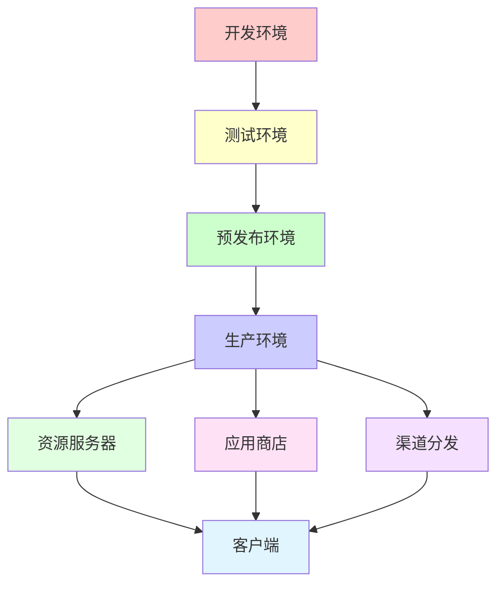
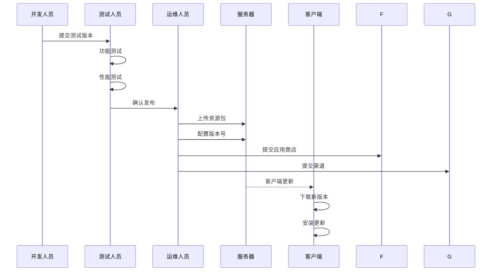
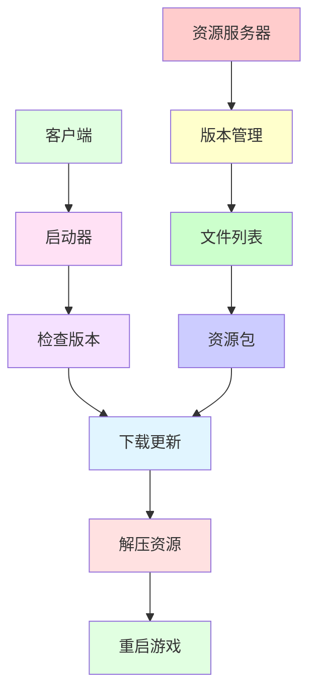
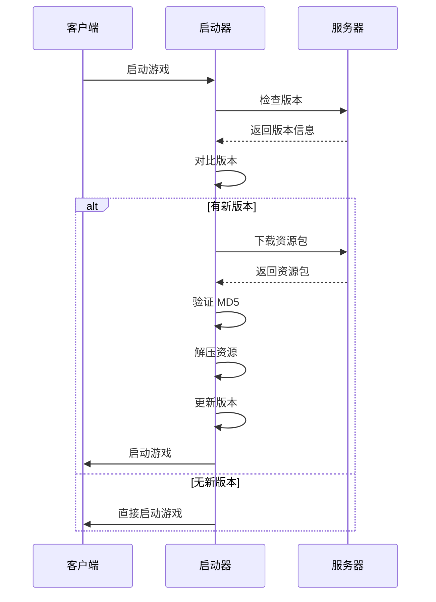

# MT3 游戏客户端部署运维手册

> **版本**: v1.0
>
> **最后更新**: 2026-01-27
>
> 本文档详细说明 MT3 客户端的部署流程、运维监控和故障处理

---

## 📋 文档目录

- [1. 部署概述](#1-部署概述)
- [2. Windows 平台部署](#2-windows-平台部署)
- [3. Android 平台部署](#3-android-平台部署)
- [4. iOS 平台部署](#4-ios-平台部署)
- [5. 热更新部署](#5-热更新部署)
- [6. 运维监控](#6-运维监控)
- [7. 故障处理](#7-故障处理)
- [8. 备份与恢复](#8-备份与恢复)

---

## 1. 部署概述

### 1.1 部署架构



### 1.2 部署流程



---

## 2. Windows 平台部署

### 2.1 构建发布包

#### 2.1.1 构建步骤

```bash
# 1. 打开项目
cd FireClient
start FireClient.sln

# 2. 选择配置
# - 配置管理器 → Release | Win32

# 3. 生成解决方案
# 菜单: 生成 → 生成解决方案

# 4. 检查构建产物
ls Release.win32/
# 输出: MT3.exe, *.dll
```

#### 2.1.2 打包发布包

```bash
# 1. 准备发布目录
mkdir publish_win32
cd publish_win32

# 2. 拷贝构建产物
cp ../FireClient/Release.win32/MT3.exe .
cp ../FireClient/Release.win32/*.dll .

# 3. 拷贝资源
cp -r ../resource/res .

# 4. 拷贝启动器
cp ../Launcher/Release/Launcher.exe .

# 5. 创建版本文件
echo "1.0.0" > version.txt

# 6. 创建压缩包
7z a MT3_Win32_v1.0.zip *
```

### 2.2 部署到服务器

#### 2.2.1 上传资源包

```bash
# 使用 FTP/SFTP 上传资源包到服务器
sftp user@server
put MT3_Win32_v1.0.zip /var/www/mt3/updates/
```

#### 2.2.2 配置版本信息

```bash
# 创建版本文件
cat > /var/www/mt3/updates/version.json <<EOF
{
    "version": "1.0.0",
    "build": "20260127",
    "url": "https://mt3.example.com/updates/MT3_Win32_v1.0.zip",
    "size": 52428800,
    "md5": "d41d8cd98f00b204e9800998ecf8427e",
    "force_update": false,
    "description": "版本更新说明"
}
EOF
```

#### 2.2.3 配置文件列表

```bash
# 创建文件列表
cat > /var/www/mt3/updates/filelist.txt <<EOF
MT3.exe|d41d8cd98f00b204e9800998ecf8427e
Launcher.exe|0cc175b9c0f1b6a831c399e269772661
res/script/main.lua|5d41402abc4b2a76b9719d911017c592
...
EOF
```

### 2.3 启动器配置

#### 2.3.1 配置更新服务器

```ini
# config.ini
[Update]
ServerUrl = https://mt3.example.com/updates/
CheckInterval = 86400

[Game]
ExeName = MT3.exe
Version = 1.0.0
```

---

## 3. Android 平台部署

### 3.1 构建发布包

#### 3.1.1 构建步骤

```bash
# 1. 配置 SDK/NDK 路径
cd android/LocojoyProject
cat > local.properties <<EOF
sdk.dir=/path/to/android-sdk
ndk.dir=/path/to/android-ndk-r10e
EOF

# 2. 构建 JNI 本地代码
cd jni
ndk-build clean
ndk-build -j4

# 3. 拷贝游戏资源到 assets
cd ..
mkdir -p assets
cp -r ../../resource/res assets/

# 4. 构建 Release APK
ant clean
ant release
# 输出: bin/mt3-release-unsigned.apk
```

#### 3.1.2 签名 APK

```bash
# 1. 生成签名密钥（首次）
keytool -genkey -v -keystore mt3-release.keystore \
        -alias mt3 -keyalg RSA -keysize 2048 -validity 10000

# 2. 签名 APK
jarsigner -verbose -keystore mt3-release.keystore \
          bin/mt3-release-unsigned.apk mt3

# 3. 对齐 APK
zipalign -v 4 bin/mt3-release-unsigned.apk bin/mt3-release.apk
```

### 3.2 部署到应用商店

#### 3.2.1 Google Play 发布

```bash
# 1. 登录 Google Play Console
# https://play.google.com/console

# 2. 创建新应用或选择现有应用

# 3. 上传 APK
# 上传 mt3-release.apk

# 4. 填写应用信息
# - 应用名称
# - 应用描述
# - 截图
# - 图标
# - 分类

# 5. 设置价格和分发

# 6. 提交审核
```

#### 3.2.2 国内应用商店发布

| 应用商店 | 发布地址 | 审核时间 |
|---------|---------|---------|
| **腾讯应用宝** | https://myapp.qq.com | 1-3 天 |
| **360 手机助手** | https://dev.360.cn | 1-3 天 |
| **百度手机助手** | https://app.baidu.com | 1-3 天 |
| **小米应用商店** | https://dev.mi.com | 1-3 天 |
| **华为应用市场** | https://developer.huawei.com | 1-3 天 |

### 3.3 多渠道打包

#### 3.3.1 渠道配置

```xml
<!-- AndroidManifest.xml -->
<application
    android:label="@string/app_name"
    android:icon="@drawable/icon"
    android:meta-data
        android:name="CHANNEL_ID"
        android:value="${channel_id}">
</application>
```

#### 3.3.2 渠道打包脚本

```bash
#!/bin/bash

# 渠道列表
channels=("locojoy" "yingyongbao" "360" "baidu" "xiaomi")

# 遍历渠道
for channel in "${channels[@]}"
do
    echo "Building channel: $channel"
    
    # 替换渠道 ID
    sed -i "s/\${channel_id}/$channel/g" AndroidManifest.xml
    
    # 构建 APK
    ant clean
    ant release
    
    # 签名 APK
    jarsigner -keystore mt3-release.keystore \
              bin/mt3-release-unsigned.apk mt3
    zipalign -v 4 bin/mt3-release-unsigned.apk \
              bin/mt3-$channel.apk
    
    # 恢复 AndroidManifest.xml
    git checkout AndroidManifest.xml
done
```

---

## 4. iOS 平台部署

### 4.1 构建发布包

#### 4.1.1 构建步骤

```bash
# 1. 打开项目
cd FireClient
open FireClient.xcodeproj

# 2. 配置签名
# Xcode → Project Settings → Signing & Capabilities
# - Team: 选择开发团队
# - Provisioning Profile: 自动 / 手动选择

# 3. 选择目标设备
# Xcode 工具栏 → Generic iOS Device

# 4. 归档（Archive）
# Product → Archive
# 等待构建完成（5-10 分钟）
```

#### 4.1.2 导出 IPA

```bash
# 1. 打开 Organizer
# Window → Organizer

# 2. 选择归档
# 选择刚创建的归档

# 3. 导出 IPA
# Distribute App → 选择发布方式:
#   - Ad Hoc (内测)
#   - App Store (正式发布)
#   - Enterprise (企业签名)

# 4. 保存 IPA
# 保存到指定目录
```

### 4.2 部署到 App Store

#### 4.2.1 App Store 发布

```bash
# 1. 登录 App Store Connect
# https://appstoreconnect.apple.com

# 2. 创建新应用或选择现有应用

# 3. 上传 IPA
# 使用 Xcode 或 Application Loader 上传

# 4. 填写应用信息
# - 应用名称
# - 应用描述
# - 截图
# - 图标
# - 分类
# - 年龄分级

# 5. 设置价格和分发

# 6. 提交审核
```

#### 4.2.2 TestFlight 内测

```bash
# 1. 登录 App Store Connect

# 2. 创建 TestFlight 测试组

# 3. 上传测试版本

# 4. 添加测试人员
# - 内部测试人员（最多 25 人）
# - 外部测试人员（最多 10,000 人）

# 5. 发送测试邀请
```

### 4.3 企业签名分发

```bash
# 1. 创建企业证书
# 登录 Apple Developer Portal
# Certificates, Identifiers & Profiles → Certificates
# 创建 Distribution Certificate

# 2. 创建 Provisioning Profile
# Identifiers → App IDs → 创建 App ID
# Devices → 添加设备（如需要）
# Profiles → 创建 Provisioning Profile

# 3. 导出 IPA
# 选择 Enterprise 分发方式

# 4. 部署到服务器
# 上传 IPA 到服务器
# 创建下载页面
```

---

## 5. 热更新部署

### 5.1 热更新架构



### 5.2 资源包准备

#### 5.2.1 创建资源包

```bash
# 1. 准备资源目录
mkdir -p update_package
cd update_package

# 2. 拷贝需要更新的资源
cp -r ../resource/res/script .
cp -r ../resource/res/ui .
cp -r ../resource/res/texture .

# 3. 创建资源列表
find . -type f -exec md5sum {} \; > filelist.txt

# 4. 创建版本文件
echo "1.0.1" > version.txt

# 5. 压缩资源包
7z a update_v1.0.1.zip *
```

#### 5.2.2 生成 MD5 校验

```bash
# 生成 MD5 校验文件
md5sum update_v1.0.1.zip > update_v1.0.1.zip.md5
```

### 5.3 部署资源包

#### 5.3.1 上传到服务器

```bash
# 上传资源包
sftp user@server
put update_v1.0.1.zip /var/www/mt3/updates/
put update_v1.0.1.zip.md5 /var/www/mt3/updates/
```

#### 5.3.2 更新版本信息

```bash
# 更新版本文件
cat > /var/www/mt3/updates/hotfix_version.json <<EOF
{
    "version": "1.0.1",
    "build": "20260127",
    "url": "https://mt3.example.com/updates/update_v1.0.1.zip",
    "size": 10485760,
    "md5": "5d41402abc4b2a76b9719d911017c592",
    "files": [
        {
            "path": "script/main.lua",
            "md5": "5d41402abc4b2a76b9719d911017c592"
        },
        {
            "path": "ui/layouts/login/login.layout",
            "md5": "7c4a8d09ca3762af61e59520943dc264"
        }
    ]
}
EOF
```

### 5.4 客户端热更新流程



---

## 6. 运维监控

### 6.1 服务器监控

#### 6.1.1 资源服务器监控

```bash
# 使用 Nginx 日志监控下载量
tail -f /var/log/nginx/access.log | grep "mt3"

# 使用 AWStats 分析访问日志
awstats.pl -config=mt3 -update

# 监控磁盘空间
df -h /var/www/mt3
```

#### 6.1.2 性能监控

```yaml
监控指标:
  - CPU 使用率
  - 内存使用率
  - 磁盘 I/O
  - 网络带宽
  - 请求响应时间

监控工具:
  - Prometheus + Grafana
  - Zabbix
  - Nagios
```

### 6.2 客户端监控

#### 6.2.1 崩溃日志收集

```lua
-- 崩溃日志上报
function ReportCrashLog(crashLog)
    -- 收集设备信息
    local deviceInfo = {
        os = DeviceInfo:sGetOS(),
        device = DeviceInfo:sGetDeviceType(),
        version = Config.VERSION,
        channel = gGetChannelName()
    }
    
    -- 上传崩溃日志
    local url = "https://mt3.example.com/api/crash/report"
    HttpManager:Post(url, {
        device = deviceInfo,
        log = crashLog
    })
end
```

#### 6.2.2 性能数据收集

```lua
-- 性能数据上报
function ReportPerformanceData()
    -- 收集性能数据
    local perfData = {
        fps = Engine:GetFPS(),
        memory = collectgarbage("count"),
        scene = SceneManager:GetCurrentSceneId(),
        timestamp = os.time()
    }
    
    -- 上传性能数据
    local url = "https://mt3.example.com/api/performance/report"
    HttpManager:Post(url, perfData)
end
```

### 6.3 日志分析

#### 6.3.1 崩溃日志分析

```bash
# 使用 Python 脚本分析崩溃日志
python doc/carsh统计工具/android/analyse_android.py

# 输出崩溃统计
# - 崩溃次数
# - 崩溃堆栈
# - 设备分布
# - 版本分布
```

#### 6.3.2 性能日志分析

```bash
# 分析性能日志
awk '/Performance/{print $0}' client.log | \
    awk '{fps[$1]+=$2; count[$1]++} END {for(i in fps) print i, fps[i]/count[i]}'
```

---

## 7. 故障处理

### 7.1 常见故障

#### 7.1.1 客户端无法启动

**现象**: 客户端启动失败

**排查步骤**:

```bash
# 1. 检查日志
tail -f client.log

# 2. 检查依赖库
ldd MT3.exe

# 3. 检查配置文件
cat config.ini

# 4. 检查资源文件
ls -la res/
```

**解决方案**:

```bash
# 1. 安装缺失的依赖库
# 2. 修复配置文件
# 3. 恢复资源文件
# 4. 重新安装客户端
```

#### 7.1.2 网络连接失败

**现象**: 无法连接到服务器

**排查步骤**:

```bash
# 1. 检查网络连接
ping mt3.example.com

# 2. 检查端口开放
telnet mt3.example.com 8080

# 3. 检查防火墙
iptables -L -n

# 4. 检查服务器状态
curl http://mt3.example.com/api/status
```

**解决方案**:

```bash
# 1. 检查网络配置
# 2. 关闭防火墙或添加白名单
# 3. 联系网络管理员
# 4. 检查服务器状态
```

#### 7.1.3 资源下载失败

**现象**: 资源下载失败

**排查步骤**:

```bash
# 1. 检查服务器状态
curl -I https://mt3.example.com/updates/version.json

# 2. 检查磁盘空间
df -h /var/www/mt3

# 3. 检查 Nginx 日志
tail -f /var/log/nginx/error.log

# 4. 检查文件权限
ls -la /var/www/mt3/updates/
```

**解决方案**:

```bash
# 1. 重启 Nginx
systemctl restart nginx

# 2. 清理磁盘空间
# 3. 修复文件权限
chmod 644 /var/www/mt3/updates/*
```

### 7.2 应急处理

#### 7.2.1 回滚版本

```bash
# 1. 停止服务
systemctl stop nginx

# 2. 恢复旧版本
cp /backup/mt3/old_version/* /var/www/mt3/

# 3. 更新版本信息
cp /backup/mt3/old_version/version.json /var/www/mt3/updates/

# 4. 启动服务
systemctl start nginx
```

#### 7.2.2 紧急维护

```bash
# 1. 创建维护页面
cat > /var/www/mt3/maintenance.html <<EOF
<!DOCTYPE html>
<html>
<head>
    <meta charset="UTF-8">
    <title>系统维护中</title>
</head>
<body>
    <h1>系统维护中</h1>
    <p>我们正在进行系统维护，请稍后再试。</p>
</body>
</html>
EOF

# 2. 配置 Nginx 重定向
cat > /etc/nginx/conf.d/mt3_maintenance.conf <<EOF
server {
    listen 80;
    server_name mt3.example.com;
    root /var/www/mt3;
    index maintenance.html;
}
EOF

# 3. 重启 Nginx
systemctl restart nginx
```

---

## 8. 备份与恢复

### 8.1 备份策略

#### 8.1.1 数据备份

```bash
# 1. 创建备份目录
mkdir -p /backup/mt3/$(date +%Y%m%d)

# 2. 备份资源文件
tar -czf /backup/mt3/$(date +%Y%m%d)/resources.tar.gz /var/www/mt3/resources/

# 3. 备份配置文件
tar -czf /backup/mt3/$(date +%Y%m%d)/config.tar.gz /var/www/mt3/config/

# 4. 备份版本文件
cp /var/www/mt3/updates/version.json /backup/mt3/$(date +%Y%m%d)/

# 5. 清理旧备份（保留 30 天）
find /backup/mt3 -type d -mtime +30 -exec rm -rf {} \;
```

#### 8.1.2 数据库备份

```bash
# 1. 备份数据库
mysqldump -u root -p mt3_db > /backup/mt3/$(date +%Y%m%d)/mt3_db.sql

# 2. 压缩备份文件
gzip /backup/mt3/$(date +%Y%m%d)/mt3_db.sql
```

### 8.2 恢复策略

#### 8.2.1 资源恢复

```bash
# 1. 停止服务
systemctl stop nginx

# 2. 解压备份文件
tar -xzf /backup/mt3/20260127/resources.tar.gz -C /var/www/mt3/

# 3. 恢复配置文件
tar -xzf /backup/mt3/20260127/config.tar.gz -C /var/www/mt3/

# 4. 恢复版本文件
cp /backup/mt3/20260127/version.json /var/www/mt3/updates/

# 5. 启动服务
systemctl start nginx
```

#### 8.2.2 数据库恢复

```bash
# 1. 创建数据库
mysql -u root -p -e "CREATE DATABASE mt3_db;"

# 2. 恢复数据库
gunzip < /backup/mt3/20260127/mt3_db.sql.gz | mysql -u root -p mt3_db
```

---

## 附录

### A. 部署检查清单

#### Windows 平台

```yaml
构建前:
  - [ ] 检查代码版本
  - [ ] 更新版本号
  - [ ] 运行单元测试
  - [ ] 运行集成测试

构建后:
  - [ ] 检查构建产物
  - [ ] 运行功能测试
  - [ ] 运行性能测试
  - [ ] 检查依赖库

部署前:
  - [ ] 准备发布包
  - [ ] 生成 MD5 校验
  - [ ] 编写更新说明
  - [ ] 通知相关人员

部署后:
  - [ ] 验证资源上传
  - [ ] 测试下载链接
  - [ ] 监控下载量
  - [ ] 收集用户反馈
```

#### Android 平台

```yaml
构建前:
  - [ ] 检查代码版本
  - [ ] 更新版本号
  - [ ] 运行单元测试
  - [ ] 运行集成测试

构建后:
  - [ ] 检查 APK 大小
  - [ ] 运行功能测试
  - [ ] 运行性能测试
  - [ ] 检查签名

部署前:
  - [ ] 准备发布包
  - [ ] 准备应用截图
  - [ ] 编写应用描述
  - [ ] 准备审核材料

部署后:
  - [ ] 提交应用商店
  - [ ] 监控审核状态
  - [ ] 准备发布通知
  - [ ] 收集用户反馈
```

#### iOS 平台

```yaml
构建前:
  - [ ] 检查代码版本
  - [ ] 更新版本号
  - [ ] 运行单元测试
  - [ ] 运行集成测试

构建后:
  - [ ] 检查 IPA 大小
  - [ ] 运行功能测试
  - [ ] 运行性能测试
  - [ ] 检查签名

部署前:
  - [ ] 准备发布包
  - [ ] 准备应用截图
  - [ ] 编写应用描述
  - [ ] 准备审核材料

部署后:
  - [ ] 提交 App Store
  - [ ] 监控审核状态
  - [ ] 准备发布通知
  - [ ] 收集用户反馈
```

### B. 运维工具

| 工具 | 用途 | 下载地址 |
|-----|------|---------|
| **Nginx** | Web 服务器 | https://nginx.org/ |
| **Prometheus** | 监控系统 | https://prometheus.io/ |
| **Grafana** | 数据可视化 | https://grafana.com/ |
| **Zabbix** | 监控系统 | https://www.zabbix.com/ |
| **AWStats** | 日志分析 | https://www.awstats.org/ |
| **Fail2ban** | 防止暴力破解 | https://www.fail2ban.org/ |

### C. 联系方式

| 角色 | 联系方式 | 备注 |
|-----|---------|------|
| **技术支持** | support@mt3.example.com | 技术问题 |
| **运维团队** | ops@mt3.example.com | 运维问题 |
| **紧急联系** | +86-xxx-xxxx-xxxx | 24 小时 |

---

**文档结束** | **Document End**
