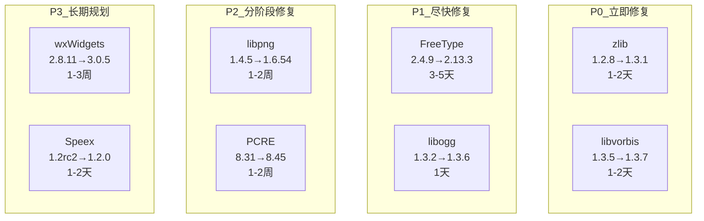
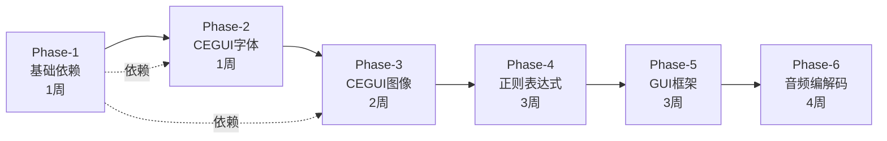
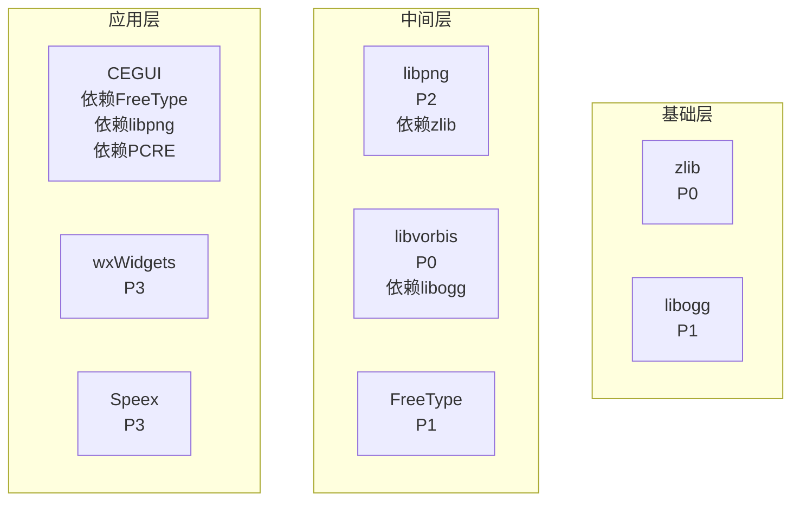
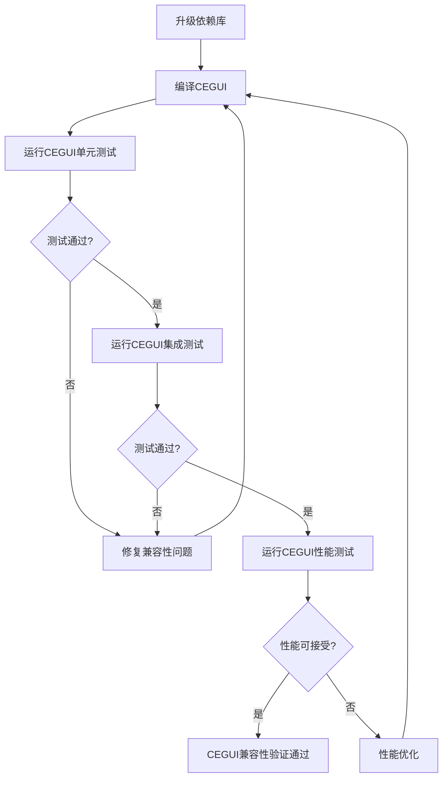

# 依赖升级策略 / Dependency Upgrade Strategy

**文档版本**：v1.1
**创建日期**：2026-01-28
**最后更新**：2026-01-29
**策略制定**：架构团队

**重要更新**：根据VS 2013约束更新升级策略，PCRE升级到8.45（禁用JIT），Speex升级到1.2.0，移除PCRE2和Opus迁移方案

---

## 📋 目录

1. [执行摘要](#1-执行摘要)
2. [升级优先级分级](#2-升级优先级分级)
3. [升级阶段划分](#3-升级阶段划分)
4. [依赖关系处理](#4-依赖关系处理)
5. [风险缓解措施](#5-风险缓解措施)
6. [CEGUI兼容性保障](#6-cegui兼容性保障)
7. [JSON格式策略](#7-json格式策略)

---

## 1. 执行摘要

### 1.1 策略目标

本升级策略旨在系统性地修复MT3项目依赖库中的安全漏洞，同时确保：
- 安全优先：优先修复严重和高危安全漏洞
- 风险可控：高风险升级分阶段进行
- 兼容性保障：确保CEGUI兼容性
- 依赖同步：处理依赖关系，避免版本冲突
- 可回滚：每个阶段都有回滚计划
- **VS 2013约束**：所有升级必须兼容Visual Studio 2013工具集（v120）

### 1.2 关键发现

| 风险等级 | 库数量 | 占比 | 主要风险类型 |
|---------|-------|------|-------------|
| 🔴 严重 | 8 | 23.5% | 严重CVE漏洞、版本严重过时 |
| 🟡 高危 | 2 | 5.9% | 高危CVE漏洞、许可证风险 |
| 🟢 低风险 | 24 | 70.6% | 版本较新、许可证友好 |

### 1.3 升级时间线

```
Phase-1: 基础依赖快速修复阶段     1周   (zlib, libvorbis, libogg)
Phase-2: CEGUI核心依赖升级阶段   1周   (FreeType)
Phase-3: CEGUI图像处理升级阶段   2周   (libpng)
Phase-4: 正则表达式升级阶段      1-2周 (PCRE → 8.45, 禁用JIT)
Phase-5: GUI框架升级阶段         3周   (wxWidgets)
Phase-6: 音频编解码器升级阶段    1-2天 (Speex → 1.2.0)

总计：约9-10周（约2.5个月）
```

---

## 2. 升级优先级分级

### 2.1 P0 - 严重安全漏洞，低升级风险

**描述**：存在严重CVE漏洞，升级风险低，必须立即修复

| 库名称 | 当前版本 | 目标版本 | 原因 | 预估工作量 |
|-------|---------|---------|------|-----------|
| zlib | 1.2.8 | 1.3.1 | 存在严重CVE漏洞（CVE-2022-37434等），升级风险低，API兼容性好，libpng依赖的基础库 | 1-2天 |
| libvorbis | 1.3.5 | 1.3.7 | 存在严重CVE漏洞（CVE-2017-14632等），升级风险低，项目中已存在1.3.7版本 | 1-2天 |

### 2.2 P1 - 严重安全漏洞，中等升级风险

**描述**：存在严重CVE漏洞，升级风险中等，尽快修复

| 库名称 | 当前版本 | 目标版本 | 原因 | 预估工作量 |
|-------|---------|---------|------|-----------|
| FreeType | 2.4.9 | 2.13.3 | 存在严重CVE漏洞（CVE-2025-27363等），升级风险中等，CEGUI核心依赖（字体渲染） | 3-5天 |
| libogg | 1.3.2 | 1.3.6 | 存在高危CVE漏洞（CVE-2018-5146），升级风险低，libvorbis依赖的基础库，项目中已存在1.3.6版本 | 1天 |

### 2.3 P2 - 严重安全漏洞，高升级风险

**描述**：存在严重CVE漏洞，升级风险高，分阶段修复

| 库名称 | 当前版本 | 目标版本 | 原因 | 预估工作量 |
|-------|---------|---------|------|-----------|
| libpng | 1.4.5 | 1.6.54 | 存在严重CVE漏洞（CVE-2011-3026等），升级风险高，API不兼容，CEGUI核心依赖（图像编解码），依赖zlib | 1-2周 |
| PCRE | 8.31 | PCRE 8.45 | 存在严重CVE漏洞（CVE-2016-3191等），升级风险高，需禁用JIT功能（VS 2013不支持），CEGUI可选依赖（正则表达式） | 1-2周 |

### 2.4 P3 - 严重安全漏洞，极高升级风险

**描述**：存在严重CVE漏洞，升级风险极高或需要架构变更，长期规划

| 库名称 | 当前版本 | 目标版本 | 原因 | 预估工作量 |
|-------|---------|---------|------|-----------|
| wxWidgets | 2.8.11 | 3.0.5 | 存在高危CVE漏洞（CVE-2009-2369等），升级风险高，API重大变更，项目中已存在3.0.5版本 | 1-3周 |
| Speex | 1.2rc2 | Speex 1.2.0 | 存在严重CVE漏洞（CVE-2008-1686等），升级风险中等，Opus需要VS 2015+（不可行），升级到1.2.0修复部分漏洞 | 1-2天 |

### 2.5 优先级矩阵



---

## 3. 升级阶段划分

### 3.1 Phase-1: 基础依赖快速修复阶段

**阶段目标**：修复低风险严重安全漏洞，建立升级流程

**包含的库**：zlib, libvorbis, libogg

**预估时间**：1周

**风险等级**：低

**成功标准**：
- zlib升级到1.3.1，所有压缩/解压缩功能正常
- libvorbis统一使用1.3.7版本，移除1.3.5
- libogg统一使用1.3.6版本，移除1.3.2
- 所有音频处理功能正常
- 通过回归测试

**回滚计划**：保留原版本库文件备份，升级失败后恢复原库文件和头文件

### 3.2 Phase-2: CEGUI核心依赖升级阶段

**阶段目标**：升级CEGUI核心依赖（字体渲染），验证CEGUI兼容性

**包含的库**：FreeType

**预估时间**：1周

**风险等级**：中

**成功标准**：
- FreeType升级到2.13.3
- CEGUI字体渲染功能正常
- 各种字体格式（TTF, OTF, WOFF等）渲染正常
- 通过CEGUI集成测试
- 性能无明显下降

**回滚计划**：保留原FreeType 2.4.9库文件备份，升级失败后恢复原库文件

### 3.3 Phase-3: CEGUI图像处理升级阶段

**阶段目标**：升级CEGUI图像编解码依赖，处理API不兼容问题

**包含的库**：libpng

**预估时间**：2周

**风险等级**：高

**成功标准**：
- libpng升级到1.6.54
- CEGUI图像加载功能正常
- 所有PNG图像处理功能正常
- 通过CEGUI集成测试
- API兼容性适配完成
- 性能无明显下降

**回滚计划**：保留原libpng 1.4.5库文件备份，升级失败后恢复原库文件和适配代码

### 3.4 Phase-4: 正则表达式升级阶段

**阶段目标**：升级PCRE到8.45版本，禁用JIT功能（VS 2013不支持）

**包含的库**：PCRE

**预估时间**：1-2周

**风险等级**：高

**成功标准**：
- PCRE升级到8.45
- JIT功能已禁用
- 所有正则表达式功能正常
- CEGUI正则表达式功能正常（如使用）
- 通过回归测试

**回滚计划**：保留原PCRE 8.31库文件备份，升级失败后恢复原库文件和适配代码

### 3.5 Phase-5: GUI框架升级阶段

**阶段目标**：升级wxWidgets到3.x版本，处理API重大变更

**包含的库**：wxWidgets

**预估时间**：3周

**风险等级**：高

**成功标准**：
- wxWidgets统一使用3.0.5或更高版本
- 移除2.8.11版本
- 所有GUI功能正常
- 跨平台兼容性验证（Windows, macOS, Linux）
- 通过GUI回归测试

**回滚计划**：保留原wxWidgets 2.8.11库文件备份，升级失败后恢复原库文件和适配代码

### 3.6 Phase-6: 音频编解码器升级阶段

**阶段目标**：升级Speex到1.2.0版本，修复部分安全漏洞

**包含的库**：Speex

**预估时间**：1-2天

**风险等级**：中

**成功标准**：
- Speex升级到1.2.0
- 所有音频编解码功能正常
- 音质和压缩率符合预期
- 通过音频处理测试

**回滚计划**：保留原Speex 1.2rc2库文件备份，升级失败后恢复原库文件和适配代码

**注意**：Opus 1.5.2需要VS 2015+支持，由于VS 2013约束，无法迁移到Opus

### 3.7 阶段依赖关系图



---

## 4. 依赖关系处理

### 4.1 依赖关系表

| 库名称 | 依赖的库 | 需要同步升级的库 | CEGUI影响 |
|-------|---------|----------------|-----------|
| zlib | - | - | 间接影响 - libpng依赖zlib，zlib升级后libpng可能需要重新编译 |
| libpng | zlib | zlib | 直接影响 - CEGUI核心依赖（图像编解码），API不兼容需要适配 |
| FreeType | - | - | 直接影响 - CEGUI核心依赖（字体渲染），API相对兼容 |
| PCRE | - | - | 间接影响 - CEGUI可选依赖（正则表达式），升级到8.45需禁用JIT（VS 2013不支持） |
| libvorbis | libogg | libogg | 无直接影响 - 音频处理库 |
| libogg | - | libvorbis | 无直接影响 - 音频处理基础库 |
| wxWidgets | - | - | 无直接影响 - 独立的GUI框架 |
| Speex | - | - | 无直接影响 - 音频编解码器，升级到1.2.0修复部分漏洞 |

### 4.2 依赖升级顺序



### 4.3 依赖升级注意事项

1. **zlib升级**：升级zlib后需要重新编译libpng
2. **libogg升级**：先升级libogg，再升级libvorbis
3. **版本统一**：
   - libvorbis统一使用1.3.7版本，移除1.3.5
   - libogg统一使用1.3.6版本，移除1.3.2
   - wxWidgets统一使用3.0.5或更高版本，移除2.8.11
4. **CEGUI依赖**：FreeType和libpng是CEGUI的核心依赖，升级时需要特别关注CEGUI兼容性

---

## 5. 风险缓解措施

### 5.1 Phase-1 风险缓解

**风险列表**：
- zlib升级后libpng可能需要重新编译
- libvorbis和libogg版本统一可能导致编译错误
- 音频处理功能异常

**缓解措施**：
- 升级zlib后重新编译libpng
- 先升级libogg，再升级libvorbis
- 保留原版本库文件备份
- 在测试环境充分验证后再部署到生产环境

**测试策略**：
- 单元测试：压缩/解压缩功能测试
- 单元测试：音频编解码功能测试
- 集成测试：音频处理流程测试
- 回归测试：所有依赖这些库的功能测试

**回滚计划**：保留原版本库文件备份，升级失败后恢复原库文件和头文件

**降级方案**：如果升级失败，可以暂时使用补丁修复已知CVE漏洞

### 5.2 Phase-2 风险缓解

**风险列表**：
- FreeType API变更导致CEGUI字体渲染异常
- 字体格式兼容性问题
- 性能下降

**缓解措施**：
- 在测试环境充分测试各种字体格式
- 进行性能基准测试
- 保留原FreeType库文件备份
- 准备API适配代码

**测试策略**：
- 单元测试：字体加载和渲染测试
- 集成测试：CEGUI字体渲染功能测试
- 兼容性测试：各种字体格式（TTF, OTF, WOFF等）测试
- 性能测试：字体渲染性能基准测试

**回滚计划**：保留原FreeType 2.4.9库文件备份，升级失败后恢复原库文件

**降级方案**：如果升级失败，可以暂时使用补丁修复已知CVE漏洞

### 5.3 Phase-3 风险缓解

**风险列表**：
- libpng 1.6.x与1.4.x API不兼容
- CEGUI图像加载功能异常
- PNG图像处理功能异常
- 性能下降

**缓解措施**：
- 仔细研究API变更文档
- 准备API适配代码
- 在测试环境充分测试
- 保留原libpng库文件备份

**测试策略**：
- 单元测试：PNG图像加载和编解码测试
- 集成测试：CEGUI图像处理功能测试
- 兼容性测试：各种PNG格式测试
- 性能测试：图像处理性能基准测试

**回滚计划**：保留原libpng 1.4.5库文件备份，升级失败后恢复原库文件和适配代码

**降级方案**：如果升级失败，可以暂时使用补丁修复已知CVE漏洞

### 5.4 Phase-4 风险缓解

**风险列表**：
- PCRE 8.45与8.31 API兼容性问题
- JIT功能禁用导致性能下降
- 正则表达式功能异常
- CEGUI正则表达式功能异常（如使用）

**缓解措施**：
- 仔细研究API变更文档
- 准备API适配代码
- 在测试环境充分测试
- 保留原PCRE库文件备份
- 禁用JIT功能（VS 2013不支持）
- 考虑使用其他正则表达式库作为替代

**测试策略**：
- 单元测试：正则表达式匹配测试
- 集成测试：CEGUI正则表达式功能测试（如使用）
- 兼容性测试：各种正则表达式模式测试
- 性能测试：正则表达式性能基准测试（评估JIT禁用的影响）

**回滚计划**：保留原PCRE 8.31库文件备份，升级失败后恢复原库文件和适配代码

**降级方案**：如果升级失败，可以暂时使用补丁修复已知CVE漏洞，或继续使用PCRE 8.31

### 5.5 Phase-5 风险缓解

**风险列表**：
- wxWidgets 3.x与2.8.x API重大变更
- GUI功能异常
- 跨平台兼容性问题
- 性能下降

**缓解措施**：
- 仔细研究API变更文档
- 准备API适配代码
- 在测试环境充分测试
- 保留原wxWidgets库文件备份
- 分阶段迁移GUI代码

**测试策略**：
- 单元测试：GUI组件功能测试
- 集成测试：GUI界面流程测试
- 兼容性测试：跨平台兼容性测试（Windows, macOS, Linux）
- 性能测试：GUI渲染性能基准测试

**回滚计划**：保留原wxWidgets 2.8.11库文件备份，升级失败后恢复原库文件和适配代码

**降级方案**：如果升级失败，可以暂时使用补丁修复已知CVE漏洞，或继续使用wxWidgets 2.8.11

### 5.6 Phase-6 风险缓解

**风险列表**：
- Speex 1.2.0与1.2rc2 API兼容性问题
- 音频编解码功能异常
- 音质和压缩率不符合预期
- 性能下降

**缓解措施**：
- 仔细研究Speex 1.2.0 API文档
- 准备API适配代码
- 在测试环境充分测试
- 保留原Speex库文件备份
- 进行音质和压缩率测试

**测试策略**：
- 单元测试：音频编解码功能测试
- 集成测试：音频处理流程测试
- 兼容性测试：各种音频格式测试
- 性能测试：音频编解码性能基准测试
- 音质测试：音质评估测试

**回滚计划**：保留原Speex 1.2rc2库文件备份，升级失败后恢复原库文件和适配代码

**降级方案**：如果升级失败，可以暂时使用补丁修复已知CVE漏洞，或继续使用Speex 1.2rc2

**注意**：Opus 1.5.2需要VS 2015+支持，由于VS 2013约束，无法迁移到Opus

---

## 6. CEGUI兼容性保障

### 6.1 测试计划

#### CEGUI单元测试
- CEGUI单元测试：字体渲染功能测试
- CEGUI单元测试：图像加载和显示测试
- CEGUI单元测试：正则表达式功能测试（如使用）

#### CEGUI集成测试
- CEGUI集成测试：GUI界面渲染测试
- CEGUI集成测试：用户交互测试

#### CEGUI性能测试
- CEGUI性能测试：渲染性能基准测试
- CEGUI压力测试：长时间运行稳定性测试

### 6.2 API兼容性检查

#### FreeType API兼容性检查
- 字体加载
- 字体渲染
- 字体度量

#### libpng API兼容性检查
- 图像加载
- 图像解码
- 图像信息获取

#### PCRE API兼容性检查
- 正则表达式编译
- 正则表达式匹配
- 正则表达式替换
- JIT功能禁用验证

#### SILLY API兼容性检查
- 图像加载接口兼容性

#### CEGUI内部API兼容性检查
- 与依赖库交互的接口

### 6.3 渲染功能测试

#### 字体渲染测试
- 各种字体格式（TTF, OTF, WOFF等）渲染测试
- 各种字体大小和样式渲染测试
- 多语言文本渲染测试

#### 图像渲染测试
- 各种图像格式（PNG, JPEG等）渲染测试
- 各种图像尺寸和分辨率渲染测试

#### 混合渲染测试
- 文本和图像混合渲染测试
- 动画效果渲染测试

### 6.4 性能基准测试

#### 字体渲染性能基准
- 字体加载时间
- 渲染帧率

#### 图像渲染性能基准
- 图像加载时间
- 渲染帧率

#### 整体GUI渲染性能基准
- 界面加载时间
- 渲染帧率

#### 内存使用基准
- 内存占用
- 内存泄漏检测

#### CPU使用基准
- CPU占用
- CPU峰值

#### 对比测试
- 升级前后性能对比

### 6.5 CEGUI兼容性保障流程



---

## 7. JSON格式策略

以下为JSON格式的升级策略，可用于自动化工具处理：

```json
{
  "upgrade_strategy": {
    "priority_levels": [
      {
        "level": "P0",
        "description": "严重安全漏洞，低升级风险，必须立即修复",
        "libraries": [
          {
            "name": "zlib",
            "current_version": "1.2.8",
            "target_version": "1.3.1",
            "reason": "存在严重CVE漏洞（CVE-2022-37434等），升级风险低，API兼容性好，libpng依赖的基础库",
            "estimated_effort": "1-2天"
          },
          {
            "name": "libvorbis",
            "current_version": "1.3.5",
            "target_version": "1.3.7",
            "reason": "存在严重CVE漏洞（CVE-2017-14632等），升级风险低，项目中已存在1.3.7版本",
            "estimated_effort": "1-2天"
          }
        ]
      },
      {
        "level": "P1",
        "description": "严重安全漏洞，中等升级风险，尽快修复",
        "libraries": [
          {
            "name": "FreeType",
            "current_version": "2.4.9",
            "target_version": "2.13.3",
            "reason": "存在严重CVE漏洞（CVE-2025-27363等），升级风险中等，CEGUI核心依赖（字体渲染）",
            "estimated_effort": "3-5天"
          },
          {
            "name": "libogg",
            "current_version": "1.3.2",
            "target_version": "1.3.6",
            "reason": "存在高危CVE漏洞（CVE-2018-5146），升级风险低，libvorbis依赖的基础库，项目中已存在1.3.6版本",
            "estimated_effort": "1天"
          }
        ]
      },
      {
        "level": "P2",
        "description": "严重安全漏洞，高升级风险，分阶段修复",
        "libraries": [
          {
            "name": "libpng",
            "current_version": "1.4.5",
            "target_version": "1.6.54",
            "reason": "存在严重CVE漏洞（CVE-2011-3026等），升级风险高，API不兼容，CEGUI核心依赖（图像编解码），依赖zlib",
            "estimated_effort": "1-2周"
          },
          {
            "name": "PCRE",
            "current_version": "8.31",
            "target_version": "PCRE 8.45",
            "reason": "存在严重CVE漏洞（CVE-2016-3191等），升级风险高，需禁用JIT功能（VS 2013不支持），CEGUI可选依赖（正则表达式）",
            "estimated_effort": "1-2周"
          }
        ]
      },
      {
        "level": "P3",
        "description": "严重安全漏洞，极高升级风险或需要架构变更，长期规划",
        "libraries": [
          {
            "name": "wxWidgets",
            "current_version": "2.8.11",
            "target_version": "3.0.5",
            "reason": "存在高危CVE漏洞（CVE-2009-2369等），升级风险高，API重大变更，项目中已存在3.0.5版本",
            "estimated_effort": "1-3周"
          },
          {
            "name": "Speex",
            "current_version": "1.2rc2",
            "target_version": "Speex 1.2.0",
            "reason": "存在严重CVE漏洞（CVE-2008-1686等），升级风险中等，Opus需要VS 2015+（不可行），升级到1.2.0修复部分漏洞",
            "estimated_effort": "1-2天"
          }
        ]
      }
    ],
    "phases": [
      {
        "phase": "Phase-1",
        "name": "基础依赖快速修复阶段",
        "goal": "修复低风险严重安全漏洞，建立升级流程",
        "libraries": ["zlib", "libvorbis", "libogg"],
        "estimated_duration": "1周",
        "risk_level": "低",
        "success_criteria": [
          "zlib升级到1.3.1，所有压缩/解压缩功能正常",
          "libvorbis统一使用1.3.7版本，移除1.3.5",
          "libogg统一使用1.3.6版本，移除1.3.2",
          "所有音频处理功能正常",
          "通过回归测试"
        ],
        "rollback_plan": "保留原版本库文件备份，升级失败后恢复原库文件和头文件"
      },
      {
        "phase": "Phase-2",
        "name": "CEGUI核心依赖升级阶段",
        "goal": "升级CEGUI核心依赖（字体渲染），验证CEGUI兼容性",
        "libraries": ["FreeType"],
        "estimated_duration": "1周",
        "risk_level": "中",
        "success_criteria": [
          "FreeType升级到2.13.3",
          "CEGUI字体渲染功能正常",
          "各种字体格式（TTF, OTF, WOFF等）渲染正常",
          "通过CEGUI集成测试",
          "性能无明显下降"
        ],
        "rollback_plan": "保留原FreeType 2.4.9库文件备份，升级失败后恢复原库文件"
      },
      {
        "phase": "Phase-3",
        "name": "CEGUI图像处理升级阶段",
        "goal": "升级CEGUI图像编解码依赖，处理API不兼容问题",
        "libraries": ["libpng"],
        "estimated_duration": "2周",
        "risk_level": "高",
        "success_criteria": [
          "libpng升级到1.6.54",
          "CEGUI图像加载功能正常",
          "所有PNG图像处理功能正常",
          "通过CEGUI集成测试",
          "API兼容性适配完成",
          "性能无明显下降"
        ],
        "rollback_plan": "保留原libpng 1.4.5库文件备份，升级失败后恢复原库文件和适配代码"
      },
      {
        "phase": "Phase-4",
        "name": "正则表达式升级阶段",
        "goal": "升级PCRE到8.45版本，禁用JIT功能（VS 2013不支持）",
        "libraries": ["PCRE"],
        "estimated_duration": "1-2周",
        "risk_level": "高",
        "success_criteria": [
          "PCRE升级到8.45",
          "JIT功能已禁用",
          "所有正则表达式功能正常",
          "CEGUI正则表达式功能正常（如使用）",
          "通过回归测试"
        ],
        "rollback_plan": "保留原PCRE 8.31库文件备份，升级失败后恢复原库文件和适配代码"
      },
      {
        "phase": "Phase-5",
        "name": "GUI框架升级阶段",
        "goal": "升级wxWidgets到3.x版本，处理API重大变更",
        "libraries": ["wxWidgets"],
        "estimated_duration": "3周",
        "risk_level": "高",
        "success_criteria": [
          "wxWidgets统一使用3.0.5或更高版本",
          "移除2.8.11版本",
          "所有GUI功能正常",
          "跨平台兼容性验证（Windows, macOS, Linux）",
          "通过GUI回归测试"
        ],
        "rollback_plan": "保留原wxWidgets 2.8.11库文件备份，升级失败后恢复原库文件和适配代码"
      },
      {
        "phase": "Phase-6",
        "name": "音频编解码器升级阶段",
        "goal": "升级Speex到1.2.0版本，修复部分安全漏洞",
        "libraries": ["Speex"],
        "estimated_duration": "1-2天",
        "risk_level": "中",
        "success_criteria": [
          "Speex升级到1.2.0",
          "所有音频编解码功能正常",
          "音质和压缩率符合预期",
          "通过音频处理测试"
        ],
        "rollback_plan": "保留原Speex 1.2rc2库文件备份，升级失败后恢复原库文件和适配代码",
        "note": "Opus 1.5.2需要VS 2015+支持，由于VS 2013约束，无法迁移到Opus"
      }
    ],
    "dependency_handling": [
      {
        "library": "zlib",
        "depends_on": [],
        "sync_upgrade": [],
        "cegui_impact": "间接影响 - libpng依赖zlib，zlib升级后libpng可能需要重新编译"
      },
      {
        "library": "libpng",
        "depends_on": ["zlib"],
        "sync_upgrade": ["zlib"],
        "cegui_impact": "直接影响 - CEGUI核心依赖（图像编解码），API不兼容需要适配"
      },
      {
        "library": "FreeType",
        "depends_on": [],
        "sync_upgrade": [],
        "cegui_impact": "直接影响 - CEGUI核心依赖（字体渲染），API相对兼容"
      },
      {
        "library": "PCRE",
        "depends_on": [],
        "sync_upgrade": [],
        "cegui_impact": "间接影响 - CEGUI可选依赖（正则表达式），升级到8.45需禁用JIT（VS 2013不支持）"
      },
      {
        "library": "libvorbis",
        "depends_on": ["libogg"],
        "sync_upgrade": ["libogg"],
        "cegui_impact": "无直接影响 - 音频处理库"
      },
      {
        "library": "libogg",
        "depends_on": [],
        "sync_upgrade": ["libvorbis"],
        "cegui_impact": "无直接影响 - 音频处理基础库"
      },
      {
        "library": "wxWidgets",
        "depends_on": [],
        "sync_upgrade": [],
        "cegui_impact": "无直接影响 - 独立的GUI框架"
      },
      {
        "library": "Speex",
        "depends_on": [],
        "sync_upgrade": [],
        "cegui_impact": "无直接影响 - 音频编解码器，升级到1.2.0修复部分漏洞"
      }
    ],
    "risk_mitigation": [
      {
        "phase": "Phase-1",
        "risks": [
          "zlib升级后libpng可能需要重新编译",
          "libvorbis和libogg版本统一可能导致编译错误",
          "音频处理功能异常"
        ],
        "mitigation_measures": [
          "升级zlib后重新编译libpng",
          "先升级libogg，再升级libvorbis",
          "保留原版本库文件备份",
          "在测试环境充分验证后再部署到生产环境"
        ],
        "testing_strategy": [
          "单元测试：压缩/解压缩功能测试",
          "单元测试：音频编解码功能测试",
          "集成测试：音频处理流程测试",
          "回归测试：所有依赖这些库的功能测试"
        ],
        "rollback_plan": "保留原版本库文件备份，升级失败后恢复原库文件和头文件",
        "fallback_plan": "如果升级失败，可以暂时使用补丁修复已知CVE漏洞"
      },
      {
        "phase": "Phase-2",
        "risks": [
          "FreeType API变更导致CEGUI字体渲染异常",
          "字体格式兼容性问题",
          "性能下降"
        ],
        "mitigation_measures": [
          "在测试环境充分测试各种字体格式",
          "进行性能基准测试",
          "保留原FreeType库文件备份",
          "准备API适配代码"
        ],
        "testing_strategy": [
          "单元测试：字体加载和渲染测试",
          "集成测试：CEGUI字体渲染功能测试",
          "兼容性测试：各种字体格式（TTF, OTF, WOFF等）测试",
          "性能测试：字体渲染性能基准测试"
        ],
        "rollback_plan": "保留原FreeType 2.4.9库文件备份，升级失败后恢复原库文件",
        "fallback_plan": "如果升级失败，可以暂时使用补丁修复已知CVE漏洞"
      },
      {
        "phase": "Phase-3",
        "risks": [
          "libpng 1.6.x与1.4.x API不兼容",
          "CEGUI图像加载功能异常",
          "PNG图像处理功能异常",
          "性能下降"
        ],
        "mitigation_measures": [
          "仔细研究API变更文档",
          "准备API适配代码",
          "在测试环境充分测试",
          "保留原libpng库文件备份"
        ],
        "testing_strategy": [
          "单元测试：PNG图像加载和编解码测试",
          "集成测试：CEGUI图像处理功能测试",
          "兼容性测试：各种PNG格式测试",
          "性能测试：图像处理性能基准测试"
        ],
        "rollback_plan": "保留原libpng 1.4.5库文件备份，升级失败后恢复原库文件和适配代码",
        "fallback_plan": "如果升级失败，可以暂时使用补丁修复已知CVE漏洞"
      },
      {
        "phase": "Phase-4",
        "risks": [
          "PCRE 8.45与8.31 API兼容性问题",
          "JIT功能禁用导致性能下降",
          "正则表达式功能异常",
          "CEGUI正则表达式功能异常（如使用）"
        ],
        "mitigation_measures": [
          "仔细研究API变更文档",
          "准备API适配代码",
          "在测试环境充分测试",
          "保留原PCRE库文件备份",
          "禁用JIT功能（VS 2013不支持）",
          "考虑使用其他正则表达式库作为替代"
        ],
        "testing_strategy": [
          "单元测试：正则表达式匹配测试",
          "集成测试：CEGUI正则表达式功能测试（如使用）",
          "兼容性测试：各种正则表达式模式测试",
          "性能测试：正则表达式性能基准测试（评估JIT禁用的影响）"
        ],
        "rollback_plan": "保留原PCRE 8.31库文件备份，升级失败后恢复原库文件和适配代码",
        "fallback_plan": "如果升级失败，可以暂时使用补丁修复已知CVE漏洞，或继续使用PCRE 8.31"
      },
      {
        "phase": "Phase-5",
        "risks": [
          "wxWidgets 3.x与2.8.x API重大变更",
          "GUI功能异常",
          "跨平台兼容性问题",
          "性能下降"
        ],
        "mitigation_measures": [
          "仔细研究API变更文档",
          "准备API适配代码",
          "在测试环境充分测试",
          "保留原wxWidgets库文件备份",
          "分阶段迁移GUI代码"
        ],
        "testing_strategy": [
          "单元测试：GUI组件功能测试",
          "集成测试：GUI界面流程测试",
          "兼容性测试：跨平台兼容性测试（Windows, macOS, Linux）",
          "性能测试：GUI渲染性能基准测试"
        ],
        "rollback_plan": "保留原wxWidgets 2.8.11库文件备份，升级失败后恢复原库文件和适配代码",
        "fallback_plan": "如果升级失败，可以暂时使用补丁修复已知CVE漏洞，或继续使用wxWidgets 2.8.11"
      },
      {
        "phase": "Phase-6",
        "risks": [
          "Speex 1.2.0与1.2rc2 API兼容性问题",
          "音频编解码功能异常",
          "音质和压缩率不符合预期",
          "性能下降"
        ],
        "mitigation_measures": [
          "仔细研究Speex 1.2.0 API文档",
          "准备API适配代码",
          "在测试环境充分测试",
          "保留原Speex库文件备份",
          "进行音质和压缩率测试"
        ],
        "testing_strategy": [
          "单元测试：音频编解码功能测试",
          "集成测试：音频处理流程测试",
          "兼容性测试：各种音频格式测试",
          "性能测试：音频编解码性能基准测试",
          "音质测试：音质评估测试"
        ],
        "rollback_plan": "保留原Speex 1.2rc2库文件备份，升级失败后恢复原库文件和适配代码",
        "fallback_plan": "如果升级失败，可以暂时使用补丁修复已知CVE漏洞，或继续使用Speex 1.2rc2",
        "note": "Opus 1.5.2需要VS 2015+支持，由于VS 2013约束，无法迁移到Opus"
      }
    ],
    "cegui_compatibility": {
      "testing_plan": [
        "CEGUI单元测试：字体渲染功能测试",
        "CEGUI单元测试：图像加载和显示测试",
        "CEGUI单元测试：正则表达式功能测试（如使用）",
        "CEGUI集成测试：GUI界面渲染测试",
        "CEGUI集成测试：用户交互测试",
        "CEGUI性能测试：渲染性能基准测试",
        "CEGUI压力测试：长时间运行稳定性测试"
      ],
      "api_compatibility_check": [
        "FreeType API兼容性检查：字体加载、字体渲染、字体度量等",
        "libpng API兼容性检查：图像加载、图像解码、图像信息获取等",
        "PCRE API兼容性检查：正则表达式编译、匹配、替换等",
        "SILLY API兼容性检查：图像加载接口兼容性",
        "CEGUI内部API兼容性检查：与依赖库交互的接口"
      ],
      "rendering_tests": [
        "字体渲染测试：各种字体格式（TTF, OTF, WOFF等）渲染测试",
        "字体渲染测试：各种字体大小和样式渲染测试",
        "字体渲染测试：多语言文本渲染测试",
        "图像渲染测试：各种图像格式（PNG, JPEG等）渲染测试",
        "图像渲染测试：各种图像尺寸和分辨率渲染测试",
        "混合渲染测试：文本和图像混合渲染测试",
        "动画渲染测试：动画效果渲染测试"
      ],
      "performance_benchmarks": [
        "字体渲染性能基准：字体加载时间、渲染帧率等",
        "图像渲染性能基准：图像加载时间、渲染帧率等",
        "整体GUI渲染性能基准：界面加载时间、渲染帧率等",
        "内存使用基准：内存占用、内存泄漏检测等",
        "CPU使用基准：CPU占用、CPU峰值等",
        "对比测试：升级前后性能对比"
      ]
    }
  }
}
```

---

## 8. 策略实施建议

### 8.1 实施前准备

1. **建立测试环境**
   - 搭建独立的测试环境
   - 准备自动化测试脚本
   - 建立性能基准测试

2. **备份策略**
   - 备份所有原版本库文件
   - 备份所有头文件
   - 备份相关源代码

3. **团队准备**
   - 培训团队成员了解API变更
   - 分配升级任务责任人
   - 建立升级进度跟踪机制

### 8.2 实施过程

1. **严格按照阶段顺序执行**
   - 完成一个阶段后再进行下一个阶段
   - 每个阶段完成后进行全面测试
   - 确认成功后再进行下一阶段

2. **持续监控**
   - 监控升级过程中的问题
   - 及时记录问题和解决方案
   - 定期汇报升级进度

3. **风险控制**
   - 每个阶段都有回滚计划
   - 发现问题及时回滚
   - 避免影响生产环境

### 8.3 实施后验证

1. **全面测试**
   - 运行所有单元测试
   - 运行所有集成测试
   - 进行性能基准测试

2. **文档更新**
   - 更新依赖库版本信息
   - 更新API文档
   - 更新升级指南

3. **持续监控**
   - 监控生产环境运行情况
   - 收集用户反馈
   - 及时处理问题

---

## 9. 附录

### 9.1 术语表

| 术语 | 说明 |
|------|------|
| CVE | Common Vulnerabilities and Exposures，通用漏洞披露 |
| CEGUI | Crazy Eddie's GUI System，一个跨平台的GUI框架 |
| PCRE | Perl Compatible Regular Expressions，Perl兼容正则表达式 |
| Opus | 一种现代的音频编解码器 |
| VS2013 | Visual Studio 2013 |

### 9.2 参考文档

- [依赖安全审计报告](./06_依赖安全审计报告_Dependency_Security_Audit_Report.md)
- [项目架构总览](./01_项目架构总览_Project_Architecture_Overview.md)
- [环境配置文档](./03_环境配置文档_Environment_Configuration.md)

---

## 📝 文档修订历史

| 版本 | 日期 | 修订内容 | 修订人 |
|-----|------|---------|-------|
| v1.0 | 2026-01-28 | 初始版本创建 | 架构团队 |

---

**文档结束**
