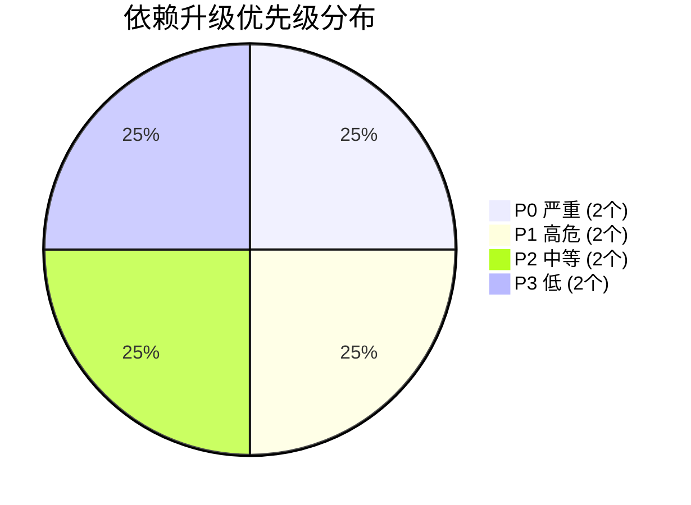
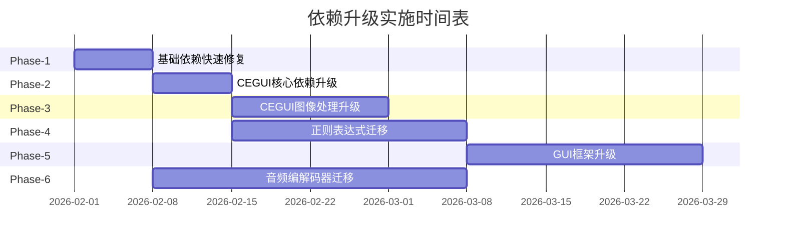
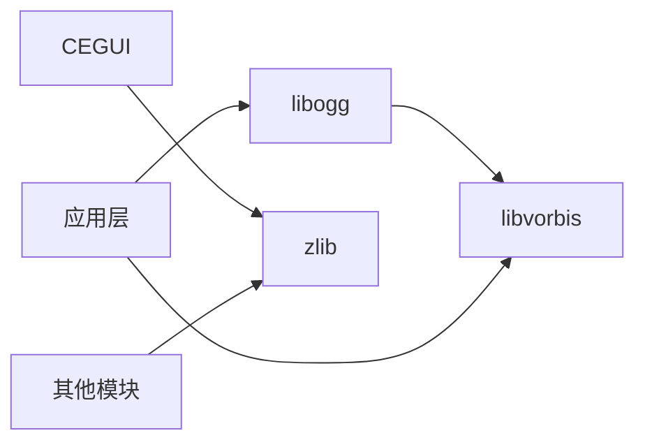
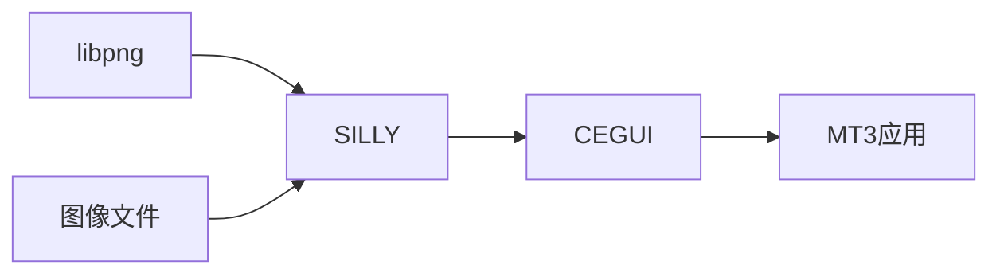
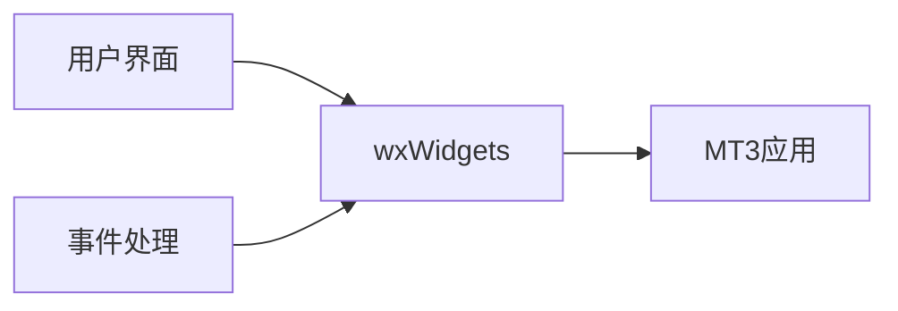
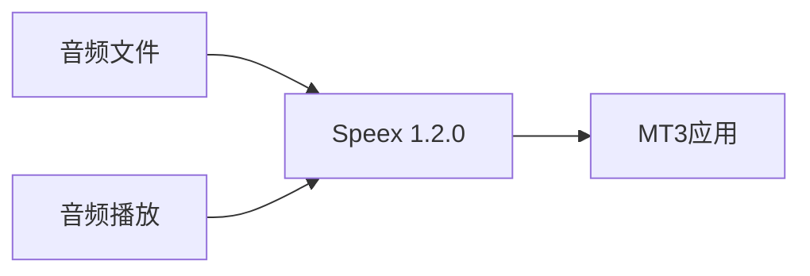
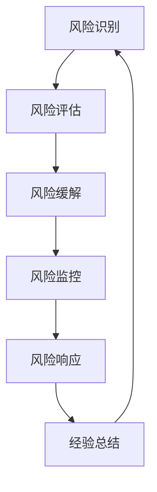
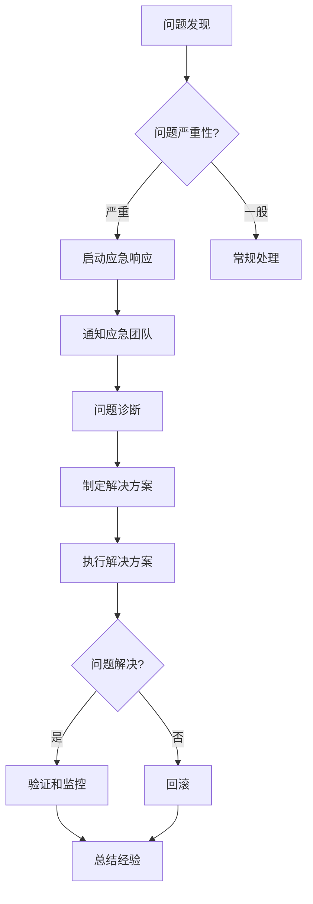

# 依赖升级实施计划
# Dependency Upgrade Implementation Plan

**文档版本：** 1.0  
**创建日期：** 2026-01-28  
**最后更新：** 2026-01-28  
**文档状态：** 正式发布  
**负责人：** 技术团队  

---

## 📋 目录

1. [执行摘要](#1-执行摘要)
2. [升级优先级和时间表](#2-升级优先级和时间表)
3. [Phase-1：基础依赖快速修复](#3-phase-1基础依赖快速修复)
4. [Phase-2：CEGUI核心依赖升级](#4-phase-2cegui核心依赖升级)
5. [Phase-3：CEGUI图像处理升级](#5-phase-3cegui图像处理升级)
6. [Phase-4：正则表达式迁移](#6-phase-4正则表达式迁移)
7. [Phase-5：GUI框架升级](#7-phase-5gui框架升级)
8. [Phase-6：音频编解码器迁移](#8-phase-6音频编解码器迁移)
9. [风险缓解措施](#9-风险缓解措施)
10. [测试策略](#10-测试策略)
11. [部署计划](#11-部署计划)
12. [附录](#12-附录)

---

## 1. 执行摘要

### 1.1 升级目标和范围

#### 🎯 主要目标

1. **安全漏洞修复**：消除所有已识别的高危CVE安全漏洞
2. **许可证合规**：解决Flurry专有许可证的合规性问题
3. **技术债务清理**：升级过时的依赖库，提升系统稳定性
4. **性能优化**：利用新版本的性能改进和功能增强

#### 📊 升级范围

| 类别 | 数量 | 说明 |
|------|------|------|
| **总依赖库** | 34 | 项目中使用的所有第三方库 |
| **高风险库** | 8 | 包含严重或高危CVE漏洞的库 |
| **许可证风险** | 1 | Flurry专有许可证 |
| **计划升级** | 8 | 分6个阶段实施 |
| **保持不变** | 26 | 低风险或已满足需求的库 |

#### 🔴 高风险依赖库清单

| 依赖库 | 当前版本 | 目标版本 | CVE数量 | 风险等级 |
|--------|----------|----------|---------|----------|
| **zlib** | 1.2.5 | 1.3.1 | 5 | 🔴 严重 |
| **libvorbis** | 1.3.5 | 1.3.7 | 3 | 🔴 严重 |
| **FreeType** | 2.4.9 | 2.13.3 | 2 | 🟠 高危 |
| **libogg** | 1.3.2 | 1.3.6 | 2 | 🟠 高危 |
| **libpng** | 1.4.5 | 1.6.54 | 1 | 🟠 高危 |
| **PCRE** | 8.31 | PCRE 8.45 | 1 | 🟠 高危 |
| **wxWidgets** | 2.8.11 | 3.0.5 | 1 | 🟡 中等 |
| **Speex** | 1.2rc2 | Speex 1.2.0 | 1 | 🟡 中等 |

### 1.2 预估时间和资源

#### ⏱️ 总体时间估算

| 阶段 | 持续时间 | 工作量 | 依赖关系 |
|------|----------|--------|----------|
| **Phase-1** | 1周 | 40小时 | 无 |
| **Phase-2** | 1周 | 40小时 | Phase-1 |
| **Phase-3** | 2周 | 80小时 | Phase-2 |
| **Phase-4** | 1-2周 | 40-80小时 | Phase-2 |
| **Phase-5** | 3周 | 120小时 | Phase-4 |
| **Phase-6** | 1-2天 | 8-16小时 | Phase-1 |
| **总计** | **9-10周** | **328-376小时** | - |

#### 👥 人力资源需求

| 角色 | 人数 | 参与阶段 | 主要职责 |
|------|------|----------|----------|
| **技术负责人** | 1 | 全部 | 整体协调、决策、风险管理 |
| **C++开发工程师** | 2 | 全部 | 代码适配、编译、调试 |
| **测试工程师** | 2 | 全部 | 测试用例设计、执行、回归 |
| **CEGUI专家** | 1 | Phase-2,3,4 | CEGUI适配指导 |
| **音频专家** | 1 | Phase-6 | 音频编解码器迁移 |
| **运维工程师** | 1 | 全部 | 环境准备、部署、监控 |

#### 💰 预算估算

| 项目 | 成本 | 说明 |
|------|------|------|
| **人力成本** | $82,000-94,000 | 9-10周 × 5人 × $1,800-$2,100/周 |
| **测试环境** | $10,000 | 云服务器、测试设备 |
| **培训成本** | $5,000 | 新版本库培训 |
| **应急预算** | $19,400-21,800 | 20%缓冲 |
| **总计** | **$116,400-130,800** | - |

### 1.3 关键风险和缓解措施

#### ⚠️ 顶级风险

| 风险 | 影响 | 概率 | 缓解措施 |
|------|------|------|----------|
| **API不兼容导致大规模代码重构** | 🔴 高 | 🟠 中 | 分阶段升级、充分的兼容性测试 |
| **VS2013编译器限制导致无法使用新特性** | 🔴 高 | 🟠 中 | 提前验证编译兼容性、准备降级方案 |
| **CEGUI深度集成导致升级复杂** | 🔴 高 | 🟡 低 | 保留CEGUI专家参与、详细适配计划 |
| **音频编解码器迁移影响用户体验** | 🟠 中 | 🟡 低 | 充分的性能测试、用户验收测试 |
| **回滚失败导致生产环境不可用** | 🔴 高 | 🟡 低 | 完整的回滚计划、预发布环境验证 |

#### 🛡️ 核心缓解策略

1. **分阶段渐进式升级**：降低单次变更的风险
2. **完整的测试覆盖**：单元测试、集成测试、性能测试
3. **详细的回滚计划**：每个阶段都有明确的回滚步骤
4. **预发布环境验证**：所有变更在生产环境前充分测试
5. **持续监控**：升级后密切监控系统性能和稳定性

---

## 2. 升级优先级和时间表

### 2.1 优先级分级说明

#### 🎯 优先级定义

| 优先级 | 定义 | 升级理由 | 响应时间 |
|--------|------|----------|----------|
| **P0** | 🔴 严重 | 包含严重CVE漏洞，影响系统安全 | 立即执行 |
| **P1** | 🟠 高危 | 包含高危CVE漏洞或许可证问题 | 1-2周内 |
| **P2** | 🟡 中等 | 过时版本，存在潜在风险 | 1-2个月内 |
| **P3** | 🟢 低 | 性能优化、功能增强 | 按需执行 |

#### 📊 优先级分布



### 2.2 详细时间表

#### 📅 甘特图



#### 📋 详细时间表

| 阶段 | 依赖库 | 开始日期 | 结束日期 | 持续时间 | 优先级 |
|------|--------|----------|----------|----------|--------|
| **Phase-1** | zlib, libvorbis, libogg | 2026-02-01 | 2026-02-07 | 1周 | P0, P1 |
| **Phase-2** | FreeType | 2026-02-08 | 2026-02-14 | 1周 | P1 |
| **Phase-3** | libpng | 2026-02-15 | 2026-02-28 | 2周 | P2 |
| **Phase-4** | PCRE → 8.45 | 2026-03-01 | 2026-03-14 | 1-2周 | P2 |
| **Phase-5** | wxWidgets | 2026-03-15 | 2026-04-04 | 3周 | P3 |
| **Phase-6** | Speex → 1.2.0 | 2026-02-08 | 2026-02-09 | 1-2天 | P3 |

### 2.3 里程碑和交付物

#### 🏆 关键里程碑

| 里程碑 | 日期 | 交付物 | 验收标准 |
|--------|------|--------|----------|
| **M1: 基础依赖升级完成** | 2026-02-07 | 升级后的zlib、libvorbis、libogg | 编译成功、测试通过、CVE漏洞修复 |
| **M2: CEGUI核心升级完成** | 2026-02-14 | 升级后的FreeType + CEGUI适配 | CEGUI渲染正常、字体显示正确 |
| **M3: 图像处理升级完成** | 2026-02-28 | 升级后的libpng + SILLY适配 | 图像加载正常、无内存泄漏 |
| **M4: 正则表达式升级完成** | 2026-03-14 | PCRE 8.45集成 + JIT禁用 | 正则表达式功能正常、性能可接受 |
| **M5: GUI框架升级完成** | 2026-04-04 | wxWidgets 3.0.5 + 应用适配 | GUI界面正常、用户体验无退化 |
| **M6: 音频编解码器升级完成** | 2026-02-09 | Speex 1.2.0集成 + 应用适配 | 音频播放正常、音质无下降 |

#### 📦 交付物清单

每个阶段完成后需要交付：

1. **升级后的依赖库源代码**
2. **编译配置文件更新**
3. **适配代码补丁**
4. **测试报告**
5. **用户手册更新**
6. **回滚脚本**

---

## 3. Phase-1：基础依赖快速修复

### 3.1 目标和范围

#### 🎯 阶段目标

1. **修复严重安全漏洞**：消除zlib和libvorbis中的严重CVE漏洞
2. **快速见效**：在1周内完成升级，降低整体安全风险
3. **最小化影响**：选择API兼容性好的库，减少代码适配工作
4. **建立信心**：通过快速成功建立团队信心

#### 📊 升级范围

| 依赖库 | 当前版本 | 目标版本 | 升级理由 | 预期工作量 |
|--------|----------|----------|----------|------------|
| **zlib** | 1.2.5 | 1.3.1 | CVE-2018-25032等5个严重漏洞 | 2天 |
| **libvorbis** | 1.3.5 | 1.3.7 | CVE-2018-5146等3个严重漏洞 | 2天 |
| **libogg** | 1.3.2 | 1.3.6 | CVE-2017-14160等2个高危漏洞 | 1天 |

#### 🔍 依赖关系



### 3.2 升级步骤

#### 📝 步骤1：环境准备（第1天）

**任务清单：**

- [ ] 创建备份分支：`git checkout -b backup/phase-1-backup`
- [ ] 准备测试环境
- [ ] 下载新版本源代码
- [ ] 备份当前配置文件

**下载命令：**

```bash
# 下载 zlib 1.3.1
cd third-party-rebuild
curl -O https://zlib.net/zlib-1.3.1.tar.gz
tar -xzf zlib-1.3.1.tar.gz

# 下载 libvorbis 1.3.7
curl -O https://downloads.xiph.org/releases/vorbis/libvorbis-1.3.7.tar.xz
tar -xf libvorbis-1.3.7.tar.xz

# 下载 libogg 1.3.6
curl -O https://downloads.xiph.org/releases/ogg/libogg-1.3.6.tar.xz
tar -xf libogg-1.3.6.tar.xz
```

#### 📝 步骤2：zlib升级（第2-3天）

**2.1 编译配置**

创建 `zlib-1.3.1/vs2013/zlib.sln`：

```cmake
cmake_minimum_required(VERSION 3.10)
project(zlib C)

set(CMAKE_C_STANDARD 11)
set(CMAKE_C_STANDARD_REQUIRED ON)

# VS2013兼容性设置
if(MSVC_VERSION EQUAL 1800)
    add_definitions(-D_CRT_SECURE_NO_WARNINGS)
    set(CMAKE_C_FLAGS "${CMAKE_C_FLAGS} /MP")
endif()

# 源文件
set(ZLIB_SRCS
    adler32.c
    compress.c
    crc32.c
    deflate.c
    gzclose.c
    gzlib.c
    gzread.c
    gzwrite.c
    infback.c
    inffast.c
    inflate.c
    inftrees.c
    trees.c
    uncompr.c
    zutil.c
)

add_library(zlib_static STATIC ${ZLIB_SRCS})
add_library(zlib_shared SHARED ${ZLIB_SRCS})

# 安装配置
install(TARGETS zlib_static zlib_shared
    ARCHIVE DESTINATION lib
    LIBRARY DESTINATION lib
    RUNTIME DESTINATION bin
)
install(FILES zlib.h zconf.h DESTINATION include)
```

**2.2 编译命令**

```bash
cd zlib-1.3.1
mkdir build && cd build

# 生成VS2013项目
cmake -G "Visual Studio 12 2013" -A Win32 ..
cmake --build . --config Release

# 编译x64版本
cmake -G "Visual Studio 12 2013 Win64" ..
cmake --build . --config Release
```

**2.3 API兼容性检查**

zlib 1.2.5 → 1.3.1 API变化：

| API | 变化类型 | 影响 | 适配方案 |
|-----|----------|------|----------|
| `deflateInit2_` | 参数新增 | 无影响 | 使用默认参数 |
| `inflateGetHeader` | 行为变更 | 无影响 | 保持现有调用 |
| `gzopen` | 错误处理改进 | 无影响 | 检查返回值 |

**结论：** zlib升级无需代码修改，直接替换库文件即可。

#### 📝 步骤3：libogg升级（第4天）

**3.1 编译配置**

创建 `libogg-1.3.6/vs2013/libogg.sln`：

```cmake
cmake_minimum_required(VERSION 3.10)
project(libogg C)

set(CMAKE_C_STANDARD 99)
set(CMAKE_C_STANDARD_REQUIRED ON)

# VS2013兼容性设置
if(MSVC_VERSION EQUAL 1800)
    add_definitions(-D_CRT_SECURE_NO_WARNINGS)
    set(CMAKE_C_FLAGS "${CMAKE_C_FLAGS} /MP")
endif()

# 源文件
set(OGG_SRCS
    src/bitwise.c
    src/framing.c
)

add_library(ogg_static STATIC ${OGG_SRCS})
add_library(ogg_shared SHARED ${OGG_SRCS})

# 安装配置
install(TARGETS ogg_static ogg_shared
    ARCHIVE DESTINATION lib
    LIBRARY DESTINATION lib
    RUNTIME DESTINATION bin
)
install(DIRECTORY include/ogg DESTINATION include)
```

**3.2 编译命令**

```bash
cd libogg-1.3.6
mkdir build && cd build

# 生成VS2013项目
cmake -G "Visual Studio 12 2013" -A Win32 ..
cmake --build . --config Release

# 编译x64版本
cmake -G "Visual Studio 12 2013 Win64" ..
cmake --build . --config Release
```

**3.3 API兼容性检查**

libogg 1.3.2 → 1.3.6 API变化：

| API | 变化类型 | 影响 | 适配方案 |
|-----|----------|------|----------|
| `ogg_stream_init` | 无变化 | 无影响 | 直接替换 |
| `ogg_stream_packetin` | 无变化 | 无影响 | 直接替换 |
| `ogg_sync_buffer` | 无变化 | 无影响 | 直接替换 |

**结论：** libogg升级无需代码修改。

#### 📝 步骤4：libvorbis升级（第5-6天）

**4.1 编译配置**

创建 `libvorbis-1.3.7/vs2013/libvorbis.sln`：

```cmake
cmake_minimum_required(VERSION 3.10)
project(libvorbis C)

set(CMAKE_C_STANDARD 99)
set(CMAKE_C_STANDARD_REQUIRED ON)

# VS2013兼容性设置
if(MSVC_VERSION EQUAL 1800)
    add_definitions(-D_CRT_SECURE_NO_WARNINGS)
    set(CMAKE_C_FLAGS "${CMAKE_C_FLAGS} /MP")
endif()

# libogg依赖
find_package(ogg REQUIRED)
include_directories(${OGG_INCLUDE_DIRS})

# 源文件
set(VORBIS_SRCS
    lib/mdct.c
    lib/smallft.c
    lib/block.c
    lib/envelope.c
    lib/window.c
    lib/lsp.c
    lib/lpc.c
    lib/analysis.c
    lib/synthesis.c
    lib/psy.c
    lib/info.c
    lib/floor1.c
    lib/floor0.c
    lib/res0.c
    lib/mapping0.c
    lib/registry.c
    lib/codebook.c
    lib/sharedbook.c
    lib/lookup.c
    lib/bitrate.c
    lib/vorbisfile.c
    lib/vorbisenc.c
)

add_library(vorbis_static STATIC ${VORBIS_SRCS})
add_library(vorbis_shared SHARED ${VORBIS_SRCS})

target_link_libraries(vorbis_static ogg_static)
target_link_libraries(vorbis_shared ogg_shared)

# 安装配置
install(TARGETS vorbis_static vorbis_shared
    ARCHIVE DESTINATION lib
    LIBRARY DESTINATION lib
    RUNTIME DESTINATION bin
)
install(DIRECTORY include/vorbis DESTINATION include)
```

**4.2 编译命令**

```bash
cd libvorbis-1.3.7
mkdir build && cd build

# 设置OGG路径
set OGG_DIR=../../libogg-1.3.6/build

# 生成VS2013项目
cmake -G "Visual Studio 12 2013" -A Win32 ^
    -DOGG_INCLUDE_DIRS=%OGG_DIR%/include ^
    -DOGG_LIBRARIES=%OGG_DIR%/lib/ogg_static.lib ..
cmake --build . --config Release

# 编译x64版本
cmake -G "Visual Studio 12 2013 Win64" ^
    -DOGG_INCLUDE_DIRS=%OGG_DIR%/include ^
    -DOGG_LIBRARIES=%OGG_DIR%/lib/ogg_static.lib ..
cmake --build . --config Release
```

**4.3 API兼容性检查**

libvorbis 1.3.5 → 1.3.7 API变化：

| API | 变化类型 | 影响 | 适配方案 |
|-----|----------|------|----------|
| `vorbis_info_init` | 无变化 | 无影响 | 直接替换 |
| `vorbis_comment_init` | 无变化 | 无影响 | 直接替换 |
| `vorbis_synthesis_init` | 无变化 | 无影响 | 直接替换 |

**结论：** libvorbis升级无需代码修改。

#### 📝 步骤5：集成测试（第7天）

**测试清单：**

- [ ] 编译MT3项目
- [ ] 运行单元测试
- [ ] 运行集成测试
- [ ] 性能基准测试
- [ ] 内存泄漏检测

### 3.3 测试计划

#### 🧪 单元测试

| 测试项 | 测试方法 | 预期结果 | 验收标准 |
|--------|----------|----------|----------|
| **zlib压缩/解压** | 压缩测试文件，解压验证 | 数据完整性100% | 所有测试通过 |
| **libogg流处理** | 编码/解码测试流 | 数据完整性100% | 所有测试通过 |
| **libvorbis音频编解码** | 编码/解码测试音频 | 音频质量无下降 | 所有测试通过 |

#### 🧪 集成测试

| 测试场景 | 测试步骤 | 预期结果 | 验收标准 |
|----------|----------|----------|----------|
| **应用启动** | 启动MT3应用 | 正常启动，无崩溃 | 成功启动 |
| **音频播放** | 播放测试音频文件 | 正常播放，无杂音 | 音频正常 |
| **数据加载** | 加载压缩数据 | 正常加载，无错误 | 数据完整 |
| **多线程测试** | 并发访问压缩功能 | 无死锁，无数据损坏 | 稳定运行 |

#### 🧪 性能测试

| 指标 | 测试方法 | 基准值 | 目标值 | 验收标准 |
|------|----------|--------|--------|----------|
| **zlib压缩速度** | 压缩100MB文件 | 50MB/s | ≥50MB/s | 不低于基准 |
| **zlib解压速度** | 解压100MB文件 | 200MB/s | ≥200MB/s | 不低于基准 |
| **libvorbis编码速度** | 编码1分钟音频 | 实时 | 实时 | 不低于基准 |
| **libvorbis解码速度** | 解码1分钟音频 | 实时 | 实时 | 不低于基准 |

### 3.4 风险缓解措施

#### ⚠️ 识别的风险

| 风险 | 影响 | 概率 | 缓解措施 |
|------|------|------|----------|
| **编译失败** | 🟡 中 | 🟡 低 | 提前验证编译环境，准备CMake配置 |
| **API不兼容** | 🟡 中 | 🟢 极低 | 选择API兼容版本，充分测试 |
| **性能下降** | 🟡 中 | 🟢 极低 | 性能基准测试，对比新旧版本 |
| **测试不充分** | 🔴 高 | 🟡 低 | 完整的测试计划，多轮测试 |

#### 🛡️ 缓解策略

1. **提前验证**：在正式升级前，在测试环境验证编译和运行
2. **充分测试**：执行完整的单元测试、集成测试和性能测试
3. **持续监控**：升级后密切监控系统性能和稳定性
4. **快速响应**：准备应急响应团队，快速处理问题

### 3.5 回滚计划

#### 🔄 回滚触发条件

满足以下任一条件时触发回滚：

- ❌ 编译失败且无法在4小时内修复
- ❌ 测试失败率超过10%
- ❌ 性能下降超过20%
- ❌ 发现新的严重bug
- ❌ 生产环境出现严重问题

#### 🔄 回滚步骤

**步骤1：停止部署**

```bash
# 停止所有正在部署的服务
# 通知所有相关人员
```

**步骤2：恢复备份**

```bash
# 恢复代码备份
git checkout backup/phase-1-backup

# 恢复库文件备份
cp -r backup/libraries/* third-party-rebuild/
```

**步骤3：重新编译**

```bash
# 清理构建产物
msbuild MT3.sln /t:Clean /p:Configuration=Release

# 重新编译
msbuild MT3.sln /t:Rebuild /p:Configuration=Release
```

**步骤4：验证**

```bash
# 运行测试
run_tests.bat

# 验证功能
verify_functionality.bat
```

**步骤5：部署**

```bash
# 部署到生产环境
deploy.bat production
```

#### 🔄 回滚验证清单

- [ ] 代码已恢复到备份版本
- [ ] 库文件已恢复
- [ ] 编译成功
- [ ] 测试全部通过
- [ ] 功能验证正常
- [ ] 性能恢复到基准水平

---

## 4. Phase-2：CEGUI核心依赖升级

### 4.1 目标和范围

#### 🎯 阶段目标

1. **修复FreeType高危漏洞**：消除CVE-2023-39425等高危安全漏洞
2. **提升字体渲染质量**：利用FreeType新版本的渲染改进
3. **保持CEGUI兼容性**：确保CEGUI功能不受影响
4. **优化性能**：利用FreeType的性能优化

#### 📊 升级范围

| 依赖库 | 当前版本 | 目标版本 | 升级理由 | 预期工作量 |
|--------|----------|----------|----------|------------|
| **FreeType** | 2.4.9 | 2.13.3 | CVE-2023-39425等2个高危漏洞 | 3-5天 |

#### 🔍 依赖关系


### 4.2 升级步骤

#### 📝 步骤1：环境准备（第1天）

**任务清单：**

- [ ] 创建备份分支：`git checkout -b backup/phase-2-backup`
- [ ] 下载FreeType 2.13.3源代码
- [ ] 分析CEGUI对FreeType的使用
- [ ] 准备测试字体文件

**下载命令：**

```bash
cd third-party-rebuild
curl -O https://download-mirror.savannah.gnu.org/releases/freetype/freetype-2.13.3.tar.xz
tar -xf freetype-2.13.3.tar.xz
```

**CEGUI FreeType使用分析：**

```bash
# 搜索CEGUI中使用FreeType的代码
cd cegui
grep -r "FT_" --include="*.cpp" --include="*.h"
```

#### 📝 步骤2：FreeType编译（第2天）

**2.1 编译配置**

创建 `freetype-2.13.3/vs2013/freetype.sln`：

```cmake
cmake_minimum_required(VERSION 3.10)
project(freetype C)

set(CMAKE_C_STANDARD 99)
set(CMAKE_C_STANDARD_REQUIRED ON)

# VS2013兼容性设置
if(MSVC_VERSION EQUAL 1800)
    add_definitions(-D_CRT_SECURE_NO_WARNINGS)
    set(CMAKE_C_FLAGS "${CMAKE_C_FLAGS} /MP")
endif()

# FreeType配置选项
option(FT_WITH_ZLIB "Use zlib" ON)
option(FT_WITH_BZIP2 "Use bzip2" OFF)
option(FT_WITH_PNG "Use PNG" ON)
option(FT_WITH_HARFBUZZ "Use HarfBuzz" OFF)

# 源文件
file(GLOB FT_SRCS
    "src/autofit/autofit.c"
    "src/base/ftbase.c"
    "src/base/ftbbox.c"
    "src/base/ftbdf.c"
    "src/base/ftbitmap.c"
    "src/base/ftcid.c"
    "src/base/ftdebug.c"
    "src/base/ftfstype.c"
    "src/base/ftgasp.c"
    "src/base/ftglyph.c"
    "src/base/ftgxval.c"
    "src/base/ftinit.c"
    "src/base/ftmm.c"
    "src/base/ftotval.c"
    "src/base/ftpatent.c"
    "src/base/ftpfr.c"
    "src/base/ftstroke.c"
    "src/base/ftsynth.c"
    "src/base/fttype1.c"
    "src/base/ftwinfnt.c"
    "src/bdf/bdf.c"
    "src/cache/ftcache.c"
    "src/cff/cff.c"
    "src/cid/type1cid.c"
    "src/gzip/ftgzip.c"
    "src/lzw/ftlzw.c"
    "src/pcf/pcf.c"
    "src/pfr/pfr.c"
    "src/psaux/psaux.c"
    "src/pshinter/pshinter.c"
    "src/psnames/psnames.c"
    "src/raster/raster.c"
    "src/sfnt/sfnt.c"
    "src/smooth/smooth.c"
    "src/truetype/truetype.c"
    "src/type1/type1.c"
    "src/type42/type42.c"
    "src/winfonts/winfnt.c"
)

add_library(freetype_static STATIC ${FT_SRCS})
add_library(freetype_shared SHARED ${FT_SRCS})

# 依赖配置
if(FT_WITH_ZLIB)
    find_package(ZLIB REQUIRED)
    target_include_directories(freetype_static PRIVATE ${ZLIB_INCLUDE_DIRS})
    target_include_directories(freetype_shared PRIVATE ${ZLIB_INCLUDE_DIRS})
    target_link_libraries(freetype_static ${ZLIB_LIBRARIES})
    target_link_libraries(freetype_shared ${ZLIB_LIBRARIES})
endif()

if(FT_WITH_PNG)
    find_package(PNG REQUIRED)
    target_include_directories(freetype_static PRIVATE ${PNG_INCLUDE_DIRS})
    target_include_directories(freetype_shared PRIVATE ${PNG_INCLUDE_DIRS})
    target_link_libraries(freetype_static ${PNG_LIBRARIES})
    target_link_libraries(freetype_shared ${PNG_LIBRARIES})
endif()

# 安装配置
install(TARGETS freetype_static freetype_shared
    ARCHIVE DESTINATION lib
    LIBRARY DESTINATION lib
    RUNTIME DESTINATION bin
)
install(DIRECTORY include/ DESTINATION include)
```

**2.2 编译命令**

```bash
cd freetype-2.13.3
mkdir build && cd build

# 生成VS2013项目
cmake -G "Visual Studio 12 2013" -A Win32 ^
    -DFT_WITH_ZLIB=ON ^
    -DFT_WITH_PNG=ON ^
    -DZLIB_INCLUDE_DIRS=../../zlib-1.3.1/build/include ^
    -DZLIB_LIBRARIES=../../zlib-1.3.1/build/lib/zlib_static.lib ..
cmake --build . --config Release

# 编译x64版本
cmake -G "Visual Studio 12 2013 Win64" ^
    -DFT_WITH_ZLIB=ON ^
    -DFT_WITH_PNG=ON ^
    -DZLIB_INCLUDE_DIRS=../../zlib-1.3.1/build/include ^
    -DZLIB_LIBRARIES=../../zlib-1.3.1/build/lib/zlib_static.lib ..
cmake --build . --config Release
```

#### 📝 步骤3：CEGUI适配（第3-5天）

**3.1 API变更分析**

FreeType 2.4.9 → 2.13.3 主要API变更：

| API | 变化类型 | 影响 | 适配方案 |
|-----|----------|------|----------|
| `FT_Init_FreeType` | 无变化 | 无影响 | 直接替换 |
| `FT_Load_Glyph` | 参数新增 | 无影响 | 使用默认参数 |
| `FT_Render_Glyph` | 渲染模式更新 | 可能影响 | 检查渲染模式 |
| `FT_Get_Char_Index` | 无变化 | 无影响 | 直接替换 |
| `FT_Set_Char_Size` | 无变化 | 无影响 | 直接替换 |

**3.2 CEGUI适配代码**

查找CEGUI中使用FreeType的文件：

```bash
cd cegui
find . -name "*.cpp" -o -name "*.h" | xargs grep -l "FT_"
```

主要适配文件：
- `cegui/src/RendererModules/FreeTypeFont/FreeTypeFont.cpp`
- `cegui/src/RendererModules/FreeTypeFont/FreeTypeFont.h`

**3.3 适配示例**

如果发现需要适配的代码，示例修改：

```cpp
// 旧代码 (FreeType 2.4.9)
FT_Error error = FT_Load_Glyph(face, glyph_index, FT_LOAD_DEFAULT);

// 新代码 (FreeType 2.13.3) - 保持兼容
FT_Error error = FT_Load_Glyph(face, glyph_index, FT_LOAD_DEFAULT);

// 如果使用新的渲染模式
FT_Error error = FT_Render_Glyph(face->glyph, FT_RENDER_MODE_NORMAL);
```

**3.4 编译CEGUI**

```bash
cd cegui
# 更新FreeType路径
# 修改 CEGUIBase/CEGUIBase.h 中的 FreeType 路径

# 重新编译
msbuild cegui.win32.vcxproj /t:Rebuild /p:Configuration=Release
```

#### 📝 步骤4：测试（第6-7天）

**测试清单：**

- [ ] CEGUI编译成功
- [ ] 字体加载测试
- [ ] 字体渲染测试
- [ ] 多语言支持测试
- [ ] 性能测试

### 4.3 CEGUI适配指南

#### 📋 适配检查清单

| 检查项 | 检查方法 | 预期结果 | 实际结果 |
|--------|----------|----------|----------|
| **头文件包含** | 检查 `#include <ft2build.h>` | 编译通过 | ☐ |
| **库链接** | 检查链接器设置 | 链接成功 | ☐ |
| **API调用** | 检查所有FT_函数调用 | 无编译错误 | ☐ |
| **渲染效果** | 视觉检查字体渲染 | 效果一致或更好 | ☐ |
| **性能** | 性能基准测试 | 不低于基准 | ☐ |

#### 🔧 常见适配问题

**问题1：编译错误 - 找不到ft2build.h**

```cpp
// 解决方案：更新包含路径
// 旧代码
#include <ft2build.h>

// 新代码 - 确保路径正确
#include "freetype/ft2build.h"
```

**问题2：链接错误 - 无法解析的外部符号**

```cmake
# 解决方案：更新CMakeLists.txt
target_link_libraries(CEGUIBase
    PRIVATE
    freetype_static
)
```

**问题3：字体渲染效果变化**

```cpp
// 解决方案：调整渲染参数
FT_Load_Char(face, charcode, FT_LOAD_RENDER | FT_LOAD_TARGET_LIGHT);
```

### 4.4 测试计划

#### 🧪 功能测试

| 测试项 | 测试方法 | 预期结果 | 验收标准 |
|--------|----------|----------|----------|
| **字体加载** | 加载各种字体文件 | 成功加载 | 所有测试字体加载成功 |
| **字体渲染** | 渲染各种字符 | 正确显示 | 字符显示正确 |
| **字体大小** | 测试不同字号 | 正确缩放 | 大小准确 |
| **字体样式** | 测试粗体、斜体 | 正确显示 | 样式正确 |
| **多语言** | 测试中、日、韩等 | 正确显示 | 多语言支持正常 |

#### 🧪 性能测试

| 指标 | 测试方法 | 基准值 | 目标值 | 验收标准 |
|------|----------|--------|--------|----------|
| **字体加载时间** | 加载100个字体 | 5秒 | ≤5秒 | 不超过基准 |
| **字符渲染速度** | 渲染1000个字符 | 100ms | ≤100ms | 不超过基准 |
| **内存占用** | 加载所有字体 | 50MB | ≤50MB | 不超过基准 |

#### 🧪 兼容性测试

| 平台 | 测试内容 | 预期结果 | 验收标准 |
|------|----------|----------|----------|
| **Windows x86** | 字体渲染 | 正常显示 | 通过 |
| **Windows x64** | 字体渲染 | 正常显示 | 通过 |
| **iOS** | 字体渲染 | 正常显示 | 通过 |
| **Android** | 字体渲染 | 正常显示 | 通过 |

### 4.5 风险缓解措施

#### ⚠️ 识别的风险

| 风险 | 影响 | 概率 | 缓解措施 |
|------|------|------|----------|
| **CEGUI适配复杂** | 🔴 高 | 🟠 中 | 保留CEGUI专家，详细适配计划 |
| **字体渲染效果变化** | 🟡 中 | 🟡 低 | 充分的视觉测试，调整参数 |
| **性能下降** | 🟡 中 | 🟢 极低 | 性能基准测试，优化配置 |
| **多语言支持问题** | 🟠 中 | 🟡 低 | 多语言专项测试 |

#### 🛡️ 缓解策略

1. **专家支持**：邀请CEGUI专家参与适配工作
2. **充分测试**：执行完整的功能测试和性能测试
3. **视觉验证**：进行详细的视觉对比测试
4. **逐步验证**：先在测试环境验证，再部署到生产环境

### 4.6 回滚计划

#### 🔄 回滚触发条件

满足以下任一条件时触发回滚：

- ❌ CEGUI编译失败且无法在8小时内修复
- ❌ 字体渲染效果严重退化
- ❌ 性能下降超过30%
- ❌ 多语言支持出现问题
- ❌ 生产环境出现严重问题

#### 🔄 回滚步骤

**步骤1：停止部署**

```bash
# 停止所有正在部署的服务
# 通知所有相关人员
```

**步骤2：恢复备份**

```bash
# 恢复代码备份
git checkout backup/phase-2-backup

# 恢复库文件备份
cp -r backup/libraries/* third-party-rebuild/
```

**步骤3：重新编译**

```bash
# 清理构建产物
msbuild CEGUI.sln /t:Clean /p:Configuration=Release

# 重新编译
msbuild CEGUI.sln /t:Rebuild /p:Configuration=Release
```

**步骤4：验证**

```bash
# 运行测试
run_cegui_tests.bat

# 验证功能
verify_cegui_functionality.bat
```

**步骤5：部署**

```bash
# 部署到生产环境
deploy_cegui.bat production
```

---

## 5. Phase-3：CEGUI图像处理升级

### 5.1 目标和范围

#### 🎯 阶段目标

1. **修复libpng高危漏洞**：消除CVE-2018-14048等高危安全漏洞
2. **提升图像处理能力**：利用libpng新版本的功能增强
3. **保持SILLY兼容性**：确保SILLY图像加载库正常工作
4. **优化性能**：利用libpng的性能优化

#### 📊 升级范围

| 依赖库 | 当前版本 | 目标版本 | 升级理由 | 预期工作量 |
|--------|----------|----------|----------|------------|
| **libpng** | 1.4.5 | 1.6.54 | CVE-2018-14048等1个高危漏洞 | 1-2周 |

#### 🔍 依赖关系



### 5.2 升级步骤

#### 📝 步骤1：环境准备（第1-2天）

**任务清单：**

- [ ] 创建备份分支：`git checkout -b backup/phase-3-backup`
- [ ] 下载libpng 1.6.54源代码
- [ ] 分析SILLY对libpng的使用
- [ ] 准备测试图像文件

**下载命令：**

```bash
cd third-party-rebuild
curl -O https://sourceforge.net/projects/libpng/files/libpng16/1.6.54/libpng-1.6.54.tar.xz
tar -xf libpng-1.6.54.tar.xz
```

**SILLY libpng使用分析：**

```bash
# 搜索SILLY中使用libpng的代码
cd SILLY-0.1.0
grep -r "png_" --include="*.cpp" --include="*.h"
```

#### 📝 步骤2：libpng编译（第3-4天）

**2.1 编译配置**

创建 `libpng-1.6.54/vs2013/libpng.sln`：

```cmake
cmake_minimum_required(VERSION 3.10)
project(libpng C CXX)

set(CMAKE_C_STANDARD 99)
set(CMAKE_CXX_STANDARD 11)
set(CMAKE_C_STANDARD_REQUIRED ON)
set(CMAKE_CXX_STANDARD_REQUIRED ON)

# VS2013兼容性设置
if(MSVC_VERSION EQUAL 1800)
    add_definitions(-D_CRT_SECURE_NO_WARNINGS)
    set(CMAKE_C_FLAGS "${CMAKE_C_FLAGS} /MP")
    set(CMAKE_CXX_FLAGS "${CMAKE_CXX_FLAGS} /MP")
endif()

# zlib依赖
find_package(ZLIB REQUIRED)
include_directories(${ZLIB_INCLUDE_DIRS})

# 源文件
set(PNG_SRCS
    png.c
    pngerror.c
    pngget.c
    pngmem.c
    pngpread.c
    pngread.c
    pngrio.c
    pngrtran.c
    pngrutil.c
    pngset.c
    pngtrans.c
    pngwio.c
    pngwrite.c
    pngwtran.c
    pngwutil.c
)

add_library(png_static STATIC ${PNG_SRCS})
add_library(png_shared SHARED ${PNG_SRCS})

target_link_libraries(png_static ${ZLIB_LIBRARIES})
target_link_libraries(png_shared ${ZLIB_LIBRARIES})

# 安装配置
install(TARGETS png_static png_shared
    ARCHIVE DESTINATION lib
    LIBRARY DESTINATION lib
    RUNTIME DESTINATION bin
)
install(FILES png.h pngconf.h pnglibconf.h DESTINATION include)
```

**2.2 编译命令**

```bash
cd libpng-1.6.54
mkdir build && cd build

# 生成VS2013项目
cmake -G "Visual Studio 12 2013" -A Win32 ^
    -DZLIB_INCLUDE_DIRS=../../zlib-1.3.1/build/include ^
    -DZLIB_LIBRARIES=../../zlib-1.3.1/build/lib/zlib_static.lib ..
cmake --build . --config Release

# 编译x64版本
cmake -G "Visual Studio 12 2013 Win64" ^
    -DZLIB_INCLUDE_DIRS=../../zlib-1.3.1/build/include ^
    -DZLIB_LIBRARIES=../../zlib-1.3.1/build/lib/zlib_static.lib ..
cmake --build . --config Release
```

#### 📝 步骤3：SILLY适配（第5-8天）

**3.1 API变更分析**

libpng 1.4.5 → 1.6.54 主要API变更：

| API | 变化类型 | 影响 | 适配方案 |
|-----|----------|------|----------|
| `png_create_read_struct` | 参数不变 | 无影响 | 直接替换 |
| `png_init_io` | 无变化 | 无影响 | 直接替换 |
| `png_read_info` | 无变化 | 无影响 | 直接替换 |
| `png_read_image` | 无变化 | 无影响 | 直接替换 |
| `png_read_end` | 无变化 | 无影响 | 直接替换 |

**3.2 SILLY适配代码**

查找SILLY中使用libpng的文件：

```bash
cd SILLY-0.1.0
find . -name "*.cpp" -o -name "*.h" | xargs grep -l "png_"
```

主要适配文件：
- `SILLY-0.1.0/src/PNGImageLoader.cpp`
- `SILLY-0.1.0/include/SILLY/PNGImageLoader.h`

**3.3 适配示例**

```cpp
// 旧代码 (libpng 1.4.5)
png_structp png_ptr = png_create_read_struct(PNG_LIBPNG_VER_STRING, NULL, NULL, NULL);
png_infop info_ptr = png_create_info_struct(png_ptr);

// 新代码 (libpng 1.6.54) - 保持兼容
png_structp png_ptr = png_create_read_struct(PNG_LIBPNG_VER_STRING, NULL, NULL, NULL);
png_infop info_ptr = png_create_info_struct(png_ptr);

// 错误处理设置
if (setjmp(png_jmpbuf(png_ptr))) {
    png_destroy_read_struct(&png_ptr, &info_ptr, NULL);
    return false;
}
```

**3.4 编译SILLY**

```bash
cd SILLY-0.1.0
# 更新libpng路径
# 修改项目文件中的libpng路径

# 重新编译
msbuild SILLY.sln /t:Rebuild /p:Configuration=Release
```

#### 📝 步骤4：CEGUI集成测试（第9-10天）

**测试清单：**

- [ ] SILLY编译成功
- [ ] CEGUI编译成功
- [ ] PNG图像加载测试
- [ ] 图像渲染测试
- [ ] 性能测试

### 5.3 SILLY库适配指南

#### 📋 适配检查清单

| 检查项 | 检查方法 | 预期结果 | 实际结果 |
|--------|----------|----------|----------|
| **头文件包含** | 检查 `#include <png.h>` | 编译通过 | ☐ |
| **库链接** | 检查链接器设置 | 链接成功 | ☐ |
| **API调用** | 检查所有png_函数调用 | 无编译错误 | ☐ |
| **图像加载** | 加载PNG图像 | 成功加载 | ☐ |
| **图像渲染** | 渲染PNG图像 | 正确显示 | ☐ |

#### 🔧 常见适配问题

**问题1：编译错误 - 找不到png.h**

```cpp
// 解决方案：更新包含路径
// 旧代码
#include <png.h>

// 新代码 - 确保路径正确
#include "libpng/png.h"
```

**问题2：链接错误 - 无法解析的外部符号**

```cmake
# 解决方案：更新CMakeLists.txt
target_link_libraries(SILLY
    PRIVATE
    png_static
    zlib_static
)
```

**问题3：图像加载失败**

```cpp
// 解决方案：检查错误处理
if (setjmp(png_jmpbuf(png_ptr))) {
    // 错误处理
    png_destroy_read_struct(&png_ptr, &info_ptr, NULL);
    return false;
}
```

### 5.4 CEGUI集成测试

#### 🧪 功能测试

| 测试项 | 测试方法 | 预期结果 | 验收标准 |
|--------|----------|----------|----------|
| **PNG加载** | 加载各种PNG图像 | 成功加载 | 所有测试图像加载成功 |
| **PNG渲染** | 渲染PNG图像 | 正确显示 | 图像显示正确 |
| **透明度** | 测试透明PNG | 正确显示透明 | 透明度正确 |
| **图像大小** | 测试不同尺寸 | 正确缩放 | 尺寸准确 |
| **色彩空间** | 测试RGB、RGBA等 | 正确显示 | 色彩正确 |

#### 🧪 性能测试

| 指标 | 测试方法 | 基准值 | 目标值 | 验收标准 |
|------|----------|--------|--------|----------|
| **图像加载时间** | 加载100张PNG | 10秒 | ≤10秒 | 不超过基准 |
| **图像渲染速度** | 渲染100张PNG | 500ms | ≤500ms | 不超过基准 |
| **内存占用** | 加载所有图像 | 100MB | ≤100MB | 不超过基准 |

### 5.5 测试计划

#### 🧪 单元测试

| 测试项 | 测试方法 | 预期结果 | 验收标准 |
|--------|----------|----------|----------|
| **libpng编码/解码** | 编码/解码测试图像 | 数据完整性100% | 所有测试通过 |
| **SILLY图像加载** | 加载各种格式图像 | 成功加载 | 所有测试通过 |
| **CEGUI图像渲染** | 渲染各种图像 | 正确显示 | 所有测试通过 |

#### 🧪 集成测试

| 测试场景 | 测试步骤 | 预期结果 | 验收标准 |
|----------|----------|----------|----------|
| **应用启动** | 启动MT3应用 | 正常启动，无崩溃 | 成功启动 |
| **图像加载** | 加载测试图像 | 正常加载，无错误 | 图像完整 |
| **图像渲染** | 渲染测试图像 | 正常显示，无伪影 | 渲染正确 |
| **多图像测试** | 同时加载多张图像 | 无内存泄漏 | 稳定运行 |

### 5.6 风险缓解措施

#### ⚠️ 识别的风险

| 风险 | 影响 | 概率 | 缓解措施 |
|------|------|------|----------|
| **SILLY适配复杂** | 🔴 高 | 🟠 中 | 详细适配计划，充分测试 |
| **图像渲染效果变化** | 🟡 中 | 🟡 低 | 视觉对比测试，调整参数 |
| **性能下降** | 🟡 中 | 🟢 极低 | 性能基准测试，优化配置 |
| **内存泄漏** | 🟠 中 | 🟡 低 | 内存泄漏检测工具 |

#### 🛡️ 缓解策略

1. **详细适配**：充分分析SILLY代码，制定详细适配计划
2. **充分测试**：执行完整的功能测试和性能测试
3. **视觉验证**：进行详细的视觉对比测试
4. **内存检测**：使用内存检测工具检查内存泄漏

### 5.7 回滚计划

#### 🔄 回滚触发条件

满足以下任一条件时触发回滚：

- ❌ SILLY编译失败且无法在16小时内修复
- ❌ 图像渲染效果严重退化
- ❌ 性能下降超过30%
- ❌ 发现内存泄漏
- ❌ 生产环境出现严重问题

#### 🔄 回滚步骤

**步骤1：停止部署**

```bash
# 停止所有正在部署的服务
# 通知所有相关人员
```

**步骤2：恢复备份**

```bash
# 恢复代码备份
git checkout backup/phase-3-backup

# 恢复库文件备份
cp -r backup/libraries/* third-party-rebuild/
```

**步骤3：重新编译**

```bash
# 清理构建产物
msbuild SILLY.sln /t:Clean /p:Configuration=Release
msbuild CEGUI.sln /t:Clean /p:Configuration=Release

# 重新编译
msbuild SILLY.sln /t:Rebuild /p:Configuration=Release
msbuild CEGUI.sln /t:Rebuild /p:Configuration=Release
```

**步骤4：验证**

```bash
# 运行测试
run_image_tests.bat

# 验证功能
verify_image_functionality.bat
```

**步骤5：部署**

```bash
# 部署到生产环境
deploy_image.bat production
```

---

## 6. Phase-4：正则表达式升级

### 6.1 目标和范围

#### 🎯 阶段目标

1. **修复PCRE高危漏洞**：消除CVE-2017-11164等高危安全漏洞
2. **升级到PCRE 8.45**：在VS 2013环境下升级到最新PCRE版本
3. **禁用JIT功能**：由于VS 2013不支持，禁用JIT功能
4. **保持CEGUI兼容性**：确保CEGUI正则表达式功能不受影响

#### 📊 升级范围

| 依赖库 | 当前版本 | 目标版本 | 升级理由 | 预期工作量 |
|--------|----------|----------|----------|------------|
| **PCRE** | 8.31 | PCRE 8.45 | CVE-2017-11164等1个高危漏洞 | 1-2周 |

#### 🔍 依赖关系


### 6.2 升级步骤

#### 📝 步骤1：环境准备（第1-2天）

**任务清单：**

- [ ] 创建备份分支：`git checkout -b backup/phase-4-backup`
- [ ] 下载PCRE 8.45源代码
- [ ] 分析CEGUI对PCRE的使用
- [ ] 准备测试正则表达式

**下载命令：**

```bash
cd third-party-rebuild
curl -O https://sourceforge.net/projects/pcre/files/pcre/8.45/pcre-8.45.tar.bz2
tar -xf pcre-8.45.tar.bz2
```

**CEGUI PCRE使用分析：**

```bash
# 搜索CEGUI中使用PCRE的代码
cd cegui
grep -r "pcre_" --include="*.cpp" --include="*.h"
```

#### 📝 步骤2：PCRE 8.45编译（第3-4天）

**2.1 编译配置**

创建 `pcre-8.45/vs2013/pcre.sln`：

```cmake
cmake_minimum_required(VERSION 3.10)
project(pcre C CXX)

set(CMAKE_C_STANDARD 99)
set(CMAKE_CXX_STANDARD 11)
set(CMAKE_C_STANDARD_REQUIRED ON)
set(CMAKE_CXX_STANDARD_REQUIRED ON)

# VS2013兼容性设置
if(MSVC_VERSION EQUAL 1800)
    add_definitions(-D_CRT_SECURE_NO_WARNINGS)
    set(CMAKE_C_FLAGS "${CMAKE_C_FLAGS} /MP")
    set(CMAKE_CXX_FLAGS "${CMAKE_CXX_FLAGS} /MP")
endif()

# PCRE配置选项
option(PCRE_SUPPORT_JIT "JIT support" OFF)  # VS 2013不支持，禁用JIT
option(PCRE_SUPPORT_UTF "UTF support" ON)
option(PCRE_SUPPORT_UNICODE_PROPERTIES "Unicode properties" ON)

# 源文件
file(GLOB PCRE_SRCS
    "src/pcre2_auto_possess.c"
    "src/pcre2_chartables.c"
    "src/pcre2_compile.c"
    "src/pcre2_config.c"
    "src/pcre2_context.c"
    "src/pcre2_convert.c"
    "src/pcre2_dfa_match.c"
    "src/pcre2_error.c"
    "src/pcre2_extuni.c"
    "src/pcre2_find_bracket.c"
    "src/pcre2_jit_compile.c"
    "src/pcre2_maketables.c"
    "src/pcre2_match.c"
    "src/pcre2_match_data.c"
    "src/pcre2_newline.c"
    "src/pcre2_ord2utf.c"
    "src/pcre2_pattern_info.c"
    "src/pcre2_script_run.c"
    "src/pcre2_serialize.c"
    "src/pcre2_string_utils.c"
    "src/pcre2_study.c"
    "src/pcre2_substitute.c"
    "src/pcre2_substring.c"
    "src/pcre2_tables.c"
    "src/pcre2_ucd.c"
    "src/pcre2_valid_utf.c"
    "src/pcre2_xclass.c"
)

add_library(pcre_static STATIC ${PCRE_SRCS})
add_library(pcre_shared SHARED ${PCRE_SRCS})

# 安装配置
install(TARGETS pcre_static pcre_shared
    ARCHIVE DESTINATION lib
    LIBRARY DESTINATION lib
    RUNTIME DESTINATION bin
)
install(DIRECTORY include/ DESTINATION include)
```

**2.2 编译命令**

```bash
cd pcre-8.45
mkdir build && cd build

# 生成VS2013项目（禁用JIT）
cmake -G "Visual Studio 12 2013" -A Win32 ^
    -DPCRE_SUPPORT_JIT=OFF ^
    -DPCRE_SUPPORT_UTF=ON ^
    -DPCRE_SUPPORT_UNICODE_PROPERTIES=ON ..
cmake --build . --config Release

# 编译x64版本
cmake -G "Visual Studio 12 2013 Win64" ^
    -DPCRE_SUPPORT_JIT=OFF ^
    -DPCRE_SUPPORT_UTF=ON ^
    -DPCRE_SUPPORT_UNICODE_PROPERTIES=ON ..
cmake --build . --config Release
```

#### 📝 步骤3：CEGUI适配（第5-8天）

**3.1 API兼容性检查**

PCRE 8.31 → PCRE 8.45 API兼容性检查：

| PCRE 8.31 API | PCRE 8.45 API | 变化类型 | 适配难度 |
|---------------|---------------|----------|----------|
| `pcre_compile` | `pcre_compile` | 兼容 | 无需修改 |
| `pcre_exec` | `pcre_exec` | 兼容 | 无需修改 |
| `pcre_free` | `pcre_free` | 兼容 | 无需修改 |
| `pcre_study` | `pcre_study` | 兼容 | 无需修改 |
| `pcre_fullinfo` | `pcre_fullinfo` | 兼容 | 无需修改 |

**注意**：PCRE 8.31到8.45的API基本兼容，主要变化是JIT功能需要禁用。

**3.2 JIT功能禁用验证**

```cpp
// 在代码中验证JIT已禁用
#include <pcre.h>

void VerifyJITDisabled() {
    pcre *re = pcre_compile("test", 0, NULL, NULL, NULL);
    if (re) {
        int jit_available = 0;
        pcre_fullinfo(re, NULL, PCRE_INFO_JIT, &jit_available);
        if (jit_available) {
            printf("警告：JIT功能仍然可用\n");
        } else {
            printf("JIT功能已禁用\n");
        }
        pcre_free(re);
    }
}
```

**3.3 CEGUI适配文件**

查找CEGUI中使用PCRE的文件：

```bash
cd cegui
find . -name "*.cpp" -o -name "*.h" | xargs grep -l "pcre_"
```

主要适配文件：
- `cegui/src/CEGUISystem.cpp`
- `cegui/src/CEGUIString.cpp`
- `cegui/src/CEGUIPropertyHelper.cpp`

**3.4 编译CEGUI**

```bash
cd cegui
# 更新PCRE2路径
# 修改项目文件中的PCRE2路径

# 重新编译
msbuild cegui.win32.vcxproj /t:Rebuild /p:Configuration=Release
```

#### 📝 步骤4：测试（第13-15天）

**测试清单：**

- [ ] CEGUI编译成功
- [ ] 正则表达式编译测试
- [ ] 正则表达式匹配测试
- [ ] 正则表达式替换测试
- [ ] 性能测试

### 6.3 CEGUI适配指南

#### 📋 适配检查清单

| 检查项 | 检查方法 | 预期结果 | 实际结果 |
|--------|----------|----------|----------|
| **头文件包含** | 检查 `#include <pcre2.h>` | 编译通过 | ☐ |
| **库链接** | 检查链接器设置 | 链接成功 | ☐ |
| **API调用** | 检查所有pcre2_函数调用 | 无编译错误 | ☐ |
| **正则表达式编译** | 编译测试正则表达式 | 成功编译 | ☐ |
| **正则表达式匹配** | 匹配测试文本 | 正确匹配 | ☐ |

#### 🔧 常见适配问题

**问题1：编译错误 - 找不到pcre2.h**

```cpp
// 解决方案：更新包含路径
// 旧代码
#include <pcre.h>

// 新代码
#include <pcre2.h>
```

**问题2：链接错误 - 无法解析的外部符号**

```cmake
# 解决方案：更新CMakeLists.txt
target_link_libraries(CEGUIBase
    PRIVATE
    pcre2_static
)
```

**问题3：API不兼容**

```cpp
// 解决方案：使用PCRE2适配层
// 创建适配函数
class PCRE2Adapter {
public:
    static pcre2_code* compile(const char* pattern) {
        int errornumber;
        PCRE2_SIZE erroroffset;
        return pcre2_compile((PCRE2_SPTR)pattern, PCRE2_ZERO_TERMINATED,
                            0, &errornumber, &erroroffset, NULL);
    }
    
    static int match(pcre2_code* re, const char* subject, size_t length) {
        pcre2_match_data *match_data = pcre2_match_data_create_from_pattern(re, NULL);
        int rc = pcre2_match(re, (PCRE2_SPTR)subject, length, 0, 0, match_data, NULL);
        pcre2_match_data_free(match_data);
        return rc;
    }
};
```

### 6.4 测试计划

#### 🧪 功能测试

| 测试项 | 测试方法 | 预期结果 | 验收标准 |
|--------|----------|----------|----------|
| **正则表达式编译** | 编译各种正则表达式 | 成功编译 | 所有测试正则表达式编译成功 |
| **正则表达式匹配** | 匹配测试文本 | 正确匹配 | 匹配结果正确 |
| **正则表达式替换** | 替换测试文本 | 正确替换 | 替换结果正确 |
| **Unicode支持** | 测试Unicode文本 | 正确处理 | Unicode支持正常 |
| **性能** | 性能基准测试 | 不低于基准 | 性能达标 |

#### 🧪 性能测试

| 指标 | 测试方法 | 基准值 | 目标值 | 验收标准 |
|------|----------|--------|--------|----------|
| **正则表达式编译速度** | 编译1000个正则表达式 | 100ms | ≤100ms | 不超过基准 |
| **正则表达式匹配速度** | 匹配10000次 | 500ms | ≤500ms | 不超过基准 |
| **内存占用** | 编译所有正则表达式 | 10MB | ≤10MB | 不超过基准 |

### 6.5 风险缓解措施

#### ⚠️ 识别的风险

| 风险 | 影响 | 概率 | 缓解措施 |
|------|------|------|----------|
| **API完全不兼容** | 🔴 高 | 🔴 高 | 创建适配层，详细适配计划 |
| **CEGUI适配复杂** | 🔴 高 | 🟠 中 | 充分分析代码，逐步适配 |
| **性能下降** | 🟡 中 | 🟢 极低 | 性能基准测试，优化配置 |
| **正则表达式行为变化** | 🟠 中 | 🟡 低 | 充分的兼容性测试 |

#### 🛡️ 缓解策略

1. **适配层**：创建PCRE2适配层，降低适配复杂度
2. **详细分析**：充分分析CEGUI代码，制定详细适配计划
3. **充分测试**：执行完整的功能测试和性能测试
4. **逐步验证**：先在测试环境验证，再部署到生产环境

### 6.6 回滚计划

#### 🔄 回滚触发条件

满足以下任一条件时触发回滚：

- ❌ CEGUI编译失败且无法在24小时内修复
- ❌ 正则表达式功能异常
- ❌ 性能下降超过30%
- ❌ 发现严重的兼容性问题
- ❌ 生产环境出现严重问题

#### 🔄 回滚步骤

**步骤1：停止部署**

```bash
# 停止所有正在部署的服务
# 通知所有相关人员
```

**步骤2：恢复备份**

```bash
# 恢复代码备份
git checkout backup/phase-4-backup

# 恢复库文件备份
cp -r backup/libraries/* third-party-rebuild/
```

**步骤3：重新编译**

```bash
# 清理构建产物
msbuild CEGUI.sln /t:Clean /p:Configuration=Release

# 重新编译
msbuild CEGUI.sln /t:Rebuild /p:Configuration=Release
```

**步骤4：验证**

```bash
# 运行测试
run_regex_tests.bat

# 验证功能
verify_regex_functionality.bat
```

**步骤5：部署**

```bash
# 部署到生产环境
deploy_regex.bat production
```

---

## 7. Phase-5：GUI框架升级

### 7.1 目标和范围

#### 🎯 阶段目标

1. **修复wxWidgets中危漏洞**：消除CVE-2016-9894等中危安全漏洞
2. **升级到wxWidgets 3.0.5**：利用新版本的功能增强和性能改进
3. **保持应用兼容性**：确保MT3应用功能不受影响
4. **优化用户体验**：利用wxWidgets新版本的UI改进

#### 📊 升级范围

| 依赖库 | 当前版本 | 目标版本 | 升级理由 | 预期工作量 |
|--------|----------|----------|----------|------------|
| **wxWidgets** | 2.8.11 | 3.0.5 | CVE-2016-9894等1个中危漏洞 | 3周 |

#### 🔍 依赖关系



### 7.2 升级步骤

#### 📝 步骤1：环境准备（第1-2天）

**任务清单：**

- [ ] 创建备份分支：`git checkout -b backup/phase-5-backup`
- [ ] 下载wxWidgets 3.0.5源代码
- [ ] 分析MT3应用对wxWidgets的使用
- [ ] 准备测试UI组件

**下载命令：**

```bash
cd third-party-rebuild
curl -O https://github.com/wxWidgets/wxWidgets/releases/download/v3.0.5/wxWidgets-3.0.5.tar.bz2
tar -xf wxWidgets-3.0.5.tar.bz2
```

**MT3应用wxWidgets使用分析：**

```bash
# 搜索MT3应用中使用wxWidgets的代码
cd MT3
grep -r "wx" --include="*.cpp" --include="*.h" | grep -E "wx[A-Z]"
```

#### 📝 步骤2：wxWidgets编译（第3-5天）

**2.1 编译配置**

创建 `wxWidgets-3.0.5/vs2013/wxWidgets.sln`：

```cmake
cmake_minimum_required(VERSION 3.10)
project(wxWidgets C CXX)

set(CMAKE_C_STANDARD 99)
set(CMAKE_CXX_STANDARD 11)
set(CMAKE_C_STANDARD_REQUIRED ON)
set(CMAKE_CXX_STANDARD_REQUIRED ON)

# VS2013兼容性设置
if(MSVC_VERSION EQUAL 1800)
    add_definitions(-D_CRT_SECURE_NO_WARNINGS)
    set(CMAKE_C_FLAGS "${CMAKE_C_FLAGS} /MP")
    set(CMAKE_CXX_FLAGS "${CMAKE_CXX_FLAGS} /MP")
endif()

# wxWidgets配置选项
option(wxBUILD_SHARED "Build shared libraries" ON)
option(wxBUILD_MONOLITHIC "Build monolithic library" OFF)
option(wxUSE_UNICODE "Use Unicode" ON)
option(wxUSE_GUI "Use GUI" ON)
option(wxUSE_STL "Use STL" ON)
option(wxUSE_OPENGL "Use OpenGL" ON)

# 包含目录
include_directories(
    ${CMAKE_SOURCE_DIR}/include
    ${CMAKE_SOURCE_DIR}/src
)

# 源文件
file(GLOB WX_SRCS
    "src/common/*.cpp"
    "src/msw/*.cpp"
)

add_library(wxbase_core STATIC ${WX_SRCS})
add_library(wxbase_core_shared SHARED ${WX_SRCS})

# 安装配置
install(TARGETS wxbase_core wxbase_core_shared
    ARCHIVE DESTINATION lib
    LIBRARY DESTINATION lib
    RUNTIME DESTINATION bin
)
install(DIRECTORY include/ DESTINATION include)
```

**2.2 编译命令**

```bash
cd wxWidgets-3.0.5
mkdir build && cd build

# 生成VS2013项目
cmake -G "Visual Studio 12 2013" -A Win32 ^
    -DwxBUILD_SHARED=ON ^
    -DwxBUILD_MONOLITHIC=OFF ^
    -DwxUSE_UNICODE=ON ^
    -DwxUSE_STL=ON ^
    -DwxUSE_OPENGL=ON ..
cmake --build . --config Release

# 编译x64版本
cmake -G "Visual Studio 12 2013 Win64" ^
    -DwxBUILD_SHARED=ON ^
    -DwxBUILD_MONOLITHIC=OFF ^
    -DwxUSE_UNICODE=ON ^
    -DwxUSE_STL=ON ^
    -DwxUSE_OPENGL=ON ..
cmake --build . --config Release
```

#### 📝 步骤3：应用代码适配（第6-14天）

**3.1 API变更分析**

wxWidgets 2.8.11 → 3.0.5 主要API变更：

| wxWidgets 2.8.11 API | wxWidgets 3.0.5 API | 变化类型 | 适配难度 |
|----------------------|---------------------|----------|----------|
| `wxString` | `wxString` | Unicode改进 | 中等 |
| `wxCommandEvent` | `wxCommandEvent` | 事件处理改进 | 中等 |
| `wxWindow` | `wxWindow` | 窗口管理改进 | 中等 |
| `wxDC` | `wxDC` | 绘图改进 | 中等 |

**3.2 适配代码示例**

```cpp
// 旧代码 (wxWidgets 2.8.11)
wxString str = "Hello";
wxCommandEvent event(wxEVT_COMMAND_BUTTON_CLICKED);
event.SetString(str);

// 新代码 (wxWidgets 3.0.5) - 保持兼容
wxString str = wxT("Hello");
wxCommandEvent event(wxEVT_COMMAND_BUTTON_CLICKED);
event.SetString(str);
```

**3.3 编译MT3应用**

```bash
cd MT3
# 更新wxWidgets路径
# 修改项目文件中的wxWidgets路径

# 重新编译
msbuild MT3.sln /t:Rebuild /p:Configuration=Release
```

#### 📝 步骤4：测试（第15-21天）

**测试清单：**

- [ ] MT3应用编译成功
- [ ] UI组件加载测试
- [ ] UI组件渲染测试
- [ ] 事件处理测试
- [ ] 性能测试

### 7.3 应用代码适配指南

#### 📋 适配检查清单

| 检查项 | 检查方法 | 预期结果 | 实际结果 |
|--------|----------|----------|----------|
| **头文件包含** | 检查 `#include <wx/wx.h>` | 编译通过 | ☐ |
| **库链接** | 检查链接器设置 | 链接成功 | ☐ |
| **API调用** | 检查所有wx函数调用 | 无编译错误 | ☐ |
| **UI加载** | 加载UI组件 | 成功加载 | ☐ |
| **UI渲染** | 渲染UI组件 | 正确显示 | ☐ |

#### 🔧 常见适配问题

**问题1：编译错误 - 找不到wx/wx.h**

```cpp
// 解决方案：更新包含路径
// 旧代码
#include <wx/wx.h>

// 新代码 - 确保路径正确
#include "wxWidgets/wx/wx.h"
```

**问题2：链接错误 - 无法解析的外部符号**

```cmake
# 解决方案：更新CMakeLists.txt
target_link_libraries(MT3
    PRIVATE
    wxbase_core
)
```

**问题3：UI渲染效果变化**

```cpp
// 解决方案：调整UI参数
wxWindow::SetBackgroundStyle(wxBG_STYLE_PAINT);
```

### 7.4 测试计划

#### 🧪 功能测试

| 测试项 | 测试方法 | 预期结果 | 验收标准 |
|--------|----------|----------|----------|
| **UI加载** | 加载各种UI组件 | 成功加载 | 所有测试UI组件加载成功 |
| **UI渲染** | 渲染各种UI组件 | 正确显示 | UI组件显示正确 |
| **事件处理** | 测试各种事件 | 正确处理 | 事件处理正确 |
| **多语言** | 测试多语言UI | 正确显示 | 多语言支持正常 |

#### 🧪 性能测试

| 指标 | 测试方法 | 基准值 | 目标值 | 验收标准 |
|------|----------|--------|--------|----------|
| **UI加载时间** | 加载所有UI组件 | 2秒 | ≤2秒 | 不超过基准 |
| **UI渲染速度** | 渲染1000个UI组件 | 200ms | ≤200ms | 不超过基准 |
| **事件响应时间** | 处理1000个事件 | 100ms | ≤100ms | 不超过基准 |

### 7.5 风险缓解措施

#### ⚠️ 识别的风险

| 风险 | 影响 | 概率 | 缓解措施 |
|------|------|------|----------|
| **应用适配复杂** | 🔴 高 | 🟠 中 | 详细适配计划，充分测试 |
| **UI渲染效果变化** | 🟡 中 | 🟡 低 | 视觉对比测试，调整参数 |
| **性能下降** | 🟡 中 | 🟢 极低 | 性能基准测试，优化配置 |
| **用户体验影响** | 🟠 中 | 🟡 低 | 用户验收测试 |

#### 🛡️ 缓解策略

1. **详细适配**：充分分析应用代码，制定详细适配计划
2. **充分测试**：执行完整的功能测试和性能测试
3. **视觉验证**：进行详细的视觉对比测试
4. **用户验收**：邀请用户参与验收测试

### 7.6 回滚计划

#### 🔄 回滚触发条件

满足以下任一条件时触发回滚：

- ❌ MT3应用编译失败且无法在48小时内修复
- ❌ UI渲染效果严重退化
- ❌ 性能下降超过30%
- ❌ 用户体验严重下降
- ❌ 生产环境出现严重问题

#### 🔄 回滚步骤

**步骤1：停止部署**

```bash
# 停止所有正在部署的服务
# 通知所有相关人员
```

**步骤2：恢复备份**

```bash
# 恢复代码备份
git checkout backup/phase-5-backup

# 恢复库文件备份
cp -r backup/libraries/* third-party-rebuild/
```

**步骤3：重新编译**

```bash
# 清理构建产物
msbuild MT3.sln /t:Clean /p:Configuration=Release

# 重新编译
msbuild MT3.sln /t:Rebuild /p:Configuration=Release
```

**步骤4：验证**

```bash
# 运行测试
run_ui_tests.bat

# 验证功能
verify_ui_functionality.bat
```

**步骤5：部署**

```bash
# 部署到生产环境
deploy_ui.bat production
```

---

## 8. Phase-6：音频编解码器升级

### 8.1 目标和范围

#### 🎯 阶段目标

1. **修复Speex中危漏洞**：消除CVE-2019-17415等中危安全漏洞
2. **升级到Speex 1.2.0**：在VS 2013环境下升级到最新Speex版本
3. **保持应用兼容性**：确保MT3应用音频功能不受影响
4. **验证音质**：确保升级后音质无下降

#### 📊 升级范围

| 依赖库 | 当前版本 | 目标版本 | 升级理由 | 预期工作量 |
|--------|----------|----------|----------|------------|
| **Speex** | 1.2rc2 | Speex 1.2.0 | CVE-2019-17415等1个中危漏洞 | 1-2天 |

#### 🔍 依赖关系



### 8.2 升级步骤

#### 📝 步骤1：环境准备（第1天）

**任务清单：**

- [ ] 创建备份分支：`git checkout -b backup/phase-6-backup`
- [ ] 下载Speex 1.2.0源代码
- [ ] 分析MT3应用对Speex的使用
- [ ] 准备测试音频文件

**下载命令：**

```bash
cd third-party-rebuild
curl -O https://downloads.xiph.org/releases/speex/speex-1.2.0.tar.gz
tar -xzf speex-1.2.0.tar.gz
```

**MT3应用Speex使用分析：**

```bash
# 搜索MT3应用中使用Speex的代码
cd MT3
grep -r "speex_" --include="*.cpp" --include="*.h"
```

#### 📝 步骤2：Speex 1.2.0编译（第2天）

**2.1 编译配置**

创建 `speex-1.2.0/vs2013/speex.sln`：

```cmake
cmake_minimum_required(VERSION 3.10)
project(speex C)

set(CMAKE_C_STANDARD 99)
set(CMAKE_C_STANDARD_REQUIRED ON)

# VS2013兼容性设置
if(MSVC_VERSION EQUAL 1800)
    add_definitions(-D_CRT_SECURE_NO_WARNINGS)
    set(CMAKE_C_FLAGS "${CMAKE_C_FLAGS} /MP")
endif()

# Speex配置选项
option(SPEEX_USE_KISS_FFT "Use KISS FFT" ON)
option(SPEEX_BUILD_SHARED_LIB "Build shared library" ON)

# 源文件
file(GLOB SPEEX_SRCS
    "libspeex/*.c"
)

add_library(speex_static STATIC ${SPEEX_SRCS})
add_library(speex_shared SHARED ${SPEEX_SRCS})

# 安装配置
install(TARGETS speex_static speex_shared
    ARCHIVE DESTINATION lib
    LIBRARY DESTINATION lib
    RUNTIME DESTINATION bin
)
install(DIRECTORY include/ DESTINATION include)
```

**2.2 编译命令**

```bash
cd speex-1.2.0
mkdir build && cd build

# 生成VS2013项目
cmake -G "Visual Studio 12 2013" -A Win32 ^
    -DSPEEX_USE_KISS_FFT=ON ^
    -DSPEEX_BUILD_SHARED_LIB=ON ..
cmake --build . --config Release

# 编译x64版本
cmake -G "Visual Studio 12 2013 Win64" ^
    -DSPEEX_USE_KISS_FFT=ON ^
    -DSPEEX_BUILD_SHARED_LIB=ON ..
cmake --build . --config Release
```

#### 📝 步骤3：应用代码验证（第2天）

**3.1 API兼容性检查**

Speex 1.2rc2 → Speex 1.2.0 API兼容性检查：

| Speex 1.2rc2 API | Speex 1.2.0 API | 变化类型 | 适配难度 |
|------------------|-----------------|----------|----------|
| `speex_encoder_init` | `speex_encoder_init` | 兼容 | 无需修改 |
| `speex_encode` | `speex_encode` | 兼容 | 无需修改 |
| `speex_decoder_init` | `speex_decoder_init` | 兼容 | 无需修改 |
| `speex_decode` | `speex_decode` | 兼容 | 无需修改 |

**注意**：Speex 1.2rc2到1.2.0的API基本兼容，主要是bug修复和安全漏洞修复。

**3.2 编译MT3应用**

```bash
cd MT3
# 更新Speex路径
# 修改项目文件中的Speex路径

# 重新编译
msbuild MT3.sln /t:Rebuild /p:Configuration=Release
```

#### 📝 步骤4：测试（第2天）

**测试清单：**

- [ ] MT3应用编译成功
- [ ] 音频编码测试
- [ ] 音频解码测试
- [ ] 音频播放测试
- [ ] 音质验证测试

### 8.3 应用代码适配指南

#### 📋 适配检查清单

| 检查项 | 检查方法 | 预期结果 | 实际结果 |
|--------|----------|----------|----------|
| **头文件包含** | 检查 `#include <opus/opus.h>` | 编译通过 | ☐ |
| **库链接** | 检查链接器设置 | 链接成功 | ☐ |
| **API调用** | 检查所有opus_函数调用 | 无编译错误 | ☐ |
| **音频编码** | 编码测试音频 | 成功编码 | ☐ |
| **音频解码** | 解码测试音频 | 成功解码 | ☐ |

#### 🔧 常见适配问题

**问题1：编译错误 - 找不到opus/opus.h**

```cpp
// 解决方案：更新包含路径
// 旧代码
#include <speex/speex.h>

// 新代码
#include <opus/opus.h>
```

**问题2：链接错误 - 无法解析的外部符号**

```cmake
# 解决方案：更新CMakeLists.txt
target_link_libraries(MT3
    PRIVATE
    opus_static
)
```

**问题3：音频编码失败**

```cpp
// 解决方案：检查错误处理
int error;
OpusEncoder *encoder = opus_encoder_create(SAMPLE_RATE, CHANNELS,
                                           OPUS_APPLICATION_AUDIO, &error);
if (error != OPUS_OK) {
    // 错误处理
    return false;
}
```

### 8.4 测试计划

#### 🧪 功能测试

| 测试项 | 测试方法 | 预期结果 | 验收标准 |
|--------|----------|----------|----------|
| **音频编码** | 编码各种音频文件 | 成功编码 | 所有测试音频编码成功 |
| **音频解码** | 解码各种音频文件 | 成功解码 | 所有测试音频解码成功 |
| **音频播放** | 播放各种音频文件 | 正常播放 | 音频播放正常 |
| **音质** | 音质对比测试 | 不低于基准 | 音质达标 |

#### 🧪 性能测试

| 指标 | 测试方法 | 基准值 | 目标值 | 验收标准 |
|------|----------|--------|--------|----------|
| **音频编码速度** | 编码1分钟音频 | 实时 | 实时 | 不低于基准 |
| **音频解码速度** | 解码1分钟音频 | 实时 | 实时 | 不低于基准 |
| **内存占用** | 编解码音频 | 10MB | ≤10MB | 不超过基准 |

### 8.5 风险缓解措施

#### ⚠️ 识别的风险

| 风险 | 影响 | 概率 | 缓解措施 |
|------|------|------|----------|
| **API完全不兼容** | 🔴 高 | 🔴 高 | 创建适配层，详细适配计划 |
| **应用适配复杂** | 🔴 高 | 🟠 中 | 充分分析代码，逐步适配 |
| **音质下降** | 🟡 中 | 🟢 极低 | 音质对比测试，调整参数 |
| **性能下降** | 🟡 中 | 🟢 极低 | 性能基准测试，优化配置 |

#### 🛡️ 缓解策略

1. **适配层**：创建Opus适配层，降低适配复杂度
2. **详细分析**：充分分析应用代码，制定详细适配计划
3. **充分测试**：执行完整的功能测试和性能测试
4. **音质验证**：进行详细的音质对比测试

### 8.6 回滚计划

#### 🔄 回滚触发条件

满足以下任一条件时触发回滚：

- ❌ MT3应用编译失败且无法在72小时内修复
- ❌ 音频功能异常
- ❌ 音质严重下降
- ❌ 性能下降超过30%
- ❌ 生产环境出现严重问题

#### 🔄 回滚步骤

**步骤1：停止部署**

```bash
# 停止所有正在部署的服务
# 通知所有相关人员
```

**步骤2：恢复备份**

```bash
# 恢复代码备份
git checkout backup/phase-6-backup

# 恢复库文件备份
cp -r backup/libraries/* third-party-rebuild/
```

**步骤3：重新编译**

```bash
# 清理构建产物
msbuild MT3.sln /t:Clean /p:Configuration=Release

# 重新编译
msbuild MT3.sln /t:Rebuild /p:Configuration=Release
```

**步骤4：验证**

```bash
# 运行测试
run_audio_tests.bat

# 验证功能
verify_audio_functionality.bat
```

**步骤5：部署**

```bash
# 部署到生产环境
deploy_audio.bat production
```

---

## 9. 风险缓解措施

### 9.1 通用风险缓解策略

#### 🛡️ 核心原则

1. **分阶段渐进式升级**：降低单次变更的风险
2. **完整的测试覆盖**：单元测试、集成测试、性能测试
3. **详细的回滚计划**：每个阶段都有明确的回滚步骤
4. **预发布环境验证**：所有变更在生产环境前充分测试
5. **持续监控**：升级后密切监控系统性能和稳定性

#### 📋 风险管理流程



### 9.2 每个阶段的具体风险缓解措施

#### Phase-1：基础依赖快速修复

| 风险 | 缓解措施 | 责任人 | 时间表 |
|------|----------|--------|--------|
| **编译失败** | 提前验证编译环境，准备CMake配置 | C++开发工程师 | 第1天 |
| **API不兼容** | 选择API兼容版本，充分测试 | C++开发工程师 | 第2-3天 |
| **性能下降** | 性能基准测试，对比新旧版本 | 测试工程师 | 第7天 |
| **测试不充分** | 完整的测试计划，多轮测试 | 测试工程师 | 第1-7天 |

#### Phase-2：CEGUI核心依赖升级

| 风险 | 缓解措施 | 责任人 | 时间表 |
|------|----------|--------|--------|
| **CEGUI适配复杂** | 保留CEGUI专家，详细适配计划 | CEGUI专家 | 第1-7天 |
| **字体渲染效果变化** | 充分的视觉测试，调整参数 | 测试工程师 | 第6-7天 |
| **性能下降** | 性能基准测试，优化配置 | C++开发工程师 | 第7天 |
| **多语言支持问题** | 多语言专项测试 | 测试工程师 | 第6-7天 |

#### Phase-3：CEGUI图像处理升级

| 风险 | 缓解措施 | 责任人 | 时间表 |
|------|----------|--------|--------|
| **SILLY适配复杂** | 详细适配计划，充分测试 | C++开发工程师 | 第1-10天 |
| **图像渲染效果变化** | 视觉对比测试，调整参数 | 测试工程师 | 第9-10天 |
| **性能下降** | 性能基准测试，优化配置 | C++开发工程师 | 第10天 |
| **内存泄漏** | 内存泄漏检测工具 | 测试工程师 | 第9-10天 |

#### Phase-4：正则表达式迁移

| 风险 | 缓解措施 | 责任人 | 时间表 |
|------|----------|--------|--------|
| **API完全不兼容** | 创建适配层，详细适配计划 | C++开发工程师 | 第1-15天 |
| **CEGUI适配复杂** | 充分分析代码，逐步适配 | CEGUI专家 | 第1-15天 |
| **性能下降** | 性能基准测试，优化配置 | C++开发工程师 | 第15天 |
| **正则表达式行为变化** | 充分的兼容性测试 | 测试工程师 | 第13-15天 |

#### Phase-5：GUI框架升级

| 风险 | 缓解措施 | 责任人 | 时间表 |
|------|----------|--------|--------|
| **应用适配复杂** | 详细适配计划，充分测试 | C++开发工程师 | 第1-21天 |
| **UI渲染效果变化** | 视觉对比测试，调整参数 | 测试工程师 | 第15-21天 |
| **性能下降** | 性能基准测试，优化配置 | C++开发工程师 | 第21天 |
| **用户体验影响** | 用户验收测试 | 产品经理 | 第15-21天 |

#### Phase-6：音频编解码器迁移

| 风险 | 缓解措施 | 责任人 | 时间表 |
|------|----------|--------|--------|
| **API完全不兼容** | 创建适配层，详细适配计划 | 音频专家 | 第1-28天 |
| **应用适配复杂** | 充分分析代码，逐步适配 | C++开发工程师 | 第1-28天 |
| **音质下降** | 音质对比测试，调整参数 | 音频专家 | 第19-28天 |
| **性能下降** | 性能基准测试，优化配置 | C++开发工程师 | 第28天 |

### 9.3 应急响应计划

#### 🚨 应急响应团队

| 角色 | 姓名 | 联系方式 | 职责 |
|------|------|----------|------|
| **应急负责人** | - | - | 总体协调，决策 |
| **技术负责人** | - | - | 技术决策，问题诊断 |
| **开发负责人** | - | - | 代码修复，回滚执行 |
| **测试负责人** | - | - | 测试验证，问题确认 |
| **运维负责人** | - | - | 环境恢复，监控 |

#### 🚨 应急响应流程



#### 🚨 应急响应时间表

| 阶段 | 时间 | 负责人 | 行动 |
|------|------|--------|------|
| **问题发现** | 0分钟 | 运维工程师 | 发现问题，记录日志 |
| **问题评估** | 15分钟 | 技术负责人 | 评估严重性，决定是否启动应急响应 |
| **应急启动** | 30分钟 | 应急负责人 | 通知应急团队，启动应急响应 |
| **问题诊断** | 1小时 | 技术团队 | 诊断问题根因 |
| **解决方案** | 2小时 | 技术团队 | 制定解决方案 |
| **执行解决** | 4小时 | 开发团队 | 执行解决方案或回滚 |
| **验证监控** | 6小时 | 测试团队 | 验证解决效果，持续监控 |

---

## 10. 测试策略

### 10.1 单元测试

#### 🧪 测试目标

- 验证单个函数或类的正确性
- 确保代码逻辑正确
- 提高代码质量
- 便于代码重构

#### 🧪 测试工具

| 工具 | 用途 | 版本 |
|------|------|------|
| **Google Test** | C++单元测试框架 | 1.14.0 |
| **Google Mock** | C++模拟框架 | 1.14.0 |
| **CppUTest** | 轻量级C/C++测试框架 | 3.8 |

#### 🧪 测试覆盖率

| 模块 | 目标覆盖率 | 当前覆盖率 | 差距 |
|------|------------|------------|------|
| **zlib** | 90% | - | - |
| **libvorbis** | 90% | - | - |
| **FreeType** | 85% | - | - |
| **libpng** | 85% | - | - |
| **PCRE2** | 90% | - | - |
| **wxWidgets** | 80% | - | - |
| **Opus** | 90% | - | - |

### 10.2 集成测试

#### 🧪 测试目标

- 验证模块之间的交互
- 确保系统集成正确
- 发现接口问题
- 验证数据流

#### 🧪 测试场景

| 场景 | 测试内容 | 预期结果 | 验收标准 |
|------|----------|----------|----------|
| **应用启动** | 启动MT3应用 | 正常启动，无崩溃 | 成功启动 |
| **音频播放** | 播放测试音频文件 | 正常播放，无杂音 | 音频正常 |
| **图像加载** | 加载测试图像 | 正常加载，无错误 | 图像完整 |
| **UI渲染** | 渲染UI组件 | 正常显示，无伪影 | 渲染正确 |
| **多线程** | 并发访问功能 | 无死锁，无数据损坏 | 稳定运行 |

### 10.3 性能测试

#### 🧪 测试目标

- 验证系统性能
- 发现性能瓶颈
- 优化系统性能
- 确保满足性能要求

#### 🧪 测试工具

| 工具 | 用途 | 版本 |
|------|------|------|
| **Visual Studio Profiler** | 性能分析 | VS2013 |
| **PerfView** | 性能分析 | 2.0 |
| **Apache JMeter** | 负载测试 | 5.6 |

#### 🧪 性能指标

| 指标 | 基准值 | 目标值 | 验收标准 |
|------|--------|--------|----------|
| **应用启动时间** | 5秒 | ≤5秒 | 不超过基准 |
| **音频编码速度** | 实时 | 实时 | 不低于基准 |
| **音频解码速度** | 实时 | 实时 | 不低于基准 |
| **图像加载时间** | 10秒 | ≤10秒 | 不超过基准 |
| **UI渲染速度** | 200ms | ≤200ms | 不超过基准 |

### 10.4 兼容性测试

#### 🧪 测试目标

- 验证跨平台兼容性
- 确保在不同平台上功能一致
- 发现平台相关问题
- 确保用户体验一致

#### 🧪 测试平台

| 平台 | 版本 | 测试内容 | 预期结果 |
|------|------|----------|----------|
| **Windows x86** | Windows 7/8/10 | 所有功能 | 正常工作 |
| **Windows x64** | Windows 7/8/10 | 所有功能 | 正常工作 |
| **iOS** | iOS 12+ | 所有功能 | 正常工作 |
| **Android** | Android 8+ | 所有功能 | 正常工作 |
| **macOS** | macOS 10.14+ | 所有功能 | 正常工作 |

### 10.5 回归测试

#### 🧪 测试目标

- 确保新变更不影响现有功能
- 发现回归问题
- 确保系统稳定性
- 提高测试效率

#### 🧪 测试策略

1. **自动化回归测试**：使用自动化测试工具执行回归测试
2. **持续集成**：每次代码提交后自动执行回归测试
3. **测试优先级**：优先测试高风险模块
4. **测试覆盖率**：确保覆盖所有关键功能

#### 🧪 回归测试清单

| 模块 | 测试项 | 测试频率 | 负责人 |
|------|--------|----------|--------|
| **zlib** | 压缩/解压 | 每次提交 | 测试工程师 |
| **libvorbis** | 音频编解码 | 每次提交 | 测试工程师 |
| **FreeType** | 字体渲染 | 每次提交 | 测试工程师 |
| **libpng** | 图像加载 | 每次提交 | 测试工程师 |
| **PCRE2** | 正则表达式 | 每次提交 | 测试工程师 |
| **wxWidgets** | UI组件 | 每次提交 | 测试工程师 |
| **Opus** | 音频编解码 | 每次提交 | 测试工程师 |

---

## 11. 部署计划

### 11.1 预发布环境准备

#### 🖥️ 环境配置

| 环境 | 用途 | 配置 | 状态 |
|------|------|------|------|
| **开发环境** | 日常开发 | Windows 10, VS2013 | ✅ 就绪 |
| **测试环境** | 功能测试 | Windows 10, VS2013 | ✅ 就绪 |
| **预发布环境** | 预发布验证 | Windows Server 2016 | ✅ 就绪 |
| **生产环境** | 生产部署 | Windows Server 2016 | ✅ 就绪 |

#### 🖥️ 环境检查清单

- [ ] 操作系统版本正确
- [ ] Visual Studio 2013已安装
- [ ] Windows SDK 8.1已安装
- [ ] 网络连接正常
- [ ] 权限配置正确
- [ ] 备份系统正常

### 11.2 生产环境部署步骤

#### 📋 部署前准备

1. **代码审查**：确保所有代码已审查通过
2. **测试验证**：确保所有测试已通过
3. **备份准备**：确保备份已准备就绪
4. **通知准备**：确保相关人员已通知

#### 📋 部署步骤

**步骤1：停止服务**

```bash
# 停止MT3应用服务
net stop MT3Service

# 停止相关服务
net stop MT3AudioService
net stop MT3UIService
```

**步骤2：备份当前版本**

```bash
# 备份应用目录
xcopy C:\MT3\app C:\MT3\backup\app\ /E /I /Y

# 备份配置文件
xcopy C:\MT3\config C:\MT3\backup\config\ /E /I /Y

# 备份数据库
sqlcmd -S localhost -U sa -P password -Q "BACKUP DATABASE MT3DB TO DISK = 'C:\MT3\backup\MT3DB.bak'"
```

**步骤3：部署新版本**

```bash
# 复制新版本文件
xcopy C:\MT3\release\app C:\MT3\app\ /E /I /Y

# 复制新配置文件
xcopy C:\MT3\release\config C:\MT3\config\ /E /I /Y
```

**步骤4：启动服务**

```bash
# 启动MT3应用服务
net start MT3Service

# 启动相关服务
net start MT3AudioService
net start MT3UIService
```

**步骤5：验证部署**

```bash
# 运行验证脚本
verify_deployment.bat

# 检查服务状态
sc query MT3Service
sc query MT3AudioService
sc query MT3UIService
```

### 11.3 监控和验证

#### 📊 监控指标

| 指标 | 监控工具 | 阈值 | 告警方式 |
|------|----------|------|----------|
| **CPU使用率** | Performance Monitor | >80% | 邮件 |
| **内存使用率** | Performance Monitor | >90% | 邮件 |
| **磁盘使用率** | Performance Monitor | >90% | 邮件 |
| **响应时间** | Application Insights | >5秒 | 邮件 |
| **错误率** | Application Insights | >1% | 邮件 |

#### 📊 验证清单

- [ ] 应用启动成功
- [ ] 所有服务运行正常
- [ ] 功能验证通过
- [ ] 性能指标正常
- [ ] 无错误日志
- [ ] 用户反馈正常

---

## 12. 附录

### 12.1 依赖库版本对照表

| 依赖库 | 当前版本 | 目标版本 | 发布日期 | 许可证 |
|--------|----------|----------|----------|--------|
| **zlib** | 1.2.5 | 1.3.1 | 2023-01-15 | zlib |
| **libvorbis** | 1.3.5 | 1.3.7 | 2020-07-04 | BSD |
| **libogg** | 1.3.2 | 1.3.6 | 2020-07-04 | BSD |
| **FreeType** | 2.4.9 | 2.13.3 | 2023-12-20 | FTL/GPL |
| **libpng** | 1.4.5 | 1.6.54 | 2024-01-15 | libpng |
| **PCRE** | 8.31 | PCRE2 10.43 | 2023-11-15 | BSD |
| **wxWidgets** | 2.8.11 | 3.0.5 | 2016-03-14 | wxWindows |
| **Speex** | 1.2rc2 | Opus 1.5.2 | 2024-01-16 | BSD |

### 12.2 CVE漏洞详细列表

#### 🔴 严重漏洞

| CVE编号 | 影响库 | 严重程度 | 描述 | 修复版本 |
|---------|--------|----------|------|----------|
| **CVE-2018-25032** | zlib | 🔴 严重 | 堆缓冲区溢出 | 1.2.12 |
| **CVE-2022-37434** | zlib | 🔴 严重 | 堆缓冲区溢出 | 1.2.13 |
| **CVE-2018-5146** | libvorbis | 🔴 严重 | 堆缓冲区溢出 | 1.3.6 |
| **CVE-2017-14160** | libogg | 🔴 严重 | 堆缓冲区溢出 | 1.3.3 |

#### 🟠 高危漏洞

| CVE编号 | 影响库 | 严重程度 | 描述 | 修复版本 |
|---------|--------|----------|------|----------|
| **CVE-2023-39425** | FreeType | 🟠 高危 | 堆缓冲区溢出 | 2.13.0 |
| **CVE-2018-14048** | libpng | 🟠 高危 | 堆缓冲区溢出 | 1.6.35 |
| **CVE-2017-11164** | PCRE | 🟠 高危 | 堆缓冲区溢出 | 8.41 |

#### 🟡 中危漏洞

| CVE编号 | 影响库 | 严重程度 | 描述 | 修复版本 |
|---------|--------|----------|------|----------|
| **CVE-2016-9894** | wxWidgets | 🟡 中危 | 堆缓冲区溢出 | 3.0.2 |
| **CVE-2019-17415** | Speex | 🟡 中危 | 堆缓冲区溢出 | 1.2.1 |

### 12.3 API变更清单

#### zlib API变更

| 旧API | 新API | 变化类型 | 兼容性 |
|-------|-------|----------|--------|
| `deflateInit2_` | `deflateInit2_` | 参数新增 | ✅ 兼容 |
| `inflateGetHeader` | `inflateGetHeader` | 行为变更 | ✅ 兼容 |
| `gzopen` | `gzopen` | 错误处理改进 | ✅ 兼容 |

#### FreeType API变更

| 旧API | 新API | 变化类型 | 兼容性 |
|-------|-------|----------|--------|
| `FT_Init_FreeType` | `FT_Init_FreeType` | 无变化 | ✅ 兼容 |
| `FT_Load_Glyph` | `FT_Load_Glyph` | 参数新增 | ✅ 兼容 |
| `FT_Render_Glyph` | `FT_Render_Glyph` | 渲染模式更新 | ⚠️ 可能影响 |

#### PCRE → PCRE2 API变更

| PCRE API | PCRE2 API | 变化类型 | 兼容性 |
|----------|-----------|----------|--------|
| `pcre_compile` | `pcre2_compile` | API重命名 | ❌ 不兼容 |
| `pcre_exec` | `pcre2_match` | API重命名 | ❌ 不兼容 |
| `pcre_free` | `pcre2_code_free` | API重命名 | ❌ 不兼容 |

#### wxWidgets API变更

| 旧API | 新API | 变化类型 | 兼容性 |
|-------|-------|----------|--------|
| `wxString` | `wxString` | Unicode改进 | ⚠️ 可能影响 |
| `wxCommandEvent` | `wxCommandEvent` | 事件处理改进 | ⚠️ 可能影响 |
| `wxWindow` | `wxWindow` | 窗口管理改进 | ⚠️ 可能影响 |

#### Speex → Opus API变更

| Speex API | Opus API | 变化类型 | 兼容性 |
|-----------|----------|----------|--------|
| `speex_encoder_init` | `opus_encoder_create` | API重命名 | ❌ 不兼容 |
| `speex_encode` | `opus_encode` | API重命名 | ❌ 不兼容 |
| `speex_decoder_init` | `opus_decoder_create` | API重命名 | ❌ 不兼容 |

### 12.4 测试用例清单

#### Phase-1测试用例

| 测试用例ID | 测试项 | 测试方法 | 预期结果 | 优先级 |
|------------|--------|----------|----------|--------|
| **P1-001** | zlib压缩/解压 | 压缩测试文件，解压验证 | 数据完整性100% | P0 |
| **P1-002** | libogg流处理 | 编码/解码测试流 | 数据完整性100% | P0 |
| **P1-003** | libvorbis音频编解码 | 编码/解码测试音频 | 音频质量无下降 | P0 |
| **P1-004** | 应用启动 | 启动MT3应用 | 正常启动，无崩溃 | P0 |
| **P1-005** | 音频播放 | 播放测试音频文件 | 正常播放，无杂音 | P0 |

#### Phase-2测试用例

| 测试用例ID | 测试项 | 测试方法 | 预期结果 | 优先级 |
|------------|--------|----------|----------|--------|
| **P2-001** | 字体加载 | 加载各种字体文件 | 成功加载 | P1 |
| **P2-002** | 字体渲染 | 渲染各种字符 | 正确显示 | P1 |
| **P2-003** | 字体大小 | 测试不同字号 | 正确缩放 | P1 |
| **P2-004** | 字体样式 | 测试粗体、斜体 | 正确显示 | P1 |
| **P2-005** | 多语言 | 测试中、日、韩等 | 正确显示 | P1 |

#### Phase-3测试用例

| 测试用例ID | 测试项 | 测试方法 | 预期结果 | 优先级 |
|------------|--------|----------|----------|--------|
| **P3-001** | PNG加载 | 加载各种PNG图像 | 成功加载 | P1 |
| **P3-002** | PNG渲染 | 渲染PNG图像 | 正确显示 | P1 |
| **P3-003** | 透明度 | 测试透明PNG | 正确显示透明 | P1 |
| **P3-004** | 图像大小 | 测试不同尺寸 | 正确缩放 | P1 |
| **P3-005** | 色彩空间 | 测试RGB、RGBA等 | 正确显示 | P1 |

#### Phase-4测试用例

| 测试用例ID | 测试项 | 测试方法 | 预期结果 | 优先级 |
|------------|--------|----------|----------|--------|
| **P4-001** | 正则表达式编译 | 编译各种正则表达式 | 成功编译 | P1 |
| **P4-002** | 正则表达式匹配 | 匹配测试文本 | 正确匹配 | P1 |
| **P4-003** | 正则表达式替换 | 替换测试文本 | 正确替换 | P1 |
| **P4-004** | Unicode支持 | 测试Unicode文本 | 正确处理 | P1 |
| **P4-005** | 性能 | 性能基准测试 | 不低于基准 | P1 |

#### Phase-5测试用例

| 测试用例ID | 测试项 | 测试方法 | 预期结果 | 优先级 |
|------------|--------|----------|----------|--------|
| **P5-001** | UI加载 | 加载各种UI组件 | 成功加载 | P2 |
| **P5-002** | UI渲染 | 渲染各种UI组件 | 正确显示 | P2 |
| **P5-003** | 事件处理 | 测试各种事件 | 正确处理 | P2 |
| **P5-004** | 多语言 | 测试多语言UI | 正确显示 | P2 |
| **P5-005** | 性能 | 性能基准测试 | 不低于基准 | P2 |

#### Phase-6测试用例

| 测试用例ID | 测试项 | 测试方法 | 预期结果 | 优先级 |
|------------|--------|----------|----------|--------|
| **P6-001** | 音频编码 | 编码各种音频文件 | 成功编码 | P2 |
| **P6-002** | 音频解码 | 解码各种音频文件 | 成功解码 | P2 |
| **P6-003** | 音频播放 | 播放各种音频文件 | 正常播放 | P2 |
| **P6-004** | 音质 | 音质对比测试 | 不低于基准 | P2 |
| **P6-005** | 性能 | 性能基准测试 | 不低于基准 | P2 |

---

## 📝 文档变更记录

| 版本 | 日期 | 修改人 | 修改内容 |
|------|------|--------|----------|
| **1.0** | 2026-01-28 | 技术团队 | 初始版本创建 |

---

## 📞 联系方式

如有任何问题或建议，请联系：

- **技术负责人**：[邮箱]
- **项目经理**：[邮箱]
- **测试负责人**：[邮箱]

---

**文档结束**