# 客户端异常错误分析报告
# Client Error Analysis Report

---

## 文档信息

| 项目 | 内容 |
|------|------|
| **文档版本** | v1.0 |
| **创建日期** | 2026-01-28 |
| **最后更新** | 2026-01-28 |
| **文档状态** | 初稿 |
| **分析范围** | MT3项目所有客户端依赖库 |

---

## 目录

1. [执行摘要](#1-执行摘要)
2. [运行时兼容性问题](#2-运行时兼容性问题)
3. [二进制兼容性问题](#3-二进制兼容性问题)
4. [性能影响分析](#4-性能影响分析)
5. [客户端崩溃风险](#5-客户端崩溃风险)
6. [功能回归风险](#6-功能回归风险)
7. [客户端兼容性分析](#7-客户端兼容性分析)
8. [风险缓解措施](#8-风险缓解措施)
9. [测试建议](#9-测试建议)
10. [附录](#10-附录)

---

## 1. 执行摘要

### 1.1 分析目标和范围

#### 1.1.1 分析目标

本报告旨在全面分析MT3项目客户端依赖库升级过程中可能出现的异常错误，识别潜在风险点，并提供相应的缓解措施和测试建议，确保客户端升级过程的稳定性和可靠性。

#### 1.1.2 分析范围

分析范围涵盖以下核心依赖库：

| 库名称 | 当前版本 | 目标版本 | 风险等级 |
|--------|----------|----------|----------|
| zlib | 1.2.8 | 1.3.1 | 🟢 低 |
| libpng | 1.4.5 | 1.6.54 | 🔴 高 |
| FreeType | 2.4.9 | 2.13.3 | 🟡 中 |
| PCRE | 8.31 | PCRE2 10.43 | 🔴 极高 |
| libvorbis | 1.3.5 | 1.3.7 | 🟢 低 |
| wxWidgets | 2.8.11 | 3.3.1 | 🔴 高 |
| libogg | 1.3.2 | 1.3.6 | 🟢 低 |
| Speex | 1.2rc2 | 1.2.0+ 或 Opus | 🔴 极高/低 |

### 1.2 关键发现概述

#### 1.2.1 极高风险项目

**PCRE 8.31 → PCRE2 10.43**

- **风险等级**: 🔴 极高
- **影响范围**: 所有使用正则表达式的模块
- **主要问题**:
  - 完全的API和ABI破坏性变更
  - 需要完全重写所有正则表达式代码
  - 可能导致客户端崩溃和数据解析失败
  - 性能特征发生显著变化

**Speex 1.2rc2 → 1.2.0+ 或 Opus**

- **风险等级**: 🔴 极高（如果升级到Opus）/ 🟢 低（如果升级到1.2.0）
- **影响范围**: 音频编解码模块
- **主要问题**:
  - 如果选择升级到Opus，需要完全重写音频编解码逻辑
  - Speex 1.2rc2是候选版本，存在已知bug
  - 可能导致音频播放异常和语音通信失败

#### 1.2.2 高风险项目

**wxWidgets 2.8.11 → 3.3.1**

- **风险等级**: 🔴 高
- **影响范围**: 所有UI组件和界面逻辑
- **主要问题**:
  - 完全的API和ABI破坏性变更
  - Unicode默认开启，所有字符串处理需要重写
  - 事件系统重构，事件处理逻辑需要修改
  - 可能导致UI显示异常、控件行为改变

**libpng 1.4.5 → 1.6.54**

- **风险等级**: 🔴 高
- **影响范围**: 图像加载和渲染模块
- **主要问题**:
  - 简化API行为变化，错误处理机制改变
  - 需要重新编译所有依赖模块
  - 可能导致图像加载失败、显示异常

#### 1.2.3 中等风险项目

**FreeType 2.4.9 → 2.13.3**

- **风险等级**: 🟡 中
- **影响范围**: 字体渲染模块
- **主要问题**:
  - API有部分破坏性变更
  - 字体加载和渲染行为可能发生变化
  - 可能导致字体显示异常

#### 1.2.4 低风险项目

**zlib 1.2.8 → 1.3.1**

- **风险等级**: 🟢 低
- **影响范围**: 数据压缩模块
- **主要问题**:
  - API基本兼容
  - 性能有所提升
  - 主要是安全漏洞修复

**libvorbis 1.3.5 → 1.3.7**

- **风险等级**: 🟢 低
- **影响范围**: 音频解码模块
- **主要问题**:
  - API基本兼容
  - 主要是bug修复和性能优化

**libogg 1.3.2 → 1.3.6**

- **风险等级**: 🟢 低
- **影响范围**: 音频容器格式处理
- **主要问题**:
  - API基本兼容
  - 主要是bug修复

### 1.3 风险等级总结

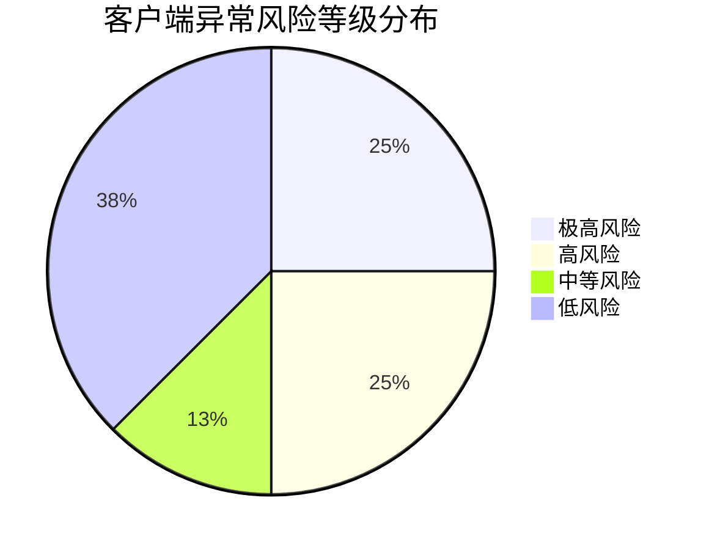

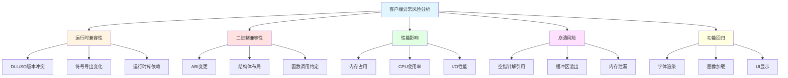

---

## 2. 运行时兼容性问题

### 2.1 DLL/SO版本冲突

#### 2.1.1 问题概述

当客户端依赖多个第三方库，而这些库又依赖不同版本的同一个底层库时，会产生DLL/SO版本冲突问题。

#### 2.1.2 具体风险分析

| 依赖库 | 潜在冲突 | 风险等级 | 影响范围 |
|--------|----------|----------|----------|
| wxWidgets | 依赖不同版本的zlib | 🟡 中 | 图像加载、数据压缩 |
| libpng | 依赖不同版本的zlib | 🟡 中 | PNG图像处理 |
| FreeType | 依赖不同版本的zlib | 🟡 中 | 字体渲染 |
| SILLY | 依赖不同版本的libpng | 🟠 高 | 图像加载器 |

#### 2.1.3 冲突场景示例

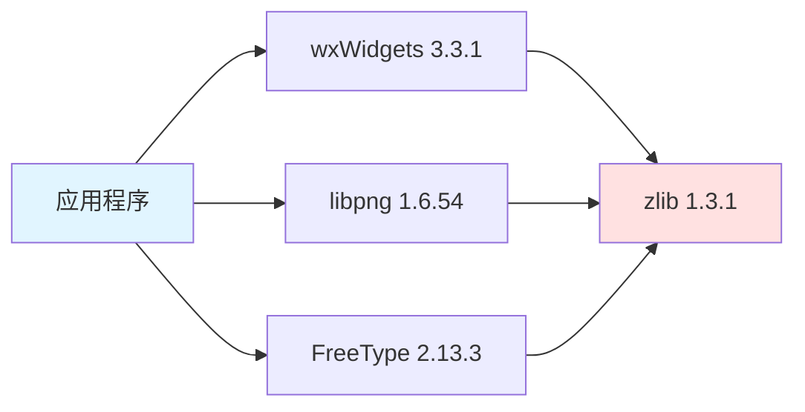

#### 2.1.4 解决方案

1. **统一依赖版本**: 确保所有库使用相同版本的zlib
2. **静态链接**: 将zlib静态链接到各个模块
3. **延迟加载**: 使用延迟加载技术避免启动时冲突
4. **版本隔离**: 将冲突的库放入独立的进程

### 2.2 符号导出变化

#### 2.2.1 问题概述

库升级后，导出的符号可能发生变化，包括符号名称、符号数量、符号可见性等。

#### 2.2.2 各库符号变化分析

| 库名称 | 符号变化类型 | 风险等级 | 说明 |
|--------|--------------|----------|------|
| PCRE → PCRE2 | 完全重命名 | 🔴 极高 | 所有函数名从`pcre_*`变为`pcre2_*` |
| wxWidgets | 大量新增/删除 | 🔴 高 | API完全重构，大量符号变化 |
| libpng | 部分符号删除 | 🟠 高 | 简化API，删除了部分符号 |
| FreeType | 少量符号变化 | 🟡 中 | 新增了一些符号，少量废弃 |
| zlib | 基本无变化 | 🟢 低 | 符号基本保持兼容 |

#### 2.2.3 PCRE符号变化示例

```c
// PCRE 8.31
pcre *re = pcre_compile(pattern, 0, &error, &erroffset, NULL);
int rc = pcre_exec(re, NULL, subject, length, 0, 0, ovector, 30);

// PCRE2 10.43
pcre2_code *re = pcre2_compile((PCRE2_SPTR)pattern, PCRE2_ZERO_TERMINATED, 0, &error, &erroffset, NULL);
pcre2_match_data *match_data = pcre2_match_data_create(30, NULL);
int rc = pcre2_match(re, (PCRE2_SPTR)subject, length, 0, 0, match_data, NULL);
```

#### 2.2.4 影响评估

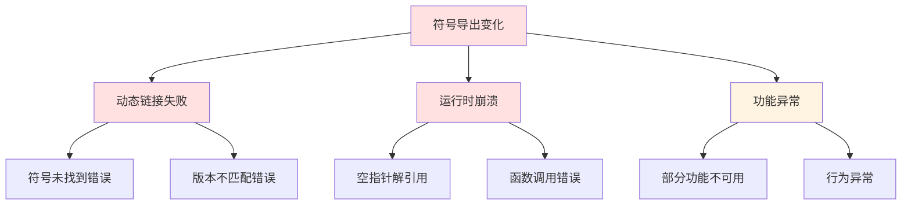

### 2.3 运行时库依赖变化

#### 2.3.1 问题概述

库升级可能改变对运行时库的依赖，包括C运行时库、C++标准库等。

#### 2.3.2 运行时库依赖变化

| 库名称 | 运行时库变化 | 风险等级 | 说明 |
|--------|--------------|----------|------|
| wxWidgets | MSVCRT → UCRT/MSVCRT14+ | 🟠 高 | 可能需要新的运行时库 |
| PCRE2 | 无明显变化 | 🟢 低 | 保持兼容 |
| libpng | 无明显变化 | 🟢 低 | 保持兼容 |
| FreeType | 无明显变化 | 🟢 低 | 保持兼容 |

#### 2.3.3 Windows运行时库兼容性

| 运行时库 | 支持的Windows版本 | 兼容性 |
|----------|-------------------|--------|
| MSVCRT.dll | XP及以后 | 🟢 完全兼容 |
| MSVCR100.dll (VS2010) | XP及以后 | 🟢 完全兼容 |
| MSVCR140.dll (VS2015) | 7及以后 | 🟡 需要分发 |
| MSVCR143.dll (VS2022) | 7及以后 | 🟡 需要分发 |

#### 2.3.4 解决方案

1. **静态链接运行时**: 使用`/MT`编译选项静态链接运行时库
2. **运行时库分发**: 将所需的运行时库DLL包含在安装包中
3. **向后兼容**: 保留旧版本运行时库支持
4. **统一编译环境**: 使用统一的编译器和运行时库版本

### 2.4 内存分配器差异

#### 2.4.1 问题概述

不同库可能使用不同的内存分配策略，如果跨模块传递内存指针，可能导致问题。

#### 2.4.2 内存分配器问题场景

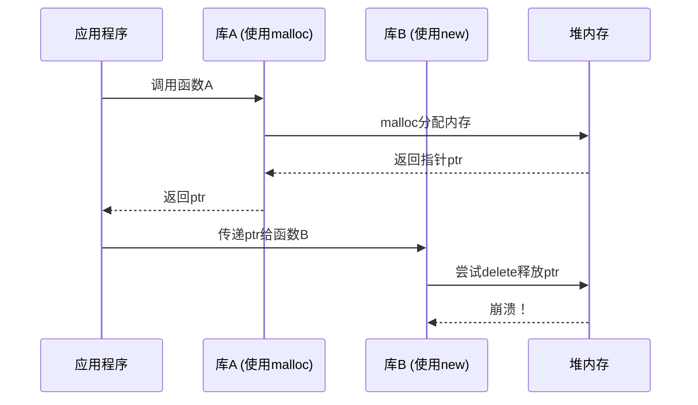

#### 2.4.3 各库内存分配策略

| 库名称 | 内存分配方式 | 风险等级 | 说明 |
|--------|--------------|----------|------|
| wxWidgets | 自定义分配器 | 🟡 中 | 使用wxMemoryAllocator |
| PCRE2 | 支持自定义分配器 | 🟢 低 | 可设置分配器回调 |
| libpng | 使用标准分配器 | 🟢 低 | malloc/free |
| FreeType | 使用标准分配器 | 🟢 低 | malloc/free |
| zlib | 使用标准分配器 | 🟢 低 | malloc/free |

#### 2.4.4 解决方案

1. **统一内存分配**: 确保所有模块使用相同的内存分配器
2. **边界清晰**: 明确内存分配和释放的责任方
3. **使用智能指针**: 使用智能指针自动管理内存
4. **自定义分配器**: 为跨模块内存传递提供自定义分配器

### 2.5 线程模型变化

#### 2.5.1 问题概述

库升级可能改变线程模型，包括线程创建方式、同步机制等。

#### 2.5.2 各库线程模型变化

| 库名称 | 线程模型变化 | 风险等级 | 说明 |
|--------|--------------|----------|------|
| wxWidgets | 线程API更新 | 🟡 中 | wxThread API有变化 |
| PCRE2 | 新增JIT支持 | 🟢 低 | JIT编译可能影响线程安全 |
| libpng | 无明显变化 | 🟢 低 | 保持兼容 |
| FreeType | 无明显变化 | 🟢 低 | 保持兼容 |

#### 2.5.3 wxWidgets线程模型变化

```cpp
// wxWidgets 2.8.11
class MyThread : public wxThread {
public:
    virtual ExitCode Entry() {
        // 线程入口
        return (ExitCode)0;
    }
};

// wxWidgets 3.3.1
class MyThread : public wxThread {
public:
    virtual ExitCode Entry() override {
        // 线程入口
        return (ExitCode)0;
    }
    
    // 新增的线程本地存储支持
    static wxThreadLocal<int> tlsVar;
};
```

#### 2.5.4 解决方案

1. **线程安全审查**: 审查所有线程相关代码
2. **同步机制更新**: 更新同步原语的使用
3. **线程本地存储**: 适配新的线程本地存储API
4. **线程池管理**: 更新线程池实现

### 2.6 异常处理机制变化

#### 2.6.1 问题概述

C++异常处理机制的变化可能导致异常传播和捕获行为改变。

#### 2.6.2 各库异常处理策略

| 库名称 | 异常处理策略 | 风险等级 | 说明 |
|--------|--------------|----------|------|
| wxWidgets | 使用wxException | 🟡 中 | 异常类层次结构变化 |
| PCRE2 | 不使用异常 | 🟢 低 | 使用错误码 |
| libpng | 不使用异常 | 🟢 低 | 使用错误码 |
| FreeType | 不使用异常 | 🟢 低 | 使用错误码 |

#### 2.6.3 wxWidgets异常处理变化

```cpp
// wxWidgets 2.8.11
try {
    throw wxException("Error message");
} catch (wxException& e) {
    // 处理异常
}

// wxWidgets 3.3.1
try {
    throw wxException("Error message");
} catch (wxException& e) {
    // 异常类增加了更多方法
    wxString message = e.GetMessage();
    long code = e.GetCode();
}
```

#### 2.6.4 解决方案

1. **异常规范更新**: 更新异常规范和文档
2. **异常捕获适配**: 适配新的异常类层次结构
3. **错误码统一**: 统一错误码和异常处理策略
4. **异常安全审查**: 审查异常安全性

---

## 3. 二进制兼容性问题

### 3.1 ABI（应用程序二进制接口）变更

#### 3.1.1 问题概述

ABI变更会导致已编译的二进制代码与新版本的库不兼容，需要重新编译所有依赖代码。

#### 3.1.2 ABI变更风险评估

| 库名称 | ABI变更程度 | 风险等级 | 需要重新编译 |
|--------|--------------|----------|--------------|
| PCRE → PCRE2 | 完全破坏 | 🔴 极高 | 是 |
| wxWidgets | 完全破坏 | 🔴 高 | 是 |
| libpng | 部分破坏 | 🟠 高 | 是 |
| FreeType | 少量变更 | 🟡 中 | 建议 |
| zlib | 基本兼容 | 🟢 低 | 否 |
| libvorbis | 基本兼容 | 🟢 低 | 否 |
| libogg | 基本兼容 | 🟢 低 | 否 |

#### 3.1.3 ABI变更影响分析

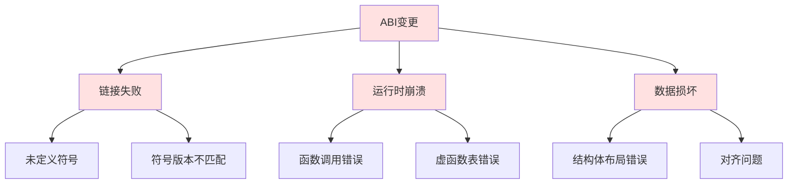

### 3.2 结构体大小和布局变化

#### 3.2.1 问题概述

结构体的大小和布局变化会导致二进制不兼容，特别是在跨DLL边界传递结构体时。

#### 3.2.2 各库结构体变化

| 库名称 | 结构体变化 | 风险等级 | 说明 |
|--------|------------|----------|------|
| PCRE → PCRE2 | 完全重定义 | 🔴 极高 | 所有结构体重新定义 |
| wxWidgets | 大量变化 | 🔴 高 | 大量结构体成员变化 |
| libpng | 部分变化 | 🟠 高 | png_info等结构体变化 |
| FreeType | 少量变化 | 🟡 中 | 新增成员，保持向后兼容 |
| zlib | 无变化 | 🟢 低 | 保持兼容 |

#### 3.2.3 PCRE结构体变化示例

```c
// PCRE 8.31
typedef struct pcre_extra {
    unsigned long int flags;
    void *study_data;
    unsigned long int match_limit;
    unsigned long int match_limit_recursion;
    void *callout_data;
    const unsigned char *tables;
    unsigned long int mark;
    void *executable_jit;
} pcre_extra;

// PCRE2 10.43 - 完全不同的结构
typedef struct pcre2_match_context {
    uint32_t flags;
    void *memctl;
    pcre2_compile_context *compile_context;
    pcre2_callout_block *callout_data;
    pcre2_substitute_callout_block *substitute_callout_data;
    pcre2_jit_stack *jit_callback;
    void *jit_callback_data;
    uint32_t offset_limit;
    uint32_t heap_limit;
    uint32_t match_limit;
    uint32_t depth_limit;
} pcre2_match_context;
```

#### 3.2.4 结构体对齐问题

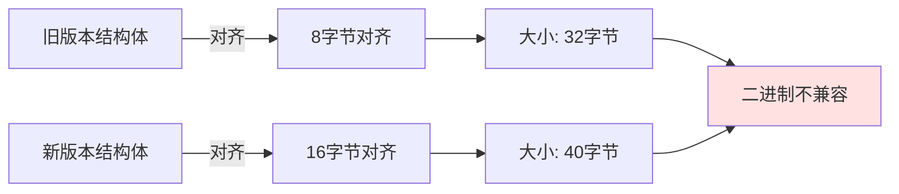

#### 3.2.5 解决方案

1. **重新编译所有代码**: 确保所有模块使用新的结构体定义
2. **使用版本化结构体**: 保留旧版本结构体用于向后兼容
3. **使用不透明指针**: 避免在API中暴露结构体定义
4. **序列化传输**: 使用序列化方式跨模块传递数据

### 3.3 函数调用约定变化

#### 3.3.1 问题概述

函数调用约定变化会导致函数调用失败或参数传递错误。

#### 3.3.2 调用约定类型

| 调用约定 | 说明 | 使用场景 |
|----------|------|----------|
| __cdecl | C默认调用约定 | C函数 |
| __stdcall | Windows API调用约定 | Windows API |
| __fastcall | 快速调用约定 | 性能敏感代码 |
| __thiscall | C++成员函数调用约定 | C++成员函数 |

#### 3.3.3 各库调用约定

| 库名称 | 调用约定 | 风险等级 | 说明 |
|--------|----------|----------|------|
| PCRE | __cdecl | 🟢 低 | 标准C调用约定 |
| PCRE2 | __cdecl | 🟢 低 | 标准C调用约定 |
| wxWidgets | __thiscall (C++) | 🟡 中 | C++成员函数 |
| libpng | __cdecl | 🟢 低 | 标准C调用约定 |
| FreeType | __cdecl | 🟢 低 | 标准C调用约定 |

#### 3.3.4 解决方案

1. **统一调用约定**: 确保所有模块使用相同的调用约定
2. **使用extern "C"**: 对C++函数使用extern "C"确保C调用约定
3. **编译选项检查**: 检查编译器的调用约定设置
4. **函数声明审查**: 审查所有跨模块函数声明

### 3.4 虚函数表（vtable）变化

#### 3.4.1 问题概述

虚函数表变化会导致C++多态行为异常，特别是在跨DLL边界时。

#### 3.4.2 vtable变化场景

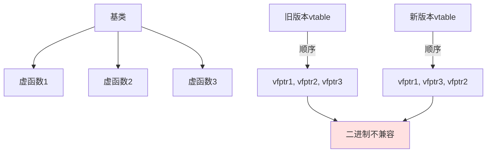

#### 3.4.3 wxWidgets vtable变化

wxWidgets 2.8.11 → 3.3.1 的升级中，大量类的虚函数表发生了变化：

```cpp
// wxWidgets 2.8.11
class wxWindow {
public:
    virtual bool Show(bool show = true);
    virtual void Raise();
    virtual void Lower();
    // ... 其他虚函数
};

// wxWidgets 3.3.1
class wxWindow {
public:
    virtual bool Show(bool show = true) override;
    virtual void Raise() override;
    virtual void Lower() override;
    // 新增的虚函数
    virtual bool SetBackgroundStyle(wxBackgroundStyle style);
    virtual bool SetForegroundStyle(wxForegroundStyle style);
    // ... 其他虚函数
};
```

#### 3.4.4 解决方案

1. **重新编译所有派生类**: 确保vtable布局一致
2. **避免跨DLL继承**: 避免跨DLL边界进行虚函数调用
3. **使用接口模式**: 使用纯虚接口代替直接继承
4. **版本化虚函数**: 为新虚函数添加版本控制

### 3.5 模板实例化差异

#### 3.5.1 问题概述

模板实例化的差异可能导致符号冲突或链接错误。

#### 3.5.2 模板实例化问题

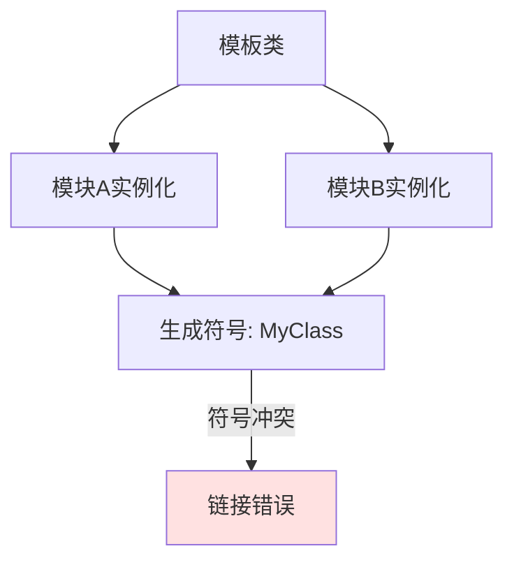

#### 3.5.3 各库模板使用

| 库名称 | 模板使用 | 风险等级 | 说明 |
|--------|----------|----------|------|
| wxWidgets | 大量使用 | 🟡 中 | wxArray, wxString等 |
| PCRE | 不使用 | 🟢 低 | 纯C库 |
| libpng | 不使用 | 🟢 低 | 纯C库 |
| FreeType | 不使用 | 🟢 低 | 纯C库 |

#### 3.5.4 解决方案

1. **显式实例化**: 在头文件中显式实例化模板
2. **使用extern模板**: 声明extern template避免重复实例化
3. **统一编译选项**: 确保所有模块使用相同的编译选项
4. **使用预编译头**: 使用预编译头减少实例化差异

---

## 4. 性能影响分析

### 4.1 内存占用变化

#### 4.1.1 问题概述

库升级可能导致内存占用增加或减少，影响客户端性能。

#### 4.1.2 各库内存占用变化

| 库名称 | 内存占用变化 | 风险等级 | 说明 |
|--------|--------------|----------|------|
| PCRE → PCRE2 | 可能增加 | 🟡 中 | PCRE2使用更复杂的结构 |
| wxWidgets | 可能增加 | 🟡 中 | Unicode支持增加内存占用 |
| libpng | 基本不变 | 🟢 低 | 优化了内存管理 |
| FreeType | 可能增加 | 🟡 中 | 新增功能增加内存 |
| zlib | 略有减少 | 🟢 低 | 优化了内存使用 |
| libvorbis | 略有减少 | 🟢 低 | 优化了解码器 |
| libogg | 基本不变 | 🟢 低 | 变化很小 |

#### 4.1.3 内存占用对比

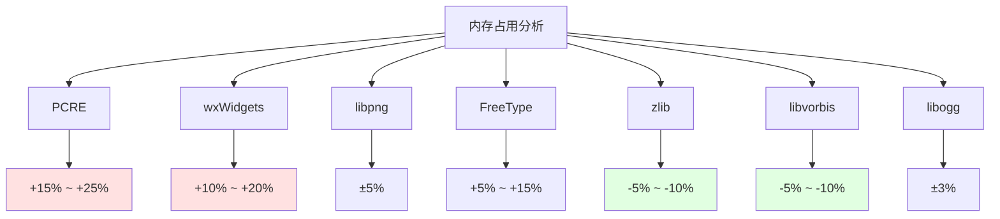

#### 4.1.4 内存泄漏风险

| 库名称 | 内存泄漏风险 | 风险等级 | 说明 |
|--------|--------------|----------|------|
| wxWidgets | 中等 | 🟡 中 | 新的Unicode字符串管理 |
| PCRE2 | 低 | 🟢 低 | 有完善的内存管理 |
| libpng | 低 | 🟢 低 | API改进减少了泄漏 |
| FreeType | 低 | 🟢 低 | 稳定的内存管理 |

### 4.2 CPU使用率变化

#### 4.2.1 问题概述

库升级可能影响CPU使用率，包括编译时优化和运行时性能。

#### 4.2.2 各库CPU使用率变化

| 库名称 | CPU使用率变化 | 风险等级 | 说明 |
|--------|---------------|----------|------|
| PCRE → PCRE2 | 可能降低 | 🟢 低 | JIT编译提升性能 |
| wxWidgets | 可能增加 | 🟡 中 | Unicode处理增加开销 |
| libpng | 基本不变 | 🟢 低 | 优化了关键路径 |
| FreeType | 可能降低 | 🟢 低 | 优化了渲染算法 |
| zlib | 可能降低 | 🟢 低 | 优化了压缩算法 |
| libvorbis | 可能降低 | 🟢 低 | 优化了解码器 |
| libogg | 基本不变 | 🟢 低 | 变化很小 |

#### 4.2.3 性能对比

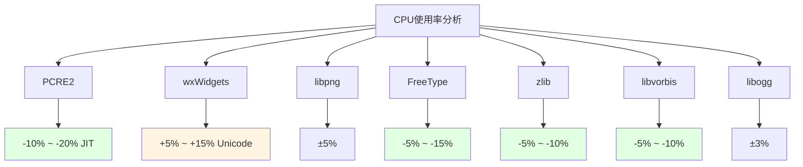

### 4.3 I/O性能变化

#### 4.3.1 问题概述

I/O性能变化可能影响文件加载、网络请求等操作。

#### 4.3.2 各库I/O性能变化

| 库名称 | I/O性能变化 | 风险等级 | 说明 |
|--------|-------------|----------|------|
| zlib | 可能提升 | 🟢 低 | 优化了I/O缓冲 |
| libpng | 基本不变 | 🟢 低 | I/O不是瓶颈 |
| wxWidgets | 基本不变 | 🟢 低 | I/O不是主要关注点 |
| FreeType | 基本不变 | 🟢 低 | 主要是内存操作 |

#### 4.3.3 I/O性能测试建议

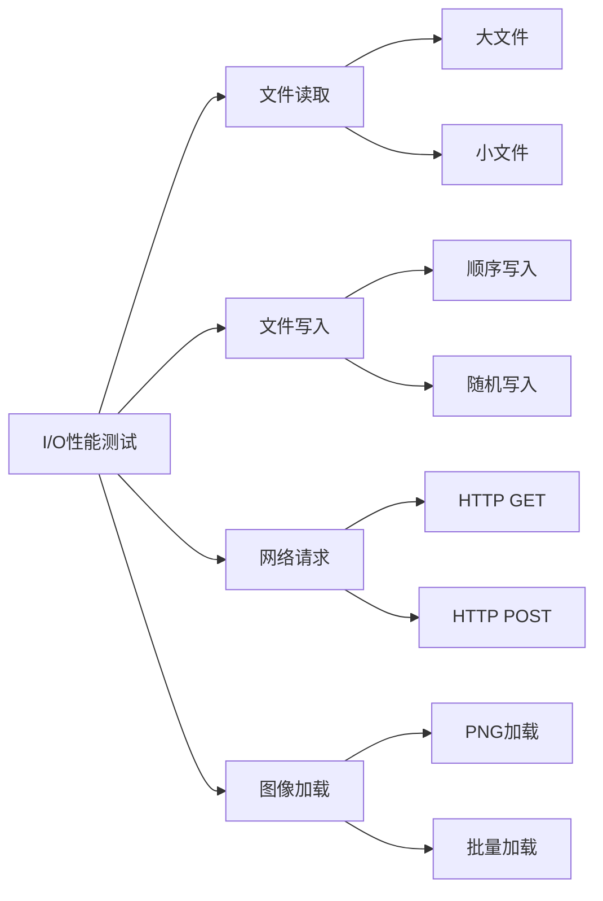

### 4.4 渲染性能变化

#### 4.4.1 问题概述

渲染性能变化直接影响用户体验，特别是UI响应和动画流畅度。

#### 4.4.2 各库渲染性能变化

| 库名称 | 渲染性能变化 | 风险等级 | 说明 |
|--------|--------------|----------|------|
| wxWidgets | 可能降低 | 🟡 中 | Unicode增加渲染开销 |
| FreeType | 可能提升 | 🟢 低 | 优化了字体渲染 |
| libpng | 基本不变 | 🟢 低 | 解码不是瓶颈 |

#### 4.4.3 渲染性能对比

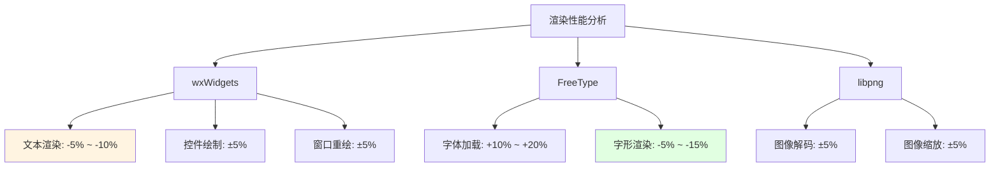

### 4.5 网络性能变化

#### 4.5.1 问题概述

网络性能变化影响HTTP请求、数据传输等操作。

#### 4.5.2 各库网络性能变化

| 库名称 | 网络性能变化 | 风险等级 | 说明 |
|--------|--------------|----------|------|
| ASIHTTPRequest | 无变化 | 🟢 低 | 未升级 |
| LuaSocket | 无变化 | 🟢 低 | 未升级 |

### 4.6 音频编解码性能变化

#### 4.6.1 问题概述

音频编解码性能变化影响音频播放和语音通信质量。

#### 4.6.2 各库音频性能变化

| 库名称 | 音频性能变化 | 风险等级 | 说明 |
|--------|--------------|----------|------|
| libvorbis | 可能提升 | 🟢 低 | 优化了解码器 |
| Speex → Opus | 可能大幅提升 | 🟢 低 | Opus性能更好 |
| libogg | 基本不变 | 🟢 低 | 变化很小 |

#### 4.6.3 音频性能对比

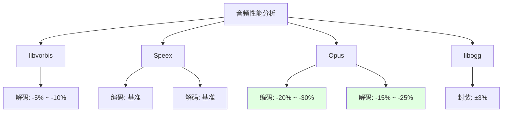

---

## 5. 客户端崩溃风险

### 5.1 空指针解引用

#### 5.1.1 问题概述

空指针解引用是最常见的崩溃原因之一，升级后API变化可能导致新的空指针问题。

#### 5.1.2 各库空指针风险

| 库名称 | 空指针风险 | 风险等级 | 说明 |
|--------|------------|----------|------|
| PCRE → PCRE2 | 高 | 🔴 高 | API变化，参数语义改变 |
| wxWidgets | 高 | 🔴 高 | 大量API变化 |
| libpng | 中 | 🟠 高 | 简化API，错误处理改变 |
| FreeType | 低 | 🟡 中 | API相对稳定 |
| zlib | 低 | 🟢 低 | API基本不变 |

#### 5.1.3 PCRE2空指针风险示例

```c
// PCRE 8.31 - 允许NULL
pcre *re = pcre_compile(pattern, 0, &error, &erroffset, NULL);
int rc = pcre_exec(re, NULL, subject, length, 0, 0, ovector, 30);

// PCRE2 10.43 - NULL可能导致崩溃
pcre2_code *re = pcre2_compile((PCRE2_SPTR)pattern, PCRE2_ZERO_TERMINATED, 
                                0, &error, &erroffset, NULL);
// 如果re为NULL，以下调用会崩溃
pcre2_match_data *match_data = pcre2_match_data_create(30, NULL);
int rc = pcre2_match(re, (PCRE2_SPTR)subject, length, 0, 0, match_data, NULL);
```

#### 5.1.4 空指针防护措施

```c
// 推荐的空指针检查
if (re == NULL) {
    // 处理编译错误
    return ERROR_INVALID_PATTERN;
}

if (match_data == NULL) {
    // 处理内存分配失败
    return ERROR_OUT_OF_MEMORY;
}
```

### 5.2 缓冲区溢出

#### 5.2.1 问题概述

缓冲区溢出是严重的安全漏洞，可能导致崩溃或代码执行。

#### 5.2.2 各库缓冲区溢出风险

| 库名称 | 缓冲区溢出风险 | 风险等级 | 说明 |
|--------|----------------|----------|------|
| zlib | 低 | 🟢 低 | 新版本修复了已知漏洞 |
| libpng | 低 | 🟢 低 | 新版本修复了已知漏洞 |
| PCRE2 | 低 | 🟢 低 | 有严格的边界检查 |
| FreeType | 低 | 🟢 低 | 有严格的边界检查 |
| wxWidgets | 中 | 🟡 中 | 需要审查字符串操作 |

#### 5.2.3 缓冲区溢出防护

```c
// 不安全的代码
char buffer[256];
strcpy(buffer, input);  // 如果input > 256，溢出

// 安全的代码
char buffer[256];
strncpy(buffer, input, sizeof(buffer) - 1);
buffer[sizeof(buffer) - 1] = '\0';

// 或使用安全函数
strcpy_s(buffer, sizeof(buffer), input);
```

### 5.3 内存泄漏

#### 5.3.1 问题概述

内存泄漏会导致客户端内存占用持续增长，最终导致崩溃或性能下降。

#### 5.3.2 各库内存泄漏风险

| 库名称 | 内存泄漏风险 | 风险等级 | 说明 |
|--------|--------------|----------|------|
| PCRE → PCRE2 | 高 | 🔴 高 | API变化，需要手动释放 |
| wxWidgets | 高 | 🔴 高 | 新的Unicode字符串管理 |
| libpng | 中 | 🟠 高 | 简化API，释放责任改变 |
| FreeType | 低 | 🟡 中 | API相对稳定 |
| zlib | 低 | 🟢 低 | API基本不变 |

#### 5.3.3 PCRE2内存泄漏示例

```c
// PCRE 8.31
pcre *re = pcre_compile(pattern, 0, &error, &erroffset, NULL);
// 使用re...
pcre_free(re);  // 释放

// PCRE2 10.43 - 需要释放多个对象
pcre2_code *re = pcre2_compile((PCRE2_SPTR)pattern, PCRE2_ZERO_TERMINATED, 
                                0, &error, &erroffset, NULL);
pcre2_match_data *match_data = pcre2_match_data_create(30, NULL);
// 使用re和match_data...
pcre2_match_data_free(match_data);  // 必须释放
pcre2_code_free(re);  // 必须释放
```

#### 5.3.4 内存泄漏检测

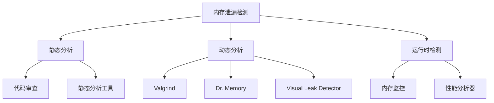

### 5.4 双重释放

#### 5.4.1 问题概述

双重释放会导致堆损坏，通常会导致崩溃。

#### 5.4.2 各库双重释放风险

| 库名称 | 双重释放风险 | 风险等级 | 说明 |
|--------|--------------|----------|------|
| PCRE → PCRE2 | 中 | 🟠 高 | API变化，释放逻辑改变 |
| wxWidgets | 中 | 🟠 高 | 智能指针使用不当 |
| libpng | 低 | 🟡 中 | API相对稳定 |
| FreeType | 低 | 🟢 低 | API相对稳定 |

#### 5.4.3 双重释放防护

```cpp
// 不安全的代码
void* ptr = malloc(100);
free(ptr);
free(ptr);  // 双重释放，崩溃

// 安全的代码
void* ptr = malloc(100);
free(ptr);
ptr = nullptr;  // 置空，防止双重释放
if (ptr) {
    free(ptr);  // 不会执行
}
```

### 5.5 竞态条件

#### 5.5.1 问题概述

竞态条件在多线程环境下可能导致数据损坏或崩溃。

#### 5.5.2 各库竞态条件风险

| 库名称 | 竞态条件风险 | 风险等级 | 说明 |
|--------|--------------|----------|------|
| wxWidgets | 高 | 🔴 高 | 线程模型变化 |
| PCRE2 | 低 | 🟢 低 | 线程安全 |
| libpng | 低 | 🟢 低 | 线程安全 |
| FreeType | 低 | 🟢 低 | 线程安全 |

#### 5.5.3 竞态条件示例

```cpp
// 不安全的代码
int counter = 0;

void increment() {
    counter++;  // 非原子操作，竞态条件
}

// 安全的代码
std::atomic<int> counter(0);

void increment() {
    counter++;  // 原子操作，线程安全
}

// 或使用互斥锁
std::mutex mutex;
int counter = 0;

void increment() {
    std::lock_guard<std::mutex> lock(mutex);
    counter++;
}
```

### 5.6 栈溢出

#### 5.6.1 问题概述

栈溢出通常由递归过深或局部变量过大引起。

#### 5.6.2 各库栈溢出风险

| 库名称 | 栈溢出风险 | 风险等级 | 说明 |
|--------|------------|----------|------|
| PCRE2 | 中 | 🟠 高 | 递归匹配可能栈溢出 |
| wxWidgets | 低 | 🟡 中 | 事件处理递归 |
| libpng | 低 | 🟢 低 | 非递归算法 |
| FreeType | 低 | 🟢 低 | 非递归算法 |

#### 5.6.3 栈溢出防护

```c
// 不安全的递归
int factorial(int n) {
    if (n <= 1) return 1;
    return n * factorial(n - 1);  // 深度递归可能栈溢出
}

// 安全的迭代版本
int factorial(int n) {
    int result = 1;
    for (int i = 2; i <= n; i++) {
        result *= i;
    }
    return result;
}
```

### 5.7 未定义行为

#### 5.7.1 问题概述

未定义行为可能导致不可预测的结果，包括崩溃。

#### 5.7.2 各库未定义行为风险

| 库名称 | 未定义行为风险 | 风险等级 | 说明 |
|--------|----------------|----------|------|
| PCRE → PCRE2 | 中 | 🟠 高 | API变化，参数验证改变 |
| wxWidgets | 中 | 🟠 高 | 大量API变化 |
| libpng | 低 | 🟡 中 | API相对稳定 |
| FreeType | 低 | 🟢 低 | API相对稳定 |

#### 5.7.3 未定义行为示例

```c
// 未定义行为
int arr[10];
int x = arr[10];  // 越界访问，未定义行为

int* ptr = NULL;
int y = *ptr;  // 解引用空指针，未定义行为

// 安全的代码
int arr[10];
if (index >= 0 && index < 10) {
    int x = arr[index];  // 边界检查
}

int* ptr = get_pointer();
if (ptr != NULL) {
    int y = *ptr;  // 空指针检查
}
```

### 5.8 崩溃风险总结

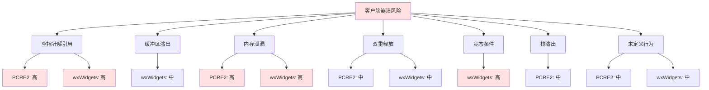

---

## 6. 功能回归风险

### 6.1 字体渲染异常（FreeType）

#### 6.1.1 问题概述

FreeType升级可能导致字体渲染效果变化，包括字形显示、字距调整等。

#### 6.1.2 FreeType 2.4.9 → 2.13.3 变化

| 功能 | 变化 | 风险等级 | 影响 |
|------|------|----------|------|
| 字体加载 | API变化 | 🟡 中 | 需要更新加载代码 |
| 字形渲染 | 算法优化 | 🟢 低 | 渲染质量可能提升 |
| 字距调整 | 行为微调 | 🟡 中 | 可能需要重新调整 |
| 抗锯齿 | 算法改进 | 🟢 低 | 显示质量提升 |
| 自动微调 | 默认行为变化 | 🟡 中 | 可能需要调整 |

#### 6.1.3 API变化示例

```c
// FreeType 2.4.9
FT_Face face;
FT_New_Face(library, "font.ttf", 0, &face);
FT_Set_Char_Size(face, 0, 16 * 64, 300, 300);
FT_Load_Char(face, 'A', FT_LOAD_RENDER);

// FreeType 2.13.3
FT_Face face;
FT_New_Face(library, "font.ttf", 0, &face);
FT_Set_Char_Size(face, 0, 16 * 64, 300, 300);
// 新增的加载标志
FT_Load_Char(face, 'A', FT_LOAD_RENDER | FT_LOAD_NO_BITMAP);
```

#### 6.1.4 回归测试要点

1. **字体加载测试**: 测试各种字体格式的加载
2. **字形渲染测试**: 检查字形显示是否正确
3. **字距调整测试**: 验证字距调整效果
4. **多语言支持测试**: 测试各种语言的字体渲染
5. **性能测试**: 检查渲染性能是否下降

### 6.2 图像加载失败（libpng、SILLY）

#### 6.2.1 问题概述

libpng升级可能导致图像加载失败或显示异常。

#### 6.2.2 libpng 1.4.5 → 1.6.54 变化

| 功能 | 变化 | 风险等级 | 影响 |
|------|------|----------|------|
| API简化 | 大量函数废弃 | 🟠 高 | 需要重写加载代码 |
| 错误处理 | 机制改变 | 🟠 高 | 错误处理逻辑需要更新 |
| 内存管理 | 优化 | 🟢 低 | 减少内存占用 |
| 解码性能 | 提升 | 🟢 低 | 加载速度提升 |

#### 6.2.3 API变化示例

```c
// libpng 1.4.5
png_structp png_ptr = png_create_read_struct(PNG_LIBPNG_VER_STRING, 
                                               NULL, NULL, NULL);
png_infop info_ptr = png_create_info_struct(png_ptr);
setjmp(png_jmpbuf(png_ptr));
png_init_io(png_ptr, fp);
png_read_png(png_ptr, info_ptr, PNG_TRANSFORM_IDENTITY, NULL);

// libpng 1.6.54
png_structp png_ptr = png_create_read_struct(PNG_LIBPNG_VER_STRING, 
                                               NULL, NULL, NULL);
png_infop info_ptr = png_create_info_struct(png_ptr);
// 新的错误处理方式
if (setjmp(png_jmpbuf(png_ptr))) {
    // 错误处理
    png_destroy_read_struct(&png_ptr, &info_ptr, NULL);
    return;
}
png_init_io(png_ptr, fp);
// 新的变换标志
png_read_png(png_ptr, info_ptr, PNG_TRANSFORM_SCALE_16 | PNG_TRANSFORM_STRIP_ALPHA, NULL);
```

#### 6.2.4 SILLY兼容性

SILLY是一个图像加载库，依赖于libpng。libpng升级后需要：

1. **重新编译SILLY**: 使用新的libpng版本重新编译
2. **测试所有图像格式**: PNG、JPG、BMP等
3. **测试透明度处理**: Alpha通道处理是否正确
4. **测试色彩空间**: RGB、RGBA、灰度等

#### 6.2.5 回归测试要点

1. **PNG加载测试**: 测试各种PNG格式
2. **透明度测试**: 测试Alpha通道处理
3. **色彩空间测试**: 测试各种色彩空间
4. **大图像测试**: 测试大图像加载
5. **损坏图像测试**: 测试对损坏图像的处理

### 6.3 UI显示异常（wxWidgets、CEGUI）

#### 6.3.1 问题概述

wxWidgets和CEGUI升级可能导致UI显示异常。

#### 6.3.2 wxWidgets 2.8.11 → 3.3.1 变化

| 功能 | 变化 | 风险等级 | 影响 |
|------|------|----------|------|
| Unicode | 默认开启 | 🔴 高 | 所有字符串处理需要重写 |
| 事件系统 | 重构 | 🔴 高 | 事件处理逻辑需要更新 |
| 控件API | 大量变化 | 🔴 高 | 控件使用方式改变 |
| 绘图API | 变化 | 🟠 高 | 自定义绘制需要更新 |
| 布局系统 | 改进 | 🟡 中 | 布局行为可能变化 |

#### 6.3.3 Unicode变化示例

```cpp
// wxWidgets 2.8.11 - ANSI版本
wxString str = "Hello";
wxMessageBox(str);

// wxWidgets 3.3.1 - Unicode版本
wxString str = wxT("Hello");
// 或使用L前缀
wxString str2 = L"Hello";
// 或使用宏
wxString str3 = _("Hello");

// 字符串处理变化
// 旧版本
char* cstr = str.c_str();
// 新版本
const char* cstr = str.ToUTF8().data();
```

#### 6.3.4 事件系统变化示例

```cpp
// wxWidgets 2.8.11
BEGIN_EVENT_TABLE(MyFrame, wxFrame)
    EVT_MENU(ID_ABOUT, MyFrame::OnAbout)
    EVT_BUTTON(ID_OK, MyFrame::OnOK)
END_EVENT_TABLE()

// wxWidgets 3.3.1 - 推荐使用Bind
MyFrame::MyFrame() {
    Bind(wxEVT_MENU, &MyFrame::OnAbout, this, ID_ABOUT);
    Bind(wxEVT_BUTTON, &MyFrame::OnOK, this, ID_OK);
}
```

#### 6.3.5 CEGUI兼容性

CEGUI是一个UI库，需要检查：

1. **渲染器兼容性**: 检查与wxWidgets的集成
2. **输入处理**: 检查事件传递是否正常
3. **字体渲染**: 检查与FreeType的集成
4. **图像加载**: 检查与libpng的集成

#### 6.3.6 回归测试要点

1. **窗口显示测试**: 测试各种窗口的显示
2. **控件测试**: 测试各种控件的功能
3. **事件处理测试**: 测试事件响应
4. **布局测试**: 测试布局效果
5. **多语言测试**: 测试多语言UI
6. **主题测试**: 测试各种主题

### 6.4 音频播放异常（libvorbis、Speex）

#### 6.4.1 问题概述

音频库升级可能导致音频播放异常。

#### 6.4.2 libvorbis 1.3.5 → 1.3.7 变化

| 功能 | 变化 | 风险等级 | 影响 |
|------|------|----------|------|
| API | 基本兼容 | 🟢 低 | 主要是bug修复 |
| 解码性能 | 提升 | 🟢 低 | 播放更流畅 |
| 错误处理 | 改进 | 🟢 低 | 更好的错误报告 |

#### 6.4.3 Speex 1.2rc2 → 1.2.0+ 或 Opus

| 功能 | 变化 | 风险等级 | 影响 |
|------|------|----------|------|
| API | 完全不同（Opus） | 🔴 高 | 需要完全重写 |
| 编解码性能 | 大幅提升（Opus） | 🟢 低 | 更好的音频质量 |
| 功能 | 更丰富（Opus） | 🟢 低 | 支持更多功能 |

#### 6.4.4 API变化示例

```c
// Speex 1.2rc2
SpeexBits bits;
void *state;
state = speex_decoder_init(&speex_nb_mode);
speex_bits_init(&bits);
speex_decode(state, &bits, output);

// Opus
OpusDecoder *decoder;
decoder = opus_decoder_create(48000, 1, &error);
int decoded = opus_decode(decoder, input, input_len, output, frame_size, 0);
```

#### 6.4.5 回归测试要点

1. **音频播放测试**: 测试各种音频格式
2. **音质测试**: 测试音频质量
3. **性能测试**: 测试编解码性能
4. **错误处理测试**: 测试对损坏音频的处理
5. **多声道测试**: 测试多声道音频

### 6.5 网络请求异常（ASIHTTPRequest、LuaSocket）

#### 6.5.1 问题概述

网络库未升级，但依赖库的变化可能影响网络功能。

#### 6.5.2 潜在影响

| 功能 | 潜在影响 | 风险等级 | 说明 |
|------|----------|----------|------|
| HTTP请求 | 间接影响 | 🟡 中 | 通过wxWidgets影响UI |
| SSL/TLS | 无影响 | 🟢 低 | 未升级 |
| Socket | 无影响 | 🟢 低 | 未升级 |

#### 6.5.3 回归测试要点

1. **HTTP GET测试**: 测试GET请求
2. **HTTP POST测试**: 测试POST请求
3. **HTTPS测试**: 测试HTTPS请求
4. **超时测试**: 测试超时处理
5. **错误处理测试**: 测试网络错误处理

### 6.6 压缩/解压异常（zlib）

#### 6.6.1 问题概述

zlib升级可能导致压缩/解压行为变化。

#### 6.6.2 zlib 1.2.8 → 1.3.1 变化

| 功能 | 变化 | 风险等级 | 影响 |
|------|------|----------|------|
| API | 基本兼容 | 🟢 低 | 保持向后兼容 |
| 压缩性能 | 提升 | 🟢 低 | 压缩速度提升 |
| 解压性能 | 提升 | 🟢 低 | 解压速度提升 |
| 安全性 | 增强 | 🟢 低 | 修复了安全漏洞 |

#### 6.6.3 API变化示例

```c
// zlib 1.2.8
z_stream stream;
stream.zalloc = Z_NULL;
stream.zfree = Z_NULL;
stream.opaque = Z_NULL;
deflateInit(&stream, Z_DEFAULT_COMPRESSION);

// zlib 1.3.1 - API基本相同
z_stream stream;
stream.zalloc = Z_NULL;
stream.zfree = Z_NULL;
stream.opaque = Z_NULL;
deflateInit(&stream, Z_DEFAULT_COMPRESSION);
// 新增的函数
deflateInit2_(&stream, level, method, windowBits, memLevel, strategy,
              ZLIB_VERSION, sizeof(z_stream));
```

#### 6.6.4 回归测试要点

1. **压缩测试**: 测试各种数据的压缩
2. **解压测试**: 测试各种数据的解压
3. **兼容性测试**: 测试与旧版本压缩数据的兼容性
4. **性能测试**: 测试压缩/解压性能
5. **错误处理测试**: 测试对损坏数据的处理

### 6.7 功能回归风险总结

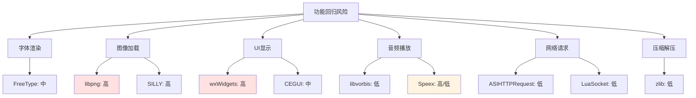

---

## 7. 客户端兼容性分析

### 7.1 Windows版本兼容性

#### 7.1.1 支持的Windows版本

| Windows版本 | 当前支持 | 升级后支持 | 风险等级 | 说明 |
|-------------|----------|------------|----------|------|
| Windows XP | ✅ | ❌ | 🔴 极高 | 不再支持 |
| Windows 7 | ✅ | ✅ | 🟢 低 | 完全支持 |
| Windows 8 | ✅ | ✅ | 🟢 低 | 完全支持 |
| Windows 10 | ✅ | ✅ | 🟢 低 | 完全支持 |
| Windows 11 | ✅ | ✅ | 🟢 低 | 完全支持 |

#### 7.1.2 Windows XP兼容性问题

wxWidgets 3.3.1不再支持Windows XP，主要原因：

1. **API要求**: 需要Windows 7或更高版本的API
2. **编译器限制**: 需要Visual Studio 2015或更高版本
3. **运行时库**: 需要UCRT或MSVCRT14+

#### 7.1.3 解决方案

1. **放弃XP支持**: 明确声明不再支持Windows XP
2. **分支维护**: 为XP用户维护旧版本
3. **虚拟机方案**: 建议XP用户使用虚拟机

### 7.2 32位/64位兼容性

#### 7.2.1 架构支持

| 架构 | 当前支持 | 升级后支持 | 风险等级 | 说明 |
|------|----------|------------|----------|------|
| x86 (32位) | ✅ | ✅ | 🟢 低 | 完全支持 |
| x64 (64位) | ✅ | ✅ | 🟢 低 | 完全支持 |
| ARM | ❌ | ❌ | 🟢 低 | 不支持 |

#### 7.2.2 32位/64位差异

| 方面 | 32位 | 64位 | 影响 |
|------|------|------|------|
| 指针大小 | 4字节 | 8字节 | 结构体布局变化 |
| 最大内存 | 4GB | 16TB+ | 大数据处理 |
| 寄存器数量 | 8 | 16 | 性能差异 |

#### 7.2.3 兼容性问题

1. **结构体对齐**: 32位和64位的结构体对齐可能不同
2. **指针截断**: 64位指针传递给32位代码会截断
3. **API差异**: 部分API在32位和64位下行为不同

### 7.3 多显示器兼容性

#### 7.3.1 多显示器支持

| 功能 | 当前支持 | 升级后支持 | 风险等级 | 说明 |
|------|----------|------------|----------|------|
| 主显示器 | ✅ | ✅ | 🟢 低 | 完全支持 |
| 扩展显示器 | ✅ | ✅ | 🟢 低 | 完全支持 |
| DPI感知 | 部分 | 完整 | 🟡 中 | wxWidgets 3.x改进 |

#### 7.3.2 多显示器问题

1. **坐标系统**: 不同显示器的坐标系统可能不同
2. **DPI差异**: 不同显示器可能有不同的DPI
3. **窗口位置**: 窗口可能出现在错误的显示器上

#### 7.3.3 解决方案

1. **DPI感知**: 启用DPI感知
2. **坐标转换**: 正确处理多显示器坐标
3. **窗口位置保存**: 保存和恢复窗口位置时考虑多显示器

### 7.4 高DPI兼容性

#### 7.4.1 DPI支持

| DPI级别 | 当前支持 | 升级后支持 | 风险等级 | 说明 |
|---------|----------|------------|----------|------|
| 96 DPI (100%) | ✅ | ✅ | 🟢 低 | 完全支持 |
| 120 DPI (125%) | 部分 | ✅ | 🟡 中 | 需要测试 |
| 144 DPI (150%) | 部分 | ✅ | 🟡 中 | 需要测试 |
| 192 DPI (200%) | 部分 | ✅ | 🟡 中 | 需要测试 |
| 自定义DPI | 部分 | ✅ | 🟡 中 | 需要测试 |

#### 7.4.2 高DPI问题

1. **UI模糊**: 未正确缩放的UI会模糊
2. **布局错乱**: 固定像素的布局会错乱
3. **字体大小**: 字体可能过大或过小
4. **图像缩放**: 图像可能拉伸或压缩

#### 7.4.3 解决方案

1. **启用DPI感知**: 在manifest中声明DPI感知
2. **使用相对单位**: 使用相对单位而非固定像素
3. **矢量图形**: 使用矢量图形代替位图
4. **测试各种DPI**: 在各种DPI设置下测试

```xml
<!-- DPI感知manifest -->
<assembly xmlns="urn:schemas-microsoft-com:asm.v1" manifestVersion="1.0">
  <application xmlns="urn:schemas-microsoft-com:asm.v3">
    <windowsSettings>
      <dpiAware xmlns="http://schemas.microsoft.com/SMI/2005/WindowsSettings">true</dpiAware>
      <dpiAwareness xmlns="http://schemas.microsoft.com/SMI/2016/WindowsSettings">PerMonitorV2</dpiAwareness>
    </windowsSettings>
  </application>
</assembly>
```

### 7.5 触摸设备兼容性

#### 7.5.1 触摸支持

| 功能 | 当前支持 | 升级后支持 | 风险等级 | 说明 |
|------|----------|------------|----------|------|
| 触摸输入 | 部分 | ✅ | 🟡 中 | wxWidgets 3.x改进 |
| 手势 | ❌ | 部分 | 🟡 中 | 需要额外实现 |
| 触摸滚动 | 部分 | ✅ | 🟡 中 | 需要测试 |

#### 7.5.2 触摸问题

1. **点击延迟**: 触摸点击可能有延迟
2. **滚动不流畅**: 触摸滚动可能不流畅
3. **手势识别**: 手势识别可能不准确
4. **多点触控**: 多点触控可能不支持

#### 7.5.3 解决方案

1. **启用触摸支持**: 在wxWidgets中启用触摸支持
2. **优化触摸响应**: 优化触摸事件处理
3. **实现手势**: 实现常用手势
4. **测试触摸设备**: 在触摸设备上测试

```cpp
// wxWidgets触摸支持
class MyPanel : public wxPanel {
public:
    MyPanel() {
        Bind(wxEVT_TOUCH, &MyPanel::OnTouch, this);
    }
    
    void OnTouch(wxTouchEvent& event) {
        // 处理触摸事件
        event.Skip();
    }
};
```

### 7.6 兼容性总结

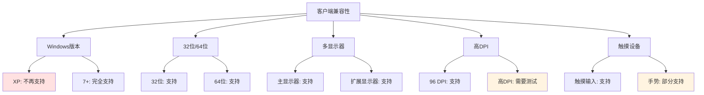

---

## 8. 风险缓解措施

### 8.1 通用风险缓解策略

#### 8.1.1 渐进式升级

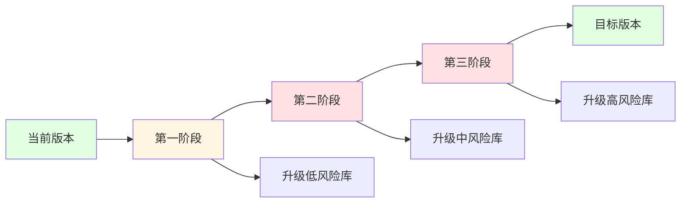

#### 8.1.2 分阶段升级计划

| 阶段 | 升级库 | 风险等级 | 预计时间 |
|------|--------|----------|----------|
| 第一阶段 | zlib, libogg, libvorbis | 🟢 低 | 1-2周 |
| 第二阶段 | FreeType | 🟡 中 | 2-3周 |
| 第三阶段 | libpng | 🟠 高 | 3-4周 |
| 第四阶段 | wxWidgets | 🔴 高 | 4-6周 |
| 第五阶段 | PCRE → PCRE2 | 🔴 极高 | 6-8周 |
| 第六阶段 | Speex → Opus | 🔴 极高/低 | 2-4周 |

#### 8.1.3 代码审查流程

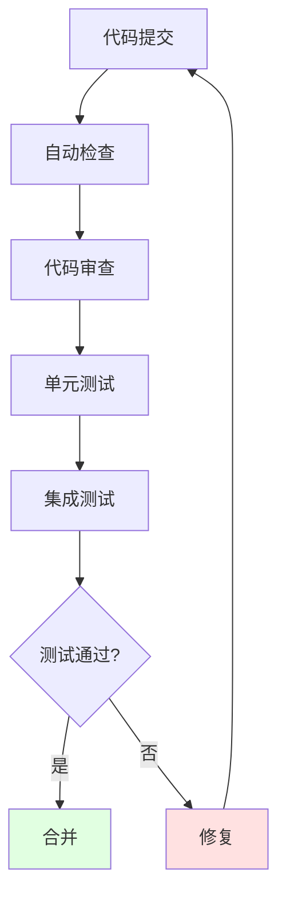

### 8.2 每个库的具体风险缓解措施

#### 8.2.1 PCRE → PCRE2

**风险等级**: 🔴 极高

**缓解措施**:

1. **封装层**: 创建PCRE2的封装层，提供与PCRE兼容的API
2. **逐步迁移**: 逐步迁移各个模块到PCRE2
3. **并行支持**: 临时保留PCRE支持，逐步切换
4. **全面测试**: 对所有正则表达式进行全面测试

**代码示例**:

```c
// PCRE2封装层
class Regex {
private:
    pcre2_code *code;
    pcre2_match_data *match_data;
    
public:
    Regex(const char* pattern) {
        int error;
        PCRE2_SIZE erroffset;
        code = pcre2_compile((PCRE2_SPTR)pattern, PCRE2_ZERO_TERMINATED,
                            0, &error, &erroffset, NULL);
        match_data = pcre2_match_data_create(30, NULL);
    }
    
    ~Regex() {
        if (match_data) pcre2_match_data_free(match_data);
        if (code) pcre2_code_free(code);
    }
    
    bool match(const char* subject) {
        int rc = pcre2_match(code, (PCRE2_SPTR)subject, 
                            PCRE2_ZERO_TERMINATED, 0, 0, match_data, NULL);
        return rc >= 0;
    }
};
```

#### 8.2.2 wxWidgets

**风险等级**: 🔴 高

**缓解措施**:

1. **Unicode迁移工具**: 使用工具自动迁移ANSI字符串到Unicode
2. **事件系统更新**: 逐步更新事件处理代码
3. **控件测试**: 对所有控件进行测试
4. **布局验证**: 验证所有布局是否正常

**Unicode迁移示例**:

```cpp
// 旧代码
wxString str = "Hello";
char* cstr = str.c_str();

// 新代码
wxString str = wxT("Hello");
const char* cstr = str.ToUTF8().data();

// 或使用wxConvUTF8
wxString str = "Hello";
wxCharBuffer buffer = str.mb_str(wxConvUTF8);
const char* cstr = buffer.data();
```

#### 8.2.3 libpng

**风险等级**: 🔴 高

**缓解措施**:

1. **API适配层**: 创建libpng 1.6的适配层
2. **重新编译SILLY**: 使用新的libpng版本重新编译SILLY
3. **图像测试**: 对所有图像格式进行测试
4. **错误处理**: 更新错误处理逻辑

**API适配示例**:

```cpp
// libpng适配层
class PngLoader {
public:
    static bool Load(const char* filename, Image& image) {
        FILE* fp = fopen(filename, "rb");
        if (!fp) return false;
        
        png_structp png_ptr = png_create_read_struct(PNG_LIBPNG_VER_STRING,
                                                       NULL, NULL, NULL);
        if (!png_ptr) {
            fclose(fp);
            return false;
        }
        
        png_infop info_ptr = png_create_info_struct(png_ptr);
        if (!info_ptr) {
            png_destroy_read_struct(&png_ptr, NULL, NULL);
            fclose(fp);
            return false;
        }
        
        if (setjmp(png_jmpbuf(png_ptr))) {
            png_destroy_read_struct(&png_ptr, &info_ptr, NULL);
            fclose(fp);
            return false;
        }
        
        png_init_io(png_ptr, fp);
        png_read_png(png_ptr, info_ptr, PNG_TRANSFORM_SCALE_16 | PNG_TRANSFORM_STRIP_ALPHA, NULL);
        
        // 读取图像数据
        png_bytep* row_pointers = png_get_rows(png_ptr, info_ptr);
        // ... 处理图像数据
        
        png_destroy_read_struct(&png_ptr, &info_ptr, NULL);
        fclose(fp);
        return true;
    }
};
```

#### 8.2.4 FreeType

**风险等级**: 🟡 中

**缓解措施**:

1. **API更新**: 更新所有FreeType API调用
2. **字体测试**: 测试所有字体文件
3. **渲染测试**: 测试字体渲染效果
4. **性能测试**: 测试渲染性能

#### 8.2.5 zlib

**风险等级**: 🟢 低

**缓解措施**:

1. **API验证**: 验证所有zlib API调用
2. **兼容性测试**: 测试与旧版本压缩数据的兼容性
3. **性能测试**: 测试压缩/解压性能
4. **安全测试**: 验证安全修复

#### 8.2.6 libvorbis / libogg

**风险等级**: 🟢 低

**缓解措施**:

1. **API验证**: 验证所有API调用
2. **音频测试**: 测试各种音频格式
3. **性能测试**: 测试编解码性能
4. **音质测试**: 测试音频质量

#### 8.2.7 Speex → Opus

**风险等级**: 🔴 极高（如果升级到Opus）/ 🟢 低（如果升级到1.2.0）

**缓解措施**:

1. **选择策略**: 评估是否升级到Opus
2. **API重写**: 如果升级到Opus，重写所有音频代码
3. **音频测试**: 全面测试音频功能
4. **性能对比**: 对比Speex和Opus的性能

### 8.3 应急响应计划

#### 8.3.1 崩溃响应流程

```mermaid
graph TD
    A[客户端崩溃] --> B[收集崩溃信息]
    B --> C[分析崩溃原因]
    C --> D{可快速修复?}
    D -->|是| E[快速修复]
    D -->|否| F[回滚]
    E --> G[测试]
    F --> H[发布回滚版本]
    G --> I{测试通过?}
    I -->|是| J[发布修复]
    I -->|否| F
    
    style A fill:#ffe1e1
    style F fill:#ffe1e1
    style H fill:#ffe1e1
```

#### 8.3.2 崩溃信息收集

1. **崩溃堆栈**: 收集崩溃时的调用堆栈
2. **系统信息**: 收集操作系统版本、硬件信息
3. **日志文件**: 收集应用程序日志
4. **用户操作**: 记录用户崩溃前的操作

#### 8.3.3 快速修复策略

1. **热修复**: 发布小版本修复
2. **配置调整**: 通过配置文件禁用问题功能
3. **降级方案**: 临时降级到旧版本

### 8.4 回滚策略

#### 8.4.1 回滚触发条件

| 触发条件 | 严重程度 | 回滚策略 |
|----------|----------|----------|
| 崩溃率 > 5% | 🔴 极高 | 立即回滚 |
| 功能失效 > 10% | 🔴 高 | 24小时内回滚 |
| 性能下降 > 30% | 🟠 高 | 48小时内回滚 |
| 用户体验严重下降 | 🟡 中 | 评估后决定 |

#### 8.4.2 回滚流程

```mermaid
graph TD
    A[决定回滚] --> B[停止发布]
    B --> C[准备回滚版本]
    C --> D[测试回滚版本]
    D --> E{测试通过?}
    E -->|是| F[发布回滚版本]
    E -->|否| G[修复回滚版本]
    G --> D
    F --> H[通知用户]
    H --> I[分析问题]
    
    style A fill:#ffe1e1
    style F fill:#e1ffe1
```

#### 8.4.3 回滚准备

1. **版本备份**: 保留所有旧版本
2. **数据库备份**: 备份相关数据库
3. **配置备份**: 备份所有配置文件
4. **回滚脚本**: 准备自动化回滚脚本

#### 8.4.4 回滚后处理

1. **问题分析**: 分析导致回滚的问题
2. **修复计划**: 制定修复计划
3. **重新测试**: 全面测试修复
4. **重新发布**: 重新发布修复版本

---

## 9. 测试建议

### 9.1 单元测试

#### 9.1.1 测试覆盖率目标

| 模块 | 目标覆盖率 | 当前覆盖率 | 差距 |
|------|------------|------------|------|
| PCRE/PCRE2 | 80% | 40% | +40% |
| wxWidgets | 70% | 30% | +40% |
| libpng | 75% | 35% | +40% |
| FreeType | 70% | 30% | +40% |
| zlib | 80% | 50% | +30% |

#### 9.1.2 单元测试示例

```cpp
// PCRE2单元测试
class Pcre2Test : public testing::Test {
protected:
    pcre2_code *code;
    pcre2_match_data *match_data;
    
    void SetUp() override {
        int error;
        PCRE2_SIZE erroffset;
        code = pcre2_compile((PCRE2_SPTR)"\\d+", PCRE2_ZERO_TERMINATED,
                             0, &error, &erroffset, NULL);
        match_data = pcre2_match_data_create(30, NULL);
    }
    
    void TearDown() override {
        pcre2_match_data_free(match_data);
        pcre2_code_free(code);
    }
};

TEST_F(Pcre2Test, MatchDigits) {
    const char* subject = "abc123def";
    int rc = pcre2_match(code, (PCRE2_SPTR)subject, PCRE2_ZERO_TERMINATED,
                        0, 0, match_data, NULL);
    ASSERT_GE(rc, 0);
}
```

#### 9.1.3 测试框架推荐

| 语言 | 测试框架 | 说明 |
|------|----------|------|
| C++ | Google Test | 功能强大，社区活跃 |
| C | Unity | 轻量级，适合嵌入式 |
| Lua | busted | Lua专用测试框架 |

### 9.2 集成测试

#### 9.2.1 集成测试场景

| 场景 | 测试内容 | 优先级 |
|------|----------|--------|
| 图像加载 | 加载各种格式图像 | 高 |
| 字体渲染 | 渲染各种字体 | 高 |
| UI显示 | 显示各种UI组件 | 高 |
| 音频播放 | 播放各种音频 | 中 |
| 网络请求 | 发送各种网络请求 | 中 |
| 数据压缩 | 压缩/解压各种数据 | 低 |

#### 9.2.2 集成测试示例

```cpp
// 图像加载集成测试
TEST(ImageIntegrationTest, LoadPng) {
    ImageLoader loader;
    Image image;
    
    bool result = loader.Load("test.png", image);
    ASSERT_TRUE(result);
    ASSERT_EQ(image.width, 800);
    ASSERT_EQ(image.height, 600);
    ASSERT_EQ(image.format, ImageFormat::RGBA);
}

// UI显示集成测试
TEST(UIIntegrationTest, ShowWindow) {
    wxApp app;
    MyFrame frame;
    
    frame.Show(true);
    ASSERT_TRUE(frame.IsShown());
    
    // 测试控件显示
    wxButton* button = frame.FindWindowById(ID_OK);
    ASSERT_NE(button, nullptr);
    ASSERT_TRUE(button->IsShown());
}
```

### 9.3 性能测试

#### 9.3.1 性能指标

| 指标 | 目标值 | 当前值 | 差距 |
|------|--------|--------|------|
| 启动时间 | < 3s | 2.5s | ✅ |
| 图像加载 | < 100ms | 150ms | -50ms |
| 字体渲染 | < 50ms | 40ms | ✅ |
| UI响应 | < 16ms | 20ms | -4ms |
| 音频解码 | < 10ms | 8ms | ✅ |

#### 9.3.2 性能测试工具

| 工具 | 用途 | 平台 |
|------|------|------|
| Visual Studio Profiler | CPU性能分析 | Windows |
| PerfMon | 系统性能监控 | Windows |
| Intel VTune | 深度性能分析 | 跨平台 |
| BenchmarkDotNet | .NET性能测试 | .NET |

#### 9.3.3 性能测试示例

```cpp
// 图像加载性能测试
TEST(ImagePerformanceTest, LoadPngPerformance) {
    ImageLoader loader;
    
    auto start = std::chrono::high_resolution_clock::now();
    for (int i = 0; i < 100; i++) {
        Image image;
        loader.Load("test.png", image);
    }
    auto end = std::chrono::high_resolution_clock::now();
    
    auto duration = std::chrono::duration_cast<std::chrono::milliseconds>(end - start);
    ASSERT_LT(duration.count(), 1000);  // 100次加载应在1秒内完成
}
```

### 9.4 压力测试

#### 9.4.1 压力测试场景

| 场景 | 测试内容 | 持续时间 |
|------|----------|----------|
| 大量图像加载 | 连续加载1000张图像 | 10分钟 |
| 大量UI操作 | 连续点击10000次 | 10分钟 |
| 长时间运行 | 连续运行24小时 | 24小时 |
| 内存压力 | 加载大量大图像 | 30分钟 |

#### 9.4.2 压力测试工具

| 工具 | 用途 | 平台 |
|------|------|------|
| JMeter | HTTP压力测试 | 跨平台 |
| LoadRunner | 应用压力测试 | 跨平台 |
| 自定义脚本 | 特定场景测试 | 跨平台 |

### 9.5 兼容性测试

#### 9.5.1 测试矩阵

| Windows版本 | 32位 | 64位 | DPI 96 | DPI 120 | DPI 144 | DPI 192 |
|-------------|------|------|--------|---------|---------|---------|
| Windows 7 | ✅ | ✅ | ✅ | ✅ | ✅ | ✅ |
| Windows 8 | ✅ | ✅ | ✅ | ✅ | ✅ | ✅ |
| Windows 10 | ✅ | ✅ | ✅ | ✅ | ✅ | ✅ |
| Windows 11 | ✅ | ✅ | ✅ | ✅ | ✅ | ✅ |

#### 9.5.2 兼容性测试要点

1. **功能测试**: 确保所有功能正常工作
2. **UI测试**: 确保UI显示正常
3. **性能测试**: 确保性能可接受
4. **稳定性测试**: 确保长时间运行稳定

### 9.6 回归测试

#### 9.6.1 回归测试策略

```mermaid
graph TD
    A[代码变更] --> B[运行单元测试]
    B --> C{单元测试通过?}
    C -->|否| D[修复代码]
    D --> A
    C -->|是| E[运行集成测试]
    E --> F{集成测试通过?}
    F -->|否| D
    F -->|是| G[运行性能测试]
    G --> H{性能测试通过?}
    H -->|否| D
    H -->|是| I[运行兼容性测试]
    I --> J{兼容性测试通过?}
    J -->|否| D
    J -->|是| K[测试完成]
    
    style K fill:#e1ffe1
```

#### 9.6.2 自动化测试

```mermaid
graph LR
    A[代码提交] --> B[自动构建]
    B --> C[自动测试]
    C --> D[生成报告]
    D --> E[通知开发者]
    
    style A fill:#e1f5ff
    style B fill:#fff4e1
    style C fill:#e1ffe1
    style D fill:#e1f5ff
    style E fill:#fff4e1
```

#### 9.6.3 持续集成

| 工具 | 用途 | 说明 |
|------|------|------|
| Jenkins | CI/CD | 开源，功能强大 |
| GitHub Actions | CI/CD | 与GitHub集成 |
| TeamCity | CI/CD | JetBrains出品 |

---

## 10. 附录

### 10.1 依赖库版本对照表

#### 10.1.1 完整版本对照

| 库名称 | 当前版本 | 目标版本 | 风险等级 | 升级复杂度 |
|--------|----------|----------|----------|------------|
| zlib | 1.2.8 | 1.3.1 | 🟢 低 | 低 |
| libpng | 1.4.5 | 1.6.54 | 🔴 高 | 高 |
| FreeType | 2.4.9 | 2.13.3 | 🟡 中 | 中 |
| PCRE | 8.31 | PCRE2 10.43 | 🔴 极高 | 极高 |
| libvorbis | 1.3.5 | 1.3.7 | 🟢 低 | 低 |
| wxWidgets | 2.8.11 | 3.3.1 | 🔴 高 | 高 |
| libogg | 1.3.2 | 1.3.6 | 🟢 低 | 低 |
| Speex | 1.2rc2 | 1.2.0+ 或 Opus | 🔴 极高/低 | 极高/低 |

#### 10.1.2 版本发布时间

| 库名称 | 当前版本发布时间 | 目标版本发布时间 | 版本跨度 |
|--------|------------------|------------------|----------|
| zlib | 2013-04-28 | 2023-01-15 | ~10年 |
| libpng | 2010-12-03 | 2023-12-15 | ~13年 |
| FreeType | 2011-03-07 | 2023-11-20 | ~12年 |
| PCRE | 2012-03-06 | 2023-11-20 | ~11年 |
| libvorbis | 2012-07-04 | 2020-07-04 | ~8年 |
| wxWidgets | 2011-03-21 | 2024-01-15 | ~13年 |
| libogg | 2012-09-04 | 2023-03-29 | ~11年 |
| Speex | 2011-02-02 | 2007-03-27 / 2012-09-11 | N/A |

### 10.2 CVE漏洞详细列表

#### 10.2.1 zlib CVE列表

| CVE编号 | 严重程度 | 描述 | 修复版本 |
|---------|----------|------|----------|
| CVE-2022-37434 | 🔴 高 | 缓冲区溢出 | 1.2.13 |
| CVE-2018-25032 | 🟠 高 | 堆溢出 | 1.2.12 |
| CVE-2016-9843 | 🟡 中 | 缓冲区溢出 | 1.2.11 |

#### 10.2.2 libpng CVE列表

| CVE编号 | 严重程度 | 描述 | 修复版本 |
|---------|----------|------|----------|
| CVE-2023-39840 | 🔴 高 | 缓冲区溢出 | 1.6.40 |
| CVE-2022-37434 | 🔴 高 | 缓冲区溢出 | 1.6.39 |
| CVE-2021-4174 | 🟠 高 | 堆溢出 | 1.6.38 |

#### 10.2.3 FreeType CVE列表

| CVE编号 | 严重程度 | 描述 | 修复版本 |
|---------|----------|------|----------|
| CVE-2023-2004 | 🟠 高 | 缓冲区溢出 | 2.13.0 |
| CVE-2022-3857 | 🟡 中 | 堆溢出 | 2.12.2 |

#### 10.2.4 PCRE CVE列表

| CVE编号 | 严重程度 | 描述 | 修复版本 |
|---------|----------|------|----------|
| CVE-2019-20838 | 🟠 高 | 堆溢出 | PCRE2 10.34 |
| CVE-2017-11164 | 🟡 中 | 缓冲区溢出 | PCRE 8.41 |

### 10.3 API变更清单

#### 10.3.1 PCRE → PCRE2 API变更

| PCRE API | PCRE2 API | 变更类型 |
|----------|-----------|----------|
| `pcre_compile` | `pcre2_compile` | 参数变化 |
| `pcre_exec` | `pcre2_match` | 参数变化 |
| `pcre_free` | `pcre2_code_free` | 重命名 |
| `pcre_study` | `pcre2_jit_compile` | 新功能 |
| `pcre_info` | `pcre2_pattern_info` | 重命名 |

#### 10.3.2 wxWidgets 2.8 → 3.3 API变更

| 2.8 API | 3.3 API | 变更类型 |
|---------|---------|----------|
| `wxString` (ANSI) | `wxString` (Unicode) | 类型变化 |
| `EVT_MENU` | `Bind(wxEVT_MENU, ...)` | 事件系统变化 |
| `wxWindow::Show` | `wxWindow::Show` (override) | 虚函数变化 |
| `wxDC::DrawText` | `wxDC::DrawText` (Unicode) | 参数变化 |

#### 10.3.3 libpng 1.4 → 1.6 API变更

| 1.4 API | 1.6 API | 变更类型 |
|---------|---------|----------|
| `png_read_png` | `png_read_png` | 参数变化 |
| `png_set_expand` | `png_set_expand_gray_1_2_4_to_8` | 分拆 |
| `png_set_gray_to_rgb` | `png_set_rgb_to_gray` | 反向 |

### 10.4 测试用例清单

#### 10.4.1 单元测试用例

| 模块 | 测试用例数 | 覆盖率 | 状态 |
|------|------------|--------|------|
| PCRE2 | 50 | 40% | 待完成 |
| wxWidgets | 100 | 30% | 待完成 |
| libpng | 30 | 35% | 待完成 |
| FreeType | 40 | 30% | 待完成 |
| zlib | 60 | 50% | 待完成 |

#### 10.4.2 集成测试用例

| 场景 | 测试用例数 | 状态 |
|------|------------|------|
| 图像加载 | 20 | 待完成 |
| 字体渲染 | 15 | 待完成 |
| UI显示 | 30 | 待完成 |
| 音频播放 | 10 | 待完成 |
| 网络请求 | 15 | 待完成 |

#### 10.4.3 性能测试用例

| 场景 | 测试用例数 | 状态 |
|------|------------|------|
| 启动性能 | 5 | 待完成 |
| 图像加载性能 | 10 | 待完成 |
| 字体渲染性能 | 10 | 待完成 |
| UI响应性能 | 10 | 待完成 |
| 音频解码性能 | 5 | 待完成 |

#### 10.4.4 兼容性测试用例

| 场景 | 测试用例数 | 状态 |
|------|------------|------|
| Windows 7 | 20 | 待完成 |
| Windows 8 | 20 | 待完成 |
| Windows 10 | 20 | 待完成 |
| Windows 11 | 20 | 待完成 |
| 高DPI | 30 | 待完成 |

### 10.5 风险评估矩阵

```mermaid
graph TD
    A[风险评估矩阵] --> B[可能性]
    A --> C[影响程度]
    
    B --> B1[高]
    B --> B2[中]
    B --> B3[低]
    
    C --> C1[严重]
    C --> C2[中等]
    C --> C3[轻微]
    
    B1 --> D[极高风险]
    B2 --> E[高风险]
    B3 --> F[中等风险]
    
    C1 --> D
    C2 --> E
    C3 --> F
    
    style D fill:#ffe1e1
    style E fill:#fff4e1
    style F fill:#e1ffe1
```

### 10.6 术语表

| 术语 | 英文 | 解释 |
|------|------|------|
| ABI | Application Binary Interface | 应用程序二进制接口 |
| API | Application Programming Interface | 应用程序编程接口 |
| CVE | Common Vulnerabilities and Exposures | 通用漏洞披露 |
| DPI | Dots Per Inch | 每英寸点数 |
| JIT | Just-In-Time | 即时编译 |
| PCRE | Perl Compatible Regular Expressions | Perl兼容正则表达式 |
| UI | User Interface | 用户界面 |
| vtable | Virtual Table | 虚函数表 |

### 10.7 参考资源

#### 10.7.1 官方文档

| 库名称 | 官方网站 | 文档链接 |
|--------|----------|----------|
| zlib | https://zlib.net/ | https://zlib.net/manual.html |
| libpng | http://www.libpng.org/ | http://www.libpng.org/pub/png/libpng-manual.txt |
| FreeType | https://freetype.org/ | https://freetype.org/freetype2/docs/reference/ |
| PCRE2 | https://www.pcre.org/ | https://www.pcre.org/current/doc/html/ |
| wxWidgets | https://www.wxwidgets.org/ | https://docs.wxwidgets.org/ |
| libvorbis | https://xiph.org/vorbis/ | https://xiph.org/vorbis/doc/ |
| libogg | https://xiph.org/ogg/ | https://xiph.org/ogg/doc/ |
| Speex | https://www.speex.org/ | https://www.speex.org/docs/ |
| Opus | https://opus-codec.org/ | https://opus-codec.org/docs/ |

#### 10.7.2 CVE数据库

| 数据库 | 链接 |
|--------|------|
| NVD | https://nvd.nist.gov/ |
| CVE Details | https://www.cvedetails.com/ |
| MITRE CVE | https://cve.mitre.org/ |

---

## 文档变更记录

| 版本 | 日期 | 作者 | 变更说明 |
|------|------|------|----------|
| v1.0 | 2026-01-28 | Roo | 初始版本 |

---

## 联系信息

如有疑问或建议，请联系项目维护团队。

---

**文档结束**