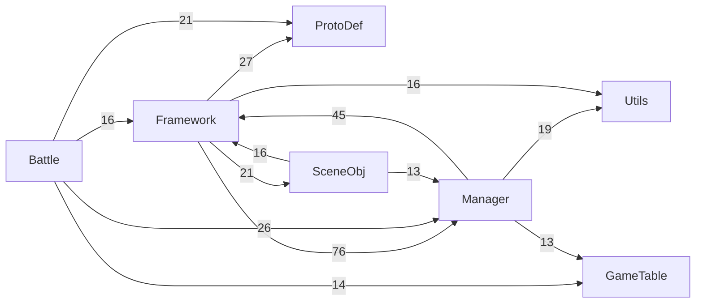
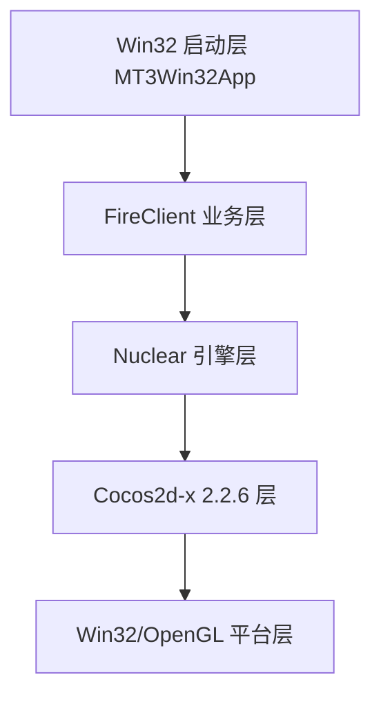

# MT3 Win32 客户端全量扫描与构建架构报告（2026-03-03）

> **状态**: 历史快照
> **适用日期**: 2026-03-03
> **当前基线**:
> - `docs/01-快速入门/01-快速启动指南.md`
> - `docs/03-开发指南/06-编译完整指南.md`
> - `docs/03-开发指南/08-编译流程分析.md`
>
> 说明：本文是 2026-03-03 当天的扫描与构建截面，不作为当前 Win32 构建入口文档。
> 2026-07-03 补充：当前 Cocos2d-x 主线已切换到 `cocos2d-x-2.2.6`，Win32 构建入口以 `tools/scripts/Build-MT3-Exe-Canonical.ps1` 为准；旧 2.0/FMOD 手工命令仅按历史背景阅读。

## 0. 基线与范围
- 扫描对象：`E:\MT3\client\MT3Win32App`（已确认恢复到初始状态）。
- 分析范围：Win32 启动工程 + FireClient 业务层 + CEGUI/CocosDenshion 依赖链 + Debug 构建链路。
- 产物目录：`E:\MT3\docs\generated\mt3win32app`。

## 1. 代码库全景清单
### 1.1 MT3Win32App 目录递归清单（文件类型/大小/时间/依赖）
- 受版本控制文件总数：`20`
- 总体积：`365,635 bytes`（约 `0.35 MB`）
- 扩展名统计：

| 扩展名 | 数量 | 大小(bytes) |
|---|---:|---:|
| `.vcxproj` | 3 | 57,914 |
| `.filters` | 3 | 35,539 |
| `.cpp` | 4 | 23,459 |
| `.h` | 6 | 2,173 |
| `.ico` | 2 | 241,596 |
| `.rc` | 1 | 3,346 |
| `.aps` | 1 | 1,608 |

- 逐文件清单（类型、大小、修改时间、include 依赖）见：
  - `docs/generated/mt3win32app/file_inventory.csv`
  - `docs/generated/mt3win32app/include_edges.csv`

### 1.2 主入口与关键文件识别
- 主入口：`client/MT3Win32App/main.cpp` 中 `_tWinMain`（行 47）。
- 启动主流程：`_tWinMain -> gRunGameApplication()`（`main.cpp` 行 159）。
- 引擎运行入口：`client/FireClient/Application/Framework/GameApplication.cpp` 中 `gRunGameApplication()`（行 2715）。
- 崩溃转储：`client/MT3Win32App/CrashDump.cpp`（`SetUnhandledExceptionFilter` + minidump）。
- 图标资源：`client/MT3Win32App/mt3.rc`（`IDI_ICON1=mt3.ico`，`IDI_ICON2=mt3_free.ico`）。

### 1.3 FireClient 模块划分（来自工程编译项）
`FireClient.win32.vcxproj` 编译源文件数：`101`

| 模块 | 源文件数 |
|---|---:|
| Framework | 30 |
| Manager | 19 |
| Battle | 13 |
| SceneObj | 11 |
| Utils | 6 |
| oggenc | 6 |
| Amr | 4 |
| GameUI | 4 |
| platform | 3 |
| ExternalNetworkExtension | 2 |
| ProtoDef | 1 |
| GameTable | 1 |
| Other | 1 |

详情见：
- `docs/generated/mt3win32app/fireclient_module_summary.csv`
- `docs/generated/mt3win32app/fireclient_module_files.csv`

### 1.4 模块依赖图（按 include 关系聚合）
来自 `fireclient_module_edges.csv` 的主要跨模块边（Top）：
- `Framework -> Manager (76)`
- `Manager -> Framework (45)`
- `Framework -> ProtoDef (27)`
- `Battle -> Manager (26)`
- `Framework -> SceneObj (21)`



### 1.5 客户端资源与服务端协议对齐检查
- CEGUI 资源目录存在性：
  - `client/resource/res/ui/{schemes,imagesets,fonts,layouts,looknfeel,animations,xml_schemas}` 均存在。
- `taharezlook.scheme` 引用检查：
  - Imageset：`97/97` 存在。
  - Font：`78/78` 存在。
  - LookNFeel：`1/1` 存在。
- 协议对齐（客户端 vs 服务器）：
  - 客户端注册协议（`rpcgen.cpp`）：`34` 条。
  - 服务器 `game_server/protocols + localprotocols` 解析协议：`1178` 条。
  - 客户端 `34` 条协议在服务器端定义中全部可匹配（未发现缺失）。

## 2. 编译环境完整配置清单
### 2.1 IDE / SDK / 工具链（本机实测）
| 项 | 版本/路径 |
|---|---|
| Visual C++ 编译器 | `18.00.30723`（VS2013 v120） |
| `cl.exe` | `D:\Program Files (x86)\Microsoft Visual Studio 12.0\VC\bin\cl.exe` |
| MSBuild | `12.0.30723.0` |
| `MSBuild.exe` | `C:\Program Files (x86)\MSBuild\12.0\Bin\MSBuild.exe` |
| Windows SDK | `8.1`（`C:\Program Files (x86)\Windows Kits\8.1\`） |
| CMake | `3.6.0-rc1` |
| Python | `2.7.18`（`C:\Python27\python.exe`） |
| Java | `1.8.0_144` |
| Ant | `1.9.7` |

关键环境变量（当前）：
- `VS120COMNTOOLS=D:\Program Files (x86)\Microsoft Visual Studio 12.0\Common7\Tools\`
- `JAVA_HOME=C:\Program Files\Java\jdk1.8.0_144`
- `NDK_ROOT=D:\Android\android-ndk-r10e`
- `ANT_HOME=D:\apache-ant-1.9.7`

### 2.2 vcxproj 关键配置
- 工具集：`PlatformToolset=v120`
- 目标平台：`Win32`
- Debug 运行库：`MultiThreadedDebugDLL (/MDd)`
- Release 运行库：`MultiThreadedDLL (/MD)`
- 预处理宏（MT3 Debug）：
  - `WIN32;WIN7_32;_DEBUG;_WINDOWS;COCOS2D_DEBUG=1;CEGUI_STATIC;GLEW_STATIC;XPP_WIN;CC_SUPPORT_PVRTC;PUBLISHED_VERSION`
- 关键链接库（MT3 Debug）：
  - `libcocos2d.lib; libCocosDenshion.lib; engine.lib; FireClient.lib; cegui.lib; pcre.lib; silly.lib; libcurl_imp.lib; pthreadVCE2.lib; ...`

配置导出见：`docs/generated/mt3win32app/build_config_summary.csv` 与 `project_configs.json`。

### 2.3 构建系统与输出目录
- `MT3Win32App` 目录未发现 `CMakeLists.txt/Makefile`，主构建系统为 `.vcxproj + MSBuild`。
- 输出约定（`mt3.win32.vcxproj`）：
  - 中间目录：`client/MT3Win32App/Debug.win32\`
  - 可执行：`client/MT3Win32App/Debug.win32/MT3.exe`
  - 复制目标：`client/resource/bin/Debug/`

### 2.4 外部依赖与版本（Win32 客户端）
| 组件 | 版本/形态 | 路径（示例） |
|---|---|---|
| Cocos2d-x | `2.2.6` | `cocos2d-x-2.2.6/` |
| CEGUI | `0.7.1`（源码在 tools，编译依赖在 dependencies） | `tools/CEGUI-0.7.1/`, `dependencies/cegui/` |
| FMOD Ex | 历史调试残留 | 当前 Cocos2d-x 2.2.6 Win32 主线不再要求 `-FmodDll` 前置 |
| libcurl | `7.21.4`（DLL 文件版本） | `client/resource/bin/Debug/libcurl.dll` |
| zlib | `1.2.5`（DLL 文件版本） | `client/resource/bin/Debug/zlib1.dll` |
| pthreadVC2 | `2.8.0.0`（DLL 文件版本） | `client/resource/bin/Debug/pthreadVCE2.dll` |
| Lua | 5.1 系列（由当前 `liblua` 工程链接） | `cocos2d-x-2.2.6/scripting/lua/` |
| OpenGL/ANGLE | `glew32/libEGL/libGLESv2` | `dependencies/opengles_v2`, `cocos2d-x-2.2.6/cocos2dx/platform/third_party` |

备注：
- Qt/Boost/OpenSSL 在本 Win32 客户端构建链路中未发现直接必需项（当前工程配置未引用）。

## 3. 关键架构说明
### 3.1 分层设计


### 3.2 线程模型
- 主线程：Win32 + 引擎主循环（`pEngine->Run(ep)`）。
- 异步 IO：`ep.bAsyncRead = true`。
- 网络线程：`FireNet::GetNetSystem()->Startup()` 管理（由网络模块内部线程实现）。
- 语音线程：`pthread` / `std::thread`（平台条件编译）在 `GameApplication.cpp` 可见。

### 3.3 消息与协议机制
- 客户端协议注册：
  - `InitNetModule(): ProtoDef::RegisterProtocols()`
  - `CleanupNetModule(): ProtoDef::UnregisterProtocols()`
- 协议存根由 `rpcgen` 生成（`rpcgen.cpp` 头部注明 `GENERATE BY RPCGEN`）。

### 3.4 UI 层与 CEGUI 关系
- UI 系统初始化入口：`GameUImanager::InitGameUI()`
- 初始化流程：
  - `CEGUI::System::create(...)`
  - `initialiseResourceGroupDirectories()`
  - `initialiseDefaultResourceGroups()`
  - `SchemeManager::create("taharezlook.scheme")`
- `PUBLISHED_VERSION` 下使用 `PFSResourceProvider`，资源组映射为 `/ui/...`。

### 3.5 关键扩展点
- Lua 扩展：`LuaScriptModule`, `CCScriptEngineManager`。
- 协议扩展：`ProtoDef` 生成代码与 `AddStub` 注册机制。
- UI 扩展：CEGUI `WindowSet`, `LookNFeel`, `Animation` 资源配置。

## 4. 可重现编译步骤（从零到 MT3.exe）
### 4.1 环境准备
1. 安装 VS2013（必须含 v120）与 Windows SDK 8.1。
2. 确认：
   - `VS120COMNTOOLS` 可用
   - `MSBuild 12.0` 可执行
3. 确认第三方依赖路径完整（尤其 CEGUI、Cocos2d-x 2.2.6 运行库和 VS2013/v120 依赖）。

### 4.2 命令步骤（Win32 Debug）
```bat
:: 1) 初始化编译环境
call "D:\Program Files (x86)\Microsoft Visual Studio 12.0\VC\vcvarsall.bat" x86

:: 2) 使用当前 canonical 构建入口构建 MT3 主程序
powershell -NoProfile -ExecutionPolicy Bypass -File "E:\MT3\tools\scripts\Build-MT3-Exe-Canonical.ps1" ^
  -Configuration Debug -Platform Win32 -FastLocal -MaxParallelJobs 8
```

### 4.3 验证标准
- 产物存在：`client/resource/bin/Debug/MT3.exe`
- 运行库与链接输入由 `Build-MT3-Exe-Canonical.ps1` 和 `Ensure-MT3-Win32-LinkDeps.ps1` 校验；`fmodex.dll` 不再作为当前 Cocos2d-x 2.2.6 Win32 主线前置依赖
- 启动不出现：
  - `Run-Time Check Failure #0 (ESP not saved)`
  - `Debug Assertion Failed (_BLOCK_TYPE_IS_VALID)`
  - `CEGUI::InvalidRequestException`

### 4.4 本次实测构建结果（2026-03-03）
- 已成功：`CocosDenshion.win32.vcxproj` / `engine.win32.vcxproj` / `FireClient.win32.vcxproj` Debug 构建通过。
- 已成功：`mt3.win32.vcxproj` 在 `PostBuildEventUseInBuild=false` 条件下构建通过，产物：
  - `client/MT3Win32App/Debug.win32/MT3.exe`
- 阻塞项仅剩后置拷贝（`xcopy` 到 `client/resource/bin/Debug`）共享冲突：
  - `MSB3073`，退出码 `4`（目标目录中的 `MT3.exe` / `libCocosDenshion.dll` 被占用）。

结论：核心编译链路已恢复，当前问题从“链接失败”收敛为“部署目录文件占用”。

### 4.5 运行验证（目录占用绕过）
- 由于 `client/resource/bin/debug` 目录存在常驻占用，新增验证目录：
  - `client/resource/bin/debug_20260303`
- 目录内容来源：
  1. 先完整复制 `client/resource/bin/debug` 运行时依赖；
  2. 再覆盖新编译产物 `MT3.exe` 与 `libCocosDenshion.dll`。
- 实测启动验证：
  - `debug_20260303/MT3.exe` 可持续运行（8 秒观察窗口内未出现闪退/断言弹窗）。
  - 启动日志推进到 `OnInit step4` 与 `GameConfigManager::ApplyConfig` 阶段。

### 4.6 已完成的潜在问题修复（源码级）
- `client/MT3Win32App/main.cpp`
  - 修复 `new[]` 与 `delete` 不匹配（改为 `delete[]`），避免 CRT 堆破坏断言。
- `cocos2d-2.0-rc2-x-2.0.1/CocosDenshion/win32/FmodAudioPlayer.cpp`
  - 将桥接函数中 `FMOD_System_Create` 函数指针调用约定调整为 `__cdecl`，对应 `fmodex_vc.lib` 实际符号修饰，消除 `ESP` 检查失败风险。

## 5. 当前问题颗粒度排查结论
### 5.1 启动闪退链路
- `audio_startup_trace.log` 显示 FMOD 初始化流程可达（系统创建、init、channel group 均成功）。
- `CEGUI_ct.log` 显示 `taharezlook.scheme` 解析阶段报错：
  - `LJXMLParser: failed to decode XML bytes`
  - 说明问题更偏向“资源读取字节流/解码链”而非资源文件缺失。

### 5.2 图标问题核实
- `mt3.rc` 已声明 `IDI_ICON1/IDI_ICON2`。
- `MT3.exe` 已检测到关联图标（非“无图标”二进制）。

### 5.3 依赖一致性核心矛盾
- 已完成对齐：
  - Debug 链接改为 `cegui_d.lib`。
  - Debug 显式补齐 `fmodex_vc.lib`。
  - `engine` 与 `libCocosDenshion` 的符号归属冲突已消除（`setEffectEnable`/`FmodAudioPlayer` 相关）。
  - `AdditionalLibraryDirectories` 调整为优先命中 `../../engine/$(Configuration).win32`，避免旧库遮蔽。
- 当前剩余问题：
  - 仅 `resource/bin/debug` 目录中文件被占用导致 PostBuild 复制失败，不影响 `MT3Win32App/Debug.win32/MT3.exe` 生成与运行验证。

## 6. 附件索引（本次自动生成）
- `docs/generated/mt3win32app/extension_summary.csv`
- `docs/generated/mt3win32app/file_inventory.csv`
- `docs/generated/mt3win32app/include_edges.csv`
- `docs/generated/mt3win32app/fireclient_module_summary.csv`
- `docs/generated/mt3win32app/fireclient_module_files.csv`
- `docs/generated/mt3win32app/fireclient_module_edges.csv`
- `docs/generated/mt3win32app/build_config_summary.csv`
- `docs/generated/mt3win32app/mt3_debug_link_libraries.csv`
- `docs/generated/mt3win32app/project_configs.json`
