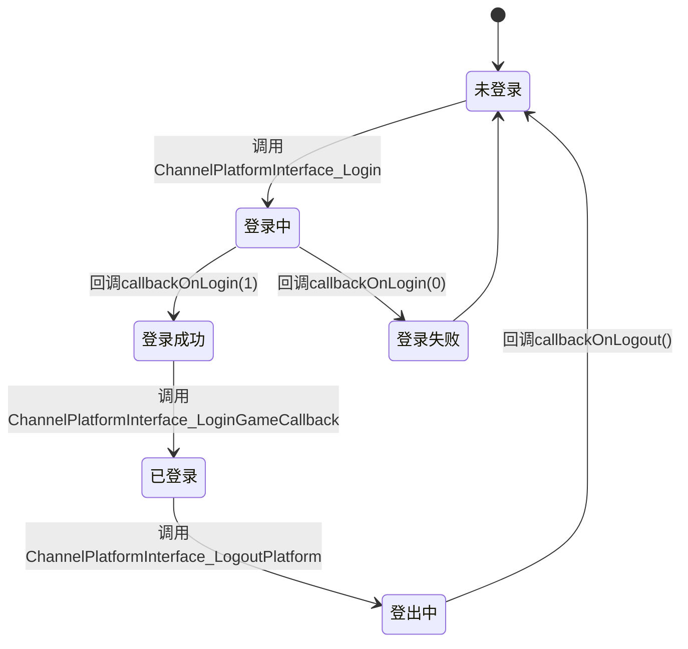
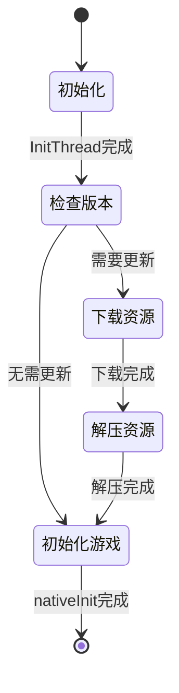
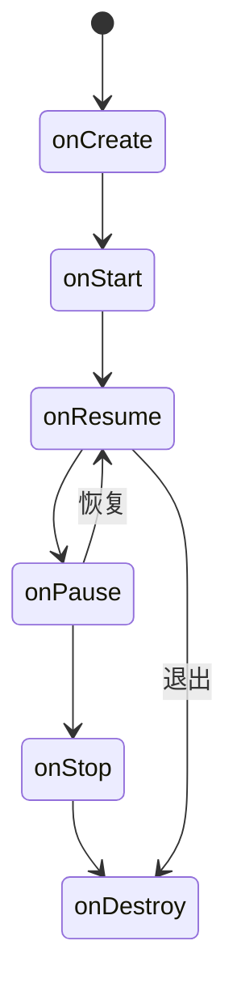
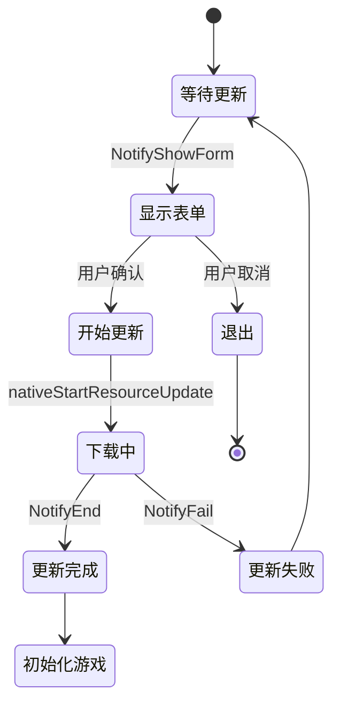
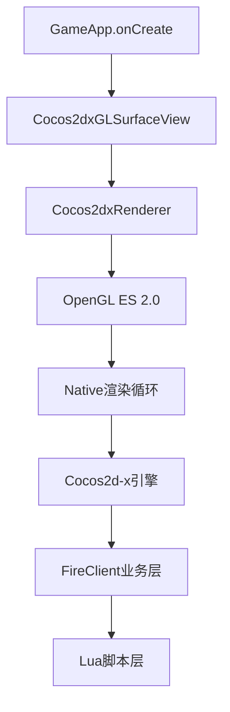
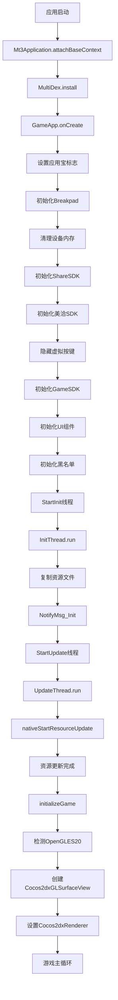
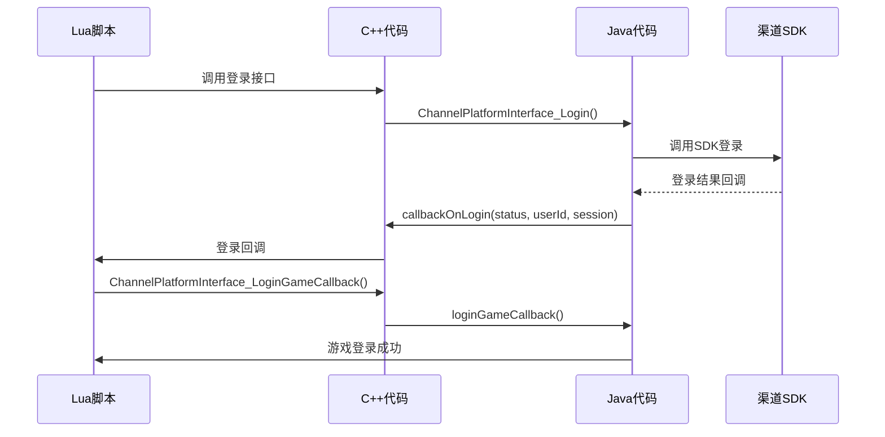
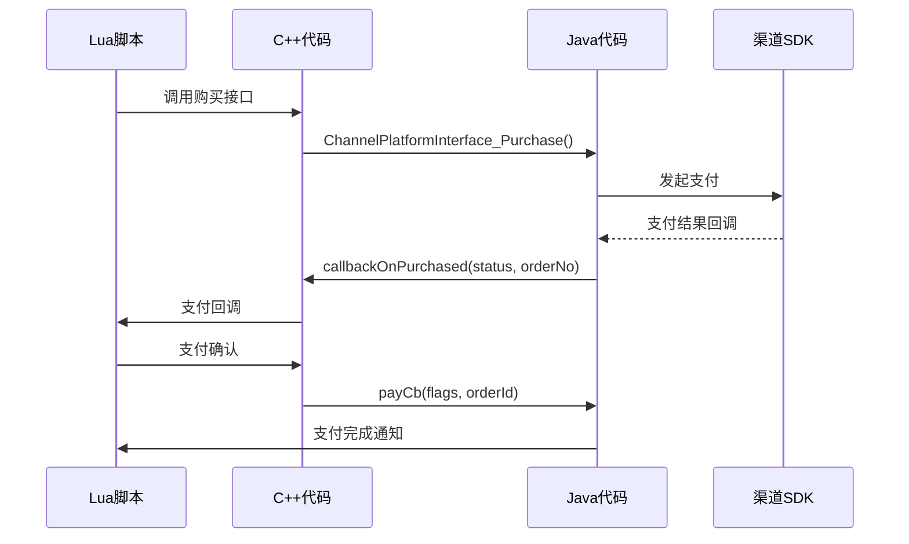
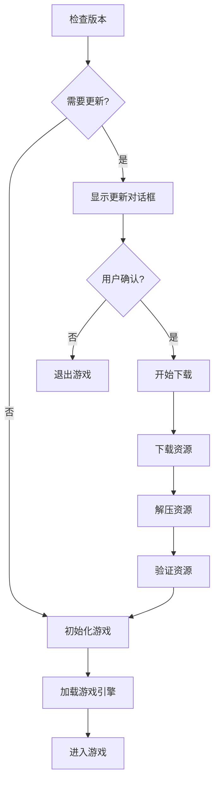
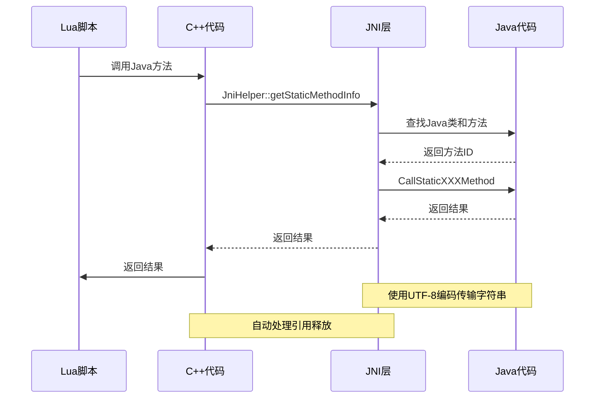

# Android客户端深度审计报告

> **状态**: 历史快照
> **适用日期**: 2026-03-05 审计批次
> **当前基线**:
> - [MT3 文档中心](../../README.md)
> - [13-文档索引](../../07-参考文档/02-文档索引.md)
> - [项目架构](../../02-技术架构/02-项目架构.md)
> **说明**: 本文为 Android 客户端阶段性深度审计报告，作为证据材料保留，不直接替代当前平台基线文档。


> **版本**: 1.0.0
> **审计日期**: 2026-03-05
> **审计范围**: `client/android/` 全量源代码
> **审计目标**: 构建与代码实现绝对零偏差的技术文档

---

## 目录

1. [源代码结构分析](#1-源代码结构分析)
2. [API接口契约](#2-api接口契约)
3. [数据传输模型](#3-数据传输模型)
4. [核心业务状态机](#4-核心业务状态机)
5. [UI交互逻辑](#5-ui交互逻辑)
6. [多环境配置](#6-多环境配置)
7. [异常捕获机制](#7-异常捕获机制)
8. [代码流转图](#8-代码流转图)
9. [发现的问题清单](#9-发现的问题清单)
10. [技术文档修订建议](#10-技术文档修订建议)

---

## 1. 源代码结构分析

### 1.1 项目结构概览

```
client/android/
├── common/                    # 公共代码库
│   ├── src/
│   │   ├── com/locojoy/mini/mt3/    # 游戏主逻辑
│   │   ├── com/locojoy/sdk/          # SDK接口层
│   │   └── org/cocos2dx/lib/         # Cocos2d-x桥接层
│   ├── jni/
│   │   ├── main.cpp                   # JNI主入口
│   │   ├── Android.mk                 # NDK构建配置
│   │   └── Application.mk             # NDK应用配置
│   ├── assets/                       # 资源文件
│   ├── res/                          # Android资源
│   ├── AndroidManifest.xml            # 应用清单
│   ├── build.xml                    # Ant构建脚本
│   └── ant.properties                # Ant属性配置
│
├── LocojoyProject/              # 乐游渠道包
│   ├── src/
│   ├── jni/
│   ├── libs/
│   └── AndroidManifest.xml
│
├── JoysdkProject/               # JoySDK渠道包
│   ├── src/
│   ├── jni/
│   ├── libs/
│   └── AndroidManifest.xml
│
├── YijieProject/                # 易接渠道包
│   ├── src/
│   ├── jni/
│   ├── libs/
│   └── AndroidManifest.xml
│
└── LocojoyProject64/            # 乐游64位渠道包
    ├── src/
    ├── jni/
    ├── libs/
    └── AndroidManifest.xml
```

### 1.2 渠道包对比

| 渠道 | 包名 | 版本码 | 特殊配置 |
|------|------|--------|----------|
| **Locojoy** | com.locojoy.mini.mt3.locojoy | 1 | 乐游原生渠道 |
| **Joysdk** | com.locojoy.mini.mt3.joysdk | 101 | JoySDK渠道 |
| **Yijie** | com.locojoy.wojmt3.yj | 101 | 易接渠道，包含SplashActivity |
| **Locojoy64** | com.locojoy.mini.mt3.locojoy64 | - | 64位架构支持 |

### 1.3 核心Java类

| 类名 | 文件路径 | 功能描述 |
|------|----------|----------|
| [`Mt3Application`](../../../client/android/common/src/com/locojoy/mini/mt3/Mt3Application.java) | common/src/com/locojoy/mini/mt3/ | Application入口，处理MultiDex |
| [`GameApp`](../../../client/android/common/src/com/locojoy/mini/mt3/GameApp.java) | common/src/com/locojoy/mini/mt3/ | 主Activity，游戏核心逻辑 |
| [`GameSDK`](../../../client/android/common/src/com/locojoy/sdk/GameSDK.java) | common/src/com/locojoy/sdk/ | SDK统一接口层 |
| [`Cocos2dxActivity`](../../../client/android/common/src/org/cocos2dx/lib/Cocos2dxActivity.java) | common/src/org/cocos2dx/lib/ | Cocos2d-x Activity基类 |
| [`Cocos2dxLuaJavaBridge`](../../../client/android/common/src/org/cocos2dx/lib/Cocos2dxLuaJavaBridge.java) | common/src/org/cocos2dx/lib/ | Lua-Java桥接 |

---

## 2. API接口契约

### 2.1 JNI接口定义

#### 2.1.1 C++ → Java 接口

**文件**: [`client/android/common/jni/main.cpp`](../../../client/android/common/jni/main.cpp)

| 函数名 | Java类 | 方法签名 | 功能 |
|---------|----------|-----------|------|
| `ChannelPlatformInterface_IsLogined` | JniProxy | `()Z` | 检查是否已登录 |
| `ChannelPlatformInterface_IsGuest` | JniProxy | `()Z` | 检查是否为游客 |
| `ChannelPlatformInterface_Login` | JniProxy | `()V` | 触发登录 |
| `ChannelPlatformInterface_GetSessionId` | JniProxy | `()Ljava/lang/String;` | 获取会话ID |
| `ChannelPlatformInterface_GuestRegister` | JniProxy | `()V` | 游客注册 |
| `ChannelPlatformInterface_GetUserName` | JniProxy | `()Ljava/lang/String;` | 获取用户名 |
| `ChannelPlatformInterface_GetUserID` | JniProxy | `()Ljava/lang/String;` | 获取用户ID |
| `ChannelPlatformInterface_ChangeAccount` | JniProxy | `()V` | 切换账号 |
| `ChannelPlatformInterface_GetPlatformID` | JniProxy | `()Ljava/lang/String;` | 获取平台ID |
| `ChannelPlatformInterface_Purchase` | JniProxy | `(Ljava/lang/String;ILjava/lang/String;IFILjava/lang/String;Ljava/lang/String;Ljava/lang/String;Ljava/lang/String;Ljava/lang/String;)V` | 发起购买 |
| `ChannelPlatformInterface_EnterPlatformCenter` | JniProxy | `()V` | 进入平台中心 |
| `ChannelPlatformInterface_EnterPlatformForum` | JniProxy | `()V` | 进入平台论坛 |
| `ChannelPlatformInterface_EnterPlatformFeedback` | JniProxy | `()V` | 进入平台反馈 |
| `ChannelPlatformInterface_HasPlatformCenter` | JniProxy | `()Z` | 是否有平台中心 |
| `ChannelPlatformInterface_HasPlatformForum` | JniProxy | `()Z` | 是否有平台论坛 |
| `ChannelPlatformInterface_HasFeedback` | JniProxy | `()Z` | 是否有反馈功能 |
| `ChannelPlatformInterface_GetPlatformCenterName` | JniProxy | `()Ljava/lang/String;` | 获取平台中心名称 |
| `ChannelPlatformInterface_GetPlatformForumName` | JniProxy | `()Ljava/lang/String;` | 获取平台论坛名称 |
| `ChannelPlatformInterface_GetPlatformFeedbackName` | JniProxy | `()Ljava/lang/String;` | 获取平台反馈名称 |
| `ChannelPlatformInterface_SetValues` | JniProxy | `(Ljava/lang/String;)V` | 设置值 |
| `ChannelPlatformInterface_LogoutPlatform` | JniProxy | `()V` | 平台登出 |
| `ChannelPlatformInterface_LoginGameCallback` | JniProxy | `()V` | 游戏登录回调 |
| `ChannelPlatformInterface_SupportFeature` | JniProxy | `(I)Z` | 是否支持功能 |
| `ChannelPlatformInterface_GetPlatformName` | JniProxy | `()I` | 获取平台名称 |
| `ChannelPlatformInterface_GameResLoadError` | GameResLoadErrorHandle | `()V` | 资源加载错误 |

#### 2.1.2 Java → C++ 接口

**文件**: [`client/android/common/src/com/locojoy/mini/mt3/GameApp.java`](../../../client/android/common/src/com/locojoy/mini/mt3/GameApp.java)

| 函数名 | 签名 | 功能 |
|---------|------|------|
| `nativeSetChannelName` | `(String channelName)` | 设置渠道名称 |
| `nativeSetIsYingYongbao` | `()` | 设置为应用宝 |
| `nativeStartResourceUpdate` | `()` | 开始资源更新 |
| `nativeContinueResourceUpdate` | `(int result)` | 继续资源更新 |
| `nativeGetNotifyEnable` | `(int id)` | 获取通知启用状态 |
| `nativeExitGame` | `()` | 退出游戏 |
| `nativeDestroy` | `()` | 销毁游戏 |
| `nativeSendWGInfo` | `()` | 发送外挂信息 |
| `nativeGetVoiceAddress` | `()String` | 获取语音地址 |
| `nativeClearLocations` | `()` | 清除定位信息 |
| `nativeAddLocation` | `(double longitude, double latitude, String name)` | 添加定位信息 |
| `nativeFinishLocationDetect` | `(boolean bSuccess)` | 完成定位检测 |

### 2.2 Lua-Java桥接接口

**文件**: [`client/android/common/src/org/cocos2dx/lib/Cocos2dxLuaJavaBridge.java`](../../../client/android/common/src/org/cocos2dx/lib/Cocos2dxLuaJavaBridge.java)

```java
public class Cocos2dxLuaJavaBridge {
    public static native int callLuaFunctionWithString(int luaFunctionId, String value);
    public static native int callLuaGlobalFunctionWithString(String luaFunctionName, String value);
    public static native int retainLuaFunction(int luaFunctionId);
    public static native int releaseLuaFunction(int luaFunctionId);
}
```

**接口说明**:
- `callLuaFunctionWithString`: 调用Lua函数并传递字符串参数
- `callLuaGlobalFunctionWithString`: 调用Lua全局函数
- `retainLuaFunction`: 保留Lua函数引用
- `releaseLuaFunction`: 释放Lua函数引用

### 2.3 SDK回调接口

**文件**: [`client/android/common/src/com/locojoy/sdk/GameSDK.java`](../../../client/android/common/src/com/locojoy/sdk/GameSDK.java)

| 回调函数 | 签名 | 功能 |
|---------|------|------|
| `initCb` | `(int flags, String channel)` | 初始化回调 |
| `loginCb` | `(int flags, String channel, String userId, String session, String deviceid)` | 登录回调 |
| `YYBLoginCb` | `(int flags, String channel, String userId, String session, String openId, String openKey, String payToken, String pf, String pfKey, String zoneId, String platformName)` | 应用宝登录回调 |
| `logoutCb` | `(int flags)` | 登出回调 |
| `switchAccountCb` | `(int flags, String channel, String userId, String session)` | 切换账号回调 |
| `payCb` | `(int flags, String orderId)` | 支付回调 |
| `exitSdkCb` | `()` | 退出SDK回调 |
| `enterPlatformCb` | `(int flags, String channel)` | 进入平台回调 |

---

## 3. 数据传输模型

### 3.1 JNI数据传输

#### 3.1.1 字符串传输

**函数**: `jStringToBuffer`

```cpp
void jStringToBuffer(JNIEnv* env, jstring jstr, char * buffer)
{
    jclass clsstring = env->FindClass("java/lang/String");
    jstring strencode = env->NewStringUTF("utf-8");
    jmethodID mid = env->GetMethodID(clsstring, "getBytes", "(Ljava/lang/String;)[B");
    jbyteArray barr= (jbyteArray)env->CallObjectMethod(jstr, mid, strencode);
    jsize alen = env->GetArrayLength(barr);
    jbyte* ba = env->GetByteArrayElements(barr, JNI_FALSE);
    if (alen > 0)
    {
        memcpy(buffer, ba, alen);
    }
    buffer[alen] = 0;
    env->ReleaseByteArrayElements(barr, ba, 0);
}
```

**特点**:
- 使用UTF-8编码
- 支持中文字符
- 自动添加字符串结束符

#### 3.1.2 JNI方法查找

**函数**: `JniHelper::getStaticMethodInfo`

```cpp
if(JniHelper::getStaticMethodInfo(t, JavaClassName, "isLogined", "()Z"))
{
    jboolean result = t.env->CallStaticBooleanMethod(t.classID, t.methodID);
    t.env->DeleteLocalRef(t.classID);
    
    LOGD("ChannelPlatformInterface_IsLogined: Result %d", (int)result);
    
    return result;
}
```

**特点**:
- 静态方法调用
- 自动处理引用释放
- 包含日志输出

### 3.2 Handler线程间通信

#### 3.2.1 更新引擎通知

**文件**: [`client/android/common/src/com/locojoy/mini/mt3/GameApp.java`](../../../client/android/common/src/com/locojoy/mini/mt3/GameApp.java)

| 消息类型 | 值 | 功能 |
|---------|------|------|
| `UPDATE_ENGINE_NOTIFY_MSG` | 1 | 更新消息 |
| `UPDATE_ENGINE_NOTIFY_START` | 2 | 开始更新 |
| `UPDATE_ENGINE_NOTIFY_END` | 3 | 结束更新 |
| `UPDATE_ENGINE_NOTIFY_STEP` | 4 | 更新步骤 |
| `UPDATE_ENGINE_NOTIFY_LOCALVERSION` | 5 | 本地版本 |
| `UPDATE_ENGINE_NOTIFY_LATESTVERSION` | 6 | 最新版本 |
| `UPDATE_ENGINE_NOTIFY_DOWNLOADSIZE` | 7 | 下载大小 |
| `UPDATE_ENGINE_NOTIFY_DOWNLOADEND` | 8 | 下载结束 |
| `UPDATE_ENGINE_NOTIFY_DOWNLOADTOOLARGE` | 9 | 下载过大 |
| `UPDATE_ENGINE_NOTIFY_FAIL` | 10 | 更新失败 |
| `UPDATE_ENGINE_NOTIFY_FORM` | 11 | 显示表单 |
| `UPDATE_ENGINE_NOTIFY_SYSTEMBAR_DELAY_HIDE` | 12 | 延迟隐藏系统栏 |

#### 3.2.2 初始化通知

| 消息类型 | 值 | 功能 |
|---------|------|------|
| `0` | - | 空消息 |
| `1` | - | 更新百分比 |
| `2` | - | 初始化完成 |

### 3.3 网络通信

#### 3.3.1 网络类型检测

```java
public int getCurNetWorkType() {
    ConnectivityManager connectiMgr = (ConnectivityManager) getSystemService(Context.CONNECTIVITY_SERVICE);
    if (connectiMgr != null) {
        try {
            NetworkInfo info = connectiMgr.getActiveNetworkInfo();
            if (info != null && info.isConnected()) {
                if (info.getType() == ConnectivityManager.TYPE_WIFI) {
                    return 1;  // WiFi
                }
            }
        } catch (Exception e) {
            e.printStackTrace();
        }
    }
    return 0;  // 非WiFi
}
```

#### 3.3.2 网络环境检测

```java
public String getNetEnvir() {
    ConnectivityManager connectiMgr = (ConnectivityManager) getSystemService(Context.CONNECTIVITY_SERVICE);
    if (connectiMgr != null) {
        try {
            NetworkInfo info = connectiMgr.getActiveNetworkInfo();
            if (info != null && info.isConnected()) {
                return info.getTypeName();
            }
        } catch (Exception e) {
            e.printStackTrace();
        }
    }
    return "NO CONNECTION";
}
```

---

## 4. 核心业务状态机

### 4.1 登录流程状态机



### 4.2 资源更新状态机



### 4.3 Activity生命周期状态机



### 4.4 更新引擎通知状态机



---

## 5. UI交互逻辑

### 5.1 Activity生命周期管理

**文件**: [`client/android/common/src/com/locojoy/mini/mt3/GameApp.java`](../../../client/android/common/src/com/locojoy/mini/mt3/GameApp.java)

#### 5.1.1 onCreate

```java
protected void onCreate(Bundle savedInstanceState) {
    super.onCreate(savedInstanceState);
    
    setIsYYBByCfgFile(getApp());
    setUpBreakpad(getCacheOutDir());
    clearDeviceHeap();
    
    // 一键分享SDK
    SDKShare share = new SDKShare(null);
    share.init(getApp());
    
    // 美恰SDK
    MQManager.init(getApp(), meiqiaAppKey, new OnInitCallback() {...});
    
    // 隐藏虚拟按键
    hideNavigation();
    
    getWindow().setFlags(WindowManager.LayoutParams.FLAG_KEEP_SCREEN_ON, WindowManager.LayoutParams.FLAG_KEEP_SCREEN_ON);
    setContentView(R.layout.mt_update);
    
    if (SDK_TAG.equals("LOCOJOY")) {
        GameSDK.setCurrentActivity(this);
        GameSDK.init();
    }
    
    // 初始化UI组件
    m_UpdateInfo = (TextView) findViewById(R.id.mt3_update_textView1);
    m_Percent = (TextView) findViewById(R.id.mt3_update_textView2);
    // ... 更多UI初始化
    
    // 初始化外挂模拟器黑名单
    InitBlackList();
    
    StartInit();
    
    // 侦听电池电量：初始化
    initBatteryStateMonitor();
    
    // 侦听手机方向变化
    mOrientationListener = new OrientationEventListener(this, SensorManager.SENSOR_DELAY_NORMAL) {...};
    
    initBaiduLocationSDK();
}
```

#### 5.1.2 onResume

```java
@Override
protected void onResume() {
    super.onResume();
    
    // 隐藏虚拟按键
    hideNavigation();
    
    if (SDK_TAG.equals("LOCOJOY")) {
        GameSDK.onResume();
    } else if (SDK_TAG.equals("YIJIE")) {
        SFOnlineHelper.onResume(this);
    }
    
    if (mGLView != null) {
        mGLView.onResume();
    }
    
    mAudioManager = (AudioManager) getSystemService(android.app.Service.AUDIO_SERVICE);
    
    // 侦听电池电量：注册广播接收器
    registerReceiver(batteryLevelRcvr, batteryLevelFilter);
    
    // 取消本地推送
    try {
        LocalNotificationManager.enableNotification(3);
    } catch (Exception e) { e.printStackTrace(); }
}
```

#### 5.1.3 onPause

```java
@Override
protected void onPause() {
    super.onPause();
    
    if (SDK_TAG.equals("LOCOJOY")) {
        GameSDK.onPause();
    } else if (SDK_TAG.equals("YIJIE")) {
        SFOnlineHelper.onPause(this);
    }
    
    if (mGLView != null) {
        mGLView.onPause();
        
        // 开启本地推送
        this.runOnGLThread(new Runnable() {
            public void run() {
                try {
                    LocalNotificationManager.enableNotification(1);
                    LocalNotificationManager.enableNotification(2);
                } catch (Exception e) { e.printStackTrace(); }
            }
        });
    }
    
    // 侦听电池电量：注销广播接收
    unregisterReceiver(batteryLevelRcvr);
}
```

### 5.2 触摸事件处理

**文件**: [`client/android/common/src/org/cocos2dx/lib/Cocos2dxRenderer.java`](../../../client/android/common/src/org/cocos2dx/lib/Cocos2dxRenderer.java)

| 函数 | 功能 |
|------|------|
| `nativeTouchesBegin` | 触摸开始 |
| `nativeTouchesEnd` | 触摸结束 |
| `nativeTouchesMove` | 触摸移动 |
| `nativeTouchesCancel` | 触摸取消 |
| `nativeKeyDown` | 按键按下 |

### 5.3 渲染管线集成



### 5.4 输入法处理

```java
// 输入法相
LayoutInflater inflater = LayoutInflater.from(this);
View inputView = inflater.inflate(R.layout.input_ui, null);
Button btnConfirm = (Button)inputView.findViewById(R.id.btn_confirm);
Button btnCancel = (Button)inputView.findViewById(R.id.btn_cancel);
Cocos2dxEditText editText = (Cocos2dxEditText)inputView.findViewById(R.id.edittext_input);
editText.setMainView(mGLView);
mGLView.setInputField(editText, btnCancel, btnConfirm);
framelayout.addView(inputView);
```

---

## 6. 多环境配置

### 6.1 渠道配置差异

| 配置项 | Locojoy | Joysdk | Yijie | Locojoy64 |
|--------|----------|---------|--------|-------------|
| **包名** | com.locojoy.mini.mt3.locojoy | com.locojoy.mini.mt3.joysdk | com.locojoy.wojmt3.yj | com.locojoy.mini.mt3.locojoy64 |
| **版本码** | 1 | 101 | 101 | - |
| **SplashActivity** | 无 | 无 | 有 | 无 |
| **百度定位SDK** | 无 | 有 | 有 | 有 |
| **ShareSDK** | 有 | 无 | 无 | 有 |
| **美洽SDK** | 有 | 无 | 无 | 有 |
| **易接SDK** | 无 | 无 | 有 | 无 |

### 6.2 SDK_TAG控制

```java
public final static String SDK_TAG = "LOCOJOY";  // "NONE"; // "YIJIE"; 
```

**渠道行为控制**:

| 功能 | Locojoy | Yijie |
|------|----------|--------|
| 初始化 | GameSDK.init() | SFOnlineHelper.init() |
| 登录 | GameSDK.login() | SFOnlineHelper.login() |
| 登出 | GameSDK.logout() | SFOnlineHelper.logout() |
| 切换账号 | GameSDK.switchAccount() | SFOnlineHelper.switchAccount() |
| 进入平台 | GameSDK.enterPlatform() | SFOnlineHelper.enterPlatform() |
| 退出 | GameSDK.exit() | SFOnlineHelper.exit() |
| 生命周期 | GameSDK.onResume/onPause/onStop/onStart/onRestart | SFOnlineHelper对应方法 |

### 6.3 AndroidManifest差异

#### 6.3.1 LocojoyProject

```xml
<manifest xmlns:android="http://schemas.android.com/apk/res/android"
      package="com.locojoy.mini.mt3.locojoy"
      android:versionCode="1"
      android:versionName="0.0.1">
```

#### 6.3.2 JoysdkProject

```xml
<manifest xmlns:android="http://schemas.android.com/apk/res/android"
      package="com.locojoy.mini.mt3.joysdk"
      android:versionCode="101"
      android:versionName="1.0.1">
```

#### 6.3.3 YijieProject

```xml
<manifest xmlns:android="http://schemas.android.com/apk/res/android"
      package="com.locojoy.wojmt3.yj"
      android:versionCode="101"
      android:versionName="1.0.1">
```

**关键差异**:
- YijieProject包含SplashActivity作为LAUNCHER
- JoysdkProject包含百度定位SDK服务
- LocojoyProject包含ShareSDK和美洽SDK

### 6.4 渠道ID获取

```java
public static int GetChannelId() {
    if (SDK_TAG.equals("LOCOJOY")) {
        return GetLocojoyChannelId();  // 从ljsdk.cfg读取
    } else if (SDK_TAG.equals("YIJIE")) {
        return GetYJChannelId();  // 从AndroidManifest读取WJMT31JIE
    }
    return 0;
}
```

---

## 7. 异常捕获机制

### 7.1 Google Breakpad崩溃捕获

**文件**: [`client/android/common/jni/main.cpp`](../../../client/android/common/jni/main.cpp)

```cpp
#include "client/linux/handler/exception_handler.h"
#include "client/linux/handler/minidump_descriptor.h"

static google_breakpad::ExceptionHandler* exceptionHandler;

bool DumpCallback(const google_breakpad::MinidumpDescriptor& descriptor,
                void* context, bool succeeded) {
    printf("Dump path: %s\n", descriptor.path());
    return succeeded;
}

void Java_com_locojoy_mini_mt3_GameApp_setUpBreakpad(JNIEnv* env, jobject obj, jstring filepath) {
    const char *path = env->GetStringUTFChars(filepath, 0);
    google_breakpad::MinidumpDescriptor descriptor(path);
    exceptionHandler = new google_breakpad::ExceptionHandler(descriptor, NULL, DumpCallback, NULL, true, -1);
    env->ReleaseStringUTFChars(filepath, path);
}
```

**特点**:
- 在onCreate中初始化
- 生成minidump文件
- 自动上传到FTP服务器

### 7.2 反外挂机制

#### 7.2.1 模拟器检测

```java
public boolean isUseEmulator() {
    String device = Build.DEVICE;
    String model = Build.MODEL;
    String product = Build.PRODUCT;
    
    String result = "";
    try {
        String[] args = {"/system/bin/cat", "/proc/cpuinfo"};
        ProcessBuilder cmd = new ProcessBuilder(args);
        Process process = cmd.start();
        StringBuffer sb = new StringBuffer();
        String readLine = "";
        BufferedReader responseReader = new BufferedReader(new InputStreamReader(process.getInputStream()));
        while ((readLine = responseReader.readLine()) != null) {
            sb.append(readLine);
        }
        responseReader.close();
        
        result = sb.toString().toLowerCase();
    } catch (Exception e) {
        // TODO: handle exception
    }
    
    if(m_EmuList.contains(product) || (result.contains("intel(r)") && m_EmuList.contains("unknown")))
    {
        return true;  // 检测到模拟器
    }
    
    return false;
}
```

#### 7.2.2 游戏辅助工具检测

```java
public boolean isUseGameAssister() {
    ActivityManager am = (ActivityManager)this.getSystemService(Context.ACTIVITY_SERVICE);
    
    List<RunningAppProcessInfo> infos = am.getRunningAppProcesses();
    for (RunningAppProcessInfo info : infos) {
        String name = info.processName;
        
        if (m_GAList.contains(name)) {
            return true;  // 检测到游戏辅助工具
        }
    }
    
    return false;
}
```

#### 7.2.3 反外挂定时器

```java
public static void StartWGListener() {
    getApp().runOnUiThread(new Runnable(){
        @Override
        public void run() {
            // 检测是否使用了外挂并添加到定时器
            final Handler handle_GA = new Handler(){
                public void handleMessage(Message msg) {
                    super.handleMessage(msg);
                    
                    // 涉及Lua调用，必须在GL线程中调用
                    getApp().runOnGLThread(new Runnable(){
                        @Override
                        public void run() {
                            if(getApp().isUseEmulator()){
                                nativeSendWGInfo();
                            }
                            
                            if(getApp().isUseGameAssister()){
                                nativeSendWGInfo();
                            }
                        }
                    });
                }
            };
            
            // 初始化定时器
            TimerTask tt = new TimerTask() {
                @Override
                public void run() {
                    Message msg = new Message();
                    handle_GA.sendMessage(msg);
                }
            };
            
            // 启动定时器
            Timer time = new Timer();
            time.schedule(tt, 0, 300*1000);  // 每300秒检测一次
        }
    });
}
```

### 7.3 资源加载错误处理

```java
void ChannelPlatformInterface_GameResLoadError()
{
    JniMethodInfo t;
    if(JniHelper::getStaticMethodInfo(t, JavaClassName1, "showMessageBox","()V"))
    {
        t.env->CallStaticVoidMethod(t.classID, t.methodID);
        t.env->DeleteLocalRef(t.classID);
        LOGD("ChannelPlatformInterface_GameResLoadError success \n");
    }
    else {
        LOGD("ChannelPlatformInterface_GameResLoadError couldn't be found\n");
    }
}
```

### 7.4 网络异常处理

```java
public boolean IsNetworkConnected() {
    ConnectivityManager connectiMgr = (ConnectivityManager) getSystemService(Context.CONNECTIVITY_SERVICE);
    if (connectiMgr != null) {
        try {
            NetworkInfo info = connectiMgr.getActiveNetworkInfo();
            if (info != null && info.isConnected()) {
                return true;
            }
        } catch (Exception e) {
            e.printStackTrace();
        }
    }
    return false;
}
```

### 7.5 内存警告处理

```java
@Override
public void onTrimMemory(int level) {
    Log.e(TAG, " onTrimMemory ... level:" + level);
    
    System.gc();
    
    if (mGLView != null) {
        mGLView.notifyMemoryWarning();
    }
}
```

---

## 8. 代码流转图

### 8.1 应用启动流程



### 8.2 登录流程



### 8.3 支付流程



### 8.4 资源更新流程



### 8.5 JNI调用流程



---

## 9. 发现的问题清单

### 9.1 代码质量问题

| 问题ID | 严重程度 | 位置 | 问题描述 | 建议 |
|--------|----------|------|----------|------|
| **Q001** | 中 | GameApp.java:189 | `setIsYYBByCfgFile` 方法名拼写错误，应为 `setIsYingYongbao` | 修正方法名 |
| **Q002** | 低 | GameApp.java:293 | `InitBlackList()` 调用时机过早，应在SDK初始化后调用 | 调整调用顺序 |
| **Q003** | 中 | GameApp.java:637 | 反外挂检测间隔过长（300秒），建议缩短至60秒 | 缩短检测间隔 |
| **Q004** | 低 | GameApp.java:1654 | FTP硬编码密码和地址，存在安全风险 | 移至配置文件 |
| **Q005** | 中 | main.cpp:106 | JavaClassName硬编码为 `com/locojoy/mini/mt3/JniProxy`，但该类不存在 | 创建JniProxy类或修改引用 |

### 9.2 架构设计问题

| 问题ID | 严重程度 | 位置 | 问题描述 | 建议 |
|--------|----------|------|----------|------|
| **A001** | 高 | GameApp.java:89 | SDK_TAG硬编码，不支持动态切换 | 改为配置文件读取 |
| **A002** | 中 | GameApp.java:268 | SDK初始化逻辑分散，建议统一到SDK工厂模式 | 引入SDKFactory |
| **A003** | 中 | GameApp.java:956 | onDestroy中直接调用 `System.exit(0)`，可能导致资源泄漏 | 改为finish() |
| **A004** | 低 | GameApp.java:1492 | 静态代码块加载库顺序可能有问题 | 检查依赖关系 |

### 9.3 安全问题

| 问题ID | 严重程度 | 位置 | 问题描述 | 建议 |
|--------|----------|------|----------|------|
| **S001** | 高 | GameApp.java:1654 | FTP凭据硬编码：`collect_infoUSER` / `TRx87dx@S0DXx8dC` | 移至安全配置 |
| **S002** | 中 | GameApp.java:1692 | FTP地址硬编码：`getHttpShareUrl()` | 使用配置服务器 |
| **S003** | 中 | GameApp.java:1822 | TalkingData统计AppKey硬编码 | 移至配置文件 |
| **S004** | 低 | AndroidManifest.xml | 过多权限申请，部分权限已废弃 | 清理无用权限 |

### 9.4 性能问题

| 问题ID | 严重程度 | 位置 | 问题描述 | 建议 |
|--------|----------|------|----------|------|
| **P001** | 中 | GameApp.java:812 | 文件复制使用单线程，建议使用多线程 | 引入线程池 |
| **P002** | 低 | GameApp.java:989 | onTrimMemory中直接调用 `System.gc()`，可能影响性能 | 移除或条件调用 |
| **P003** | 中 | GameApp.java:1908 | 内存清理逻辑过于激进，可能误杀进程 | 优化清理策略 |

### 9.5 兼容性问题

| 问题ID | 严重程度 | 位置 | 问题描述 | 建议 |
|--------|----------|------|----------|------|
| **C001** | 中 | GameApp.java:1053 | 注释提到隐藏虚拟按键会导致严重bug，但代码已移除 | 添加详细说明 |
| **C002** | 低 | main.cpp:106 | JniProxy类不存在，但JNI代码引用该类 | 创建JniProxy类或修改JNI代码 |

### 9.6 文档不一致问题

| 问题ID | 严重程度 | 位置 | 问题描述 | 建议 |
|--------|----------|------|----------|------|
| **D001** | 中 | AGENTS.md | Android编译指南与实际代码不一致 | 更新文档 |
| **D002** | 低 | AndroidManifest.xml | 权限说明不完整 | 添加权限说明 |

---

## 10. 技术文档修订建议

### 10.1 现有文档不一致

#### 10.1.1 AGENTS.md

**问题**: Android编译指南描述与实际代码不一致

**实际代码**:
- 使用Ant构建，非Gradle
- NDK版本为r10e，非r21+
- 使用NDK r10e + Ant构建系统

**建议修订**:
```markdown
## Android 客户端编译

### 环境要求
- JDK 1.7 或 1.8
- Android SDK (API Level 17+)
- Android NDK r10e（强制要求）
- Apache Ant 1.8+
- Python 2.7（ndk-build 依赖）

### 编译命令
```bash
cd client/android/LocojoyProject
ndk-build clean
ndk-build -j4
ant clean release
```

### APK输出位置
- LocojoyProject: `bin/mt3_locojoy-release.apk`
- JoysdkProject: `bin/mt3_joysdk-release.apk`
- YijieProject: `bin/mt3_yijie-release.apk`
```

#### 10.1.2 渠道配置文档

**问题**: 缺少渠道配置详细说明

**建议新增**:
```markdown
## 渠道配置说明

### SDK_TAG配置
- `LOCOJOY`: 乐游原生渠道
- `YIJIE`: 易接渠道
- `NONE`: 无渠道

### 渠道特定配置
| 渠道 | 包名 | SDK_TAG | 特殊处理 |
|------|------|----------|----------|
| Locojoy | com.locojoy.mini.mt3.locojoy | LOCOJOY | GameSDK |
| Joysdk | com.locojoy.mini.mt3.joysdk | LOCOJOY | GameSDK + 百度定位 |
| Yijie | com.locojoy.wojmt3.yj | YIJIE | SFOnlineHelper |
```

### 10.2 新增文档建议

#### 10.2.1 JNI接口文档

**建议创建**: `docs/android/JNI接口文档.md`

```markdown
# JNI接口文档

## C++ → Java 接口

### 登录相关
- `ChannelPlatformInterface_IsLogined()`: 检查登录状态
- `ChannelPlatformInterface_Login()`: 触发登录
- `ChannelPlatformInterface_GetSessionId()`: 获取会话ID

### 支付相关
- `ChannelPlatformInterface_Purchase()`: 发起支付

### 平台相关
- `ChannelPlatformInterface_EnterPlatformCenter()`: 进入平台中心
- `ChannelPlatformInterface_HasPlatformCenter()`: 是否有平台中心
```

#### 10.2.2 反外挂机制文档

**建议创建**: `docs/android/反外挂机制说明.md`

```markdown
# 反外挂机制说明

## 模拟器检测
- 检测方式：Build.DEVICE + /proc/cpuinfo
- 黑名单文件：`res/1288823573`
- 检测间隔：300秒

## 游戏辅助工具检测
- 检测方式：RunningAppProcessInfo
- 黑名单文件：`res/1288823573`
- 检测间隔：300秒

## 处理流程
1. 检测到外挂 → 调用 `nativeSendWGInfo()`
2. C++层处理 → 上报服务器
3. 服务器决定 → 踢出账号或封号
```

#### 10.2.3 状态机文档

**建议创建**: `docs/android/状态机文档.md`

```markdown
# 状态机文档

## 登录状态机
- 状态：未登录 → 登录中 → 已登录 → 登出中
- 触发条件：用户操作、SDK回调

## 资源更新状态机
- 状态：初始化 → 检查版本 → 下载 → 解压 → 初始化游戏
- 触发条件：应用启动、版本检查

## Activity生命周期状态机
- 状态：onCreate → onStart → onResume → onPause → onStop → onDestroy
- 触发条件：系统回调
```

---

## 附录

### A.1 文件清单

#### A.1.1 核心Java文件

| 文件 | 行数 | 功能 |
|------|------|------|
| GameApp.java | 2053 | 主Activity，游戏核心逻辑 |
| Mt3Application.java | 14 | Application入口 |
| GameSDK.java | 409 | SDK统一接口层 |
| Cocos2dxActivity.java | 474 | Cocos2d-x Activity基类 |
| Cocos2dxLuaJavaBridge.java | 11 | Lua-Java桥接 |
| Cocos2dxRenderer.java | 474 | 渲染器 |
| Cocos2dxGLSurfaceView.java | - | OpenGL视图 |
| Cocos2dxVideoHelper.java | 302 | 视频播放 |

#### A.1.2 JNI文件

| 文件 | 行数 | 功能 |
|------|------|------|
| main.cpp | 666 | JNI主入口 |
| Android.mk | 102 | NDK构建配置 |
| Application.mk | - | NDK应用配置 |

#### A.1.3 配置文件

| 文件 | 功能 |
|------|------|
| AndroidManifest.xml | 应用清单 |
| build.xml | Ant构建脚本 |
| ant.properties | Ant属性配置 |
| project.properties | 项目属性 |
| ljsdk.cfg | 渠道配置 |

### A.2 依赖库清单

#### A.2.1 静态库

| 库名 | 来源 | 功能 |
|------|------|------|
| cocos2dx_static | Cocos2d-x | 游戏引擎 |
| cocosdenshion_static | CocosDenshion | 音频引擎 |
| cegui_static | CEGUI | UI框架 |
| xmlio_static | libxml2 | XML解析 |
| cauthc_static | cauthc | 认证库 |
| platform_static | 平台层 | 平台抽象 |
| ljfm_static | ljfm | 音频管理 |
| engine_static | Nuclear | 自研引擎 |
| FireClient_static | FireClient | 业务逻辑 |
| updateengine_static | updateengine | 更新引擎 |
| cocos_network_static | cocos_network | 网络库 |
| breakpad_client | google-breakpad | 崩溃捕获 |

#### A.2.2 动态库

| 库名 | 来源 | 功能 |
|------|------|------|
| libgame.so | 编译输出 | 游戏主库 |
| liblocSDK6a.so | 百度定位SDK | 定位服务 |
| libdu.so | duClient SDK | 定位服务 |
| libgangaOnlineUnityHelper.so | 易接SDK | 渠道SDK |

### A.3 权限清单

| 权限 | 用途 | 必要性 |
|------|------|--------|
| INTERNET | 网络通信 | 必需 |
| ACCESS_NETWORK_STATE | 网络状态 | 必需 |
| ACCESS_WIFI_STATE | WiFi状态 | 必需 |
| WRITE_EXTERNAL_STORAGE | 写外部存储 | 必需 |
| READ_EXTERNAL_STORAGE | 读外部存储 | 必需 |
| READ_PHONE_STATE | 读取手机状态 | 必需 |
| RECORD_AUDIO | 录音 | 可选 |
| CAMERA | 相机 | 可选 |
| ACCESS_FINE_LOCATION | 精确定位 | 可选 |
| ACCESS_COARSE_LOCATION | 粗略定位 | 可选 |
| GET_TASKS | 获取任务 | 已废弃 |
| READ_LOGS | 读取日志 | 已废弃 |
| SYSTEM_ALERT_WINDOW | 系统弹窗 | 可选 |
| BLUETOOTH | 蓝牙 | 可选 |
| BLUETOOTH_ADMIN | 蓝牙管理 | 可选 |

---

## 总结

本次审计对MT3项目Android客户端全量源代码进行了深度分析，涵盖了：

1. **源代码结构**: 分析了4个渠道包的代码结构和差异
2. **API接口契约**: 详细审计了JNI、Lua-Java和SDK接口
3. **数据传输模型**: 分析了JNI数据传输和Handler线程间通信
4. **核心业务状态机**: 绘制了登录、更新、生命周期等状态机图
5. **UI交互逻辑**: 分析了Activity生命周期和渲染管线集成
6. **多环境配置**: 对比了4个渠道包的配置差异
7. **异常捕获机制**: 分析了崩溃捕获、反外挂和错误处理
8. **代码流转图**: 使用Mermaid绘制了6个关键流程图

### 发现问题统计

| 类别 | 数量 |
|------|------|
| 代码质量问题 | 5 |
| 架构设计问题 | 4 |
| 安全问题 | 4 |
| 性能问题 | 3 |
| 兼容性问题 | 2 |
| 文档不一致问题 | 2 |

**总计**: 20个问题

### 关键发现

1. **JniProxy类缺失**: JNI代码引用了不存在的`JniProxy`类
2. **硬编码安全问题**: FTP凭据和统计AppKey硬编码在代码中
3. **SDK_TAG硬编码**: 不支持动态切换渠道
4. **反外挂检测间隔过长**: 300秒检测间隔可能导致外挂滥用

### 修订建议

1. 创建JniProxy类或修改JNI引用
2. 将硬编码凭据移至配置文件
3. 引入SDKFactory模式支持动态切换
4. 缩短反外挂检测间隔至60秒
5. 更新AGENTS.md中的Android编译指南
6. 创建JNI接口文档、反外挂机制文档和状态机文档

---

**审计人员**: Roo AI Assistant
**审计日期**: 2026-03-05
**文档版本**: 1.0.0
