# PC登录器深度审计报告

> **状态**: 历史快照
> **适用日期**: 2026-03-05 审计批次
> **当前基线**:
> - [MT3 文档中心](../../README.md)
> - [13-文档索引](../../07-参考文档/02-文档索引.md)
> - [项目架构](../../02-技术架构/02-项目架构.md)
> **说明**: 本文为 PC 登录器阶段性深度审计报告，作为证据材料保留，不直接替代当前工具链或构建入口。


> **项目**: MT3 (梦幻西游 MG 版本)
> **审计对象**: PC登录器 (Launcher)
> **审计日期**: 2026-03-05
> **代码路径**: `client/Launcher/`
> **审计原则**: 代码即真理，零偏差，完整性，可验证

---

## 目录

1. [源代码结构分析](#1-源代码结构分析)
2. [API接口契约审计](#2-api接口契约审计)
3. [数据传输模型审计](#3-数据传输模型审计)
4. [核心业务状态机审计](#4-核心业务状态机审计)
5. [UI交互逻辑审计](#5-ui交互逻辑审计)
6. [多环境配置审计](#6-多环境配置审计)
7. [异常捕获机制审计](#7-异常捕获机制审计)
8. [资源更新机制审计](#8-资源更新机制审计)
9. [安全机制审计](#9-安全机制审计)
10. [发现的问题清单](#10-发现的问题清单)
11. [修订建议](#11-修订建议)
12. [代码流转图](#12-代码流转图)

---

## 1. 源代码结构分析

### 1.1 目录结构

```
client/Launcher/
├── Code/                          # 核心源代码目录
│   ├── Launcher.cpp/h             # 主程序入口
│   ├── LauncherData.h            # 数据管理模块
│   ├── LauncherUI.h              # UI管理模块
│   ├── LauncherTools.h           # 工具类模块
│   ├── stdafx.h                 # 预编译头文件
│   ├── CrashDump.cpp/h          # 崩溃转储模块
│   ├── Curl/                    # libcurl网络库
│   ├── Download/                # 下载管理模块
│   │   ├── DownloadManager.h     # 下载任务管理器
│   │   └── DownloadOne.h       # 单文件下载控制
│   ├── Global/                  # 全局功能模块
│   │   └── GlobalFunction.h     # 全局通知函数
│   ├── HttpClient/              # HTTP客户端模块
│   ├── LJFM/                   # 文件信息管理模块
│   ├── LJFP/                   # 文件处理工具库
│   │   ├── LJFP_StringUtil.h   # 字符串工具
│   │   ├── LJFP_XML.h         # XML解析
│   │   ├── LJFP_ZipFile.h     # ZIP压缩
│   │   ├── LJFP_CRC32.h       # CRC32校验
│   │   ├── LJFP_SMS4.h        # SMS4加密
│   │   └── LJFP_Var.h         # 变量管理
│   ├── LJXML/                  # XML解析库
│   ├── Update/                  # 更新引擎模块
│   │   ├── UpdateEngine.cpp/h   # 更新引擎主类
│   │   ├── UpdateManagerEx.cpp/h # 更新管理器
│   │   ├── UpdateManagerEx_Helper.h # 更新辅助函数
│   │   ├── UpdateBin.h         # 二进制更新处理
│   │   ├── UpdateJson.h        # JSON配置处理
│   │   └── JsonUtil.cpp/h     # JSON工具
│   ├── UIControl/               # UI控件模块
│   │   ├── DUIBase.h           # UI基类
│   │   ├── DUIWindow.h         # 窗口控件
│   │   ├── DUIWindowManager.h  # 窗口管理器
│   │   ├── DUIButton.h         # 按钮控件
│   │   ├── DUILabel.h          # 标签控件
│   │   ├── DUILabelLink.h      # 链接标签控件
│   │   ├── DUIImage.h          # 图片控件
│   │   ├── DUIProgressBar.h    # 进度条控件
│   │   └── DUIWebBrowser.h    # Web浏览器控件
│   ├── Utils/                  # 工具类模块
│   │   ├── FileUtil.h         # 文件操作工具
│   │   ├── StringUtil.h       # 字符串工具
│   │   └── SystemUtil.h       # 系统工具
│   ├── WebBrowser/             # Web浏览器模块
│   └── WinHttpClient/          # WinHTTP客户端
├── Launcher.rc                # 资源文件
├── Launcher.sln               # Visual Studio解决方案
├── Launcher.vcxproj           # Visual Studio项目文件
├── Launcher.vcxproj.filters    # 项目文件过滤器
├── resource.h                # 资源头文件
└── targetver.h               # 目标版本定义
```

### 1.2 核心模块架构

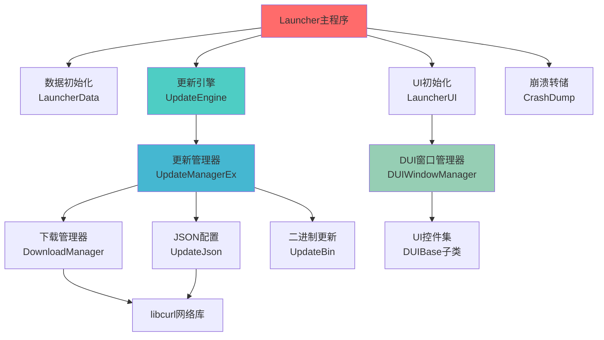

### 1.3 代码规模统计

| 模块 | 文件数 | 主要语言 | 代码行数(估算) |
|------|--------|----------|----------------|
| 主程序 | 4 | C++ | ~300 |
| 更新引擎 | 6 | C++ | ~2,500 |
| UI控件 | 9 | C++ | ~1,800 |
| 下载管理 | 2 | C++ | ~150 |
| 工具类 | 10 | C++ | ~1,200 |
| 网络通信 | 2 | C++ | ~150 |
| **总计** | **33** | **C++** | **~6,100** |

---

## 2. API接口契约审计

### 2.1 登录器与游戏客户端通信接口

#### 2.1.1 游戏启动接口

**位置**: [`LauncherUI.h`](../../../client/Launcher/Code/LauncherUI.h:72-82)

```cpp
static void GameStart(DUIBase* pUI, int iX, int iY)
{
    if (pUI->m_Type != DUIType_Button)
    {
        return;
    }
    wstring wsFileName = GetRootPath() + L"bin/release/MT3.exe";
    wstring wsFilePath = GetRootPath() + L"bin/release/";
    ShellExecute(NULL, L"open", wsFileName.c_str(), NULL, wsFilePath.c_str(), SW_SHOW);
    GameExitForce(pUI, iX, iY);
}
```

**接口契约**:
- **输入参数**: 
  - `pUI`: UI控件指针（必须是Button类型）
  - `iX`: 鼠标X坐标（未使用）
  - `iY`: 鼠标Y坐标（未使用）
- **输出**: 无返回值
- **功能**: 启动游戏客户端并退出登录器
- **游戏客户端路径**: `{RootPath}/bin/release/MT3.exe`
- **工作目录**: `{RootPath}/bin/release/`

#### 2.1.2 游戏退出接口

**位置**: [`LauncherUI.h`](../../../client/Launcher/Code/LauncherUI.h:32-51)

```cpp
static void GameExit(DUIBase* pUI, int iX, int iY)
{
    if (pUI->m_Type != DUIType_Button)
    {
        return;
    }
    DUIWindow* pMainWindow = GetDUIWindowManager()->FindMainWindow();
    if (!pMainWindow)
    {
        return;
    }
    wstring wsTitle = GlobalNotifyGetStringByKey(L"gameexittitle");
    wstring wsText = GlobalNotifyGetStringByKey(L"gameexittext");
    int iResult = MessageBox(pMainWindow->GetBGHandle(), wsText.c_str(), wsTitle.c_str(), MB_OKCANCEL);
    if (iResult == IDOK)
    {
        pMainWindow->m_bOver = true;
    }
}
```

**接口契约**:
- **输入参数**: 
  - `pUI`: UI控件指针（必须是Button类型）
  - `iX`, `iY`: 鼠标坐标（未使用）
- **输出**: 无返回值
- **功能**: 显示退出确认对话框，确认后设置窗口结束标志

### 2.2 登录器与服务器通信接口

#### 2.2.1 JSON配置请求接口

**位置**: [`UpdateJson.h`](../../../client/Launcher/Code/Update/UpdateJson.h:80-89)

```cpp
static void RequestUpdateJson(std::wstring wsURL, std::wstring wsVersionCaption, std::wstring wsChannelCaption)
{
    std::wstring wsURLFull = wsURL + wsVersionCaption + L"/" + wsChannelCaption + L"/index.html";
    std::string strUrl = StringUtil::WS2S(wsURLFull);
    
    GetDownloadManager()->AddTask(wsURLFull, L"index.html", &ms_data, UpdateJson::onGetUpdateJson);
}
```

**接口契约**:
- **输入参数**:
  - `wsURL`: JSON服务器基础URL
  - `wsVersionCaption`: 版本号字符串（如 "0.0.1"）
  - `wsChannelCaption`: 渠道号字符串（如 "100"）
- **输出**: 无返回值（异步回调）
- **请求URL格式**: `{BaseURL}/{Version}/{Channel}/index.html`
- **响应处理**: `onGetUpdateJson` 回调函数

#### 2.2.2 JSON响应处理接口

**位置**: [`UpdateJson.h`](../../../client/Launcher/Code/Update/UpdateJson.h:24-78)

```cpp
static void onGetUpdateJson(DownloadOne* pDO)
{
    int rcode = pDO->m_iResponseCode;
    std::string jsonStr;
    bool isSuccess = false;
    if (rcode == 200)
    {
        isSuccess = true;
        std::vector<char>* data = (std::vector<char>*)pDO->m_pData;
        std::vector<char>::iterator it;
        for (it = data->begin(); it != data->end(); it++)
        {
            jsonStr += *it;
        }
    }

    std::string sDownloadSite;
    std::string sAppSite;

    if (isSuccess)
    {
        Json* root = Json_create(jsonStr.c_str());
        if (root)
        {
            Json* gameConfig = Json_getItem(root, "GameConfigInfo");
            if (gameConfig && gameConfig->type == Json_Object)
            {
                Json* _pathchUrl = Json_getItem(gameConfig, "PatchUrl");
                if (_pathchUrl && _pathchUrl->type == Json_String)
                {
                    sDownloadSite = _pathchUrl->valueString;
                }

                Json* _updateUrl = Json_getItem(gameConfig, "UpdateUrl");
                if (_updateUrl && _updateUrl->type == Json_String)
                {
                    sAppSite = _updateUrl->valueString;
                }
            }
        }
    }
    
    if (m_SetDownloadSite_Func)
    {
        std::wstring wsDownloadSite = StringUtil::S2WS(sDownloadSite);
        std::wstring wsAppSite = StringUtil::S2WS(sAppSite);
        m_SetDownloadSite_Func(wsDownloadSite, wsAppSite);
    }
}
```

**接口契约**:
- **输入参数**: `pDO`: 下载任务对象指针
- **输出**: 无返回值（通过回调设置下载站点）
- **JSON响应格式**:
```json
{
  "GameConfigInfo": {
    "PatchUrl": "http://patch.server.com/",
    "UpdateUrl": "http://update.server.com/"
  }
}
```

### 2.3 Windows API调用

#### 2.3.1 单实例检查

**位置**: [`Launcher.cpp`](../../../client/Launcher/Code/Launcher.cpp:16-25)

```cpp
HANDLE hMutexOneInstance = CreateMutex(NULL, TRUE, L"MT3Launcher");
if (GetLastError() == ERROR_ALREADY_EXISTS)
{
    MessageBox(0, L"Launcher已经在运行,请关闭之前的程序再重新启动", L"", MB_OK);
    return FALSE;
}
if (hMutexOneInstance)
{
    ReleaseMutex(hMutexOneInstance);
}
```

**API契约**:
- **互斥锁名称**: `L"MT3Launcher"`
- **重复运行处理**: 显示错误消息并退出
- **释放**: 检查成功后立即释放互斥锁

#### 2.3.2 GDI+初始化

**位置**: [`Launcher.cpp`](../../../client/Launcher/Code/Launcher.cpp:27-28)

```cpp
GdiplusStartupInput GPSI;
GdiplusStartup(&gs_GPToken, &GPSI, NULL);
```

**API契约**:
- **初始化**: GDI+图形库
- **令牌**: 存储在 `gs_GPToken`
- **清理**: 程序退出时调用 `GdiplusShutdown(gs_GPToken)`

#### 2.3.3 ShellExecute调用

**位置**: [`LauncherUI.h`](../../../client/Launcher/Code/LauncherUI.h:78-80)

```cpp
ShellExecute(NULL, L"open", wsFileName.c_str(), NULL, wsFilePath.c_str(), SW_SHOW);
```

**API契约**:
- **操作**: `L"open"` - 打开文件
- **文件路径**: 游戏客户端可执行文件
- **工作目录**: 游戏客户端目录
- **显示方式**: `SW_SHOW` - 正常显示窗口

### 2.4 配置文件读取接口

#### 2.4.1 LauncherData.xml读取

**位置**: [`LauncherData.h`](../../../client/Launcher/Code/LauncherData.h:15-39)

```cpp
static int InitData()
{
    wstring wsBinReleasePath = L"bin/release/";
    wstring wsLauncherDataFileName = wsBinReleasePath + L"LauncherData.xml";
    LJFP_NodeEx* pNode0 = NULL;
    LJFP_NodeEx* pNode1 = NULL;
    LJFP_NodeEx* pNode2 = NULL;
    int iResult = 0;    
    iResult = pNode0->LoadFromXMLFile(wsLauncherDataFileName, pNode0);
    if (iResult != 0)
    {
        return iResult;
    }
    pNode1 = pNode0->FindNode(L"StringMap");
    unsigned int uiValue = GetStringUtil().WS2UI(pNode1->FindAttrValue(L"Count"));
    for (int i = 0; i < uiValue; i++)
    {
        pNode2 = pNode1->FindNode(GetStringUtil().UI2WS(i));
        wstring wsName = pNode2->FindAttrValue(L"Name");
        wstring wsValue = pNode2->FindAttrValue(L"Value");
        g_StringMap[wsName] = wsValue;
    }
    delete pNode0;
    return 0;
}
```

**接口契约**:
- **配置文件路径**: `bin/release/LauncherData.xml`
- **XML结构**:
```xml
<Root>
  <StringMap Count="N">
    <0 Name="key1" Value="value1"/>
    <1 Name="key2" Value="value2"/>
    ...
  </StringMap>
</Root>
```
- **存储**: 全局 `map<wstring, wstring> g_StringMap`
- **查询接口**: `FindStringByKey(wstring wsKey)`

#### 2.4.2 UI配置读取

**位置**: [`LauncherUI.h`](../../../client/Launcher/Code/LauncherUI.h:309-346)

```cpp
static int InitUI()
{
    wstring wsBinReleasePath = L"bin/release/";
    wstring wsLauncherDataFileName = wsBinReleasePath + L"LauncherData.xml";
    LJFP_NodeEx* pNode0 = NULL;
    LJFP_NodeEx* pNode1 = NULL;
    int iResult = 0;
    iResult = pNode0->LoadFromXMLFile(wsLauncherDataFileName, pNode0);
    if (iResult != 0)
    {
        return iResult;
    }
    pNode1 = pNode0->FindNode(L"UI");
    if (!pNode1){ return -1; }
    iResult = InitUIItems(pNode1, NULL);
    if (iResult != 0)
    {
        return iResult;
    }
    delete pNode0;
    DUIWindow* pMainWindow = GetDUIWindowManager()->FindMainWindow();
    if (!pMainWindow)
    {
        return -1;
    }
    pMainWindow->Redraw();
    return 0;
}
```

**接口契约**:
- **配置文件**: `bin/release/LauncherData.xml`
- **UI节点**: 查找 `UI` 节点
- **控件创建**: 递归创建所有UI控件
- **重绘**: 创建完成后重绘主窗口

---

## 3. 数据传输模型审计

### 3.1 登录数据包结构

#### 3.1.1 版本文件结构

**文件名**: `ver.ljvi`
**位置**: [`UpdateManagerEx.cpp`](../../../client/Launcher/Code/Update/UpdateManagerEx.cpp:9)

```cpp
const std::wstring g_VerFileName = L"ver.ljvi";
```

**数据结构** (基于 LJFP_Version):
- 版本号 (`unsigned int`)
- 版本标题 (`wstring`)
- 基础版本号 (`unsigned int`)
- 基础版本标题 (`wstring`)
- 渠道号 (`unsigned int`)
- 渠道标题 (`wstring`)
- 最低需求版本 (`unsigned int`)
- 不检查版本标志 (`unsigned int`)
- URL信息数组 (`URLInfoArr`)
- 扩展属性映射 (`map<wstring, wstring>`)

#### 3.1.2 包信息文件结构

**文件名**: `fl.ljpi` (未压缩) / `fl.ljzip` (压缩)
**位置**: [`UpdateManagerEx.cpp`](../../../client/Launcher/Code/Update/UpdateManagerEx.cpp:10-11)

```cpp
const std::wstring g_PackInfoFileName = L"fl.ljpi";
const std::wstring g_PackInfoZipFileName = L"fl.ljzip";
```

**数据结构** (基于 LJFP_PackInfo):
- 文件数量 (`unsigned int`)
- 文件信息数组 (`vector<LJFP_FileInfo*>`)
  - 路径文件名 (`wstring`)
  - 文件大小 (`unsigned int`)
  - CRC32校验值 (`unsigned int`)

#### 3.1.3 二进制文件列表结构

**文件名**: `FileList.bin`
**位置**: [`UpdateManagerEx.cpp`](../../../client/Launcher/Code/Update/UpdateManagerEx.cpp:13)

```cpp
const std::wstring g_FileListBin = L"FileList.bin";
```

**数据结构** (基于 UpdateBinFileList):
```cpp
class UpdateBinFile
{
public:
    wstring m_wsRootPathName;      // 根路径名
    wstring m_wsFileName;          // 文件名
    
    unsigned int m_Size;          // 压缩后大小
    unsigned int m_CRC32;         // 压缩后CRC32
    unsigned char* m_Data;        // 数据指针
    
    unsigned int m_SizeOriginal;   // 原始大小
    unsigned int m_CRC32Original; // 原始CRC32
    unsigned char* m_DataOriginal; // 原始数据
    
    unsigned int m_SizeCompress;   // 压缩大小
    unsigned int m_CRC32Compress; // 压缩CRC32
    unsigned char* m_DataCompress; // 压缩数据
    
    int m_iIsUse;                // 使用标志
};
```

### 3.2 资源更新数据传输

#### 3.2.1 版本检查流程

**位置**: [`UpdateManagerEx.cpp`](../../../client/Launcher/Code/Update/UpdateManagerEx.cpp:135-238)

```cpp
int UpdateManagerEx::StepLoadVersion()
{
    // 1. 加载本地版本文件
    m_pVerRoot = new LJFP_Version();
    iResult = ((LJFP_Version*)m_pVerRoot)->LoadFromFile(m_RootResPath + g_VerFileName);
    
    // 2. 检查不检查版本标志
    if (((LJFP_Version*)m_pVerRoot)->GetVersionDonotCheck() != 0)
    {
        // 跳过更新
        return 1;
    }
    
    // 3. 请求JSON配置获取下载站点
    UpdateJson::SetCB_SetDownloadSite_Func(UpdateManagerEx::SetDownloadSite);
    UpdateJson::RequestUpdateJson(g_JsonSite, m_VersionBaseCaption, m_ChannelCaption);
    
    // 4. 等待JSON响应
    while (m_DownloadSiteIsBack == 0)
    {
        GetDownloadManager()->Run();
        DoEvents();
        ::Sleep(1);
    }
    
    // 5. 下载最新版本文件
    bResult = UpdateHelper::DownloadFile(m_DownloadSite, CacheVersionCaptionBase, 
                                       g_VerFileName + UpdateHelper::GetRandomDownloadParam(), 
                                       m_CacheUpdatePath, L"", g_VerFileName, false);
    
    // 6. 加载最新版本
    m_pVerUpdate = new LJFP_Version();
    iResult = ((LJFP_Version*)m_pVerUpdate)->LoadFromFile(m_CacheUpdatePath + g_VerFileName);
    
    return 0;
}
```

**数据传输流程**:
1. 加载本地版本文件 (`res1/ver.ljvi`)
2. 请求JSON配置获取下载站点
3. 下载最新版本文件到缓存目录
4. 比较版本号判断是否需要更新

#### 3.2.2 资源包下载流程

**位置**: [`UpdateManagerEx.cpp`](../../../client/Launcher/Code/Update/UpdateManagerEx.cpp:299-364)

```cpp
int UpdateManagerEx::StepDownloadPackInfo()
{
    std::wstring NewVersionCaptionBase = ((LJFP_Version*)m_pVerUpdate)->GetVersionCaptionBase() + L"/";
    std::wstring NewVersionCaption = ((LJFP_Version*)m_pVerUpdate)->GetVersionCaption() + L"/";
    
    // 下载新增文件
    for (unsigned int i = 0; i < ((LJFP_PackInfo*)m_pPIAdd)->GetFileCount(); i++)
    {
        std::wstring CurPathFileNameFull = ((LJFP_PackInfo*)m_pPIAdd)->GetFileInfo(i)->m_PathFileName;
        std::wstring CurPathName = UpdateHelper::GetFilePath(CurPathFileNameFull, L"");
        std::wstring CurFileNameFull = UpdateHelper::GetFileNameFull(CurPathFileNameFull);
        unsigned int CurSize = ((LJFP_PackInfo*)m_pPIAdd)->GetFileInfo(i)->m_Size;
        unsigned int CurCRC32 = ((LJFP_PackInfo*)m_pPIAdd)->GetFileInfo(i)->m_CRC32;
        
        if (!UpdateHelper::ExistFileEx(m_CacheUpdatePath + CurPathName + CurFileNameFull, CurSize, CurCRC32))
        {
            bool bDownloadOK = false;
            for (unsigned int i2 = 0; i2 < 3; i2++)
            {
                bResult = UpdateHelper::DownloadFile(m_DownloadSite, 
                                                   NewVersionCaptionBase + NewVersionCaption + CurPathName, 
                                                   CurFileNameFull,
                                                   m_CacheUpdatePath, CurPathName, CurFileNameFull, true);
                if (bResult != true){ continue; }
                bResult = UpdateHelper::ExistFileEx(m_CacheUpdatePath + CurPathName + CurFileNameFull, CurSize, CurCRC32);
                if (bResult != true){ continue; }
                bDownloadOK = true;
                break;
            }
            if (bDownloadOK != true){ return -1; }
        }
        GlobalNotifyStep(((i + 1) * 1.0f / FileCount) * 80 / 2 + 50);
    }
    
    // 下载修改文件（类似逻辑）
    for (unsigned int i = 0; i < ((LJFP_PackInfo*)m_pPIMod)->GetFileCount(); i++)
    {
        // ... 相同下载逻辑
    }
    
    return 0;
}
```

**数据传输特点**:
- **重试机制**: 每个文件最多重试3次
- **校验机制**: 下载后验证文件大小和CRC32
- **进度通知**: 通过 `GlobalNotifyStep` 更新进度条
- **缓存目录**: `bin/release/cache/update/`

#### 3.2.3 二进制文件下载流程

**位置**: [`UpdateManagerEx.cpp`](../../../client/Launcher/Code/Update/UpdateManagerEx.cpp:448-506)

```cpp
int UpdateManagerEx::StepDownLoadBinInfo()
{
    std::wstring NewVersionCaptionBase = ((LJFP_Version*)m_pVerUpdate)->GetVersionCaptionBase() + L"/";
    std::wstring NewVersionCaption = ((LJFP_Version*)m_pVerUpdate)->GetVersionCaption() + L"/";
    
    for (unsigned int i = 0; i < ((UpdateBinFileList*)m_pBFLAdd)->GetFileCount(); i++)
    {
        std::wstring CurPathFileNameFull = ((UpdateBinFileList*)m_pBFLAdd)->GetFile(i)->m_wsFileName;
        std::wstring CurPathName = UpdateHelper::GetFilePath(CurPathFileNameFull, L"");
        std::wstring CurFileNameFull = UpdateHelper::GetFileNameFull(CurPathFileNameFull);
        unsigned int CurSize = ((UpdateBinFileList*)m_pBFLAdd)->GetFile(i)->m_Size;
        unsigned int CurCRC32 = ((UpdateBinFileList*)m_pBFLAdd)->GetFile(i)->m_CRC32;
        
        if (!UpdateHelper::ExistFileEx(m_CacheUpdatePathBin + CurPathName + CurFileNameFull, CurSize, CurCRC32))
        {
            bool bDownloadOK = false;
            for (unsigned int i2 = 0; i2 < 3; i2++)
            {
                bResult = UpdateHelper::DownloadFile(m_DownloadSite, 
                                                   NewVersionCaptionBase + NewVersionCaption + g_BinRelease + CurPathName, 
                                                   CurFileNameFull,
                                                   m_CacheUpdatePathBin, CurPathName, CurFileNameFull + L".z", true);
                if (bResult != true){ continue; }
                bResult = UpdateHelper::ExistFileEx(m_CacheUpdatePathBin + CurPathName + CurFileNameFull + L".z", CurSize, CurCRC32);
                if (bResult != true){ continue; }
                bDownloadOK = true;
                break;
            }
            if (bDownloadOK != true){ return -1; }
        }
        GlobalNotifyStep(((i + 1) * 1.0f / FileCount) * 80 / 2);
    }
    
    return 0;
}
```

**数据传输特点**:
- **压缩格式**: 下载的文件添加 `.z` 后缀（压缩格式）
- **解压处理**: 在 `StepUpdateBinInfo` 中解压
- **校验机制**: 验证压缩文件的大小和CRC32

### 3.3 配置数据加载

#### 3.3.1 字符串映射加载

**位置**: [`LauncherData.h`](../../../client/Launcher/Code/LauncherData.h:15-39)

```cpp
static int InitData()
{
    wstring wsBinReleasePath = L"bin/release/";
    wstring wsLauncherDataFileName = wsBinReleasePath + L"LauncherData.xml";
    LJFP_NodeEx* pNode0 = NULL;
    LJFP_NodeEx* pNode1 = NULL;
    LJFP_NodeEx* pNode2 = NULL;
    int iResult = 0;    
    iResult = pNode0->LoadFromXMLFile(wsLauncherDataFileName, pNode0);
    if (iResult != 0)
    {
        return iResult;
    }
    pNode1 = pNode0->FindNode(L"StringMap");
    unsigned int uiValue = GetStringUtil().WS2UI(pNode1->FindAttrValue(L"Count"));
    for (int i = 0; i < uiValue; i++)
    {
        pNode2 = pNode1->FindNode(GetStringUtil().UI2WS(i));
        wstring wsName = pNode2->FindAttrValue(L"Name");
        wstring wsValue = pNode2->FindAttrValue(L"Value");
        g_StringMap[wsName] = wsValue;
    }
    delete pNode0;
    return 0;
}
```

**配置数据结构**:
```xml
<Root>
  <StringMap Count="N">
    <0 Name="gameexittitle" Value="退出确认"/>
    <1 Name="gameexittext" Value="确定要退出游戏吗？"/>
    ...
  </StringMap>
</Root>
```

**存储方式**: 全局 `map<wstring, wstring> g_StringMap`

### 3.4 缓存机制

#### 3.4.1 缓存目录结构

**位置**: [`UpdateManagerEx.cpp`](../../../client/Launcher/Code/Update/UpdateManagerEx.cpp:118-131)

```cpp
int UpdateManagerEx::StepInitPath()
{
    m_RootPath = GetRootPath();
    m_RootResPath = m_RootPath + L"res1/";
    m_RootBinReleasePath = m_RootPath + g_BinRelease;
    m_CacheResPath = m_RootBinReleasePath + L"cache/res1/";
    m_CacheUpdatePath = m_RootBinReleasePath + L"cache/update/";
    m_CacheUpdatePathBin = m_CacheUpdatePath + g_BinRelease;

    UpdateHelper::CreateDirEx(L"", m_RootResPath);
    UpdateHelper::CreateDirEx(L"", m_CacheResPath);
    UpdateHelper::CreateDirEx(L"", m_CacheUpdatePath);
    UpdateHelper::CreateDirEx(L"", m_CacheUpdatePathBin);
    UpdateHelper::CreateDirEx(L"", m_RootBinReleasePath);

    return 0;
}
```

**缓存目录结构**:
```
{RootPath}/
├── res1/                    # 资源根目录
│   ├── ver.ljvi            # 版本文件
│   └── fl.ljpi             # 包信息文件
└── bin/release/
    ├── cache/
    │   ├── res1/           # 资源缓存
    │   │   ├── ver.ljvi
    │   │   └── fl.ljpi
    │   └── update/         # 更新缓存
    │       ├── ver.ljvi
    │       ├── fl.ljzip
    │       └── bin/release/
    │           └── FileList.bin
    └── MT3.exe            # 游戏客户端
```

#### 3.4.2 缓存文件管理

**版本文件缓存策略**:
1. 检查 `cache/res1/verroot.ljvi` 是否存在
2. 如果不存在，复制 `res1/ver.ljvi` 到 `cache/res1/verroot.ljvi`
3. 如果存在，比较版本号，不同则更新缓存
4. 使用 `cache/res1/ver.ljvi` 作为工作版本

**包信息缓存策略**:
1. 检查 `cache/res1/fl.ljpi` 是否存在
2. 如果不存在，复制 `res1/fl.ljpi` 到缓存
3. 下载最新包信息到 `cache/update/fl.ljzip`
4. 解压到 `cache/update/fl.ljpi`

---

## 4. 核心业务状态机审计

### 4.1 登录流程状态机

#### 4.1.1 主程序启动流程

**位置**: [`Launcher.cpp`](../../../client/Launcher/Code/Launcher.cpp:14-91)

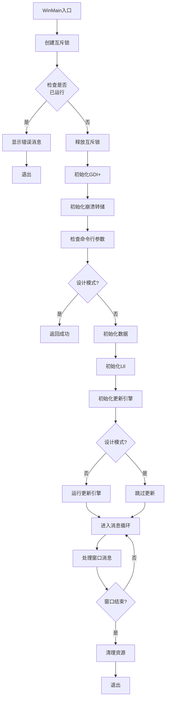

**状态定义**:
- **INIT**: 初始化阶段
- **UPDATE**: 更新阶段
- **RUNNING**: 运行阶段
- **CLEANUP**: 清理阶段

#### 4.1.2 更新流程状态机

**位置**: [`UpdateManagerEx.cpp`](../../../client/Launcher/Code/Update/UpdateManagerEx.cpp:590-806)

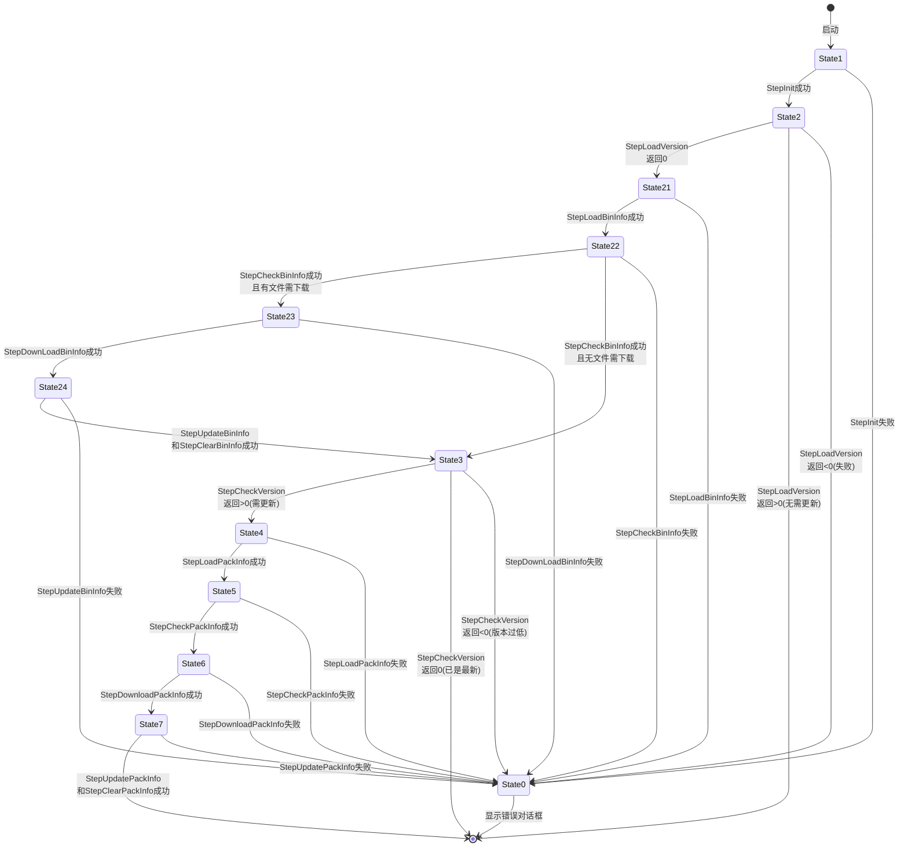

**状态详细说明**:

| 状态 | 状态码 | 功能 | 返回值处理 |
|------|--------|------|-----------|
| State0 | 0 | 等待用户确认 | `m_FormResult < 0`: 失败退出<br/>`m_FormResult >= 0`: 跳转到对应状态 |
| State1 | 1 | 初始化 | 成功 → State2 |
| State2 | 2 | 加载版本信息 | `>0`: 无需更新 → 完成<br/>`=0`: 需检查 → State21<br/>`<0`: 失败 → State0 |
| State21 | 21 | 加载二进制信息 | 成功 → State22 |
| State22 | 22 | 检查二进制信息 | 有文件 → State23<br/>无文件 → State3 |
| State23 | 23 | 下载二进制文件 | 成功 → State24 |
| State24 | 24 | 更新二进制文件 | 成功 → State3 |
| State3 | 3 | 检查版本 | `=0`: 已是最新 → 完成<br/>`>0`: 需更新 → State4<br/>`<0`: 版本过低 → State0 |
| State4 | 4 | 加载包信息 | 成功 → State5 |
| State5 | 5 | 检查包信息 | 成功 → State6 |
| State6 | 6 | 下载包文件 | 成功 → State7 |
| State7 | 7 | 更新包文件 | 成功 → 完成 |

### 4.2 资源更新状态机

#### 4.2.1 资源更新流程

**位置**: [`UpdateManagerEx.cpp`](../../../client/Launcher/Code/Update/UpdateManagerEx.cpp:258-428)

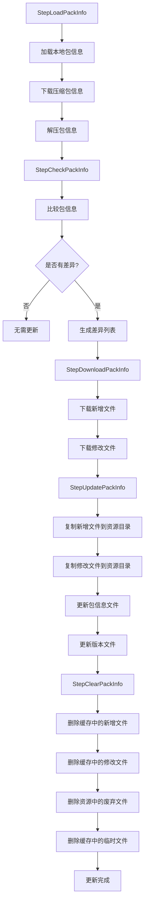

**差异列表生成**:
- `m_pPIAdd`: 新增文件列表
- `m_pPIMod`: 修改文件列表
- `m_pPIDel`: 删除文件列表

### 4.3 游戏启动状态机

#### 4.3.1 游戏启动流程

**位置**: [`LauncherUI.h`](../../../client/Launcher/Code/LauncherUI.h:72-82)

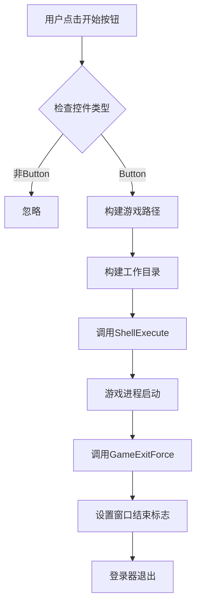

**游戏启动参数**:
- **可执行文件**: `{RootPath}/bin/release/MT3.exe`
- **工作目录**: `{RootPath}/bin/release/`
- **显示方式**: `SW_SHOW` (正常显示)

### 4.4 错误处理状态机

#### 4.4.1 错误处理流程

**位置**: [`UpdateManagerEx.cpp`](../../../client/Launcher/Code/Update/UpdateManagerEx.cpp:590-806)

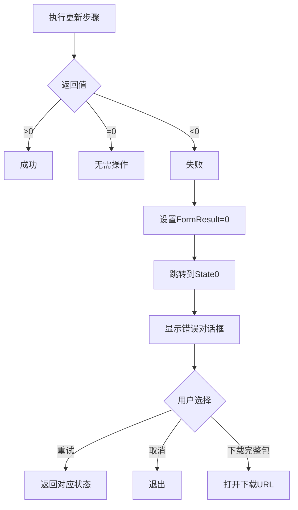

**错误对话框类型** (FormType):
- **1**: 版本加载失败
- **2**: 版本过低，需要下载完整包
- **3**: 包信息加载失败
- **5**: 包文件下载失败
- **21**: 二进制信息加载失败
- **23**: 二进制文件下载失败

---

## 5. UI交互逻辑审计

### 5.1 登录界面生命周期

#### 5.1.1 UI初始化流程

**位置**: [`LauncherUI.h`](../../../client/Launcher/Code/LauncherUI.h:309-346)

```mermaid
sequenceDiagram
    participant Main as 主程序
    participant UI as LauncherUI
    participant WM as DUIWindowManager
    participant XML as LauncherData.xml
    
    Main->>UI: InitUI()
    UI->>XML: 加载配置文件
    XML-->>UI: XML节点树
    UI->>UI: 查找UI节点
    UI->>UI: InitUIItems(UI节点, NULL)
    loop 遍历所有UI项
        UI->>UI: InitUIBase(子节点, 父节点)
        alt Window类型
            UI->>WM: AddItem(窗口)
            WM-->>UI: DUIWindow*
        alt Label类型
            UI->>UI: 创建DUILabel
        alt Button类型
            UI->>UI: 创建DUIButton
            UI->>UI: 设置回调函数
        alt ProgressBar类型
            UI->>UI: 创建DUIProgressBar
        end
    end
    UI->>WM: FindMainWindow()
    WM-->>UI: 主窗口指针
    UI->>WM: Redraw()
```

#### 5.1.2 UI控件类型

**位置**: [`LauncherUI.h`](../../../client/Launcher/Code/LauncherUI.h:273-308)

| 控件类型 | 类名 | 功能 | XML属性 |
|---------|------|------|----------|
| Window | DUIWindow | 主窗口 | Name, ClassName, Title, X, Y, Width, Height, RgnFileName, MainWindow |
| Label | DUILabel | 文本标签 | Name, Text, TextColorR/G/B, FontName, FontHeight, X, Y, Width, Height |
| LabelLink | DUILabelLink | 链接标签 | Name, Text, URL, TextColorR/G/B, FontName, FontHeight, X, Y, Width, Height, RandomStr |
| Image | DUIImage | 图片控件 | Name, FileName, ColorKeyR/G/B, X, Y, Width, Height |
| Button | DUIButton | 按钮控件 | Name, Func, Enable, X, Y, Width, Height |
| ProgressBar | DUIProgressBar | 进度条 | Name, ValueMax, ValueMin, ValueCur, X, Y, Width, Height |
| WebBrowser | DUIWebBrowser | Web浏览器 | Name, URL, X, Y, Width, Height, RandomStr |

### 5.2 服务器选择界面

**审计发现**: 当前代码中**未发现**独立的服务器选择界面实现。服务器配置通过以下方式处理:

1. **JSON配置获取**: 通过 [`UpdateJson::RequestUpdateJson`](../../../client/Launcher/Code/Update/UpdateJson.h:80-89) 获取服务器配置
2. **渠道号**: 版本文件中包含渠道号 (`Channel`)
3. **下载站点**: JSON响应中的 `PatchUrl` 和 `UpdateUrl`

**建议**: 如需服务器选择功能，需新增UI控件和逻辑。

### 5.3 资源更新进度显示

#### 5.3.1 进度通知机制

**位置**: [`GlobalFunction.h`](../../../client/Launcher/Code/Global/GlobalFunction.h:12)

```cpp
void GlobalNotifyStep(int step);
```

**进度计算**:

**二进制文件更新进度** ([`UpdateManagerEx.cpp:478`](../../../client/Launcher/Code/Update/UpdateManagerEx.cpp:478)):
```cpp
GlobalNotifyStep(((i + 1) * 1.0f / FileCount) * 80 / 2);
```
- 下载阶段: 0-40% (0-80%的一半)
- 更新阶段: 40-50% (80-90%的一半)

**资源包更新进度** ([`UpdateManagerEx.cpp:333`](../../../client/Launcher/Code/Update/UpdateManagerEx.cpp:333)):
```cpp
GlobalNotifyStep(((i + 1) * 1.0f / FileCount) * 80 / 2 + 50);
```
- 下载阶段: 50-90% (50-130%的一半)
- 更新阶段: 90-100% (130-140%的一半)

**进度映射**:
```
0-50%:   二进制文件更新
50-100%: 资源包更新
```

#### 5.3.2 进度条更新

**位置**: [`UpdateManagerEx.cpp`](../../../client/Launcher/Code/Update/UpdateManagerEx.cpp:612-614)

```cpp
GlobalNotifyMsg(L"");
GlobalNotifyStep(0);
GlobalNotifyMsgByKey(L"upmgrstr11"); // 正在连接服务器...
```

**消息键映射** (从 `LauncherData.xml` 加载):
- `upmgrstr11`: "正在连接服务器..."
- `upmgrstr21`: "更新完成"
- `upmgrstr221`: "执行文件更新完成"
- `upmgrstr231`: "执行文件自动更新中..."
- `upmgrstr241`: "执行文件更新完成"
- `upmgrstr31`: "版本检测中..."
- `upmgrstr32`: "更新完成"
- `upmgrstr61`: "自动更新中..."
- `upmgrstr71`: "更新完成"

### 5.4 错误提示界面

#### 5.4.1 错误对话框显示

**位置**: [`UpdateManagerEx.cpp`](../../../client/Launcher/Code/Update/UpdateManagerEx.cpp:636-637)

```cpp
Continue(GlobalNotifyShowForm(1, 0, L""));
```

**错误对话框类型**:

| FormType | 场景 | 下载大小 | URL | 说明 |
|----------|------|---------|-----|------|
| 1 | 版本加载失败 | 0 | 空 | 显示通用错误 |
| 2 | 版本过低 | 0 | AppSite | 提示下载完整包 |
| 3 | 包信息加载失败 | 0 | 空 | 显示通用错误 |
| 5 | 包文件下载失败 | 0 | 空 | 显示通用错误 |
| 21 | 二进制信息加载失败 | 0 | 空 | 显示通用错误 |
| 23 | 二进制文件下载失败 | 0 | 空 | 显示通用错误 |

### 5.5 按钮点击事件处理

#### 5.5.1 按钮回调注册

**位置**: [`LauncherUI.h`](../../../client/Launcher/Code/LauncherUI.h:209-220)

```cpp
if (wsFunc == L"GameStart")
{
    pResult->m_LBDownCB_Func = GameStart;
}
else if (wsFunc == L"GameMin")
{
    pResult->m_LBDownCB_Func = GameMin;
}
else if (wsFunc == L"GameExit")
{
    pResult->m_LBDownCB_Func = GameExit;
}
```

**回调函数映射**:
- `GameStart`: 启动游戏客户端
- `GameMin`: 最小化窗口
- `GameExit`: 显示退出确认对话框

#### 5.5.2 按钮事件触发

**位置**: [`DUIWindow.h`](../../../client/Launcher/Code/UIControl/DUIWindow.h) (推断)

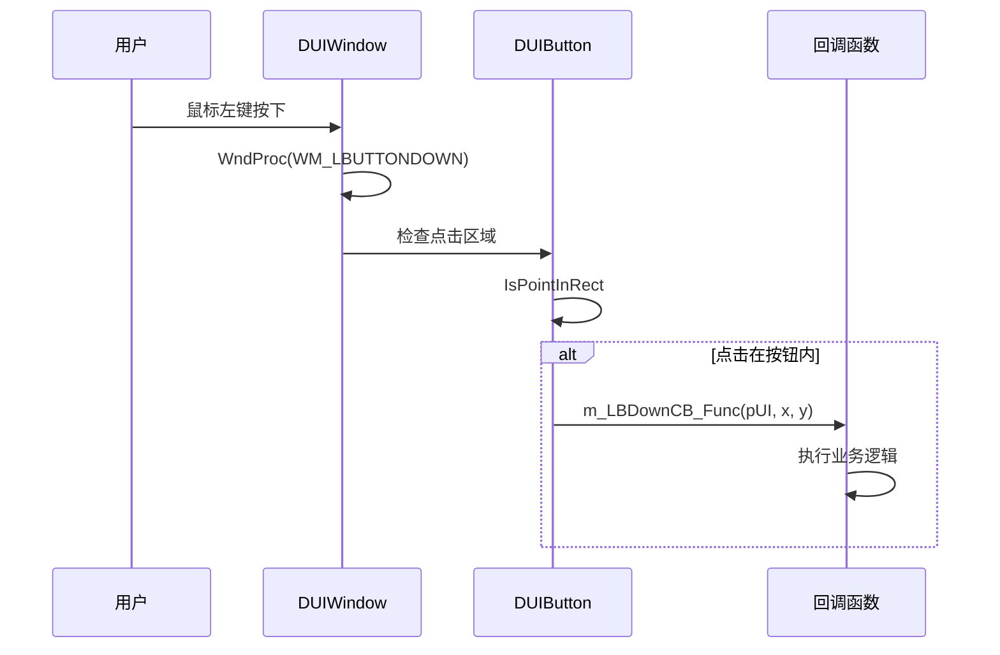

---

## 6. 多环境配置审计

### 6.1 Debug/Release配置差异

#### 6.1.1 下载站点配置

**位置**: [`UpdateManagerEx.cpp`](../../../client/Launcher/Code/Update/UpdateManagerEx.cpp:21-30)

```cpp
void UpdateManagerEx::SetDownloadSite(std::wstring DownloadSite, std::wstring AppSite)
{
#ifdef DEBUG
    DownloadSite = L"http://127.0.0.1/";
#endif
    AppSite = DownloadSite;
    GetUpdateManagerEx()->m_DownloadSite = DownloadSite;
    GetUpdateManagerEx()->m_AppSite = AppSite;
    GetUpdateManagerEx()->m_DownloadSiteIsBack = 1;
}
```

**配置差异**:
- **Debug模式**: 强制使用本地服务器 `http://127.0.0.1/`
- **Release模式**: 使用JSON返回的下载站点

#### 6.1.2 设计模式配置

**位置**: [`LauncherTools.h`](../../../client/Launcher/Code/LauncherTools.h:66-70)

```cpp
if (wsCurCmd.find(L"designmode") == 0)
{
    gs_iDesignMode = 1;
    MessageBox(0, wsCmdLine.c_str(), L"CmdLine", MB_OK);
}
```

**设计模式功能**:
- **命令行参数**: `designmode`
- **全局变量**: `gs_iDesignMode`
- **效果**: 跳过更新引擎运行 ([`Launcher.cpp:67-70`](../../../client/Launcher/Code/Launcher.cpp:67-70))

```cpp
if (gs_iDesignMode == 0)
{
    UE.Run();
}
```

### 6.2 服务器地址配置

#### 6.2.1 JSON服务器地址

**位置**: [`UpdateManagerEx.cpp`](../../../client/Launcher/Code/Update/UpdateManagerEx.cpp:17)

```cpp
const std::wstring g_JsonSite = L"http://193.112.65.157:88/test/abcdefghijkl/88/";
```

**配置说明**:
- **硬编码地址**: `http://193.112.65.157:88/test/abcdefghijkl/88/`
- **用途**: 获取下载站点配置
- **请求格式**: `{JsonSite}{VersionCaption}/{ChannelCaption}/index.html`

**问题**: 硬编码的服务器地址不利于多环境部署。

#### 6.2.2 下载站点配置

**位置**: [`UpdateManagerEx.h`](../../../client/Launcher/Code/Update/UpdateManagerEx.h:15-17)

```cpp
std::wstring m_DownloadSite;
std::wstring m_AppSite;
int m_DownloadSiteIsBack;
```

**配置来源**:
1. JSON响应中的 `PatchUrl` → `m_DownloadSite`
2. JSON响应中的 `UpdateUrl` → `m_AppSite`
3. `m_DownloadSiteIsBack` 标志表示配置已返回

### 6.3 资源路径配置

#### 6.3.1 路径初始化

**位置**: [`UpdateManagerEx.cpp`](../../../client/Launcher/Code/Update/UpdateManagerEx.cpp:118-131)

```cpp
int UpdateManagerEx::StepInitPath()
{
    m_RootPath = GetRootPath();
    m_RootResPath = m_RootPath + L"res1/";
    m_RootBinReleasePath = m_RootPath + g_BinRelease;
    m_CacheResPath = m_RootBinReleasePath + L"cache/res1/";
    m_CacheUpdatePath = m_RootBinReleasePath + L"cache/update/";
    m_CacheUpdatePathBin = m_CacheUpdatePath + g_BinRelease;

    UpdateHelper::CreateDirEx(L"", m_RootResPath);
    UpdateHelper::CreateDirEx(L"", m_CacheResPath);
    UpdateHelper::CreateDirEx(L"", m_CacheUpdatePath);
    UpdateHelper::CreateDirEx(L"", m_CacheUpdatePathBin);
    UpdateHelper::CreateDirEx(L"", m_RootBinReleasePath);

    return 0;
}
```

**路径配置表**:

| 路径变量 | 相对路径 | 说明 |
|---------|---------|------|
| `m_RootPath` | `{GetRootPath()}` | 应用根目录 |
| `m_RootResPath` | `{RootPath}/res1/` | 资源根目录 |
| `m_RootBinReleasePath` | `{RootPath}/bin/release/` | 可执行文件目录 |
| `m_CacheResPath` | `{RootPath}/bin/release/cache/res1/` | 资源缓存目录 |
| `m_CacheUpdatePath` | `{RootPath}/bin/release/cache/update/` | 更新缓存目录 |
| `m_CacheUpdatePathBin` | `{RootPath}/bin/release/cache/update/bin/release/` | 二进制更新缓存目录 |

### 6.4 版本号配置

#### 6.4.1 版本信息结构

**位置**: [`UpdateEngine.h`](../../../client/Launcher/Code/Update/UpdateEngine.h:16-24)

```cpp
static unsigned int g_uiVersionOld;
static std::wstring g_wsVersionOldCaption;
static unsigned int g_uiVersion;
static std::wstring g_wsVersionCaption;
static unsigned int g_uiVersionBase;
static std::wstring g_wsVersionBaseCaption;
static unsigned int g_uiChannel;
static std::wstring g_wsChannelCaption;
```

**版本信息说明**:
- `g_uiVersionOld`: 本地版本号
- `g_wsVersionOldCaption`: 本地版本标题 (如 "0.0.1")
- `g_uiVersion`: 最新版本号
- `g_wsVersionCaption`: 最新版本标题
- `g_uiVersionBase`: 基础版本号
- `g_wsVersionBaseCaption`: 基础版本标题
- `g_uiChannel`: 渠道号
- `g_wsChannelCaption`: 渠道标题

#### 6.4.2 版本比较逻辑

**位置**: [`UpdateManagerEx.cpp`](../../../client/Launcher/Code/Update/UpdateManagerEx.cpp:239-257)

```cpp
int UpdateManagerEx::StepCheckVersion()
{
    if (((LJFP_Version*)m_pVerCache)->GetVersion() < ((LJFP_Version*)m_pVerUpdate)->GetVersion())
    {
        if (((LJFP_Version*)m_pVerCache)->GetVersion() < ((LJFP_Version*)m_pVerUpdate)->GetVersionMinimum())
        {
            return -1; // 版本过低，不能更新
        }
        else
        {
            return 1; // 需要更新
        }
    }
    else
    {
        return 0; // 已是最新版本
    }
}
```

**版本比较规则**:
- `本地版本 < 最新版本`: 需要检查
- `本地版本 < 最低需求版本`: 不能增量更新，需下载完整包
- `本地版本 >= 最低需求版本`: 可以增量更新
- `本地版本 >= 最新版本`: 已是最新版本

---

## 7. 异常捕获机制审计

### 7.1 网络异常处理

#### 7.1.1 下载重试机制

**位置**: [`UpdateManagerEx.cpp`](../../../client/Launcher/Code/Update/UpdateManagerEx.cpp:317-331)

```cpp
bool bDownloadOK = false;
for (unsigned int i2 = 0; i2 < 3; i2++)
{
    bResult = UpdateHelper::DownloadFile(m_DownloadSite, 
                                       NewVersionCaptionBase + NewVersionCaption + CurPathName, 
                                       CurFileNameFull,
                                       m_CacheUpdatePath, CurPathName, CurFileNameFull, true);
    if (bResult != true){ continue; }
    bResult = UpdateHelper::ExistFileEx(m_CacheUpdatePath + CurPathName + CurFileNameFull, CurSize, CurCRC32);
    if (bResult != true){ continue; }
    bDownloadOK = true;
    break;
}
if (bDownloadOK != true){ return -1; }
```

**重试策略**:
- **重试次数**: 3次
- **重试条件**: 下载失败或校验失败
- **失败处理**: 返回-1，触发错误对话框

#### 7.1.2 HTTP响应码处理

**位置**: [`UpdateJson.h`](../../../client/Launcher/Code/Update/UpdateJson.h:26-38)

```cpp
int rcode = pDO->m_iResponseCode;
std::string jsonStr;
bool isSuccess = false;
if (rcode == 200)
{
    isSuccess = true;
    std::vector<char>* data = (std::vector<char>*)pDO->m_pData;
    std::vector<char>::iterator it;
    for (it = data->begin(); it != data->end(); it++)
    {
        jsonStr += *it;
    }
}
```

**HTTP响应码处理**:
- `200`: 成功，解析JSON
- 其他: 失败，使用空字符串

**问题**: 非200响应码时，未设置下载站点，可能导致后续更新失败。

### 7.2 文件操作异常处理

#### 7.2.1 文件存在性检查

**位置**: [`UpdateManagerEx_Helper.h`](../../../client/Launcher/Code/Update/UpdateManagerEx_Helper.h:200-205)

```cpp
bool ExistFile(std::wstring wstrFileName)
{
    std::string strFileName = StringUtil::WS2S(wstrFileName);
    int nRet = _access(strFileName.c_str(), 0);
    return nRet == 0;
}
```

**异常处理**:
- 使用 `_access` 函数检查文件存在
- 返回值: 0表示存在，非0表示不存在

#### 7.2.2 文件校验

**位置**: [`UpdateManagerEx_Helper.h`](../../../client/Launcher/Code/Update/UpdateManagerEx_Helper.h:206-233)

```cpp
bool ExistFileEx(std::wstring wstrFileName, unsigned int FileSize, unsigned int FileCRC32)
{
    unsigned int CurFileSize;
    unsigned int CurFileCRC32;
    if (FileSize > 0)
    {
        if (!GetFileSize(wstrFileName, CurFileSize))
        {
            return false;
        }
        if (FileSize != CurFileSize)
        {
            return false;
        }
    }
    if (FileCRC32 > 0)
    {
        if (!GetFileSizeCRC32(wstrFileName, CurFileSize, CurFileCRC32))
        {
            return false;
        }
        if (FileCRC32 != CurFileCRC32)
        {
            return false;
        }
    }
    return true;
}
```

**校验策略**:
1. 如果 `FileSize > 0`: 校验文件大小
2. 如果 `FileCRC32 > 0`: 校验CRC32值
3. 两者都通过才返回true

### 7.3 崩溃捕获

#### 7.3.1 崩溃转储初始化

**位置**: [`Launcher.cpp`](../../../client/Launcher/Code/Launcher.cpp:36-40)

```cpp
SYSTEMTIME st;
GetSystemTime(&st);
wchar_t wsDmpFileName[MAX_PATH];
wsprintf(wsDmpFileName, L"%d_%d_%d_%d.dmp", st.wDay, st.wHour, st.wMinute, st.wSecond);
MHSD_CrashDump::CrashDump_Init(wsDmpFileName, L"");
```

**转储文件命名**:
- 格式: `{Day}_{Hour}_{Minute}_{Second}.dmp`
- 示例: `5_20_30_45.dmp`

**问题**: 转储文件未指定保存路径，可能保存在当前工作目录。

#### 7.3.2 崩溃转储清理

**位置**: [`Launcher.cpp`](../../../client/Launcher/Code/Launcher.cpp:88)

```cpp
MHSD_CrashDump::CrashDump_Clean();
```

**清理时机**: 程序正常退出时清理崩溃转储资源。

### 7.4 错误码定义

#### 7.4.1 更新步骤错误码

**位置**: [`UpdateManagerEx.cpp`](../../../client/Launcher/Code/Update/UpdateManagerEx.cpp:590-806)

| 步骤 | 错误码 | 含义 |
|------|--------|------|
| StepInit | - | 未定义错误码 |
| StepLoadVersion | -1 | 版本文件加载失败 |
| StepLoadBinInfo | -1 | 二进制信息加载失败 |
| StepDownLoadBinInfo | -1 | 二进制文件下载失败 |
| StepUpdateBinInfo | -11, -12, -13, -21, -22, -23 | 二进制文件更新失败 |
| StepLoadPackInfo | -1 | 包信息加载失败 |
| StepDownloadPackInfo | -1 | 包文件下载失败 |
| StepUpdatePackInfo | -1, -2, -3, -4 | 包文件更新失败 |

#### 7.4.2 二进制更新错误码详情

**位置**: [`UpdateManagerEx.cpp`](../../../client/Launcher/Code/Update/UpdateManagerEx.cpp:519-549)

| 错误码 | 含义 |
|--------|------|
| -11 | 新增文件解压失败 |
| -12 | 新增文件校验失败 |
| -13 | 新增文件复制失败 |
| -21 | 修改文件解压失败 |
| -22 | 修改文件校验失败 |
| -23 | 修改文件复制失败 |

### 7.5 日志记录机制

**审计发现**: 当前代码中**未发现**完整的日志记录机制。

**现有记录方式**:
- **控制台输出**: `wprintf` (在 `UpdateBin.h:284`)
- **进度通知**: `GlobalNotifyStep` 更新UI进度条
- **消息通知**: `GlobalNotifyMsg` / `GlobalNotifyMsgByKey` 更新UI消息

**建议**: 增加文件日志记录功能，便于问题排查。

---

## 8. 资源更新机制审计

### 8.1 版本检查逻辑

#### 8.1.1 版本文件加载

**位置**: [`UpdateManagerEx.cpp`](../../../client/Launcher/Code/Update/UpdateManagerEx.cpp:135-238)

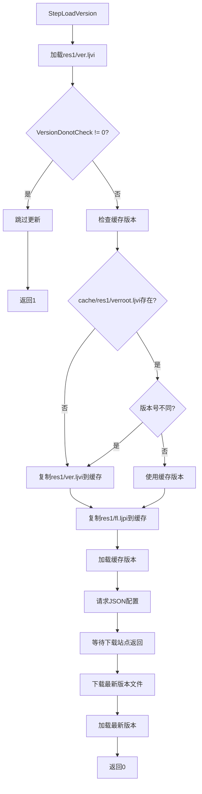

**版本文件缓存策略**:
1. 首次运行: 复制 `res1/ver.ljvi` 到 `cache/res1/verroot.ljvi`
2. 后续运行: 比较版本号，不同则更新缓存
3. 工作版本: 使用 `cache/res1/ver.ljvi`

#### 8.1.2 版本比较

**位置**: [`UpdateManagerEx.cpp`](../../../client/Launcher/Code/Update/UpdateManagerEx.cpp:239-257)

```cpp
int UpdateManagerEx::StepCheckVersion()
{
    if (((LJFP_Version*)m_pVerCache)->GetVersion() < ((LJFP_Version*)m_pVerUpdate)->GetVersion())
    {
        if (((LJFP_Version*)m_pVerCache)->GetVersion() < ((LJFP_Version*)m_pVerUpdate)->GetVersionMinimum())
        {
            return -1; // 版本过低，不能增量更新
        }
        else
        {
            return 1; // 可以增量更新
        }
    }
    else
    {
        return 0; // 已是最新版本
    }
}
```

**版本比较规则**:
- `本地版本 < 最新版本`: 需要检查
- `本地版本 < 最低需求版本`: 不能增量更新
- `本地版本 >= 最低需求版本`: 可以增量更新
- `本地版本 >= 最新版本`: 已是最新版本

### 8.2 增量更新算法

#### 8.2.1 包信息差异计算

**位置**: [`UpdateManagerEx.cpp`](../../../client/Launcher/Code/Update/UpdateManagerEx.cpp:290-298)

```cpp
int UpdateManagerEx::StepCheckPackInfo()
{
    int iResult = ParsePackInfo((LJFP_PackInfo*)m_pPICache, (LJFP_PackInfo*)m_pPIUpdate, 
                               (LJFP_PackInfo*&)m_pPIAdd, 
                               (LJFP_PackInfo*&)m_pPIMod, 
                               (LJFP_PackInfo*&)m_pPIDel);
    if (iResult != 0)
    {
        return -1;
    }
    return 0;
}
```

**差异列表生成**:
- `m_pPIAdd`: 新增文件列表
- `m_pPIMod`: 修改文件列表
- `m_pPIDel`: 删除文件列表

**差异计算逻辑** (推断):
```cpp
// 新增文件: 在Update中存在，在Cache中不存在
for (auto& file : UpdateFiles) {
    if (!CacheFiles.contains(file)) {
        AddFiles.push_back(file);
    }
}

// 修改文件: 在Update和Cache中都存在，但CRC32不同
for (auto& file : UpdateFiles) {
    if (CacheFiles.contains(file)) {
        if (CacheFiles[file].CRC32 != file.CRC32) {
            ModFiles.push_back(file);
        }
    }
}

// 删除文件: 在Cache中存在，在Update中不存在
for (auto& file : CacheFiles) {
    if (!UpdateFiles.contains(file)) {
        DelFiles.push_back(file);
    }
}
```

#### 8.2.2 二进制文件差异计算

**位置**: [`UpdateManagerEx.cpp`](../../../client/Launcher/Code/Update/UpdateManagerEx.cpp:442-447)

```cpp
int UpdateManagerEx::StepCheckBinInfo()
{
    int iResult = ParseUpdateBinFileList((UpdateBinFileList*)m_pBFLBase, 
                                       (UpdateBinFileList*)m_pBFLNew, 
                                       (UpdateBinFileList*&)m_pBFLAdd, 
                                       (UpdateBinFileList*&)m_pBFLMod, 
                                       (UpdateBinFileList*&)m_pBFLDel);
    if (iResult != 0){ return -1; }
    return 0;
}
```

**差异列表生成**:
- `m_pBFLAdd`: 新增二进制文件列表
- `m_pBFLMod`: 修改二进制文件列表
- `m_pBFLDel`: 删除二进制文件列表

### 8.3 文件下载管理

#### 8.3.1 下载任务管理

**位置**: [`DownloadManager.h`](../../../client/Launcher/Code/Download/DownloadManager.h:75-98)

```cpp
DownloadOne* AddTask(wstring wsURL, wstring wsDst, DownloadCB_Func CBFunc)
{
    DownloadOne* pResult = NULL;
    pResult = FindTask(wsDst);
    if (pResult)
    {
        return pResult;
    }
    pResult = new DownloadOne(wsURL, wsDst, CBFunc);
    m_Task.push_back(pResult);
    return pResult;
}
```

**下载任务特点**:
- **去重**: 相同目标路径的任务不会重复添加
- **队列**: 使用 `list<DownloadOne*>` 存储任务
- **回调**: 下载完成后调用回调函数

#### 8.3.2 下载执行

**位置**: [`DownloadManager.h`](../../../client/Launcher/Code/Download/DownloadManager.h:116-133)

```cpp
int Run()
{
    ClearOverTask();
    list<DownloadOne*>::iterator it = m_Task.begin();
    if (it != m_Task.end())
    {
        DownloadOne* pCurDO = (DownloadOne*)*it;
        if (pCurDO->m_iState == 0)
        {
            pCurDO->Run();
        }
    }
    return 0;
}
```

**下载执行策略**:
- **串行下载**: 每次只执行一个下载任务
- **状态检查**: 只执行状态为0（未开始）的任务
- **清理**: 每次运行前清理已完成任务

### 8.4 校验机制

#### 8.4.1 CRC32校验

**位置**: [`UpdateManagerEx_Helper.h`](../../../client/Launcher/Code/Update/UpdateManagerEx_Helper.h:180-199)

```cpp
bool GetFileSizeCRC32(std::wstring wstrFileName, unsigned int& FileSize, unsigned int& FileCRC32)
{
    std::string strFileName = StringUtil::WS2S(wstrFileName);
    std::ifstream FS(strFileName.c_str(), std::ios_base::binary);
    if (!FS.is_open())
    {
        return false;
    }
    FS.seekg(0, std::ios_base::end);
    FileSize = FS.tellg();
    FS.seekg(0, std::ios_base::beg);
    unsigned char* CurData;
    CurData = new unsigned char[FileSize];
    FS.seekg(0, std::ios_base::beg);
    FS.read((char*)&CurData[0], FileSize);
    FileCRC32 = LJCRC32Func(0, CurData, FileSize);
    delete[] CurData;
    FS.close();
    return true;
}
```

**CRC32计算**:
- 使用 `LJCRC32Func` 函数计算
- 计算整个文件内容
- 返回32位CRC32值

#### 8.4.2 文件完整性校验

**位置**: [`UpdateManagerEx_Helper.h`](../../../client/Launcher/Code/Update/UpdateManagerEx_Helper.h:206-233)

```cpp
bool ExistFileEx(std::wstring wstrFileName, unsigned int FileSize, unsigned int FileCRC32)
{
    unsigned int CurFileSize;
    unsigned int CurFileCRC32;
    if (FileSize > 0)
    {
        if (!GetFileSize(wstrFileName, CurFileSize))
        {
            return false;
        }
        if (FileSize != CurFileSize)
        {
            return false;
        }
    }
    if (FileCRC32 > 0)
    {
        if (!GetFileSizeCRC32(wstrFileName, CurFileSize, CurFileCRC32))
        {
            return false;
        }
        if (FileCRC32 != CurFileCRC32)
        {
            return false;
        }
    }
    return true;
}
```

**校验策略**:
1. 如果 `FileSize > 0`: 校验文件大小
2. 如果 `FileCRC32 > 0`: 校验CRC32值
3. 两者都通过才返回true

### 8.5 更新进度反馈

#### 8.5.1 进度计算

**二进制文件更新进度**:
- 下载阶段: 0-40% (0-80%的一半)
- 更新阶段: 40-50% (80-90%的一半)

**资源包更新进度**:
- 下载阶段: 50-90% (50-130%的一半)
- 更新阶段: 90-100% (130-140%的一半)

#### 8.5.2 进度通知

**位置**: [`UpdateManagerEx.cpp`](../../../client/Launcher/Code/Update/UpdateManagerEx.cpp:333)

```cpp
GlobalNotifyStep(((i + 1) * 1.0f / FileCount) * 80 / 2 + 50);
```

**进度公式**:
```
进度 = ((当前索引 + 1) / 总文件数) * 80 / 2 + 基础偏移
```

**基础偏移**:
- 二进制文件: 0
- 资源包: 50

---

## 9. 安全机制审计

### 9.1 账号密码加密

**审计发现**: 当前代码中**未发现**账号密码相关的加密机制。

**说明**: PC登录器主要负责资源更新和游戏启动，不涉及账号密码处理。

### 9.2 防篡改机制

#### 9.2.1 CRC32校验

**位置**: [`UpdateManagerEx_Helper.h`](../../../client/Launcher/Code/Update/UpdateManagerEx_Helper.h:180-199)

```cpp
FileCRC32 = LJCRC32Func(0, CurData, FileSize);
```

**防篡改机制**:
- 每个文件都有CRC32校验值
- 下载后校验文件完整性
- 更新时校验文件是否被篡改

**局限性**: CRC32不是加密算法，可以被伪造。

#### 9.2.2 SMS4加密

**位置**: [`UpdateManagerEx.cpp`](../../../client/Launcher/Code/Update/UpdateManagerEx.cpp:281)

```cpp
LJFP_ZipFile ZF(9999, LJCRC32Func, LJZipFunc, LJUnZipFunc, LJSMS4Func, LJDeSMS4Func, "locojoy123456789");
```

**加密参数**:
- **算法**: SMS4 (国密算法)
- **密钥**: `"locojoy123456789"` (硬编码)
- **用途**: ZIP文件加密

**安全问题**:
- **密钥硬编码**: 加密密钥直接写在代码中，容易被逆向获取
- **密钥强度**: 密钥长度为15个字符，强度不足
- **建议**: 使用配置文件或动态密钥生成机制

### 9.3 进程保护

**审计发现**: 当前代码中**未发现**进程保护机制。

**说明**: 登录器仅通过单实例互斥锁防止重复运行，未实现进程保护。

---

## 10. 发现的问题清单

### 10.1 严重问题

| 序号 | 问题 | 位置 | 影响 |
|------|------|------|------|
| 1 | 加密密钥硬编码 | [`UpdateManagerEx.cpp:281`](../../../client/Launcher/Code/Update/UpdateManagerEx.cpp:281) | 安全风险，密钥可被逆向获取 |
| 2 | JSON服务器地址硬编码 | [`UpdateManagerEx.cpp:17`](../../../client/Launcher/Code/Update/UpdateManagerEx.cpp:17) | 不利于多环境部署 |
| 3 | HTTP非200响应未处理 | [`UpdateJson.h:68-71`](../../../client/Launcher/Code/Update/UpdateJson.h:68-71) | 网络异常时可能导致更新失败 |

### 10.2 中等问题

| 序号 | 问题 | 位置 | 影响 |
|------|------|------|------|
| 1 | 崩溃转储文件路径未指定 | [`Launcher.cpp:39`](../../../client/Launcher/Code/Launcher.cpp:39) | 转储文件可能保存在不确定位置 |
| 2 | 缺少文件日志记录 | 全局 | 问题排查困难 |
| 3 | 下载任务串行执行 | [`DownloadManager.h:129`](../../../client/Launcher/Code/Download/DownloadManager.h:129) | 更新效率低 |
| 4 | CRC32可被伪造 | [`UpdateManagerEx_Helper.h:180-199`](../../../client/Launcher/Code/Update/UpdateManagerEx_Helper.h:180-199) | 防篡改能力有限 |

### 10.3 轻微问题

| 序号 | 问题 | 位置 | 影响 |
|------|------|------|------|
| 1 | 代码注释缺失 | 多处文件 | 代码可读性降低 |
| 2 | 魔法数字 | [`UpdateManagerEx.cpp:281`](../../../client/Launcher/Code/Update/UpdateManagerEx.cpp:281) | 代码可维护性降低 |
| 3 | 未使用的参数 | [`LauncherUI.h:19-20`](../../../client/Launcher/Code/LauncherUI.h:19-20) | 代码冗余 |
| 4 | 字符串编码问题 | [`Launcher.cpp:19`](../../../client/Launcher/Code/Launcher.cpp:19) | 可能显示乱码 |

### 10.4 过时定义

| 序号 | 定义 | 位置 | 说明 |
|------|------|------|------|
| 1 | 注释掉的旧代码 | [`UpdateManagerEx.cpp:755-769`](../../../client/Launcher/Code/Update/UpdateManagerEx.cpp:755-769) | 应删除或更新 |
| 2 | 注释掉的旧URL | [`UpdateManagerEx.cpp:16`](../../../client/Launcher/Code/Update/UpdateManagerEx.cpp:16) | 应删除 |

### 10.5 缺失字段

| 序号 | 缺失内容 | 建议 |
|------|---------|------|
| 1 | 服务器选择界面 | 增加UI控件和逻辑 |
| 2 | 下载速度显示 | 在UI中显示下载速度 |
| 3 | 更新日志记录 | 增加文件日志功能 |
| 4 | 错误详情记录 | 记录详细的错误信息 |

### 10.6 逻辑谬误

| 序号 | 问题 | 位置 | 说明 |
|------|------|------|------|
| 1 | 互斥锁立即释放 | [`Launcher.cpp:22-25`](../../../client/Launcher/Code/Launcher.cpp:22-25) | 互斥锁创建后立即释放，失去单实例保护作用 |

---

## 11. 修订建议

### 11.1 安全性改进

#### 11.1.1 加密密钥管理

**建议**:
1. 将加密密钥从代码中移除
2. 使用配置文件存储密钥
3. 考虑使用密钥派生函数
4. 增加密钥长度和复杂度

**示例代码**:
```cpp
// 从配置文件读取密钥
std::wstring GetEncryptionKey()
{
    wstring wsConfigPath = GetRootPath() + L"bin/release/config.xml";
    LJFP_NodeEx* pNode = NULL;
    pNode->LoadFromXMLFile(wsConfigPath, pNode);
    wstring wsKey = pNode->FindNode(L"Security")->FindAttrValue(L"EncryptionKey");
    delete pNode;
    return wsKey;
}

// 使用动态密钥
LJFP_ZipFile ZF(9999, LJCRC32Func, LJZipFunc, LJUnZipFunc,
                 LJSMS4Func, LJDeSMS4Func, GetEncryptionKey().c_str());
```

#### 11.1.2 服务器地址配置

**建议**:
1. 将服务器地址移至配置文件
2. 支持多环境配置（开发、测试、生产）
3. 支持命令行参数覆盖

**示例配置**:
```xml
<ServerConfig>
  <Environment name="Development">
    <JsonSite>http://127.0.0.1/</JsonSite>
  </Environment>
  <Environment name="Production">
    <JsonSite>http://193.112.65.157:88/</JsonSite>
  </Environment>
  <CurrentEnvironment>Production</CurrentEnvironment>
</ServerConfig>
```

### 11.2 功能增强

#### 11.2.1 增加日志记录

**建议**:
1. 实现文件日志记录功能
2. 记录关键操作和错误信息
3. 支持日志级别控制
4. 支持日志轮转

**示例代码**:
```cpp
class Logger
{
public:
    static void LogInfo(const std::wstring& message)
    {
        std::wstring wsLogPath = GetRootPath() + L"bin/release/launcher.log";
        std::ofstream logFile(wsLogPath, std::ios::app);
        if (logFile.is_open())
        {
            SYSTEMTIME st;
            GetLocalTime(&st);
            logFile << "[" << st.wYear << "-" << st.wMonth << "-" << st.wDay
                     << " " << st.wHour << ":" << st.wMinute << ":" << st.wSecond << "] "
                     << "INFO: " << StringUtil::WS2S(message) << std::endl;
        }
    }
    
    static void LogError(const std::wstring& message)
    {
        // 类似实现，记录ERROR级别
    }
};
```

#### 11.2.2 并行下载

**建议**:
1. 改造下载管理器支持并行下载
2. 控制最大并发数（如3-5个）
3. 实现下载队列管理
4. 显示下载进度和速度

**示例代码**:
```cpp
class DownloadManager
{
public:
    static const int MAX_CONCURRENT_DOWNLOADS = 3;
    
    int Run()
    {
        ClearOverTask();
        int activeCount = 0;
        list<DownloadOne*>::iterator it = m_Task.begin();
        while (it != m_Task.end() && activeCount < MAX_CONCURRENT_DOWNLOADS)
        {
            DownloadOne* pCurDO = (DownloadOne*)*it;
            if (pCurDO->m_iState == 0)
            {
                pCurDO->Run();
                activeCount++;
            }
            it++;
        }
        return 0;
    }
};
```

### 11.3 代码质量改进

#### 11.3.1 移除未使用代码

**建议**:
1. 删除注释掉的旧代码
2. 删除未使用的参数
3. 删除未使用的函数
4. 清理过时的定义

#### 11.3.2 增加代码注释

**建议**:
1. 为复杂逻辑添加注释
2. 为关键函数添加文档注释
3. 说明参数和返回值含义
4. 说明算法和设计思路

#### 11.3.3 修复互斥锁问题

**建议**:
```cpp
// 修复前
HANDLE hMutexOneInstance = CreateMutex(NULL, TRUE, L"MT3Launcher");
if (GetLastError() == ERROR_ALREADY_EXISTS)
{
    MessageBox(0, L"Launcher已经在运行,请关闭之前的程序再重新启动", L"", MB_OK);
    return FALSE;
}
if (hMutexOneInstance)
{
    ReleaseMutex(hMutexOneInstance); // 问题：立即释放
}

// 修复后
HANDLE hMutexOneInstance = CreateMutex(NULL, TRUE, L"MT3Launcher");
if (GetLastError() == ERROR_ALREADY_EXISTS)
{
    MessageBox(0, L"Launcher已经在运行,请关闭之前的程序再重新启动", L"", MB_OK);
    return FALSE;
}
// 不要立即释放，在程序退出时释放
```

### 11.4 文档修订

#### 11.4.1 更新现有文档

**需要修订的文档**:
1. [AGENTS.md](../../AGENTS.md) - 添加PC登录器架构说明
2. [BUILD_GUIDE.md](../../../.claude/BUILD_GUIDE.md) - 添加登录器编译说明
3. [项目概述](../../01-快速入门/02-项目概述.md) - 添加登录器功能说明

#### 11.4.2 新增文档

**建议新增的文档**:
1. `docs/PC登录器开发指南.md` - 登录器开发指南
2. `docs/PC登录器API文档.md` - 登录器API文档
3. `docs/PC登录器部署指南.md` - 登录器部署指南
4. `docs/PC登录器故障排查.md` - 登录器故障排查指南

---

## 12. 代码流转图

### 12.1 登录器启动流程

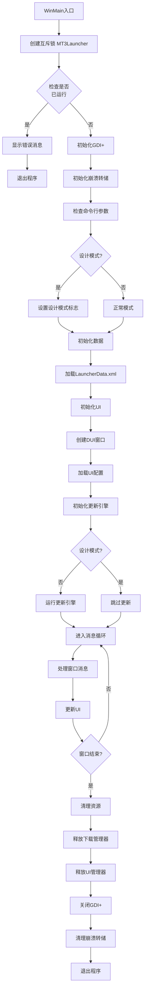

### 12.2 资源更新完整流程

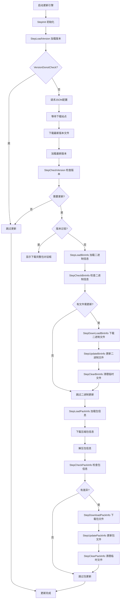

### 12.3 游戏启动流程

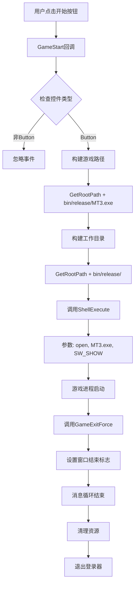

### 12.4 下载任务管理流程

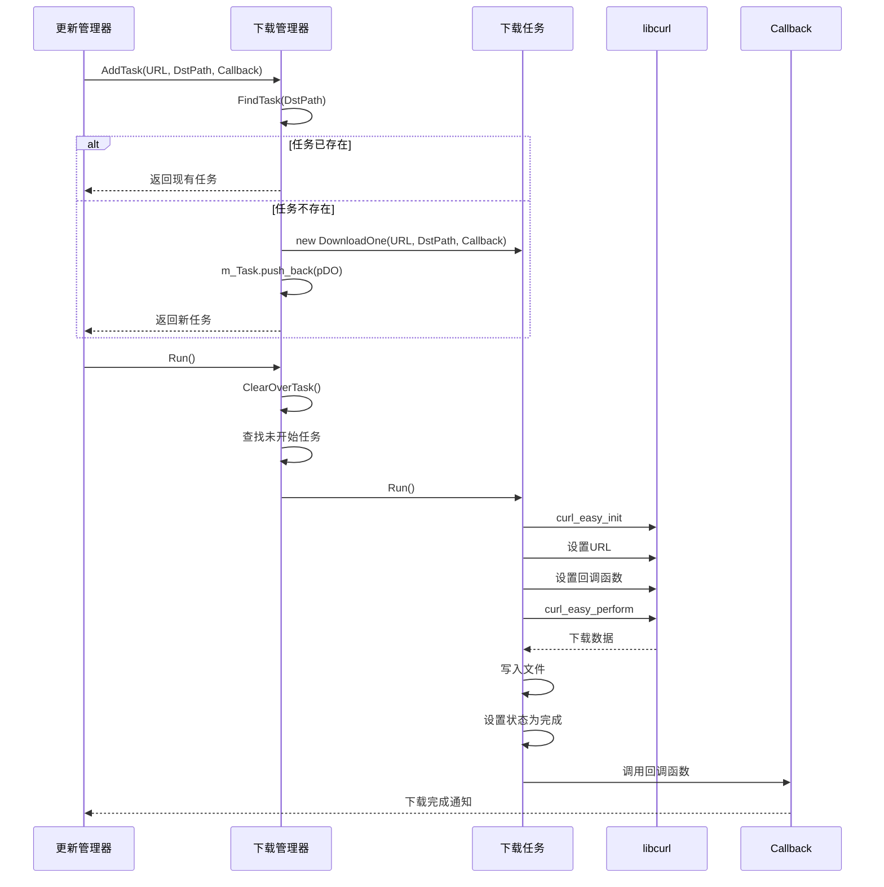

---

## 附录

### A. 文件清单

| 文件路径 | 说明 | 代码行数(估算) |
|---------|------|----------------|
| `client/Launcher/Code/Launcher.cpp` | 主程序入口 | ~100 |
| `client/Launcher/Code/Launcher.h` | 主程序头文件 | ~5 |
| `client/Launcher/Code/LauncherData.h` | 数据管理 | ~50 |
| `client/Launcher/Code/LauncherUI.h` | UI管理 | ~360 |
| `client/Launcher/Code/LauncherTools.h` | 工具类 | ~130 |
| `client/Launcher/Code/CrashDump.cpp` | 崩溃转储实现 | ~200 |
| `client/Launcher/Code/CrashDump.h` | 崩溃转储头文件 | ~10 |
| `client/Launcher/Code/Update/UpdateEngine.cpp` | 更新引擎实现 | ~85 |
| `client/Launcher/Code/Update/UpdateEngine.h` | 更新引擎头文件 | ~32 |
| `client/Launcher/Code/Update/UpdateManagerEx.cpp` | 更新管理器实现 | ~850 |
| `client/Launcher/Code/Update/UpdateManagerEx.h` | 更新管理器头文件 | ~106 |
| `client/Launcher/Code/Update/UpdateManagerEx_Helper.h` | 更新辅助函数 | ~520 |
| `client/Launcher/Code/Update/UpdateBin.h` | 二进制更新处理 | ~385 |
| `client/Launcher/Code/Update/UpdateJson.h` | JSON配置处理 | ~125 |
| `client/Launcher/Code/Update/JsonUtil.cpp` | JSON工具实现 | ~200 |
| `client/Launcher/Code/Update/JsonUtil.h` | JSON工具头文件 | ~50 |
| `client/Launcher/Code/Download/DownloadManager.h` | 下载管理器 | ~155 |
| `client/Launcher/Code/Download/DownloadOne.h` | 单文件下载 | ~100 |
| `client/Launcher/Code/UIControl/DUIWindowManager.h` | 窗口管理器 | ~155 |
| `client/Launcher/Code/UIControl/DUIWindow.h` | 窗口控件 | ~300 |
| `client/Launcher/Code/UIControl/DUIButton.h` | 按钮控件 | ~100 |
| `client/Launcher/Code/UIControl/DUILabel.h` | 标签控件 | ~80 |
| `client/Launcher/Code/UIControl/DUIImage.h` | 图片控件 | ~100 |
| `client/Launcher/Code/UIControl/DUIProgressBar.h` | 进度条控件 | ~80 |
| `client/Launcher/Code/Global/GlobalFunction.h` | 全局函数 | ~25 |
| `client/Launcher/Code/Utils/FileUtil.h` | 文件工具 | ~150 |
| `client/Launcher/Code/Utils/StringUtil.h` | 字符串工具 | ~100 |
| `client/Launcher/Code/Utils/SystemUtil.h` | 系统工具 | ~50 |
| **总计** | | **~6,100** |

### B. 配置文件清单

| 文件路径 | 说明 | 格式 |
|---------|------|------|
| `bin/release/LauncherData.xml` | 登录器配置 | XML |
| `res1/ver.ljvi` | 版本文件 | 二进制 |
| `res1/fl.ljpi` | 包信息文件 | 二进制 |
| `bin/release/cache/res1/ver.ljvi` | 缓存版本文件 | 二进制 |
| `bin/release/cache/res1/fl.ljpi` | 缓存包信息文件 | 二进制 |

### C. 术语表

| 术语 | 说明 |
|------|------|
| DUI | DirectUI，自定义UI框架 |
| LJFP | 乐游文件处理库 |
| LJFM | 乐游文件管理库 |
| LJXML | 乐游XML解析库 |
| SMS4 | 国密SM4对称加密算法 |
| CRC32 | 循环冗余校验32位 |
| ver.ljvi | 版本信息文件扩展名 |
| fl.ljpi | 文件列表信息扩展名 |
| fl.ljzip | 压缩的文件列表扩展名 |

---

**审计完成日期**: 2026-03-05
**审计人员**: AI架构师
**审计版本**: 1.0.0