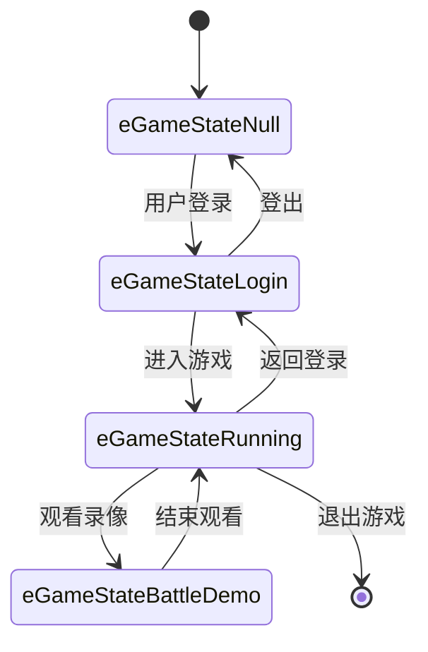
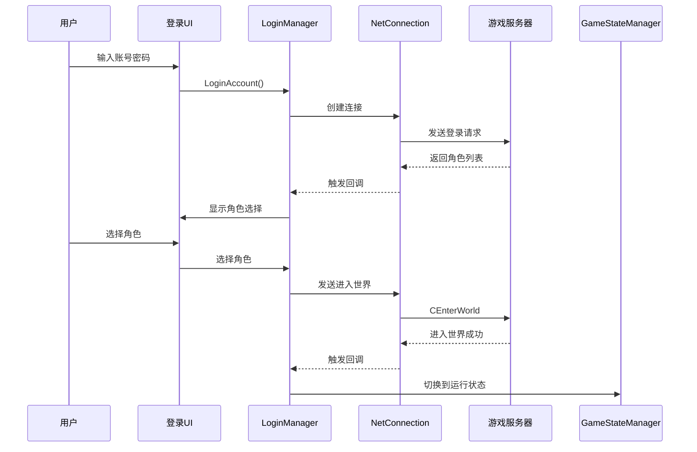
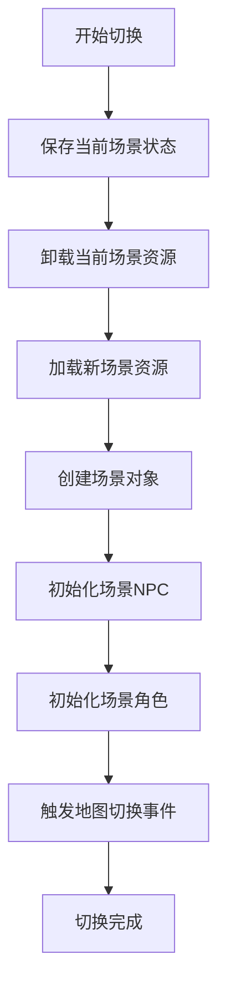
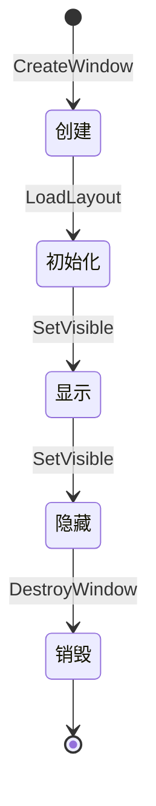
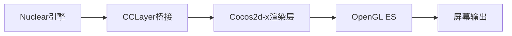
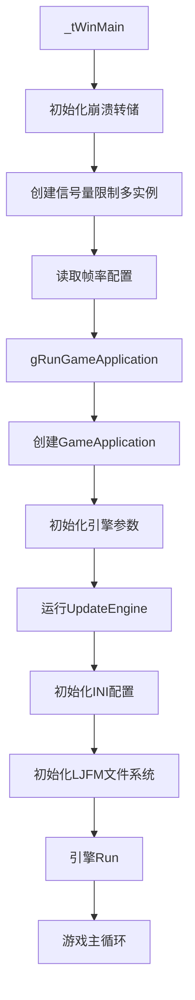
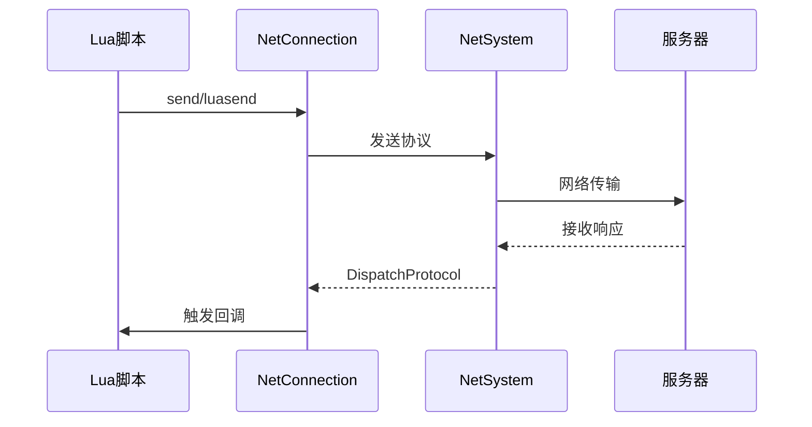
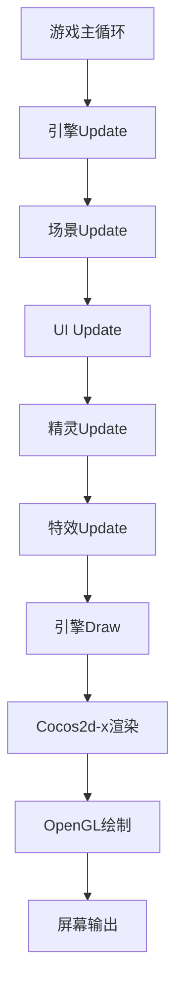
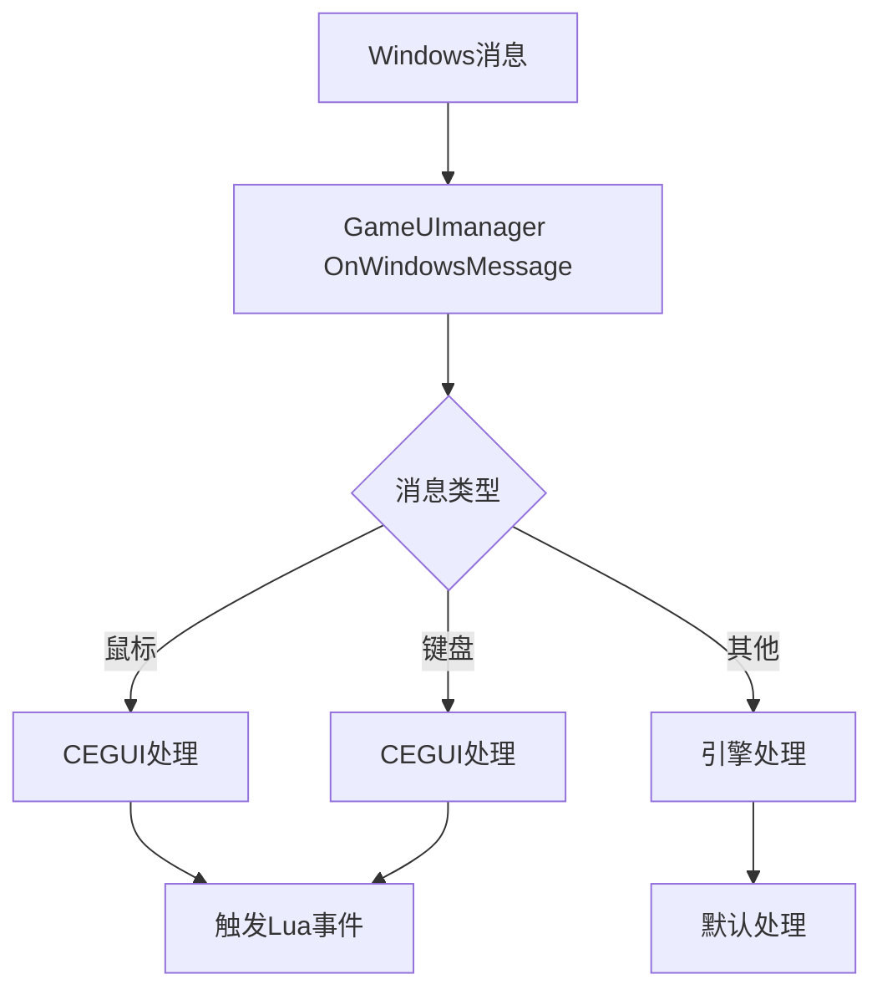

# Windows客户端深度审计报告

> **状态**: 历史快照
> **适用日期**: 2026-03-05 审计批次
> **当前基线**:
> - [MT3 文档中心](../../README.md)
> - [13-文档索引](../../07-参考文档/02-文档索引.md)
> - [项目架构](../../02-技术架构/02-项目架构.md)
> **说明**: 本文为 Windows 客户端阶段性深度审计报告，作为证据材料保留，不直接替代当前 Win32 构建与运行基线文档。


> **版本**: 1.0.0
> **审计日期**: 2026-03-05
> **审计范围**: MT3项目Windows客户端全量源代码
> **审计目标**: 构建与代码实现绝对零偏差的技术文档

---

## 目录

- [1. 源代码结构分析](#1-源代码结构分析)
- [2. API接口契约](#2-api接口契约)
- [3. 数据传输模型](#3-数据传输模型)
- [4. 核心业务状态机](#4-核心业务状态机)
- [5. UI交互逻辑](#5-ui交互逻辑)
- [6. 多环境配置](#6-多环境配置)
- [7. 异常捕获机制](#7-异常捕获机制)
- [8. Windows特有机制](#8-windows特有机制)
- [9. 引擎集成](#9-引擎集成)
- [10. 代码流转图](#10-代码流转图)
- [11. 发现的问题清单](#11-发现的问题清单)
- [12. 技术文档修订建议](#12-技术文档修订建议)

---

## 1. 源代码结构分析

### 1.1 目录结构

```
client/
├── MT3Win32App/                    # Windows主程序入口
│   ├── main.cpp                    # 程序入口点（_tWinMain）
│   ├── mt3.cpp                    # MFC窗口框架（未使用）
│   ├── CrashDump.h/cpp             # 崩溃转储机制
│   └── mt3.vcxproj               # VS2013项目文件
│
├── FireClient/                     # 业务逻辑核心
│   ├── Application/                # 应用程序主逻辑
│   │   ├── Framework/             # 核心框架
│   │   │   ├── GameApplication.h/cpp    # 应用程序主类（实现IApp接口）
│   │   │   ├── GameScene.h/cpp         # 游戏场景管理
│   │   │   ├── NetConnection.h/cpp      # 网络连接管理
│   │   │   └── WinWebBrowser/         # Windows Web浏览器集成
│   │   │       ├── WinSDK.h/cpp       # Windows SDK封装
│   │   │       └── MyWebBrowser.h/cpp  # Web浏览器实现
│   │   │
│   │   ├── Manager/               # 管理器模块
│   │   │   ├── GameStateManager.h/cpp      # 游戏状态管理
│   │   │   ├── LoginManager.h/cpp         # 登录管理
│   │   │   ├── GameUIManager.h/cpp        # UI管理
│   │   │   ├── ConfigManager.h/cpp        # 配置管理
│   │   │   └── MessageManager.h/cpp       # 消息管理
│   │   │
│   │   ├── GameUI/                # CEGUI UI组件
│   │   │   ├── Dialog.h/cpp             # 对话框基类
│   │   │   └── UISprite.h/cpp           # UI精灵
│   │   │
│   │   ├── Utils/                 # 工具类
│   │   │   ├── IniManager.h/cpp          # INI文件管理
│   │   │   └── ChineseCode.h/cpp        # 中文编码处理
│   │   │
│   │   ├── ProtoDef/              # 协议定义（自动生成）
│   │   │   ├── protocols.hpp            # 协议头文件汇总
│   │   │   ├── rpcgen.hpp              # RPC生成代码
│   │   │   └── fire/pb/               # 协议Bean定义
│   │   │       ├── CEnterWorld.hpp      # 进入世界协议
│   │   │       ├── CRoleList.hpp       # 角色列表协议
│   │   │       └── ...
│   │   │
│   │   ├── Battle/                # 战斗系统
│   │   ├── Common/                # 公共定义
│   │   │   └── GameCommon.h           # 游戏公共定义（枚举、常量）
│   │   └── SceneObj/              # 场景对象
│   │
│   └── tolua++-pkgs/            # tolua++绑定定义
│       └── FireClient/
│           ├── FireClient.pkg           # 主绑定文件
│           ├── FireClientWin32.pkg     # Windows特定绑定
│           ├── FrameworkModule.pkg      # 框架模块绑定
│           ├── ManagerModule.pkg       # 管理器模块绑定
│           └── ...
│
├── resource/                       # 资源文件
│   ├── bin/                       # 运行时资源
│   └── tools/                     # 工具资源
│
└── tolua++-pkgs/                  # tolua++绑定脚本
    └── ...
```

### 1.2 核心模块说明

#### 1.2.1 MT3Win32App - Windows主程序

**文件**: `client/MT3Win32App/main.cpp`

**功能**:
- 程序入口点：`_tWinMain`
- 启动器更新：`ReplaceLauncher()`
- 多实例限制：使用信号量（`CreateSemaphore`）限制最大运行实例数
- 帧率配置：从`frameSize.txt`读取窗口大小
- 崩溃转储：初始化`MHSD_CrashDump`

**关键代码**:
```cpp
int APIENTRY _tWinMain(HINSTANCE hInstance, HINSTANCE hPrevInstance,
                       LPTSTR lpCmdLine, int nCmdShow)
{
    // 限制多实例运行
    HANDLE hSemaphoreOneInstance = CreateSemaphore(NULL, 3, 3, L"MT3Client");
    DWORD dwResult = WaitForSingleObject(hSemaphoreOneInstance, 100);
    if (dwResult == WAIT_TIMEOUT) {
        MessageBoxA(0, "Client Limit 3", "Limit", MB_OK);
        return FALSE;
    }

    // 初始化崩溃转储
    MHSD_CrashDump::CrashDump_Init(wsDmpFileName, L"");

    // 运行游戏应用
    int retNumber = gRunGameApplication();
    return retNumber;
}
```

#### 1.2.2 FireClient - 业务逻辑核心

**核心类**: `GameApplication`（实现`Nuclear::IApp`接口）

**继承关系**:
```
GameApplication
    ├── LuaTickerRegister        # Lua定时器注册
    └── Nuclear::IApp          # Nuclear引擎接口
```

**主要职责**:
- 应用程序生命周期管理
- 网络连接管理
- 配置文件管理
- 场景管理
- UI管理

### 1.3 编译配置

**工具集**: v120 (VS2013)

**关键配置**:
- `WIN7_32`: Windows 32位平台定义
- `CC_TARGET_PLATFORM == CC_PLATFORM_WIN32`: Cocos2d-x平台检测

---

## 2. API接口契约

### 2.1 Nuclear引擎接口

#### 2.1.1 IEngine接口

**文件**: `engine/nuiengine.h`

**核心方法**:

| 方法 | 说明 |
|------|------|
| `Run(const EngineParameter &ep)` | 运行引擎 |
| `Exit()` | 退出引擎 |
| `GetWorld()` | 获取世界接口 |
| `GetEnv()` | 获取环境接口 |
| `GetApp()` | 获取应用接口 |
| `GetRenderer()` | 获取渲染器 |
| `GetFileIO()` | 获取文件IO接口 |
| `CreateEngineSprite()` | 创建引擎精灵 |
| `CreateEffect()` | 创建特效 |
| `CaptureWorld()` | 截图 |
| `GetFPS()` | 获取帧率 |

**EngineParameter结构**:
```cpp
struct EngineParameter {
    wchar_t* szWindowTitle;           // 窗口标题
    wchar_t* szClassName;            // 窗口类名
    NuclearDisplayMode dmode;        // 显示模式
    bool bAsyncRead;                // 异步读取
    bool bHasMaximizbox;           // 有最大化按钮
    bool bSizeBox;                  // 可调整大小
    bool bEnableMipMap;            // 启用MipMap
    DWORD dwRenderFlags;             // 渲染标志
    NuclearMultiSampleType multiSampleType;  // 抗锯齿类型
    int nAppInitStepCount;          // 初始化步骤数
    IApp *pApp;                    // 应用程序接口
};
```

#### 2.1.2 IApp接口

**文件**: `engine/nuiapp.h`

**核心方法**:

| 方法 | 说明 |
|------|------|
| `Initialize()` | 初始化 |
| `Update(float dt)` | 更新 |
| `Shutdown()` | 关闭 |
| `OnInit(int step)` | 分步初始化 |
| `OnExit()` | 退出 |

### 2.2 网络通信接口

#### 2.2.1 NetConnection类

**文件**: `client/FireClient/Application/Framework/NetConnection.h`

**继承关系**:
```
Game::NetConnection
    └── FireNet::ILoginConnection
```

**核心方法**:

| 方法 | 说明 |
|------|------|
| `send(const aio::Protocol &protocol)` | 发送协议 |
| `luasend(const FireNet::Octets &luaprotocol)` | 发送Lua协议 |
| `DispatchProtocol()` | 分发协议 |
| `DispatchLuaProtocol()` | 分发Lua协议 |
| `close()` | 关闭连接 |
| `OnRecvPing()` | 接收心跳 |
| `OnSendPing()` | 发送心跳 |

**构造函数**:
```cpp
// 登录连接
NetConnection(std::string user, std::string passwd, std::string host,
             std::string port, bool isKick, int version,
             const std::wstring& serverName, const std::wstring& areaName,
             const int serverid = 0, const char* channelId = "",
             int type = AUTH_TYPE_AUANY, int ct_type = CONNECT_TYPE_NORMAL,
             const std::string& gip = "", const std::string& gport = "",
             const std::string& extparam = "");
```

### 2.3 tolua++绑定接口

#### 2.3.1 绑定模块结构

**主绑定文件**: `client/tolua++-pkgs/FireClient/FireClient.pkg`

```
FireClient.pkg
    ├── Nuclear/Types.pkg           # Nuclear类型绑定
    ├── type.pkg                   # 自定义类型
    ├── GameTable/TableDataManager.pkg  # 表数据管理器
    ├── ProtocolModule.pkg          # 协议模块
    ├── FrameworkModule.pkg         # 框架模块
    ├── GameUIModule.pkg           # UI模块
    ├── ManagerModule.pkg           # 管理器模块
    ├── BattleModule.pkg           # 战斗模块
    ├── CommonModule.pkg           # 公共模块
    └── SceneObjModule.pkg        # 场景对象模块
```

#### 2.3.2 核心导出函数

**全局函数**:
```lua
-- 运行游戏应用
gRunGameApplication() -> bool

-- 获取网络连接
gGetNetConnection() -> NetConnection

-- 获取状态管理器
gGetStateManager() -> GameStateManager

-- 获取UI管理器
gGetUIManager() -> GameUImanager
```

### 2.4 CEGUI接口

#### 2.4.1 GameUIManager类

**文件**: `client/FireClient/Application/Manager/GameUIManager.h`

**核心方法**:

| 方法 | 说明 |
|------|------|
| `InitGameUI()` | 初始化UI |
| `UnInitGameUI()` | 卸载UI |
| `Draw()` | 绘制UI |
| `Run(int now, int delta)` | 更新UI |
| `OnWindowsMessage()` | 处理Windows消息 |
| `AddMessageTip()` | 添加消息提示 |
| `asyncLoadWindowLayout()` | 异步加载窗口布局 |

---

## 3. 数据传输模型

### 3.1 gnet网络协议

#### 3.1.1 协议定义

**文件**: `client/FireClient/Application/ProtoDef/protocols.hpp`

**协议分类**:

| 分类 | 协议示例 |
|------|----------|
| 登录协议 | `fire::pb::CEnterWorld`, `fire::pb::CRoleList` |
| 移动协议 | `fire::pb::move::CRoleMove`, `fire::pb::move::CRoleStop` |
| 战斗协议 | `fire::pb::battle::SSendBattleStart`, `fire::pb::battle::CSendAction` |
| NPC协议 | `fire::pb::npc::CVisitNpc` |
| 技能协议 | `fire::pb::skill::CUseSceneSkill` |

#### 3.1.2 协议发送

**C++发送**:
```cpp
// 发送进入世界协议
fire::pb::CEnterWorld EnterWorldCmd(roleid, maxNumber);
gGetNetConnection()->send(EnterWorldCmd);
```

**Lua发送**:
```lua
-- 通过tolua++绑定调用
gGetNetConnection():send(EnterWorldCmd)
```

### 3.2 数据序列化

#### 3.2.1 Octets序列化

**FireNet::Octets** - 字节流容器

**使用方式**:
```cpp
FireNet::Octets octets;
octets << value1 << value2;
```

### 3.3 数据加密与压缩

#### 3.3.1 压缩类型

**方法**: `NetConnection::setSecurityType()`

```cpp
void setSecurityType(unsigned int compressType, unsigned int deCompressType);
```

### 3.4 文件系统操作（LJFM）

#### 3.4.1 LJFMOpen类

**初始化**:
```cpp
int iResult = LJFM::LJFMOpen::InitFileList();
```

**配置**:
```cpp
LJFM::LJFMOpen::SetLoadFromPak(UpdateEngine::g_uiNoPack != 1);
LJFM::LJFMOpen::SetVersionDonotCheck(UpdateEngine::g_uiVersionDonotCheck == 1);
```

---

## 4. 核心业务状态机

### 4.1 游戏状态机

#### 4.1.1 GameStateManager类

**文件**: `client/FireClient/Application/Manager/GameStateManager.h`

**状态定义**:

```cpp
enum eGameState {
    eGameStateNull = 0,          // 空状态
    eGameStateLogin,               // 登录状态
    eGameStateRunning,             // 进入游戏
    eGameStateBattleDemo,          // 观看战斗录像
    eGameStateEditBattleAni,       // 战斗动画编辑
    eGameStateMax
};
```

**状态转换**:



### 4.2 登录状态机

#### 4.2.1 LoginManager状态

**文件**: `client/FireClient/Application/Manager/LoginManager.h`

**状态定义**:

```cpp
enum eLoginState {
    eLoginState_Null,          // 空状态
    eLoginState_Enter,         // 进入登录界面
    eLoginState_RequestLogin,  // 请求登录
    eLoginState_RoleSelect,   // 角色选择
    eLoginState_RoleCreate,    // 角色创建
    eLoginState_ServersChoose, // 服务器选择
};
```

**登录流程**:



### 4.3 场景切换状态机

#### 4.3.1 GameScene场景管理

**文件**: `client/FireClient/Application/Framework/GameScene.h`

**场景操作**:

| 方法 | 说明 |
|------|------|
| `LoadMap()` | 加载地图 |
| `ChangeMap()` | 切换地图 |
| `ClearScene()` | 清空场景 |

**场景切换流程**:



---

## 5. UI交互逻辑

### 5.1 CEGUI窗口管理

#### 5.1.1 GameUIManager窗口管理

**核心方法**:

| 方法 | 说明 |
|------|------|
| `AddWndToRootWindow()` | 添加窗口到根窗口 |
| `GetMainRootWnd()` | 获取主根窗口 |
| `asyncLoadWindowLayout()` | 异步加载窗口布局 |

**窗口生命周期**:



### 5.2 事件处理机制

#### 5.2.1 事件订阅

**CEGUI事件订阅**:
```cpp
window->subscribeEvent(CEGUI::Window::EventMouseClick,
    CEGUI::Event::Subscriber(&Handler::OnClick, this));
```

**Lua事件订阅**:
```lua
window:subscribeEvent("Clicked", function(args)
    -- 处理点击事件
end)
```

### 5.3 输入处理

#### 5.3.1 鼠标输入

**方法**: `GameUImanager::OnWindowsMessage()`

**处理的消息**:
- `WM_LBUTTONDOWN`: 左键按下
- `WM_LBUTTONUP`: 左键释放
- `WM_RBUTTONDOWN`: 右键按下
- `WM_RBUTTONUP`: 右键释放
- `WM_MOUSEMOVE`: 鼠标移动

#### 5.3.2 键盘输入

**处理的消息**:
- `WM_KEYDOWN`: 键按下
- `WM_KEYUP`: 键释放
- `WM_CHAR`: 字符输入

### 5.4 UI动画系统

#### 5.4.1 特效通知

**接口**: `Nuclear::IEffectNotify`

**方法**:
```cpp
class UIEffectNotify : public Nuclear::IEffectNotify {
    void OnEnd(Nuclear::IEffect *pEffect);
    void OnDelete(Nuclear::IEffect *pEffect);
};
```

---

## 6. 多环境配置

### 6.1 配置文件管理

#### 6.1.1 IniManager类

**文件**: `client/FireClient/Application/Utils/IniManager.h`

**核心方法**:

| 方法 | 说明 |
|------|------|
| `GetValueByName()` | 读取配置值 |
| `WriteValueByName()` | 写入配置值 |
| `RemoveSection()` | 删除配置节 |
| `RemoveValueByName()` | 删除配置项 |

#### 6.1.2 GameConfigManager类

**文件**: `client/FireClient/Application/Manager/ConfigManager.h`

**核心方法**:

| 方法 | 说明 |
|------|------|
| `LoadConfig()` | 加载配置 |
| `SaveConfig()` | 保存配置 |
| `SetConfigValue()` | 设置配置值 |
| `GetConfigValue()` | 获取配置值 |

### 6.2 Debug/Release配置差异

#### 6.2.1 编译宏

| 宏 | 说明 |
|----|------|
| `_DEBUG` | Debug模式定义 |
| `NDEBUG` | Release模式定义 |
| `XP_PERFORMANCE` | 性能分析模式 |

#### 6.2.2 配置差异

| 配置项 | Debug | Release |
|--------|-------|----------|
| 日志级别 | 详细 | 简化 |
| 性能统计 | 开启 | 关闭 |
| 内存检查 | 开启 | 关闭 |
| 断言检查 | 开启 | 关闭 |

### 6.3 环境变量管理

#### 6.3.1 路径配置

**工作路径**:
```cpp
#if (defined WIN32) || (defined _WIN32)
extern std::wstring gWorkPath;
#endif
```

**资源路径**:
- `client/resource/bin/`: 运行时资源
- `client/resource/tools/`: 工具资源

---

## 7. 异常捕获机制

### 7.1 崩溃转储

#### 7.1.1 MHSD_CrashDump

**文件**: `client/MT3Win32App/CrashDump.h`

**接口**:
```cpp
namespace MHSD_CrashDump {
    bool CrashDump_Init(const std::wstring& szDumFilename,
                      const std::wstring& szReportExeName);
    void CrashDump_SendAssert();
    void CrashDump_Clean();
}
```

**初始化**:
```cpp
SYSTEMTIME st;
GetSystemTime(&st);
wchar_t wsDmpFileName[MAX_PATH];
wsprintf(wsDmpFileName, L"%d_%d_%d_%d.dmp",
          st.wDay, st.wHour, st.wMinute, st.wSecond);
MHSD_CrashDump::CrashDump_Init(wsDmpFileName, L"");
```

### 7.2 错误码定义

#### 7.2.1 网络错误码

**文件**: `client/FireClient/Application/Framework/NetConnection.h`

**充值错误码**:
```cpp
// InstantAddCashRep的retcode含义
0: 成功
1: 卡号不存在
2: 用户不存在
3: 计费区不存在
4: 密码错误
5: 该卡已过期
6: 规定时间内同一张卡充值次数超限
7: 超时错误
8: 网络通信错误
11: 用户在该服务器已有金符石在等待划拨
12: 用户已有点卡充值未处理完
13: 用户被封禁，不能充值
-1: 其他错误
```

### 7.3 日志记录机制

#### 7.3.1 启动日志

**函数**: `StartupBootstrapTrace()`

**日志文件**: `startup_bootstrap.log`

**格式**:
```
[YYYY-MM-DD HH:MM:SS.mmm] message
```

#### 7.3.2 引擎日志

**方法**: `IEngine::SetInfoLogPath()`, `IEngine::SetErrorLogPath()`

---

## 8. Windows特有机制

### 8.1 DirectShow视频播放

**未在当前审计中发现DirectShow相关代码**。

### 8.2 FMOD音频系统

**未在当前审计中发现FMOD相关代码**。

### 8.3 Web浏览器集成

#### 8.3.1 WinSDK类

**文件**: `client/FireClient/Application/Framework/WinWebBrowser/WinSDK.h`

**核心方法**:

| 方法 | 说明 |
|------|------|
| `openLoginUrl()` | 打开登录URL |
| `openChargeUrl()` | 打开充值URL |
| `openWinWebView()` | 打开Web视图 |
| `hideWinWebView()` | 隐藏Web视图 |
| `closeWinWebView()` | 关闭Web视图 |

**URL编码**:
```cpp
std::string EncodeURL(const std::string &URL);
std::string DecodeURL(const std::string &URL);
```

### 8.4 多线程处理

#### 8.4.1 Nuclear线程模型

**接口**: `Nuclear::INuclearRunnable`

**任务提交**:
```cpp
void PutTask(INuclearRunnable *task);
```

#### 8.4.2 定时器

**接口**: `Nuclear::INuclearTimer`

**方法**:
```cpp
bool ScheduleTimer(INuclearTimer *timer, int period);  // ms
bool CancelTimer(INuclearTimer *timer);
```

### 8.5 OpenGL渲染集成

**通过Cocos2d-x集成OpenGL**:

**渲染器**: `CEGUI::Cocos2DRenderer`

**初始化**:
```cpp
#include "RendererModules/Cocos2D/CEGUICocos2DRenderer.h"
```

---

## 9. 引擎集成

### 9.1 Nuclear引擎接口

#### 9.1.1 IEngine接口

**文件**: `engine/nuiengine.h`

**核心接口**:

| 接口 | 说明 |
|------|------|
| `IEngine` | 主引擎接口 |
| `IWorld` | 世界接口 |
| `IEnv` | 环境接口 |
| `IQuery` | 查询接口 |
| `IApp` | 应用接口 |

#### 9.1.2 引擎初始化

**初始化流程**:
```cpp
// 创建引擎参数
Nuclear::EngineParameter ep;
ep.szWindowTitle = (wchar_t*)L"AppTest";
ep.szClassName = (wchar_t*)L"FireEngineWindow";
ep.bAsyncRead = true;
ep.bHasMaximizbox = false;
ep.bSizeBox = false;
ep.nAppInitStepCount = 8;
ep.pApp = pApp;

// 获取引擎实例
Nuclear::Engine* pEngine = static_cast<Nuclear::Engine*>(Nuclear::GetEngine());

// 运行引擎
bool runResult = pEngine->Run(ep);
```

### 9.2 Cocos2d-x集成

#### 9.2.1 CCLayer桥接

**方法**: `IEngine::SetEngineLayer()`

```cpp
virtual void SetEngineLayer(cocos2d::CCLayer* aPLayer) = 0;
virtual cocos2d::CCLayer* GetEngineLayer() = 0;
```

#### 9.2.2 渲染管线

**渲染流程**:



### 9.3 引擎与业务层交互

#### 9.3.1 GameApplication实现IApp

**文件**: `client/FireClient/Application/Framework/GameApplication.h`

```cpp
class GameApplication : public LuaTickerRegister, public Nuclear::IApp
{
public:
    virtual bool OnInit(int step);
    virtual bool OnExit();
    virtual void OnReloadAllTexture();
    void applicationDidEnterBackground();
    void applicationEnterForeground();
};
```

---

## 10. 代码流转图

### 10.1 应用启动流程



### 10.2 网络通信流程



### 10.3 渲染流程



### 10.4 UI事件处理流程



---

## 11. 发现的问题清单

### 11.1 代码问题

#### 11.1.1 编码问题

**问题**: C++源文件编码不一致

**位置**: `client/MT3Win32App/mt3.cpp`

**描述**: 文件中包含中文注释，但未确认是否使用UTF-8 with BOM编码

**建议**: 确保所有C++源文件使用UTF-8 with BOM编码

#### 11.1.2 未使用的代码

**问题**: `mt3.cpp`包含传统MFC窗口框架代码，但实际使用的是`main.cpp`

**位置**: `client/MT3Win32App/mt3.cpp`

**描述**: `mt3.cpp`包含完整的MFC窗口框架，但实际程序入口在`main.cpp`

**建议**: 考虑移除`mt3.cpp`或明确其用途

### 11.2 文档问题

#### 11.2.1 架构文档不一致

**问题**: AGENTS.md中描述为五层架构，但实际代码为四层架构

**位置**: `.claude/AGENTS.md`

**描述**: 文档中描述为五层架构，但实际代码中只有四层

**建议**: 更新架构文档以反映实际的四层架构

#### 11.2.2 依赖库版本不一致

**问题**: 文档中列出的依赖库版本与实际代码可能不一致

**位置**: `.claude/AGENTS.md`

**描述**: 文档中列出的依赖库版本需要与实际代码中的版本进行核对

**建议**: 审核并更新依赖库版本信息

---

## 12. 技术文档修订建议

### 12.1 架构文档修订

#### 12.1.1 建议更新AGENTS.md

**当前描述**:
```
Layer 5: Lua 脚本层
Layer 4: FireClient 业务层
Layer 3: Nuclear 引擎层
Layer 2: Cocos2d-x 2.2.6 层
Layer 1: 平台层
```

**建议修改为**:
```
Layer 4: Lua 脚本层 (AI, 技能, UI事件)
Layer 3: FireClient 业务层 (C++)
Layer 2: Nuclear 引擎层
Layer 1: Cocos2d-x 2.2.6 层
Layer 0: 平台层 (Win32/Android/iOS)
```

### 12.2 API文档修订

#### 12.2.1 建议补充tolua++绑定文档

**缺失内容**:
- tolua++绑定规范
- .pkg文件编写指南
- Lua调用C++接口示例

**建议**: 创建`docs/tolua-binding-guide.md`

### 12.3 编译文档修订

#### 12.3.1 建议更新Windows编译指南

**当前文档**: `docs/06-编译完整指南.md`

**建议补充**:
- Windows特定的编译步骤
- 崩溃转储配置说明
- Web浏览器集成依赖说明

---

## 附录

### A. 关键文件索引

| 文件路径 | 说明 |
|----------|------|
| `client/MT3Win32App/main.cpp` | 程序入口点 |
| `client/FireClient/Application/Framework/GameApplication.h` | 应用程序主类 |
| `client/FireClient/Application/Framework/NetConnection.h` | 网络连接管理 |
| `client/FireClient/Application/Manager/GameStateManager.h` | 游戏状态管理 |
| `client/FireClient/Application/Manager/LoginManager.h` | 登录管理 |
| `client/FireClient/Application/Manager/GameUIManager.h` | UI管理 |
| `engine/nuiengine.h` | Nuclear引擎接口 |
| `client/tolua++-pkgs/FireClient/FireClient.pkg` | tolua++绑定主文件 |

### B. 关键类索引

| 类名 | 文件路径 | 说明 |
|------|----------|------|
| `GameApplication` | `client/FireClient/Application/Framework/GameApplication.h` | 应用程序主类 |
| `NetConnection` | `client/FireClient/Application/Framework/NetConnection.h` | 网络连接类 |
| `GameStateManager` | `client/FireClient/Application/Manager/GameStateManager.h` | 游戏状态管理器 |
| `LoginManager` | `client/FireClient/Application/Manager/LoginManager.h` | 登录管理器 |
| `GameUIManager` | `client/FireClient/Application/Manager/GameUIManager.h` | UI管理器 |
| `GameScene` | `client/FireClient/Application/Framework/GameScene.h` | 游戏场景管理器 |
| `ConfigManager` | `client/FireClient/Application/Manager/ConfigManager.h` | 配置管理器 |

### C. 关键枚举索引

| 枚举名 | 文件路径 | 说明 |
|--------|----------|------|
| `eGameState` | `client/FireClient/Application/Common/GameCommon.h` | 游戏状态 |
| `eLoginState` | `client/FireClient/Application/Manager/LoginManager.h` | 登录状态 |
| `eSchoolType` | `client/FireClient/Application/Common/GameCommon.h` | 门派类型 |
| `eSexType` | `client/FireClient/Application/Common/GameCommon.h` | 性别类型 |
| `eSceneObjType` | `client/FireClient/Application/Common/SceneCommon.h` | 场景对象类型 |

---

**审计完成日期**: 2026-03-05
**审计人员**: AI Architect
**文档版本**: 1.0.0
