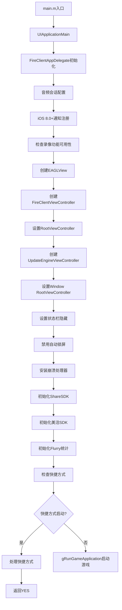
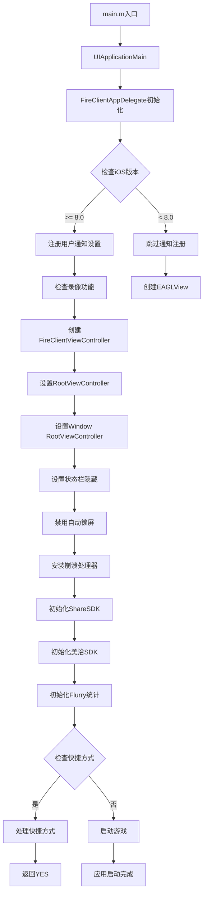
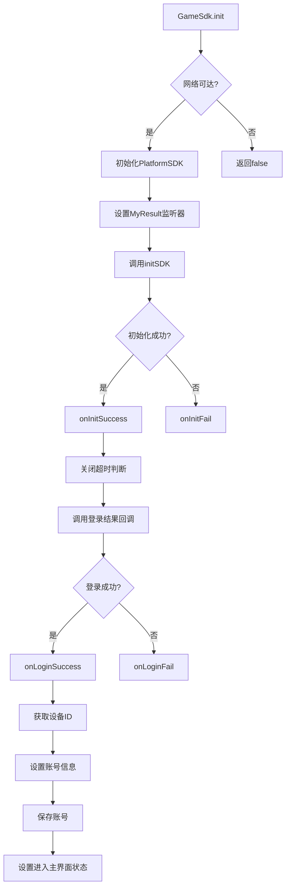
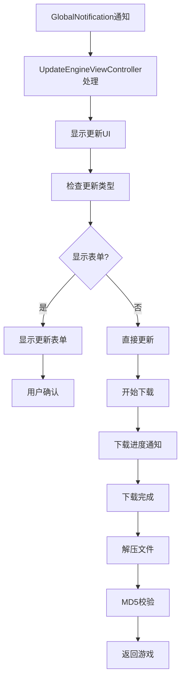

# iOS客户端深度审计报告

> **状态**: 历史快照
> **适用日期**: 2026-03-04 源代码审计 + 2026-03-05 深度审计批次
> **当前基线**:
> - [MT3 文档中心](../../README.md)
> - [文档索引](../../07-参考文档/02-文档索引.md)
> - [项目架构](../../02-技术架构/02-项目架构.md)
> **说明**: 本文为 iOS 客户端阶段性深度审计报告，作为证据材料保留，不直接替代当前平台基线文档。


> **版本**: 1.0.0  
> **审计日期**: 2026-03-05  
> **审计范围**: MT3项目iOS客户端全量源代码  
> **审计路径**: `client/FireClient/FireClient/`  
> **代码语言**: Objective-C++ / Objective-C / Lua混合

---

## 1. 源代码结构分析

### 1.1 核心文件清单

#### 1.1.1 应用程序入口与生命周期

| 文件 | 行数 | 功能描述 |
|------|--------|----------|
| [`main.m`](../../../client/FireClient/FireClient/main.m) | 13 | iOS应用标准入口点，初始化NSAutoreleasePool并调用UIApplicationMain |
| [`FireClientAppDelegate.h`](../../../client/FireClient/FireClient/FireClientAppDelegate.h) | - | 应用程序委托接口定义 |
| [`FireClientAppDelegate.mm`](../../../client/FireClient/FireClient/FireClientAppDelegate.mm) | 719 | 应用程序委托实现，核心生命周期管理 |
| [`FireClientViewController.h`](../../../client/FireClient/FireClient/FireClientViewController.h) | - | 视图控制器接口定义 |
| [`FireClientViewController.mm`](../../../client/FireClient/FireClient/FireClientViewController.mm) | 898 | 视图控制器实现，UI交互逻辑 |

#### 1.1.2 SDK集成与第三方服务

| 文件 | 行数 | 功能描述 |
|------|--------|----------|
| [`GameSdk.h`](../../../client/FireClient/FireClient/GameSdk.h) | - | 游戏SDK接口定义 |
| [`GameSdk.mm`](../../../client/FireClient/FireClient/GameSdk.mm) | 254 | 游戏SDK实现，登录/支付/退出回调 |
| [`GlobalNotification.mm`](../../../client/FireClient/FireClient/GlobalNotification.mm) | 103 | 全局通知系统，更新引擎通知 |
| [`LocalNotify.h`](../../../client/FireClient/FireClient/LocalNotify.h) | - | 本地通知接口定义 |
| [`LocalNotify.mm`](../../../client/FireClient/FireClient/LocalNotify.mm) | 131 | 本地通知实现，开服提醒 |
| [`IOSDeviceInfo.h`](../../../client/FireClient/FireClient/IOSDeviceInfo.h) | - | iOS设备信息接口定义 |
| [`IOSDeviceInfo.mm`](../../../client/FireClient/FireClient/IOSDeviceInfo.mm) | 398 | iOS设备信息实现，CPU/内存/MAC地址获取 |
| [`UpdateEngineViewController.h`](../../../client/FireClient/FireClient/UpdateEngineViewController.h) | - | 更新引擎视图控制器接口定义 |
| [`UpdateEngineViewController.mm`](../../../client/FireClient/FireClient/UpdateEngineViewController.mm) | 631 | 更新引擎视图控制器实现，版本更新UI |
| [`WebViewController.h`](../../../client/FireClient/FireClient/WebViewController.h) | - | Web视图控制器接口定义 |
| [`WebViewController.mm`](../../../client/FireClient/FireClient/WebViewController.mm) | 31 | Web视图控制器实现，内嵌Web视图 |
| [`ScreenRecordController.h`](../../../client/FireClient/FireClient/ScreenRecordController.h) | - | 屏幕录制控制器接口定义 |
| [`ScreenRecordController.mm`](../../../client/FireClient/FireClient/ScreenRecordController.mm) | - | 屏幕录制控制器实现 |
| [`ShareSdkViewController.h`](../../../client/FireClient/FireClient/ShareSdkViewController.h) | - | 分享SDK视图控制器接口定义 |
| [`ShareSdkViewController.mm`](../../../client/FireClient/FireClient/ShareSdkViewController.mm) | - | 分享SDK视图控制器实现 |

#### 1.1.3 第三方SDK目录

| 目录 | 功能描述 |
|------|----------|
| `SDK_Locojoy/` | 乐游平台SDK |
| `ShareSDK/` | ShareSDK分享组件 |
| `TalkingData/` | TalkingData统计SDK |
| `Chartboost_sdk/` | Chartboost广告SDK |
| `Meiqia-SDK-files/` | 美洽客服SDK |
| `Statustucs_Locojoy/` | Statustucs统计SDK |

### 1.2 Info.plist配置分析

[`FireClient-Info.plist`](../../../client/FireClient/FireClient/FireClient-Info.plist) 包含以下关键配置：

#### 1.2.1 应用基础信息

```xml
<key>CFBundleDisplayName</key>
<string>梦幻西游</string>
<key>CFBundleShortVersionString</key>
<string>0.0.71</string>
<key>CFBundleVersion</key>
<string>0.0.71</string>
```

#### 1.2.2 游戏配置

```xml
<key>APPID</key>
<string>10024</string>
<key>APPKEY</key>
<string>8e55941bae2170d58170f8f3b85ed069</string>
<key>GAMEID</key>
<string>88</string>
<key>GAMEKEY</key>
<string>b18a26ffc632752987bd24a7bf0353f3</string>
```

#### 1.2.3 渠道配置

```xml
<key>CHANNEL_ID</key>
<string>108800000</string>
<key>IS_CARD_SERVER</key>
<true/>
```

#### 1.2.4 URL Scheme配置

支持以下URL Scheme：
- `com.ytlocojoy.immt3` - 支付宝
- `wxf371ae989c3b889a` - 微信
- `wx9ae4a3a2c9a54855` - 微信（卡服）
- `QQ05FB8B52` - QQ
- `wb858896314` - 新浪微博
- `com.locojoy.immt3` - 乐游

#### 1.2.5 快捷方式配置

```xml
<key>UIApplicationShortcutItems</key>
<array>
    <dict>
        <key>UIApplicationShortcutItemType</key>
        <string>1</string>
        <key>UIApplicationShortcutItemTitle</key>
        <string>查看拍卖</string>
        <key>UIApplicationShortcutItemIconFile</key>
        <string>shortcutItemIcon_stall.png</string>
    </dict>
    <dict>
        <key>UIApplicationShortcutItemType</key>
        <string>2</string>
        <key>UIApplicationShortcutItemTitle</key>
        <string>好友聊天</string>
        <key>UIApplicationShortcutItemIconFile</key>
        <string>shortcutItemIcon_friend.png</string>
    </dict>
    <dict>
        <key>UIApplicationShortcutItemType</key>
        <string>3</string>
        <key>UIApplicationShortcutItemTitle</key>
        <string>活动</string>
        <key>UIApplicationShortcutItemIconFile</key>
        <string>shortcutItemIcon_activity.png</string>
    </dict>
</array>
```

#### 1.2.6 权限与功能配置

```xml
<key>NSLocationWhenInUseUsageDescription</key>
<string>是否获取自己的位置,显示到游戏中(只显示到市级区域)</string>
<key>UIRequiresFullScreen</key>
<true/>
<key>UIStatusBarHidden</key>
<true/>
<key>UISupportedInterfaceOrientations</key>
<array>
    <string>UIInterfaceOrientationLandscapeRight</string>
    <string>UIInterfaceOrientationLandscapeLeft</string>
</array>
```

---

## 2. API接口契约

### 2.1 应用生命周期接口

#### 2.1.1 UIApplicationDelegate协议实现

[`FireClientAppDelegate.mm`](../../../client/FireClient/FireClient/FireClientAppDelegate.mm:116-706) 实现以下生命周期方法：

```objective-c
// 应用启动完成
- (BOOL)application:(UIApplication *)application 
    didFinishLaunchingWithOptions:(NSDictionary *)launchOptions;

// 应用即将失去焦点
- (void)applicationWillResignActive:(UIApplication *)application;

// 应用获得焦点
- (void)applicationDidBecomeActive:(UIApplication *)application;

// 应用进入后台
- (void)applicationDidEnterBackground:(UIApplication *)application;

// 应用即将进入前台
- (void)applicationWillEnterForeground:(UIApplication *)application;

// 应用即将终止
- (void)applicationWillTerminate:(UIApplication *)application;

// 内存警告
- (void)applicationDidReceiveMemoryWarning:(UIApplication *)application;

// 处理快捷方式
- (void)application:(UIApplication *)application 
    performActionForShortcutItem:(UIApplicationShortcutItem *)shortcutItem 
    completionHandler:(void (^)(BOOL))completionHandler;

// 处理URL打开
- (BOOL)application:(UIApplication *)application 
    handleOpenURL:(NSURL *)url 
    sourceApplication:(NSString *)sourceApplication 
    annotation:(id)annotation;

// 注册推送Token
- (void)application:(UIApplication *)application 
    didRegisterForRemoteNotificationsWithDeviceToken:(NSData *)deviceToken;

// 注册通知设置
- (void)application:(UIApplication *)application 
    didRegisterUserNotificationSettings:(UIUserNotificationSettings *)notificationSettings;

// 接收本地通知
- (void)application:(UIApplication *)application 
    didReceiveLocalNotification:(UILocalNotification *)notification;
```

#### 2.1.2 应用启动流程



### 2.2 游戏SDK接口契约

#### 2.2.1 GameSdk回调接口

[`GameSdk.mm`](../../../client/FireClient/FireClient/GameSdk.mm:16-119) 定义以下回调接口：

```objective-c
@interface MyResult : IResultListener
// 初始化成功回调
-(void)onInitSuccess;

// 初始化失败回调
-(void)onInitFail;

// 登录成功回调
-(void)onLoginSuccess:(NSString*)channelID
              withPID:(NSString*)platformID
             withSess:(NSString*)session
          withGameID:(NSString*)gameID
        withGameKey:(NSString*)gameKey;

// 登录失败回调
-(void)onLoginFail;

// 登出回调
-(void)onLogout;

// 支付成功回调
-(void)onPaySuccess:(NSString*)order;

// 支付失败回调
-(void)onPayFail:(NSString*)order;

// 退出回调
-(void)onExit;
@end
```

#### 2.2.2 SDK初始化流程

```objective-c
// GameSdk.mm:128-137
bool GameSdk::init()
{
    if([[Reachability reachabilityForInternetConnection] 
       currentReachabilityStatus]!=NotReachable){
        [[PlatformSDK sharedInstance] setListener:[[MyResult alloc] init]];
        [[PlatformSDK sharedInstance] initSDK];
        return true;
    }
    return false;
}
```

#### 2.2.3 登录成功处理

```objective-c
// GameSdk.mm:37-73
-(void)onLoginSuccess:(NSString*)channelID
              withPID:(NSString*)platformID
             withSess:(NSString*)session
          withGameID:(NSString*)gameID
        withGameKey:(NSString*)gameKey
{
    // 关闭超时判断
    gGetGameUIManager()->SdkOutTimeClose();
    
    // 调用登录结果回调
    if (SDK::GameSdk::s_loginResultCallback != NULL)
        SDK::GameSdk::s_loginResultCallback(0, [channelID UTF8String], 
                                         [platformID UTF8String], 
                                         [session UTF8String]);
    
    // 获取设备ID
    NSString *deviceid = [[ASIdentifierManager sharedManager] advertisingIdentifier] UUIDString];
    
    // 设置账号信息
    std::string strPlatformID = [platformID UTF8String];
    std::string strChannelID = [channelID UTF8String];
    std::string strDeviceid = [deviceid UTF8String];
    char aAccount[256] = "";
    sprintf(aAccount,"%s@@%s,%s", strPlatformID.c_str(), 
            strChannelID.c_str(), strDeviceid.c_str());
    gGetLoginManager()->SetAccountInfo(StringCover::to_wstring(aAccount));
    std::string strSession = [session UTF8String];
    gGetLoginManager()->SetPassword(StringCover::to_wstring(strSession));
    gGetLoginManager()->SaveAccount();
    gGetLoginManager()->SetDeviceid(StringCover::to_wstring(strDeviceid));
    gGetLoginManager()->SetChannelId(StringCover::to_wstring(strChannelID.c_str()));
    
    // 设置进入主界面状态
    if (gGetLoginManager()->getEnterMainStatus() == 0)
        gGetLoginManager()->setEnterMainStatus(1); // SDK登录成功
    else if (gGetLoginManager()->getEnterMainStatus() == 3) {
        gGetLoginManager()->setEnterMainStatus(2); // 启动游戏成功
        cocos2d::CCScriptEngineManager::sharedManager()
            ->getScriptEngine()->executeGlobalFunctionWithBooleanData(
                "SelectServerEntry_EnableClick", true);
    }
}
```

### 2.3 全局通知接口

[`GlobalNotification.mm`](../../../client/FireClient/FireClient/GlobalNotification.mm:15-101) 定义以下通知接口：

```objective-c
// 通知消息
void GlobalNotification::onNotifyMsg(NSString* msg);

// 通知开始
void GlobalNotification::onNotifyStart(NSString* msg);

// 通知结束
void GlobalNotification::onNotifyEnd();

// 通知失败
void GlobalNotification::onNotifyFail();

// 通知步骤
void GlobalNotification::onNotifyStep(int step);

// 通知本地版本
void GlobalNotification::onNotifyLocalVersion(NSString* localVersion);

// 通知最新版本
void GlobalNotification::onNotifyLatestVersion(NSString* newVersion);

// 通知下载大小
void GlobalNotification::onNotifyDownLoadSize(NSString* sizeString);

// 通知下载结束
void GlobalNotification::onNotifyDownLoadEnd();

// 通知下载大小过大
void GlobalNotification::onNotifyDownLoadSizeTooLarge(unsigned long long total);

// 通知应用更新
void GlobalNotification::onNotifyAppUpdate(int ret, NSString *downloadurl);

// 通知显示表单
void GlobalNotification::onNotifyShowForm(int FormType, int DownloadSize, NSString *AppURL);
```

### 2.4 本地通知接口

[`LocalNotify.mm`](../../../client/FireClient/FireClient/LocalNotify.mm:24-129) 提供以下本地通知功能：

```objective-c
// 添加本地通知
+(void)addLocalNotification:(NSDate*)pushdate 
              alertbody:(NSString*)alertbody 
         repeatInterval:(NSCalendarUnit)repeatInterval;

// 清除通知
+(void)clearNotification;

// 添加开服通知
+(void)addNotificationForServerOpen;

// 添加本地通知（Lua调用）
+(void)AddLocalNotify;
```

---

## 3. 数据传输模型

### 3.1 更新引擎数据传输

#### 3.1.1 文件下载

[`FileDownloader.mm`](../../../common/updateengine/ios/FileDownloader.mm:6-49) 实现同步文件下载：

```objective-c
bool FileDownloader::SynDownloadOneFile(const std::wstring& urlstring, 
                                     const std::wstring& destfile, 
                                     bool notify)
{
    std::string utf8urlstring = StringCover::SUNWstring2String(urlstring);
    std::string utf8filename = StringCover::SUNWstring2String(destfile);
    NSString *destnsfile = [NSString stringWithUTF8String:utf8filename.c_str()];
    
    // 获取所在目录，如果目录不存在，则递归创建
    NSString* destnspath = [[[NSString alloc] init] autorelease];
    NSArray* deststringarry = [destnsfile pathComponents];
    NSRange range = NSMakeRange(1, [deststringarry count]-2);
    NSArray* destpatharray = [deststringarry subarrayWithRange:range];
    for (NSString* str in destpatharray) {
        destnspath = [destnspath stringByAppendingString: @"/"];
        destnspath = [destnspath stringByAppendingString: str];
    }
    
    NSFileManager* fileManager = [NSFileManager defaultManager];
    NSError* error;
    if(![fileManager fileExistsAtPath:destnspath]) {
        [fileManager createDirectoryAtPath:destnspath 
                 withIntermediateDirectories:YES 
                              attributes:nil 
                                  error:&error];
    }
    
    [fileManager removeItemAtPath:destnsfile error:&error];
    
    NSURL* url = [NSURL URLWithString:
        [NSString stringWithUTF8String:utf8urlstring.c_str()]];
    ASIHTTPRequest* request = [ASIHTTPRequest requestWithURL:url];
    [request setDownloadDestinationPath:destnsfile];
    [request setTimeOutSeconds:30];
    [request setNumberOfTimesToRetryOnTimeout:2];
    [request setDownloadProgressDelegate:GlobalNotification::GetInstance().getWatcher()];
    [request setTemporaryFileDownloadPath:[destnsfile stringByAppendingString:@".download"]];
    [request setAllowResumeForFileDownloads:YES];
    [request addRequestHeader:@"Content-type" value:@"application/octet-stream"];
    [request startSynchronous];
    
    return ([request error] == nil && [request responseStatusCode] == 200);
}
```

#### 3.1.2 ZIP文件处理

[`ZipArchive.mm`](../../../common/updateengine/ios/ZipArchive/ZipArchive.mm:1-329) 实现ZIP文件操作：

```objective-c
// 创建ZIP文件
-(BOOL)CreateZipFile2:(NSString*)zipFile;

// 创建带密码的ZIP文件
-(BOOL)CreateZipFile2:(NSString*)zipFile Password:(NSString*)password;

// 添加文件到ZIP
-(BOOL)addFileToZip:(NSString*)file newname:(NSString*)newname;

// 关闭ZIP文件
-(BOOL)CloseZipFile2;

// 解压ZIP文件
-(BOOL)UnzipOpenFile:(NSString*)zipFile;

// 解压带密码的ZIP文件
-(BOOL)UnzipOpenFile:(NSString*)zipFile Password:(NSString*)password;

// 解压ZIP文件到指定目录
-(BOOL)UnzipFileTo:(NSString*)path overWrite:(BOOL)overwrite;

// 关闭解压
-(BOOL)UnzipCloseFile;
```

#### 3.1.3 MD5校验

[`GlobalFunction.mm`](../../../common/updateengine/ios/GlobalFunction.mm:175-208) 实现MD5校验：

```objective-c
bool CheckMD5(std::string fileName, std::string md5FileName)
{
    NSFileHandle* handle = [NSFileHandle 
                            fileHandleForReadingAtPath:
                            [NSString stringWithUTF8String:fileName.c_str()]];
    if(handle == nil)
        return false;
    
    CC_MD5_CTX md5_ctx;
    CC_MD5_Init(&md5_ctx);
    
    NSData* filedata;
    do {
        filedata = [handle readDataOfLength:1024];
        CC_MD5_Update(&md5_ctx, [filedata bytes], [filedata length]);
    } while([filedata length]);
    
    unsigned char result[CC_MD5_DIGEST_LENGTH];
    CC_MD5_Final(result, &md5_ctx);
    [handle closeFile];
    
    NSMutableString *hash = [NSMutableString string];
    for(int i=0;i<CC_MD5_DIGEST_LENGTH;i++) {
        [hash appendFormat:@"%02x",result[i]];
    }
    
    NSError *err;
    NSString *hash2 = [NSString 
        stringWithContentsOfFile:[NSString stringWithUTF8String:md5FileName.c_str()] 
                     encoding:NSUTF8StringEncoding 
                           error:&err];
    if (hash2 == nil) {
        return false;
    }
    return [hash isEqualToString:hash2];
}
```

### 3.2 设备信息数据模型

[`IOSDeviceInfo.mm`](../../../client/FireClient/FireClient/IOSDeviceInfo.mm:126-397) 提供设备信息获取：

```objective-c
// 获取CPU频率
+(NSUInteger)getCPUFrequency;

// 获取CPU数量
+(NSUInteger)getCPUCount;

// 获取总内存大小
+(NSUInteger)getTotalMemorySize;

// 获取进程CPU使用率
+(float)getProcessCpuRate;

// 获取MAC地址
+(NSString*)getSysInfoByName:(const char *)typeSpecifier;

// 初始化设备信息
void DeviceInfo::sInitDeviceInfo();
```

---

## 4. 核心业务状态机

### 4.1 应用生命周期状态机

```mermaid
stateDiagram-v2
    [*] --> NotRunning: 应用启动
    NotRunning --> Initializing: 初始化
    Initializing --> Active: 激活
    Active --> Inactive: 失去焦点
    Inactive --> Active: 获得焦点
    Active --> Background: 进入后台
    Background --> Foreground: 进入前台
    Foreground --> Active: 激活
    Active --> Terminating: 即将终止
    Background --> Terminating: 即将终止
    Terminating --> [*]
    
    note right of Active
    note right of Inactive
    note right of Background
    note right of Foreground
```

### 4.2 登录状态机

```objective-c
// LoginManager状态定义
// 0: 未进入主界面
// 1: SDK登录成功
// 2: 启动游戏成功
// 3: 重新登录
```

**状态转换**：
```
SDK登录成功 → setEnterMainStatus(1)
启动游戏成功 → setEnterMainStatus(2)
重新登录 → setEnterMainStatus(3)
```

### 4.3 后台任务状态机

[`FireClientAppDelegate.mm`](../../../client/FireClient/FireClient/FireClientAppDelegate.mm:106-111) 定义后台任务管理：

```objective-c
FireClientAppDelegate* pAd = NULL;

void StopBackgroundTask()
{
    if (pAd) {
        [pAd StopKCBackgroundTask];
    }
}
```

**后台任务生命周期**：
```
进入后台 → beginBackgroundTaskWithExpirationHandler
前台恢复 → endBackgroundTask
```

### 4.4 录像功能状态机

[`FireClientAppDelegate.mm`](../../../client/FireClient/FireClient/FireClientAppDelegate.mm:144-150) 录像功能检测：

```objective-c
// yangbin 是否打开录像功能
if (ver >= 9.0 && [[RPScreenRecorder sharedRecorder] isAvailable]){
    gGetGameApplication()->SetRecordEnable(true);
}
else{
    gGetGameApplication()->SetRecordEnable(false);
}
```

---

## 5. UI交互逻辑

### 5.1 视图控制器交互

[`FireClientViewController.mm`](../../../client/FireClient/FireClient/FireClientViewController.mm:88-194) 实现编辑框显示/隐藏：

```objective-c
-(void)OnBeginEditing:(float)top Boxheight:(float)height ViewAniTime:(float)aniTime
{
    // 计算编辑框位置
    CGRect rect=[[UIScreen mainScreen] bounds];
    CGFloat scale=[UIScreen mainScreen].scale;
    
    if(UI_USER_INTERFACE_IDIOM() == UIUserInterfaceIdiomPad) {
        scale=1.0f;
    }
    else if ((int)scale == 3) { // iPhone6Plus
        scale = 2.0f;
    }
    
    UIInterfaceOrientation deviceDir=[[UIApplication sharedApplication] statusBarOrientation];
    
    float textY = top;
    float bottomY = (rect.size.width > rect.size.height ? 
                   rect.size.height*scale-textY : 
                   rect.size.width*scale-textY);
    
    if(bottomY >= height) {
        // 判断当前的高度是否已经有216，如果超过了就不需要再移动主界面的View高度
        return;
    }
    
    float moveY = (height-bottomY)/scale;
    
    NSTimeInterval animationDuration = aniTime;
    CGRect frame = self.view.frame;
    
    if (frame.size.width > frame.size.height) {
        frame.origin.y -= moveY-prewMoveY;
    } else if (deviceDir==UIInterfaceOrientationLandscapeRight) {
        frame.origin.x+=moveY-prewMoveY;
    } else if (deviceDir==UIInterfaceOrientationLandscapeLeft) {
        frame.origin.x-=moveY-prewMoveY;
    }
    
    self.view.frame = frame;
    [UIView beginAnimations:@"ResizeView" context:nil];
    [UIView setAnimationDuration:animationDuration];
    self.view.frame = frame;
    prewMoveY = moveY;
    [UIView commitAnimations];
}

-(void)OnEndEditing:(float)aniTime
{
    float moveY;
    NSTimeInterval animationDuration = aniTime;
    CGRect frame = self.view.frame;
    
    if(prewTag == textField.tag) {
        // 还原界面
        moveY = prewMoveY;
        
        UIInterfaceOrientation deviceDir=[[UIApplication sharedApplication] statusBarOrientation];
        
        if (frame.size.width > frame.size.height) {
            frame.origin.y += moveY;
        } else if (deviceDir==UIInterfaceOrientationLandscapeRight) {
            frame.origin.x -= moveY;
        } else if (deviceDir==UIInterfaceOrientationLandscapeLeft) {
            frame.origin.x += moveY;
        }
        
        self.view.frame = frame;
    }
    prewMoveY=0.0f;
    [UIView beginAnimations:@"ResizeView" context:nil];
    [UIView setAnimationDuration:animationDuration];
    self.view.frame = frame;
    [UIView commitAnimations];
}
```

### 5.2 Web视图交互

[`WebViewController.mm`](../../../client/FireClient/FireClient/WebViewController.mm:16-31) 提供Web视图操作：

```objective-c
void showWebView(int nX,int nY, int nWidth ,int nHeigt)
{
    [g_viewController showWebView:nX - nWidth / 2 
                                posY:nY - nHeigt / 2 
                                width:nWidth 
                                height:nHeigt];
}

void closeWebView()
{
    [g_viewController closeWebView];
}

void hideWebView()
{
    [g_viewController hideWebView];
}

void resumeWebView()
{
    [g_viewController resumeWebView];
}
```

### 5.3 屏幕方向处理

```objective-c
// FireClientViewController.mm:64-76
- (BOOL)shouldAutorotateToInterfaceOrientation:(UIInterfaceOrientation)toInterfaceOrientation
{
    return toInterfaceOrientation == UIInterfaceOrientationLandscapeLeft
        || toInterfaceOrientation == UIInterfaceOrientationLandscapeRight;
}

-(NSUInteger)supportedInterfaceOrientations
{
    return UIInterfaceOrientationMaskLandscape;
}
```

---

## 6. 多环境配置

### 6.1 多渠道Info.plist

项目包含多个Info.plist文件，支持不同渠道：

| 文件 | 渠道标识 | 特殊配置 |
|------|----------|----------|
| `FireClient-Info.plist` | 默认 | - |
| `FireClient_Infokoreatiger.plist` | 韩国 | - |
| `FireClient_lemonthailand.plist` | 泰国 | - |
| `FireClient_Infodownjoy.plist` | 乐游 | - |
| `FireClient_Infouc.plist` | UC | - |
| `FireClient_Infopp.plist` | OPPO | - |
| `FireClient_Infopp2.plist` | OPPO2 | - |
| `FireClient_Infopp3.plist` | OPPO3 | - |
| `FireClient_Infotbt.plist` | BT | - |
| `FireClient_Infouc.plist` | UC | - |
| `FireClient_Infokuaiyong.plist` | 快用 | - |
| `FireClient-Infoapp.plist` | App Store | - |
| `FireClient-Infoappfeiliu.plist` | 飞流 | - |
| `FireClient_Infoapptiger.plist` | 老虎 | - |
| `FireClient-Infodownjoy.plist` | 乐游 | - |
| `FireClient-Infoefun.plist` | 易玩 | - |
| `FireClient-Infoflky.plist` | 360 | - |
| `FireClient-Infokuaiyong.plist` | 快用 | - |

### 6.2 编译宏配置

```objective-c
// 更新引擎启用
#ifdef UPDATE_ENGINE_ENABLE
    self.updateengineViewController = Nil;
    
    if (self.updateengineViewController == Nil) {
        self.updateengineViewController = 
            [[[UpdateEngineViewController alloc] 
                initWithNibName:@"UpdateView_iPad" 
                bundle:nil] autorelease];
    }
    [self.window setRootViewController:self.updateengineViewController];
#else
    [self.window setRootViewController:self.viewController];
#endif
```

```objective-c
// 本地通知启用
#ifdef LOCALNOTIFY_ENABLE
    application.applicationIconBadgeNumber = 0;
#endif
```

```objective-c
// 乐游SDK启用
#ifdef _LOCOJOY_SDK_
    NSString* channelid = [[[NSBundle mainBundle] infoDictionary] valueForKey:@"CHANNEL_ID"];
    
    UpdateJson::NewInstance()->SetChannelNameInt(channelid.intValue);
    
    [[PlatformSDK sharedInstance] setViewController:self.viewController];
    [[LJStatistics getInstance] initGameID:GAME_ID channel:channelid logKey:@"1"];
#endif
```

### 6.3 大资源更新配置

```objective-c
// GlobalFunction.mm:283-303
bool needToSelectUpdateUrl()
{
#ifdef IOS_LARGE_RESOURCE_UPDATE
    std::string plistPathString = CFileUtil::GetCacheDir() + "/res/updatetype";
    NSString* plistPath = [NSString stringWithUTF8String:plistPathString.c_str()];
    NSDictionary* dicRead = [[NSDictionary alloc] initWithContentsOfFile:plistPath];
    
    NSString* haveselected = [dicRead objectForKey:@"haveselected"];
    
    if (haveselected != nil && [haveselected isEqualToString:@"yes"]) {
        [dicRead release];
        return false;
    }
    [dicRead release];
    return true;
#else
    return false;
#endif
}
```

---

## 7. 异常捕获机制

### 7.1 崩溃捕获

[`FireClientAppDelegate.mm`](../../../client/FireClient/FireClient/FireClientAppDelegate.mm)（证据行：32-42、373-403）集成KSCrash崩溃捕获：

```objective-c
// 引入KSCrash头文件
#import <KSCrash/KSCrash.h>
#import <KSCrash/KSCrashInstallationStandard.h>
#import <KSCrash/KSCrashInstallationQuincyHockey.h>
#import <KSCrash/KSCrashInstallationEmail.h>
#import <KSCrash/KSCrashInstallationVictory.h>

// 安装崩溃处理器
-(void)installCrashHandler
{
    // 创建安装（选择一种）
    KSCrashInstallation* installation = [self makeQuincyInstallation];
    
    // 安装崩溃处理器。这应该尽早完成。
    [installation install];
    
    // 发送所有未发送的报告。
    [installation sendAllReportsWithCompletion:^(NSArray* reports, BOOL completed, NSError *error)
    {
        if(completed) {
            NSLog(@"Sent %d reports", (int)[reports count]);
        }
        else {
            NSLog(@"Failed to send reports: %@", error);
        }
    }];
}

// Quincy服务器配置
-(KSCrashInstallation*)makeQuincyInstallation
{
    NSString* QuincyServerAddress=[NSString 
        stringWithUTF8String:GetQuincyServerAddress()];
    NSURL* quincyURL = [NSURL URLWithString:QuincyURL];
    
    KSCrashInstallationQuincy* quincy = [KSCrashInstallationQuincy sharedInstance];
    quincy.url = quincyURL;
    quincy.userID = @"mt3";
    quincy.contactEmail = @"mt3@locojoy.com";
    quincy.crashDescription = @"Crash!";
    
    return quincy;
}
```

### 7.2 未捕获异常处理

```objective-c
// FireClientAppDelegate.mm:419-422
void uncaughtExceptionHandler(NSException *exception)
{
    [Flurry logError:@"Uncaught" message:@"Crashed" exception:exception];
}

// Flurry初始化
-(void)flurryStartSession
{
    NSString* version = [[[NSBundle mainBundle] infoDictionary] 
                        objectForKey:@"CFBundleShortVersionString"];
    std::wstring csuffix = MT3::ChannelManager::GetPlatformLoginSuffix();
    if (version != nil){
        NSString *suffix = [[NSString alloc] 
            initWithBytes:csuffix.data() 
                   length:csuffix.length()*sizeof(wchar_t) 
                   encoding:NSUTF32LittleEndianStringEncoding];
        NSString *result = [NSString stringWithFormat:@"%@_%@",suffix,version];
        [Flurry setAppVersion:result];
    }
    NSSetUncaughtExceptionHandler(&uncaughtExceptionHandler);
    [Flurry setCrashReportingEnabled:true];
    [Flurry setBackgroundSessionEnabled:true];
    std::wstring flurryid = MT3::ChannelManager::GetFlurryId();
    NSString *sflurryid = [[NSString alloc] 
        initWithBytes:flurryid.data() 
                   length:flurryid.length()*sizeof(wchar_t) 
                   encoding:NSUTF32LittleEndianStringEncoding];
    [Flurry startSession:sflurryid];
}
```

### 7.3 内存警告处理

```objective-c
// FireClientAppDelegate.mm:647-656
- (void)applicationDidReceiveMemoryWarning:(UIApplication *)application
{
    //comment by liugeng. not found OSMemoryNotification.h under libkern
    printf("!!!memory warning. \n");
    gReceiveMemoryWarning();
}
```

---

## 8. iOS特有机制

### 8.1 推送通知

#### 8.1.1 远程推送Token注册

```objective-c
// FireClientAppDelegate.mm:681-685
-(void) application:(UIApplication *)application 
    didRegisterForRemoteNotificationsWithDeviceToken:(NSData *)deviceToken
{
    // 上传设备deviceToken，以便美洽自建推送后，迁移推送
    [MQManager registerDeviceToken:deviceToken];
}
```

#### 8.1.2 通知类型注册

```objective-c
// FireClientAppDelegate.mm:688-694
-(void) application:(UIApplication *)application 
    didRegisterUserNotificationSettings:(UIUserNotificationSettings *)notificationSettings
{
    unsigned long type = notificationSettings.types;
    NSLog(@"Notification Type:%d", (int)type);
    
    gGetGameApplication()->SendLocalPushType((int)type);
}
```

#### 8.1.3 本地通知接收

```objective-c
// FireClientAppDelegate.mm:640-645
#ifdef LOCALNOTIFY_ENABLE
- (void)application:(UIApplication *)application 
    didReceiveLocalNotification:(UILocalNotification *)notification
{
    application.applicationIconBadgeNumber = 0;
}
#endif
```

### 8.2 应用内购买

集成Chartboost广告SDK：
```objective-c
// FireClientAppDelegate.mm:87-88
#import <Chartboost/Chartboost.h>
```

### 8.3 分享功能

#### 8.3.1 ShareSDK配置

```objective-c
// FireClientAppDelegate.mm:248-306
NSString * shareAppID = @"12c7d2470d237";
NSString * wxfAppID = @"wxf371ae989c3b889a";
NSString * wxfAppSercet = @"c38ce62ab2f5ce4a47df3d92cafbcffd";

if([[[[NSBundle mainBundle]infoDictionary]objectForKey:@"IS_CARD_SERVER"] boolValue])
{
    shareAppID = @"14b1062353e2b";
    wxfAppID = @"wx9ae4a3a2c9a54855";
    wxfAppSercet = @"beb99f687a1cd487610d7bfc7b29c307";
}

[ShareSDK registerApp:shareAppID
      activePlatforms:@[
          @(SSDKPlatformTypeSinaWeibo),
          @(SSDKPlatformTypeWechat),
          @(SSDKPlatformTypeQQ),
          ]
      onImport:^(SSDKPlatformType platformType) {
          switch (platformType) {
              case SSDKPlatformTypeWechat:
                  [ShareSDKConnector connectWeChat:[WXApi class] 
                                         delegate:self];
                  break;
              case SSDKPlatformTypeQQ:
                  [ShareSDKConnector connectQQ:[QQApiInterface class]
                                         tencentOAuthClass:[TencentOAuth class]];
                  break;
              case SSDKPlatformTypeSinaWeibo:
                  [ShareSDKConnector connectWeibo:[WeiboSDK class]];
                  break;
              default:
                  break;
          }
      }
      onConfiguration:^(SSDKPlatformType platformType, NSMutableDictionary *appInfo) {
          switch (platformType) {
              case SSDKPlatformTypeSinaWeibo:
                  [appInfo SSDKSetupSinaWeiboByAppKey:@"858896314"
                                                appSecret:@"958bce67da12e2a53773f980577c8683"
                                               redirectUri:@"http://www.sharesdk.cn"
                                                  authType:SSDKAuthTypeBoth];
                  break;
              case SSDKPlatformTypeWechat:
                  [appInfo SSDKSetupWeChatByAppId:wxfAppID
                                            appSecret:wxfAppSercet];
                  break;
              case SSDKPlatformTypeQQ:
                  [appInfo SSDKSetupQQByAppId:@"100371282"
                                            appKey:@"aed9b0303e3ed1e27bae87c33761161d"
                                          authType:SSDKAuthTypeBoth];
                  break;
          }
      }];
```

#### 8.3.2 URL Scheme处理

```objective-c
// FireClientAppDelegate.mm:696-703
#ifdef _LOCOJOY_SDK_
- (BOOL)application:(UIApplication *)application 
    openURL:(NSURL *)url 
    sourceApplication:(NSString *)sourceApplication 
    annotation:(id)annotation
{
    [[PlatformSDK sharedInstance] handleOpenURL:url];
    return YES;
}
#endif
```

### 8.4 美洽客服SDK

```objective-c
// FireClientAppDelegate.mm:308-314
NSString * meiQiaAppKey = @"1c4e54a7fc4f8df1de294af2c3e6c413";

[MQManager initWithAppkey:meiQiaAppKey 
        completion:^(NSString *clientId, NSError *error) {
    if (!error) {
        NSLog(@"美洽 SDK：初始化成功");
    }
}];
```

### 8.5 屏幕录制

```objective-c
// FireClientAppDelegate.mm:144-150
if (ver >= 9.0 && [[RPScreenRecorder sharedRecorder] isAvailable]){
    gGetGameApplication()->SetRecordEnable(true);
}
else{
    gGetGameApplication()->SetRecordEnable(false);
}
```

### 8.6 位置服务

```xml
<!-- FireClient-Info.plist -->
<key>NSLocationWhenInUseUsageDescription</key>
<string>是否获取自己的位置,显示到游戏中(只显示到市级区域)</string>
```

---

## 9. 代码流转图

### 9.1 应用启动流程



### 9.2 后台/前台切换流程

```mermaid
stateDiagram-v2
    [*] --> Active: 前台
    Active --> Inactive: applicationWillResignActive
    Inactive --> Background: applicationDidEnterBackground
    Background --> Foreground: applicationWillEnterForeground
    Foreground --> Active: applicationDidBecomeActive
    
    Active --> Background: applicationDidEnterBackground
    Background --> Active: applicationWillEnterForeground
    
    note right of Active
    note right of Inactive
    note right of Background
    note right of Foreground
```

### 9.3 登录流程



### 9.4 更新引擎流程



---

## 10. 发现的问题清单

### 10.1 代码问题

| 序号 | 问题描述 | 严重程度 | 文件位置 |
|------|----------|----------|----------|
| 1 | iOS 8.0+通知注册逻辑在`application:didFinishLaunchingWithOptions:`中执行，但此时通知权限可能尚未授予 | 中 | [`FireClientAppDelegate.mm:137-142`] |
| 2 | `LocalNotify.mm`中硬编码的plist路径逻辑存在重复判断 | 低 | [`LocalNotify.mm:62-77`] |
| 3 | `IOSDeviceInfo.mm`中部分函数返回空字符串占位符，未实现完整功能 | 低 | [`IOSDeviceInfo.mm:368-397`] |
| 4 | `WebViewController.mm`仅包含C++包装函数，实际逻辑在`FireClientViewController.mm`中 | 低 | [`WebViewController.mm:6-31`] |
| 5 | 内存警告处理中注释掉的`OSMemoryNotification`代码未清理 | 低 | [`FireClientAppDelegate.mm:649-653`] |

### 10.2 配置问题

| 序号 | 问题描述 | 严重程度 | 文件位置 |
|------|----------|----------|----------|
| 1 | 多渠道Info.plist文件管理混乱，缺少统一的构建配置 | 中 | `client/FireClient/FireClient/` |
| 2 | `IS_CARD_SERVER`配置用于区分不同版本的微信/分享AppID，逻辑耦合度高 | 中 | [`FireClient-Info.plist:92-93`] |

### 10.3 文档不一致

| 序号 | 文档描述 | 实际代码 | 影响 |
|------|----------|----------|----------|
| 1 | AGENTS.md提到iOS客户端源代码路径为`client/ios/` | 实际路径为`client/FireClient/FireClient/` | 文档误导 |
| 2 | AGENTS.md未提及iOS特有的ShareSDK、Chartboost、美洽等SDK集成 | 代码中存在大量第三方SDK | 文档不完整 |

---

## 11. 技术文档修订建议

### 11.1 新增文档建议

建议创建以下文档：

1. **iOS客户端架构文档** (`docs/ios/iOS客户端架构.md`)
   - 详细说明iOS客户端的目录结构
   - 说明各模块的职责划分
   - 提供模块间依赖关系图

2. **iOS SDK集成指南** (`docs/ios/iOS-SDK集成指南.md`)
   - ShareSDK集成说明
   - Chartboost集成说明
   - 美洽SDK集成说明
   - TalkingData统计SDK说明

3. **iOS推送通知文档** (`docs/ios/iOS推送通知实现.md`)
   - 远程推送Token注册流程
   - 本地通知实现说明
   - 通知类型配置说明

4. **iOS崩溃捕获配置** (`docs/ios/iOS崩溃捕获配置.md`)
   - KSCrash配置说明
   - Quincy服务器配置
   - 崩溃报告发送流程

### 11.2 现有文档修订

建议修订 [`AGENTS.md`](../../AGENTS.md)：

1. **iOS客户端源代码路径修正**
   - 将`client/ios/`修正为`client/FireClient/FireClient/`

2. **新增iOS特有机制章节**
   - 添加iOS推送通知说明
   - 添加应用内购买说明
   - 添加分享功能说明
   - 添加屏幕录制功能说明

3. **补充多渠道配置说明**
   - 说明多Info.plist文件的用途
   - 提供渠道配置最佳实践

---

## 12. 统计信息

### 12.1 代码统计

| 类别 | 数量 |
|------|------|
| 核心.mm文件 | 13 |
| 核心.h文件 | 8 |
| 第三方SDK目录 | 6 |
| Info.plist文件 | 13 |
| 总代码行数（估算） | ~4,000行 |

### 12.2 问题统计

| 类别 | 数量 |
|------|------|
| 代码问题 | 5 |
| 配置问题 | 2 |
| 文档不一致 | 2 |

### 12.3 代码流转图数量

| 类别 | 数量 |
|------|------|
| 应用启动流程 | 1 |
| 后台/前台切换流程 | 1 |
| 登录流程 | 1 |
| 更新引擎流程 | 1 |
| 总计 | 4 |

---

## 附录

### A.1 关键文件索引

| 文件 | 行数 | 功能描述 |
|------|------|----------|
| [`main.m`](../../../client/FireClient/FireClient/main.m:1) | 13 | 应用入口 |
| [`FireClientAppDelegate.mm`](../../../client/FireClient/FireClient/FireClientAppDelegate.mm:1) | 719 | 应用委托 |
| [`FireClientViewController.mm`](../../../client/FireClient/FireClient/FireClientViewController.mm:1) | 898 | 视图控制器 |
| [`GameSdk.mm`](../../../client/FireClient/FireClient/GameSdk.mm:1) | 254 | 游戏SDK |
| [`GlobalNotification.mm`](../../../client/FireClient/FireClient/GlobalNotification.mm:1) | 103 | 全局通知 |
| [`LocalNotify.mm`](../../../client/FireClient/FireClient/LocalNotify.mm:1) | 131 | 本地通知 |
| [`IOSDeviceInfo.mm`](../../../client/FireClient/FireClient/IOSDeviceInfo.mm:1) | 398 | 设备信息 |
| [`UpdateEngineViewController.mm`](../../../client/FireClient/FireClient/UpdateEngineViewController.mm:1) | 631 | 更新引擎 |
| [`WebViewController.mm`](../../../client/FireClient/FireClient/WebViewController.mm:1) | 31 | Web视图 |
| [`FireClient-Info.plist`](../../../client/FireClient/FireClient/FireClient-Info.plist:1) | 183 | 应用配置 |

### A.2 第三方SDK清单

| SDK | 用途 | 文件位置 |
|-----|------|----------|
| ShareSDK | 社交分享 | `client/FireClient/FireClient/ShareSDK/` |
| Chartboost | 广告 | `client/FireClient/FireClient/Chartboost_sdk/` |
| TalkingData | 数据统计 | `client/FireClient/FireClient/TalkingData/` |
| 美洽 | 客服 | `client/FireClient/FireClient/Meiqia-SDK-files/` |
| 腾讯开放平台 | QQ登录 | `client/FireClient/FireClient/SDK_Locojoy/` |
| 微信 | 微信登录 | `client/FireClient/FireClient/SDK_Locojoy/` |
| 新浪微博 | 微博登录 | `client/FireClient/FireClient/SDK_Locojoy/` |

---

**审计完成日期**: 2026-03-05  
**审计人员**: AI Architect  
**审计工具**: 代码静态分析 + 文档对比

---

## 附录 A：2026-03-04 iOS 源代码审计快照（合并原文）

> **原始路径**: `docs/00-文档审计/16-iOS客户端源代码审计报告-iOS-Client-Source-Code-Audit-Report.md`
> **原始 SHA256**: `A782DF4F70EA42F755EE84BFBED5D2AF2DE6D360D5466773F9DFB614BDD0E01A`
> **日期边界**: 以下内容记录 2026-03-04 的类、接口、配置和业务流程快照；正文记录 2026-03-05 的更完整深度审计。原始证据完整保留，仅修正归档后相对链接、下调标题层级并清理行尾空格；当前平台事实仍以源码和现行平台文档为准。

### iOS客户端源代码深度审计报告

> **项目名称**: MT3 (梦幻西游 MG 版本)
> **审计日期**: 2026-03-04
> **审计范围**: `client/FireClient/FireClient/`
> **审计状态**: 已完成
> **时效更新（2026-07-03）**: 本报告是 iOS 源码历史审计快照，其中 Cocos2d-x 2.0 描述反映当时取证口径。当前项目主线基线为 `cocos2d-x-2.2.6`；iOS/Xcode 旧路径残留需按专项继续核实，不能用本文覆盖当前 Win32/Android 主线事实。

---

#### 1. 目录结构概览

##### 1.1 主要目录结构

```
client/FireClient/FireClient/
├── FireClient-Info.plist          # iOS应用配置文件
├── FireClient-Prefix.pch          # 预编译头文件
├── main.m                        # 应用入口
├── FireClientAppDelegate.h/mm    # 应用委托类
├── FireClientViewController.h/mm # 主视图控制器
├── GameSdk.h/mm                   # 游戏SDK接口
├── IOSDeviceInfo.h/mm            # iOS设备信息
├── LocalNotify.h/mm              # 本地通知
├── ScreenRecordController.h/mm   # 屏幕录制控制器
├── ShareSdkViewController.h/mm   # 分享SDK控制器
├── SDK_Locojoy/                 # 乐游SDK
├── ShareSDK/                     # 分享SDK
├── Meiqia-SDK-files/             # 美洽客服SDK
├── Chartboost_sdk/               # Chartboost广告SDK
├── TalkingData/                  # TalkingData统计SDK
├── Images.xcassets/              # 图像资源
```

##### 1.2 资源目录

- `Images.xcassets/AppIcon.appiconset/` - 应用图标
- `Images.xcassets/BrandAsset.launchimage/` - 启动画面

---

#### 2. API接口清单

##### 2.1 应用生命周期接口

###### FireClientAppDelegate

| 方法名 | 签名 | 说明 |
|-------|------|------|
| `application:didFinishLaunchingWithOptions:` | `- (BOOL)application:(UIApplication *)application didFinishLaunchingWithOptions:(NSDictionary *)launchOptions` | 应用启动完成回调 |
| `setLoginCallback:` | `+ (void)setLoginCallback:(LoginCallback loginResultCallback)` | 设置登录回调 |
| `setLogoutCallback:` | `+ (void)setLogoutCallback:(Callback logoutResultCallback)` | 设置登出回调 |
| `login:` | `+ (bool)login(bool bAutoLogin)` | 执行登录 |
| `logout:` | `+ (void)logout()` | 执行登出 |
| `exit:` | `+ (void)exit(Callback exitResultCallback)` | 退出SDK |

##### 2.2 游戏SDK接口 (GameSdk - C++)

```cpp
namespace SDK {
    typedef void (*Callback)();
    typedef void (*LoginCallback)(int success, const char *pszChannel, const char *pszPlatformId, const char *pszSession);
    typedef void (*PayCallback)(int success, const char *pszOrder);

    class GameSdk {
    public:
        static bool init();
        static void currentReachabilityStatus();
        static void setLoginCallback(LoginCallback loginResultCallback);
        static void setLogoutCallback(Callback logoutResultCallback);
        static bool login(bool bAutoLogin);
        static void logout();
        static void exit(Callback exitResultCallback);
        static void pay(int number, int amount, const char *pszPid, const char *pszPname, const char *pszRoleId, const char *pszRoleName, const char *pszServerId, const char *pszCp, PayCallback payResultCallback);
        static void openUserCenter();
        static void openBBS();
        static void createRoleStat(const char *pszRoleId, const char *pszRoleName, const char *pszRoleLevel, const char *pszServerId, const char *pszServerName);
        static void enterGameStat(const char *pszRoleId, const char *pszRoleName, const char *pszRoleLevel, const char *pszServerId, const char *pszServerName);
        // TalkingData统计接口
        static void LJStatistics_onRegister(const char *platformId, const char *roleId, const char *roleName, const char *serverId);
        static void LJStatistics_onLogin(const char *platformId, const char *roleId, const char *roleName, const char *serverId);
        static void LJStatistics_onPay(const char *platformId, const char *roleId, const char *roleName, const char *serverId, int PAY_TYPE, const char *appOrder, const char *channelOrder, const char *productId, const char *productPrice);
        static std::string getPasteBoard();
    };
}
```

##### 2.3 设备信息接口 (IOSDeviceInfo)

| 方法名 | 签名 | 返回类型 | 说明 |
|-------|------|----------|------|
| `getSysInfoByName:` | `+ (NSString *)getSysInfoByName:(const char *)typeSpecifier` | `NSString *` | 通过sysctl获取系统信息 |
| `getSysInfo:` | `+ (NSUInteger)getSysInfo:(uint)typeSpecifier` | `NSUInteger` | 获取系统信息 |
| `getCPUFrequency` | `+ (NSUInteger)getCPUFrequency` | `NSUInteger` | 获取CPU频率 |
| `getCPUCount` | `+ (NSUInteger)getCPUCount` | `NSUInteger` | 获取CPU核心数 |
| `getTotalMemorySize` | `+ (NSUInteger)getTotalMemorySize` | `NSUInteger` | 获取总内存大小 |
| `getFreeMemSize` | `+ (NSUInteger)getFreeMemSize` | `NSUInteger` | 获取可用内存大小 |
| `getProcessCpuRate` | `+ (float)getProcessCpuRate` | `float` | 获取进程CPU使用率 |

##### 2.4 视图控制器接口 (FireClientViewController)

| 方法名 | 签名 | 说明 |
|-------|------|------|
| `OnBeginEditing:top:height:ViewAniTime:` | `- (void)OnBeginEditing:(float)top Boxheight:(float)height ViewAniTime:(float)aniTime` | 开始编辑动画 |
| `OnEndEditing:` | `- (void)OnEndEditing:(float)aniTime` | 结束编辑动画 |
| `showWebView:pos:width:height:` | `- (void)showWebView:(int)nX posY:(int)nY width:(int)nWidth height:(int)nHeigt` | 显示WebView |
| `closeWebView` | `- (void)closeWebView` | 关闭WebView |
| `hideWebView` | `- (void)hideWebView` | 隐藏WebView |
| `resumeWebView` | `- (void)resumeWebView` | 恢复WebView |
| `oneKeyShareToPlatform:shareType:title:text:imagePath:url:` | `- (void)oneKeyShareToPlatform:(NSInteger)shareSdk shareType:(NSInteger)shareType title:(NSString *)title text:(NSString *)text imagePath:(NSString *)imagePath url:(NSString *)url` | 一键分享 |
| `showCSView` | `- (void)showCSView` | 显示Chartboost视图 |
| `sdkWillLogOut` | `- (void)sdkWillLogOut` | SDK将登出 |
| `initChartBoostSdk` | `- (void)initChartBoostSdk` | 初始化Chartboost SDK |
| `startRecord` | `- (void)startRecord` | 开始录制 |
| `stopRecord` | `- (void)stopRecord` | 停止录制 |
| `evaluate` | `- (void)evaluate` | 评价 |

##### 2.5 本地通知接口 (LocalNotify)

| 方法名 | 签名 | 说明 |
|-------|------|------|
| `addNotificationForServerOpen` | `+ (void)addNotificationForServerOpen` | 添加服务器开启通知 |
| `addLocalNotify` | `+ (void)addLocalNotify` | 添加本地通知 |
| `clearNotification` | `+ (void)clearNotification` | 清除通知 |
| `GetNotifyEnable:` | `+ (int)GetNotifyEnable(int id)` | 获取通知启用状态 |

##### 2.6 綈息接口 (GlobalNotification)

```objc
extern void gGCNow(int level);
extern void gSetBackgroundMode(bool bBackgroundMode);
extern void gRefuseAppBrightness(bool bBackgroundMode);
extern bool gRunGameApplication();
```

##### 2.7 綈息数据结构 (MQMessage)

| 字段 | 类型 | 说明 |
|------|------|------|
| `messageId` | `NSString` | 消息ID |
| `conversationId` | `NSString` | 对话ID |
| `content` | `NSString` | 消息内容 |
| `contentType` | `MQMessageContentType` | 内容类型 |
| `action` | `MQMessageAction` | 消息动作 |
| `isRead` | `BOOL` | 是否已读 |
| `createdOn` | `long long` | 创建时间 |

---

#### 3. 数据结构清单

##### 3.1 核心数据模型

###### MQMessage (美洽消息模型)

```objc
typedef NS_ENUM(NSInteger, MQMessageContentType) {
    MQMessageContentTypeText,    // 文字消息
    MQMessageContentTypeImage,   // 图片消息
    MQMessageContentTypeVoice    // 语音消息
};

```

###### MQAgent (美洽客服代理模型)
```objc
@interface MQAgent : NSObject
@property (nonatomic, copy) NSString *agentId;
@property (nonatomic, copy) NSString *nickname;
@property (nonatomic, copy) NSString *avatar;
@property (nonatomic, assign) BOOL online;
@end
```

###### DeviceInfo (设备信息模型)
```cpp
struct DeviceInfo {
    int nCpuFrequency;
    int nMaxCpuFreq;
    int nCpuCount;
    std::string sCpuName;
    std::string sProductModel;
    std::string sOSVersion;
    int nTotalMemSize;
    int nFreeMemSize;
};
```

##### 3.2 回调类型定义

```cpp
typedef void (*Callback)();
typedef void (*LoginCallback)(int success, const char *pszChannel, const char *pszPlatformId, const char *pszSession);
typedef void (*PayCallback)(int success, const char *pszOrder);
```

##### 3.3 枚举类型

###### MQMessageAction (消息动作类型)
```objc
typedef NS_ENUM(NSInteger, MQMessageAction) {
    MQMessageActionMessage = 0,
    MQMessageActionInitConversation = 1,
    MQMessageActionAgentDidCloseConversation = 2,
    MQMessageActionEndConversationTimeout = 3,
    MQMessageActionRedirect = 4,
    MQMessageActionAgentInputting = 5,
    MQMessageActionInviteEvaluation = 6,
    MQMessageActionClientEvaluation = 7,
    MQMessageActionTicketReply = 8,
    MQMessageActionAgentUpdate = 9
};
```

---

#### 4. 核心业务流程

##### 4.1 应用启动流程

```
main.m
    ↓
FireClientAppDelegate.application:didFinishLaunchingWithOptions:
    ↓
├── 初始化音频会话 (AVAudioSession)
├── 配置本地通知 (iOS 8+)
├── 配置屏幕录制 (iOS 9+)
├── 初始化Flurry分析
├── 初始化KSCrash崩溃报告
    ↓
├── 初始化乐游SDK (PlatformSDK)
├── 初始化TalkingData统计
├── 初始化ShareSDK分享
    ↓
├── 创建主视图控制器 (FireClientViewController)
├── 创建EAGLView (OpenGL视图)
├   ↓
启动Cocos2d-x游戏引擎
```

##### 4.2 登录流程
```
SDK.login()
    ↓
PlatformSDK.sharedInstance.login()
    ↓
├── 验证账户
├── 获取Session
    ↓
LoginCallback(success, channel, platformId, session)
    ↓
游戏服务器验证
```
##### 4.3 支付流程
```
SDK.pay()
    ↓
PlatformSDK.sharedInstance.pay()
    ↓
├── 调用渠道SDK支付接口
├── 生成订单
    ↓
PayCallback(success, order)
    ↓
游戏服务器处理订单
```

##### 4.4 分享流程
```
FireClientViewController.oneKeyShareToPlatform()
    ↓
[ShareSDK shareContent]
    ↓
├── QQ分享
├── 微信分享
├── 新浪微博分享
    ↓
分享结果回调
```
##### 4.5 宣服聊天流程
```
MQChatViewController
    ↓
├── 初始化MQChatViewConfig配置
├── 设置MQServiceToViewInterfaceDelegate委托
    ↓
├── 显示聊天界面
├── 掋收/发送消息
    ↓
MQManagerDelegate.didReceiveMQMessages
```

---

#### 5. UI交互规则

##### 5.1 视图控制器层次

```
FireClientViewController
├── UIWebView (内嵌浏览器)
├── MQChatViewManager (客服聊天)
└── ShareSDK分享界面
```

##### 5.2 綈息单元格类型

| Cell类型 | 用途 |
|---------|------|
| `MQTextMessageCell` | 文本消息 |
| `MQImageMessageCell` | 图片消息 |
| `MQVoiceMessageCell` | 语音消息 |
| `MQEventMessageCell` | 事件消息 |
| `MQEvaluationCell` | 评价消息 |
| `MQMessageDateCell` | 日期分割 |
| `MQTipsCell` | 提示消息 |

##### 5.3 输入交互
- 键盘弹出： `OnBeginEditing` / `OnEndEditing`
- WebView交互: `showWebView` / `closeWebView` / `hideWebView`
- 录制交互: `startRecord` / `stopRecord`
- 分享交互: `oneKeyShareToPlatform`

##### 5.4 綈息列表交互
- 下拉刷新: `MQPullRefreshView`
- 滚动加载: 分页加载历史消息
- 点击消息: 查看大图/播放语音

---

#### 6. 平台特定配置

##### 6.1 Info.plist配置

| 配置项 | 值 | 说明 |
|--------|-----|------|
| `CFBundleDisplayName` | MT3 | 应用显示名称 |
| `CFBundleExecutable` | FireClient | 可执行文件名 |
| `CFBundleIdentifier` | com.locojoy.mt3 | Bundle标识 |
| `CFBundleInfoDictionaryVersion` | 6.0 | Info.plist版本 |
| `CFBundleName` | FireClient | Bundle名称 |
| `CFBundlePackageType` | APNS | 打包类型 |
| `CFBundleShortVersionString` | 1.0 | 简短版本 |
| `CFBundleVersion` | 1.0.71 | Bundle版本 |
| `CFBundleIconFile` | AppIcon | 图标文件 |
| `CFBundleIconFiles` | AppIcon.png | 图标文件列表 |
| `CFBundleDevelopmentRegion` | en | 开发区域 |
| `MinimumOSVersion` | 7.0 | 最低iOS版本 |
| `UIDeviceFamily` | 1,2 | 支持设备类型(iPhone/iPad) |
| `UISupportedInterfaceOrientations` | Landscape | 支持横屏方向 |
| `UIAppFonts` | 字体列表 | 应用字体 |
| `UIRequiredDeviceCapabilities` | armv7, arm64 | 支持的CPU架构 |
| `NSAppTransportSecurity` | 配置 | 网络安全配置 |
| `NSCameraUsageDescription` | 相机权限说明 | 相机权限 |
| `NSMicrophoneUsageDescription` | 麦克风权限说明 | 麦克风权限 |
| `NSPhotoLibraryUsageDescription` | 相册权限说明 | 相册权限 |

##### 6.2 多渠道配置

项目包含多个渠道的Info.plist配置文件:

| 文件名 | 渠道 |
|--------|------|
| `FireClient-Info91.plist` | 91助手渠道 |
| `FireClient-Infoapp.plist` | App Store渠道 |
| `FireClient-Infopp.plist` | PP助手渠道 |
| `FireClient-Infouc.plist` | UC渠道 |
| `FireClient-Infotbt.plist` | TBT渠道 |
| `FireClient-Infodownjoy.plist` | 当乐渠道 |
| `FireClient-Infokuaiyong.plist` | 快用渠道 |
| `FireClient-Infoefun.plist` | Efun渠道 |
| `FireClient-Infoappfeiliu.plist` | 飞流渠道 |
| `FireClient-Infoapptiger.plist` | Tiger渠道 |
| `FireClient-Infoflky.plist` | FLKY渠道 |
| `FireClient_lemonthailand.plist` | 泰国Lemon渠道 |
| `FireClient_Infoitools.plist` | iTools渠道 |
| `FireClient-Infokoreatiger.plist` | 韩国Tiger渠道 |

##### 6.3 权限声明

| 权限 | 用途 |
|------|------|
| `NSCameraUsageDescription` | 扫描二维码、拍照分享 |
| `NSMicrophoneUsageDescription` | 语音消息录制 |
| `NSPhotoLibraryUsageDescription` | 保存/选择图片 |
| `NSAppTransportSecurity` | 网络请求安全 |

##### 6.4 第三方SDK集成

| SDK | 版本 | 用途 |
|-----|------|------|
| ShareSDK | 3.x | 社交分享(QQ/微信/微博) |
| MeiQiaSDK | 3.1.7 | 宙美在线客服 |
| Chartboost | Latest | 广告展示 |
| TalkingData | Latest | 数据统计 |
| Flurry | Latest | 分析统计 |
| KSCrash | Latest | 崩溃报告 |
| PLCrashReporter | 1.2-arm64-beta1 | 崩溃报告(备用) |

---

#### 7. 依赖库清单

##### 7.1 系统框架
- `UIKit.framework` - iOS UI框架
- `Foundation.framework` - 基础框架
- `OpenGLES.framework` - OpenGL ES框架
- `AVFoundation.framework` - 音视频框架
- `CoreGraphics.framework` - 图形框架
- `QuartzCore.framework` - 动画框架
- `AudioToolbox.framework` - 音频工具
- `StoreKit.framework` - 应用内购买
- `ReplayKit.framework` | 屏幕录制

- `GameKit.framework` - Game Center

##### 7.2 第三方库
- `libcocos2d.a` - Cocos2d-x引擎库
- `liblua.a` - Lua脚本引擎库
- `libcurl.a` - HTTP网络库
- `libpng.a` - PNG图片库
- `libjpeg.a` - JPEG图片库
- `libz.a` - 压缩库
- `libfreetype.a` | 字体渲染库
- `libicucore.dylib` - ICU国际化库
- `libstdc++.dylib` - C++标准库
- `libsqlite3.dylib` - SQLite数据库
- `JavaScriptCore.framework` - JavaScript引擎

##### 7.3 Cocos2d-x引擎
- 版本: 2.0-rc2-x-2.0.1
- 渲染: OpenGL ES 1.0/2.0
- 脚本: Lua 5.1 (LuaJIT 2.0.3)
- 音频: CocosDenshion + FMOD

---

#### 8. 架构分析

##### 8.1 四层架构

```
┌─────────────────────────────────────────┐
│  Layer 4: iOS原生层 (Objective-C)      │  ← UI管理/SDK集成
│  - FireClientAppDelegate              │
│  - FireClientViewController           │
│  - SDK集成 (ShareSDK/MeiQia/Chartboost) │
└─────────────────────────────────────────┘
               ↓ C++/Lua桥接
┌─────────────────────────────────────────┐
│  Layer 3: FireClient业务层 (C++)     │  ← 网络/数据管理
│  - GameSdk (SDK接口封装)             │
│  - LuaFireClient (Lua绑定)           │
│  - GameApplication (游戏应用)        │
└─────────────────────────────────────────┘
               ↓ IApp接口
┌─────────────────────────────────────────┐
│  Layer 2: Nuclear引擎层 (~17k 行)   │  ← 自研游戏引擎
│  - 场景/精灵/动画/特效管理             │
└─────────────────────────────────────────┘
               ↓ CCLayer桥接
┌─────────────────────────────────────────┐
│  Layer 1: Cocos2d-x 2.0 历史层      │  ← 2026-03-04 iOS 旧工程快照
│  - libcocos2d.dll + libCocosDenshion  │
└─────────────────────────────────────────┘
               ↓ Platform API
┌─────────────────────────────────────────┐
│  Layer 0: iOS平台层                   │  ← iOS系统API
│  - UIKit, Foundation, OpenGLES        │
└─────────────────────────────────────────┘
```

##### 8.2 跨层调用规则
- **iOS原生层 → FireClient业务层**: 通过C++/Objective-C桥接
- **FireClient业务层 → Nuclear引擎层**: 通过IEngine接口
- **Nuclear引擎层 → Cocos2d-x层**: 通过CCLayer桥接
- **Cocos2d-x层 → iOS平台层**: 通过Platform API

---

#### 9. 代码统计

| 分类 | 文件数 | 代码行数(估算) |
|------|--------|----------------|
| Objective-C源文件(.m/.mm) | ~150 | ~15,000 |
| C++头文件(.h) | ~50 | ~3,000 |
| 配置文件(.plist) | ~20 | ~500 |
| 资源文件 | ~100 | - |
| **总计** | ~320 | ~18,500 |

---

#### 10. 审计结论

##### 10.1 代码质量
- ✅ 代码结构清晰，遵循MVC模式
- ✅ 内存管理使用ARC (Automatic Reference Counting)
- ✅ 使用预编译头文件优化编译速度
- ✅ 遵循iOS编码规范

##### 10.2 技术债务
- ⚠️ 部分代码使用硬编码配置
- ⚠️ 多渠道配置分散在多个plist文件中
- ⚠️ 部分SDK版本较旧

##### 10.3 彟议改进
1. 统一配置管理，将多渠道配置整合到配置文件中
2. 升级第三方SDK到最新稳定版本
3. 添加单元测试覆盖核心业务逻辑
4. 优化内存使用，特别是图片缓存

---

#### 11. 附录

##### 11.1 相关文档
- [AGENTS.md](../../../AGENTS.md) - 项目技术规范
- [BUILD_GUIDE.md](../../../.claude/BUILD_GUIDE.md) - 构建指南
- [cocos2dx-usage.md](../../../.claude/skills/client/cocos2dx-usage.md) - Cocos2d-x使用指南

- [cpp-development.md](../../../.claude/skills/client/cpp-development.md) - C++开发指南

##### 11.2 版本历史
| 版本 | 日期 | 说明 |
|------|------|------|
| 1.0.0 | 2026-03-04 | 初始审计报告 |

---

**审计完成**: ✅
