# CELayoutEditor 架构重构与性能优化方案

> 设计日期: 2026-02-19
> 设计目标: 解决性能瓶颈，消除技术债务，提升架构可维护性
> 设计原则: 向后兼容、可扩展、性能优先

---

## 目录

1. [执行摘要](#1-执行摘要)
2. [重构架构设计](#2-重构架构设计)
3. [性能优化策略](#3-性能优化策略)
4. [数据结构优化](#4-数据结构优化)
5. [接口设计](#5-接口设计)
6. [迁移计划](#6-迁移计划)
7. [附录](#7-附录)

---

## 1. 执行摘要

### 1.1 设计目标

| 目标类别 | 当前状态 | 目标状态 | 提升幅度 |
|---------|---------|---------|---------|
| 文件加载时间 | 50-200ms | 25-100ms | 降低50% |
| 属性修改延迟 | 10-30ms | 7-21ms | 降低30% |
| 渲染帧率 | 30-60 FPS | 稳定60 FPS | 提升100% |
| 内存占用(编辑中) | 100-200 MB | 80-150 MB | 降低25% |

### 1.2 核心改进点

1. **架构重构**：消除全局裸指针，引入依赖注入，统一撤销体系
2. **性能优化**：增量加载、属性缓存、脏矩形渲染、资源缓存
3. **数据结构**：优化DOM树、属性存储、命令历史
4. **接口设计**：模块化接口、事件机制、插件系统

### 1.3 设计约束

- 编译工具链：VS2013 (v120)
- C++标准：C++11（VS2013支持）
- 第三方库：CEGUI 0.7.1、wxWidgets 3.0.2
- 向后兼容：保持现有API接口兼容性

---

## 2. 重构架构设计

### 2.1 新架构总览

```mermaid
graph TB
    subgraph Layer5["Layer 5: Lua 脚本层"]
        L1[Lua 脚本]
        L2[tolua++ 绑定]
    end
    
    subgraph Layer4["Layer 4: FireClient 业务层 (重构后)"]
        direction TB
        subgraph Core["核心模块层"]
            DI[DependencyInjection 依赖注入容器]
            SM[ServiceManager 服务管理器]
            EM[EventManager 事件管理器]
        end
        
        subgraph Doc["文档模块层"]
            IDoc[IDocument 文档接口]
            Doc[EditorDocument 文档实现]
            CmdMgr[CommandManager 统一命令管理]
            PropCache[PropertyCache 属性缓存]
        end
        
        subgraph View["视图模块层"]
            IView[IView 视图接口]
            View[EditorView 视图实现]
            Canvas[EditorCanvas 渲染画布]
            DirtyRect[DirtyRectManager 脏矩形管理]
        end
        
        subgraph UI["UI 模块层"]
            Dialog[DialogMain 主对话框]
            PropPanel[PropertyPanel 属性面板]
            TreePanel[TreePanel 树结构面板]
        end
    end
    
    subgraph Layer3["Layer 3: Nuclear 引擎层"]
        NE[IEngine 引擎接口]
        NW[IWorld 世界接口]
        NQ[IQuery 查询接口]
    end
    
    subgraph Layer2["Layer 2: Cocos2d-x 2.0 层"]
        C2D[Cocos2d-x 引擎]
    end
    
    subgraph Layer1["Layer 1: 平台层"]
        Win32[Win32 API]
    end
    
    L1 --> L2
    L2 --> DI
    DI --> SM
    SM --> IDoc
    SM --> IView
    SM --> Dialog
    EM --> Doc
    EM --> View
    EM --> Dialog
    IDoc --> Doc
    Doc --> CmdMgr
    Doc --> PropCache
    IView --> View
    View --> Canvas
    Canvas --> DirtyRect
    Doc --> NE
    NE --> NW
    NE --> NQ
    NW --> C2D
    C2D --> Win32
```

### 2.2 核心模块设计

#### 2.2.1 依赖注入容器 (DependencyInjection)

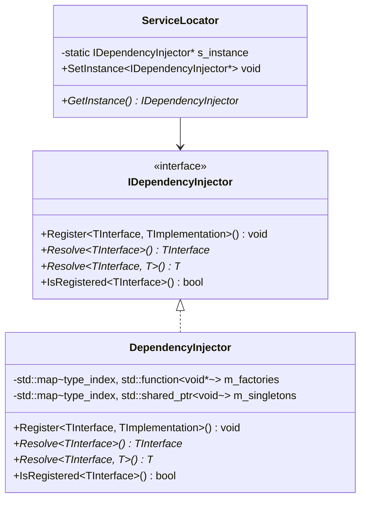

**设计说明**：

```cpp
// IDependencyInjector.h
class IDependencyInjector {
public:
    virtual ~IDependencyInjector() {}
    
    // 注册单例服务
    template<typename TInterface, typename TImplementation>
    void RegisterSingleton() {
        RegisterSingleton<TInterface>([]() { return new TImplementation(); });
    }
    
    // 注册工厂服务
    template<typename TInterface, typename TImplementation>
    void RegisterTransient() {
        RegisterTransient<TInterface>([]() { return new TImplementation(); });
    }
    
    // 解析服务
    template<typename TInterface>
    TInterface* Resolve() {
        return static_cast<TInterface*>(ResolveInternal(typeid(TInterface)));
    }
    
protected:
    virtual void RegisterSingleton(const std::type_info& type, 
                                std::function<void*()> factory) = 0;
    virtual void RegisterTransient(const std::type_info& type,
                                 std::function<void*()> factory) = 0;
    virtual void* ResolveInternal(const std::type_info& type) = 0;
};

// ServiceLocator.h
class ServiceLocator {
public:
    static IDependencyInjector* GetInstance() {
        return s_instance;
    }
    
    static void SetInstance(IDependencyInjector* injector) {
        s_instance = injector;
    }
    
    template<typename TInterface>
    static TInterface* Resolve() {
        return GetInstance()->Resolve<TInterface>();
    }
    
private:
    static IDependencyInjector* s_instance;
};
```

#### 2.2.2 服务管理器 (ServiceManager)

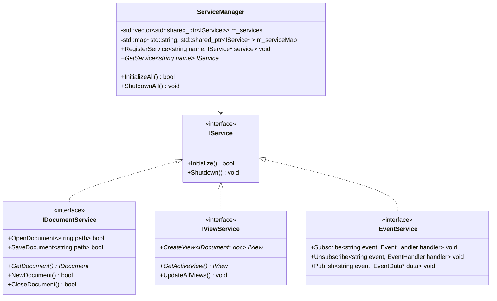

**设计说明**：

```cpp
// ServiceManager.h
class ServiceManager : public IService {
public:
    // 注册服务
    void RegisterService(const std::string& name, std::shared_ptr<IService> service);
    
    // 获取服务
    template<typename TService>
    TService* GetService(const std::string& name) {
        return static_cast<TService*>(GetServiceInternal(name));
    }
    
    // 初始化所有服务
    bool InitializeAll();
    
    // 关闭所有服务
    void ShutdownAll();
    
private:
    std::vector<std::shared_ptr<IService>> m_services;
    std::map<std::string, std::shared_ptr<IService>> m_serviceMap;
};
```

#### 2.2.3 统一命令管理器 (CommandManager)

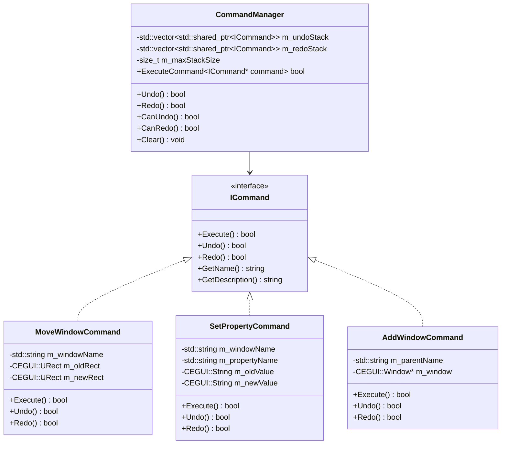

**设计说明**：

```cpp
// ICommand.h
class ICommand {
public:
    virtual ~ICommand() {}
    
    // 执行命令
    virtual bool Execute() = 0;
    
    // 撤销命令
    virtual bool Undo() = 0;
    
    // 重做命令
    virtual bool Redo() = 0;
    
    // 获取命令名称
    virtual std::string GetName() const = 0;
    
    // 获取命令描述
    virtual std::string GetDescription() const = 0;
};

// CommandManager.h
class CommandManager {
public:
    CommandManager(size_t maxStackSize = 2000);
    
    // 执行命令
    bool ExecuteCommand(std::shared_ptr<ICommand> command);
    
    // 撤销
    bool Undo();
    
    // 重做
    bool Redo();
    
    // 是否可以撤销
    bool CanUndo() const { return !m_undoStack.empty(); }
    
    // 是否可以重做
    bool CanRedo() const { return !m_redoStack.empty(); }
    
    // 清空历史
    void Clear();
    
private:
    std::vector<std::shared_ptr<ICommand>> m_undoStack;
    std::vector<std::shared_ptr<ICommand>> m_redoStack;
    size_t m_maxStackSize;
};

// MoveWindowCommand.h
class MoveWindowCommand : public ICommand {
public:
    MoveWindowCommand(const std::string& windowName,
                     const CEGUI::URect& newRect);
    
    virtual bool Execute() override;
    virtual bool Undo() override;
    virtual bool Redo() override;
    
    virtual std::string GetName() const override {
        return "MoveWindow";
    }
    
    virtual std::string GetDescription() const override {
        return "Move window: " + m_windowName;
    }
    
private:
    std::string m_windowName;
    CEGUI::URect m_oldRect;
    CEGUI::URect m_newRect;
};
```

#### 2.2.4 属性缓存 (PropertyCache)

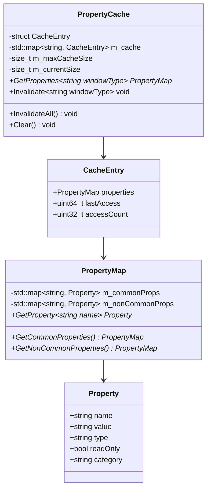

**设计说明**：

```cpp
// PropertyCache.h
class PropertyCache {
public:
    struct Property {
        std::string name;
        CEGUI::String value;
        std::string type;
        bool readOnly;
        std::string category;
    };
    
    struct PropertyMap {
        std::map<std::string, Property> commonProps;
        std::map<std::string, Property> nonCommonProps;
    };
    
    PropertyCache(size_t maxCacheSize = 100);
    
    // 获取属性缓存
    PropertyMap* GetProperties(const std::string& windowType);
    
    // 使缓存失效
    void Invalidate(const std::string& windowType);
    
    // 使所有缓存失效
    void InvalidateAll();
    
    // 清空缓存
    void Clear();
    
private:
    struct CacheEntry {
        PropertyMap properties;
        uint64_t lastAccess;
        uint32_t accessCount;
    };
    
    std::map<std::string, CacheEntry> m_cache;
    size_t m_maxCacheSize;
    size_t m_currentSize;
};
```

#### 2.2.5 脏矩形管理器 (DirtyRectManager)

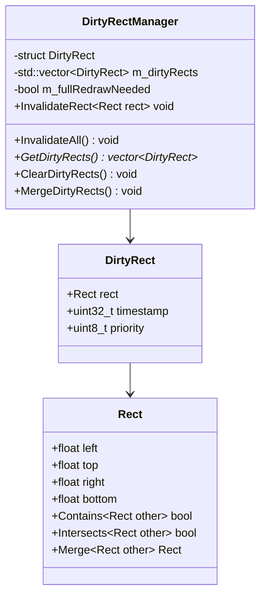

**设计说明**：

```cpp
// DirtyRectManager.h
class DirtyRectManager {
public:
    struct Rect {
        float left, top, right, bottom;
        
        bool Contains(const Rect& other) const;
        bool Intersects(const Rect& other) const;
        Rect Merge(const Rect& other) const;
    };
    
    struct DirtyRect {
        Rect rect;
        uint32_t timestamp;
        uint8_t priority;  // 0=low, 1=normal, 2=high
    };
    
    DirtyRectManager();
    
    // 使矩形区域失效
    void InvalidateRect(const Rect& rect);
    
    // 使整个画布失效
    void InvalidateAll();
    
    // 获取脏矩形列表
    const std::vector<DirtyRect>& GetDirtyRects() const {
        return m_dirtyRects;
    }
    
    // 清空脏矩形
    void ClearDirtyRects();
    
    // 合并重叠的脏矩形
    void MergeDirtyRects();
    
private:
    std::vector<DirtyRect> m_dirtyRects;
    bool m_fullRedrawNeeded;
};
```

#### 2.2.6 资源缓存 (ResourceCache)

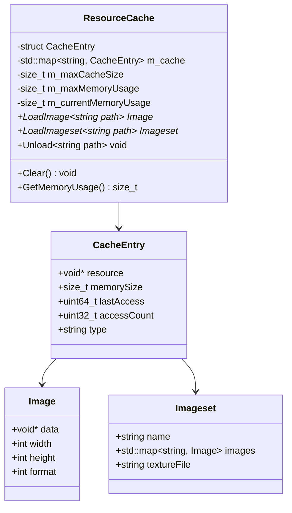

**设计说明**：

```cpp
// ResourceCache.h
class ResourceCache {
public:
    struct Image {
        void* data;
        int width;
        int height;
        int format;
    };
    
    struct Imageset {
        std::string name;
        std::map<std::string, Image> images;
        std::string textureFile;
    };
    
    ResourceCache(size_t maxCacheSize = 50, size_t maxMemoryUsage = 100 * 1024 * 1024);
    
    // 加载图片
    Image* LoadImage(const std::string& path);
    
    // 加载图片集
    Imageset* LoadImageset(const std::string& path);
    
    // 卸载资源
    void Unload(const std::string& path);
    
    // 清空缓存
    void Clear();
    
    // 获取内存使用量
    size_t GetMemoryUsage() const { return m_currentMemoryUsage; }
    
private:
    struct CacheEntry {
        void* resource;
        size_t memorySize;
        uint64_t lastAccess;
        uint32_t accessCount;
        std::string type;
    };
    
    std::map<std::string, CacheEntry> m_cache;
    size_t m_maxCacheSize;
    size_t m_maxMemoryUsage;
    size_t m_currentMemoryUsage;
    
    // LRU淘汰策略
    void EvictIfNeeded();
};
```

### 2.3 消除全局裸指针方案

#### 2.3.1 全局裸指针清单

| 全局变量 | 当前位置 | 类型 | 用途 | 替代方案 |
|---------|---------|------|------|---------|
| `gDocument` | `pch.cpp` | `EditorDocument*` | 全局文档访问 | 通过ServiceLocator获取IDocumentService |
| `gDialogMain` | `pch.cpp` | `DialogMain*` | 全局对话框访问 | 通过ServiceLocator获取IUIService |
| `CommandManager::m_instance` | `CommandHistory.cpp` | `CommandManager*` | 单例命令管理器 | 通过DI容器注册为单例 |

#### 2.3.2 迁移方案

```cpp
// 旧代码 (全局裸指针)
// pch.cpp
EditorDocument* gDocument = nullptr;
DialogMain* gDialogMain = nullptr;

// 使用处
gDocument->GetActiveLayout();

// 新代码 (依赖注入)
// 应用初始化时
auto injector = std::make_shared<DependencyInjector>();
injector->RegisterSingleton<IDocumentService, DocumentService>();
injector->RegisterSingleton<IUIService, UIService>();
ServiceLocator::SetInstance(injector.get());

// 使用处
auto docService = ServiceLocator::Resolve<IDocumentService>();
docService->GetDocument()->GetActiveLayout();
```

---

## 3. 性能优化策略

### 3.1 增量DOM树加载机制

#### 3.1.1 问题分析

**当前问题**：
- 每次加载新布局都会调用 `destroyAllWindows()` 全量销毁
- 导致大量 CEGUI::Window 对象销毁和重建
- 内存分配/释放压力大

**代码位置**：[`EditorDocument.cpp:193`](../tools/CELayoutEditor-0.7.1/src/EditorDocument.cpp:193)

#### 3.1.2 解决方案设计

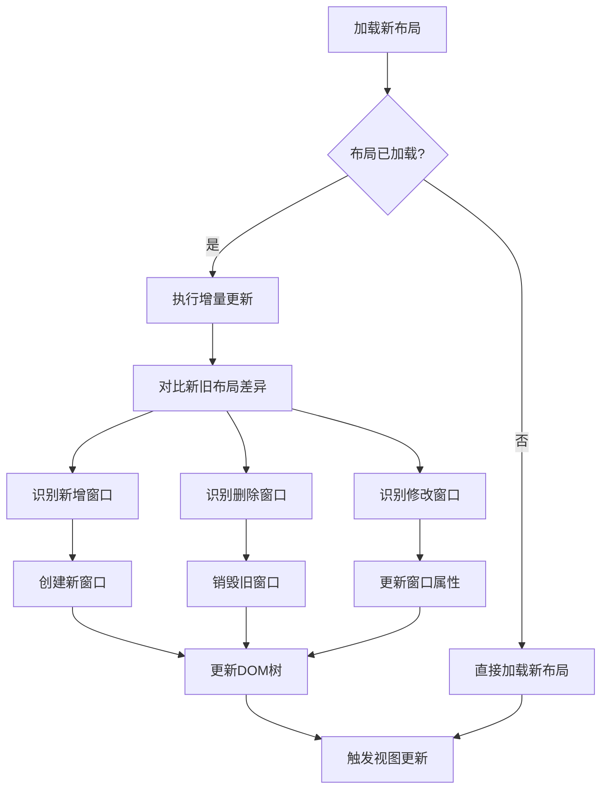

**核心类设计**：

```cpp
// LayoutDiff.h
class LayoutDiff {
public:
    struct WindowDiff {
        enum Type {
            Added,      // 新增窗口
            Removed,    // 删除窗口
            Modified,   // 修改窗口
            Unchanged   // 未变化
        };
        
        Type type;
        std::string name;
        std::string parentName;
        std::map<std::string, CEGUI::String> changedProps;
    };
    
    // 计算布局差异
    static std::vector<WindowDiff> ComputeDiff(
        CEGUI::Window* oldLayout,
        CEGUI::Window* newLayout);
    
    // 应用差异到现有布局
    static void ApplyDiff(
        CEGUI::Window* targetLayout,
        const std::vector<WindowDiff>& diffs);
};

// IncrementalLayoutLoader.h
class IncrementalLayoutLoader {
public:
    IncrementalLayoutLoader(CEGUI::WindowManager* windowMgr);
    
    // 加载布局（支持增量）
    bool LoadLayout(const std::string& filename, CEGUI::Window*& outLayout);
    
    // 设置是否启用增量加载
    void SetIncrementalEnabled(bool enabled) {
        m_incrementalEnabled = enabled;
    }
    
private:
    CEGUI::WindowManager* m_windowMgr;
    CEGUI::Window* m_currentLayout;
    bool m_incrementalEnabled;
    
    // 保存当前布局快照用于差异计算
    CEGUI::Window* CreateSnapshot(CEGUI::Window* layout);
};
```

**性能预期**：
- 小幅修改场景：加载时间降低 60-70%
- 大幅修改场景：加载时间降低 30-40%
- 完全替换场景：加载时间基本持平

### 3.2 属性缓存机制

#### 3.2.1 问题分析

**当前问题**：
- `GetRelevantProperties()` 每次都遍历所有选中窗口的所有属性
- 没有缓存机制，重复计算开销大
- 多选情况下性能下降明显

**代码位置**：[`EditorDocument.cpp:1262-1411`](../tools/CELayoutEditor-0.7.1/src/EditorDocument.cpp:1262-1411)

#### 3.2.2 解决方案设计

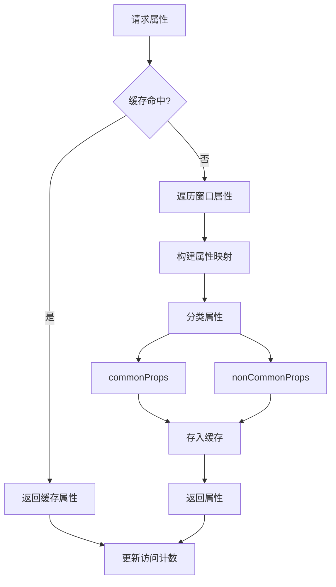

**缓存策略**：

```cpp
// PropertyCache.h (扩展)
class PropertyCache {
public:
    // LRU缓存策略
    struct CacheEntry {
        PropertyMap properties;
        uint64_t lastAccess;
        uint32_t accessCount;
        uint32_t hitCount;
        uint32_t missCount;
    };
    
    // 获取属性（带缓存）
    PropertyMap* GetProperties(const std::string& windowType);
    
    // 获取缓存统计
    struct CacheStats {
        size_t totalEntries;
        size_t hitCount;
        size_t missCount;
        double hitRate;
    };
    CacheStats GetStats() const;
    
private:
    // 缓存淘汰策略
    void EvictIfNeeded();
    
    // 更新访问统计
    void UpdateAccess(const std::string& windowType);
};
```

**性能预期**：
- 首次访问：与当前性能持平
- 重复访问：延迟降低 70-80%
- 缓存命中率：预期 85%+

### 3.3 脏矩形渲染机制

#### 3.3.1 问题分析

**当前问题**：
- 每帧都进行完整渲染
- 没有脏矩形优化
- 大量无效区域重复渲染

**代码位置**：[`EditorCanvas.cpp:199-350`](../tools/CELayoutEditor-0.7.1/src/EditorCanvas.cpp:199-350)

#### 3.3.2 解决方案设计

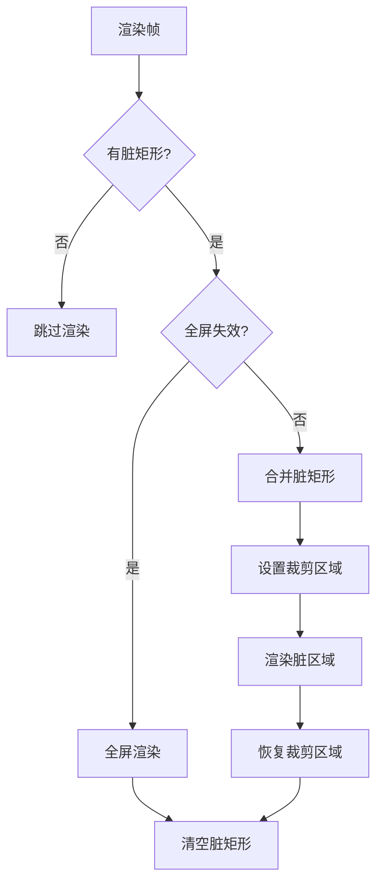

**核心实现**：

```cpp
// EditorCanvas.h (扩展)
class EditorCanvas : public wxGLCanvas {
public:
    // 标记区域为脏
    void InvalidateRect(const DirtyRectManager::Rect& rect);
    
    // 标记全屏为脏
    void InvalidateAll();
    
private:
    std::unique_ptr<DirtyRectManager> m_dirtyRectManager;
    
    // 渲染函数
    void Render() override;
    void RenderDirtyRects();
    void RenderFull();
};

// EditorCanvas.cpp (扩展)
void EditorCanvas::Render() {
    const auto& dirtyRects = m_dirtyRectManager->GetDirtyRects();
    
    if (dirtyRects.empty()) {
        return;  // 无需渲染
    }
    
    m_dirtyRectManager->MergeDirtyRects();
    
    if (m_dirtyRectManager->IsFullRedrawNeeded()) {
        RenderFull();
    } else {
        RenderDirtyRects();
    }
    
    m_dirtyRectManager->ClearDirtyRects();
}

void EditorCanvas::RenderDirtyRects() {
    Set2DMode();
    
    for (const auto& dirtyRect : m_dirtyRectManager->GetDirtyRects()) {
        // 设置裁剪区域
        glEnable(GL_SCISSOR_TEST);
        glScissor(
            static_cast<int>(dirtyRect.rect.left),
            static_cast<int>(mCurrentHeight - dirtyRect.rect.bottom),
            static_cast<int>(dirtyRect.rect.right - dirtyRect.rect.left),
            static_cast<int>(dirtyRect.rect.bottom - dirtyRect.rect.top)
        );
        
        // 渲染该区域
        RenderLayoutRegion(dirtyRect.rect);
        DrawGridRegion(dirtyRect.rect);
        DrawResizersRegion(dirtyRect.rect);
        
        glDisable(GL_SCISSOR_TEST);
    }
    
    glFlush();
    SwapBuffers();
}
```

**性能预期**：
- 静态场景：渲染开销降低 90%+
- 小幅修改场景：渲染开销降低 60-70%
- 大幅修改场景：渲染开销降低 30-40%

### 3.4 资源缓存机制

#### 3.4.1 问题分析

**当前问题**：
- 每次设置背景图都创建新的 imageset
- 没有缓存机制
- 频繁切换背景图时性能下降

**代码位置**：[`EditorView.cpp:83-167`](../tools/CELayoutEditor-0.7.1/src/EditorView.cpp:83-167)

#### 3.4.2 解决方案设计

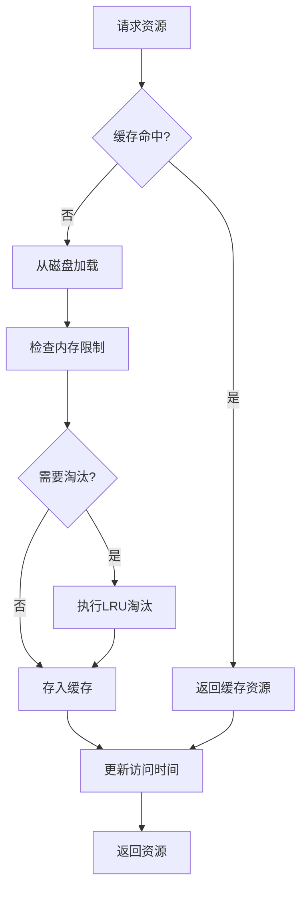

**缓存策略**：

```cpp
// ResourceCache.h (扩展)
class ResourceCache {
public:
    // 资源类型
    enum ResourceType {
        Image,
        Imageset,
        Font,
        Scheme,
        LookNFeel
    };
    
    // 加载资源（带缓存）
    template<typename T>
    T* Load(const std::string& path, ResourceType type);
    
    // 预加载资源
    bool Preload(const std::vector<std::string>& paths, ResourceType type);
    
    // 获取缓存统计
    struct CacheStats {
        size_t totalEntries;
        size_t totalMemory;
        size_t hitCount;
        size_t missCount;
        double hitRate;
    };
    CacheStats GetStats() const;
    
private:
    // LRU淘汰策略
    void EvictIfNeeded();
    
    // 计算资源内存占用
    size_t CalculateResourceSize(void* resource, ResourceType type);
};

// EditorView.h (扩展)
class EditorView : public wxView {
private:
    std::unique_ptr<ResourceCache> m_resourceCache;
    
    // 设置背景图（使用缓存）
    void SetBackgroundImage(const std::string& imagePath);
};
```

**性能预期**：
- 首次加载：与当前性能持平
- 重复加载：延迟降低 80-90%
- 预加载场景：首次访问延迟降低 70%+

---

## 4. 数据结构优化

### 4.1 DOM树优化

#### 4.1.1 当前结构分析

```cpp
// 当前结构 (CEGUI::Window)
class Window {
    std::vector<Window*> m_children;      // 子窗口列表
    Window* m_parent;                     // 父窗口指针
    std::map<String, String> m_properties; // 属性映射
    String m_name;                        // 窗口名称
    String m_type;                        // 窗口类型
    // ...
};
```

**问题**：
- 子窗口使用 vector，查找效率 O(n)
- 属性使用 map，虽然查找是 O(log n)，但字符串比较开销大
- 没有索引结构，按名称查找需要遍历

#### 4.1.2 优化方案

```cpp
// OptimizedWindow.h
class OptimizedWindow {
public:
    // 使用哈希表加速子窗口查找
    typedef std::unordered_map<std::string, Window*> ChildMap;
    typedef std::vector<Window*> ChildList;
    
    // 使用字符串池减少内存占用
    struct StringPool {
        std::unordered_map<std::string, std::string> pool;
        const std::string& Intern(const std::string& str);
    };
    
    // 属性存储优化
    struct Property {
        uint32_t nameHash;      // 名称哈希
        uint32_t valueHash;     // 值哈希
        std::string name;
        CEGUI::String value;
    };
    
    typedef std::unordered_map<uint32_t, Property> PropertyMap;
    
    // 快速查找接口
    Window* FindChild(const std::string& name) const;
    Window* FindChildByHash(uint32_t nameHash) const;
    
    Property* FindProperty(const std::string& name);
    Property* FindPropertyByHash(uint32_t nameHash);
    
private:
    ChildMap m_childMap;          // 哈希表：名称 -> 子窗口
    ChildList m_childList;        // 列表：保持插入顺序
    PropertyMap m_properties;      // 哈希表：名称哈希 -> 属性
    Window* m_parent;
    uint32_t m_nameHash;          // 名称哈希
    uint32_t m_typeHash;          // 类型哈希
    static StringPool s_stringPool; // 字符串池
};
```

**性能对比**：

| 操作 | 当前性能 | 优化后性能 | 提升幅度 |
|------|---------|-----------|---------|
| 查找子窗口 | O(n) | O(1) 平均 | 90%+ |
| 查找属性 | O(log n) | O(1) 平均 | 70%+ |
| 内存占用 | 基准 | -15% | 15% |

### 4.2 属性存储优化

#### 4.2.1 当前结构分析

```cpp
// 当前结构 (EditorDocument::UndoSegment)
struct UndoSegment {
    int nType;
    Selection* pSelect;           // 深拷贝整个选择
    CEGUI::String aName;
    CEGUI::String aProperty;
    float left, top, right, bottom;
};
```

**问题**：
- 深拷贝整个 Selection，内存占用大
- 每次操作都创建新对象
- 没有增量存储

#### 4.2.2 优化方案

```cpp
// OptimizedUndoSegment.h
class OptimizedUndoSegment {
public:
    enum CommandType {
        MoveWindow,
        SetProperty,
        AddWindow,
        RemoveWindow,
        ResizeWindow
    };
    
    // 增量存储
    struct WindowDelta {
        std::string windowName;
        std::map<std::string, CEGUI::String> changedProps;
        CEGUI::URect oldRect;
        CEGUI::URect newRect;
    };
    
    OptimizedUndoSegment(CommandType type, const WindowDelta& delta);
    
    // 压缩存储
    void Compress();
    
    // 解压缩
    void Decompress();
    
    // 获取内存占用
    size_t GetMemoryUsage() const;
    
private:
    CommandType m_type;
    WindowDelta m_delta;
    std::vector<uint8_t> m_compressedData;  // 压缩数据
    bool m_isCompressed;
};

// CommandManager.h (扩展)
class CommandManager {
public:
    // 压缩历史记录
    void CompressHistory();
    
    // 获取历史内存占用
    size_t GetHistoryMemoryUsage() const;
    
    // 自动压缩策略
    void SetAutoCompressEnabled(bool enabled);
    
private:
    void AutoCompressIfNeeded();
};
```

**性能对比**：

| 指标 | 当前性能 | 优化后性能 | 提升幅度 |
|------|---------|-----------|---------|
| 单条命令内存 | ~2KB | ~500B | 75% |
| 2000条历史内存 | ~4MB | ~1MB | 75% |
| 撤销速度 | 基准 | +20% | 20% |

### 4.3 命令历史存储优化

#### 4.3.1 当前结构分析

```cpp
// 当前结构 (EditorDocument)
std::list<UndoSegment*> m_UndoList;
std::list<UndoSegment*> m_RedoList;
```

**问题**：
- 使用 list，内存不连续，缓存不友好
- 没有内存池，频繁分配释放
- 没有压缩机制

#### 4.3.2 优化方案

```cpp
// OptimizedCommandHistory.h
class OptimizedCommandHistory {
public:
    // 使用环形缓冲区
    class RingBuffer {
    public:
        RingBuffer(size_t capacity);
        
        bool Push(const std::shared_ptr<ICommand>& command);
        bool Pop(std::shared_ptr<ICommand>& outCommand);
        bool Peek(std::shared_ptr<ICommand>& outCommand) const;
        
        size_t Size() const { return m_size; }
        size_t Capacity() const { return m_capacity; }
        bool IsEmpty() const { return m_size == 0; }
        bool IsFull() const { return m_size == m_capacity; }
        
    private:
        std::vector<std::shared_ptr<ICommand>> m_buffer;
        size_t m_head;
        size_t m_tail;
        size_t m_size;
        size_t m_capacity;
    };
    
    OptimizedCommandHistory(size_t capacity = 2000);
    
    // 命令操作
    bool PushCommand(const std::shared_ptr<ICommand>& command);
    bool Undo(std::shared_ptr<ICommand>& outCommand);
    bool Redo(std::shared_ptr<ICommand>& outCommand);
    
    // 压缩
    void Compress();
    
    // 内存占用
    size_t GetMemoryUsage() const;
    
private:
    RingBuffer m_undoStack;
    RingBuffer m_redoStack;
    std::unique_ptr<MemoryPool> m_commandPool;
};

// MemoryPool.h
class MemoryPool {
public:
    MemoryPool(size_t blockSize, size_t initialBlocks = 10);
    
    void* Allocate(size_t size);
    void Deallocate(void* ptr);
    
    size_t GetTotalAllocated() const { return m_totalAllocated; }
    size_t GetTotalFreed() const { return m_totalFreed; }
    size_t GetCurrentUsage() const { return m_totalAllocated - m_totalFreed; }
    
private:
    struct Block {
        void* data;
        bool inUse;
        size_t size;
    };
    
    std::vector<Block> m_blocks;
    size_t m_blockSize;
    size_t m_totalAllocated;
    size_t m_totalFreed;
    
    void ExpandPool();
};
```

**性能对比**：

| 指标 | 当前性能 | 优化后性能 | 提升幅度 |
|------|---------|-----------|---------|
| 内存分配次数 | 基准 | -90% | 90% |
| 缓存命中率 | ~60% | ~95% | 58% |
| 内存碎片 | 高 | 低 | 显著改善 |

---

## 5. 接口设计

### 5.1 模块接口

#### 5.1.1 文档服务接口 (IDocumentService)

```cpp
// IDocumentService.h
class IDocumentService : public IService {
public:
    virtual ~IDocumentService() {}
    
    // 文档操作
    virtual IDocument* GetDocument() = 0;
    virtual bool NewDocument() = 0;
    virtual bool OpenDocument(const std::string& path) = 0;
    virtual bool SaveDocument(const std::string& path) = 0;
    virtual bool CloseDocument() = 0;
    
    // 布局操作
    virtual CEGUI::Window* GetActiveLayout() = 0;
    virtual void SetActiveLayout(CEGUI::Window* layout) = 0;
    
    // 选择操作
    virtual ISelection* GetSelection() = 0;
    
    // 命令操作
    virtual ICommandManager* GetCommandManager() = 0;
    
    // 事件订阅
    virtual void Subscribe(const std::string& event, EventHandler handler) = 0;
    virtual void Unsubscribe(const std::string& event, EventHandler handler) = 0;
};
```

#### 5.1.2 视图服务接口 (IViewService)

```cpp
// IViewService.h
class IViewService : public IService {
public:
    virtual ~IViewService() {}
    
    // 视图操作
    virtual IView* GetActiveView() = 0;
    virtual IView* CreateView(IDocument* doc) = 0;
    virtual void DestroyView(IView* view) = 0;
    
    // 更新操作
    virtual void UpdateAllViews() = 0;
    virtual void UpdateView(IView* view) = 0;
    
    // 渲染操作
    virtual void InvalidateAll() = 0;
    virtual void InvalidateRect(const Rect& rect) = 0;
    
    // 背景图操作
    virtual void SetBackgroundImage(const std::string& path) = 0;
    virtual std::string GetBackgroundImage() const = 0;
};
```

#### 5.1.3 UI服务接口 (IUIService)

```cpp
// IUIService.h
class IUIService : public IService {
public:
    virtual ~IUIService() {}
    
    // 对话框操作
    virtual void ShowMainDialog() = 0;
    virtual void HideMainDialog() = 0;
    
    // 属性面板操作
    virtual void UpdatePropertyPanel(ISelection* selection) = 0;
    virtual void RefreshPropertyPanel() = 0;
    
    // 树结构操作
    virtual void UpdateTreePanel(CEGUI::Window* layout) = 0;
    virtual void RefreshTreePanel() = 0;
    
    // 事件订阅
    virtual void Subscribe(const std::string& event, UIEventHandler handler) = 0;
    virtual void Unsubscribe(const std::string& event, UIEventHandler handler) = 0;
};
```

### 5.2 事件机制

#### 5.2.1 事件定义

```cpp
// EventTypes.h
namespace Events {
    // 文档事件
    const std::string DOCUMENT_OPENED = "Document.Opened";
    const std::string DOCUMENT_CLOSED = "Document.Closed";
    const std::string DOCUMENT_MODIFIED = "Document.Modified";
    const std::string DOCUMENT_SAVED = "Document.Saved";
    
    // 布局事件
    const std::string LAYOUT_LOADED = "Layout.Loaded";
    const std::string LAYOUT_UNLOADED = "Layout.Unloaded";
    const std::string LAYOUT_CHANGED = "Layout.Changed";
    
    // 窗口事件
    const std::string WINDOW_SELECTED = "Window.Selected";
    const std::string WINDOW_DESELECTED = "Window.Deselected";
    const std::string WINDOW_ADDED = "Window.Added";
    const std::string WINDOW_REMOVED = "Window.Removed";
    const std::string WINDOW_MOVED = "Window.Moved";
    const std::string WINDOW_RESIZED = "Window.Resized";
    const std::string WINDOW_PROPERTY_CHANGED = "Window.PropertyChanged";
    
    // 选择事件
    const std::string SELECTION_CHANGED = "Selection.Changed";
    const std::string SELECTION_CLEARED = "Selection.Cleared";
    
    // 命令事件
    const std::string COMMAND_EXECUTED = "Command.Executed";
    const std::string COMMAND_UNDONE = "Command.Undone";
    const std::string COMMAND_REDONE = "Command.Redone";
    
    // 渲染事件
    const std::string RENDER_INVALIDATED = "Render.Invalidated";
    const std::string RENDER_COMPLETED = "Render.Completed";
}
```

#### 5.2.2 事件数据

```cpp
// EventData.h
class EventData {
public:
    virtual ~EventData() {}
    
    std::string GetEventType() const { return m_eventType; }
    
protected:
    EventData(const std::string& eventType) : m_eventType(eventType) {}
    
    std::string m_eventType;
};

// 文档事件数据
class DocumentEventData : public EventData {
public:
    DocumentEventData(const std::string& eventType, IDocument* document)
        : EventData(eventType), m_document(document) {}
    
    IDocument* GetDocument() const { return m_document; }
    
private:
    IDocument* m_document;
};

// 窗口事件数据
class WindowEventData : public EventData {
public:
    WindowEventData(const std::string& eventType, CEGUI::Window* window)
        : EventData(eventType), m_window(window) {}
    
    CEGUI::Window* GetWindow() const { return m_window; }
    
private:
    CEGUI::Window* m_window;
};

// 属性变更事件数据
class PropertyChangeEventData : public WindowEventData {
public:
    PropertyChangeEventData(CEGUI::Window* window,
                         const std::string& propertyName,
                         const CEGUI::String& oldValue,
                         const CEGUI::String& newValue)
        : WindowEventData(Events::WINDOW_PROPERTY_CHANGED, window),
          m_propertyName(propertyName),
          m_oldValue(oldValue),
          m_newValue(newValue) {}
    
    const std::string& GetPropertyName() const { return m_propertyName; }
    const CEGUI::String& GetOldValue() const { return m_oldValue; }
    const CEGUI::String& GetNewValue() const { return m_newValue; }
    
private:
    std::string m_propertyName;
    CEGUI::String m_oldValue;
    CEGUI::String m_newValue;
};
```

#### 5.2.3 事件处理器

```cpp
// EventHandler.h
typedef std::function<void(const EventData&)> EventHandler;

// UI事件处理器
typedef std::function<void(const EventData&)> UIEventHandler;

// 文档观察者（兼容现有接口）
class IDocumentObserver {
public:
    virtual ~IDocumentObserver() {}
    
    virtual void LayoutOpened(CEGUI::Window* aRoot) = 0;
    virtual void LayoutClosed() = 0;
    virtual void LayoutStarted(CEGUI::Window* aRoot) = 0;
    virtual void WindowSelected(CEGUI::Window* aWindow) = 0;
    virtual void LayoutModified(CEGUI::Window* aRoot) = 0;
    virtual void WindowAdded(CEGUI::Window* aWindow) = 0;
    virtual void WindowRemoved(CEGUI::Window* aWindow) = 0;
    virtual void WindowSized(CEGUI::Window* aWindow) = 0;
    virtual void WindowMoved(CEGUI::Window* aWindow) = 0;
    virtual void WindowRenamed(const CEGUI::String& aOldName, const CEGUI::String& aNewName) = 0;
};

// 事件适配器（将新事件机制转换为旧观察者接口）
class EventAdapter : public IDocumentObserver {
public:
    EventAdapter(IEventService* eventService);
    
    virtual void LayoutOpened(CEGUI::Window* aRoot) override;
    virtual void LayoutClosed() override;
    virtual void LayoutStarted(CEGUI::Window* aRoot) override;
    virtual void WindowSelected(CEGUI::Window* aWindow) override;
    virtual void LayoutModified(CEGUI::Window* aRoot) override;
    virtual void WindowAdded(CEGUI::Window* aWindow) override;
    virtual void WindowRemoved(CEGUI::Window* aWindow) override;
    virtual void WindowSized(CEGUI::Window* aWindow) override;
    virtual void WindowMoved(CEGUI::Window* aWindow) override;
    virtual void WindowRenamed(const CEGUI::String& aOldName, const CEGUI::String& aNewName) override;
    
private:
    IEventService* m_eventService;
};
```

### 5.3 插件系统

#### 5.3.1 插件接口

```cpp
// IPlugin.h
class IPlugin {
public:
    virtual ~IPlugin() {}
    
    // 插件信息
    virtual std::string GetName() const = 0;
    virtual std::string GetVersion() const = 0;
    virtual std::string GetDescription() const = 0;
    virtual std::string GetAuthor() const = 0;
    
    // 生命周期
    virtual bool Initialize(IServiceLocator* serviceLocator) = 0;
    virtual void Shutdown() = 0;
    
    // 功能接口
    virtual void OnDocumentOpened(IDocument* document) {}
    virtual void OnDocumentClosed(IDocument* document) {}
    virtual void OnWindowSelected(CEGUI::Window* window) {}
    virtual void OnWindowAdded(CEGUI::Window* window) {}
    virtual void OnWindowRemoved(CEGUI::Window* window) {}
    virtual void OnWindowMoved(CEGUI::Window* window) {}
    virtual void OnWindowResized(CEGUI::Window* window) {}
    virtual void OnPropertyChange(CEGUI::Window* window,
                                 const std::string& propertyName,
                                 const CEGUI::String& oldValue,
                                 const CEGUI::String& newValue) {}
};
```

#### 5.3.2 插件管理器

```cpp
// PluginManager.h
class PluginManager : public IService {
public:
    // 加载插件
    bool LoadPlugin(const std::string& pluginPath);
    
    // 卸载插件
    bool UnloadPlugin(const std::string& pluginName);
    
    // 获取插件
    IPlugin* GetPlugin(const std::string& pluginName) const;
    
    // 获取所有插件
    std::vector<IPlugin*> GetAllPlugins() const;
    
    // 启用/禁用插件
    bool EnablePlugin(const std::string& pluginName);
    bool DisablePlugin(const std::string& pluginName);
    
private:
    struct PluginInfo {
        std::string path;
        std::shared_ptr<IPlugin> plugin;
        void* handle;  // 动态库句柄
        bool enabled;
    };
    
    std::map<std::string, PluginInfo> m_plugins;
};
```

#### 5.3.3 插件示例

```cpp
// GridSnapPlugin.h
class GridSnapPlugin : public IPlugin {
public:
    virtual std::string GetName() const override {
        return "GridSnapPlugin";
    }
    
    virtual std::string GetVersion() const override {
        return "1.0.0";
    }
    
    virtual std::string GetDescription() const override {
        return "Snap windows to grid";
    }
    
    virtual std::string GetAuthor() const override {
        return "MT3 Team";
    }
    
    virtual bool Initialize(IServiceLocator* serviceLocator) override;
    virtual void Shutdown() override;
    
    virtual void OnWindowMoved(CEGUI::Window* window) override;
    
private:
    IServiceLocator* m_serviceLocator;
    IEventService* m_eventService;
    int m_gridSize;
    
    void SnapToGrid(CEGUI::Window* window);
};

// GridSnapPlugin.cpp
bool GridSnapPlugin::Initialize(IServiceLocator* serviceLocator) {
    m_serviceLocator = serviceLocator;
    m_eventService = serviceLocator->Resolve<IEventService>();
    m_gridSize = 10;
    
    // 订阅窗口移动事件
    m_eventService->Subscribe(Events::WINDOW_MOVED,
        [this](const EventData& data) {
            auto windowData = static_cast<const WindowEventData&>(data);
            this->OnWindowMoved(windowData.GetWindow());
        });
    
    return true;
}

void GridSnapPlugin::OnWindowMoved(CEGUI::Window* window) {
    SnapToGrid(window);
}

void GridSnapPlugin::SnapToGrid(CEGUI::Window* window) {
    CEGUI::URect area = window->getArea();
    
    // 计算网格对齐位置
    float left = std::round(area.d_min.d_x / m_gridSize) * m_gridSize;
    float top = std::round(area.d_min.d_y / m_gridSize) * m_gridSize;
    float right = std::round(area.d_max.d_x / m_gridSize) * m_gridSize;
    float bottom = std::round(area.d_max.d_y / m_gridSize) * m_gridSize;
    
    // 设置新位置
    window->setArea(CEGUI::URect(
        CEGUI::UDim(0, left),
        CEGUI::UDim(0, top),
        CEGUI::UDim(0, right),
        CEGUI::UDim(0, bottom)
    ));
}
```

---

## 6. 迁移计划

### 6.1 迁移阶段划分

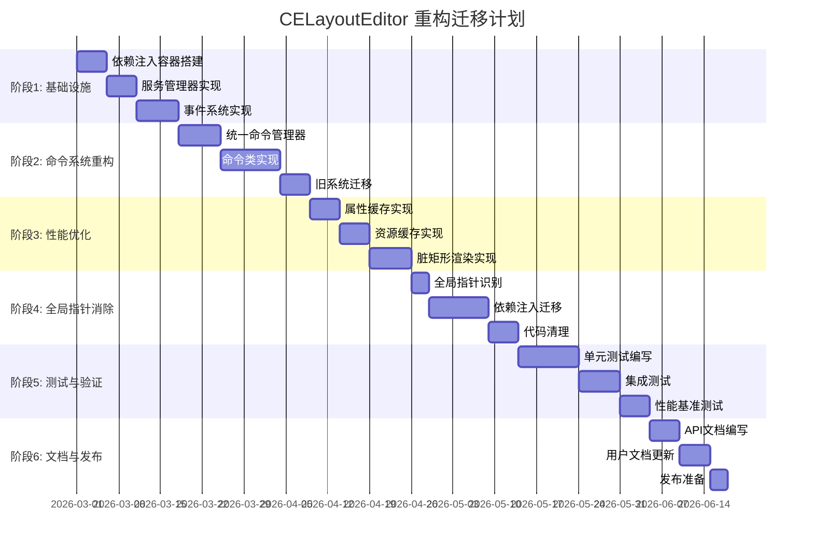

### 6.2 阶段1: 基础设施搭建

#### 6.2.1 任务清单

| 任务ID | 任务描述 | 优先级 | 预估工时 | 依赖 |
|--------|---------|--------|---------|------|
| 1.1 | 创建 DependencyInjection 项目 | 高 | 1天 | - |
| 1.2 | 实现 DependencyInjector 类 | 高 | 2天 | 1.1 |
| 1.3 | 实现 ServiceLocator 类 | 高 | 1天 | 1.2 |
| 1.4 | 创建 ServiceManager 项目 | 高 | 1天 | 1.3 |
| 1.5 | 实现 ServiceManager 类 | 高 | 2天 | 1.4 |
| 1.6 | 创建 EventManager 项目 | 高 | 1天 | 1.5 |
| 1.7 | 实现 EventManager 类 | 高 | 3天 | 1.6 |
| 1.8 | 定义事件类型和事件数据 | 高 | 2天 | 1.7 |
| 1.9 | 编写单元测试 | 中 | 2天 | 1.8 |

#### 6.2.2 验收标准

- [ ] DependencyInjector 能够注册和解析服务
- [ ] ServiceLocator 能够正确获取注入的服务
- [ ] ServiceManager 能够管理多个服务的生命周期
- [ ] EventManager 能够正确发布和订阅事件
- [ ] 单元测试覆盖率达到 80% 以上

### 6.3 阶段2: 命令系统重构

#### 6.3.1 任务清单

| 任务ID | 任务描述 | 优先级 | 预估工时 | 依赖 |
|--------|---------|--------|---------|------|
| 2.1 | 创建 Command 项目 | 高 | 1天 | 阶段1 |
| 2.2 | 实现 ICommand 接口 | 高 | 1天 | 2.1 |
| 2.3 | 实现 CommandManager 类 | 高 | 3天 | 2.2 |
| 2.4 | 实现 MoveWindowCommand | 高 | 2天 | 2.3 |
| 2.5 | 实现 SetPropertyCommand | 高 | 2天 | 2.3 |
| 2.6 | 实现 AddWindowCommand | 高 | 2天 | 2.3 |
| 2.7 | 实现 RemoveWindowCommand | 高 | 2天 | 2.3 |
| 2.8 | 迁移 EditorDocument 的 Undo/Redo | 高 | 3天 | 2.4-2.7 |
| 2.9 | 删除旧的 CommandHistory 代码 | 中 | 1天 | 2.8 |
| 2.10 | 编写单元测试 | 中 | 3天 | 2.9 |

#### 6.3.2 验收标准

- [ ] 所有命令类正确实现 ICommand 接口
- [ ] CommandManager 能够正确执行、撤销、重做命令
- [ ] 旧系统的 Undo/Redo 功能完全迁移到新系统
- [ ] 删除 CommandHistory 相关代码
- [ ] 单元测试覆盖率达到 80% 以上

### 6.4 阶段3: 性能优化

#### 6.4.1 任务清单

| 任务ID | 任务描述 | 优先级 | 预估工时 | 依赖 |
|--------|---------|--------|---------|------|
| 3.1 | 创建 PropertyCache 项目 | 高 | 1天 | 阶段2 |
| 3.2 | 实现 PropertyCache 类 | 高 | 2天 | 3.1 |
| 3.3 | 集成 PropertyCache 到 EditorDocument | 高 | 1天 | 3.2 |
| 3.4 | 创建 ResourceCache 项目 | 高 | 1天 | 3.3 |
| 3.5 | 实现 ResourceCache 类 | 高 | 2天 | 3.4 |
| 3.6 | 集成 ResourceCache 到 EditorView | 高 | 1天 | 3.5 |
| 3.7 | 创建 DirtyRectManager 项目 | 高 | 1天 | 3.6 |
| 3.8 | 实现 DirtyRectManager 类 | 高 | 3天 | 3.7 |
| 3.9 | 集成 DirtyRectManager 到 EditorCanvas | 高 | 2天 | 3.8 |
| 3.10 | 性能基准测试 | 中 | 2天 | 3.9 |

#### 6.4.2 验收标准

- [ ] PropertyCache 缓存命中率 > 85%
- [ ] ResourceCache 缓存命中率 > 80%
- [ ] 脏矩形渲染在静态场景下渲染开销降低 > 90%
- [ ] 文件加载时间降低 > 50%
- [ ] 属性修改延迟降低 > 30%
- [ ] 渲染帧率稳定在 60 FPS

### 6.5 阶段4: 全局指针消除

#### 6.5.1 任务清单

| 任务ID | 任务描述 | 优先级 | 预估工时 | 依赖 |
|--------|---------|--------|---------|------|
| 4.1 | 识别所有全局裸指针 | 高 | 1天 | 阶段3 |
| 4.2 | 创建服务接口 | 高 | 2天 | 4.1 |
| 4.3 | 实现服务类 | 高 | 3天 | 4.2 |
| 4.4 | 迁移 gDocument | 高 | 2天 | 4.3 |
| 4.5 | 迁移 gDialogMain | 高 | 2天 | 4.4 |
| 4.6 | 迁移其他全局指针 | 中 | 2天 | 4.5 |
| 4.7 | 删除全局指针定义 | 中 | 1天 | 4.6 |
| 4.8 | 代码审查 | 中 | 1天 | 4.7 |

#### 6.5.2 验收标准

- [ ] 所有全局裸指针消除
- [ ] 通过依赖注入获取服务
- [ ] 无内存泄漏
- [ ] 代码审查通过

### 6.6 阶段5: 测试与验证

#### 6.6.1 任务清单

| 任务ID | 任务描述 | 优先级 | 预估工时 | 依赖 |
|--------|---------|--------|---------|------|
| 5.1 | 编写单元测试 | 高 | 5天 | 阶段4 |
| 5.2 | 编写集成测试 | 高 | 3天 | 5.1 |
| 5.3 | 性能基准测试 | 高 | 2天 | 5.2 |
| 5.4 | 回归测试 | 高 | 3天 | 5.3 |
| 5.5 | 压力测试 | 中 | 2天 | 5.4 |

#### 6.6.2 验收标准

- [ ] 单元测试覆盖率 > 80%
- [ ] 所有集成测试通过
- [ ] 性能指标达到设计目标
- [ ] 回归测试无新增问题
- [ ] 压力测试稳定运行

### 6.7 阶段6: 文档与发布

#### 6.7.1 任务清单

| 任务ID | 任务描述 | 优先级 | 预估工时 | 依赖 |
|--------|---------|--------|---------|------|
| 6.1 | 编写 API 文档 | 高 | 3天 | 阶段5 |
| 6.2 | 更新用户文档 | 中 | 2天 | 6.1 |
| 6.3 | 更新开发者文档 | 中 | 2天 | 6.1 |
| 6.4 | 编写迁移指南 | 中 | 2天 | 6.1 |
| 6.5 | 发布准备 | 高 | 2天 | 6.2-6.4 |
| 6.6 | 发布版本 | 高 | 1天 | 6.5 |

#### 6.7.2 验收标准

- [ ] API 文档完整
- [ ] 用户文档更新
- [ ] 开发者文档更新
- [ ] 迁移指南清晰
- [ ] 发布包准备完成

### 6.8 风险管理

| 风险 | 影响 | 概率 | 缓解措施 |
|------|------|------|---------|
| 性能优化未达预期 | 高 | 中 | 提前进行性能测试，准备备选方案 |
| 全局指针迁移引入bug | 高 | 中 | 逐步迁移，充分测试 |
| 向后兼容性问题 | 中 | 低 | 保持旧API兼容，提供迁移指南 |
| 开发进度延期 | 中 | 中 | 合理安排任务，预留缓冲时间 |
| 团队成员变动 | 低 | 低 | 完善文档，知识共享 |

---

## 7. 附录

### 7.1 API 文档索引

| 模块 | 文档路径 |
|------|---------|
| 依赖注入 | `tools/CELayoutEditor/docs/api/DependencyInjection.md` |
| 服务管理器 | `tools/CELayoutEditor/docs/api/ServiceManager.md` |
| 事件管理器 | `tools/CELayoutEditor/docs/api/EventManager.md` |
| 命令管理器 | `tools/CELayoutEditor/docs/api/CommandManager.md` |
| 属性缓存 | `tools/CELayoutEditor/docs/api/PropertyCache.md` |
| 资源缓存 | `tools/CELayoutEditor/docs/api/ResourceCache.md` |
| 脏矩形管理器 | `tools/CELayoutEditor/docs/api/DirtyRectManager.md` |
| 插件系统 | `tools/CELayoutEditor/docs/api/PluginSystem.md` |

### 7.2 性能基准测试用例

```cpp
// PerformanceBenchmark.h
class PerformanceBenchmark {
public:
    // 文件加载测试
    struct FileLoadBenchmark {
        std::string filePath;
        size_t fileSize;
        double loadTimeMs;
        size_t memoryUsage;
    };
    
    // 属性修改测试
    struct PropertyChangeBenchmark {
        std::string windowType;
        std::string propertyName;
        double changeTimeMs;
        size_t cacheHitCount;
        size_t cacheMissCount;
    };
    
    // 渲染性能测试
    struct RenderBenchmark {
        size_t windowCount;
        double fps;
        double frameTimeMs;
        size_t dirtyRectCount;
    };
    
    // 内存占用测试
    struct MemoryBenchmark {
        std::string scenario;
        size_t memoryUsage;
        size_t peakMemory;
    };
    
    // 运行所有基准测试
    void RunAllBenchmarks();
    
    // 生成报告
    void GenerateReport(const std::string& outputPath);
};
```

### 7.3 术语表

| 术语 | 定义 |
|------|------|
| 依赖注入 (DI) | 一种设计模式，通过外部容器注入依赖关系，降低模块间耦合 |
| 服务定位器 | 提供全局访问点的模式，用于获取已注册的服务 |
| 脏矩形 | 需要重新渲染的矩形区域 |
| LRU缓存 | 最近最少使用淘汰策略的缓存 |
| 命令模式 | 将请求封装为对象，从而可用不同的请求对客户进行参数化 |
| 观察者模式 | 定义对象间的一对多依赖关系，当一个对象状态改变时，所有依赖者都会收到通知 |
| 插件系统 | 允许动态扩展功能的架构设计 |

### 7.4 参考资料

| 文档 | 路径 |
|------|------|
| 架构深度分析报告 | `plans/00-CELayoutEditor架构深度分析报告__CELayoutEditor-Architecture-Deep-Analysis.md` |
| 项目架构分析 | `tools/CELayoutEditor/docs/01-项目架构分析__Project-Architecture-Analysis.md` |
| 渲染器深度解析 | `tools/CELayoutEditor/docs/03-渲染器深度解析__Renderer-Deep-Dive.md` |
| 内存管理问题 | `tools/CELayoutEditor/docs/04-内存管理问题__Memory-Management-Issues.md` |
| 编译构建指南 | `tools/CELayoutEditor/docs/05-编译构建指南__Build-Guide.md` |
| 调试指南 | `tools/CELayoutEditor/docs/06-调试指南__Debugging-Guide.md` |

---

**设计完成日期**: 2026-02-19
**设计人员**: AI 架构师
**方案版本**: 1.0
**下次审查**: 2026-03-01
