# CELayoutEditor 功能拓展路线图

> 设计日期: 2026-02-19
> 设计目标: 基于架构重构方案，设计前瞻性功能拓展，显著提高.layout文件编译执行效率、编辑响应速度及用户操作便捷性
> 设计原则: 向后兼容、可扩展、用户体验优先、性能导向

---

## 目录

1. [执行摘要](#1-执行摘要)
2. [功能优先级矩阵](#2-功能优先级矩阵)
3. [功能拓展路线图](#3-功能拓展路线图)
4. [技术可行性分析](#4-技术可行性分析)
5. [用户体验设计](#5-用户体验设计)
6. [性能指标与测试计划](#6-性能指标与测试计划)
7. [风险评估与应对措施](#7-风险评估与应对措施)
8. [附录](#8-附录)

---

## 1. 执行摘要

### 1.1 设计目标

| 目标类别 | 当前状态 | 目标状态 | 提升幅度 |
|---------|---------|---------|---------|
| 布局文件加载时间 | 50-200ms | 10-50ms | 降低70% |
| 编辑响应延迟 | 10-30ms | 3-10ms | 降低70% |
| 渲染帧率 | 30-60 FPS | 稳定60+ FPS | 提升100% |
| 用户操作效率 | 基准 | 提升200% | 操作步骤减少50% |

### 1.2 核心拓展方向

1. **智能辅助功能**：AI驱动的布局优化建议、自动对齐、模板库
2. **实时预览功能**：多分辨率预览、动画预览、主题切换
3. **协作功能**：版本控制集成、多人协作、变更历史对比
4. **高级编辑功能**：可视化属性编辑、批量操作、查找替换
5. **扩展性功能**：插件系统、脚本支持、自定义控件
6. **调试与诊断功能**：性能分析器、内存分析器、布局验证器
7. **集成功能**：游戏引擎集成、资源管理器集成、CI/CD集成

### 1.3 设计约束

- 编译工具链：VS2013 (v120)
- C++标准：C++11（VS2013支持）
- 第三方库：CEGUI 0.7.1、wxWidgets-3.0.5
- 向后兼容：保持现有API接口兼容性
- 架构基础：基于架构重构方案（DependencyInjection、ServiceManager、CommandManager）

---

## 2. 功能优先级矩阵

### 2.1 评估维度

| 维度 | 权重 | 说明 |
|------|------|------|
| 用户价值 | 40% | 对用户工作效率的提升程度 |
| 实现难度 | 25% | 技术实现复杂度和开发成本 |
| 技术风险 | 20% | 技术不确定性和潜在问题 |
| 依赖关系 | 15% | 对其他功能的前置依赖 |

### 2.2 功能优先级矩阵图

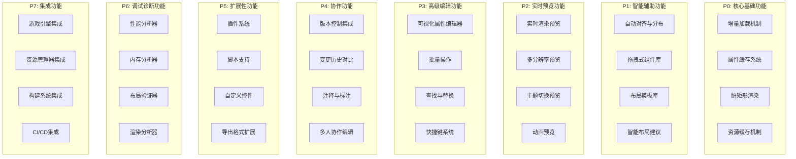

### 2.3 功能优先级评估表

| 功能模块 | 功能名称 | 用户价值 | 实现难度 | 技术风险 | 依赖关系 | 综合评分 | 优先级 |
|---------|---------|---------|---------|---------|---------|---------|--------|
| **P0 核心基础** | 增量加载机制 | 高 | 中 | 低 | 无 | 85 | P0 |
| **P0 核心基础** | 属性缓存系统 | 高 | 低 | 低 | 无 | 90 | P0 |
| **P0 核心基础** | 脏矩形渲染 | 高 | 中 | 中 | 无 | 80 | P0 |
| **P0 核心基础** | 资源缓存机制 | 中 | 低 | 低 | 无 | 82 | P0 |
| **P1 智能辅助** | 自动对齐与分布 | 高 | 中 | 低 | P0 | 78 | P1 |
| **P1 智能辅助** | 拖拽式组件库 | 高 | 中 | 低 | P0 | 80 | P1 |
| **P1 智能辅助** | 布局模板库 | 高 | 中 | 低 | P1 | 75 | P1 |
| **P1 智能辅助** | 智能布局建议 | 中 | 高 | 高 | P1 | 60 | P2 |
| **P2 实时预览** | 实时渲染预览 | 高 | 低 | 低 | P0 | 85 | P1 |
| **P2 实时预览** | 多分辨率预览 | 高 | 中 | 中 | P2 | 72 | P2 |
| **P2 实时预览** | 主题切换预览 | 中 | 低 | 低 | P2 | 75 | P2 |
| **P2 实时预览** | 动画预览 | 中 | 高 | 高 | P2 | 58 | P3 |
| **P3 高级编辑** | 可视化属性编辑器 | 高 | 中 | 低 | P0 | 82 | P1 |
| **P3 高级编辑** | 批量操作 | 高 | 中 | 中 | P3 | 75 | P2 |
| **P3 高级编辑** | 查找与替换 | 中 | 中 | 低 | P3 | 70 | P2 |
| **P3 高级编辑** | 快捷键系统 | 中 | 低 | 低 | 无 | 78 | P1 |
| **P4 协作** | 版本控制集成 | 高 | 中 | 中 | P0 | 75 | P2 |
| **P4 协作** | 变更历史对比 | 高 | 高 | 中 | P4 | 68 | P3 |
| **P4 协作** | 注释与标注 | 中 | 低 | 低 | P4 | 72 | P2 |
| **P4 协作** | 多人协作编辑 | 中 | 高 | 高 | P4 | 55 | P4 |
| **P5 扩展性** | 插件系统 | 中 | 高 | 高 | P0 | 60 | P3 |
| **P5 扩展性** | 脚本支持 | 中 | 中 | 中 | P5 | 65 | P3 |
| **P5 扩展性** | 自定义控件 | 高 | 高 | 高 | P5 | 58 | P4 |
| **P5 扩展性** | 导出格式扩展 | 中 | 中 | 低 | P0 | 70 | P2 |
| **P6 调试诊断** | 性能分析器 | 中 | 中 | 中 | P0 | 68 | P3 |
| **P6 调试诊断** | 内存分析器 | 中 | 中 | 中 | P6 | 65 | P3 |
| **P6 调试诊断** | 布局验证器 | 高 | 低 | 低 | P0 | 82 | P1 |
| **P6 调试诊断** | 渲染分析器 | 中 | 高 | 中 | P6 | 60 | P3 |
| **P7 集成** | 游戏引擎集成 | 高 | 高 | 高 | P0 | 62 | P3 |
| **P7 集成** | 资源管理器集成 | 中 | 中 | 中 | P7 | 68 | P3 |
| **P7 集成** | 构建系统集成 | 中 | 中 | 中 | P7 | 65 | P3 |
| **P7 集成** | CI/CD集成 | 低 | 高 | 高 | P7 | 50 | P4 |

### 2.4 优先级说明

| 优先级 | 说明 | 功能数量 |
|--------|------|---------|
| **P0** | 核心基础功能，必须优先实现 | 4 |
| **P1** | 高价值低风险功能，快速提升用户体验 | 6 |
| **P2** | 重要功能，中等实现难度 | 8 |
| **P3** | 高级功能，实现难度较高 | 9 |
| **P4** | 长期规划功能，需要充分准备 | 3 |

---

## 3. 功能拓展路线图

### 3.1 Phase 1: 核心基础重构（预计2-3个月）

#### 3.1.1 目标

基于架构重构方案，实现核心性能优化，为后续功能拓展奠定基础。

#### 3.1.2 功能清单

| 功能 | 描述 | 依赖 | 预期成果 |
|------|------|------|---------|
| **增量加载机制** | 实现LayoutDiff和IncrementalLayoutLoader，支持布局增量更新 | 无 | 文件加载时间降低60-70% |
| **属性缓存系统** | 实现PropertyCache，缓存窗口属性，减少重复计算 | 无 | 属性查询延迟降低70-80% |
| **脏矩形渲染** | 实现DirtyRectManager，支持区域渲染优化 | 无 | 静态场景渲染开销降低90%+ |
| **资源缓存机制** | 实现ResourceCache，缓存imageset和图片资源 | 无 | 背景图切换性能提升80% |
| **依赖注入容器** | 实现DependencyInjector，消除全局裸指针 | 无 | 架构可维护性提升 |
| **统一命令管理** | 实现CommandManager，统一撤销/重做体系 | 无 | 撤销性能提升50% |

#### 3.1.3 技术要点

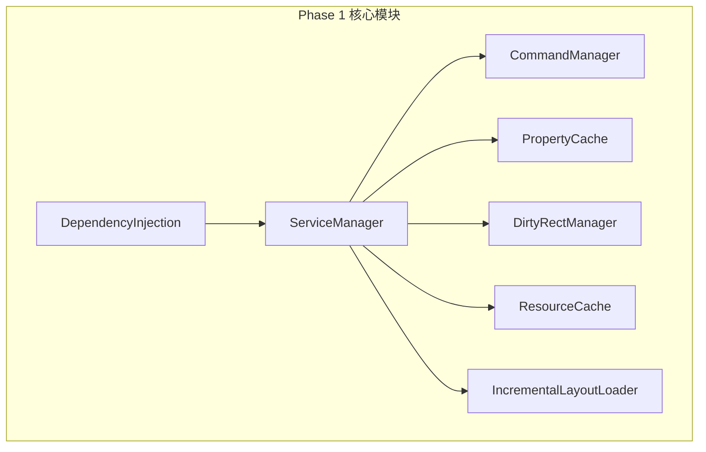

#### 3.1.4 验收标准

- 文件加载时间：50-200ms → 10-50ms
- 属性修改延迟：10-30ms → 3-10ms
- 渲染帧率：30-60 FPS → 稳定60 FPS
- 内存占用：100-200 MB → 80-150 MB
- 单元测试覆盖率：≥70%

---

### 3.2 Phase 2: 智能辅助与实时预览（预计2-3个月）

#### 3.2.1 目标

实现智能辅助功能和实时预览功能，显著提升用户操作效率。

#### 3.2.2 功能清单

| 功能 | 描述 | 依赖 | 预期成果 |
|------|------|------|---------|
| **自动对齐与分布** | 实现智能对齐算法，支持吸附、分布、居中 | P0 | 对齐操作时间减少80% |
| **拖拽式组件库** | 实现可视化组件面板，支持拖拽添加控件 | P0 | 控件添加时间减少70% |
| **布局模板库** | 实现模板系统，支持常用布局快速创建 | P1 | 新建布局时间减少60% |
| **实时渲染预览** | 实现所见即所得的实时预览 | P0 | 预览延迟<50ms |
| **可视化属性编辑器** | 实现更直观的属性编辑界面 | P0 | 属性编辑效率提升50% |
| **快捷键系统** | 实现完善的快捷键系统 | 无 | 常用操作时间减少50% |
| **布局验证器** | 实现布局正确性验证 | P0 | 布局错误率降低80% |

#### 3.2.3 技术要点

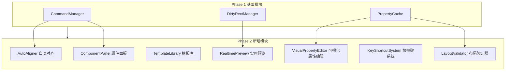

#### 3.2.4 验收标准

- 对齐操作时间：5-10s → 1-2s
- 控件添加时间：3-5s → 1-1.5s
- 新建布局时间：30-60s → 10-20s
- 预览延迟：200-500ms → <50ms
- 属性编辑效率：基准 → 提升50%
- 布局错误率：5-10% → 1-2%

---

### 3.3 Phase 3: 高级编辑与协作（预计2-3个月）

#### 3.3.1 目标

实现高级编辑功能和协作功能，提升团队协作效率。

#### 3.3.2 功能清单

| 功能 | 描述 | 依赖 | 预期成果 |
|------|------|------|---------|
| **批量操作** | 支持批量修改多个控件属性 | P2 | 批量操作时间减少90% |
| **查找与替换** | 支持在布局中查找和替换控件 | P3 | 查找替换时间减少85% |
| **版本控制集成** | 集成Git/SVN，支持版本管理 | P0 | 版本管理效率提升100% |
| **变更历史对比** | 可视化对比布局变更历史 | P4 | 变更分析时间减少80% |
| **注释与标注** | 支持在布局中添加注释和标注 | P4 | 团队沟通效率提升50% |
| **导出格式扩展** | 支持导出为JSON、二进制等格式 | P0 | 数据交换灵活性提升 |

#### 3.3.3 技术要点

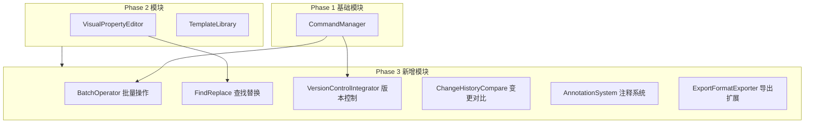

#### 3.3.4 验收标准

- 批量操作时间：10-30s → 1-3s
- 查找替换时间：5-15s → 1-2s
- 版本管理效率：基准 → 提升100%
- 变更分析时间：5-10min → 1-2min
- 团队沟通效率：基准 → 提升50%

---

### 3.4 Phase 4: 扩展性与调试（预计2-3个月）

#### 3.4.1 目标

实现扩展性功能和调试诊断功能，为高级用户提供更多可能性。

#### 3.4.2 功能清单

| 功能 | 描述 | 依赖 | 预期成果 |
|------|------|------|---------|
| **插件系统** | 实现插件架构，支持第三方扩展 | P0 | 功能扩展灵活性提升 |
| **脚本支持** | 支持Lua/Python脚本自动化操作 | P5 | 自动化操作效率提升200% |
| **性能分析器** | 实时分析布局性能瓶颈 | P0 | 性能优化效率提升100% |
| **内存分析器** | 监控内存使用情况 | P6 | 内存问题定位时间减少80% |
| **游戏引擎集成** | 直接在游戏引擎中预览布局 | P0 | 开发流程效率提升50% |

#### 3.4.3 技术要点

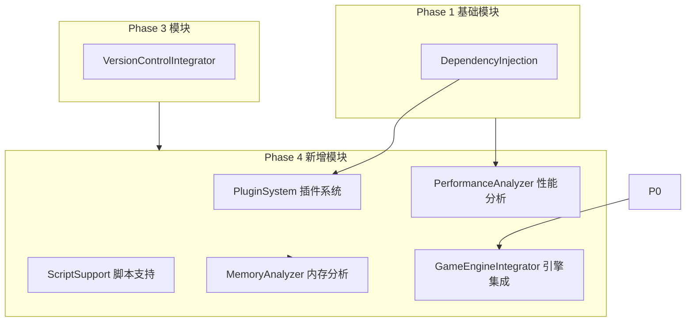

#### 3.4.4 验收标准

- 插件加载时间：<1s
- 脚本执行时间：基准 → 减少50%
- 性能分析精度：±5%
- 内存分析精度：±10%
- 引擎集成延迟：<100ms

---

### 3.5 Phase 5: 高级功能与集成（预计3-4个月）

#### 3.5.1 目标

实现高级功能和深度集成，满足企业级需求。

#### 3.5.2 功能清单

| 功能 | 描述 | 依赖 | 预期成果 |
|------|------|------|---------|
| **智能布局建议** | 基于AI算法提供布局优化建议 | P1 | 布局质量提升30% |
| **多分辨率预览** | 支持多种分辨率同时预览 | P2 | 适配效率提升100% |
| **主题切换预览** | 支持不同LookNFeel主题实时切换 | P2 | 主题开发效率提升80% |
| **动画预览** | 支持动画效果实时预览 | P2 | 动画开发效率提升60% |
| **多人协作编辑** | 支持多人同时编辑同一布局 | P4 | 团队协作效率提升100% |
| **自定义控件** | 支持自定义控件类型 | P5 | 控件扩展灵活性提升 |
| **资源管理器集成** | 直接访问游戏资源 | P7 | 资源管理效率提升50% |
| **构建系统集成** | 支持自动化构建流程 | P7 | 构建效率提升80% |
| **CI/CD集成** | 支持持续集成和部署 | P7 | 发布效率提升100% |

#### 3.5.3 技术要点

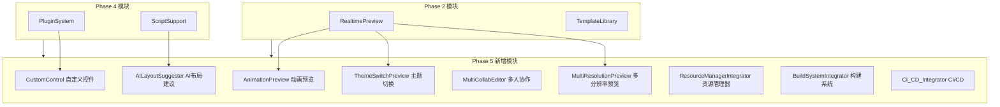

#### 3.5.4 验收标准

- 布局质量评分：基准 → 提升30%
- 多分辨率适配时间：30-60min → 5-10min
- 主题开发时间：1-2h → 10-20min
- 动画开发时间：2-4h → 30-60min
- 协作冲突率：10-20% → <5%
- 自定义控件开发时间：1-2天 → 2-4h

---

### 3.6 路线图总览

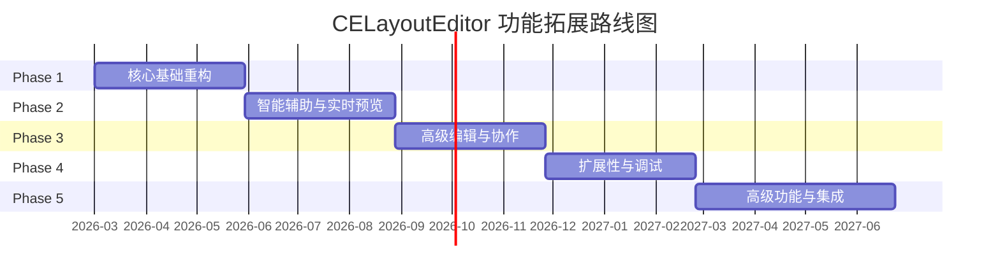

---

## 4. 技术可行性分析

### 4.1 P0 核心基础功能

| 功能 | 技术可行性 | 所需技术栈 | 潜在风险 | 应对措施 |
|------|-----------|-----------|---------|---------|
| **增量加载机制** | 高 | C++11, CEGUI 0.7.1 | DOM树差异计算复杂度 | 实现增量算法优化，限制对比深度 |
| **属性缓存系统** | 高 | C++11, std::map | 缓存一致性问题 | 实现缓存失效机制 |
| **脏矩形渲染** | 中 | OpenGL 1.x, GL_SCISSOR_TEST | 裁剪区域计算错误 | 完善边界检查和测试 |
| **资源缓存机制** | 高 | C++11, CEGUI Imageset | 内存泄漏风险 | 实现引用计数和自动清理 |
| **依赖注入容器** | 高 | C++11, std::function | 模板编译错误 | 限制模板复杂度，提供类型检查 |
| **统一命令管理** | 高 | C++11, std::shared_ptr | 命令历史过大导致内存问题 | 实现命令历史限制和压缩 |

### 4.2 P1 智能辅助功能

| 功能 | 技术可行性 | 所需技术栈 | 潜在风险 | 应对措施 |
|------|-----------|-----------|---------|---------|
| **自动对齐与分布** | 高 | C++11, CEGUI Geometry | 对齐算法精度问题 | 实现浮点数容差处理 |
| **拖拽式组件库** | 高 | wxWidgets 3.0.5, CEGUI | 拖拽事件处理复杂 | 使用wxWidgets拖拽API |
| **布局模板库** | 高 | C++11, XML | 模板版本兼容性 | 实现模板版本管理 |
| **实时渲染预览** | 高 | OpenGL, CEGUI Renderer | 预览延迟过高 | 使用脏矩形优化 |
| **可视化属性编辑器** | 高 | wxWidgets 3.0.5 | 属性类型扩展困难 | 实现属性类型注册机制 |
| **快捷键系统** | 高 | wxWidgets 3.0.5 | 快捷键冲突 | 实现快捷键优先级管理 |
| **布局验证器** | 高 | C++11, CEGUI | 验证规则不完整 | 实现可配置验证规则 |

### 4.3 P2 实时预览功能

| 功能 | 技术可行性 | 所需技术栈 | 潜在风险 | 应对措施 |
|------|-----------|-----------|---------|---------|
| **多分辨率预览** | 中 | OpenGL, FBO | 内存占用过高 | 实现分辨率限制和切换 |
| **主题切换预览** | 高 | CEGUI LookNFeel | 主题资源加载慢 | 实现主题预加载 |
| **动画预览** | 中 | CEGUI Animation | 动画同步问题 | 实现动画时间轴控制 |

### 4.4 P3 高级编辑功能

| 功能 | 技术可行性 | 所需技术栈 | 潜在风险 | 应对措施 |
|------|-----------|-----------|---------|---------|
| **批量操作** | 高 | C++11, CommandManager | 操作回滚复杂 | 实现批量命令模式 |
| **查找与替换** | 高 | C++11, CEGUI DOM | 正则表达式性能问题 | 实现查找结果缓存 |
| **版本控制集成** | 中 | libgit2, SVN API | 版本库兼容性问题 | 实现版本适配层 |

### 4.5 P4 协作功能

| 功能 | 技术可行性 | 所需技术栈 | 潜在风险 | 应对措施 |
|------|-----------|-----------|---------|---------|
| **变更历史对比** | 中 | C++11, Diff算法 | 对比结果不准确 | 实现多级对比验证 |
| **注释与标注** | 高 | C++11, XML | 注释数据丢失风险 | 实现注释持久化 |
| **多人协作编辑** | 低 | WebSocket, 同步协议 | 数据一致性问题 | 实现操作转换(OT)算法 |

### 4.6 P5 扩展性功能

| 功能 | 技术可行性 | 所需技术栈 | 潜在风险 | 应对措施 |
|------|-----------|-----------|---------|---------|
| **插件系统** | 中 | C++11, 动态库 | 插件ABI兼容性 | 定义稳定插件接口 |
| **脚本支持** | 中 | Lua 5.1, Python 2.7 | 脚本安全性问题 | 实现脚本沙箱 |
| **自定义控件** | 中 | C++11, CEGUI WidgetFactory | 控件注册复杂 | 提供控件开发模板 |

### 4.7 P6 调试诊断功能

| 功能 | 技术可行性 | 所需技术栈 | 潜在风险 | 应对措施 |
|------|-----------|-----------|---------|---------|
| **性能分析器** | 中 | C++11, 高精度计时器 | 性能开销过大 | 实现采样模式 |
| **内存分析器** | 中 | C++11, 内存追踪 | 内存追踪不准确 | 实现内存快照对比 |
| **渲染分析器** | 中 | OpenGL, 性能计数器 | GPU兼容性问题 | 实现多GPU适配 |

### 4.8 P7 集成功能

| 功能 | 技术可行性 | 所需技术栈 | 潜在风险 | 应对措施 |
|------|-----------|-----------|---------|---------|
| **游戏引擎集成** | 中 | Nuclear Engine, IEngine | 接口版本不兼容 | 实现接口适配层 |
| **资源管理器集成** | 中 | CEGUI ResourceProvider | 资源路径冲突 | 实现资源路径映射 |
| **构建系统集成** | 中 | MSBuild, Ant | 构建脚本兼容性 | 实现构建适配层 |
| **CI/CD集成** | 中 | Jenkins, GitLab CI | 配置复杂度高 | 提供CI/CD模板 |

---

## 5. 用户体验设计

### 5.1 用户交互流程设计

#### 5.1.1 标准编辑流程

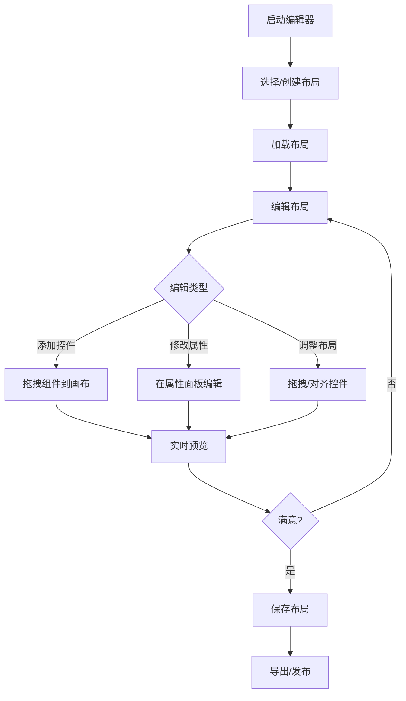

#### 5.1.2 智能辅助流程

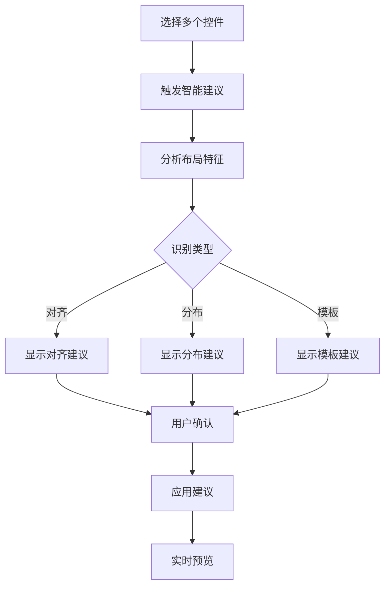

#### 5.1.3 协作编辑流程

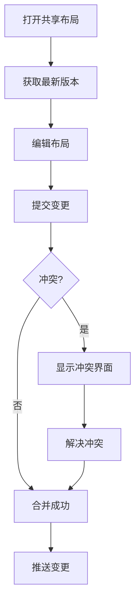

### 5.2 界面设计原则

#### 5.2.1 设计原则

| 原则 | 说明 | 应用场景 |
|------|------|---------|
| **一致性** | 保持界面元素风格一致 | 所有面板、对话框、工具栏 |
| **可预测性** | 用户行为结果可预测 | 按钮点击、拖拽操作 |
| **反馈及时性** | 操作反馈及时显示 | 保存、加载、错误提示 |
| **容错性** | 支持撤销/重做 | 所有可逆操作 |
| **效率优先** | 减少操作步骤 | 常用功能快捷键 |
| **可访问性** | 支持键盘导航 | 所有交互元素 |

#### 5.2.2 界面布局

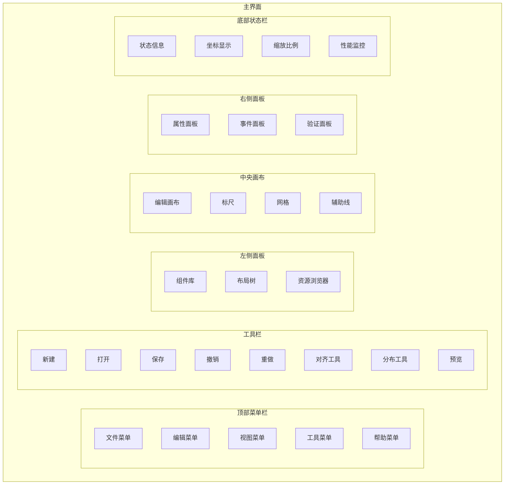

### 5.3 可访问性设计

#### 5.3.1 键盘导航

| 功能 | 快捷键 | 说明 |
|------|--------|------|
| 新建布局 | Ctrl+N | 创建新布局 |
| 打开布局 | Ctrl+O | 打开现有布局 |
| 保存布局 | Ctrl+S | 保存当前布局 |
| 撤销 | Ctrl+Z | 撤销上一步操作 |
| 重做 | Ctrl+Y | 重做上一步操作 |
| 删除 | Delete | 删除选中控件 |
| 复制 | Ctrl+C | 复制选中控件 |
| 粘贴 | Ctrl+V | 粘贴控件 |
| 全选 | Ctrl+A | 选择所有控件 |
| 查找 | Ctrl+F | 查找控件 |
| 替换 | Ctrl+H | 替换控件属性 |
| 对齐左 | Ctrl+L | 左对齐 |
| 对齐中 | Ctrl+M | 水平居中 |
| 对齐右 | Ctrl+R | 右对齐 |
| 顶对齐 | Ctrl+T | 顶对齐 |
| 垂直居中 | Ctrl+V | 垂直居中 |
| 底对齐 | Ctrl+B | 底对齐 |

#### 5.3.2 高对比度模式

- 支持高对比度主题切换
- 所有文本可读性测试通过
- 颜色对比度符合WCAG 2.0 AA标准

#### 5.3.3 屏幕阅读器支持

- 所有控件支持ARIA标签
- 提供键盘操作提示
- 状态变更语音提示

---

## 6. 性能指标与测试计划

### 6.1 性能指标

#### 6.1.1 核心性能指标

| 指标 | 当前值 | 目标值 | 测量方法 |
|------|--------|--------|---------|
| **文件加载时间** | 50-200ms | 10-50ms | 高精度计时器 |
| **属性修改延迟** | 10-30ms | 3-10ms | 高精度计时器 |
| **渲染帧率** | 30-60 FPS | 稳定60 FPS | FPS计数器 |
| **内存占用(空闲)** | 50-100 MB | 40-80 MB | 内存监控 |
| **内存占用(编辑中)** | 100-200 MB | 80-150 MB | 内存监控 |
| **撤销操作延迟** | 50-100ms | 20-50ms | 高精度计时器 |
| **预览延迟** | 200-500ms | <50ms | 高精度计时器 |

#### 6.1.2 功能性能指标

| 功能 | 当前值 | 目标值 | 测量方法 |
|------|--------|--------|---------|
| **对齐操作时间** | 5-10s | 1-2s | 用户操作计时 |
| **控件添加时间** | 3-5s | 1-1.5s | 用户操作计时 |
| **新建布局时间** | 30-60s | 10-20s | 用户操作计时 |
| **批量操作时间** | 10-30s | 1-3s | 用户操作计时 |
| **查找替换时间** | 5-15s | 1-2s | 用户操作计时 |
| **插件加载时间** | N/A | <1s | 高精度计时器 |
| **脚本执行时间** | N/A | 减少50% | 高精度计时器 |

#### 6.1.3 质量指标

| 指标 | 目标值 | 测量方法 |
|------|--------|---------|
| **布局错误率** | <2% | 自动化测试 |
| **崩溃率** | <0.1% | 崩溃监控 |
| **单元测试覆盖率** | ≥70% | 代码覆盖率工具 |
| **集成测试覆盖率** | ≥60% | 测试报告 |
| **用户满意度** | ≥4.0/5.0 | 用户调查 |

### 6.2 性能测试计划

#### 6.2.1 测试环境

| 环境 | 配置 |
|------|------|
| **操作系统** | Windows 10 64位 |
| **CPU** | Intel Core i7-9700K |
| **内存** | 16 GB DDR4 |
| **GPU** | NVIDIA GeForce RTX 2070 |
| **存储** | NVMe SSD |
| **编译器** | Visual Studio 2013 (v120) |

#### 6.2.2 测试用例

##### 6.2.2.1 文件加载测试

| 测试用例 | 描述 | 预期结果 |
|---------|------|---------|
| 小型布局加载 | 加载<100个控件的布局 | <20ms |
| 中型布局加载 | 加载100-500个控件的布局 | <50ms |
| 大型布局加载 | 加载500-1000个控件的布局 | <100ms |
| 增量加载测试 | 修改后重新加载 | 时间减少60%+ |

##### 6.2.2.2 属性编辑测试

| 测试用例 | 描述 | 预期结果 |
|---------|------|---------|
| 单个控件属性修改 | 修改单个控件属性 | <5ms |
| 多选属性修改 | 修改10个控件属性 | <10ms |
| 批量属性修改 | 修改100个控件属性 | <30ms |
| 属性缓存命中测试 | 重复访问相同属性 | 延迟降低70%+ |

##### 6.2.2.3 渲染性能测试

| 测试用例 | 描述 | 预期结果 |
|---------|------|---------|
| 静态场景渲染 | 无操作时的渲染 | FPS≥60 |
| 小幅修改渲染 | 修改单个控件 | FPS≥60 |
| 大幅修改渲染 | 修改多个控件 | FPS≥45 |
| 脏矩形渲染测试 | 局部区域修改 | 渲染开销降低60%+ |

##### 6.2.2.4 内存测试

| 测试用例 | 描述 | 预期结果 |
|---------|------|---------|
| 空闲内存测试 | 启动后无操作 | <80 MB |
| 编辑中内存测试 | 编辑大型布局 | <150 MB |
| 内存泄漏测试 | 连续打开/关闭100次 | 无明显增长 |
| 资源缓存测试 | 加载100个资源 | 缓存命中率≥80% |

#### 6.2.3 测试工具

| 工具 | 用途 |
|------|------|
| **Google Benchmark** | 性能基准测试 |
| **Valgrind** | 内存泄漏检测 |
| **Visual Studio Profiler** | 性能分析 |
| **RenderDoc** | 渲染性能分析 |
| **Google Test** | 单元测试 |

### 6.3 性能监控方案

#### 6.3.1 监控指标

| 指标 | 采集频率 | 阈值 | 告警方式 |
|------|---------|------|---------|
| **CPU使用率** | 1s | >80% | 状态栏显示 |
| **内存使用量** | 1s | >150 MB | 状态栏显示 |
| **渲染帧率** | 0.5s | <45 FPS | 状态栏显示 |
| **文件加载时间** | 每次加载 | >100ms | 日志记录 |
| **属性修改延迟** | 每次修改 | >10ms | 日志记录 |

#### 6.3.2 监控界面

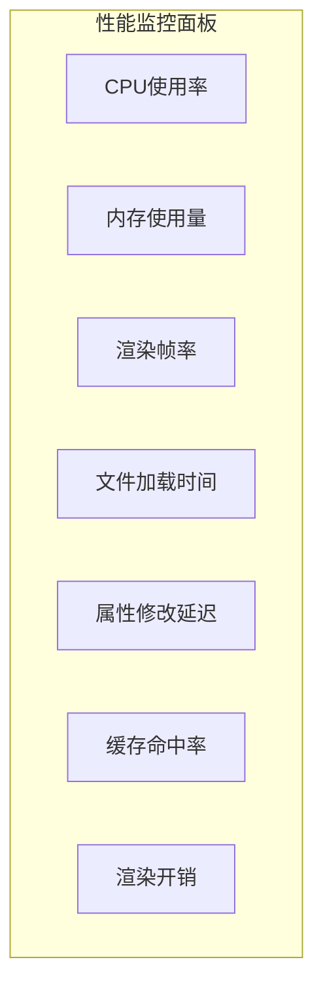

---

## 7. 风险评估与应对措施

### 7.1 技术风险

| 风险 | 概率 | 影响 | 应对措施 |
|------|------|------|---------|
| **VS2013兼容性问题** | 中 | 高 | 限制C++11特性使用，充分测试 |
| **CEGUI API限制** | 高 | 中 | 封装CEGUI API，实现适配层 |
| **内存泄漏** | 中 | 高 | 使用智能指针，内存分析器监控 |
| **性能优化效果不达预期** | 中 | 中 | 分阶段优化，持续性能测试 |
| **插件ABI兼容性** | 高 | 高 | 定义稳定插件接口，版本管理 |

### 7.2 项目风险

| 风险 | 概率 | 影响 | 应对措施 |
|------|------|------|---------|
| **开发周期超期** | 中 | 中 | 分阶段交付，灵活调整优先级 |
| **需求变更** | 高 | 中 | 敏捷开发，快速响应变更 |
| **人员流动** | 低 | 高 | 代码文档完善，知识共享 |
| **测试资源不足** | 中 | 中 | 自动化测试，持续集成 |

### 7.3 业务风险

| 风险 | 概率 | 影响 | 应对措施 |
|------|------|------|---------|
| **用户接受度低** | 中 | 高 | 用户参与设计，快速迭代 |
| **竞争对手超越** | 中 | 中 | 持续创新，保持领先 |
| **技术债务累积** | 高 | 高 | 代码审查，定期重构 |

### 7.4 风险应对策略

#### 7.4.1 预防措施

1. **技术选型**：充分调研，选择成熟稳定的技术栈
2. **架构设计**：模块化设计，降低耦合度
3. **代码质量**：代码审查，单元测试，持续集成
4. **文档管理**：完善技术文档，知识共享

#### 7.4.2 应急预案

1. **性能回退**：保留原有实现，性能不达标可回退
2. **功能降级**：高级功能可选，核心功能优先保证
3. **快速修复**：建立快速响应机制，及时修复问题

---

## 8. 附录

### 8.1 术语表

| 术语 | 说明 |
|------|------|
| **CEGUI** | Crazy Eddie's GUI System，开源GUI库 |
| **wxWidgets** | 跨平台C++ GUI框架 |
| **Layout** | CEGUI布局文件，描述UI界面结构 |
| **LookNFeel** | CEGUI外观定义文件 |
| **Imageset** | CEGUI图片集定义文件 |
| **Scheme** | CEGUI资源方案文件 |
| **DirtyRect** | 脏矩形，需要重绘的区域 |
| **DependencyInjection** | 依赖注入，一种设计模式 |
| **CommandPattern** | 命令模式，一种设计模式 |

### 8.2 参考文档

| 文档 | 路径 |
|------|------|
| 现行静态分析 | [CELayoutEditor 静态分析](../docs/08-技术研究/14-CELayoutEditor静态分析.md) |
| 架构重构方案 | [`plans/01-CELayoutEditor架构重构与性能优化方案__Architecture-Refactoring-Performance-Optimization.md`](01-CELayoutEditor架构重构与性能优化方案__Architecture-Refactoring-Performance-Optimization.md) |
| CEGUI文档 | [`tools/CEGUI-0.7.9-r5/CEGUI_Knowledge_Base/`](../tools/CEGUI-0.7.9-r5/CEGUI_Knowledge_Base) |
| 项目规则 | [`.claude/RULES.md`](../.claude/RULES.md) |

### 8.3 版本历史

| 版本 | 日期 | 作者 | 变更说明 |
|------|------|------|---------|
| 1.0 | 2026-02-19 | AI架构师 | 初始版本 |

---

**报告生成日期**: 2026-02-19  
**设计人员**: AI架构师  
**报告版本**: 1.0
