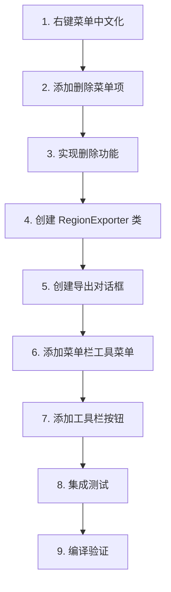

# CEImagesetEditor 新功能实现方案

> **创建日期**: 2026-01-09
> **状态**: 待实施
> **优先级**: 高

---

## 1. 需求概述

根据用户反馈，需要实现以下功能增强：

### 1.1 右键菜单增加删除功能
- 在区域右键菜单中添加"删除"选项
- 支持删除当前选中的区域

### 1.2 菜单中文本地化
- 右键菜单项全部使用中文
- 保持与主菜单栏风格一致

### 1.3 切图导出功能
- 菜单栏新增"裁切"按钮
- 支持导出整个图集的所有子图
- 支持导出选中的单个或多个区域
- 自动创建以图集名称命名的文件夹保存切图

---

## 2. 技术方案

### 2.1 右键菜单优化

**修改文件**: 
- [`inc/EditorGLCanvas.h`](../tools/CEImagesetEditor-0.7.1/inc/EditorGLCanvas.h)
- [`src/EditorGLCanvas.cpp`](../tools/CEImagesetEditor-0.7.1/src/EditorGLCanvas.cpp)

**实现步骤**:

1. 新增菜单项 ID:
```cpp
enum {
    ID_CTX_NINEPATCH = 20000,
    ID_CTX_THREEPIECE_H,
    ID_CTX_THREEPIECE_V,
    ID_CTX_TWOPIECE_H,
    ID_CTX_TWOPIECE_V,
    ID_CTX_DELETE_REGION,      // 新增: 删除区域
    ID_CTX_EXPORT_REGION,      // 新增: 导出选中区域
    ID_CTX_EXPORT_ALL          // 新增: 导出所有区域
};
```

2. 更新 `ShowRegionContextMenu()` 函数:
```cpp
void EditorGLCanvas::ShowRegionContextMenu(const wxPoint& pos) {
    wxMenu menu;

    // 区域生成子菜单
    wxMenu* generateMenu = new wxMenu();
    generateMenu->Append(ID_CTX_NINEPATCH, wxT("九宫格切分"));
    generateMenu->Append(ID_CTX_THREEPIECE_H, wxT("水平三段式"));
    generateMenu->Append(ID_CTX_THREEPIECE_V, wxT("垂直三段式"));
    generateMenu->Append(ID_CTX_TWOPIECE_H, wxT("水平两段式"));
    generateMenu->Append(ID_CTX_TWOPIECE_V, wxT("垂直两段式"));
    
    menu.AppendSubMenu(generateMenu, wxT("生成区域"));
    menu.AppendSeparator();
    
    // 切图导出选项
    menu.Append(ID_CTX_EXPORT_REGION, wxT("导出选中区域..."));
    menu.Append(ID_CTX_EXPORT_ALL, wxT("导出所有区域..."));
    menu.AppendSeparator();
    
    // 删除选项
    menu.Append(ID_CTX_DELETE_REGION, wxT("删除区域"));
    
    PopupMenu(&menu, ScreenToClient(ClientToScreen(pos)));
}
```

3. 新增事件处理函数:
```cpp
void EditorGLCanvas::OnCtxDeleteRegion(wxCommandEvent& event);
void EditorGLCanvas::OnCtxExportRegion(wxCommandEvent& event);
void EditorGLCanvas::OnCtxExportAll(wxCommandEvent& event);
```

### 2.2 切图导出功能

**新增文件**:
- [`inc/RegionExporter.h`](../tools/CEImagesetEditor-0.7.1/inc/RegionExporter.h)
- [`src/RegionExporter.cpp`](../tools/CEImagesetEditor-0.7.1/src/RegionExporter.cpp)

**核心类设计**:

```cpp
/**
 * @brief 区域导出器 - 将图集区域导出为单独的图片文件
 */
class RegionExporter {
public:
    struct ExportConfig {
        wxString outputDir;       // 输出目录
        wxString format;          // 输出格式 (png/jpg/tga)
        bool createSubfolder;     // 是否创建子文件夹
        bool overwriteExisting;   // 是否覆盖已存在文件
    };
    
    struct ExportResult {
        int successCount;
        int failCount;
        wxArrayString failedRegions;
        wxString outputPath;
    };
    
    /**
     * @brief 导出指定区域
     * @param sourceImage 源图像路径
     * @param regions 要导出的区域列表 (名称 -> 矩形)
     * @param config 导出配置
     * @return 导出结果
     */
    static ExportResult ExportRegions(
        const wxString& sourceImage,
        const std::map<wxString, wxRect>& regions,
        const ExportConfig& config
    );
    
    /**
     * @brief 导出单个区域
     */
    static bool ExportSingleRegion(
        const wxImage& sourceImage,
        const wxString& regionName,
        const wxRect& region,
        const wxString& outputPath,
        const wxString& format
    );
    
private:
    /**
     * @brief 获取图像保存格式类型
     */
    static wxBitmapType GetBitmapType(const wxString& format);
};
```

**实现流程**:

```
┌─────────────────────────────────────────────────────────────┐
│                    切图导出流程                              │
├─────────────────────────────────────────────────────────────┤
│                                                              │
│  用户操作                                                    │
│     │                                                        │
│     ├─→ 菜单栏 "裁切" 按钮                                   │
│     │      └─→ 弹出导出对话框                                │
│     │            ├─ 选择: 导出所有 / 导出选中                │
│     │            ├─ 选择: 输出格式 (PNG/JPG/TGA)             │
│     │            └─ 确认导出                                  │
│     │                                                        │
│     └─→ 右键菜单 "导出选中区域"                              │
│            └─→ 直接导出当前选中区域                          │
│                                                              │
│  导出逻辑                                                    │
│     │                                                        │
│     ├─ 1. 获取图集文件名 (如: common.imageset)              │
│     ├─ 2. 创建输出目录 (exe目录/common/)                    │
│     ├─ 3. 加载源图像到 wxImage                              │
│     ├─ 4. 遍历要导出的区域                                   │
│     │      ├─ 提取子图像 (GetSubImage)                      │
│     │      └─ 保存为独立文件 (regionName.png)               │
│     └─ 5. 显示导出结果                                       │
│                                                              │
└─────────────────────────────────────────────────────────────┘
```

### 2.3 菜单栏集成

**修改文件**:
- [`inc/EditorFrame.h`](../tools/CEImagesetEditor-0.7.1/inc/EditorFrame.h)
- [`src/EditorFrame.cpp`](../tools/CEImagesetEditor-0.7.1/src/EditorFrame.cpp)

**新增菜单项**:

```cpp
// 在 EditorFrame.cpp 的 AttachMenubar() 中添加

// 工具菜单 (新增)
wxMenu *menu_tools = new wxMenu;
menu_tools->Append(ID_MENU_EXPORT_ALL, wxT("导出所有切图(&A)...\tCtrl-E"),
                   wxT("将图集中所有区域导出为单独图片"));
menu_tools->Append(ID_MENU_EXPORT_SELECTED, wxT("导出选中切图(&S)..."),
                   wxT("导出当前选中的区域"));
menu_tools->AppendSeparator();
menu_tools->Append(ID_MENU_EXPORT_SETTINGS, wxT("导出设置(&P)..."),
                   wxT("配置切图导出选项"));
menu_bar->Append(menu_tools, wxT("工具(&T)"));
```

**工具栏按钮**:

```cpp
// 在 AttachToolbar() 中添加裁切按钮
// 需要创建新的图标文件: bitmaps/export.xpm
toolBar->AddSeparator();
toolBar->AddTool(ID_MENU_EXPORT_ALL, wxBitmap(export_xpm), wxT("导出切图"));
```

### 2.4 导出对话框

**新增文件**:
- [`inc/DialogExportRegions.h`](../tools/CEImagesetEditor-0.7.1/inc/DialogExportRegions.h)
- [`src/DialogExportRegions.cpp`](../tools/CEImagesetEditor-0.7.1/src/DialogExportRegions.cpp)

**对话框设计**:

```
┌─────────────────────────────────────────────┐
│          导出切图                     [X]   │
├─────────────────────────────────────────────┤
│                                              │
│  导出范围:                                   │
│    ○ 所有区域 (共 24 个)                    │
│    ● 选中区域 (共 3 个)                     │
│                                              │
│  输出目录:                                   │
│  [E:\MT3\tools\CEImagesetEditor...\common] [浏览]│
│                                              │
│  输出格式:                                   │
│    ● PNG (推荐，支持透明)                   │
│    ○ JPG (不支持透明)                       │
│    ○ TGA (游戏引擎原始格式)                 │
│                                              │
│  选项:                                       │
│    [✓] 自动创建子文件夹                     │
│    [✓] 覆盖已存在的文件                     │
│                                              │
├─────────────────────────────────────────────┤
│               [导出]    [取消]               │
└─────────────────────────────────────────────┘
```

---

## 3. 文件变更清单

### 3.1 修改文件

| 文件 | 变更内容 |
|------|----------|
| `inc/EditorGLCanvas.h` | 添加删除/导出菜单项ID和事件处理函数声明 |
| `src/EditorGLCanvas.cpp` | 实现右键菜单中文化、删除功能、导出功能 |
| `inc/EditorFrame.h` | 添加工具菜单和导出事件处理函数声明 |
| `src/EditorFrame.cpp` | 添加"工具"菜单、裁切按钮、导出事件处理 |
| `vc++9/CEImagesetEditor.vcxproj` | 添加新源文件引用 |

### 3.2 新增文件

| 文件 | 说明 |
|------|------|
| `inc/RegionExporter.h` | 区域导出器头文件 |
| `src/RegionExporter.cpp` | 区域导出器实现 |
| `inc/DialogExportRegions.h` | 导出对话框头文件 |
| `src/DialogExportRegions.cpp` | 导出对话框实现 |
| `bitmaps/export.xpm` | 导出工具栏图标 |

---

## 4. 实现顺序



---

## 5. 依赖说明

### 5.1 wxWidgets 依赖

切图功能需要使用 wxWidgets 的图像处理能力：

```cpp
#include <wx/image.h>    // wxImage 类
#include <wx/filename.h> // 文件路径处理
#include <wx/dir.h>      // 目录操作
```

### 5.2 图像格式支持

需要确保 wxWidgets 编译时启用了以下图像格式处理器：

```cpp
// 在应用程序初始化时添加
wxImage::AddHandler(new wxPNGHandler);
wxImage::AddHandler(new wxJPEGHandler);
wxImage::AddHandler(new wxTGAHandler);  // 如果需要 TGA 支持
```

---

## 6. 测试用例

### 6.1 右键菜单测试

| 测试项 | 预期结果 |
|--------|----------|
| 右键点击区域 | 显示中文右键菜单 |
| 点击"删除区域" | 删除当前选中的区域 |
| 未选中区域时右键 | 不显示菜单或菜单项禁用 |

### 6.2 切图导出测试

| 测试项 | 预期结果 |
|--------|----------|
| 导出所有区域 | 在指定目录创建所有子图 |
| 导出选中区域 | 仅导出选中的区域 |
| 自动创建目录 | 根据图集名称创建子目录 |
| 覆盖已存在文件 | 根据设置决定是否覆盖 |
| 不同格式导出 | PNG/JPG/TGA 均能正常导出 |

---

## 7. 风险评估

| 风险 | 影响 | 缓解措施 |
|------|------|----------|
| 大图像内存占用 | 中 | 分批处理，及时释放内存 |
| 文件写入失败 | 低 | 添加错误处理和重试机制 |
| 路径包含特殊字符 | 低 | 使用 wxFileName 处理路径 |

---

## 8. 后续优化建议

1. **批量选择**: 支持 Ctrl+点击多选区域
2. **预览功能**: 导出前预览切图效果
3. **命名模板**: 支持自定义输出文件命名规则
4. **质量设置**: JPG 格式支持质量调整
5. **缩放导出**: 支持按比例缩放导出

---

**审核状态**: 待审核
**预计工时**: 2-3 天
