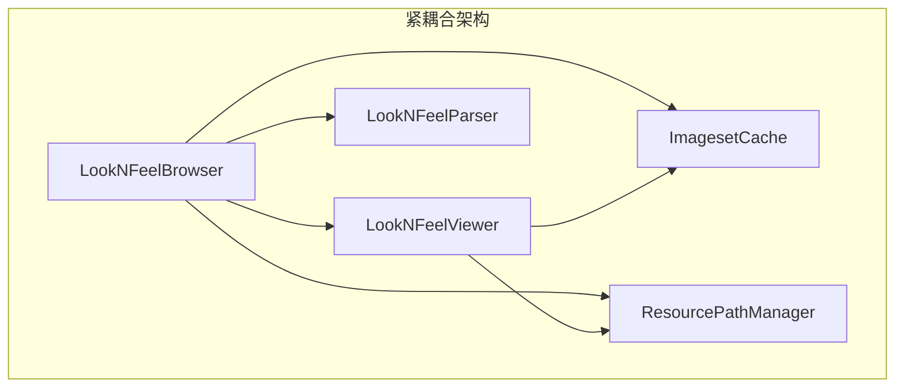
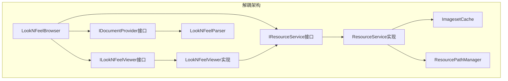
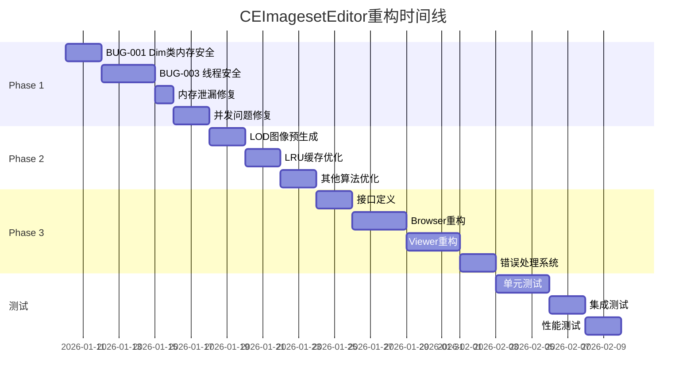

# CEImagesetEditor 后续重构路线图

> **版本**: 1.0
> **创建日期**: 2026-01-09
> **基于**: 代码深度评估与已完成修复工作

---

## 已完成的优化工作

### 1. BUG-002: AsyncTextureLoader递归栈溢出修复
- **文件**: [`AsyncTextureLoader.cpp`](../tools/CEImagesetEditor-0.7.1/src/AsyncTextureLoader.cpp:285)
- **问题**: `getNextTask()`方法使用递归调用处理已取消任务
- **修复**: 改为迭代循环（while循环）

### 2. 性能优化: collectImagesetNames() O(n²)算法
- **文件**: [`LookNFeelData.h`](../tools/CEImagesetEditor-0.7.1/inc/LookNFeelData.h:457)
- **问题**: 双重循环去重，时间复杂度O(n²)
- **修复**: 使用`std::set`进行高效去重，时间复杂度降低到O(n log n)

---

## Phase 1: 立即修复 - P0级别稳定性问题

### 1.1 BUG-001: Dim类裸指针内存安全问题

**问题位置**: [`LookNFeelData.h`](../tools/CEImagesetEditor-0.7.1/inc/LookNFeelData.h:85) 第85-157行

**问题描述**:
```cpp
struct Dim {
    // ...
    Dim* operand;  // 裸指针，存在潜在的double-free风险
    
    ~Dim() {
        if (operand) {
            delete operand;
            operand = NULL;
        }
    }
};
```

**风险分析**:
- 复制构造函数进行深拷贝，但如果在复制过程中抛出异常，可能导致内存泄漏
- 赋值操作符中先delete再new，如果new失败会丢失原数据
- 不满足异常安全保证

**重构方案**:
```cpp
// 方案A: 使用 std::unique_ptr (推荐，需C++11)
struct Dim {
    std::unique_ptr<Dim> operand;
    
    Dim(const Dim& other) 
        : type(other.type)
        , absoluteValue(other.absoluteValue)
        // ... 其他成员
        , operand(other.operand ? std::make_unique<Dim>(*other.operand) : nullptr)
    {}
    
    Dim& operator=(const Dim& other) {
        if (this != &other) {
            // 复制其他成员
            operand = other.operand ? std::make_unique<Dim>(*other.operand) : nullptr;
        }
        return *this;
    }
};

// 方案B: C++98兼容方案 - 使用copy-and-swap惯用法
struct Dim {
    void swap(Dim& other) {
        using std::swap;
        swap(type, other.type);
        swap(absoluteValue, other.absoluteValue);
        // ... 其他成员
        swap(operand, other.operand);
    }
    
    Dim& operator=(Dim other) {  // 值传递
        swap(other);
        return *this;
    }
};
```

**测试要点**:
- 深拷贝正确性测试
- 异常安全测试
- 自赋值测试
- 内存泄漏检测（Valgrind/DrMemory）

---

### 1.2 BUG-003: wxImage后台线程加载线程安全问题

**问题位置**: [`AsyncTextureLoader.cpp`](../tools/CEImagesetEditor-0.7.1/src/AsyncTextureLoader.cpp:50) 第50-54行

**问题描述**:
```cpp
void* TextureWorkerThread::Entry()
{
    // ...
    wxImage image;
    if (wxFileName::FileExists(task.filePath))
    {
        if (image.LoadFile(task.filePath))  // wxImage在非GUI线程加载可能不安全
        {
            // ...
        }
    }
}
```

**风险分析**:
- wxImage的某些图像处理函数可能使用全局状态
- 在Windows上，某些图像格式的handler可能不是线程安全的
- 可能导致随机崩溃或数据损坏

**重构方案**:

```cpp
// 方案A: 使用底层文件I/O + 手动解码
void* TextureWorkerThread::Entry()
{
    while (!m_owner->isShutdownRequested())
    {
        LoadTask task;
        if (!m_owner->getNextTask(task))
            continue;
            
        LoadResult result;
        result.taskId = task.taskId;
        
        // 在工作线程只读取原始文件数据
        wxFile file(task.filePath);
        if (file.IsOpened())
        {
            size_t fileSize = file.Length();
            result.rawData.resize(fileSize);
            file.Read(result.rawData.data(), fileSize);
            file.Close();
            
            result.needsDecoding = true;  // 标记需要在主线程解码
            result.success = true;
        }
        else
        {
            result.success = false;
            result.errorMessage = wxT("Failed to open file");
        }
        
        m_owner->reportCompletion(result);
    }
    return NULL;
}

// 主线程回调中解码
void AsyncTextureLoader::onTextureLoaded(wxThreadEvent& event)
{
    LoadResult* result = event.GetPayload<LoadResult*>();
    if (!result) return;
    
    if (result->needsDecoding && result->success)
    {
        // 在主线程安全地解码图像
        wxMemoryInputStream stream(result->rawData.data(), result->rawData.size());
        result->image.LoadFile(stream);
        result->width = result->image.GetWidth();
        result->height = result->image.GetHeight();
    }
    
    if (m_callback)
    {
        m_callback(*result);
    }
    
    delete result;
}
```

```cpp
// 方案B: 使用stb_image等线程安全的第三方库
#include "stb_image.h"

void* TextureWorkerThread::Entry()
{
    while (!m_owner->isShutdownRequested())
    {
        LoadTask task;
        if (!m_owner->getNextTask(task))
            continue;
            
        LoadResult result;
        result.taskId = task.taskId;
        
        // stb_image是线程安全的
        int width, height, channels;
        unsigned char* data = stbi_load(
            task.filePath.ToStdString().c_str(),
            &width, &height, &channels, 4);  // 强制RGBA
            
        if (data)
        {
            result.success = true;
            result.width = width;
            result.height = height;
            result.pixelData.assign(data, data + width * height * 4);
            stbi_image_free(data);
        }
        else
        {
            result.success = false;
            result.errorMessage = wxString::FromUTF8(stbi_failure_reason());
        }
        
        m_owner->reportCompletion(result);
    }
    return NULL;
}
```

**推荐**: 方案B（使用stb_image），因为它：
- 完全线程安全
- 性能更好（纯C实现，无wxWidgets开销）
- 单头文件，易于集成
- 支持多种图像格式

---

### 1.3 内存泄漏: reportCompletion中LoadResult泄漏

**问题位置**: [`AsyncTextureLoader.cpp`](../tools/CEImagesetEditor-0.7.1/src/AsyncTextureLoader.cpp:327) 第327-341行

**问题描述**:
```cpp
void AsyncTextureLoader::reportCompletion(const LoadResult& result)
{
    // Skip if task was cancelled
    if (isTaskCancelled(result.taskId))
        return;  // 这里没有问题，因为resultCopy还没创建
    
    wxThreadEvent* event = new wxThreadEvent(EVT_TEXTURE_LOADED);
    LoadResult* resultCopy = new LoadResult(result);  // 这里new了
    event->SetPayload(resultCopy);
    
    wxQueueEvent(this, event);  // 如果这里失败，resultCopy会泄漏
}
```

**风险分析**:
- 如果`wxQueueEvent`失败（虽然罕见），`resultCopy`会泄漏
- 如果事件处理器异常退出，也可能泄漏

**重构方案**:
```cpp
void AsyncTextureLoader::reportCompletion(const LoadResult& result)
{
    if (isTaskCancelled(result.taskId))
        return;
    
    // 使用智能指针管理生命周期
    std::unique_ptr<LoadResult> resultCopy(new LoadResult(result));
    
    wxThreadEvent* event = new wxThreadEvent(EVT_TEXTURE_LOADED);
    event->SetPayload(resultCopy.get());
    
    // 只有成功入队后才释放所有权
    if (wxQueueEvent(this, event))
    {
        resultCopy.release();  // 成功，释放所有权给事件系统
    }
    // 失败时unique_ptr自动删除resultCopy
}

void AsyncTextureLoader::onTextureLoaded(wxThreadEvent& event)
{
    std::unique_ptr<LoadResult> result(event.GetPayload<LoadResult*>());
    if (!result)
        return;
    
    if (m_callback)
    {
        m_callback(*result);
    }
    // result在作用域结束时自动删除
}
```

---

### 1.4 并发问题: m_cancelledTasks线性查找与数据竞争

**问题位置**: [`AsyncTextureLoader.cpp`](../tools/CEImagesetEditor-0.7.1/src/AsyncTextureLoader.cpp:343) 第343-352行

**问题描述**:
```cpp
bool AsyncTextureLoader::isTaskCancelled(int taskId) const
{
    wxCriticalSectionLocker lock(m_cancelLock);
    for (size_t i = 0; i < m_cancelledTasks.size(); ++i)  // O(n)查找
    {
        if (m_cancelledTasks[i] == taskId)
            return true;
    }
    return false;
}
```

**问题**:
1. O(n)线性查找，当大量任务被取消时性能下降
2. `m_cancelledTasks`会无限增长，没有清理机制

**重构方案**:
```cpp
// 在头文件中
class AsyncTextureLoader {
private:
    std::set<int> m_cancelledTasks;  // 使用set替代vector
    
    // 定期清理已完成的取消任务
    void cleanupCancelledTasks();
};

// 在实现文件中
bool AsyncTextureLoader::isTaskCancelled(int taskId) const
{
    wxCriticalSectionLocker lock(m_cancelLock);
    return m_cancelledTasks.find(taskId) != m_cancelledTasks.end();  // O(log n)
}

void AsyncTextureLoader::cancelTask(int taskId)
{
    wxCriticalSectionLocker lock(m_cancelLock);
    m_cancelledTasks.insert(taskId);
    
    // 当取消列表过大时触发清理
    if (m_cancelledTasks.size() > 1000)
    {
        cleanupCancelledTasks();
    }
}

void AsyncTextureLoader::cleanupCancelledTasks()
{
    // 移除小于最小待处理任务ID的取消记录
    int minPendingId = getMinPendingTaskId();
    for (auto it = m_cancelledTasks.begin(); it != m_cancelledTasks.end(); )
    {
        if (*it < minPendingId)
            it = m_cancelledTasks.erase(it);
        else
            ++it;
    }
}
```

---

## Phase 2: 短期优化 - 性能提升

### 2.1 TiledTextureManager::uploadTileToGPU重复图像处理

**问题位置**: [`TiledTextureManager.cpp`](../tools/CEImagesetEditor-0.7.1/src/TiledTextureManager.cpp:349) 第349-507行

**问题描述**:
```cpp
bool TiledTextureManager::uploadTileToGPU(TextureTile& tile, int lodLevel)
{
    // ...
    
    // 每次上传都重新计算LOD图像
    wxImage lodImage;
    if (lodLevel == 0)
    {
        lodImage = m_fullImage;
    }
    else
    {
        // 每次都重新缩放！这是性能瓶颈
        lodImage = m_fullImage.Scale(lod.width, lod.height, wxIMAGE_QUALITY_HIGH);
    }
    
    // ... 后续处理
}
```

**性能问题**:
- 每个瓦片上传时都重新缩放整个图像
- `wxIMAGE_QUALITY_HIGH`使用双三次插值，计算开销大
- 对于大图像（如4K纹理），这会导致明显卡顿

**重构方案**:
```cpp
class TiledTextureManager {
private:
    // 预生成的LOD图像缓存
    std::vector<wxImage> m_lodImageCache;
    
    void generateLODs()
    {
        m_lodLevels.clear();
        m_lodImageCache.clear();
        
        int width = m_imageWidth;
        int height = m_imageHeight;
        float scale = 1.0f;
        
        for (int level = 0; level < m_config.lodLevels; ++level)
        {
            if (width < m_config.tileSize && height < m_config.tileSize && level > 0)
                break;
            
            LODLevel lod;
            lod.level = level;
            lod.scale = scale;
            lod.width = width;
            lod.height = height;
            
            // 预生成LOD图像
            if (level == 0)
            {
                m_lodImageCache.push_back(m_fullImage);
            }
            else
            {
                // 只在初始化时缩放一次
                wxImage lodImage = m_fullImage.Scale(width, height, wxIMAGE_QUALITY_HIGH);
                m_lodImageCache.push_back(lodImage);
            }
            
            m_lodLevels.push_back(lod);
            
            width = (width + 1) / 2;
            height = (height + 1) / 2;
            scale *= 0.5f;
        }
        
        // 创建瓦片元数据
        for (size_t i = 0; i < m_lodLevels.size(); ++i)
        {
            createTilesForLOD((int)i);
        }
    }
    
    bool uploadTileToGPU(TextureTile& tile, int lodLevel)
    {
        if (lodLevel < 0 || lodLevel >= (int)m_lodImageCache.size())
            return false;
        
        // 直接使用预生成的LOD图像
        const wxImage& lodImage = m_lodImageCache[lodLevel];
        
        // ... 提取瓦片区域并上传
    }
};
```

**预期收益**:
- 消除重复的图像缩放计算
- 瓦片上传速度提升10-50倍（取决于图像大小）
- 内存使用略有增加，但可通过延迟生成LOD来优化

---

### 2.2 TiledTextureManager::unloadLRUTiles O(n)查找

**问题位置**: [`TiledTextureManager.cpp`](../tools/CEImagesetEditor-0.7.1/src/TiledTextureManager.cpp:577) 第577-608行

**问题描述**:
```cpp
void TiledTextureManager::unloadLRUTiles(int count)
{
    for (int i = 0; i < count && !m_lruList.empty(); ++i)
    {
        // 遍历整个列表找最旧的 - O(n)
        std::list<...>::iterator oldest = m_lruList.begin();
        unsigned long oldestTime = ULONG_MAX;
        
        for (std::list<...>::iterator it = m_lruList.begin();
             it != m_lruList.end(); ++it)
        {
            TextureTile* tile = getTile(...);
            if (tile && tile->loaded && tile->lastUsed < oldestTime)
            {
                oldest = it;
                oldestTime = tile->lastUsed;
            }
        }
        // ...
    }
}
```

**问题**:
- 每次卸载都要遍历整个LRU列表
- 当缓存瓦片数量增加时，性能急剧下降
- 多次卸载时复杂度为O(count * n)

**重构方案 - 标准LRU实现**:
```cpp
class TiledTextureManager {
private:
    // 瓦片键类型
    struct TileKey {
        int lodLevel;
        int tileX;
        int tileY;
        
        bool operator==(const TileKey& other) const {
            return lodLevel == other.lodLevel && 
                   tileX == other.tileX && 
                   tileY == other.tileY;
        }
    };
    
    struct TileKeyHash {
        size_t operator()(const TileKey& key) const {
            return std::hash<int>()(key.lodLevel) ^ 
                   (std::hash<int>()(key.tileX) << 1) ^
                   (std::hash<int>()(key.tileY) << 2);
        }
    };
    
    // LRU缓存数据结构
    std::list<TileKey> m_lruOrder;  // 按访问顺序排列
    std::unordered_map<TileKey, 
                       std::list<TileKey>::iterator, 
                       TileKeyHash> m_lruMap;  // 快速查找位置
    
    void touchTile(TextureTile& tile, int lodLevel)
    {
        TileKey key{lodLevel, tile.tileX, tile.tileY};
        
        auto it = m_lruMap.find(key);
        if (it != m_lruMap.end())
        {
            // 移动到列表末尾（最近使用）
            m_lruOrder.splice(m_lruOrder.end(), m_lruOrder, it->second);
        }
        else
        {
            // 新瓦片，添加到末尾
            m_lruOrder.push_back(key);
            m_lruMap[key] = std::prev(m_lruOrder.end());
        }
    }
    
    void unloadLRUTiles(int count)
    {
        for (int i = 0; i < count && !m_lruOrder.empty(); ++i)
        {
            // O(1) 获取最旧瓦片
            TileKey key = m_lruOrder.front();
            m_lruOrder.pop_front();
            m_lruMap.erase(key);
            
            TextureTile* tile = getTile(key.lodLevel, key.tileX, key.tileY);
            if (tile && tile->loaded)
            {
                glDeleteTextures(1, &tile->glTextureId);
                tile->glTextureId = 0;
                tile->loaded = false;
                m_loadedTileCount--;
            }
        }
    }
};
```

**复杂度对比**:
| 操作 | 原实现 | 优化后 |
|------|--------|--------|
| touchTile | O(1) | O(1) |
| unloadLRUTiles(1) | O(n) | O(1) |
| unloadLRUTiles(k) | O(k*n) | O(k) |

---

### 2.3 其他低效算法排查

#### 2.3.1 isTaskPending中的队列复制

**问题位置**: [`AsyncTextureLoader.cpp`](../tools/CEImagesetEditor-0.7.1/src/AsyncTextureLoader.cpp:249) 第249-272行

```cpp
bool AsyncTextureLoader::isTaskPending(int taskId) const
{
    wxCriticalSectionLocker lock(m_queueLock);
    
    // 复制整个队列来检查！
    std::queue<LoadTask> tempQueue = m_highPriorityQueue;
    while (!tempQueue.empty())
    {
        if (tempQueue.front().taskId == taskId)
            return true;
        tempQueue.pop();
    }
    // ...
}
```

**优化方案**:
```cpp
// 使用std::deque替代std::queue，支持迭代
class AsyncTextureLoader {
private:
    std::deque<LoadTask> m_taskQueue;
    std::deque<LoadTask> m_highPriorityQueue;
    
    bool isTaskPending(int taskId) const
    {
        wxCriticalSectionLocker lock(m_queueLock);
        
        // 直接遍历，不复制
        for (const auto& task : m_highPriorityQueue)
        {
            if (task.taskId == taskId)
                return true;
        }
        for (const auto& task : m_taskQueue)
        {
            if (task.taskId == taskId)
                return true;
        }
        return false;
    }
};
```

#### 2.3.2 ImagesetCache::addSearchPath重复检查

**问题位置**: [`ImagesetCache.cpp`](../tools/CEImagesetEditor-0.7.1/src/ImagesetCache.cpp:54) 第54-72行

```cpp
void ImagesetCache::addSearchPath(const wxString& path)
{
    // O(n)检查重复
    for (size_t i = 0; i < m_searchPaths.size(); ++i) {
        if (m_searchPaths[i] == normalizedPath) {
            return;
        }
    }
    m_searchPaths.push_back(normalizedPath);
}
```

**优化方案**:
```cpp
class ImagesetCache {
private:
    std::set<wxString> m_searchPathSet;  // 用于快速查重
    std::vector<wxString> m_searchPaths;  // 保持顺序
    
    void addSearchPath(const wxString& path)
    {
        wxString normalizedPath = normalizePath(path);
        
        // O(log n)检查
        if (m_searchPathSet.insert(normalizedPath).second)
        {
            m_searchPaths.push_back(normalizedPath);
        }
    }
};
```

---

## Phase 3: 中期改进 - 架构优化

### 3.1 LookNFeel浏览器与预览组件解耦

**当前问题**:



**问题分析**:
1. `LookNFeelBrowser`直接创建和管理`LookNFeelViewer`实例
2. 两个组件都直接依赖`ImagesetCache`和`ResourcePathManager`单例
3. 无法独立测试任何组件
4. 无法替换或扩展渲染器

**目标架构**:



**接口定义**:

```cpp
// ILookNFeelViewer.h - 预览器接口
class ILookNFeelViewer {
public:
    virtual ~ILookNFeelViewer() {}
    
    virtual void setWidgetLook(const LookNFeel::WidgetLook* look) = 0;
    virtual void setCurrentState(const wxString& stateName) = 0;
    virtual void setPreviewSize(int width, int height) = 0;
    virtual void refresh() = 0;
    
    // 事件通知
    virtual void addSelectionListener(ISelectionListener* listener) = 0;
    virtual void removeSelectionListener(ISelectionListener* listener) = 0;
};

// IResourceService.h - 资源服务接口
class IResourceService {
public:
    virtual ~IResourceService() {}
    
    virtual bool loadImageset(const wxString& name) = 0;
    virtual const ImageRegion* getImageRegion(const wxString& imageset, 
                                               const wxString& image) = 0;
    virtual wxString findTextureFile(const wxString& filename) = 0;
    virtual void setResourcePath(const wxString& path) = 0;
};

// IDocumentProvider.h - 文档服务接口
class IDocumentProvider {
public:
    virtual ~IDocumentProvider() {}
    
    virtual bool loadDocument(const wxString& filePath) = 0;
    virtual const LookNFeel::LookNFeelDocument* getDocument() const = 0;
    virtual wxString getLastError() const = 0;
};
```

**重构后的Browser**:

```cpp
class LookNFeelBrowser : public wxPanel {
public:
    LookNFeelBrowser(wxWindow* parent,
                     ILookNFeelViewer* viewer,
                     IResourceService* resourceService,
                     IDocumentProvider* documentProvider);
    
private:
    ILookNFeelViewer* m_viewer;  // 接口指针，不拥有
    IResourceService* m_resourceService;
    IDocumentProvider* m_documentProvider;
};
```

**依赖注入示例**:

```cpp
// 应用程序初始化
void MyApp::createBrowser()
{
    // 创建服务实现
    auto resourceService = std::make_unique<ResourceServiceImpl>();
    auto documentProvider = std::make_unique<LookNFeelDocumentProvider>();
    
    // 创建预览器
    auto viewer = new LookNFeelViewer(parentWindow, resourceService.get());
    
    // 注入依赖
    m_browser = new LookNFeelBrowser(
        parentWindow,
        viewer,
        resourceService.get(),
        documentProvider.get()
    );
    
    // 转移所有权给应用程序
    m_services.push_back(std::move(resourceService));
    m_services.push_back(std::move(documentProvider));
}
```

---

### 3.2 错误处理与日志系统完善

**当前问题**:
- 错误处理不一致（有时返回bool，有时使用wxLogError）
- 没有统一的错误收集机制
- 调试困难

**改进方案**:

```cpp
// ErrorReporter.h
class ErrorReporter {
public:
    enum Severity {
        DEBUG,
        INFO,
        WARNING,
        ERROR,
        CRITICAL
    };
    
    struct ErrorEntry {
        Severity severity;
        wxString message;
        wxString source;  // 文件名:行号
        wxDateTime timestamp;
    };
    
    static ErrorReporter& getInstance();
    
    void report(Severity severity, const wxString& message, 
                const char* file, int line);
    
    void setMinSeverity(Severity minSeverity);
    void addListener(IErrorListener* listener);
    
    const std::vector<ErrorEntry>& getRecentErrors() const;
    void clearErrors();
    
private:
    std::vector<ErrorEntry> m_errors;
    std::vector<IErrorListener*> m_listeners;
    Severity m_minSeverity;
    wxCriticalSection m_lock;
};

// 便捷宏
#define REPORT_ERROR(msg) \
    ErrorReporter::getInstance().report(ErrorReporter::ERROR, msg, __FILE__, __LINE__)

#define REPORT_WARNING(msg) \
    ErrorReporter::getInstance().report(ErrorReporter::WARNING, msg, __FILE__, __LINE__)
```

**错误状态返回改进**:

```cpp
// Result.h - 类似Rust的Result类型
template<typename T, typename E = wxString>
class Result {
public:
    static Result Ok(T value) { return Result(std::move(value)); }
    static Result Err(E error) { return Result(std::move(error), true); }
    
    bool isOk() const { return !m_isError; }
    bool isErr() const { return m_isError; }
    
    T& value() { 
        wxASSERT(!m_isError);
        return m_value; 
    }
    
    E& error() {
        wxASSERT(m_isError);
        return m_error;
    }
    
private:
    T m_value;
    E m_error;
    bool m_isError;
};

// 使用示例
Result<ImagesetInfo, wxString> ImagesetCache::loadImageset(const wxString& path)
{
    if (!wxFileExists(path))
    {
        return Result<ImagesetInfo, wxString>::Err(
            wxString::Format(wxT("文件不存在: %s"), path));
    }
    
    ImagesetInfo info;
    if (!parseImagesetFile(path, info))
    {
        return Result<ImagesetInfo, wxString>::Err(m_lastError);
    }
    
    return Result<ImagesetInfo, wxString>::Ok(std::move(info));
}
```

---

### 3.3 渲染管线现代化路线图

**当前状态**:
- 使用OpenGL固定管线（glBegin/glEnd）
- 立即模式渲染，每帧大量API调用
- 无批处理，无VBO

**Phase 3.3.1: 引入批处理渲染器**

```cpp
class BatchRenderer {
public:
    struct Vertex {
        float x, y;      // 位置
        float u, v;      // 纹理坐标
        uint8_t r, g, b, a;  // 颜色
    };
    
    void begin();
    void drawQuad(float x, float y, float w, float h,
                  float u1, float v1, float u2, float v2,
                  uint32_t color, GLuint textureId);
    void end();  // 提交批次
    
private:
    std::vector<Vertex> m_vertices;
    std::vector<GLushort> m_indices;
    GLuint m_currentTexture;
    
    void flush();  // 执行绘制调用
};
```

**Phase 3.3.2: 迁移到现代OpenGL（可选，长期）**

```cpp
// 顶点着色器
const char* vertexShaderSource = R"(
#version 330 core
layout (location = 0) in vec2 aPos;
layout (location = 1) in vec2 aTexCoord;
layout (location = 2) in vec4 aColor;

out vec2 TexCoord;
out vec4 Color;

uniform mat4 projection;

void main()
{
    gl_Position = projection * vec4(aPos, 0.0, 1.0);
    TexCoord = aTexCoord;
    Color = aColor;
}
)";

// 片段着色器
const char* fragmentShaderSource = R"(
#version 330 core
in vec2 TexCoord;
in vec4 Color;

out vec4 FragColor;

uniform sampler2D texture1;

void main()
{
    FragColor = texture(texture1, TexCoord) * Color;
}
)";
```

---

## 实施计划

### 时间线



### 优先级矩阵

| 任务 | 影响 | 复杂度 | 优先级 | 预估工时 |
|------|------|--------|--------|----------|
| BUG-001 Dim类内存安全 | 高 | 中 | P0 | 4h |
| BUG-003 线程安全问题 | 高 | 高 | P0 | 8h |
| 内存泄漏修复 | 中 | 低 | P0 | 2h |
| 并发问题修复 | 中 | 中 | P0 | 4h |
| LOD图像预生成 | 高 | 中 | P1 | 4h |
| LRU缓存优化 | 中 | 中 | P1 | 4h |
| 队列复制优化 | 低 | 低 | P2 | 2h |
| 接口抽象层 | 高 | 高 | P2 | 8h |
| 错误处理系统 | 中 | 中 | P2 | 4h |
| 批处理渲染器 | 中 | 高 | P3 | 12h |

---

## 测试策略

### 单元测试框架

推荐使用 **Google Test** 或 **Catch2**：

```cpp
// 使用Catch2示例
#define CATCH_CONFIG_MAIN
#include <catch2/catch.hpp>

TEST_CASE("Dim deep copy is correct", "[Dim]") {
    LookNFeel::Dim original;
    original.type = LookNFeel::DIM_ABSOLUTE;
    original.absoluteValue = 100.0f;
    original.operand = new LookNFeel::Dim();
    original.operand->absoluteValue = 50.0f;
    
    SECTION("Copy constructor creates independent copy") {
        LookNFeel::Dim copy(original);
        
        REQUIRE(copy.absoluteValue == 100.0f);
        REQUIRE(copy.operand != nullptr);
        REQUIRE(copy.operand != original.operand);
        REQUIRE(copy.operand->absoluteValue == 50.0f);
    }
    
    SECTION("Assignment operator handles self-assignment") {
        original = original;
        REQUIRE(original.operand != nullptr);
        REQUIRE(original.operand->absoluteValue == 50.0f);
    }
}

TEST_CASE("AsyncTextureLoader handles cancellation", "[AsyncTextureLoader]") {
    AsyncTextureLoader& loader = AsyncTextureLoader::getInstance();
    loader.initialize(2);
    
    SECTION("Cancelled tasks are skipped") {
        int taskId = loader.loadTexture("nonexistent.png");
        loader.cancelTask(taskId);
        
        // 等待处理
        wxMilliSleep(200);
        
        REQUIRE(loader.isTaskCancelled(taskId));
    }
    
    loader.shutdown();
}
```

### 性能基准测试

```cpp
#include <benchmark/benchmark.h>

static void BM_collectImagesetNames_Original(benchmark::State& state) {
    LookNFeel::WidgetLook look;
    // 设置测试数据...
    
    for (auto _ : state) {
        std::vector<wxString> result;
        look.collectImagesetNames_Original(result);
        benchmark::DoNotOptimize(result);
    }
}

static void BM_collectImagesetNames_Optimized(benchmark::State& state) {
    LookNFeel::WidgetLook look;
    // 设置测试数据...
    
    for (auto _ : state) {
        std::vector<wxString> result;
        look.collectImagesetNames(result);
        benchmark::DoNotOptimize(result);
    }
}

BENCHMARK(BM_collectImagesetNames_Original);
BENCHMARK(BM_collectImagesetNames_Optimized);
BENCHMARK_MAIN();
```

---

## 风险与缓解

| 风险 | 可能性 | 影响 | 缓解措施 |
|------|--------|------|----------|
| C++11迁移引入编译问题 | 中 | 高 | 分步迁移，保持C++98兼容选项 |
| 接口重构导致大规模改动 | 高 | 中 | 使用适配器模式渐进重构 |
| 性能优化引入新Bug | 中 | 高 | 全面的回归测试 |
| 多线程问题难以复现 | 高 | 高 | 使用ThreadSanitizer工具 |

---

## 结论

本重构路线图基于对CEImagesetEditor代码库的深度分析，制定了分阶段的优化策略：

1. **Phase 1（立即）**: 修复关键稳定性问题，包括内存安全、线程安全和资源泄漏
2. **Phase 2（短期）**: 优化性能瓶颈，特别是LOD生成和LRU缓存
3. **Phase 3（中期）**: 改进架构设计，提高可维护性和可扩展性

通过系统性地执行这些改进，CEImagesetEditor将成为一个更加稳定、高效和易于维护的工具。

---

**作者**: Claude AI (架构师模式)
**审核**: 待定
**批准**: 待定
