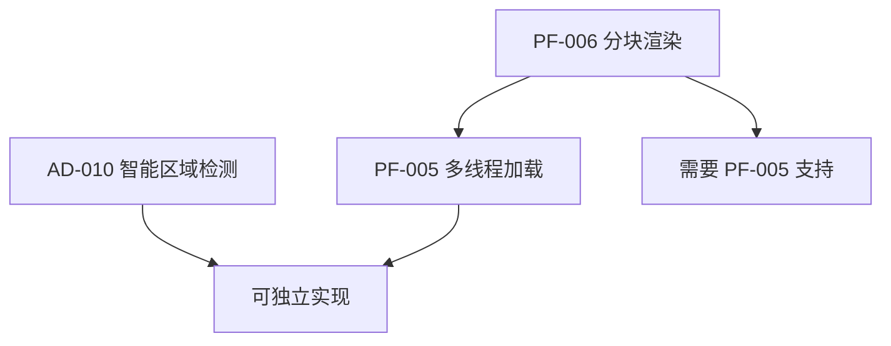

# CEImagesetEditor 高级功能设计方案

> **文档版本**: 1.0 | **创建日期**: 2026-01-09
> **状态**: 设计阶段

---

## 📋 概述

本文档详细规划三个高级功能的实现方案：
1. **AD-010**: 智能区域检测 (AutoRegionDetector)
2. **PF-005**: 多线程纹理加载 (AsyncTextureLoader)
3. **PF-006**: 分块渲染优化 (TiledTextureManager)

---

## 1. AD-010: 智能区域检测 (AutoRegionDetector)

### 1.1 功能描述

自动分析图像内容，检测并提取独立的精灵区域，减少手动定义区域的工作量。

### 1.2 技术方案

#### 核心算法

```
┌─────────────────────────────────────────┐
│           智能区域检测流程               │
├─────────────────────────────────────────┤
│                                         │
│  ┌─────────┐    ┌─────────┐    ┌─────┐ │
│  │ 图像    │ →  │ Alpha   │ →  │ 二值│ │
│  │ 加载    │    │ 通道    │    │ 化  │ │
│  └─────────┘    └─────────┘    └─────┘ │
│                                    ↓    │
│  ┌─────────┐    ┌─────────┐    ┌─────┐ │
│  │ 区域    │ ←  │ 连通    │ ←  │ 形态│ │
│  │ 合并    │    │ 组件    │    │ 学  │ │
│  └─────────┘    └─────────┘    └─────┘ │
│       ↓                                 │
│  ┌─────────┐    ┌─────────┐            │
│  │ 边界框  │ →  │ 区域    │            │
│  │ 计算    │    │ 输出    │            │
│  └─────────┘    └─────────┘            │
│                                         │
└─────────────────────────────────────────┘
```

#### 算法步骤

1. **Alpha 通道提取**: 从 RGBA 图像中提取 Alpha 通道
2. **二值化处理**: 将 Alpha 值转换为 0/1 掩码 (阈值可配置)
3. **形态学操作**: 可选的腐蚀/膨胀操作消除噪点
4. **连通组件标记**: 使用 Two-Pass 算法或 Union-Find 算法
5. **边界框计算**: 为每个连通组件计算最小包围矩形
6. **区域合并**: 合并距离过近的区域 (可配置阈值)
7. **结果输出**: 生成 ImageDefinition 列表

### 1.3 类设计

```cpp
// inc/AutoRegionDetector.h

#ifndef AUTO_REGION_DETECTOR_H
#define AUTO_REGION_DETECTOR_H

#include <vector>
#include <string>
#include "CEGUIRect.h"

namespace CEImagesetEditor
{

// 检测配置
struct DetectionConfig
{
    int alphaThreshold;      // Alpha 阈值 (0-255), 默认 10
    int minRegionWidth;      // 最小区域宽度, 默认 4
    int minRegionHeight;     // 最小区域高度, 默认 4
    int mergeDistance;       // 合并距离阈值, 默认 2
    bool useMorphology;      // 是否使用形态学处理
    int morphologyKernel;    // 形态学核大小, 默认 3
    
    DetectionConfig()
        : alphaThreshold(10)
        , minRegionWidth(4)
        , minRegionHeight(4)
        , mergeDistance(2)
        , useMorphology(false)
        , morphologyKernel(3)
    {}
};

// 检测结果
struct DetectedRegion
{
    CEGUI::Rect area;        // 区域边界
    std::string suggestedName; // 建议名称
    int pixelCount;          // 非透明像素数
    float density;           // 密度 (0.0-1.0)
};

// 智能区域检测器
class AutoRegionDetector
{
public:
    AutoRegionDetector();
    ~AutoRegionDetector();
    
    // 设置配置
    void setConfig(const DetectionConfig& config);
    const DetectionConfig& getConfig() const;
    
    // 执行检测
    bool detect(const unsigned char* imageData, 
                int width, int height, 
                int channels);
    
    // 获取结果
    const std::vector<DetectedRegion>& getResults() const;
    
    // 获取检测状态
    int getProgress() const;
    bool isRunning() const;
    std::string getLastError() const;
    
    // 取消检测
    void cancel();
    
private:
    // 内部方法
    void extractAlphaChannel();
    void binarize();
    void applyMorphology();
    void labelConnectedComponents();
    void calculateBoundingBoxes();
    void mergeCloseRegions();
    void generateNames();
    
    // 成员变量
    DetectionConfig m_config;
    std::vector<DetectedRegion> m_results;
    std::vector<unsigned char> m_alphaData;
    std::vector<int> m_labels;
    int m_width;
    int m_height;
    int m_progress;
    bool m_running;
    bool m_cancelled;
    std::string m_lastError;
};

} // namespace CEImagesetEditor

#endif // AUTO_REGION_DETECTOR_H
```

### 1.4 UI 设计

```
┌─────────────────────────────────────────────────────┐
│ 智能区域检测                                    [X] │
├─────────────────────────────────────────────────────┤
│                                                     │
│ ┌─ 检测参数 ─────────────────────────────────────┐ │
│ │                                                 │ │
│ │ Alpha 阈值:    [====●=====] 10                 │ │
│ │ 最小宽度:      [    4    ] px                  │ │
│ │ 最小高度:      [    4    ] px                  │ │
│ │ 合并距离:      [    2    ] px                  │ │
│ │                                                 │ │
│ │ [✓] 使用形态学降噪  核大小: [3]                │ │
│ │                                                 │ │
│ └─────────────────────────────────────────────────┘ │
│                                                     │
│ ┌─ 预览 ─────────────────────────────────────────┐ │
│ │                                                 │ │
│ │  ┌────┐ ┌──────┐ ┌────┐                       │ │
│ │  │ 1  │ │  2   │ │ 3  │  检测到: 12 个区域   │ │
│ │  └────┘ └──────┘ └────┘                       │ │
│ │  ┌──────────┐ ┌────┐                          │ │
│ │  │    4     │ │ 5  │                          │ │
│ │  └──────────┘ └────┘                          │ │
│ │                                                 │ │
│ └─────────────────────────────────────────────────┘ │
│                                                     │
│ ┌─ 检测结果 ─────────────────────────────────────┐ │
│ │ [✓] region_001  (32x32)  @ 0,0                 │ │
│ │ [✓] region_002  (64x32)  @ 40,0                │ │
│ │ [✓] region_003  (32x32)  @ 112,0               │ │
│ │ [ ] region_004  (128x64) @ 0,40    (太大)      │ │
│ │ [✓] region_005  (32x32)  @ 136,40              │ │
│ │ ...                                             │ │
│ └─────────────────────────────────────────────────┘ │
│                                                     │
│ 进度: [████████████████████████████████] 100%      │
│                                                     │
│      [  预览  ]  [全选/取消]  [ 应用 ]  [ 关闭 ]   │
│                                                     │
└─────────────────────────────────────────────────────┘
```

### 1.5 实现计划

| 步骤 | 任务 | 文件 |
|------|------|------|
| 1 | 创建 AutoRegionDetector 类框架 | `inc/AutoRegionDetector.h`, `src/AutoRegionDetector.cpp` |
| 2 | 实现 Alpha 通道提取和二值化 | `src/AutoRegionDetector.cpp` |
| 3 | 实现连通组件标记算法 | `src/AutoRegionDetector.cpp` |
| 4 | 实现边界框计算和合并逻辑 | `src/AutoRegionDetector.cpp` |
| 5 | 创建检测对话框 UI | `inc/DialogAutoDetect.h`, `src/DialogAutoDetect.cpp` |
| 6 | 集成到主菜单和右键菜单 | `src/EditorFrame.cpp`, `src/EditorGLCanvas.cpp` |
| 7 | 添加撤销/重做支持 | `src/EditorCommand.cpp` |

---

## 2. PF-005: 多线程纹理加载 (AsyncTextureLoader)

### 2.1 功能描述

在后台线程加载大型纹理图像，避免界面卡顿，提升用户体验。

### 2.2 技术方案

#### 架构设计

```
┌─────────────────────────────────────────────────────┐
│                    主线程 (UI)                       │
├─────────────────────────────────────────────────────┤
│                                                     │
│  ┌───────────┐                    ┌───────────┐    │
│  │ EditorDoc │ ──── 请求加载 ───→ │ Async     │    │
│  │ ument     │                    │ Texture   │    │
│  │           │ ←── 完成回调 ───── │ Loader    │    │
│  └───────────┘                    └─────┬─────┘    │
│                                         │          │
└─────────────────────────────────────────┼──────────┘
                                          │
                                    ┌─────▼─────┐
                                    │ 任务队列  │
                                    └─────┬─────┘
                                          │
┌─────────────────────────────────────────┼──────────┐
│                    工作线程池                       │
├─────────────────────────────────────────────────────┤
│                                                     │
│  ┌─────────┐  ┌─────────┐  ┌─────────┐            │
│  │ Worker  │  │ Worker  │  │ Worker  │            │
│  │ Thread  │  │ Thread  │  │ Thread  │            │
│  │   1     │  │   2     │  │   n     │            │
│  └─────────┘  └─────────┘  └─────────┘            │
│                                                     │
│  ┌─────────────────────────────────────────────┐   │
│  │ 任务: 文件读取 → 解码 → 像素转换 → 完成    │   │
│  └─────────────────────────────────────────────┘   │
│                                                     │
└─────────────────────────────────────────────────────┘
```

### 2.3 类设计

```cpp
// inc/AsyncTextureLoader.h

#ifndef ASYNC_TEXTURE_LOADER_H
#define ASYNC_TEXTURE_LOADER_H

#include <wx/thread.h>
#include <wx/event.h>
#include <queue>
#include <memory>
#include <functional>

namespace CEImagesetEditor
{

// 加载任务
struct LoadTask
{
    int taskId;
    wxString filePath;
    bool highPriority;
};

// 加载结果
struct LoadResult
{
    int taskId;
    bool success;
    wxString errorMessage;
    unsigned char* pixelData;
    int width;
    int height;
    int channels;
};

// 自定义事件
wxDECLARE_EVENT(EVT_TEXTURE_LOADED, wxThreadEvent);
wxDECLARE_EVENT(EVT_TEXTURE_PROGRESS, wxThreadEvent);
wxDECLARE_EVENT(EVT_TEXTURE_ERROR, wxThreadEvent);

// 异步纹理加载器
class AsyncTextureLoader : public wxEvtHandler
{
public:
    // 单例访问
    static AsyncTextureLoader& getInstance();
    
    // 初始化/销毁
    bool initialize(int numThreads = 2);
    void shutdown();
    
    // 提交加载任务
    int loadTexture(const wxString& filePath, 
                    bool highPriority = false);
    
    // 取消任务
    void cancelTask(int taskId);
    void cancelAll();
    
    // 查询状态
    bool isTaskPending(int taskId) const;
    int getPendingCount() const;
    
    // 回调设置
    typedef std::function<void(const LoadResult&)> LoadCallback;
    void setLoadCallback(LoadCallback callback);
    
private:
    AsyncTextureLoader();
    ~AsyncTextureLoader();
    
    // 禁止拷贝
    AsyncTextureLoader(const AsyncTextureLoader&) = delete;
    AsyncTextureLoader& operator=(const AsyncTextureLoader&) = delete;
    
    // 工作线程类
    class WorkerThread : public wxThread
    {
    public:
        WorkerThread(AsyncTextureLoader* owner);
        virtual void* Entry() override;
    private:
        AsyncTextureLoader* m_owner;
    };
    
    // 成员变量
    std::vector<WorkerThread*> m_workers;
    std::queue<LoadTask> m_taskQueue;
    wxCriticalSection m_queueLock;
    wxSemaphore m_taskSemaphore;
    bool m_shutdown;
    int m_nextTaskId;
    LoadCallback m_callback;
};

} // namespace CEImagesetEditor

#endif // ASYNC_TEXTURE_LOADER_H
```

### 2.4 使用流程

```cpp
// 在 EditorDocument 中使用

void EditorDocument::loadImageAsync(const wxString& path)
{
    // 显示加载指示器
    showLoadingIndicator(true);
    
    // 设置回调
    AsyncTextureLoader::getInstance().setLoadCallback(
        [this](const LoadResult& result) {
            if (result.success) {
                // 在主线程中更新纹理
                wxTheApp->CallAfter([this, result]() {
                    onTextureLoaded(result);
                });
            } else {
                wxTheApp->CallAfter([this, result]() {
                    onTextureLoadFailed(result.errorMessage);
                });
            }
        });
    
    // 提交加载任务
    m_currentTaskId = AsyncTextureLoader::getInstance()
        .loadTexture(path, true);
}
```

### 2.5 实现计划

| 步骤 | 任务 | 文件 |
|------|------|------|
| 1 | 创建 AsyncTextureLoader 类框架 | `inc/AsyncTextureLoader.h`, `src/AsyncTextureLoader.cpp` |
| 2 | 实现线程池和任务队列 | `src/AsyncTextureLoader.cpp` |
| 3 | 实现图像解码逻辑 | `src/AsyncTextureLoader.cpp` |
| 4 | 创建自定义 wxEvents | `src/AsyncTextureLoader.cpp` |
| 5 | 修改 EditorDocument 使用异步加载 | `src/EditorDocument.cpp` |
| 6 | 添加加载进度 UI | `src/EditorFrame.cpp` |
| 7 | 添加取消加载功能 | `src/EditorDocument.cpp` |

---

## 3. PF-006: 分块渲染优化 (TiledTextureManager)

### 3.1 功能描述

对于超大纹理 (4K+)，使用分块加载和渲染策略，降低内存占用，提高渲染性能。

### 3.2 技术方案

#### 分块策略

```
┌─────────────────────────────────────────────────────┐
│              原始纹理 (4096 x 4096)                  │
├─────────────────────────────────────────────────────┤
│                                                     │
│  ┌────────┬────────┬────────┬────────┐             │
│  │ Tile   │ Tile   │ Tile   │ Tile   │ ← 1024x1024 │
│  │ 0,0    │ 1,0    │ 2,0    │ 3,0    │   每块      │
│  ├────────┼────────┼────────┼────────┤             │
│  │ Tile   │ Tile   │ Tile   │ Tile   │             │
│  │ 0,1    │ 1,1    │ 2,1    │ 3,1    │             │
│  ├────────┼────────┼────────┼────────┤             │
│  │ Tile   │ Tile   │ Tile   │ Tile   │             │
│  │ 0,2    │ 1,2    │ 2,2    │ 3,2    │             │
│  ├────────┼────────┼────────┼────────┤             │
│  │ Tile   │ Tile   │ Tile   │ Tile   │             │
│  │ 0,3    │ 1,3    │ 2,3    │ 3,3    │             │
│  └────────┴────────┴────────┴────────┘             │
│                                                     │
│  可见区域: 仅加载视口内的 tiles                     │
│  LRU 缓存: 最多保留 N 个 tiles 在内存中             │
│                                                     │
└─────────────────────────────────────────────────────┘
```

#### 渲染流程

```
视口更新
    │
    ▼
计算可见 tiles
    │
    ▼
检查 tile 缓存
    │
    ├── 命中 ──→ 直接渲染
    │
    └── 未命中 ──→ 异步加载 tile
                      │
                      ▼
                 显示占位符
                      │
                      ▼
               加载完成后刷新
```

### 3.3 类设计

```cpp
// inc/TiledTextureManager.h

#ifndef TILED_TEXTURE_MANAGER_H
#define TILED_TEXTURE_MANAGER_H

#include <map>
#include <list>
#include <memory>
#include "CEGUIRect.h"

namespace CEImagesetEditor
{

// Tile 信息
struct TileInfo
{
    int x, y;                 // Tile 坐标
    GLuint textureId;         // OpenGL 纹理 ID
    bool loaded;              // 是否已加载
    bool loading;             // 是否正在加载
};

// 分块纹理管理器
class TiledTextureManager
{
public:
    TiledTextureManager();
    ~TiledTextureManager();
    
    // 配置
    void setTileSize(int size);          // 默认 1024
    void setMaxCachedTiles(int count);   // 默认 16
    void setLODLevels(int levels);       // 默认 3
    
    // 加载纹理
    bool loadTexture(const wxString& filePath);
    void unloadTexture();
    
    // 获取纹理信息
    int getFullWidth() const;
    int getFullHeight() const;
    int getTileCountX() const;
    int getTileCountY() const;
    
    // 渲染
    void render(const CEGUI::Rect& viewport, float zoom);
    
    // 更新可见区域
    void updateVisibleArea(const CEGUI::Rect& viewport);
    
    // 缓存管理
    void preloadTiles(const CEGUI::Rect& area);
    void clearCache();
    int getCacheUsage() const;
    
private:
    // 内部方法
    void calculateVisibleTiles(const CEGUI::Rect& viewport);
    void loadTile(int x, int y);
    void unloadTile(int x, int y);
    void updateLRU(int x, int y);
    void evictOldestTile();
    
    // LOD 相关
    int selectLODLevel(float zoom) const;
    void loadTileLOD(int x, int y, int lod);
    
    // 成员变量
    wxString m_filePath;
    int m_fullWidth;
    int m_fullHeight;
    int m_tileSize;
    int m_maxCachedTiles;
    int m_lodLevels;
    
    // Tile 缓存 (使用 LRU 策略)
    std::map<std::pair<int,int>, TileInfo> m_tiles;
    std::list<std::pair<int,int>> m_lruList;
    
    // 当前可见 tiles
    std::vector<std::pair<int,int>> m_visibleTiles;
};

} // namespace CEImagesetEditor

#endif // TILED_TEXTURE_MANAGER_H
```

### 3.4 LOD (Level of Detail) 策略

```
┌─────────────────────────────────────────────────────┐
│                 LOD 级别选择                         │
├─────────────────────────────────────────────────────┤
│                                                     │
│  Zoom Level    LOD    Tile Resolution    Memory    │
│  ──────────────────────────────────────────────────│
│  > 100%        0      1024 x 1024        4 MB      │
│  50% - 100%    1      512 x 512          1 MB      │
│  25% - 50%     2      256 x 256          256 KB    │
│  < 25%         3      128 x 128          64 KB     │
│                                                     │
│  自动根据缩放级别选择合适的 LOD                     │
│  缩小时使用低分辨率 tile, 节省内存和渲染时间        │
│                                                     │
└─────────────────────────────────────────────────────┘
```

### 3.5 实现计划

| 步骤 | 任务 | 文件 |
|------|------|------|
| 1 | 创建 TiledTextureManager 类框架 | `inc/TiledTextureManager.h`, `src/TiledTextureManager.cpp` |
| 2 | 实现 tile 划分和坐标计算 | `src/TiledTextureManager.cpp` |
| 3 | 实现 LRU 缓存策略 | `src/TiledTextureManager.cpp` |
| 4 | 实现异步 tile 加载 | `src/TiledTextureManager.cpp` |
| 5 | 实现 LOD 级别选择 | `src/TiledTextureManager.cpp` |
| 6 | 修改 EditorGLCanvas 使用分块渲染 | `src/EditorGLCanvas.cpp` |
| 7 | 添加内存使用监控 UI | `src/EditorFrame.cpp` |

---

## 4. 依赖关系



---

## 5. 优先级建议

| 功能 | 优先级 | 影响范围 | 复杂度 | 建议顺序 |
|------|--------|----------|--------|----------|
| AD-010 智能区域检测 | 高 | 高 (提升效率 80%) | 中 | 1 |
| PF-005 多线程加载 | 中 | 中 (用户体验) | 低 | 2 |
| PF-006 分块渲染 | 低 | 低 (仅大图) | 高 | 3 |

---

## 6. 技术风险

### 6.1 AD-010 风险
- **算法准确性**: 可能误检或漏检某些区域
- **缓解措施**: 提供可调参数和手动修正功能

### 6.2 PF-005 风险
- **线程安全**: wxWidgets UI 操作必须在主线程
- **缓解措施**: 使用 wxTheApp->CallAfter() 进行跨线程通信

### 6.3 PF-006 风险
- **OpenGL 上下文**: 纹理上传必须在正确的 GL 上下文
- **缓解措施**: 在主线程处理 GL 操作，仅在工作线程解码

---

## 7. 验收标准

### 7.1 AD-010 验收标准
- [ ] 能够自动检测图像中的独立精灵区域
- [ ] 支持 Alpha 阈值、最小尺寸等参数配置
- [ ] 检测结果可预览和选择性应用
- [ ] 检测过程可取消
- [ ] 结果支持撤销/重做

### 7.2 PF-005 验收标准
- [ ] 加载大图 (10MB+) 时界面不卡顿
- [ ] 显示加载进度条
- [ ] 支持取消加载
- [ ] 加载错误有友好提示

### 7.3 PF-006 验收标准
- [ ] 4K+ 纹理内存占用降低 50%+
- [ ] 平移/缩放操作流畅 (>30 FPS)
- [ ] 显示内存使用情况
- [ ] 缩放时自动选择合适的 LOD

---

**文档版本**: 1.0
**最后更新**: 2026-01-09
**状态**: 设计完成，待实现
