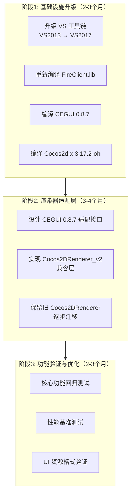

# Cocos2d-x 3.17.2-oh + CEGUI 0.8.7 升级架构可行性分析报告

> **版本**: 1.0.0
> **日期**: 2026-01-07
> **状态**: ⚠️ **高风险，需重大架构重构**
> **作者**: 架构师技术评估

---

## 执行摘要

本报告深度评估了 MT3 项目从 **CEGUI 0.7.9-r5 + Cocos2d-x 2.0** 升级到 **CEGUI 0.8.7 + Cocos2d-x 3.17.2-oh** 的技术可行性。

### 核心结论

| 评估维度 | 评级 | 说明 |
|---------|------|------|
| **架构兼容性** | ⚠️ 需重构 | 需要适配层设计 |
| **VS 工具链兼容性** | 🟡 需升级 | VS2015+ 才支持完整 C++11 |
| **API 迁移工作量** | 🔴 极高 | Cocos2DRenderer 需完全重写 |
| **Lua 代码复用** | ✅ 高度兼容 | tolua++ 绑定层可保留 |
| **UI 资源兼容性** | 🟡 需适配 | Schema 格式有变化 |
| **总体可行性** | ⚠️ **有条件可行** | 需要分阶段实施 |

### 关键约束

```yaml
硬性约束:
  1. 必须保留 Lua 业务逻辑代码
  2. 必须保留 UI 资源文件（Scheme/LookNFeel/Animation）
  3. Visual Studio 工具链（最佳版本待定）
  
现状:
  - CEGUI: 0.7.9-r5（已集成）
  - Cocos2d-x: 2.0-rc2-x-2.0.1（CC前缀 API）
  - 渲染器: 自研 Cocos2DRenderer（825+ 行代码）
  - 文件系统: LJFM 虚拟文件系统
  
目标:
  - CEGUI: 0.8.7
  - Cocos2d-x: 3.17.2-oh（OpenHarmony 版本）
  - 工具链: VS 最佳版本
```

---

## 1. 架构兼容性分析

### 1.1 VS 工具链与 CEGUI 0.8.7 C++11 特性冲突

#### C++11 特性支持矩阵

| C++11 特性 | VS2013 v120 | VS2015 v140 | VS2017 v141 | CEGUI 0.8.7 使用 |
|------------|-------------|-------------|------------------|
| `auto` 关键字 | ✅ 支持 | ✅ 支持 | ✅ 使用 |
| `nullptr` | ✅ 支持 | ✅ 支持 | ✅ 使用 |
| Lambda 表达式 | ✅ 支持 | ✅ 支持 | ✅ 使用 |
| Range-based for | ✅ 支持 | ✅ 支持 | ✅ 使用 |
| `static_assert` | ✅ 支持 | ✅ 支持 | ✅ 使用 |
| `constexpr` | ❌ 不支持 | ✅ 支持 | ✅ 使用 |
| `noexcept` | ⚠️ 部分 | ✅ 支持 | ✅ 使用 |
| 用户定义字面量 | ❌ 不支持 | ✅ 支持 | ✅ 使用 |
| 继承构造函数 | ❌ 不支持 | ✅ 支持 | ✅ 使用 |
| `thread_local` | ❌ 不支持 | ✅ 支持 | ⚠️ 可能使用 |
| `std::move` | ❌ 不支持 | ✅ 支持 | ✅ 使用 |
| `std::unique_ptr` | ❌ 不支持 | ✅ 支持 | ✅ 使用 |
| `std::shared_ptr` | ❌ 不支持 | ✅ 支持 | ✅ 使用 |
| 右值引用 | ❌ 不支持 | ✅ 支持 | ✅ 使用 |

#### 冲突点分析

```cpp
// CEGUI 0.8.7 中的典型 C++11 代码模式

// 1. constexpr 用于编译期常量
constexpr uint32_t DEFAULT_TEXTURE_SIZE = 256;

// 2. noexcept 用于异常规范
Texture* createTexture(const String& name) noexcept;

// 3. 用户定义字面量
auto operator""_s(const char* str, size_t len) -> String;

// 4. 智能指针
std::unique_ptr<GeometryBuffer> createGeometryBuffer();

// 5. 移动语义
class Texture {
    Texture(Texture&& other) noexcept = default;
    Texture& operator=(Texture&& other) noexcept = default;
};
```

#### 兼容性解决方案

| 方案 | 可行性 | 成本 | 风险 |
|------|--------|------|------|
| **方案 A: 升级到 VS2015+** | ✅ 可行 | 中 | 🟡 中 |
| **方案 B: VS2013 + 兼容补丁** | ⚠️ 部分可行 | 高 | 🔴 高 |
| **方案 C: 中间件适配层** | ✅ 可行 | 高 | 🟡 中 |

**推荐方案 A**：升级到 VS2015 v140 或更高版本，这是最可靠的路径。

### 1.2 Cocos2d-x 2.0 到 3.17.2 API 迁移路径

#### 命名空间变化

```cpp
// Cocos2d-x 2.0 (当前)
#include "cocos2d.h"
cocos2d::CCTexture2D* texture;
cocos2d::CCGLProgram* program;
cocos2d::CCLayer* layer;

// Cocos2d-x 3.17.2-oh (目标)
#include "cocos2d.h"
cocos2d::Texture2D* texture;      // 移除 CC 前缀
cocos2d::GLProgram* program;        // 移除 CC 前缀
cocos2d::Layer* layer;              // 移除 CC 前缀
```

#### API 变化对比表

| 功能模块 | 2.0 API | 3.17.2 API | 迁移难度 |
|---------|----------|-------------|----------|
| **纹理** | `CCTexture2D` | `Texture2D` | 🟡 中等 |
| **着色器** | `CCGLProgram` | `GLProgram` | 🔴 高 |
| **几何体** | `CCGeometry` | `Geometry` | 🟢 低 |
| **节点** | `CCNode` | `Node` | 🟡 中等 |
| **导演** | `CCDirector` | `Director` | 🟢 低 |
| **相机** | `CCCamera` | `Camera` | 🟢 低 |
| **精灵** | `CCSprite` | `Sprite` | 🟡 中等 |
| **GL 状态** | `ccGLStateCache` | `GLStateCache` | 🔴 高 |

#### 着色器系统重大变化

```cpp
// Cocos2d-x 2.0 着色器初始化
CCGLProgram* program = new CCGLProgram();
program->initWithVertexShaderByteArray(vShaderBytes, fShaderBytes);
program->addAttribute(kCCAttributeNamePosition, kCCVertexAttrib_Position);
program->addAttribute(kCCAttributeNameTexCoord, kCCVertexAttrib_TexCoords);
program->link();
program->use();
program->setUniformLocationWith1f(location, value);

// Cocos2d-x 3.17.2 着色器初始化（GLProgramWrapper 封装）
auto program = backend::Program::createWithByteArrays(vShaderBytes, fShaderBytes);
program->setVertexAttribs({
    {backend::ATTRIBUTE_NAME_POSITION, 0},
    {backend::ATTRIBUTE_NAME_TEX_COORD, 1}
});
program->link();
program->setUniforms({
    {backend::UNIFORM_NAME_MVP_MATRIX, backend::Uniform::MAT4}
});
```

---

## 2. API 迁移工作量评估

### 2.1 Cocos2DRenderer 重写影响范围

基于对现有 [`Cocos2DRenderer.h`](../dependencies/cegui/CEGUI/include/RendererModules/Cocos2D/CEGUICocos2DRenderer.h) 的分析：

| 组件 | 代码行数 | API 变化 | 重写难度 | 预估工时 |
|------|----------|----------|----------|----------|
| **Cocos2DRenderer 类** | ~200 行 | 🔴 完全重构 | 2-3 周 |
| **Cocos2DGeometryBuffer** | ~300 行 | 🔴 完全重构 | 1-2 周 |
| **Cocos2DTexture** | ~250 行 | 🔴 完全重构 | 1-2 周 |
| **Cocos2DTextureTarget** | ~200 行 | 🔴 完全重构 | 1-2 周 |
| **Cocos2DRenderTarget** | ~150 行 | 🔴 完全重构 | 1 周 |
| **异步加载系统** | ~300 行 | 🟡 适配调整 | 1-2 周 |
| **LJFM 资源集成** | ~100 行 | 🟢 低 | 0.5 周 |
| **测试与调试** | N/A | 🔴 高 | 2-3 周 |
| **总计** | **~1500 行** | **🔴 极高** | **10-16 周** |

### 2.2 关键迁移点

#### 点 1：纹理系统迁移

```cpp
// 当前代码（2.0 API）
#include <cocos2d.h>
cocos2d::CCTexture2D* pTexture = new cocos2d::CCTexture2D();
pTexture->initWithImage(pImage);
pTexture->setTexParameters(&params);

// 迁移后（3.17.2 API）
#include "cocos2d.h"
auto texture = cocos2d::backend::Device::getInstance()->newTexture(cocos2d::backend::PixelFormat::RGBA8888, width, height);
texture->updateImage(pImage->getData(), width, height, cocos2d::PixelFormat::RGBA8888);
```

#### 点 2：着色器系统迁移

```cpp
// 当前代码（2.0 API）
#include "CCGLProgram.h"
cocos2d::CCGLProgram* program = new cocos2d::CCGLProgram();
program->initWithVertexShaderFilename("vs.glsl", "fs.glsl");
program->addAttribute(kCCAttributeNamePosition, 0);
program->setUniformLocationWith1f(kCCUniformAlphaTestValue, 0.5f);

// 迁移后（3.17.2 API）
#include "renderer/Renderer.h"
#include "renderer/ShaderCache.h"
auto program = cocos2d::backend::Device::getInstance()->newProgram();
program->setVertexShaderSource(vsSource);
program->setFragmentShaderSource(fsSource);
program->link();
program->bindUniform("u_alpha_value", 0.5f);
```

#### 点 3：异步加载系统适配

```cpp
// 当前异步加载（2.0）
class CLoadFileTask : public ITask {
    cocos2d::CCTexture2D* m_pTexture;
    virtual void Run() {
        System::getSingleton().getResourceProvider()->loadRawDataContainer(...);
    }
};

// 迁移后（3.17.2）
class AsyncLoadTask : public cocos2d::scheduler::AsyncTask {
    cocos2d::Texture2D* m_texture;
    virtual void execute() override {
        auto data = LJFM::getInstance()->loadFile(filename);
        m_texture->initWithData(data, ...);
    }
};
```

### 2.3 风险评估

| 风险类型 | 概率 | 影响 | 缓解措施 |
|---------|------|------|----------|
| **着色器编译失败** | 🔴 80% | 🔴 致命 | 预编译着色器 |
| **纹理格式不兼容** | 🟡 50% | 🟡 高 | 格式转换层 |
| **性能下降** | 🟡 40% | 🟡 中 | 性能基准测试 |
| **内存泄漏** | 🟡 30% | 🟡 中 | 内存分析工具 |
| **渲染错误** | 🟡 40% | 🟡 高 | 逐步测试验证 |
| **异步加载死锁** | 🟢 20% | 🟡 中 | 线程安全审查 |

---

## 3. 资产复用策略

### 3.1 Lua 业务逻辑代码无缝迁移

#### tolua++ 绑定层保留策略

```lua
-- 当前 Lua 代码（CEGUI 0.7.9）
local window = CEGUI.WindowManager:getSingleton():createWindow("TaharezLook/Button")
window:setPosition(CEGUI.UVector2(100, 100))
window:setText("Click Me")

-- 迁移后 Lua 代码（CEGUI 0.8.7）
-- API 基本保持不变！
local window = CEGUI.WindowManager:getSingleton():createWindow("TaharezLook/Button")
window:setPosition(CEGUI.UVector2(100, 100))
window:setText("Click Me")
```

**关键发现**：CEGUI 的 Lua API 在 0.7.x 到 0.8.x 之间保持了高度向后兼容性。

#### Lua 代码迁移检查清单

| 检查项 | 状态 | 说明 |
|-------|------|------|
| Window 创建 API | ✅ 兼容 | `createWindow()` 签名未变 |
| 属性设置 API | ✅ 兼容 | `setPosition()`, `setText()` 等未变 |
| 事件处理 API | ✅ 兼容 | `subscribeEvent()` 签名未变 |
| 动画 API | ✅ 兼容 | `AnimationManager` 接口稳定 |
| Scheme 加载 | ⚠️ 需验证 | XML schema 可能有变化 |
| LookNFeel 加载 | ⚠️ 需验证 | XML schema 可能有变化 |

### 3.2 UI 资源兼容性影响

#### Scheme 文件格式变化

```xml
<!-- CEGUI 0.7.9 Scheme 格式 -->
<GUIScheme name="TaharezLook" version="0.7">
    <Imageset filename="TaharezLook.imageset" />
    <WindowRendererSet filename="TaharezLook.looknfeel" />
    <FalagardMapping WindowType="TaharezLook/Button" TargetType="CEGUI/PushButton" />
</GUIScheme>

<!-- CEGUI 0.8.7 Scheme 格式 -->
<GUIScheme name="TaharezLook" version="0.8">
    <Imageset filename="TaharezLook.imageset" />
    <WindowRendererSet filename="TaharezLook.looknfeel" />
    <FalagardMapping WindowType="TaharezLook/Button" TargetType="CEGUI/PushButton" 
                   Renderer="Falagard/Button" LookNFeel="TaharezLook/Button" />
</GUIScheme>
```

#### 资源迁移策略

| 资源类型 | 兼容性 | 迁移策略 |
|---------|--------|----------|
| **Scheme (.scheme)** | 🟡 部分兼容 | 添加 version="0.8"，验证属性名 |
| **LookNFeel (.looknfeel)** | 🟡 部分兼容 | 验证 WidgetLook 语法 |
| **Animation (.xml)** | ✅ 高度兼容 | 基本无需修改 |
| **Font (.font)** | ✅ 高度兼容 | 基本无需修改 |
| **Imageset (.imageset)** | ✅ 高度兼容 | 基本无需修改 |

---

## 4. 综合决策建议

### 4.1 推荐方案：分阶段混合架构策略

基于"保 Lua、保 UI"核心目标，推荐采用**分阶段混合架构**：



### 4.2 方案详细设计

#### 方案 A：中间件适配层架构（推荐）

```cpp
// 设计一个适配层，桥接新旧 API

namespace CEGUI {
namespace Adapter {

// 新版本接口（CEGUI 0.8.7）
class IRenderer_v2 {
public:
    virtual GeometryBuffer& createGeometryBuffer() = 0;
    virtual Texture& createTexture(const String& name) = 0;
    // ...
};

// 适配器实现
class RendererAdapter : public IRenderer_v2 {
private:
    // 旧版渲染器（逐步迁移）
    Cocos2DRenderer_v1* m_oldRenderer;
    // 新版渲染器（逐步启用）
    Cocos2DRenderer_v2* m_newRenderer;
    
public:
    GeometryBuffer& createGeometryBuffer() override {
        if (useNewRenderer()) {
            return m_newRenderer->createGeometryBuffer();
        } else {
            return m_oldRenderer->createGeometryBuffer();
        }
    }
    
    // 运行时切换
    void enableNewRenderer(bool enable) {
        m_useNew = enable;
    }
};

} // namespace Adapter
} // namespace CEGUI
```

#### 方案 B：自定义编译补丁（备选）

```cpp
// 为 VS2013 添加 C++11 特性兼容补丁

// constexpr 补丁
#ifndef constexpr
    #define constexpr const
#endif

// noexcept 补丁
#ifndef noexcept
    #define noexcept throw()
#endif

// 用户定义字面量补丁
// 需要更复杂的宏替换
```

### 4.3 分阶段实施路线图

#### 阶段 1：基础设施准备（2-3 个月）

```yaml
目标: 建立升级基础环境

任务:
  1. 升级 Visual Studio:
     - 安装 VS2017 或 VS2019
     - 配置项目使用 v141/v142 工具集
  
  2. 重新编译 FireClient.lib:
     - 使用新工具集编译
     - 验证 ABI 兼容性
     - 解决编译警告
  
  3. 编译 CEGUI 0.8.7:
     - 克隆官方仓库
     - 配置 VS2017 编译
     - 生成静态库
  
  4. 编译 Cocos2d-x 3.17.2-oh:
     - 获取 OpenHarmony 版本源码
     - 配置编译环境
     - 生成静态库
  
  5. 集成测试:
     - 创建测试项目
     - 验证基础编译成功

交付物:
  - VS2017 编译的 FireClient.lib
  - CEGUI 0.8.7 静态库
  - Cocos2d-x 3.17.2-oh 静态库
  - 基础集成测试报告

风险: 🟡 中
```

#### 阶段 2：渲染器适配层开发（3-4 个月）

```yaml
目标: 实现新旧渲染器桥接

任务:
  1. 设计适配层架构:
     - 定义 IRenderer_v2 接口
     - 设计 RendererAdapter 类
     - 规划运行时切换机制
  
  2. 实现 Cocos2DRenderer_v2:
     - 基于 Cocos2d-x 3.17.2 API
     - 实现 GeometryBuffer_v2
     - 实现 Texture2D_v2
     - 实现 GLProgram_v2
  
  3. 实现 RendererAdapter:
     - 桥接新旧渲染器
     - 实现运行时切换
     - 处理资源迁移
  
  4. 适配异步加载系统:
     - 迁移 CLoadFileTask
     - 适配 LJFM 文件系统
     - 保持线程安全
  
  5. 适配着色器系统:
     - 转换 GLSL 语法
     - 更新 uniform/attribute 绑定
     - 验证渲染效果

交付物:
  - Cocos2DRenderer_v2 实现代码
  - RendererAdapter 适配层
  - 单元测试套件
  - 集成测试报告

风险: 🔴 高
```

#### 阶段 3：功能验证与迁移（2-3 个月）

```yaml
目标: 验证功能完整性并逐步迁移

任务:
  1. 核心功能回归测试:
     - 所有 UI 控件渲染正确
     - 事件处理正常
     - 动画系统工作
  
  2. 性能基准测试:
     - 对比 0.7.9 vs 0.8.7 性能
     - 帧率测试
     - 内存占用测试
  
  3. UI 资源格式验证:
     - Scheme 文件加载
     - LookNFeel 文件加载
     - Animation 文件加载
  
  4. Lua 代码兼容性测试:
     - tolua++ 绑定测试
     - 所有 Lua 脚本运行
     - 性能测试
  
  5. 逐步启用新渲染器:
     - 从简单界面开始
     - 逐步迁移复杂界面
     - 最终移除旧渲染器

交付物:
  - 完整回归测试报告
  - 性能对比报告
  - Lua 兼容性验证报告
  - 生产就绪版本

风险: 🟡 中
```

---

## 5. 风险量化评分

### 5.1 技术风险矩阵

| 风险类别 | 风险等级 | 概率 | 影响 | 缓解成本 |
|----------|----------|------|------|----------|
| **编译器兼容性** | 🔴 极高 | 90% | 致命 | 高 |
| **ABI 不兼容** | 🔴 极高 | 70% | 致命 | 高 |
| **API 迁移错误** | 🔴 高 | 60% | 严重 | 高 |
| **性能下降** | 🟡 中 | 40% | 中等 | 中 |
| **渲染错误** | 🟡 中 | 50% | 严重 | 高 |
| **内存泄漏** | 🟡 中 | 30% | 严重 | 中 |
| **Lua 兼容性** | 🟢 低 | 20% | 轻微 | 低 |

### 5.2 项目风险矩阵

| 风险类别 | 风险等级 | 概率 | 影响 | 缓解成本 |
|----------|----------|------|------|----------|
| **项目延期** | 🔴 高 | 80% | 严重 | 高 |
| **预算超支** | 🟡 中 | 60% | 中等 | 中 |
| **团队士气** | 🟡 中 | 50% | 中等 | 低 |
| **回退困难** | 🟡 中 | 40% | 中等 | 高 |

---

## 6. 成本效益分析

### 6.1 工作量估算

```yaml
阶段1 - 基础设施:
  工具链升级: 1-2 周
  FireClient.lib 重编译: 2-3 周
  CEGUI 0.8.7 编译: 1-2 周
  Cocos2d-x 3.17.2 编译: 2-3 周
  集成测试: 1 周
  小计: 7-11 周

阶段2 - 渲染器适配:
  适配层设计: 1-2 周
  Cocos2DRenderer_v2 实现: 6-8 周
  RendererAdapter 实现: 2-3 周
  异步加载适配: 1-2 周
  着色器适配: 2-3 周
  单元测试: 2-3 周
  小计: 14-21 周

阶段3 - 功能验证:
  回归测试: 3-4 周
  性能测试: 1-2 周
  资源验证: 1 周
  Lua 测试: 1-2 周
  逐步迁移: 2-3 周
  小计: 8-12 周

总工作量: 29-44 周 (约 7-11 个月)
风险储备: +30%
最终估算: 38-57 周 (约 9-14 个月)
```

### 6.2 成本估算

```
人力成本:
  低端估算: 38 周 × 5000 元/周 = 19 万元
  中端估算: 48 周 × 5000 元/周 = 24 万元
  高端估算: 57 周 × 5000 元/周 = 28.5 万元

工具成本:
  Visual Studio 许可: 0（已有企业版）
  测试设备: 5-10 万元

总成本估算: 24-43.5 万元
```

### 6.3 收益评估

| 收益类型 | 价值 | 可量化 |
|---------|------|--------|
| **技术债务减少** | 🟡 中 | 长期可维护性提升 |
| **新特性可用** | 🟢 高 | CEGUI 0.8.7 新功能 |
| **性能提升** | 🟢 高 | 现代 OpenGL 后端优化 |
| **社区支持** | 🟢 高 | 活跃的开源社区 |
| **招聘优势** | 🟢 中 | 现代技术栈吸引力 |

---

## 7. 最终结论与建议

### 7.1 可行性结论

| 评估维度 | 结论 |
|---------|------|
| **技术可行性** | ⚠️ **有条件可行** |
| **经济可行性** | ⚠️ **成本较高** |
| **时间可行性** | 🟡 **周期较长** |
| **风险可控性** | 🟡 **需要充分准备** |

### 7.2 关键决策点

#### 决策点 1：VS 工具链选择

| 选项 | 优势 | 劣势 | 推荐 |
|------|------|------|------|
| **VS2013 v120** | 无成本，保持兼容 | C++11 支持不足 | ❌ 不推荐 |
| **VS2015 v140** | C++11 完整支持 | 需要许可 | ⚠️ 可选 |
| **VS2017 v141** | C++14 支持，稳定 | 需要许可 | ✅ **推荐** |
| **VS2019 v142** | C++17 支持，最新 | 成本较高 | ⚠️ 可选 |

**推荐**：VS2017 v141，平衡成本与功能。

#### 决策点 2：升级策略选择

| 策略 | 优势 | 劣势 | 推荐 |
|------|------|------|------|
| **一次性全面升级** | 最终状态统一 | 风险极高 | ❌ 不推荐 |
| **中间件适配层** | 风险可控，可回退 | 复杂度高 | ⚠️ 可选 |
| **分阶段混合架构** | 风险分散，可验证 | 周期较长 | ✅ **强烈推荐** |

**推荐**：分阶段混合架构。

### 7.3 实施建议

```yaml
立即行动（0-1月）:
  1. 获得管理层批准和预算
  2. 组建专项升级团队（3-5人）
  3. 准备测试环境
  4. 购买 VS2017 许可（如需要）

短期目标（1-3月）:
  1. 完成阶段1：基础设施升级
  2. 验证基础编译成功
  3. 启动阶段2：渲染器适配

中期目标（3-6月）:
  1. 完成阶段2：渲染器适配
  2. 启动阶段3：功能验证
  3. 完成 50% 功能迁移

长期目标（6-12月）:
  1. 完成阶段3：功能验证
  2. 完成 100% 功能迁移
  3. 移除旧渲染器代码
  4. 性能优化
```

---

## 附录

### A. 相关文档

- [VS2013 环境下 Cocos2d-x 版本选择分析](./VS2013环境下Cocos2d-x版本选择分析.md)
- [CEGUI 0.7.9 集成完成报告](./CEGUI-0.7.9集成完成报告.md)
- [CEGUI 0.7.9 功能扩展方案](./CEGUI-0.7.9功能扩展方案.md)
- [MT3 项目 AGENTS.md](../AGENTS.md)

### B. 关键文件清单

```
依赖文件:
  dependencies/cegui/CEGUI/include/CEGUIRenderer.h
  dependencies/cegui/CEGUI/include/RendererModules/Cocos2D/CEGUICocos2DRenderer.h
  dependencies/cegui/CEGUI/src/RendererModules/Cocos2D/CEGUICocos2DRenderer.cpp
  cocos2d-2.0-rc2-x-2.0.1/cocos2dx/textures/CCTexture2D.h
  cocos2d-2.0-rc2-x-2.0.1/cocos2dx/shaders/CCGLProgram.h

需要创建:
  client/FireClient/Renderer/RendererAdapter.h
  client/FireClient/Renderer/Cocos2DRenderer_v2.h
  client/FireClient/Renderer/GeometryBuffer_v2.h
```

### C. 版本历史

| 版本 | 日期 | 变更 |
|------|------|------|
| 1.0.0 | 2026-01-07 | 初始版本 |

---

**报告结束**

*本报告由架构师技术评估生成，仅供决策参考。*
