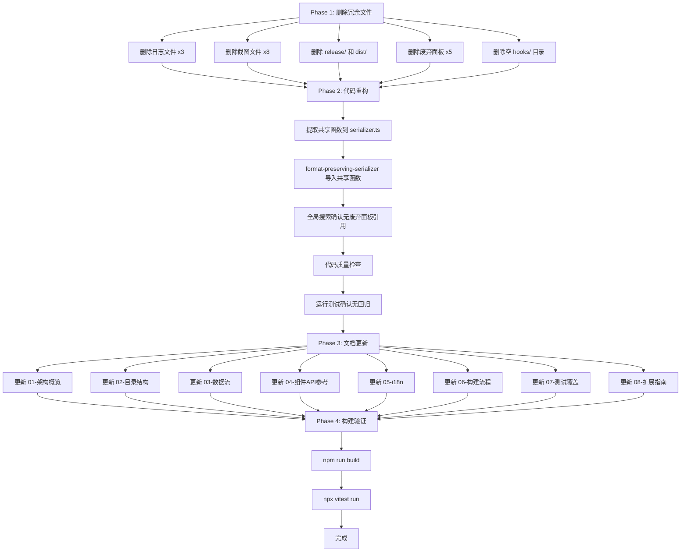

# LnFEditor 全面代码审查、清理与重构计划

> **日期**: 2026-04-19
> **范围**: `tools/LnFEditor/`
> **目标**: 清理冗余文件 → 代码重构 → 文档对齐 → 构建验证

---

## 一、项目现状摘要

| 维度 | 数据 |
|------|------|
| 技术栈 | Electron 33 + React 19 + TypeScript 5.7 + Zustand 5 + Immer 10 |
| 构建工具 | electron-vite 2.3 |
| 源文件数 | ~40 个 .ts/.tsx 文件 |
| 测试文件 | 4 个（parser.test.ts, editor-store.test.ts, dim-evaluator.test.ts, layer-tree-builder.test.ts） |
| 文档文件 | 8 个 .md 文件 |
| 冗余文件 | 3 日志 + 8 截图 + release/ + dist/ + 5 废弃面板 + 1 空目录 |

---

## 二、Phase 1 — 删除冗余文件

### 2.1 临时日志文件（3 个）

| 文件 | 说明 |
|------|------|
| `dev-session.log` | 开发调试日志 |
| `dev-session-clean.log` | 清理后调试日志 |
| `package-session.log` | 打包调试日志 |

### 2.2 调试截图文件（8 个）

| 文件 | 说明 |
|------|------|
| `output-dev-window.png` | 开发窗口截图 |
| `output-dev-window-after-wait.png` | 等待后窗口截图 |
| `output-dev-window-selected.png` | 选中状态截图 |
| `output-handle-660620.png` | 句柄调试截图 |
| `output-packaged-after-list-click.png` | 打包后列表点击截图 |
| `output-packaged-after-open-dialog.png` | 打包后打开对话框截图 |
| `output-packaged-before-open-dialog.png` | 打包前对话框截图 |
| `output-packaged-before-regression.png` | 打包前回归测试截图 |
| `output-packaged-window-fixedenv.png` | 修复环境后窗口截图 |

### 2.3 构建产物目录

| 目录 | 说明 |
|------|------|
| `release/` | electron-builder 打包输出（安装程序 + 解压目录），可重新生成 |
| `dist/` | electron-vite 编译输出（main/preload/renderer JS），可重新生成 |

### 2.4 已废弃的 Panel 组件（5 个）

这些面板文件已被统一组件替代，**不再被 `App.tsx` 引用**：

| 废弃文件 | 替代者 | 原因 |
|----------|--------|------|
| `panels/NavigatorPanel.tsx` | `ExplorerPanel.tsx` | WidgetLook 列表已合并到 ExplorerPanel |
| `panels/LayerTreePanel.tsx` | `ExplorerPanel.tsx` | 层级树已合并到 ExplorerPanel |
| `panels/PropertyPanel.tsx` | `InspectorPanel.tsx` | 属性编辑已合并到 InspectorPanel 的 PropertiesSection |
| `panels/PreviewPanel.tsx` | `canvas/StateBar.tsx` | 预览状态栏功能由 StateBar 承担 |
| `panels/ImageBrowserPanel.tsx` | `InspectorPanel.tsx` | 资源浏览已合并到 InspectorPanel 的 ResourcesSection |

### 2.5 空目录

| 目录 | 说明 |
|------|------|
| `src/renderer/hooks/` | 空目录，无任何文件 |

### 删除后目录结构预期

```text
src/
├── main/
│   ├── index.ts
│   └── services/
│       ├── format-preserving-serializer.ts
│       ├── parser.ts
│       ├── parser.test.ts
│       ├── resource-loader.ts
│       └── serializer.ts
├── preload/
│   └── index.ts
├── renderer/
│   ├── App.tsx
│   ├── main.tsx
│   ├── index.html
│   ├── styles.css
│   ├── canvas/
│   │   ├── Canvas.tsx
│   │   ├── interaction.ts
│   │   ├── LiveViewport.tsx
│   │   ├── renderer.ts
│   │   └── StateBar.tsx
│   ├── components/
│   │   ├── ColourPicker.tsx
│   │   ├── ContextMenu.tsx
│   │   ├── DimEditor.tsx
│   │   └── VirtualList.tsx
│   ├── panels/          ← 仅保留 2 个活跃面板
│   │   ├── ExplorerPanel.tsx
│   │   └── InspectorPanel.tsx
│   ├── services/
│   │   ├── dim-writeback.ts
│   │   ├── i18n.ts
│   │   ├── layer-tree-builder.ts
│   │   ├── layer-tree-builder.test.ts
│   │   ├── plugin-system.ts
│   │   ├── png-export.ts
│   │   ├── reference-validator.ts
│   │   ├── search-replace.ts
│   │   ├── texture-cache.ts
│   │   ├── widgetlook-lookup.ts
│   │   └── widgetlook-templates.ts
│   └── stores/
│       ├── editor-store.ts
│       └── editor-store.test.ts
└── shared/
    ├── constants/
    │   └── index.ts
    ├── model/
    │   ├── editor.ts
    │   ├── index.ts
    │   ├── node-ids.ts
    │   ├── resource.ts
    │   ├── serialization.ts
    │   └── types.ts
    └── services/
        ├── dim-evaluator.ts
        └── dim-evaluator.test.ts
```

---

## 三、Phase 2 — 代码审查与重构

### 3.1 消除重复代码：serializer.ts ↔ format-preserving-serializer.ts

**问题**：两个文件存在大量重复函数：

| 重复函数 | serializer.ts | format-preserving-serializer.ts |
|----------|---------------|--------------------------------|
| `escapeXml()` | ✓ | ✓（完全相同） |
| `serializeColours()` | ✓ | ✓（完全相同） |
| `serializeDimInline()` | ✓（含 DimOperator 链式展平） | ✓（简化版，无展平） |
| `serializeArea()` / `serializeAreaPreserving()` | ✓ | ✓（结构相同） |
| `serializeFrameComponent()` / `serializeFrameComponentPreserving()` | ✓ | ✓（结构相同） |
| `serializeImageryComponent()` / `serializeImageryComponentPreserving()` | ✓ | ✓（结构相同） |
| `serializeTextComponent()` / `serializeTextComponentPreserving()` | ✓ | ✓（结构相同） |

**重构方案**：

1. 将 `escapeXml()` 和 `serializeColours()` 提取为 `serializer.ts` 中的 `export` 函数
2. `format-preserving-serializer.ts` 从 `serializer.ts` 导入这些共享函数
3. 对于 `serializeAreaPreserving` 等函数，由于格式保留版本需要额外的 `FormatPreservingNode` 参数，保留独立实现但复用底层工具函数
4. `serializeDimInline` 的两个版本逻辑不同（标准版有 DimOperator 链式展平），保留两份但共享叶子节点序列化

### 3.2 Import 路径验证

删除 5 个废弃面板文件后，需确认：
- `App.tsx` — 已确认不导入任何废弃面板 ✓
- 其他文件是否间接引用废弃面板 — 需全局搜索确认

### 3.3 代码质量检查

- 检查未使用的 import 语句
- 检查未使用的变量和类型定义
- 检查 `editor-store.ts` 中是否有引用废弃面板类型的代码

### 3.4 测试回归验证

运行 `npx vitest run` 确认 4 个测试文件全部通过。

---

## 四、Phase 3 — 文档审查与更新

### 4.1 需要更新的文档（8 个）

| 文档 | 主要问题 | 更新要点 |
|------|----------|----------|
| `01-项目架构概览.md` | 提到"5 个面板" | 改为 3 个统一组件：ExplorerPanel、LiveViewport（Canvas+StateBar）、InspectorPanel |
| `02-目录结构与文件职责.md` | 列出已废弃面板为当前文件 | 移除 5 个废弃面板，移除 hooks/ 目录，添加实际文件说明 |
| `03-核心数据流.md` | 数据流图引用旧面板 | 更新为 ExplorerPanel ↔ Store ↔ InspectorPanel 三组件数据流 |
| `04-UI组件API参考.md` | 文档化废弃面板的 Props | 移除废弃面板 API，补充 ExplorerPanel/InspectorPanel/LiveViewport/StateBar 的 Props 文档 |
| `05-i18n国际化方案.md` | 需验证翻译键与实际代码对齐 | 对照 `i18n.ts` 验证所有翻译键 |
| `06-构建与打包流程.md` | 需验证构建命令 | 对照 `package.json` 和 `electron.vite.config.ts` 验证 |
| `07-测试覆盖策略.md` | 声称只有 1 个测试文件 | 更新为 4 个测试文件，补充每个测试文件的覆盖范围 |
| `08-扩展开发指南.md` | 需验证插件 API | 对照 `plugin-system.ts` 验证 5 个扩展点 |

### 4.2 文档更新原则

- 100% 对齐重构后的实际代码
- 移除所有对废弃面板的引用
- 确保架构图、数据流图反映实际组件结构
- 确保文件列表与磁盘实际文件一致

---

## 五、Phase 4 — 构建验证

### 5.1 构建步骤

```powershell
cd tools/LnFEditor
npm run build
```

### 5.2 验证清单

- [ ] electron-vite 三目标编译无错误（main/preload/renderer）
- [ ] 无 TypeScript 类型错误
- [ ] 无 import 解析错误
- [ ] `dist/` 产物正确生成
- [ ] `npx vitest run` 4 个测试全部通过

---

## 六、风险与注意事项

1. **废弃面板可能有外部引用**：虽然 `App.tsx` 不导入废弃面板，但需全局搜索确认无其他文件引用
2. **serializer 重构需谨慎**：两个 serializer 的 `serializeDimInline` 实现逻辑不同，不能简单合并
3. **文档更新量大**：8 个文档文件均需更新，需逐一对照代码验证
4. **构建环境依赖**：需确认 `node_modules` 完整且 `sharp` 原生模块正确安装

---

## 七、执行顺序 Mermaid 图


