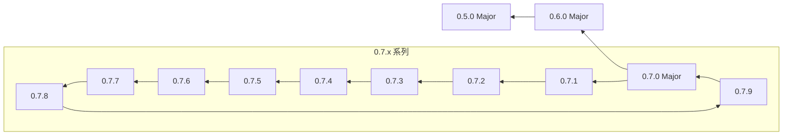

---
title: 变更日志
title_en: Change Log
category: Basics
order: 8
---
# 008_变更日志_Change_Log

## 变更日志概览

以下是 Crazy Eddie's GUI System 每个版本所做更改的高级视图。

## 发布历史概要 (Release History Overview)

### 发布 0.7.9

*   **Bug 修复**：
    *   在 irrlicht 1.8+ 下 CEGUI 不会产生任何渲染。
    *   CEGUI 无法针对 Irrlicht 1.8+ 进行构建。
    *   `ItemListbox::findSelectedItem` 存储了错误的“下一个”搜索索引。
    *   我们只能在 Ogre >= 1.8 中测试固定管线。
    *   Xcode 4.4+ 的构建问题 [http://www.cegui.org.uk/mantis/view.php?id=912](http://www.cegui.org.uk/mantis/view.php?id=912)

*   **文档**：
    *   更新 sf.net repo 引用为 bitbucket.org。

### 发布 0.7.8

*   **Bug 修复**：
    *   使用渲染表面的非客户区窗口被剪裁到客户区。
    *   当 `FrameWindow` 卷起切换时，子内容并不总是更新。
    *   VertScrollbar `ScrollablePane` 属性访问水平滚动条的值。
    *   Tab 按钮大小调整为原始文本宽度，而不是 `RenderedString` 宽度。

*   **新增**：
    *   添加了让 `OgreRenderer` 使用（内部）着色器进行渲染的选项 - 当固定管线不可用时默认为启用。
    *   向 MCL 添加了函数以确保行、列和项目可见。
    *   为 D3D11 渲染器实现了 `Texture::saveToMemory`。
    *   为 D3D10 渲染器实现了 `Texture::saveToMemory`。
    *   实现了 `Direct3D9Texture::saveToMemory`（从默认后端移植的实现）。

### 发布 0.7.7

*   **Bug 修复**：
    *   `make dist` 遗漏了 InventoryDemo 的 premake.lua。
    *   `ImagerySection` 边界计算错误地从零开始。
    *   当列表显示时，以按下状态显示 `Combobox` 按钮。
    *   为 combobox 按钮设置禁用图像。见：[http://www.cegui.org.uk/mantis/view.php?id=633](http://www.cegui.org.uk/mantis/view.php?id=633)
    *   支持 Gentoo (以及其他) 修改过的 zlib 头文件。见：[http://www.cegui.org.uk/mantis/view.php?id=813](http://www.cegui.org.uk/mantis/view.php?id=813)
    *   检测 zlib 的宏中的拼写错误导致无法使用自定义位置的 zlib。
    *   `GroupBox` 中与处理其内容窗格以及如何添加和删除子内容有关的多个问题。注意：这确实改变了一些行为，因为子内容在移除时不再被销毁，但这首先绝不应该发生，所以被视为另一个需要修复的错误。见：[http://www.cegui.org.uk/phpBB2/viewtopic.php?f=2&t=6126](http://www.cegui.org.uk/phpBB2/viewtopic.php?f=2&t=6126)
    *   移植了针对由 layoutOnWrite 属性定义引起的，在窗口完全初始化之前触发 `Window::performChildWindowLayout` 的问题的修复。（注意：这破坏了二进制兼容性）见：[http://www.cegui.org.uk/phpBB2/viewtopic.php?p=29008#p29008](http://www.cegui.org.uk/phpBB2/viewtopic.php?p=29008#p29008) 和 [http://www.cegui.org.uk/mantis/view.php?id=645](http://www.cegui.org.uk/mantis/view.php?id=645)
    *   `CEGUI::OgreTextureTarget::clear` 设置 Ogre 系统视口。此调用可能发生在常规渲染序列之外，如果 `OgreTextureTarget` 随后被删除，Ogre 和 `CEGUI::OgreRenderer` 的其他部分可能会尝试访问已删除的视口。重要提示：在 Ogre 1.8 之前，有些场景无法安全恢复视口。见：[http://www.cegui.org.uk/mantis/view.php?id=745](http://www.cegui.org.uk/mantis/view.php?id=745)
    *   Falagard `TextComponent` 中，当要绘制的字符串或要使用的字体来自默认位置以外的任何地方时，我们会应用两次文本颜色。非常感谢论坛成员 'BrightBit' 提供测试用例数据文件来重现此问题。见：[http://www.cegui.org.uk/mantis/view.php?id=774](http://www.cegui.org.uk/mantis/view.php?id=774)。
    *   在 OpenGL 渲染器中，默认像素解包设置为 4 会导致不寻常宽度的纹理出现问题。见：[http://www.cegui.org.uk/mantis/view.php?id=778](http://www.cegui.org.uk/mantis/view.php?id=778)
    *   确保通过 `PropertyDefinition` 定义的属性首先添加到目标小部件，以避免在添加之前被访问的情况。见：[http://www.cegui.org.uk/phpBB2/viewtopic.php?f=10&t=6019](http://www.cegui.org.uk/phpBB2/viewtopic.php?f=10&t=6019)

*   **修改**：
    *   以稍微（稍微）不那么可怕的方式检测 python 头文件。
    *   重构 `Window::onParentSized` 以不滥用 `Window::setArea_impl`。
    *   重构一些 `Window` 实现：主要是拆分 setArea_impl，然后减少其他地方的一些代码重复。
    *   添加对 lua 5.2 的支持。这包括检测较新的包以及对 Lua 模块和嵌入式 tolua++ 库的修复（来自论坛上 'worldcitizen' 的补丁）。见：[http://www.cegui.org.uk/mantis/view.php?id=776](http://www.cegui.org.uk/mantis/view.php?id=776)

*   **新增**：
    *   PropertyDefinitions 用于在 TaharezLook/ImageButton 上设置颜色。

*   **文档**：
    *   GLEW-LICENSE 中的拼写错误（这也是从原始 glew 包中抓取的！）。见：[http://www.cegui.org.uk/mantis/view.php?id=775](http://www.cegui.org.uk/mantis/view.php?id=775)

### 发布 0.7.6

*   **Bug 修复**：
    *   将 TinyXML API 版本检查和相关代码条件从默认 (cmake) 分支移植到这里 (autotools)。
    *   使 `ScrolledContainer` 在销毁阶段不发出内容更改通知。这修复了响应此通知的 `ScrolledContainer` 客户端中的问题。通过 Erik Ogenvik 的补丁。
    *   ptrdiff_t 用法缺少 cstddef 头文件包含。见：[http://www.cegui.org.uk/phpBB2/viewtopic.php?f=3&t=5546](http://www.cegui.org.uk/phpBB2/viewtopic.php?f=3&t=5546)
    *   从 lua 包文件中删除不正确的 'size_t' 实例。见：[http://www.cegui.org.uk/mantis/view.php?id=441](http://www.cegui.org.uk/mantis/view.php?id=441)
    *   确保 MCL 在单选模式下保持选择。
    *   空变量会破坏配置脚本的问题。
    *   Python 检测首先不应指定确切版本，其次应查找 2.7 作为可能的版本。
    *   用于在 Windows 上重新生成 lua 绑定的 make.bat 文件具有错误的输出路径。
    *   应用 ianstangoe 的补丁，在 Ogre 渲染器中保存/恢复视口和投影矩阵。见：[http://www.cegui.org.uk/mantis/view.php?id=430](http://www.cegui.org.uk/mantis/view.php?id=430)
    *   一些包含保护不正确。
    *   从 Vanilla/Button 中移除导致中心文本偏移的标签区域偏移。这个问题引发了此票据：[http://www.cegui.org.uk/mantis/view.php?id=426](http://www.cegui.org.uk/mantis/view.php?id=426)
    *   解决附加到最初处于“卷起”状态的 `FrameWindow` 的内容在 `FrameWindow` 随后展开时不会立即显示的问题。[http://www.cegui.org.uk/mantis/view.php?id=409](http://www.cegui.org.uk/mantis/view.php?id=409)
    *   添加边界检查以确裁剪区域作为 scissor rects 始终有效（所有边 >=0）。防止类似以下的未来问题：[http://www.cegui.org.uk/mantis/view.php?id=403](http://www.cegui.org.uk/mantis/view.php?id=403)
    *   解决附加到具有 `RenderingWindow` 表面的父级完全裁剪的 `Window` 将为其 `GeometryBuffer` 生成无效裁剪矩形的问题。这可能是此票据中问题的来源：[http://www.cegui.org.uk/mantis/view.php?id=403](http://www.cegui.org.uk/mantis/view.php?id=403)
    *   Bug 修复：确保 `GeometryBuffer` 裁剪矩形在创建这些对象时初始化为某些内容。
    *   Bug 修复：'0' 被测试为默认鼠标光标值而不是 MouseCursorImageLLDefaultMouseCursor (-1) 的问题。
    *   Bug 修复：解决我引入的问题，该问题可能将鼠标图像设置为地址 -1 并导致段错误。
    *   Bug 修复：解决 `FrameWindow::isTitleBarEnabled` 和 `FrameWindow::isCloseButtonEnabled` 使用继承状态从而导致 `FrameWindow` 被禁用时不正确使用图像和不正确内部矩形区域的问题。[http://www.cegui.org.uk/mantis/view.php?id=411](http://www.cegui.org.uk/mantis/view.php?id=411)
    *   Bug 修复：解决 MouseCursor::constrainPosition 的初始调用将访问未初始化的 d_position 成员变量的问题。[http://www.cegui.org.uk/mantis/view.php?id=401](http://www.cegui.org.uk/mantis/view.php?id=401)
    *   Bug 修复：检测 **HAIKU** 为 *nix 变体。感谢 michaelvoliveira 的补丁。[http://www.cegui.org.uk/mantis/view.php?id=417](http://www.cegui.org.uk/mantis/view.php?id=417)
    *   Bug 修复：如果光标已经在窗口区域内，`Window::setMouseCursor` 不会立即更新光标图像的问题。[http://www.cegui.org.uk/mantis/view.php?id=412](http://www.cegui.org.uk/mantis/view.php?id=412)
    *   Bug 修复：解决当 `WindowManager` 处于锁定状态时，我们会尝试作为系统销毁的一部分（重新）创建 `Tooltip` 的问题。[http://www.cegui.org.uk/mantis/view.php?id=423](http://www.cegui.org.uk/mantis/view.php?id=423)
    *   Bug 修复：`ScrolledContainer` 应将鼠标事件传回给其父级，以便鼠标滚轮等功能正常工作。
    *   Bug 修复：滑块被零除 / NaN 问题，导致滑块有时永远无法获得正确位置。感谢 Erik Hjortsberg。
    *   Bug 修复：解决销毁的窗口可能在某些 `RenderingSurface` 队列中留下对其 `GeometryBuffer` 的引用的问题。
    *   Bug 修复：VanillaWindows.layout 示例文件中的错误。
    *   Bug 修复：删除仅前向引用的类实例的问题。
    *   Bug 修复：排除 PCRE 的配置选项没有排除 PCRE 特定的头文件。

*   **修改**：
    *   移动到系统默认编译器和系统默认 OS X SDK，以便人们不被迫安装特定版本的开发工具。

*   **新增**：
    *   允许人们在 `WindowRenderer` 实现（和其他地方）中做有用事情的函数。
    *   InventoryDemo。
    *   空动画名称支持。
    *   isAnimationPresent。
    *   Eol 扩展及其设置，这样 Windows 开发人员就不会用 CR LF 污染 repo。
    *   通过 Ident 的补丁，添加到 Vanilla 的 `RadioButton`。
    *   通过 Ident 的补丁，添加到 Vanilla 皮肤的 `Checkbox`。
    *   `Window::getZIndex`, `Window::isInFront` 和 `Window::isBehind` 函数，以允许客户端代码发现窗口的 z 排序。

*   **文档**：
    *   更新文档以引用 mercurial 存储库而不是 subversion。
    *   `ImageDim` 示例中的拼写错误。感谢 Ident。

### 发布 0.7.5

*   **新增**：
    *   **官方支持的 Python 扩展模块的初始版本**：
        *   PyCEGUI - 支持核心 CEGUI 库。
        *   PyCEGUIOpenGLRenderer - 支持基于 OpenGL 的渲染器。
        *   PyCEGUIOgreRenderer - 支持基于 Ogre 的渲染器。
        *   PyCEGUINullRenderer - 支持 Null 渲染器。

*   **修改**：
    *   Grimmigbeisser 的补丁改进了菜单系统 - 在一定时间后自动打开/关闭弹出窗口，当父级关闭时关闭所有嵌套弹出窗口和 PopupOffset（关闭 [http://www.cegui.org.uk/mantis/view.php?id=408](http://www.cegui.org.uk/mantis/view.php?id=408)）

*   **文档**：
    *   Kulik 现在是团队成员了！

### 发布 0.7.4 (紧急发布)

*   **Bug 修复**：
    *   `CEGUI::Editbox` 掩码文本问题。见：[http://www.cegui.org.uk/mantis/view.php?id=399](http://www.cegui.org.uk/mantis/view.php?id=399)

### 发布 0.7.3

*   **Bug 修复**：
    *   确保 injectMouseButtonDown 的返回值在所有情况下都是一致的。见：[http://www.cegui.org.uk/mantis/view.php?id=397](http://www.cegui.org.uk/mantis/view.php?id=397)
    *   确保 `IrrlichtResourceProvider` 正确检测文件何时未成功打开（相对于仅检查它是否存在）。见：[http://www.cegui.org.uk/mantis/view.php?id=395](http://www.cegui.org.uk/mantis/view.php?id=395)
    *   解决涉及 `Tooltip::positionSelf` 的无限递归问题。见：[http://www.cegui.org.uk/mantis/view.php?id=394](http://www.cegui.org.uk/mantis/view.php?id=394)
    *   解决用户可以删除系统默认 `Tooltip` 并留下悬空指针的问题。`Tooltip` 现在在被删除后只要需要就会重新创建。见：[http://www.cegui.org.uk/mantis/view.php?id=391](http://www.cegui.org.uk/mantis/view.php?id=391)
    *   移除默认参数以解决歧义函数调用。[http://www.cegui.org.uk/mantis/view.php?id=386](http://www.cegui.org.uk/mantis/view.php?id=386)。
    *   不要让 `String::iterator` 子类化 `String::const_iterator`，因为它阻止了常见的迭代器行为。见：[http://www.cegui.org.uk/mantis/view.php?id=384](http://www.cegui.org.uk/mantis/view.php?id=384)。
    *   使用 WGL pbuffer 支持时 OpenGL 渲染器上的混合问题。
    *   使用基于 Apple pbuffer 的目标时 OpenGL 渲染器中的混合模式问题。
    *   使用基于 GLX pbuffer 的目标时 OpenGL 渲染器中的混合模式问题。
    *   如果在设置尺寸时不存在内部视口，则 `OgreRenderer` 中手动设置的视口尺寸可能会丢失。
    *   解决了与未设置渲染目标/视口时调用 `Renderer::beginRendering` 相关的 `OgreRenderer` 问题。
    *   布局容器 tolua++ 包文件从源代码分发中丢失。
    *   `CEGUI::ScriptFunctor` 未在 Win32 中从 CEGUIBase.dll 导出。

*   **修改**：
    *   在激活控件的编辑框部分 /之后/ 触发 `Combobox::EventListSelectionAccepted`，这将允许处理程序弹出和激活其他窗口。
    *   在 Xcode 更改 lua 模块目标中的默认设置，以便发布版本不启用“安全”模式构建。
    *   应用 Kulik 的动画系统补丁，允许在动画（重新）启动后滞后时跳过下一帧。
    *   应用 Kulik 的布局容器补丁以解决一些嵌套容器问题。NB：此更改的一部分使 `Window::update` 函数成为虚函数。

*   **新增**：
    *   为 `Editbox` 指定左、右或居中格式的功能。见：[http://www.cegui.org.uk/mantis/view.php?id=277](http://www.cegui.org.uk/mantis/view.php?id=277)
    *   配置选项，允许控制是否在非调试构建中以“安全”模式构建 lua 模块。
    *   基于 stb_image.c 的 `ImageCodec` 模块。感谢 Tobias Schlegel。见：[http://www.cegui.org.uk/mantis/view.php?id=375](http://www.cegui.org.uk/mantis/view.php?id=375)。
    *   克隆窗口的功能。通过 Kulik 的补丁。针对：[http://www.cegui.org.uk/mantis/view.php?id=352](http://www.cegui.org.uk/mantis/view.php?id=352)

### 发布 0.7.2

*   **Bug 修复**：
    *   解决自动生成的 `TabControl` 按钮可能由于仅使用内容窗口名称的一部分而导致抛出 `CEGUI::AlreadyExistsException` 的问题。通过使用完整的内容窗口名称解决了问题。
    *   解决了 String::iterator::operator+ 中的无限递归错误。感谢 Kulik。
    *   从 `CEGUI::RefCounted` 模板类中删除了不必要的 Win32 DLL 导入/导出控制宏。感谢 Kulik。
    *   `ConstBaseIterator::operator!=` 完全不正确。感谢 Kulik。
    *   解决工具提示窗口区域并不总是正确像素对齐的问题。
    *   解决滑块拇指与拇指轨道区域的偏移被错误地应用两次的问题。
    *   通过添加表现出更预期行为的 EventMouseEntersArea 和 EventMouseLeavesArea 事件，解决与 EventMouseEnters 和 EventMouseLeaves 的“不正确”触发相关的问题。见：[http://www.cegui.org.uk/mantis/view.php?id=231](http://www.cegui.org.uk/mantis/view.php?id=231)
    *   `Window` 中的事件传播在父级是模态时终止，而不是当 'this' 是模态时。
    *   在使用 appendText 和 insertText 函数时，`Window` 上的 `RenderedString` 未失效。
    *   `ProgressBar` `WindowRenderer` 未确用于进度渲染的裁剪器是像素对齐的，这可能导致“纹素闪烁”问题。
    *   `FrameWindow` 头文件中的参数名称被交换。
    *   解决 `String::replace` 使用迭代器范围进行替换子字符串时，检查了错误的 'erase' 情况迭代器的问题。
    *   `String::erase` 中参数验证检查偏差导致的段错误/挂起。
    *   修复与 `RenderingWindow` 表面在某些情况下错误设置裁剪区域相关的问题。
    *   `CEGUI::FreeTypeFont` 中的拼写错误。
    *   `OgreTexture::saveToMemory` 并不总是有效。
    *   我们不再需要保存链接器相关的麻烦，因为我们不再直接链接到 CEGUIXercesParser，所以最好不要将所有东西都链接到 xerces-c :-p
    *   修复与 `ImageCodec` 模块相关的 configure 中的帮助和状态字符串。
    *   确保 main libs var 未被 image libs 污染，否则我们最终会将所有内容链接到 freeimage 或类似的东西。
    *   解决构建标志设置/污染问题，这导致所有模块都与 GL 和 X11 库链接。
    *   解决一些关于外部 tolua++ 库的问题，包括搜索替代名称和确保我们在检查时包含依赖库。
    *   确保 ceguitolua++bin 正确链接到 Lua 库。
    *   生成的配置脚本将在没有安装 pkg-config 的情况下继续。
    *   TaharezLook/Button 的 'DisabledImage' 没有在应该使用的地方已使用。
    *   `String` 关于计算 UTF-8 编码缓冲区表示的 UTF-32 代码点数量的 Bug，其中格式错误/截断的 UTF-8 缓冲区可能导致无限循环条件。
    *   `String` 关于计算包含 4 字节编码序列的 UTF-8 编码缓冲区表示的 UTF-32 代码点数量的 Bug，导致输入缓冲区溢出。
    *   删除对不存在字体的引用。
    *   Bug：当移除子窗口时，渲染表面未失效。
    *   Bug：仅当 `RenderedStringTextComponent` 真的、真的、真的可以拆分时才报告它可以被拆分 ;) 修复了当字符串是单个空格时自动换行代码中的挂起。
    *   修复 HelperFunctions.pkg 文件中的复制/粘贴错误。
    *   CEGUIExpatPaser 的 Xcode 属性列表未生成正确的产品名称。
    *   `TreeItem` 绑定正在使用 `CEGUI::String` 类型而不是 lua 字符串（或 utf8string 类型）。
    *   `MinizipResourceProvider` 缺少 setLoadLocal 的函数定义。
    *   解决 Irrlicht 渲染器中由于未显式初始化纹理创建状态标志引起的问题。
    *   多行编辑框的滚动条和格式之间的交互不正确，导致滚动条在某些条件下显示不正确。
    *   布局选项卡按钮时使用了不正确的内容区域。
    *   多列列表中的排序方向不正确。
    *   不支持格式时 `TGAImageCodec` 中的内存泄漏。
    *   启用双向文本支持时的内存泄漏。
    *   实现/修复 `Tree::ensureItemIsVisible`（该死的业余爱好者）。
    *   `IrrlichtRenderer` 在渲染到纹理操作期间会错误地清除主渲染目标（屏幕）。
    *   `ItemListbox` 内部矩形/客户区域不会响应滚动条可见性更改而更新。
    *   `TreeItem` 渲染字符串未在 setText 函数和 setTextColours 重载之一中失效。
    *   TGA 加载器未根据 TGA 文件中的原点正确处理图像翻转。
    *   `ItemListbox` 在单选模式下具有非标准行为（并且在 `CEGUI` 中与其他列表类型不一致）。
    *   更新 lua 包和绑定，以便将输入字符串作为 utf8 数据传递，从而允许通过 lua 脚本文件传递 unicode 文本。
    *   确保在拆分 `RenderedStringTextComponent` 时，我们总是至少向左侧拆分 1 个字符（否则可能会挂起！）
    *   问题：使用平铺图像的区域的负宽度/高度会导致不正确的行为（最终导致崩溃/内存耗尽异常）。
    *   确保 falagard 定义的组件（`TextComponent`, `ImageryComponent`, `FrameComponent`）被裁剪到其定义的区域。
    *   确保我们初始化缓存各种区域的 `Rect` 对象。
    *   Ogre 样本会在退出时死亡（至少在全屏模式下）。这是由于在 `CEGUI::System` 销毁后尝试通知显示尺寸更改引起的。
    *   在 Ogre 示例基础应用程序下为 OIS 正确缩放鼠标滚轮。
    *   确保用于渲染窗口的大小使用与系统其他部分相同的像素对齐舍入。
    *   添加对 **NetBSD** 的测试，以便我们也可以在该 OS 变体上正确编译。
    *   调整宿主应用程序窗口大小可能会在 RenderingWindows 的缓存几何图形中留下指向 API 级别纹理的悬空指针，从而导致访问冲突错误。
    *   基于 autotools 的构建的静态构建/链接无法正常工作。
    *   开始统一对 Win32 和其他构建的构建和版本后缀的支持。这应该基本上修复了配置有后缀/版本号的基于 autotools 的 MinGW 构建的模块加载问题。
    *   删除不必要的头文件包含，仅将静态构建所需的函数声明为 extern "C"。静态构建对模块的偏好由链接哪个库控制，而不是由包含哪个头文件控制 - 它们都定义了相同的函数！
    *   解决一些关于窗口最小/最大尺寸应用的问题。
    *   Windows utf-16 / wchar_t 补丁添加了对编码为 utf16 的文件名的支持，但 `DefaultResourceProvider::getResourceGroupFileNames` 函数中缺少对该工具的支持。此修复添加了该支持。
    *   Windows 使用 UTF-16 / wchar_t* 类型的文件名而不是 UTF8，这意味着 `DefaultResourceProvider` 将无法加载使用国际字符的文件。
    *   解决由于裁剪区域并不总是正确像素对齐而引起的裁剪问题。
    *   StaticText 类型小部件的滚动条（如果最初需要）直到触发窗口重绘后才会显示。
    *   如果只调用 'get' 而没有先调用 'set'，`PropertyDefinition` 可能会抛出的问题 - 因为实现用户字符串直到那时才被创建。
    *   TaharezLook 框架窗口右边缘未渲染。
    *   解决 `Window` 的内容被裁剪到其父窗口区域而不是其自己的区域的问题。注意此修复暴露了以下其他问题：
        *   Falagard 中 `StateImagery` 的 'clipped' 属性/设置已损坏，目前没有任何效果（这是由于裁剪是在 `GeometryBuffer` 级别完成的）。
        *   一些布局/falagard 复合小部件具有可见的裁剪人工痕迹：TextDemo 的布局需要一些调整，`TabControl` 的 WidgetLooks（至少）有一些组件小部件未正确连接在一起的问题。
    *   `FrameComponent` 裁剪在渲染器重写中已损坏。
    *   解决 looknfeel 中指定的某些尺寸会给出不正确结果的错误。
    *   `DefaultRenderedStringParser` 不支持换行符（这与 0.7.x 之前版本的文本行为不同）。
    *   确保 HorzExtent 和 VertExtent 只读属性被禁止输出到 XML。
    *   从 trunk 向后移植 alpha 混合修复。决定接受小的接口更改。
    *   更新 GL 渲染器的“额外”状态初始值设定项，以便禁用 alpha 测试。
    *   解决 `MultiColumnList` 在（至少）MSVC++ 10 beta 上的 C++0x 相关编译问题。
    *   通过 GL_EXT_blend_func_separate 扩展以及对其的原生 GL 1.4 支持支持 glBlendFuncSeparate。
    *   解决在 Ogre 中使用 `CEGUI` 的问题，这些问题取决于 Ogre 也是用哪些库构建的。
    *   Ogre 渲染器的 Alpha 混合问题。
    *   D3D9 和 D3D10 渲染器模块的 Alpha 混合。
    *   Alpha 混合问题，特别影响 OpenGL FBO 纹理目标。
    *   在 ApplePBTextureTarget 中使用正确的 GLint 类型（而不是 long）以解决 GLint 被 typedef 为不兼容类型时的潜在编译问题。
    *   Vanilla 皮肤没有将 `FrameWindow` 关闭按钮设置为非客户区窗口（意味着它出现在主客户区中）。
    *   `String` 对象实例仅从前向引用声明定义的问题（即缺少 CEGUIString.h 包含）。
    *   根据操作顺序，某些窗口内容不会正确更新 `GeometryBuffer` 位置/裁剪信息的问题。

*   **修改**：
    *   更改 config.lua 中的注释以阐明应如何使用 CEGUI_EXTRA_PATHS。
    *   始终将异常消息输出到 stderr。
    *   将嵌入式 GLEW 库更新到最新版本 (1.5.4)。
    *   清理 Irrlicht 事件推送器 + 不强制初始居中鼠标位置。
    *   用我们可以确定版权状态的版本替换 DriveIcons。
    *   用宏 CEGUI_TRY / CEGUI_CATCH / CEGUI_THROW 替换 try / catch / throw。
    *   更新一些窗口/looknfeel配置，为一些复合小部件启用鼠标事件传播，以恢复常见行为。
    *   当框架窗口卷起状态切换时，递归失效，以便强制重绘子内容视觉效果。
    *   更新以使用 Automake 1.10
    *   将 Xcode 切换回使用 Irrlicht SDK 的静态设置。
    *   更改以在使用 Ogre 渲染器时更好地控制渲染过程。
    *   默认情况下在 MinGW / autotools 构建上禁用版本后缀。
    *   清理滚动条 cpp/h 文件，应用代码标准和格式。
    *   清理 CEGUIDefaultResourceProvider.cpp 文件并开始在错误中记录完整文件名。
    *   将禁止从 XML 输出 `Window` 属性的接口公开。
    *   更新 Demo7 以使用映射窗口类型，该类型会自动为每个实例设置摆动效果。
    *   更新 Demo7 以使用 `RenderEffectManager` 而不是直接创建效果。
    *   在示例中，在使用 X 下的 Ogre 时，不要在调试构建中抓取鼠标和键盘。
    *   使 `Listbox::getItemAtPoint` 函数公开。重要提示：传递的 Point 对象已从窗口本地位置更改为屏幕位置！！

*   **新增**：
    *   向 `WindowManager` 添加 saveWindowLayout 函数，以便也可以直接保存到命名文件。
    *   为某些基本数据类型添加显式复制构造函数；以帮助绑定其他语言 :)
    *   添加了 Kulik 的集成动画系统。
    *   添加了 `LayoutContainer` 类以自动布局子窗口。
    *   添加了 `Window::getChildWindowContentArea`（及相关的虚拟 _impl 函数），以允许分离用于裁剪的区域与用于定位和调整子内容大小的区域。
    *   添加了对 Falagard XML 中定义的属性的有用帮助字符串的支持。
    *   为 D3D 渲染器模块添加了 bootstrapSystem / destroySystem 函数 + 将示例移至使用该函数。
    *   添加了使客户端代码能够轻松使所有缓存的渲染数据失效的功能，以便在下一次重绘时重新生成所有内容。
    *   添加了 `MouseCursor::invalidate` 函数，允许客户端代码使缓存的鼠标光标几何图形失效。
    *   向 `ListboxTextItem` 添加了设置，允许禁用文本标签解析。
    *   在 OpenGL 渲染器上添加了 bootstrapSystem / destroySystem 助手。
    *   添加了 Jay Sprenkle 贡献的基于 RapidXML 的 XML 解析器模块。
    *   添加了 e3d_alive 贡献的 D3D11 `Renderer` 代码。
    *   向 `IrrlichtGeometryBuffer` 添加了函数以检索与 `GeometryBuffer` 关联的 irr::video::SMaterial。
    *   能够指定初始鼠标光标位置。
    *   添加了允许显式设置渲染鼠标光标图像大小的函数。
    *   添加了 OgreTray 皮肤 - 重现 Ogre 示例中使用的 OgreSDKTrays UI。
    *   向 `OgreRenderer` 添加了函数，允许客户端代码更改与默认渲染根关联的 Ogre::RenderTarget。
    *   添加了 Jamarr 贡献的 `MinizipResourceProvider` 代码。
    *   向 tolua++cegui 添加了新的 'utf8string' 类型，以便我们可以在 lua 脚本中支持 utf8 字符串数据。
    *   添加到控制未处理的鼠标输入是否应传播回父 `Window` 的设置。
    *   添加了 `CEGUI::OgreRenderer::initialiseRenderStateSettings()` 函数，以便允许用户重新初始化 `CEGUI` 使用的渲染状态。
    *   Falagard 中的 Section 规范支持：controlValue 属性，controlWidget 属性。
    *   添加了 `PropertyLinkDefinition` 通过特殊的 widget 值 **parent** 创建回父窗口的链接的功能。
    *   向 `Scrollbar` 添加了“结束锁定”模式。
    *   添加了 `Scrollbar::setConfig` 函数，允许同时更新 `Scrollbar` 配置的多个部分。
    *   向 `PropertyLinkDefinition` 添加了新的 PropertyLinkTarget 支持。
    *   添加了 MSVC++ / premake 设置，以允许禁用某些调试构建 STL 迭代器检查，从而提高调试构建的性能。
    *   添加了 CEGUINullRenderer - 用于 `CEGUI` 的无头测试。
    *   添加了新的窗口更新模式设置，允许对 `Window::update` 函数的调用进行一些控制。默认为 WUM_VISIBLE。
    *   添加了 `Window::moveInFront` 和 `Window::moveBehind` 函数，以允许精细控制同级窗口的 z 排序。
    *   向 premake 系统添加了规定，以支持向任何 `CEGUI` 项目添加自定义头文件和库搜索路径。
    *   在 premake 文件中添加选项，允许 `CEGUI` 的静态构建链接到基于 DLL 的依赖项和 C/C++ 运行时。
    *   在 `WindowRenderer` 接口中添加了设施，以允许子类指示注册的属性是否应添加到目标窗口的“禁止”列表。
    *   为 FreeType 样式字体添加了新的 LineSpacing 属性，允许覆盖底层字体文件中的行间距。
    *   支持 Falagard 映射类型上的 'RenderEffect' 属性/设置 - 允许自动设置方案中指定的渲染效果。
    *   添加了新的 `RenderEffectManager` 单例，作为在中心位置向系统注册 RenderEffects 的手段。
    *   添加了对功能 `Listbox::getItemAtPoint` 的 Lua 支持。
    *   当缺少 glBlendFuncSeparate 支持时，向 OpenGL 渲染器 ID 字符串添加通知消息。
    *   向 premake 构建添加选项，允许控制哪些构建配置将在解决方案/项目文件中可用。

*   **删除**：
    *   从 CEGUI::Key::Scan 枚举中移除了 RightWindow 枚举值。
    *   删除了 CVS 时代遗留的不需要的 'keepme' 文件。
    *   删除了不支持的 2002 版本编译器的 premake 批处理文件。

### 发布 0.7.1

*   **Bug 修复**：
    *   确保遵守 --includedir configure 选项。
    *   `Window` 的本地 `GeometryBuffer` 平移在 `Window` 初始创建后被赋予表面时未重置的问题。
    *   `Window` 的 `RenderingWindow` 旋转枢轴点随着窗口区域大小更改而未更新的问题。
    *   渲染窗口表面在所有情况下未正确传输的问题。
    *   静态链接时非系统创建的 `ImageCodec` 的双重删除。
    *   使用 minibidi 时不要将非错误记录为错误。
    *   `MultiColumnList` bug：插入排序列表的行未传递输入 row_id 值。
    *   静态构建（错误地）链接到运行时 DLL。现已修复。
    *   `ComboBox` 的 WidgetLook 定义中编辑框部分的大小计算。
    *   更新包配置文件以在使用构建后缀时指定正确的库名称。
    *   基于 OpenGL 的纹理目标在调用 grabTextures / restoreTextures 后会失败。
    *   在 OpenGL `Texture` 中，只允许发生单个 grabTexture。
    *   UnifiedMaxSize 属性具有错误的默认值字符串。
    *   对于统一指标，在除以零的情况下，将组件部分设置为零。
    *   在 `ScrollablePane` 演示中的对话框上设置大小，以便拖动大小调整代码正常工作。
    *   `ScrollablePane` 问题：
        *   对最初在视窗之外的内容进行点击测试已损坏。
        *   添加内容的相对坐标损坏。
        *   内容窗格的 (0, 0) 点定位损坏。
    *   确保用于窗口到屏幕转换的基本坐标是像素对齐的。
    *   从 OpenGL 渲染器模块中删除冗余偏移转换。
    *   `MultiLineEditbox` 中删除最后一个字符时插入符号位置混乱的问题。
    *   确保基于 looknfeel 的内容（自动窗口内容）在通知其他内容有关大小更改之前已布局。
    *   `CEGUI::Window` 检查大小更改的问题未考虑尽管外部矩形未更改，但内部矩形可能已更改的事实。
    *   缓存几何图形中的纹理在显示/宿主应用程序窗口调整大小后可能变为无效，因此我们必须通过使所有窗口失效来确保重新生成所有缓存的几何图形。
    *   使用除 top/left 以外的对齐方式时，`Window` 矩形区域/窗口位置并不总是更新。
    *   需要更新才能与 Irrlicht 1.6 最终版本一起使用。
    *   静态链接时未调用 `XMLParser::initialise`。
    *   启用鼠标穿透的根 `GUISheet` 在窗口尚未处于活动状态时仍会消耗鼠标按钮按下事件的问题。
    *   D3D9 渲染器在渲染之前未将 View 矩阵设置回单位矩阵。
    *   微调以便在使用 premake 3.7 时 premake 脚本正常工作。
    *   使用纯绝对定位的窗口位置在各种情况下不会触发 `GeometryBuffer` 平移向量更新的问题。
    *   向排序列表添加内容时，MCL 插入点未正确考虑排序方向。
    *   解决非拆分 `RenderedStringComponent` 可能导致 `RenderedStringWordWrapper` 类挂起的问题。
    *   `Editbox` 类会不正确地解析输入文本，并可能根据用户输入导致异常。
    *   解决在 `FrameWindow` 最初隐藏的情况下 `FrameWindow` 内容布局的问题。
    *   解决（希望如此）与我们不检查 OpenGL 渲染器中对 NPOT 纹理的支持相关的问题。
    *   Irrlicht 渲染器问题：在使用可能不支持的功能之前未正确检查驱动程序功能。
    *   `MultiLineEditbox` 未正确初始化的问题。
    *   不要在 Mac 上优化调试构建。
    *   修复文档中错误的 SVN URL。
    *   基于 Ogre 的纹理目标崩溃。

*   **修改**：
    *   引入 `OpenGLTextureTarget` 通用基类，用于所有支持的各种纹理目标。
    *   允许在 `Listbox` WidgetLook (looknfeel) 中使用命名区域的替代名称。
    *   更正 TreeDemo 文件中的许可信息。
    *   将许可信息从 LGPL 更新为 MIT。
    *   将 Groupbox 许可证更新为 MIT。
    *   FontDemo 更改：自动加载资源组 "fonts" 中的所有字体；每种语言现在都指定了“首选字体”名称。
    *   允许 `Window` 子类覆盖设置各种窗口区域矩形（内部、外部、裁剪器和点击测试）的代码。
    *   更新 `CEGUI` premake 系统以在静态构建中使用静态依赖库。
    *   优化 `FrameWindow` 拖动大小代码。
    *   Falagard StaticText 渲染器中的一些优化，以减少不必要的文本格式化调用。

*   **新增**：
    *   向 `DragContainer` 添加函数以支持自定义固定偏移量。
    *   `DragContainer::pickUp` 函数允许用户代码以编程方式拾取粘性模式 `DragContainer`。
    *   Vanilla looknfeel 和 scheme 中 `Combobox` 和 Progressbar 的定义。
    *   鼠标按钮单击、双击和三击事件的可选扩展输入事件注入器。
    *   向 `System` 添加设置以禁用鼠标按钮单击、双击和三击事件的自动生成。
    *   用于 `CEGUI` / Ogre 的包配置文件。
    *   向 `UVector2` 添加基本的数学运算符重载，接受单个 `UDim`。
    *   `Window::invalidate(const bool)` 函数以启用递归失效。
    *   新事件 `FrameWindow::EventDragSizingStarted` 和 `FrameWindow::EventDragSizingEnded`。
    *   用户可配置的 `System` 级全局自定义 `RenderedStringParser`。
    *   扩展 `BasicRenderedStringParser` 支持的标签，以公开现有的填充和垂直对齐支持，并添加对指定图像尺寸的支持。
    *   Falagard StaticText 渲染器添加了 VertExtent 和 HorzExtent 属性，以返回格式化文本的当前像素范围。

*   **删除**：
    *   由于可能的许可问题，删除了 Commonwealth, Iconified 和 Sword 字体。

### 发布 0.7.0

*   **完整的渲染子系统/渲染器模块重写**：
    *   `Window` 系统现在在几何级别进行缓存，消除了大量的重绘计算。
    *   支持将图像缓存到纹理。
    *   支持将 `Window` 子层次结构定位到单独的渲染表面。
    *   支持 `RenderEffect` 系统。
    *   支持纹理背景 Windows 和其他 `GeometryBuffer` 内容的三轴旋转。
    *   **移除**：对基于 D3D 8.1 的渲染器的支持。
    *   **移除**：对针对低于 1.4 的 Irrlicht 版本进行编译的支持。
    *   DirectFB 支持目前已损坏。

*   **新增字符串渲染增强功能**：
    *   可扩展的 `RenderedStringParser` 系统。
    *   字符串中解析格式标签的基本支持：[font], [colour], [image], [window]。

*   **其他新增**：
    *   向 `DragContainer` 添加了 'sticky' 模式。
    *   常见的可选 Falagard 基于 `NamedArea` 的 'inner_rect'。
    *   `Editbox` 和 `MultiLineEditbox` 使用的插入符号可闪烁选项。
    *   `WindowRenderer` 基于时间的更新的可能性。
    *   禁用构建 `CEGUI::DefaultLogger` 对象的选项。
    *   禁用使用 freetype2 外部库的选项。
    *   配置 `CEGUI` 以使其不需要 PCRE 依赖项的选项。
    *   autotools 构建选项，以启用对版本后缀的一些配置。
    *   资源系统从指定资源组加载匹配给定模式的所有资源的功能（基于每个资源类型）。
    *   向 `XercesParser` 添加属性以访问默认模式资源组。
    *   通过 `WindowManager` 进行 `Window` 对象创建和销毁的事件通知。
    *   添加了双向文本支持。
    *   通过 Ogre 图像加载设施的 `ImageCodec` 实现。
    *   通过 Irrlicht 图像加载设施的 `ImageCodec` 实现。
    *   支持通过模板函数添加 `WindowRendererFactory` 对象。
    *   Mac 的基于对话框的渲染器选择器实现。
    *   主要资源操作（创建、销毁、替换）的事件通知。
    *   基于 Doxygen 的支持文档和教程。
    *   基于 Doxygen 的 Falagard 皮肤文档版本。
    *   用于 `WindowFactory` 创建的基于模板的系统。
    *   对 `TreeItem` 的额外 Lua 支持。

*   **删除**：
    *   已弃用的 Window::doRiseOnClick 函数。
    *   `Font` 中与格式化相关的函数。
    *   重复的文本格式枚举。
    *   示例中 Apple 特定版本的资源设置。

*   **修改**：
    *   更改了编辑框类中的按键处理。
    *   `CEGUI::Exception` 派生自 std::exception。
    *   使 `CEGUI::LuaScriptModule` 构造函数/析构函数私有 - 访问现在通过 `create` 和 `destroy` 静态函数。
    *   使 `CEGUI::System` 构造函数/析构函数私有 - 访问现在通过 `create` 和 `destroy` 静态函数。
    *   切换到 `LuaScriptModule` 的单一统一构造函数。
    *   更改在 premake/MSVC++ 下生成的渲染器模块和库的名称以匹配其他方法生成的名称（即 CEGUIOpenGLRenderer 而不是 OpenGLGUIRenderer）。
    *   将 `CEGUI::Tree::getItemAtPoint` 的访问保护从 protected 更改为 public。
    *   从 libtool ABI 版本控制切换到发布版本控制。
    *   防止基于 `Singleton` 的对象的复制和赋值。
    *   将系统默认的“单击”超时从 0.2 更改为 0（无限）。
    *   将继承的工具提示文本的默认状态从 false 更改为 true。
    *   用更全面和有用的东西替换了旧的配置文件支持。
    *   在 ReleaseWithSymbols 配置中禁用优化。
    *   使 `ListboxItem::setText` 为虚函数。
    *   `FreeTypeFont` 在创建字体面失败时输出更详细的错误信息。
    *   `XMLParser` 现在变为 `PropertySet`。
    *   放宽了窗口别名的目标在创建别名之前存在的即。
    *   放宽了在方案中指定图像集/字体名称以及文件名称的要求。
    *   简化并（很大程度上）统一了示例基础应用程序的资源组初始化。
    *   将构建和系统信息添加到记录的版本字符串中。
    *   `Window::isHit`（以及其他一些相关函数）增加了一个布尔值。
    *   更改了 'Window Renderer Set' 可加载模块的组成方式。
    *   更新 Falagard 窗口渲染器集以使用新的基于类的规范系统。
    *   用新的 Xcode 项目完全替换了旧的。
    *   重写 Mac bundle 加载以在 'PlugIns' 位置而不是 'Resources' 位置查找。
    *   核心资源加载（Scheme, Font, Imageset）支持基于加载名称在系统中已存在的资源的不同操作。
    *   正则表达式库的使用通过 `CEGUI::RegexMatcher` 抽象。
    *   PCRE 使用现在通过 `CEGUI::RegexMatcher` 的基于 PCRE 的实现。
    *   内部 `Window` 类更改以克服所有那些d_screen* rect成员和一堆名称不清楚的getter的混淆用法。
    *   输入注入和事件更改：System 不再递归传播输入事件；Window 默认标记所有鼠标输入事件为已处理；EventArgs::handled 成员类型从 bool 更改为 uint。
    *   源树的完整重组。
    *   FontDemo 更改：添加了越南语、日语和韩语文本+字体。
    *   当为静态构建定义了 DX9 和 DX10 时，在 samples premake 期间警告用户。

### 发布 0.6.2

*   **新增**：
    *   Lua 脚本模块中支持 `TreeEventArgs`。
    *   `ScrolledItemListBase::ensureItemIsVisibleVert` 和 `ScrolledItemListBase::ensureItemIsVisibleHorz` 成员函数。
    *   在 lua_pcall 调用中指定错误处理函数的功能。
    *   DirectFB 渲染器模块及其支持示例基础应用程序（但需要更多测试，且在 trunk 中将有新版本）。
    *   `CEGUI::TreeItem` 添加了移除子项的成员。
    *   `WindowFactory` 管理器添加了模板化的 `addFactory` 静态函数，允许系统创建并拥有自定义窗口工厂对象。

*   **修改**：
    *   修改 `Tree::setItemSelectState` 以递归检查子项。
    *   从 `CEGUI::System` 脚本执行函数内转发 `CEGUI::ScriptException`。
    *   增强现有日志记录，在创建或销毁对象时包含内存地址。
    *   `WindowManager::loadWindowLayout` 文档中添加关于可能调用错误重载的警告。
    *   `Tree` 代码/文档的重新格式化、更正和清理。
    *   将 `Tree` 及相关类标记为已弃用。

*   **Bug 修复**：
    *   `ComboDropList` 在输入捕获丢失且高亮项与上次点击选择项不同时会引发 `InvalidRequestException`。
    *   禁用来自 `CEGUITreeItem.h` 的 MSVC++ 4251 警告。
    *   返回给 lua subscribeEvent 调用的事件连接对象没有可用的 connected 或 disconnect 成员。
    *   TinyXML 解析失败未被检查。
    *   Lua 脚本模块基于 `executeScriptedEventHandler` 仍未返回正确值。
    *   解决使用 FreeImage 编解码器时加载数据的像素格式可能不正确的问题。
    *   引入 `WindowManager` 的 'locked' 状态，解决系统销毁期间可能创建窗口的问题。
    *   `ScriptModule` 绑定销毁顺序错误，导致事件处理程序可能仍在触发。
    *   "rise on click" 设置的功能完全损坏。
    *   使用鼠标滚轮更改 `CEGUI::Slider` 值时，移动方向与预期相反。
    *   `PropertyDim` 文档未反映类的更新能力。
    *   `CEGUI::colour` 的字节序问题。
    *   `Window::getChild(const CEGUI::String&)` 函数在 0.5.x 系列后错误地变为递归。此修复恢复了正确行为并添加了 `Window::getChildRecursive`。
    *   C++ 侧的基于 Lua 的事件机制总是返回 true。
    *   解决事件仍被注入到不可见 GUI sheet / root window 的问题。
    *   `TabControl` 的添加/移除函数的空窗口指针未检查。
    *   解决与 Xerces-C++ 3 的不兼容问题。
    *   `Window::getChild` 和 `Window::recursiveChildSearch` 使用错误的名称前缀进行测试。
    *   `Window::isChild` 未考虑窗口名称前缀的不一致性。
    *   查询属性系统时关于排序列表 ID 的潜在崩溃。
    *   `System::getWindowContainingMouse` 返回的值仅在鼠标移动时更新。
    *   编程更改 `Combobox` 选择未反映在 `Editbox` 组件中。
    *   `Window::update` 中的向量越界。
    *   Win32 助手在创建窗口时未考虑窗口框架/装饰。
    *   预处理器条件部分的 'else' 没有保证之前有 'if'。
    *   修复 TaharezLook/ProgressBar 的一些小渲染问题。
    *   解决进度内容被绘制到而不是被裁剪到完整进度区域与当前进度区域的交集的问题。
    *   MinGW configure/make 未正确构建 glew。
    *   `Tree` 相关属性转换为 `Listbox` 的问题。
    *   解决范围开头的迭代器被未检查地递减的问题。

### 发布 0.6.1

*   **新增**：
    *   调用 VC9 文件的 premake 的批处理文件。
    *   支持表示无穷大的值，以启用“无超时”的点击生成超时设置。
    *   添加了 `Window::appendText` 和 `Window::insertText` 成员函数。
    *   使用 Direct3D 10 的示例基础应用程序的初始版本。
    *   D3D 10 GUI 渲染器的初始代码。
    *   IrrlichtRenderer 添加 `setDisplaySize` 成员。
    *   渲染器调整大小事件通知的日志记录。
    *   新的拖放演示。
    *   在 Irrlicht 示例基础应用程序中添加 FPS 读数。

*   **修改**：
    *   更改渲染器框架的 Xcode 构建，以便头文件保留其原始子目录位置。
    *   重构选项卡移除代码以消除重复。
    *   在 Linux 上，如果可用，使用已安装的系统版本的 tolua++ 和 TinyXML 库。
    *   Mac Xcode 项目的重大更新（更新目标、解决脚本问题、添加更多 Demo 目标、使用预编译依赖项等）。

*   **Bug 修复**：
    *   删除/移除具有活动弹出窗口的菜单项会导致悬空指针。
    *   `Tree` 相关代码文件的行尾和 svn:eol-style 修复。
    *   注入未实际反映鼠标光标位置变化的鼠标移动和位置仍会触发事件和副作用。
    *   `ItemListbox::removeItem()` 未检查移除的项是否为 d_lastSelected。
    *   列表小部件的文档说明 insert 成员在给定项之后插入，而实际上是在之前插入。
    *   D3D 渲染器的 postD3DReset 成员中的异常消息错误地声明异常来自 preD3DReset。
    *   基于 Corona 的 `ImageCodec` 中的双重删除问题。
    *   MacRendererSelector 具有未初始化的成员变量。
    *   CEGUISamplesConfig.h 现在仅适用于 Mac。
    *   构建 CEGUILua.cpp 时需要引入 `CEGUIConfig.h`（Mac）。
    *   CEGUIDevILImageCodec 中 ILinfo 结构在使用前未初始化为 0。
    *   config.h 的包含必须受 HAVE_CONFIG_H 条件保护。
    *   `System::setDefaultXMLParserName` 函数在 0.5.0 和 0.6.0 之间行为被改变，现在恢复并添加了正确设置 XML 解析器的函数。
    *   缺少多纹理支持时的 OpenGL 渲染状态初始化。
    *   Ogre 基础应用程序中的 pragma 错误依赖于 _WIN32 宏。
    *   Ogre 基础应用程序现在使用 OIS 的 numKeyboards。
    *   修复 MouseButton 枚举的文档。
    *   `UpdateEventArgs::d_timeSinceLastFrame` 未在构造函数中初始化。
    *   在 Apple Mac 上也使用 Linux SimpleTimer::currentTime。
    *   解决旧版本 gcc 上的编译问题。
    *   `TabControl` 在添加内容窗口时订阅 EventTextChanged，但在移除内容窗口时未释放连接。
    *   在基于 autotools 的系统上链接时，确显式链接到“刚构建”版本的库。
    *   更新 Ogre 基础应用程序以正确响应窗口大小调整事件。
    *   修复 D3D 8.1 和 9 下的示例，以便在窗口大小更改时通知 CEGUI。
    *   在 gcc/autotools 下，各种库和模块未链接到 CEGUIBase。
    *   更新 Irrlicht 示例基础应用程序以通知渲染器显示大小。
    *   使用 `System::injectMousePosition` 注入鼠标位置更改信息时，`MouseEventArgs` 结构中的增量信息始终为 0。
    *   `FrameWindow` 类型没有指定实际的默认最小大小。
    *   Msys/MinGW 下 glut 库的检测和使用问题。
    *   Win32 平台上动态模块加载失败时无法获得正确的错误字符串。
    *   MinGW32 autotool 构建缺少 winmm 库依赖项。
    *   隐藏活动窗口会使隐藏窗口保持活动状态并接收输入。
    *   DirectX 示例基础应用程序下的时间脉冲注入丢失或损坏。
    *   TreeDemo - 更新过时的 time.h 为 ctime。
    *   配置摘要中的拼写错误。
    *   autotools 构建中 tolua++cegui 生成器缺少 Lua_CFLAGS。

### 发布 0.6.0

*   **新增**：
    *   新的文本演示 (Rewrite of Demo4)。
    *   mingw32 / 交叉编译支持的首次尝试。
    *   将 CEGUI_SAMPLE_DATAPATH 环境变量的支持扩展到 Windows 平台。
    *   添加了 Levia 的 `GroupBox` 到 Lua 模块、代码和 looknfeel。
    *   Lua 模块添加警告日志级别。
    *   `Exception` 类型、行和文件信息。
    *   静态构建支持。
    *   添加了 Imagesets。
    *   添加了 `Tree` 小部件、Demo 和包。
    *   添加了 ScriptWindowHelper 及包。
    *   添加了 Instanced Windows Demo。
    *   (MacOS) 让大多数示例构建和运行。
    *   在 Mac 上支持 Expat XML 解析器。

*   **修改**：
    *   Demo4 重命名为 TextDemo。
    *   Linux (和 mingw32) 在加载动态模块时将尝试带和不带 'lib' 前缀。
    *   数据文件现在安装在 linux 上。
    *   RTTI 和 Loggers 修改。
    *   使用新的异常代码更新示例。
    *   setDefaultXMLParserName 现在卸载默认动态模块并加载新的（如果不是静态链接）。
    *   异常处理程序中的 tolua++cegui 更改。
    *   大量 Premake 更新。
    *   编码规范：CEGUI 在代码中不使用 NULL 宏；数据成员前缀为 d_ 而不是 m_。

*   **Bug 修复**：
    *   基于 Corona 的图像编解码器无法构建。
    *   解决 gcc 4.2.x 中大量“从字符串常量到 'char*' 的已弃用转换”警告。
    *   Lua 5.1 删除了 table.setn - 更新代码。
    *   CEGUIDeadException 宏导致异常按值捕获；修复为按引用捕获。
    *   `Exception` 基类析构函数应为公有。
    *   TextDemo 修复 - gcc 不喜欢非 const 函数参数的临时对象。
    *   Groupbox 修复。
    *   `Window::isTopOfZOrder` 循环控制构建错误。
    *   处理负值时 PixelAligned 宏不正确。
    *   `Listbox` 和 MulticolumnList 在响应 handleUpdatedItemData 时未重新排序列表。
    *   `Combobox` 返回的“选定项”在用户交互未以肯定选择结束后会恢复为 0。
    *   由于除以零，`Slider` 拇指在 `TabControl` 中使用时未显示。
    *   仅使窗口的缓存裁剪区域失效对子内容没有预期的效果。
    *   响应左键按下事件的窗口总是报告事件为“未处理”，即使它们采取了行动。
    *   `MultiLineEditbox::onCharacter` 只有在真正处理了事件时才应说它处理了。
    *   具有按钮式行为的小部件在被启用了鼠标穿透的窗口遮挡时行为不正确。
    *   错误地使用 clock() 函数作为计时器。
    *   `CEGUI::String` 中的某些操作会非法操作超出对象长度。
    *   MultiColumnListProperties::set 错误使用 `String::substr`。
    *   正确检查 dl 和 pthread 库。
    *   (K)Ubuntu 类型系统上未正确检测 Lua。
    *   CEGUILua.cpp 支持 lua 5.1。
    *   CEGUIXercesParser 未使用 xerces-c++ 2.8 编译。
    *   TaharezLook.looknfeel 不符合所需模式。
    *   Demo8 恢复到工作状态。
    *   修复 CreateWindow 中的 Bug，该 Bug 不允许在有前缀时使用空名称。
    *   TabControlDemo 修复/改进。
    *   列表框在用户输入后重新排序。
    *   (MacOS) 更新 PCRE 构建以包含 UTF8 支持。
    *   (MacOS) 修复示例应用程序的资源复制。
    *   (MacOS) 修复了导致 FalagardWRBase 包无法正确加载的 ID 字符串。
    *   (MacOS) 调整 GL 示例应用程序的路径，以便它可以找到 Mac 资源。
    *   (MacOS) 更新 OpenGLBaseApplication 以在正确的位置查找 Mac 资源。
    *   (MacOS) 修复 Mac 示例应用程序的构建选项。
    *   合并了 v0-5 分支的更改。

### 发布 0.5.0 (Final)

*   **新增**：
    *   TaharezLook 缺少 `ItemListbox` 和 `ListboxItem` 窗口和皮肤定义。
    *   MingW 的部分 CEGUI 支持（包括 OpenGL 渲染器）。
    *   `WindowFactoryManager` Lua 绑定中缺少的函数。不完整的 FalagardWindowMapping 绑定。
    *   OutStream 的 Lua 绑定：FileStream（最小 std::ofstream）。
    *   Lua 绑定中的 XML 写入功能。
    *   配置脚本中的 `--enable-debug` 选项。
    *   Minesweeper 示例的 premake 文件。
    *   新增 Minesweeper 演示。
    *   修复 make dist 中缺少的 doxyfile。
    *   `ScrollablePane` 示例。

*   **修改**：
    *   ChangeLog 中不重复列出 0.5.x 的修改，因为前面已经有了。
    *   演示 7 改为使用布局 XML 文件。
    *   演示 7 布局现在使用新的 ItemListbox。
    *   Win32CEGuiRendererSelector 改进（键盘导航，自动选择）。
    *   修改 autotools 下的编译顺序。
    *   重命名 tolua++bin/remake_pkg.bat。
    *   修改 FontDemo 中的俄语文本。
    *   RefCounted 模板现在使用 CEGUIEXPORT 宏。
    *   在 Linux 下将 Expat 提升为第二首选解析器。
    *   修复 WidgetComponent 中 Alignment 的拼写错误。
    *   MSVC 不再使用 CEGUIConfig.h 和 CEGUISamplesConfig.h。
    *   Premake 脚本更加灵活。

*   **Bug 修复**：
    *   ListHeader 设置未正确设置在新创建的段上。
    *   字体纹理填充算法问题。
    *   ItemListBase::insertItem 未正确设置 ItemEntry::d_ownerList。
    *   Spinner::getValueFromText 支持初始小数点。
    *   复合控件在添加到父级时未正确布局组件。
    *   窗口使用 DefaultFont 的方式不正确。
    *   FontDim 在字体更改时未触发重新计算。
    *   所有使用默认字体的窗口在默认字体更改时得到通知。
    *   鼠标按钮按下事件的自动重复问题。
    *   CEGuiSample.cpp 缺少包含文件。
    *   FreeTypeFont::rasterize 范围排除起始元素。
    *   Window 未正确清理自定义工具提示。
    *   Font::setMaxCodepoint 中字形页面数量计算错误。
    *   禁用 OpenGL 渲染器时仍构建 SILLY 编解码器。
    *   禁用 OpenGL 渲染器时仍强制要求默认 ImageCodec。
    *   Win32CEGuiRendererSelector.cpp 包含文件的大小写问题。
    *   新版本 Ogre 的示例框架支持问题。
    *   cegui_reldim 和 cegui_absdim 宏缺少 CEGUI 命名空间。
    *   FreeTypeFont 中字形加载失败时导致段错误（创建虚拟图像）。
    *   RefCounted 在指针为 null 时调用 AddRef。
    *   Event::ScopedConnection 使用可能为 null 的 RefCounted 指针。
    *   C++ 命名空间后不应有分号。
    *   DevIL 图像编解码器中的内存泄漏。
    *   TabControl 不需要听到滚动按钮上的多次点击。
    *   TinyXML 和 libXML 中缺少 utf8 转换。
    *   ScopedConnection 类成员缺少公共可见性说明符。
    *   premake 文件未在示例中正确启用 Xerces。
    *   TabControlDemo 布局拆分。
    *   Falagard.xsd 缺少 PropertyDim 的新类型属性。
    *   PropertyLinkDefinition XML 写入不正确。
    *   Falagard XML 写入中的 Bug。
    *   Spinner 在输入负号时抛出异常。
    *   Combobox 输入捕获 Bug。
    *   ScrollablePane 在销毁时导致异常。
    *   premake 改进中的 Bug。
    *   CEGUI 异常按值捕获。
    *   OpenGL 渲染器禁用纹理坐标生成。
    *   Irrlicht 示例驱动程序现在按 Esc 键退出。
    *   解决 NPOT 纹理源数据问题。

### 发布 0.5.0-RC2

*   **新增**：
    *   PropertyHelper::stringToColourRect 单色支持。
    *   Irrlicht 渲染器支持创建指定大小的纹理。
    *   D3D8.1 和 D3D9 渲染器更新，报告正确的纹理大小。
    *   支持按名称或指针使用用户定义的图像编解码器。
    *   长属性导出。
    *   Window 的辅助方法：EventSet::Iterator 和 PropertySet::Iterator。
    *   重写的 TabControl。
    *   TabControlDemo 示例。
    *   FontDemo 示例中的丹麦语。
    *   配置结果摘要输出。
    *   Texture 额外大小信息。
    *   IrrlichtRenderer 纹理缩放支持。

*   **移除**：
    *   空源文件 CEGUIVector.cpp。
    *   TabPane 文件。

*   **修改**：
    *   Editbox 行为：仅当文本实际更改时才标记 EventCharacterKey 为已处理。
    *   将 getWindow<something> 替换为 get<something>。
    *   将 setWindow<something> 替换为 set<something>。
    *   EventSet::Iterator 和 PropertySet::Iterator 命名变更。
    *   ImageCodec 模块现在是 DynamicModule。
    *   Falagard PropertyDim 支持 UDim 属性的类型属性。
    *   改进 TabControl 图像。
    *   autotools makefiles 现在符号链接示例二进制文件。
    *   PropertyHelper 现在再次使用 snprintf。
    *   移除 tolua++cegui 生成器工具的静态 Makefile，改用 autotools。
    *   将 tolua++ 移至其自己的目录。
    *   外部化 Lua 库的使用。
    *   premake 更新。
    *   更新 AUTHORS 文件。
    *   移除 Falagard.xsd 上的 exec 文件属性。
    *   XMLRefSchema/Font.xsd 字体重写。
    *   LuaScriptModule 公共头文件不再包含 lua.h。
    *   消除 MSVC 中的警告。
    *   删除剩余的旧 msvc 项目文件。

*   **Bug 修复**：
    *   清理 XMLSerialization 代码。
    *   gl 渲染器中添加缺少的 glDisable(GL_FOG)。
    *   Irrlicht 和 D3D8.1 渲染器模块保留未完全初始化的纹理对象指针。
    *   在 Direct3D 渲染器中禁用未使用的纹理阶段。
    *   鼠标光标 z 值。
    *   Imageset XML 图像文件名属性是 'Imagefile' 而不是 'Filename'。
    *   属性使用 'true'/'True' 不一致。
    *   DefaultResourceProvider 未使用全局默认资源组。
    *   CEGUI::Image 类 XML 输出错误。
    *   Imageset 缩放问题。
    *   IrrlichtRenderer 鼠标事件错误。
    *   IrrlichtRenderer addQuad 大小错误。
    *   IrrlichtRenderer 链接库名称错误。
    *   TinyXMLParser Bug。
    *   OpenGLRenderer 清理与图像编解码器相关的 Bug。
    *   安装渲染器模块包含文件位置错误。
    *   OpenGL 示例驱动程序未注入鼠标中键释放。
    *   Falagard Lua 绑定中的错误。
    *   OpenGLRenderer 在 Win32 中需要 NOMINMAX。
    *   FreeTypeFont 未释放字体数据，且存在无限循环。
    *   FairChar 字体纹理不是 2 的幂。
    *   SliderThumb 在某些方案中映射不正确。
    *   更新 Irrlicht 渲染器以配合 0.5.0 代码库。
    *   遗漏的数据。
    *   DirectX 8.1 示例驱动程序。
    *   make dist 命令遗漏的文件。
    *   Font.xsd枚举值名称变更。
    *   Font 中的内存泄漏。
    *   Lua 绑定缺少 ImagesetManager::createImagesetFromImageFile。

### 发布 0.5.0-RC1

*   **说明**：
    *   CEGUI MK2 已移至 MIT 许可证。

*   **修改**：
    *   内部代码清理（移除 utf8 转换，移除 NULL 宏，Font 类重构，Scheme 方法拆分，System 构造函数简化，Widget 代码中的字符串字面量移除，XML 处理程序重构，Event 系统重写，Font 系统重写）。

*   **新增**：
    *   按钮和 MenuItem 的 "PushedOff" 渲染状态。
    *   重命名窗口的功能。
    *   CEGUISamplesConfig.h 文件。
    *   示例框架中 OpenGL 基础应用程序的 FPS 读数。
    *   Falagard 系统的 "PropertyLinkDefinition" 元素。
    *   Falagard 下 SectionSpecifications 的 "controlProperty" 属性。
    *   Window 中的鼠标穿透功能。
    *   Ogre 基础应用程序的 MSVC++ 自动链接。
    *   OpenGL 渲染器中的 grab/restoreTextures。
    *   抽象 Logger 接口和 DefaultLogger 实现。
    *   MultiLineEditbox 的 page up/down 键功能。
    *   tolua++ 绑定生成器重建脚本。
    *   定制的 tolua++ 二进制文件。
    *   生成绑定所需的异常定义文件。
    *   绑定生成说明 README。
    *   tolua++ 生成器新功能文档。
    *   从 Lua 订阅事件时传递 self 对象。
    *   新的 WindowRenderer 系统。
    *   LuaScriptModule 重大更新以支持匿名函数。
    *   部分函数添加异常处理。
    *   DefaultWindow, DragContainer 和 ItemEntry 的 Falagard 派生类。
    *   executeEventHandler 现在接受表字段函数。
    *   解析器支持文本节点。
    *   XML 布局中的 AutoWindow 标签。
    *   Window::isAutoWindow 成员。
    *   Window 设置以禁止写入 XML。
    *   属性禁止列表。
    *   Xerces 支持默认资源组。
    *   ScriptingModule 支持默认资源组。
    *   DynamicModule 类。
    *   Xerces, Expat, TinyXMLParser, libxml 解析器的新动态库。
    *   Falagard 文本组件的 TextProperty 和 FontProperty 元素。
    *   基于 ItemListBase 的 ItemListbox 小部件。
    *   XML 序列化类。
    *   递归版本的 Window::getChild 和 isChild。
    *   Lua 绑定中缺少的成员。
    *   System 构造函数中添加 setlocale。
    *   CEGUI::MouseCursor 添加 setVisible。
    *   生成 Lua 绑定和 tolua++cegui 的 bat 文件。
    *   OpenGL 渲染器支持 ImageCodec。
    *   RawDataContainer 中 getDataPtr 的 const 版本。
    *   生成 MSVC 解决方案的 premake 脚本。
    *   ClippedContainer。

*   **修改**：
    *   Integrated TinyXML 放入 CEGUITinyXML 命名空间。
    *   EventSet 更改为无需预添加事件。
    *   移除大规模预指定事件。
    *   Cflags 添加包含目录在 CEGUI.pc.in。
    *   Lua 和 tolua++ 模块在 Windows 上成为 DLL。
    *   System::setTooltip 重命名为 setDefaultTooltip。
    *   Lua 模块中 Window 添加转换助手（如 toFrameWindow）。
    *   从 CEGUIBase 移除 Static, StaticText, StaticImage，并在 FalagardBase 实现。
    *   更新到 tolua++ 1.0.92。
    *   将 LuaFunctor 移至自己的文件。
    *   重新实现 Lua 模块的“后期绑定”效果。
    *   subscribeScriptedEvent 移至 ScriptModule。
    *   布局 XML 处理程序使用 subscribeScriptedEvent。
    *   移除不再需要的 "tolua_outside"。
    *   基础窗口工厂声明移至自己的文件。
    *   移除 WidgetSets 文件夹。
    *   管理类中移除 unnecessary getSingleton。
    *   脚本模块抛出 ScriptException。
    *   移除 TextItem（Falagard 独占处理）。
    *   渲染成员函数移至 Falagard 渲染类。
    *   从 CEGUIBase 移除渲染和布局相关的 Window 属性。
    *   移除 TaharezLook 和 WindowsLook 模块（作为核心模块）。
    *   移除 MetricsMode 系统。
    *   消除 RenderableElement。
    *   使用 C 预处理器宏创建小部件模块。
    *   移除 createXXX 方法。
    *   更新到 TinyXML 2.4.3。
    *   GUILayout 处理程序支持长值属性。
    *   XML 写入系统感知 Falagard 默认值。
    *   PropertyHelper 使用 std::ostringstream。
    *   动态模块加载失败的错误报告改进。
    *   使用外部 pcre 库。
    *   系统使用动态库作为 XML 解析器。
    *   FactoryModule 使用 DynamicModule。
    *   解决不必要的成员限定问题。
    *   String::ptr 公有化。
    *   tolua++cegui 生成可直接编译的 lua_CEGUI.cpp。
    *   移除 DataContainer 模板，改为 RawDataContainer。
    *   优化 FalagardMultiLineEditbox 缓存。
    *   优化 ButtonBase 和 MenuItem updateInternalState。
    *   将渲染器移至 RendererModules 文件夹。
    *   通过缓存屏幕空间矩形优化拾取和渲染。
    *   应用 Font 系统重写。
    *   Texture::loadFromMemory 接受 PixelFormat 参数。

*   **Bug 修复**：
    *   OpenGLRenderer 状态清理错误。
    *   OpenGLRenderer x86-64 编译错误。
    *   ListboxItem::getOwnerWindow const 正确性。
    *   Scheme::resourcesLoaded 总是返回 true。
    *   PropertyHelper::stringToImage 处理空字符串。
    *   Editbox::onCharacter 即使未操作也设置事件已处理。
    *   OpenGL 示例驱动程序添加 shift/ctrl/alt 支持。
    *   命令行渲染器选择器不再询问（如果是唯一）。
    *   OpenGL 示例驱动程序窗口调整大小修复。
    *   String::utf8_stream_len const 正确性。
    *   检测并忽略 window->addChildWindow(window)。
    *   Scrollbar::onScrollConfigChanged 缺少 performChildWindowLayout。
    *   Window::getLookNFeel const 正确性。
    *   FrameWindow 标题栏和关闭按钮启用状态反转。
    *   FrameWindow 文本更改时需重新布局。
    *   System 更改默认鼠标光标立即更新。
    *   StaticText 默认文本区域问题。
    *   FrameComponent 图像偏移处理错误。
    *   MultiColumnList 排序总是使用项字符串。
    *   System::getWindowContainingMouse 在 EventMouseLeaves 处理程序中返回错误窗口。
    *   C++ 静态数据创建顺序问题。
    *   Falagard/ProgressBar 垂直或反向水平时损坏。
    *   窗口重命名失败时注册表损坏。
    *   TabControl 初始化访问子窗口问题。
    *   setModalState(true) 移除模态状态。
    *   MultiColumnList getNextSelection bug。
    *   System 订阅渲染器事件但在析构时未取消订阅。
    *   OpenGL 和 DirectX9 渲染器创建纹理错误处理。
    *   LuaScriptModule 异常时未卸载文件数据缓冲。
    *   ItemListBase::resetList_impl 崩溃。
    *   TabPane::testClassName_impl 拼写错误。
    *   CEGUI::colour 大端不一致。
    *   CEGUI::Window 析构时未分离工具提示。
    *   FrameWindow 消耗所有左键释放事件。
    *   DragContainer 在放置事件期间覆盖新位置。
    *   OpenGL 示例驱动程序堆栈溢出。

### 发布 0.4.1

*   **新增**：
    *   窗口重命名功能。
    *   卸载不存在的 scheme 时记录错误。
    *   OpenGLRenderer "设备丢失" 处理程序。

*   **修改**：
    *   Xcode 项目更新。
    *   MacOS X 构建设置更新。
    *   Doxygen 文档设置更改。
    *   简化 Ogre CEGUI Renderer 在示例中的设置。

*   **Bug 修复**：
    *   Mac OpenGL 渲染器字节序问题。
    *   Falagard bundle plist 拼写错误。
    *   TabControl removeChildWindow 问题。
    *   System 默认鼠标光标更改即使更新。
    *   加载子布局失败时正确清理。
    *   'Vanilla' 皮肤缩放时显示渲染伪影。
    *   缺少的 API 文档。
    *   渲染器中的 'static const' <-> 'const static' 问题。
    *   MSVC++ 8 Win32 类型问题。
    *   示例框架 MSVC++ Unicode 问题。
    *   FrameWindow 文本更改重新布局。
    *   Window / MCL 属性 XML 写入问题。
    *   窗口类型别名问题。
    *   CEGUI::String 流输出操作符导出。
    *   String 类 Bug。
    *   'click' 鼠标事件发送到错误的窗口。
    *   MultiLineEditbox::testClassName_impl 大小写错误。
    *   Menubar 在皮肤方案中使用 PopupMenu WidgetLook。
    *   关闭未附加到 MenuItem 的弹出窗口问题。
    *   WindowsLook imageset Editbox 边框大小错误。
    *   Font::getRequiredTexture 大小错误。
    *   Font 构造函数初始化列表。

### 发布 0.4.0

*   **Falagard 皮肤系统**：
    *   引入 "Falagard" XML 皮肤系统，包括 RenderCache、CEGUIFalagardBase 模块、LookNFeel 加载、FalagardMapping、XML 版 TaharezLook 和 WindowsLook、"Vanilla GUI"。

*   **新增**：
    *   'Unified' 坐标系统（相对和绝对同时指定）。
    *   窗口对齐选项。
    *   直接从图像文件创建 Imageset。
    *   Xerces XML 解析错误行号。
    *   核心数据类型的 XML 输出支持。
    *   独立于渲染器的示例预览应用程序。
    *   Window 类支持命名用户数据字符串。
    *   模态窗口功能。
    *   System Tooltip 相关的 Lua 绑定。
    *   菜单系统 Lua 绑定。
    *   Lua 模块 'toKeyEventArgs' 助手。
    *   防止 min/max 宏干扰。
    *   记录 CEGUI 版本号。
    *   'look' 模块注册所有可用小部件类型。
    *   Lua 模块支持 FontFlags。
    *   Window::performChildWindowLayout 虚方法。
    *   自动生成窗口名称功能。

*   **修改**：
    *   放宽 XML 数据文件中的顺序限制。
    *   示例框架改进。
    *   Linux configure 改进。
    *   Lua 脚本模块重命名为 CEGUILua。
    *   Linux 下禁用静态库构建。
    *   Window::initialise 方法调用时机变更。
    *   'look' 模块主文件清理。
    *   CEGUIBASE_API 更改为 CEGUIEXPORT。
    *   小部件类尊重颜色的 alpha 分量。
    *   WindowsLook 插入符号可见性改进。
    *   子窗口索引位置稳定。
    *   修复 z-order 更改实现。

*   **Bug 修复**：
    *   configure.ac 中 AC_FUNC_MALLOC 导致的问题。
    *   无渲染器模块时示例框架编译问题。
    *   linux make dist 修复。
    *   MSVC++ 7.0 修复。
    *   Linux 平台定义测试统一。
    *   Xerces 解析器异常抛出修复。
    *   工具提示 API 文档错误。
    *   Window::onEnabled & Window::onDisabled 调用问题。
    *   Font 类强制自动提示。
    *   Font 类单色模式渲染。
    *   CEGUILua uint/ColourRect/String 问题。
    *   TinyXMLParser::parseXMLFile 重入问题。
    *   MultiLineEditbox setText 越界异常。

### 发布 0.3.0

*   **XML 解析系统重构**：
    *   引入 XMLParser/XMLHandler 抽象类，XMLAttributes 类，TinyXML 和 Xerces-C++ 实现等。

*   **新增**：
    *   菜单小部件集。
    *   通用拖放支持小部件。
    *   MultiColumnList "ColumnHeader" 属性。
    *   MultiColumnList "RowCount" 属性。
    *   MultiColumnList 行 ID 支持。
    *   基于 Lua 的 ScriptModule。
    *   executeScriptFile 的 resourceGroup 参数。
    *   脚本事件处理程序支持扩展。
    *   示例支持框架。
    *   'FirstWindow' 示例。
    *   OpenGLRenderer::setDisplaySize 成员。
    *   日志级别配置。
    *   'rise on click' 默认行为可选。
    *   Alt 键作为系统键。
    *   Irrlicht 渲染器 (Linux)。
    *   两端对齐文本格式选项。
    *   DefaultWindow 类型定义。
    *   Image::getSourceTextureArea 方法。
    *   argb_t 类型。
    *   Window 对象的 'dead pool' 实现。
    *   Window 选项：是否将捕获的输入分发给子窗口。

*   **修改**：
    *   ResourceProvider 支持 'unloadRawDataContainer'。
    *   Xerces schema 加载路径逻辑。
    *   Logger 使用 localtime。
    *   CEGUIBASE_API 更改为 CEGUIEXPORT。
    *   FrameWindow 标题栏图像渲染改进。
    *   MSVC 构建警告修复。
    *   日志记录更早开始。
    *   EventSet::fireEvent 全局事件先于本地事件触发。
    *   FontManager 自动设置默认字体。
    *   Irrlicht 渲染器组件 resourceGroup 参数。

*   **Bug 修复**：
    *   testClassName const 正确性。
    *   System::handleDisplaySizeChange 通知管理器。
    *   MacOS X Tiger OpenGL 类型问题。
    *   OSX include 搜索路径。
    *   自动换行文本空行问题。
    *   Win32 fabsf 修复。
    *   MultiColumnList::setItem 检查问题。
    *   垂直滚动条属性问题。
    *   字体抗锯齿设置。
    *   Logger 创建顺序问题。
    *   水平滚动条长度问题。
    *   STLport 问题。
    *   Debug 宏问题。

### 发布 0.2.1

*   **新增**：
    *   Spinner 小部件。
    *   ScrollablePane 小部件。
    *   Tooltip 小部件。
    *   RPM spec 文件。

*   **修改**：
    *   Xcode 构建框架名称更改。
    *   PushButton 自定义图像属性提升至基类。

*   **Bug 修复**：
    *   String 类 delete 问题。
    *   Tab 按钮索引稳定性。
    *   位图字体字形间距。
    *   FrameWindow 标题栏裁剪。
    *   文本范围计算。
    *   MulticolumnList VC++ 优化 Bug 变通。
    *   WindowsLook 标题栏颜色。
    *   OpenGL configure 选项。
    *   System 构造函数 logfile 参数 const。
    *   Direct3D 渲染器 cull mode 设置。
    *   SimpleTimer::elapsed 错误。
    *   枚举导出问题。
    *   ListboxTextItem 对齐问题。
    *   CEGUIFont MSVC++ 警告。
    *   位图字体行间距/基线计算。
    *   Linux 'make dist' 修复。

### 发布 0.2.0

*   **新增**：
    *   资源组支持。
    *   MouseButtonDown 事件自动重复。
    *   System::getSystemKeys。
    *   Window 多重鼠标按下设置。
    *   Quad 分割方向定义。
    *   Font::getFontHeight。
    *   Freetype 字形加载失败记录。
    *   TabControl 基类新方法。
    *   XML 属性加载回调支持。
    *   属性默认值检查。
    *   全局事件系统。
    *   Taharez Look 垂直进度条。
    *   文本缩放支持。
    *   MSVC++ 6.0 STL 支持。
    *   Font::getPointSize()。
    *   Direct3D 显示大小更改检测。
    *   Direct3D 丢失设备恢复。
    *   SchemeManager::unloadAllSchemes。
    *   基于时间的更新/窗口自动化。
    *   System 构造函数重载（ResourceProvider）。
    *   OpenGL 渲染器。
    *   uint32 和 uint16 数据类型。

*   **修改**：
    *   XML 解析错误抛出。
    *   AMD64 字体支持。
    *   字符串类型统一为 CEGUI::String。
    *   移除 xerces-c 公共依赖。
    *   使用 pcre 替换 boost::regex。
    *   使用 SimpleTimer 替换 boost::timer。
    *   TabControl 自动子窗口命名。
    *   更新联系信息。

*   **Bug 修复**：
    *   moveToBack 目标列表错误。
    *   Editbox 文本更改光标位置问题。
    *   Font 行间距和基线值。
    *   缺少的包含文件。
    *   TLComboEditbox 文本裁剪。
    *   文本对齐。
    *   拖动大小调整负坐标问题。
    *   小部件布局大小错误。
    *   Taharez 边框图像对齐。
    *   子窗口激活跳跃。
    *   System::setGUISheet 触发重新计算。
    *   属性系统移除 void*。
    *   图像像素对齐。
    *   纯 D3D 设备支持。
    *   Window 发送事件前添加。

*   **迁移**：
    *   OgreGUIRenderer 移至 Ogre 代码库。

### 发布 0.1.1

*   **Bug 修复**：
    *   TODO 文件更新。
    *   Ogre 渲染器阴影和光栅化模式设置。
    *   D3D8 渲染器 D3DLOCK_DISCARD 标志错误。
    *   日志日期月份错误。
    *   CEGUIWindow.cpp 缺少 stdio.h。
    *   Font 属性文档错误。
    *   Renderer d_resourceProvider 初始化。
    *   configure.ac 版本信息。
    *   Ogre 调试内存管理器断言问题。
    *   ttf 字体 Y 间距计算。
    *   MSVC++ 7.0 _STLP_DEBUG 定义。

### 发布 0.1.0

*   初始发布。

